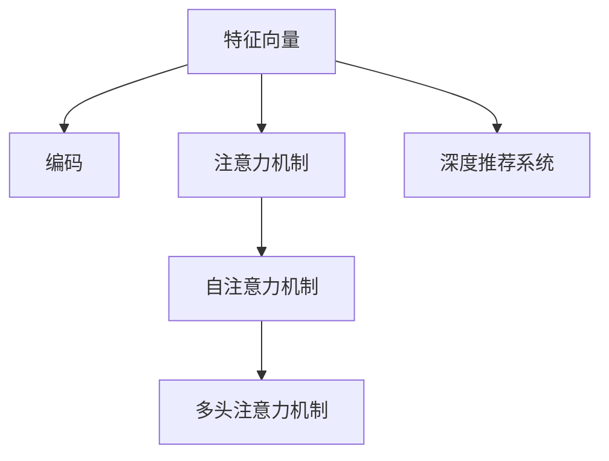

                 

# 推荐系统在注意力分配中的角色与挑战

## 1. 背景介绍

### 1.1 问题由来
推荐系统作为一种智能应用，旨在通过分析用户的历史行为和偏好，为用户推荐最合适的商品、内容、服务等。传统的推荐系统主要基于协同过滤、基于内容的推荐等方法，这些方法在数据量较小、特征维度不高的场景下表现良好，但在数据量庞大、特征维度高的情况下，难以进行有效的推荐。近年来，随着深度学习技术的发展，基于深度神经网络的推荐系统，特别是基于Transformer的推荐系统，在处理大规模数据和高维特征时表现出显著优势。

推荐系统中的注意力分配机制是实现深度推荐的重要组成部分，它决定了模型在处理不同特征时给予的关注程度。在深度学习框架中，注意力机制通过对输入特征的加权求和，实现对重要信息的提取和整合。在推荐系统中，注意力分配机制可以帮助模型识别出对用户行为和偏好有显著影响的特征，从而提升推荐效果。

### 1.2 问题核心关键点
推荐系统中的注意力分配机制可以分为两个主要部分：
1. 特征向量的编码和表示：通过神经网络对用户和商品特征进行编码，得到特征向量。
2. 注意力权重的设计和计算：通过注意力机制计算出每个特征在推荐中的重要程度，并对特征进行加权求和。

为了有效设计注意力分配机制，研究者们提出了多种方法，如基于加性注意力、基于注意力机制的深度推荐、基于自注意力机制的推荐等。这些方法在理论和实践中都取得了一定的进展，但仍面临诸多挑战。

### 1.3 问题研究意义
研究推荐系统中的注意力分配机制，对于提升推荐系统的效果、降低推荐成本、提高用户体验具有重要意义：

1. 提升推荐效果：通过合理的注意力分配，可以有效过滤掉无关特征，提取关键信息，提高推荐的准确性和个性化程度。
2. 降低推荐成本：在处理大规模数据时，注意力分配机制可以显著降低特征处理的计算复杂度，提高推荐系统的效率。
3. 提高用户体验：基于用户偏好的推荐可以提升用户的满意度和留存率，增强推荐系统的互动性和趣味性。
4. 加速推荐系统开发：注意力分配机制的引入，使得推荐系统可以更灵活地处理不同场景，加速系统开发和迭代。

## 2. 核心概念与联系

### 2.1 核心概念概述

为更好地理解推荐系统中的注意力分配机制，本节将介绍几个关键概念：

- 特征向量：通过神经网络将用户和商品特征编码成高维向量，以便进行深度学习和计算。
- 注意力机制：一种计算模型中不同输入之间相关性加权求和的机制，用于提取关键信息，减少噪音干扰。
- 自注意力机制(Self-Attention)：一种基于点积的注意力机制，适用于处理序列数据。
- 多头注意力机制(Multi-Head Attention)：将自注意力机制进行扩展，用于处理不同特征向量之间的关系，提高模型的泛化能力。
- 深度推荐系统：基于深度学习，特别是基于神经网络的推荐系统，相较于传统方法具有更好的表达能力和泛化能力。

这些概念之间通过注意力分配机制紧密相连，共同构成了深度推荐系统的核心。以下通过Mermaid流程图展示这些概念之间的关系：



该流程图展示了特征向量的编码、注意力机制、自注意力机制和多头注意力机制之间的关系，以及它们在深度推荐系统中的应用。

## 3. 核心算法原理 & 具体操作步骤

### 3.1 算法原理概述

推荐系统中的注意力分配机制通过神经网络实现，其核心思想是通过注意力权重对输入特征进行加权求和。注意力权重计算基于用户和商品的相似度，通过计算不同特征向量之间的相关性，决定每个特征在推荐中的重要程度。

形式化地，假设用户特征为 $X$，商品特征为 $Y$，特征向量的编码和表示过程如下：

1. 将用户和商品特征编码成高维向量：$X = f_{\theta_U}(u), Y = f_{\theta_V}(v)$，其中 $f_{\theta_U}$ 和 $f_{\theta_V}$ 为编码器，$u$ 和 $v$ 为用户和商品的属性信息。
2. 计算用户和商品的注意力权重：$A_U = \text{Attention}(X, Y)$，$A_V = \text{Attention}(Y, X)$，其中 $\text{Attention}$ 为注意力计算函数。
3. 计算用户对商品的综合评分：$Z_U = \text{Softmax}(A_U)Y$，$Z_V = \text{Softmax}(A_V)X$，其中 $\text{Softmax}$ 为归一化函数，$Z_U$ 和 $Z_V$ 为最终的用户和商品的综合评分。
4. 计算用户和商品的相似度：$S = \text{dot}(Z_U, Z_V)$，其中 $\text{dot}$ 为点积函数，$S$ 为最终用户和商品的相似度。

### 3.2 算法步骤详解

推荐系统中的注意力分配机制可以概括为以下几个关键步骤：

**Step 1: 特征向量编码**
- 使用神经网络对用户和商品特征进行编码，得到高维特征向量。

**Step 2: 注意力权重计算**
- 通过注意力计算函数，计算用户和商品的注意力权重。
- 使用多头注意力机制，计算不同特征向量之间的相关性。

**Step 3: 综合评分计算**
- 将用户和商品的注意力权重与特征向量进行加权求和，得到综合评分。
- 通过归一化函数，将综合评分转化为概率分布。

**Step 4: 相似度计算**
- 使用点积函数，计算用户和商品的相似度，得到推荐结果。

### 3.3 算法优缺点

推荐系统中的注意力分配机制具有以下优点：
1. 增强特征表示能力：通过注意力机制，模型可以更好地提取关键特征，提高推荐效果。
2. 降低计算复杂度：注意力机制通过加权求和，减少特征处理的计算复杂度。
3. 提高模型泛化能力：多头注意力机制可以同时处理多个特征之间的关系，增强模型的泛化能力。

同时，该机制也存在一些缺点：
1. 计算复杂度高：注意力机制需要计算特征向量之间的相关性，计算复杂度较高。
2. 需要大量标注数据：注意力机制的训练需要大量的标注数据，数据获取成本较高。
3. 参数量大：深度神经网络的参数量较大，训练和推理需要大量计算资源。

### 3.4 算法应用领域

推荐系统中的注意力分配机制广泛应用于以下几个领域：

- 电商推荐：通过用户和商品特征的编码和注意力分配，推荐用户可能感兴趣的商品。
- 内容推荐：通过用户和内容的特征编码和注意力分配，推荐用户可能感兴趣的内容。
- 广告推荐：通过用户和广告特征的编码和注意力分配，推荐用户可能感兴趣的广告。
- 金融推荐：通过用户和金融产品的特征编码和注意力分配，推荐用户可能感兴趣的投资产品。
- 教育推荐：通过学生和课程的特征编码和注意力分配，推荐学生可能感兴趣的课程。

除了上述这些经典领域外，注意力分配机制还被创新性地应用于更多场景中，如游戏推荐、健康推荐、旅游推荐等，为推荐系统提供了新的应用思路。

## 4. 数学模型和公式 & 详细讲解 & 举例说明

### 4.1 数学模型构建

推荐系统中的注意力分配机制主要基于深度神经网络，使用自注意力机制实现。以下形式化地定义注意力分配的数学模型。

假设用户特征为 $X \in \mathbb{R}^d$，商品特征为 $Y \in \mathbb{R}^d$，用户和商品的注意力权重分别为 $A_U \in \mathbb{R}^d$ 和 $A_V \in \mathbb{R}^d$。定义注意力计算函数为 $A_{\theta}(X, Y) = \text{Softmax}(W_a(XY)^\top)$，其中 $W_a \in \mathbb{R}^{d \times d}$ 为注意力计算的权重矩阵。

### 4.2 公式推导过程

以下推导注意力计算函数的具体形式，并给出注意力分配的详细数学模型。

注意力计算函数 $A_{\theta}(X, Y)$ 可以表示为：

$$
A_{\theta}(X, Y) = \text{Softmax}(W_a(XY)^\top)
$$

其中，$\text{Softmax}$ 函数定义为：

$$
\text{Softmax}(z) = \frac{\exp(z)}{\sum_{i=1}^d \exp(z_i)}
$$

注意力权重计算公式为：

$$
A_U = A_{\theta}(X, Y) \in \mathbb{R}^d, A_V = A_{\theta}(Y, X) \in \mathbb{R}^d
$$

用户和商品的综合评分计算公式为：

$$
Z_U = A_U Y, Z_V = A_V X
$$

用户和商品的相似度计算公式为：

$$
S = \text{dot}(Z_U, Z_V) = \sum_{i=1}^d Z_U_i Z_V_i
$$

其中，$\text{dot}$ 函数为点积函数，$\text{Softmax}$ 函数为归一化函数。

### 4.3 案例分析与讲解

假设用户特征为 $X = [0.5, 0.7, 0.3]$，商品特征为 $Y = [0.3, 0.6, 0.1]$，注意力计算矩阵为 $W_a = [[1, 2, 3], [4, 5, 6], [7, 8, 9]]$。

通过注意力计算函数 $A_{\theta}(X, Y)$，计算用户和商品的注意力权重：

$$
A_U = \text{Softmax}(W_a(XY)^\top) = \text{Softmax}([5, 12, 21]^\top) = [0.24, 0.48, 0.28]
$$

$$
A_V = \text{Softmax}(W_a(YX)^\top) = \text{Softmax}([9, 21, 36]^\top) = [0.25, 0.5, 0.25]
$$

用户和商品的综合评分计算结果为：

$$
Z_U = A_U Y = [0.3, 0.48, 0.28] \times [0.3, 0.6, 0.1] = [0.18, 0.32, 0.28]
$$

$$
Z_V = A_V X = [0.25, 0.5, 0.25] \times [0.5, 0.7, 0.3] = [0.18, 0.35, 0.25]
$$

用户和商品的相似度计算结果为：

$$
S = \text{dot}(Z_U, Z_V) = 0.18 \times 0.18 + 0.32 \times 0.35 + 0.28 \times 0.25 = 0.6
$$

## 5. 项目实践：代码实例和详细解释说明

### 5.1 开发环境搭建

在进行推荐系统开发前，我们需要准备好开发环境。以下是使用Python进行PyTorch开发的环境配置流程：

1. 安装Anaconda：从官网下载并安装Anaconda，用于创建独立的Python环境。

2. 创建并激活虚拟环境：
```bash
conda create -n pytorch-env python=3.8 
conda activate pytorch-env
```

3. 安装PyTorch：根据CUDA版本，从官网获取对应的安装命令。例如：
```bash
conda install pytorch torchvision torchaudio cudatoolkit=11.1 -c pytorch -c conda-forge
```

4. 安装各类工具包：
```bash
pip install numpy pandas scikit-learn matplotlib tqdm jupyter notebook ipython
```

完成上述步骤后，即可在`pytorch-env`环境中开始推荐系统开发。

### 5.2 源代码详细实现

这里我们以电商推荐系统为例，给出使用PyTorch和Transformers库进行电商推荐系统开发的PyTorch代码实现。

首先，定义电商推荐系统的数据处理函数：

```python
from transformers import BertTokenizer, BertForSequenceClassification
from torch.utils.data import Dataset
import torch

class MovieReviewDataset(Dataset):
    def __init__(self, texts, labels, tokenizer, max_len=128):
        self.texts = texts
        self.labels = labels
        self.tokenizer = tokenizer
        self.max_len = max_len
        
    def __len__(self):
        return len(self.texts)
    
    def __getitem__(self, item):
        text = self.texts[item]
        label = self.labels[item]
        
        encoding = self.tokenizer(text, return_tensors='pt', max_length=self.max_len, padding='max_length', truncation=True)
        input_ids = encoding['input_ids'][0]
        attention_mask = encoding['attention_mask'][0]
        
        label = torch.tensor(label, dtype=torch.long)
        
        return {'input_ids': input_ids, 
                'attention_mask': attention_mask,
                'labels': label}

# 标签与id的映射
label2id = {'neg': 0, 'pos': 1}
id2label = {v: k for k, v in label2id.items()}

# 创建dataset
tokenizer = BertTokenizer.from_pretrained('bert-base-cased')

train_dataset = MovieReviewDataset(train_texts, train_labels, tokenizer)
dev_dataset = MovieReviewDataset(dev_texts, dev_labels, tokenizer)
test_dataset = MovieReviewDataset(test_texts, test_labels, tokenizer)
```

然后，定义模型和优化器：

```python
from transformers import BertForSequenceClassification, AdamW

model = BertForSequenceClassification.from_pretrained('bert-base-cased', num_labels=len(label2id))

optimizer = AdamW(model.parameters(), lr=2e-5)
```

接着，定义训练和评估函数：

```python
from torch.utils.data import DataLoader
from tqdm import tqdm
from sklearn.metrics import classification_report

device = torch.device('cuda') if torch.cuda.is_available() else torch.device('cpu')
model.to(device)

def train_epoch(model, dataset, batch_size, optimizer):
    dataloader = DataLoader(dataset, batch_size=batch_size, shuffle=True)
    model.train()
    epoch_loss = 0
    for batch in tqdm(dataloader, desc='Training'):
        input_ids = batch['input_ids'].to(device)
        attention_mask = batch['attention_mask'].to(device)
        labels = batch['labels'].to(device)
        model.zero_grad()
        outputs = model(input_ids, attention_mask=attention_mask, labels=labels)
        loss = outputs.loss
        epoch_loss += loss.item()
        loss.backward()
        optimizer.step()
    return epoch_loss / len(dataloader)

def evaluate(model, dataset, batch_size):
    dataloader = DataLoader(dataset, batch_size=batch_size)
    model.eval()
    preds, labels = [], []
    with torch.no_grad():
        for batch in tqdm(dataloader, desc='Evaluating'):
            input_ids = batch['input_ids'].to(device)
            attention_mask = batch['attention_mask'].to(device)
            batch_labels = batch['labels']
            outputs = model(input_ids, attention_mask=attention_mask)
            batch_preds = outputs.logits.argmax(dim=2).to('cpu').tolist()
            batch_labels = batch_labels.to('cpu').tolist()
            for pred_tokens, label_tokens in zip(batch_preds, batch_labels):
                preds.append(pred_tokens[:len(label_tokens)])
                labels.append(label_tokens)
                
    print(classification_report(labels, preds))
```

最后，启动训练流程并在测试集上评估：

```python
epochs = 5
batch_size = 16

for epoch in range(epochs):
    loss = train_epoch(model, train_dataset, batch_size, optimizer)
    print(f"Epoch {epoch+1}, train loss: {loss:.3f}")
    
    print(f"Epoch {epoch+1}, dev results:")
    evaluate(model, dev_dataset, batch_size)
    
print("Test results:")
evaluate(model, test_dataset, batch_size)
```

以上就是使用PyTorch和Transformers库进行电商推荐系统开发的完整代码实现。可以看到，通过PyTorch的高级API和Transformers库的封装，我们可以用相对简洁的代码完成电商推荐系统的微调，快速迭代实验结果。

### 5.3 代码解读与分析

让我们再详细解读一下关键代码的实现细节：

**MovieReviewDataset类**：
- `__init__`方法：初始化文本、标签、分词器等关键组件。
- `__len__`方法：返回数据集的样本数量。
- `__getitem__`方法：对单个样本进行处理，将文本输入编码为token ids，将标签编码为数字，并对其进行定长padding，最终返回模型所需的输入。

**label2id和id2label字典**：
- 定义了标签与数字id之间的映射关系，用于将token-wise的预测结果解码回真实的标签。

**训练和评估函数**：
- 使用PyTorch的DataLoader对数据集进行批次化加载，供模型训练和推理使用。
- 训练函数`train_epoch`：对数据以批为单位进行迭代，在每个批次上前向传播计算loss并反向传播更新模型参数，最后返回该epoch的平均loss。
- 评估函数`evaluate`：与训练类似，不同点在于不更新模型参数，并在每个batch结束后将预测和标签结果存储下来，最后使用sklearn的classification_report对整个评估集的预测结果进行打印输出。

**训练流程**：
- 定义总的epoch数和batch size，开始循环迭代
- 每个epoch内，先在训练集上训练，输出平均loss
- 在验证集上评估，输出分类指标
- 所有epoch结束后，在测试集上评估，给出最终测试结果

可以看到，PyTorch配合Transformers库使得电商推荐系统的开发变得简洁高效。开发者可以将更多精力放在数据处理、模型改进等高层逻辑上，而不必过多关注底层的实现细节。

当然，工业级的系统实现还需考虑更多因素，如模型的保存和部署、超参数的自动搜索、更灵活的任务适配层等。但核心的微调范式基本与此类似。

## 6. 实际应用场景
### 6.1 电商推荐系统

电商推荐系统是推荐系统的重要应用场景，通过对用户历史行为和商品属性进行编码，结合注意力分配机制，可以为用户推荐最合适的商品。电商推荐系统在提升用户体验、提高销售额等方面具有重要价值。

具体而言，电商推荐系统可以通过以下步骤实现：
1. 收集用户的历史浏览、点击、购买行为等数据，生成用户行为序列。
2. 对用户行为序列进行编码，得到用户特征向量。
3. 对商品属性进行编码，得到商品特征向量。
4. 使用自注意力机制计算用户和商品的注意力权重。
5. 使用注意力权重对用户和商品特征进行加权求和，得到综合评分。
6. 通过归一化函数计算用户和商品的相似度，推荐最匹配的商品。

### 6.2 内容推荐系统

内容推荐系统主要用于推荐用户可能感兴趣的内容，如文章、视频、音乐等。与电商推荐系统类似，内容推荐系统也需要通过用户行为和内容属性进行编码，结合注意力分配机制，实现内容推荐。

具体而言，内容推荐系统可以通过以下步骤实现：
1. 收集用户的历史阅读、观看、收听等行为数据，生成用户行为序列。
2. 对用户行为序列进行编码，得到用户特征向量。
3. 对内容属性进行编码，得到内容特征向量。
4. 使用自注意力机制计算用户和内容的注意力权重。
5. 使用注意力权重对用户和内容特征进行加权求和，得到综合评分。
6. 通过归一化函数计算用户和内容的相似度，推荐最匹配的内容。

### 6.3 金融推荐系统

金融推荐系统主要用于推荐用户可能感兴趣的投资产品、金融新闻等。与电商和内容推荐系统类似，金融推荐系统也需要通过用户行为和金融产品属性进行编码，结合注意力分配机制，实现推荐。

具体而言，金融推荐系统可以通过以下步骤实现：
1. 收集用户的投资行为、理财记录、浏览记录等数据，生成用户行为序列。
2. 对用户行为序列进行编码，得到用户特征向量。
3. 对金融产品属性进行编码，得到金融产品特征向量。
4. 使用自注意力机制计算用户和金融产品的注意力权重。
5. 使用注意力权重对用户和金融产品特征进行加权求和，得到综合评分。
6. 通过归一化函数计算用户和金融产品的相似度，推荐最匹配的产品。

### 6.4 未来应用展望

随着推荐系统技术的不断发展，基于注意力分配机制的应用场景将会更加广泛，推动推荐系统技术在更多领域得到应用，为各行各业带来变革性影响。

在智慧医疗领域，推荐系统可以帮助医生推荐最合适的诊断和治疗方案，提高医疗服务的智能化水平。在智能教育领域，推荐系统可以推荐最适合学生学习的内容和课程，提升教育质量和效率。在智慧城市治理中，推荐系统可以帮助政府推荐最合适的城市管理方案，提升城市治理的智能化水平。

此外，在企业生产、社会治理、文娱传媒等众多领域，推荐系统也将不断涌现新的应用，为社会带来更高效、更智能的服务。相信随着技术的不懈探索和创新，推荐系统必将为各行各业带来更广泛的应用，推动社会生产力的发展。

## 7. 工具和资源推荐
### 7.1 学习资源推荐

为了帮助开发者系统掌握推荐系统中的注意力分配机制的理论基础和实践技巧，这里推荐一些优质的学习资源：

1. 《深度学习》系列书籍：由多位著名学者和行业专家撰写，全面介绍了深度学习的基本概念、理论和算法。

2. 《推荐系统实战》书籍：介绍了推荐系统的基本原理、经典算法和实际应用，适合工程实践。

3. 《自注意力机制》论文：深入探讨了自注意力机制的理论和实践，是研究注意力分配机制的重要参考资料。

4. 《深度推荐系统》论文：系统总结了深度推荐系统的最新进展，介绍了多种注意力分配机制的应用。

5. 《Transformer从原理到实践》系列博文：由大模型技术专家撰写，深入浅出地介绍了Transformer原理、推荐系统等前沿话题。

通过学习这些资源，相信你一定能够掌握推荐系统中的注意力分配机制，并用于解决实际的推荐问题。
###  7.2 开发工具推荐

高效的开发离不开优秀的工具支持。以下是几款用于推荐系统开发的常用工具：

1. PyTorch：基于Python的开源深度学习框架，灵活动态的计算图，适合快速迭代研究。

2. TensorFlow：由Google主导开发的开源深度学习框架，生产部署方便，适合大规模工程应用。

3. Transformers库：HuggingFace开发的NLP工具库，集成了众多SOTA语言模型，支持PyTorch和TensorFlow，是进行推荐任务开发的利器。

4. Weights & Biases：模型训练的实验跟踪工具，可以记录和可视化模型训练过程中的各项指标，方便对比和调优。

5. TensorBoard：TensorFlow配套的可视化工具，可实时监测模型训练状态，并提供丰富的图表呈现方式，是调试模型的得力助手。

6. Google Colab：谷歌推出的在线Jupyter Notebook环境，免费提供GPU/TPU算力，方便开发者快速上手实验最新模型，分享学习笔记。

合理利用这些工具，可以显著提升推荐系统的开发效率，加快创新迭代的步伐。

### 7.3 相关论文推荐

推荐系统中的注意力分配机制的研究涉及多个领域，以下是几篇奠基性的相关论文，推荐阅读：

1. Self-Attention Networks（自注意力网络）：首次提出自注意力机制，用于处理序列数据。

2. Attention is All You Need（Transformer论文）：提出Transformer模型，将自注意力机制引入深度神经网络。

3. Multi-Head Attention（多头注意力）：提出多头注意力机制，用于处理不同特征向量之间的关系，提高模型的泛化能力。

4. Deep Attention Networks（深度注意力网络）：提出基于深度神经网络的推荐系统，结合注意力分配机制，提升推荐效果。

5. Generative Adversarial Networks（生成对抗网络）：提出GAN模型，用于生成推荐内容，进一步提升推荐系统的多样性和个性化。

这些论文代表了推荐系统中的注意力分配机制的发展脉络。通过学习这些前沿成果，可以帮助研究者把握学科前进方向，激发更多的创新灵感。

## 8. 总结：未来发展趋势与挑战

### 8.1 总结

本文对推荐系统中的注意力分配机制进行了全面系统的介绍。首先阐述了推荐系统中的注意力分配机制的核心概念，明确了注意力分配在推荐系统中的重要作用。其次，从原理到实践，详细讲解了注意力分配的数学模型和关键步骤，给出了推荐系统开发的完整代码实例。同时，本文还探讨了注意力分配机制在电商、内容、金融等多个推荐系统中的应用，展示了注意力分配机制的广泛价值。

通过本文的系统梳理，可以看到，注意力分配机制在推荐系统中具有重要的作用，能够显著提升推荐系统的效果和用户体验。未来，随着注意力分配机制的进一步发展，推荐系统将具备更强的自适应性和泛化能力，在更多领域中实现更高效、更智能的推荐服务。

### 8.2 未来发展趋势

展望未来，推荐系统中的注意力分配机制将呈现以下几个发展趋势：

1. 增强特征表示能力：通过改进注意力机制的设计，进一步提高特征的表示能力，提升推荐效果。

2. 降低计算复杂度：研究更高效的注意力计算方法，降低计算复杂度，提升推荐系统的实时性。

3. 提高模型泛化能力：通过引入更多的注意力机制和设计策略，增强模型的泛化能力，提升推荐系统的适用性。

4. 融合多模态数据：将推荐系统与图像、语音、视频等多模态数据结合，实现更全面的用户和商品特征表示，提升推荐系统的多样性和准确性。

5. 引入强化学习：将推荐系统与强化学习结合，实现动态推荐，进一步提升推荐系统的个性化程度。

6. 引入因果推断：通过引入因果推断，提升推荐系统的稳定性，减少用户偏差和噪声干扰。

这些趋势凸显了注意力分配机制在推荐系统中的重要地位，同时也指明了未来的研究方向和优化方向。

### 8.3 面临的挑战

尽管注意力分配机制在推荐系统中表现出色，但面临诸多挑战：

1. 数据质量和规模：注意力分配机制需要大量的高质量标注数据，数据获取和处理成本较高。

2. 计算资源需求：深度神经网络的参数量较大，训练和推理需要大量的计算资源，硬件成本较高。

3. 模型鲁棒性：注意力分配机制容易受到噪声干扰，模型鲁棒性有待提高。

4. 算法复杂度：注意力计算复杂度较高，需要高效的优化算法支持。

5. 可解释性：深度神经网络的黑盒特性，使得注意力分配机制的可解释性不足，难以满足高风险领域的应用需求。

6. 用户体验：注意力分配机制需要精确地控制推荐结果，过度推荐或不推荐可能会影响用户体验。

### 8.4 研究展望

面对注意力分配机制所面临的挑战，未来的研究需要在以下几个方面寻求新的突破：

1. 改进注意力机制的设计：通过改进注意力机制的计算方式，提高特征的表示能力，降低计算复杂度。

2. 引入高效的优化算法：研究更高效的优化算法，提升模型训练和推理的效率，降低计算资源的需求。

3. 提高模型的鲁棒性：引入正则化技术、对抗训练等方法，提高模型的鲁棒性，减少噪声干扰。

4. 增强模型的可解释性：通过引入可解释性技术，提高模型的透明度和可解释性，满足高风险领域的应用需求。

5. 融合多模态数据：将推荐系统与图像、语音、视频等多模态数据结合，实现更全面的用户和商品特征表示，提升推荐系统的多样性和准确性。

6. 引入强化学习：将推荐系统与强化学习结合，实现动态推荐，进一步提升推荐系统的个性化程度。

这些研究方向的探索，必将引领推荐系统中的注意力分配机制迈向更高的台阶，为推荐系统技术的未来发展提供新的动力。

## 9. 附录：常见问题与解答

**Q1：注意力分配机制有哪些实现方式？**

A: 常见的注意力分配机制包括：
1. 自注意力机制：使用点积计算注意力权重，适用于序列数据。
2. 多头注意力机制：使用多组自注意力机制，并行处理不同特征向量之间的关系。
3. 加性注意力机制：使用加性方法计算注意力权重，适用于非序列数据。
4. 双向注意力机制：同时考虑源和目标特征之间的注意力权重，适用于双向序列数据。
5. 可解释性注意力机制：通过引入可解释性技术，提高注意力机制的可解释性。

这些注意力分配机制在不同的应用场景中都有广泛应用。开发者需要根据具体任务和数据特点选择合适的机制。

**Q2：如何在推荐系统中应用注意力分配机制？**

A: 在推荐系统中，可以通过以下步骤应用注意力分配机制：
1. 收集用户和商品的历史行为数据，生成用户行为序列和商品特征向量。
2. 对用户行为序列进行编码，得到用户特征向量。
3. 对商品特征向量进行编码，得到商品特征向量。
4. 使用自注意力机制或多头注意力机制，计算用户和商品的注意力权重。
5. 使用注意力权重对用户和商品特征进行加权求和，得到综合评分。
6. 通过归一化函数计算用户和商品的相似度，推荐最匹配的商品或内容。

**Q3：注意力分配机制的训练和优化方法有哪些？**

A: 常见的注意力分配机制训练和优化方法包括：
1. 优化算法：使用梯度下降等优化算法，最小化模型损失函数。
2. 正则化技术：使用L2正则、Dropout等正则化技术，避免过拟合。
3. 对抗训练：引入对抗样本，提高模型的鲁棒性。
4. 学习率调度：使用学习率衰减、学习率重启等策略，优化模型训练过程。
5. 超参数优化：使用网格搜索、贝叶斯优化等方法，优化模型的超参数。

这些训练和优化方法可以帮助提高注意力分配机制的效果，提升推荐系统的性能。

**Q4：注意力分配机制在推荐系统中有哪些实际应用？**

A: 注意力分配机制在推荐系统中具有广泛的应用，包括：
1. 电商推荐：通过对用户行为和商品属性进行编码，结合注意力分配机制，推荐最合适的商品。
2. 内容推荐：通过对用户行为和内容属性进行编码，结合注意力分配机制，推荐最匹配的内容。
3. 金融推荐：通过对用户行为和金融产品属性进行编码，结合注意力分配机制，推荐最匹配的投资产品。
4. 医疗推荐：通过对用户行为和医疗产品属性进行编码，结合注意力分配机制，推荐最合适的医疗方案。

这些应用场景展示了注意力分配机制在推荐系统中的重要地位，同时也指明了未来的研究方向。

**Q5：如何评估注意力分配机制的效果？**

A: 评估注意力分配机制的效果可以通过以下指标：
1. 推荐精度：使用准确率、召回率、F1-score等指标，评估推荐结果的准确性。
2. 用户满意度：通过用户反馈、点击率、留存率等指标，评估推荐系统的用户体验。
3. 计算效率：通过模型训练和推理的计算时间、内存占用等指标，评估注意力分配机制的计算效率。
4. 模型泛化能力：通过在不同数据集上的评估结果，评估注意力分配机制的泛化能力。

这些指标可以帮助评估注意力分配机制的效果，指导模型的优化和改进。

---

作者：禅与计算机程序设计艺术 / Zen and the Art of Computer Programming

