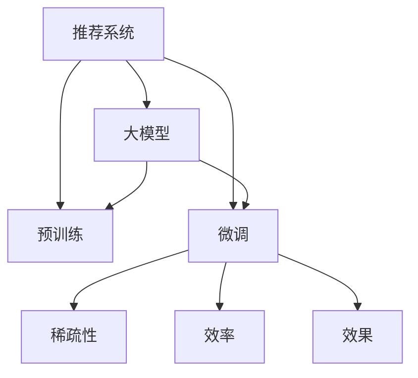

                 

# 推荐系统的未来：大模型的主导地位

> 关键词：推荐系统, 大模型, 预训练, 微调, 稀疏性, 效率, 效果

## 1. 背景介绍

随着互联网的迅猛发展，推荐系统成为了信息时代的重要基础设施。用户每天都在生成海量的行为数据，推荐系统通过分析这些数据，为用户提供个性化的信息和服务，极大地提升了用户体验。然而，传统的推荐系统主要依赖于手工特征工程和人工规则，难以应对数据的多样性和动态性。近年来，以大模型为代表的人工智能技术逐渐引入推荐系统，带来了革命性的变化。本文将系统地介绍大模型在推荐系统中的应用，分析其优缺点，展望未来发展趋势。

## 2. 核心概念与联系

### 2.1 核心概念概述

为更好地理解大模型在推荐系统中的应用，本节将介绍几个密切相关的核心概念：

- 推荐系统(Recommender System)：利用用户行为数据，为用户推荐感兴趣的商品、内容、服务等信息。常见的推荐方法包括协同过滤、基于内容的推荐、混合推荐等。

- 大模型(Large Model)：以深度神经网络为代表的超大规模模型，如BERT、GPT等。通过在大规模无标签数据上进行预训练，学习到丰富的语义和知识表示，具备强大的数据建模能力。

- 预训练(Pre-training)：指在大规模无标签数据上，通过自监督学习任务训练模型，使其具备通用的语言和知识表示。常见任务包括掩码语言模型、 next sentence prediction等。

- 微调(Fine-tuning)：指在预训练模型的基础上，使用有标签数据进行优化，使模型适配特定推荐场景。通常仅调整模型顶层参数，保持底层参数不变。

- 稀疏性(Sparsity)：推荐系统数据往往稀疏，即用户行为数据通常只有很小比例是感兴趣的，如何高效处理稀疏数据是推荐系统的重要课题。

- 效率(Efficiency)：推荐系统需要处理大量数据，如何快速、高效地计算和推理是系统性能的关键。

- 效果(Effectiveness)：推荐系统最终的目标是为用户提供精准、有价值的推荐，效果评估通常通过点击率、转化率等指标来衡量。

这些核心概念之间的逻辑关系可以通过以下Mermaid流程图来展示：



这个流程图展示了大模型在推荐系统中的应用流程：

1. 大模型通过预训练学习到通用的知识表示。
2. 在特定推荐场景下，大模型通过微调适配具体任务，提升推荐效果。
3. 微调模型需要处理大量稀疏数据，并兼顾计算效率和效果。

## 3. 核心算法原理 & 具体操作步骤

### 3.1 算法原理概述

大模型在推荐系统中的应用，主要分为两个步骤：预训练和微调。其核心思想是：利用预训练模型强大的语义建模能力，结合微调技术适配特定推荐任务，从而获得高性能的推荐结果。

在预训练阶段，大模型通过在大规模无标签数据上进行掩码语言模型、 next sentence prediction等自监督学习任务，学习到丰富的语言和知识表示。这些表示可以被应用于多种下游任务，包括推荐系统。在微调阶段，推荐系统任务通常可以被看作是分类任务，使用二分类交叉熵损失函数进行优化。

### 3.2 算法步骤详解

大模型在推荐系统中的微调通常包括以下几个关键步骤：

**Step 1: 准备数据集**

- 收集推荐系统任务的数据集，包括用户行为数据、商品/内容特征数据等。
- 数据集应具有较高的稀疏性，以反映用户的真实行为。
- 将数据集划分为训练集、验证集和测试集，并进行适当的预处理，如特征归一化、缺失值填充等。

**Step 2: 选择模型和初始化参数**

- 选择合适的预训练大模型，如BERT、GPT等。
- 加载预训练模型参数，并冻结模型的底层参数，仅微调顶层参数。
- 定义分类任务的目标函数，如二分类交叉熵损失函数。

**Step 3: 微调训练**

- 将训练集数据分批次输入模型，进行前向传播和后向传播。
- 使用AdamW、SGD等优化算法更新模型参数。
- 周期性在验证集上评估模型效果，根据效果调整学习率、超参数等。
- 重复上述步骤，直到满足预设的迭代轮数或验证集效果不再提升。

**Step 4: 测试和部署**

- 在测试集上评估微调后模型的效果，如准确率、点击率等指标。
- 使用微调后的模型对新数据进行推荐，集成到推荐系统中。
- 持续收集用户反馈和行为数据，定期重新微调模型。

### 3.3 算法优缺点

大模型在推荐系统中的应用具有以下优点：

1. 强大的语义建模能力。预训练模型学习到丰富的语言和知识表示，能够自动发现用户行为背后的语义关系，提升推荐效果。
2. 通用性强。预训练模型可以应用于多种推荐任务，通过微调适配具体场景。
3. 稀疏性处理。通过稀疏矩阵和自适应嵌入技术，可以有效处理稀疏数据，提升推荐性能。
4. 效率高。利用GPU/TPU等高性能计算设备，可以快速训练和推理，满足实时推荐需求。

同时，该方法也存在一定的局限性：

1. 数据需求大。微调需要大量的有标签数据，而推荐系统数据通常是稀疏的。
2. 资源消耗高。大模型参数量巨大，对计算资源和内存的要求较高。
3. 效果依赖标注。微调效果很大程度上依赖标注数据的质量和数量，标注成本较高。
4. 对抗样本敏感。微调模型对输入的对抗性变化敏感，可能产生误导性的推荐结果。

尽管存在这些局限性，但就目前而言，基于大模型的推荐方法已成为推荐系统的主流范式。未来相关研究的重点在于如何进一步降低数据需求，提高模型效率和鲁棒性，同时兼顾可解释性和伦理安全性等因素。

### 3.4 算法应用领域

基于大模型的推荐方法在多个推荐系统任务上取得了显著效果，例如：

- 商品推荐：推荐系统基于用户的历史行为数据，为用户推荐感兴趣的商品。通过微调BERT模型，能够自动学习商品和用户之间的语义关系，提升推荐精度。
- 音乐推荐：推荐系统根据用户的听歌行为，为用户推荐喜欢的音乐。通过微调预训练语言模型，能够分析歌曲的文本信息，挖掘音乐的情感色彩，提升推荐效果。
- 视频推荐：推荐系统根据用户的观看历史，为用户推荐感兴趣的视频。通过微调预训练模型，能够分析视频的标题、标签等文本信息，提升推荐准确率。
- 新闻推荐：推荐系统根据用户的阅读行为，为用户推荐感兴趣的新闻。通过微调预训练语言模型，能够理解新闻标题和内容的语义关系，提升推荐相关性。

除了上述这些经典任务外，大模型还创新性地应用于内容生成、广告推荐、个性化服务等多个推荐场景中，为推荐系统带来了新的突破。随着预训练模型和微调方法的不断进步，相信推荐系统将在更广泛的领域得到应用，为用户带来更优质的信息和服务。

## 4. 数学模型和公式 & 详细讲解 & 举例说明

### 4.1 数学模型构建

本节将使用数学语言对基于大模型的推荐系统微调过程进行更加严格的刻画。

记推荐系统任务的数据集为 $D=\{(x_i, y_i)\}_{i=1}^N, x_i \in \mathcal{X}, y_i \in \mathcal{Y}$，其中 $x_i$ 表示用户行为数据，$y_i$ 表示推荐结果。假设微调的模型为 $M_{\theta}$，其中 $\theta$ 为模型参数。

定义模型 $M_{\theta}$ 在数据样本 $(x,y)$ 上的损失函数为 $\ell(M_{\theta}(x),y)$，则在数据集 $D$ 上的经验风险为：

$$
\mathcal{L}(\theta) = \frac{1}{N} \sum_{i=1}^N \ell(M_{\theta}(x_i),y_i)
$$

微调的优化目标是最小化经验风险，即找到最优参数：

$$
\theta^* = \mathop{\arg\min}_{\theta} \mathcal{L}(\theta)
$$

在实践中，我们通常使用基于梯度的优化算法（如SGD、Adam等）来近似求解上述最优化问题。设 $\eta$ 为学习率，$\lambda$ 为正则化系数，则参数的更新公式为：

$$
\theta \leftarrow \theta - \eta \nabla_{\theta}\mathcal{L}(\theta) - \eta\lambda\theta
$$

其中 $\nabla_{\theta}\mathcal{L}(\theta)$ 为损失函数对参数 $\theta$ 的梯度，可通过反向传播算法高效计算。

### 4.2 公式推导过程

以下我们以二分类任务为例，推导交叉熵损失函数及其梯度的计算公式。

假设模型 $M_{\theta}$ 在输入 $x$ 上的输出为 $\hat{y}=M_{\theta}(x) \in [0,1]$，表示用户 $x$ 是否喜欢商品 $y$ 的概率。真实标签 $y \in \{0,1\}$。则二分类交叉熵损失函数定义为：

$$
\ell(M_{\theta}(x),y) = -[y\log \hat{y} + (1-y)\log (1-\hat{y})]
$$

将其代入经验风险公式，得：

$$
\mathcal{L}(\theta) = -\frac{1}{N}\sum_{i=1}^N [y_i\log M_{\theta}(x_i)+(1-y_i)\log(1-M_{\theta}(x_i))]
$$

根据链式法则，损失函数对参数 $\theta_k$ 的梯度为：

$$
\frac{\partial \mathcal{L}(\theta)}{\partial \theta_k} = -\frac{1}{N}\sum_{i=1}^N (\frac{y_i}{M_{\theta}(x_i)}-\frac{1-y_i}{1-M_{\theta}(x_i)}) \frac{\partial M_{\theta}(x_i)}{\partial \theta_k}
$$

其中 $\frac{\partial M_{\theta}(x_i)}{\partial \theta_k}$ 可进一步递归展开，利用自动微分技术完成计算。

### 4.3 案例分析与讲解

在推荐系统中，常见的目标函数包括交叉熵损失和点积损失。以交叉熵损失为例，我们可以用PyTorch来实现上述过程。以下是一个简单的例子，展示如何使用PyTorch进行基于大模型的推荐系统微调：

```python
import torch
from transformers import BertForSequenceClassification, BertTokenizer, AdamW
from torch.utils.data import DataLoader, Dataset
from sklearn.metrics import accuracy_score

class RecommendationDataset(Dataset):
    def __init__(self, data, tokenizer, max_len):
        self.data = data
        self.tokenizer = tokenizer
        self.max_len = max_len
    
    def __len__(self):
        return len(self.data)
    
    def __getitem__(self, item):
        inputs = self.tokenizer(self.data[item], max_length=self.max_len, padding='max_length', truncation=True, return_tensors='pt')
        return {'input_ids': inputs['input_ids'], 'attention_mask': inputs['attention_mask'], 'labels': torch.tensor(1 if self.data[item] else 0, dtype=torch.long)}

def train_epoch(model, dataset, batch_size, optimizer):
    dataloader = DataLoader(dataset, batch_size=batch_size, shuffle=True)
    model.train()
    epoch_loss = 0
    for batch in dataloader:
        input_ids = batch['input_ids'].to(device)
        attention_mask = batch['attention_mask'].to(device)
        labels = batch['labels'].to(device)
        model.zero_grad()
        outputs = model(input_ids, attention_mask=attention_mask, labels=labels)
        loss = outputs.loss
        epoch_loss += loss.item()
        loss.backward()
        optimizer.step()
    return epoch_loss / len(dataloader)

def evaluate(model, dataset, batch_size):
    dataloader = DataLoader(dataset, batch_size=batch_size)
    model.eval()
    predictions, labels = [], []
    with torch.no_grad():
        for batch in dataloader:
            input_ids = batch['input_ids'].to(device)
            attention_mask = batch['attention_mask'].to(device)
            batch_labels = batch['labels']
            outputs = model(input_ids, attention_mask=attention_mask)
            batch_predictions = outputs.logits.argmax(dim=1).to('cpu').tolist()
            batch_labels = batch_labels.to('cpu').tolist()
            predictions.extend(batch_predictions)
            labels.extend(batch_labels)
    return accuracy_score(labels, predictions)

# 加载数据
train_data = [...]  # 训练集数据
dev_data = [...]  # 验证集数据
test_data = [...]  # 测试集数据
tokenizer = BertTokenizer.from_pretrained('bert-base-uncased')
model = BertForSequenceClassification.from_pretrained('bert-base-uncased', num_labels=2)

# 训练模型
device = torch.device('cuda' if torch.cuda.is_available() else 'cpu')
model.to(device)
optimizer = AdamW(model.parameters(), lr=1e-5)

for epoch in range(5):
    loss = train_epoch(model, train_data, 32, optimizer)
    print(f'Epoch {epoch+1}, train loss: {loss:.4f}')
    
    print(f'Epoch {epoch+1}, dev accuracy: {evaluate(model, dev_data, 32):.4f}')
    
print(f'Test accuracy: {evaluate(model, test_data, 32):.4f}')
```

在上述代码中，我们首先定义了一个推荐系统数据集类，用于将用户行为数据转换为模型输入。然后定义了模型和优化器，并使用了交叉熵损失函数进行优化。最后通过训练和评估函数实现了模型微调过程。

## 5. 项目实践：代码实例和详细解释说明

### 5.1 开发环境搭建

在进行大模型微调前，我们需要准备好开发环境。以下是使用Python进行PyTorch开发的环境配置流程：

1. 安装Anaconda：从官网下载并安装Anaconda，用于创建独立的Python环境。

2. 创建并激活虚拟环境：
```bash
conda create -n pytorch-env python=3.8 
conda activate pytorch-env
```

3. 安装PyTorch：根据CUDA版本，从官网获取对应的安装命令。例如：
```bash
conda install pytorch torchvision torchaudio cudatoolkit=11.1 -c pytorch -c conda-forge
```

4. 安装Transformers库：
```bash
pip install transformers
```

5. 安装各类工具包：
```bash
pip install numpy pandas scikit-learn matplotlib tqdm jupyter notebook ipython
```

完成上述步骤后，即可在`pytorch-env`环境中开始微调实践。

### 5.2 源代码详细实现

这里我们以推荐系统中的文本分类任务为例，给出使用Transformers库对BERT模型进行微调的PyTorch代码实现。

首先，定义推荐系统数据集：

```python
from transformers import BertTokenizer
from torch.utils.data import Dataset
import torch

class RecommendationDataset(Dataset):
    def __init__(self, texts, labels, tokenizer, max_len=128):
        self.texts = texts
        self.labels = labels
        self.tokenizer = tokenizer
        self.max_len = max_len
        
    def __len__(self):
        return len(self.texts)
    
    def __getitem__(self, item):
        text = self.texts[item]
        label = self.labels[item]
        
        encoding = self.tokenizer(text, return_tensors='pt', max_length=self.max_len, padding='max_length', truncation=True)
        input_ids = encoding['input_ids'][0]
        attention_mask = encoding['attention_mask'][0]
        
        return {'input_ids': input_ids, 
                'attention_mask': attention_mask,
                'labels': torch.tensor(label, dtype=torch.long)}
```

然后，定义模型和优化器：

```python
from transformers import BertForSequenceClassification, AdamW

model = BertForSequenceClassification.from_pretrained('bert-base-uncased', num_labels=2)

optimizer = AdamW(model.parameters(), lr=1e-5)
```

接着，定义训练和评估函数：

```python
from torch.utils.data import DataLoader
from tqdm import tqdm
from sklearn.metrics import accuracy_score

device = torch.device('cuda') if torch.cuda.is_available() else torch.device('cpu')
model.to(device)

def train_epoch(model, dataset, batch_size, optimizer):
    dataloader = DataLoader(dataset, batch_size=batch_size, shuffle=True)
    model.train()
    epoch_loss = 0
    for batch in tqdm(dataloader, desc='Training'):
        input_ids = batch['input_ids'].to(device)
        attention_mask = batch['attention_mask'].to(device)
        labels = batch['labels'].to(device)
        model.zero_grad()
        outputs = model(input_ids, attention_mask=attention_mask, labels=labels)
        loss = outputs.loss
        epoch_loss += loss.item()
        loss.backward()
        optimizer.step()
    return epoch_loss / len(dataloader)

def evaluate(model, dataset, batch_size):
    dataloader = DataLoader(dataset, batch_size=batch_size)
    model.eval()
    predictions, labels = [], []
    with torch.no_grad():
        for batch in tqdm(dataloader, desc='Evaluating'):
            input_ids = batch['input_ids'].to(device)
            attention_mask = batch['attention_mask'].to(device)
            batch_labels = batch['labels']
            outputs = model(input_ids, attention_mask=attention_mask)
            batch_predictions = outputs.logits.argmax(dim=1).to('cpu').tolist()
            batch_labels = batch_labels.to('cpu').tolist()
            predictions.extend(batch_predictions)
            labels.extend(batch_labels)
                
    return accuracy_score(labels, predictions)
```

最后，启动训练流程并在测试集上评估：

```python
epochs = 5
batch_size = 32

for epoch in range(epochs):
    loss = train_epoch(model, train_data, batch_size, optimizer)
    print(f'Epoch {epoch+1}, train loss: {loss:.4f}')
    
    print(f'Epoch {epoch+1}, dev accuracy: {evaluate(model, dev_data, batch_size):.4f}')
    
print(f'Test accuracy: {evaluate(model, test_data, batch_size):.4f}')
```

以上就是使用PyTorch对BERT进行推荐系统微调的完整代码实现。可以看到，得益于Transformers库的强大封装，我们可以用相对简洁的代码完成BERT模型的加载和微调。

### 5.3 代码解读与分析

让我们再详细解读一下关键代码的实现细节：

**RecommendationDataset类**：
- `__init__`方法：初始化文本、标签、分词器等关键组件。
- `__len__`方法：返回数据集的样本数量。
- `__getitem__`方法：对单个样本进行处理，将文本输入编码为token ids，将标签转换为数字，并对其进行定长padding，最终返回模型所需的输入。

**BertForSequenceClassification模型**：
- 定义模型架构为序列分类器，输入为token ids和attention mask，输出为二分类结果。

**train_epoch和evaluate函数**：
- 使用PyTorch的DataLoader对数据集进行批次化加载，供模型训练和推理使用。
- 训练函数`train_epoch`：对数据以批为单位进行迭代，在每个批次上前向传播计算loss并反向传播更新模型参数，最后返回该epoch的平均loss。
- 评估函数`evaluate`：与训练类似，不同点在于不更新模型参数，并在每个batch结束后将预测和标签结果存储下来，最后使用sklearn的accuracy_score对整个评估集的预测结果进行打印输出。

**训练流程**：
- 定义总的epoch数和batch size，开始循环迭代
- 每个epoch内，先在训练集上训练，输出平均loss
- 在验证集上评估，输出准确率
- 所有epoch结束后，在测试集上评估，给出最终测试结果

可以看到，PyTorch配合Transformers库使得BERT微调的代码实现变得简洁高效。开发者可以将更多精力放在数据处理、模型改进等高层逻辑上，而不必过多关注底层的实现细节。

当然，工业级的系统实现还需考虑更多因素，如模型的保存和部署、超参数的自动搜索、更灵活的任务适配层等。但核心的微调范式基本与此类似。

## 6. 实际应用场景
### 6.1 电子商务推荐系统

基于大模型微调的推荐系统，可以广泛应用于电子商务平台的商品推荐。传统的推荐系统依赖于手工规则和特征工程，难以应对复杂多变的用户需求。而使用大模型微调技术，可以更全面、更准确地理解用户的兴趣和行为，提供个性化的商品推荐。

在技术实现上，可以收集用户浏览、购买、评价等行为数据，以及商品的属性、评论等文本信息。将这些文本信息作为模型输入，使用大模型进行微调。微调后的模型能够自动学习商品和用户之间的语义关系，提升推荐精度和效果。在推荐结果中，还可以结合多模态信息，如商品图片、视频等，进一步增强推荐的多样性和准确性。

### 6.2 社交媒体推荐系统

社交媒体平台需要快速为用户推荐感兴趣的内容，提升用户体验。传统的推荐系统依赖于用户行为数据，难以全面了解用户的真实兴趣。使用大模型微调技术，可以更深入地理解用户的情感和兴趣，提供更加精准的推荐内容。

在技术实现上，可以收集用户点赞、评论、分享等行为数据，以及文本内容、图片等非结构化数据。将这些数据输入大模型进行微调，可以自动学习用户行为背后的语义关系，提升推荐的相关性和多样性。在推荐结果中，还可以引入情感分析、主题建模等技术，进一步丰富推荐内容的多样性。

### 6.3 个性化广告推荐

广告系统需要精准地为用户推荐感兴趣的商品或服务，提升广告效果和用户体验。传统的广告推荐依赖于用户行为数据，难以全面了解用户的真实需求。使用大模型微调技术，可以更全面、更准确地理解用户的兴趣和行为，提供个性化的广告推荐。

在技术实现上，可以收集用户点击、浏览、反馈等行为数据，以及广告文本、图片等非结构化数据。将这些数据输入大模型进行微调，可以自动学习用户行为背后的语义关系，提升推荐的相关性和效果。在推荐结果中，还可以引入广告投放效果分析等技术，进一步优化广告投放策略。

### 6.4 未来应用展望

随着大模型和微调方法的不断发展，基于大模型的推荐系统将在更多领域得到应用，为各行各业带来变革性影响。

在智慧医疗领域，基于大模型的推荐系统可以辅助医生制定个性化的治疗方案，提升医疗服务的智能化水平。在金融领域，可以推荐个性化的金融产品，提升用户的金融体验。在教育领域，可以推荐个性化的学习内容，提升学习效率和效果。

此外，在企业生产、智慧城市、文娱传媒等众多领域，基于大模型的推荐系统也将不断涌现，为社会各行各业带来新的机遇。相信随着技术的日益成熟，大模型推荐系统必将在更多场景中大放异彩，为各行各业带来新的突破。

## 7. 工具和资源推荐
### 7.1 学习资源推荐

为了帮助开发者系统掌握大模型在推荐系统中的应用，这里推荐一些优质的学习资源：

1. 《推荐系统实战》系列书籍：涵盖推荐系统基础、推荐算法、工业实践等多个方面，是推荐系统学习的经典教材。

2. CS229《机器学习》课程：斯坦福大学开设的机器学习课程，详细讲解了推荐系统的基础和算法。

3. 《深度学习推荐系统：原理与实践》书籍：全面介绍了深度学习在推荐系统中的应用，包括大模型的应用。

4. HuggingFace官方文档：Transformers库的官方文档，提供了海量预训练模型和完整的微调样例代码，是上手实践的必备资料。

5. KDD等学术会议论文：阅读最新的推荐系统研究论文，了解前沿技术和创新思路。

通过对这些资源的学习实践，相信你一定能够快速掌握大模型在推荐系统中的应用，并用于解决实际的推荐问题。
### 7.2 开发工具推荐

高效的开发离不开优秀的工具支持。以下是几款用于大模型微调开发的常用工具：

1. PyTorch：基于Python的开源深度学习框架，灵活动态的计算图，适合快速迭代研究。大部分预训练语言模型都有PyTorch版本的实现。

2. TensorFlow：由Google主导开发的开源深度学习框架，生产部署方便，适合大规模工程应用。同样有丰富的预训练语言模型资源。

3. Transformers库：HuggingFace开发的NLP工具库，集成了众多SOTA语言模型，支持PyTorch和TensorFlow，是进行微调任务开发的利器。

4. Weights & Biases：模型训练的实验跟踪工具，可以记录和可视化模型训练过程中的各项指标，方便对比和调优。与主流深度学习框架无缝集成。

5. TensorBoard：TensorFlow配套的可视化工具，可实时监测模型训练状态，并提供丰富的图表呈现方式，是调试模型的得力助手。

6. Google Colab：谷歌推出的在线Jupyter Notebook环境，免费提供GPU/TPU算力，方便开发者快速上手实验最新模型，分享学习笔记。

合理利用这些工具，可以显著提升大模型微调任务的开发效率，加快创新迭代的步伐。

### 7.3 相关论文推荐

大模型和微调技术的发展源于学界的持续研究。以下是几篇奠基性的相关论文，推荐阅读：

1. Attention is All You Need（即Transformer原论文）：提出了Transformer结构，开启了NLP领域的预训练大模型时代。

2. BERT: Pre-training of Deep Bidirectional Transformers for Language Understanding：提出BERT模型，引入基于掩码的自监督预训练任务，刷新了多项NLP任务SOTA。

3. Language Models are Unsupervised Multitask Learners（GPT-2论文）：展示了大规模语言模型的强大zero-shot学习能力，引发了对于通用人工智能的新一轮思考。

4. Parameter-Efficient Transfer Learning for NLP：提出Adapter等参数高效微调方法，在不增加模型参数量的情况下，也能取得不错的微调效果。

5. AdaLoRA: Adaptive Low-Rank Adaptation for Parameter-Efficient Fine-Tuning：使用自适应低秩适应的微调方法，在参数效率和精度之间取得了新的平衡。

这些论文代表了大模型在推荐系统中的应用和微调技术的发展脉络。通过学习这些前沿成果，可以帮助研究者把握学科前进方向，激发更多的创新灵感。

## 8. 总结：未来发展趋势与挑战

### 8.1 总结

本文对基于大模型的推荐系统微调方法进行了全面系统的介绍。首先阐述了大模型和微调技术在推荐系统中的应用背景和意义，明确了大模型在推荐系统中的强大潜力和应用前景。其次，从原理到实践，详细讲解了微调的数学原理和关键步骤，给出了微调任务开发的完整代码实例。同时，本文还广泛探讨了大模型在推荐系统中的实际应用场景，展示了其广阔的应用范围和潜力。

通过本文的系统梳理，可以看到，基于大模型的推荐系统微调方法正在成为推荐系统的主流范式，极大地拓展了推荐系统的应用边界，催生了更多的落地场景。得益于大模型强大的语义建模能力，推荐系统能够自动学习用户行为背后的语义关系，提升推荐精度和效果。未来，伴随预训练语言模型和微调方法的持续演进，基于大模型的推荐系统必将在更多领域得到应用，为用户带来更优质的信息和服务。

### 8.2 未来发展趋势

展望未来，大模型在推荐系统中的应用将呈现以下几个发展趋势：

1. 模型规模持续增大。随着算力成本的下降和数据规模的扩张，预训练语言模型的参数量还将持续增长。超大规模语言模型蕴含的丰富语言知识，有望支撑更加复杂多变的推荐任务。

2. 微调方法日趋多样。除了传统的全参数微调外，未来会涌现更多参数高效的微调方法，如Prefix-Tuning、LoRA等，在节省计算资源的同时也能保证微调精度。

3. 持续学习成为常态。随着数据分布的不断变化，微调模型也需要持续学习新知识以保持性能。如何在不遗忘原有知识的同时，高效吸收新样本信息，将成为重要的研究课题。

4. 标注样本需求降低。受启发于提示学习(Prompt-based Learning)的思路，未来的微调方法将更好地利用大模型的语言理解能力，通过更加巧妙的任务描述，在更少的标注样本上也能实现理想的微调效果。

5. 模型通用性增强。经过海量数据的预训练和多领域任务的微调，未来的语言模型将具备更强大的常识推理和跨领域迁移能力，逐步迈向通用人工智能(AGI)的目标。

以上趋势凸显了大模型在推荐系统中的应用前景。这些方向的探索发展，必将进一步提升推荐系统的性能和应用范围，为各行各业带来新的突破。

### 8.3 面临的挑战

尽管大模型在推荐系统中的应用已经取得了显著成效，但在迈向更加智能化、普适化应用的过程中，它仍面临着诸多挑战：

1. 数据需求大。微调需要大量的有标签数据，而推荐系统数据通常是稀疏的。如何进一步降低数据需求，提高模型效率和效果，仍是一大难题。

2. 资源消耗高。大模型参数量巨大，对计算资源和内存的要求较高。如何优化大模型的计算图，提升推理速度和资源利用率，仍是重要的优化方向。

3. 效果依赖标注。微调效果很大程度上依赖标注数据的质量和数量，标注成本较高。如何进一步降低标注需求，提高标注数据的多样性和代表性，将是一大挑战。

4. 对抗样本敏感。微调模型对输入的对抗性变化敏感，可能产生误导性的推荐结果。如何提高模型的鲁棒性和抗干扰能力，仍是一大难题。

5. 可解释性亟需加强。当前推荐系统多像"黑盒"系统，难以解释其内部工作机制和决策逻辑。如何赋予推荐系统更强的可解释性，将是亟待攻克的难题。

6. 安全性有待保障。预训练语言模型难免会学习到有偏见、有害的信息，通过推荐系统传递到用户，产生误导性的推荐结果。如何从数据和算法层面消除模型偏见，避免恶意用途，确保推荐结果的安全性，也将是重要的研究课题。

7. 知识整合能力不足。现有的推荐系统往往局限于任务内数据，难以灵活吸收和运用更广泛的先验知识。如何让推荐系统更好地与外部知识库、规则库等专家知识结合，形成更加全面、准确的信息整合能力，还有很大的想象空间。

正视推荐系统面临的这些挑战，积极应对并寻求突破，将是大模型推荐系统迈向成熟的必由之路。相信随着学界和产业界的共同努力，这些挑战终将一一被克服，大模型推荐系统必将在构建人机协同的智能推荐时代中扮演越来越重要的角色。

### 8.4 研究展望

面对大模型推荐系统所面临的种种挑战，未来的研究需要在以下几个方面寻求新的突破：

1. 探索无监督和半监督推荐方法。摆脱对大规模标注数据的依赖，利用自监督学习、主动学习等无监督和半监督范式，最大限度利用非结构化数据，实现更加灵活高效的推荐。

2. 研究参数高效和计算高效的推荐范式。开发更加参数高效的推荐方法，在固定大部分预训练参数的同时，只更新极少量的任务相关参数。同时优化推荐模型的计算图，减少前向传播和反向传播的资源消耗，实现更加轻量级、实时性的部署。

3. 融合因果和对比学习范式。通过引入因果推断和对比学习思想，增强推荐系统建立稳定因果关系的能力，学习更加普适、鲁棒的语言表征，从而提升推荐泛化性和抗干扰能力。

4. 引入更多先验知识。将符号化的先验知识，如知识图谱、逻辑规则等，与神经网络模型进行巧妙融合，引导推荐系统学习更准确、合理的语言模型。同时加强不同模态数据的整合，实现视觉、语音等多模态信息与文本信息的协同建模。

5. 结合因果分析和博弈论工具。将因果分析方法引入推荐系统，识别出推荐结果的关键特征，增强推荐结果的因果性和逻辑性。借助博弈论工具刻画人机交互过程，主动探索并规避推荐系统的脆弱点，提高系统稳定性。

6. 纳入伦理道德约束。在推荐系统训练目标中引入伦理导向的评估指标，过滤和惩罚有偏见、有害的输出倾向。同时加强人工干预和审核，建立推荐系统的监管机制，确保推荐结果符合人类价值观和伦理道德。

这些研究方向的探索，必将引领大模型推荐系统迈向更高的台阶，为构建安全、可靠、可解释、可控的智能推荐系统铺平道路。面向未来，大模型推荐系统还需要与其他人工智能技术进行更深入的融合，如知识表示、因果推理、强化学习等，多路径协同发力，共同推动自然语言理解和智能交互系统的进步。只有勇于创新、敢于突破，才能不断拓展语言模型的边界，让智能技术更好地造福人类社会。

## 9. 附录：常见问题与解答

**Q1：推荐系统是否适合所有数据类型？**

A: 推荐系统主要处理的是结构化数据，如用户的浏览、购买、评分等行为数据。对于非结构化数据，如文本、图像、音频等，需要先进行特征提取和处理，才能输入推荐系统进行微调。

**Q2：推荐系统如何处理冷启动问题？**

A: 冷启动问题是指用户刚进入系统时，没有历史行为数据，无法进行推荐。推荐系统通常会采用基于内容的推荐、协同过滤等方法，对新用户进行初期推荐。此外，还可以通过引入用户画像、推荐模型训练等手段，提升新用户的推荐效果。

**Q3：推荐系统如何避免过拟合？**

A: 推荐系统通常采用正则化、dropout等技术，避免模型在稀疏数据上过拟合。同时，可以通过随机特征采样、对抗训练等方法，提升模型的泛化能力。

**Q4：推荐系统如何提升推荐效果？**

A: 推荐系统可以通过以下方式提升推荐效果：
1. 数据增强：通过回译、近义替换等方式扩充训练集
2. 特征工程：引入更多特征，如文本情感、用户画像等
3. 模型优化：使用更先进的模型结构，如Transformer等
4. 集成学习：将多个推荐模型集成，提升推荐准确率
5. 多模态融合：结合视觉、音频等多模态信息，丰富推荐内容

**Q5：推荐系统如何保证推荐结果的公平性？**

A: 推荐系统需要避免对某些特定用户或群体的歧视。可以通过引入公平性约束、样本重采样等方法，保证推荐结果的公平性。同时，可以通过人工审核、用户反馈等手段，不断优化推荐模型，避免歧视性推荐。

---

作者：禅与计算机程序设计艺术 / Zen and the Art of Computer Programming

