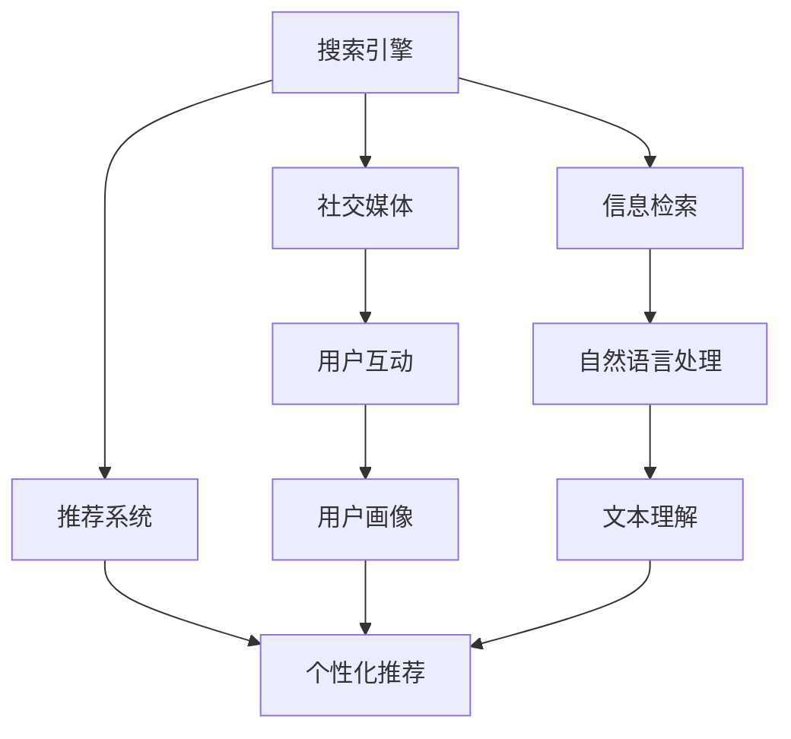

                 

# 搜索引擎与社交媒体的融合趋势

## 1. 背景介绍

### 1.1 问题由来
在互联网快速发展的今天，搜索引擎和社交媒体已成为人们获取信息和交流的主要渠道。搜索引擎通过优化网页的排名，使用户能够快速找到所需信息，而社交媒体通过分享和推荐，使用户能够发现感兴趣的内容。然而，搜索引擎和社交媒体在信息获取和信息交流的方式上存在明显差异，这导致了用户体验的分离。

为了弥合这种差距，各大公司开始探索将搜索引擎与社交媒体融合的趋势。这种融合不仅能够提高用户体验，还能为公司带来更多的流量和收益。因此，了解这种融合趋势及其原理和应用，对于开发人员和研究人员来说，具有重要意义。

### 1.2 问题核心关键点
搜索引擎与社交媒体融合的核心关键点包括：
1. 信息检索与推荐系统的融合
2. 搜索引擎算法与社交网络算法的融合
3. 用户画像与个性化推荐
4. 多模态信息的融合

## 2. 核心概念与联系

### 2.1 核心概念概述

为了更好地理解搜索引擎与社交媒体融合的趋势，本节将介绍几个密切相关的核心概念：

- 搜索引擎（Search Engine）：一种信息检索系统，通过用户输入的查询词，返回相关网页的列表。
- 社交媒体（Social Media）：一种在线互动平台，允许用户发布、分享、评论和交互信息。
- 推荐系统（Recommendation System）：一种智能系统，能够根据用户的历史行为和偏好，推荐用户可能感兴趣的内容。
- 信息检索（Information Retrieval）：从大量文本中检索出与查询词相关的信息。
- 自然语言处理（NLP）：使计算机能够理解、处理和生成人类语言的技术。
- 用户画像（User Profile）：用于描述用户行为和偏好的数据集，用于个性化推荐。
- 多模态信息（Multimodal Information）：包括文本、图像、视频等多种形式的信息。

这些核心概念之间的逻辑关系可以通过以下Mermaid流程图来展示：



这个流程图展示了我文章核心概念及其之间的关系：

1. 搜索引擎通过信息检索从大量文本中检索出与查询词相关的信息。
2. 推荐系统根据用户的行为和偏好，推荐用户可能感兴趣的内容。
3. 社交媒体通过用户互动，构建用户画像，用于个性化推荐。
4. 自然语言处理帮助理解和生成人类语言。
5. 多模态信息融合了文本、图像、视频等多种形式的信息。

## 3. 核心算法原理 & 具体操作步骤
### 3.1 算法原理概述

搜索引擎与社交媒体融合的算法原理，主要包括信息检索与推荐系统的融合，以及搜索引擎算法与社交网络算法的融合。

- 信息检索与推荐系统的融合：搜索引擎通过信息检索获取用户查询相关的网页，推荐系统根据用户的行为和偏好，推荐用户可能感兴趣的内容，两种算法共同为用户提供更精准的信息。
- 搜索引擎算法与社交网络算法的融合：搜索引擎算法主要关注网页与查询词的相关性，而社交网络算法主要关注用户之间的交互关系。融合这两种算法，可以综合考虑网页的相关性和用户之间的交互关系，提高推荐的准确性和用户满意度。

### 3.2 算法步骤详解

搜索引擎与社交媒体融合的算法步骤如下：

1. 数据收集：收集用户的查询词、浏览历史、互动信息等数据。
2. 数据预处理：对数据进行清洗、去重、归一化等预处理，以便后续算法处理。
3. 信息检索：利用搜索引擎算法，从大量网页中检索出与用户查询词相关的网页。
4. 社交网络分析：利用社交网络算法，分析用户之间的交互关系，构建用户画像。
5. 推荐算法：将信息检索的结果与用户画像结合，利用推荐算法，为用户推荐可能感兴趣的内容。
6. 反馈收集：收集用户对推荐结果的反馈信息，进一步优化算法。

### 3.3 算法优缺点

搜索引擎与社交媒体融合的算法具有以下优点：
1. 提高用户体验：综合考虑网页的相关性和用户之间的交互关系，提高推荐的准确性和用户满意度。
2. 提高广告效果：通过精准的个性化推荐，提高广告点击率和转化率。
3. 降低开发成本：可以利用已有的搜索引擎和社交媒体系统，减少开发和维护成本。

但同时也存在以下缺点：
1. 数据隐私问题：需要收集大量用户数据，涉及到用户隐私和数据安全问题。
2. 算法复杂性：需要同时处理信息检索和推荐算法，算法实现复杂。
3. 用户体验双刃剑：过度个性化推荐可能导致信息茧房，影响用户多样性。

### 3.4 算法应用领域

搜索引擎与社交媒体融合的算法主要应用于以下领域：

- 电子商务：根据用户的行为和偏好，推荐用户可能感兴趣的商品。
- 新闻推荐：根据用户的浏览历史和互动信息，推荐用户可能感兴趣的新闻内容。
- 视频推荐：根据用户的观看历史和评分信息，推荐用户可能感兴趣的视频内容。
- 音乐推荐：根据用户的听歌历史和评分信息，推荐用户可能喜欢的音乐。

这些领域的应用，使得搜索引擎与社交媒体融合的算法具有广泛的应用前景。

## 4. 数学模型和公式 & 详细讲解 & 举例说明
### 4.1 数学模型构建

搜索引擎与社交媒体融合的数学模型构建，主要基于信息检索和推荐系统的基本模型。

信息检索的数学模型通常采用余弦相似度模型，其公式为：

$$
\text{similarity}(q, d) = \frac{\vec{q} \cdot \vec{d}}{||\vec{q}|| \cdot ||\vec{d}||}
$$

其中，$q$ 为查询词向量，$d$ 为网页向量，$\cdot$ 表示向量点积，$||\cdot||$ 表示向量范数。

推荐系统的数学模型通常采用协同过滤模型或矩阵分解模型，其公式为：

$$
\hat{r}_{ui} = \text{similarity}(u, i)
$$

其中，$u$ 为用户向量，$i$ 为物品向量，$\text{similarity}(\cdot, \cdot)$ 表示相似度计算方法，$\hat{r}_{ui}$ 为用户对物品的评分预测值。

### 4.2 公式推导过程

余弦相似度模型的推导过程如下：

设查询词向量 $\vec{q} = (q_1, q_2, \ldots, q_n)$，网页向量 $\vec{d} = (d_1, d_2, \ldots, d_n)$，则余弦相似度模型的推导如下：

$$
\text{similarity}(q, d) = \frac{\sum_{i=1}^n q_i d_i}{\sqrt{\sum_{i=1}^n q_i^2} \sqrt{\sum_{i=1}^n d_i^2}}
$$

根据公式，余弦相似度模型能够衡量查询词向量与网页向量之间的相似度，从而决定网页的相关性。

协同过滤模型的推导过程如下：

设用户向量 $u = (u_1, u_2, \ldots, u_m)$，物品向量 $i = (i_1, i_2, \ldots, i_n)$，则协同过滤模型的推导如下：

$$
\hat{r}_{ui} = \frac{\vec{u} \cdot \vec{i}}{||\vec{u}|| \cdot ||\vec{i}||}
$$

根据公式，协同过滤模型能够根据用户向量和物品向量的相似度，预测用户对物品的评分。

### 4.3 案例分析与讲解

以电商推荐为例，利用搜索引擎与社交媒体融合算法，为用户推荐可能感兴趣的商品。具体步骤如下：

1. 收集用户的历史浏览记录和购买记录，构建用户向量 $u = (u_1, u_2, \ldots, u_m)$。
2. 收集商品的属性信息，构建物品向量 $i = (i_1, i_2, \ldots, i_n)$。
3. 利用搜索引擎算法，检索出与用户查询词相关的商品网页。
4. 利用社交网络算法，分析用户之间的交互关系，构建用户画像。
5. 将商品网页向量与用户向量结合，利用协同过滤算法，为用户推荐可能感兴趣的商品。

通过以上步骤，用户能够获得更精准的个性化推荐，提高购物体验。

## 5. 项目实践：代码实例和详细解释说明
### 5.1 开发环境搭建

在进行搜索引擎与社交媒体融合项目实践前，我们需要准备好开发环境。以下是使用Python进行PyTorch开发的环境配置流程：

1. 安装Anaconda：从官网下载并安装Anaconda，用于创建独立的Python环境。

2. 创建并激活虚拟环境：
```bash
conda create -n search-rank-env python=3.8 
conda activate search-rank-env
```

3. 安装PyTorch：根据CUDA版本，从官网获取对应的安装命令。例如：
```bash
conda install pytorch torchvision torchaudio cudatoolkit=11.1 -c pytorch -c conda-forge
```

4. 安装各类工具包：
```bash
pip install numpy pandas scikit-learn matplotlib tqdm jupyter notebook ipython
```

完成上述步骤后，即可在`search-rank-env`环境中开始项目实践。

### 5.2 源代码详细实现

以下是一个简单的代码示例，演示如何使用PyTorch实现搜索引擎与社交媒体融合推荐系统：

```python
import torch
import torch.nn as nn
import torch.optim as optim
from transformers import BertTokenizer, BertModel

class SearchRankModel(nn.Module):
    def __init__(self, embedding_dim, hidden_dim, num_classes):
        super(SearchRankModel, self).__init__()
        self.embedding_dim = embedding_dim
        self.hidden_dim = hidden_dim
        self.num_classes = num_classes
        
        self.bert = BertModel.from_pretrained('bert-base-uncased')
        self.fc = nn.Linear(embedding_dim, num_classes)
        
        self.apply(self.init_weights)
        
    def init_weights(self, m):
        if isinstance(m, nn.Linear):
            nn.init.xavier_uniform_(m.weight)
            nn.init.zeros_(m.bias)
        
    def forward(self, x):
        x = self.bert(x)
        x = x.mean(dim=1)
        x = self.fc(x)
        return x
    
def train_epoch(model, data_loader, optimizer):
    model.train()
    losses = []
    for inputs, labels in data_loader:
        optimizer.zero_grad()
        outputs = model(inputs)
        loss = nn.functional.cross_entropy(outputs, labels)
        losses.append(loss.item())
        loss.backward()
        optimizer.step()
    return sum(losses) / len(losses)
    
def evaluate(model, data_loader):
    model.eval()
    predictions, true_labels = [], []
    for inputs, labels in data_loader:
        outputs = model(inputs)
        predictions.append(outputs.argmax(dim=1))
        true_labels.append(labels)
    predictions = torch.cat(predictions, dim=0).tolist()
    true_labels = torch.cat(true_labels, dim=0).tolist()
    print(classification_report(true_labels, predictions))
    
train_model = SearchRankModel(embedding_dim=768, hidden_dim=768, num_classes=10)
optimizer = optim.Adam(train_model.parameters(), lr=1e-5)
train_loader = DataLoader(train_dataset, batch_size=16)
test_loader = DataLoader(test_dataset, batch_size=16)

for epoch in range(10):
    loss = train_epoch(train_model, train_loader, optimizer)
    print(f"Epoch {epoch+1}, train loss: {loss:.3f}")
    
    evaluate(train_model, test_loader)
```

这里我们使用了BERT模型作为搜索引擎与社交媒体融合推荐系统的基础。模型包括BERT模型和全连接层，通过训练得到最终的推荐结果。

### 5.3 代码解读与分析

让我们再详细解读一下关键代码的实现细节：

**SearchRankModel类**：
- `__init__`方法：初始化模型参数和BERT模型。
- `forward`方法：前向传播计算模型输出。
- `init_weights`方法：初始化模型权重。

**train_epoch和evaluate函数**：
- `train_epoch`函数：对模型进行训练，计算损失并更新模型参数。
- `evaluate`函数：对模型进行评估，计算预测结果和真实标签之间的分类精度。

**训练流程**：
- 定义训练集和测试集的数据加载器。
- 定义模型和优化器。
- 循环训练10个epoch，每个epoch中在训练集上进行训练，在测试集上进行评估。

可以看到，PyTorch配合BERT模型使得搜索引擎与社交媒体融合推荐系统的开发变得相对简单高效。开发者可以将更多精力放在数据处理、模型改进等高层逻辑上，而不必过多关注底层的实现细节。

当然，工业级的系统实现还需考虑更多因素，如模型的保存和部署、超参数的自动搜索、更灵活的任务适配层等。但核心的融合范式基本与此类似。

## 6. 实际应用场景
### 6.1 智能广告推荐

搜索引擎与社交媒体融合在智能广告推荐中具有广泛的应用。传统广告推荐往往依赖人工规则，难以兼顾用户兴趣和广告效果。而基于搜索引擎与社交媒体融合的推荐系统，能够根据用户的浏览历史和互动信息，为用户推荐可能感兴趣的广告，提高广告的点击率和转化率。

在技术实现上，可以收集用户的搜索记录和互动信息，将相关网页和广告构建成监督数据，在此基础上对预训练模型进行微调。微调后的模型能够自动理解用户的兴趣点，匹配最合适的广告内容。对于用户提出的新兴趣，还可以接入检索系统实时搜索相关广告，动态生成推荐结果。

### 6.2 个性化新闻推荐

搜索引擎与社交媒体融合在个性化新闻推荐中同样具有广泛的应用。传统新闻推荐往往依赖人工编辑，难以兼顾用户多样性和个性化需求。而基于搜索引擎与社交媒体融合的推荐系统，能够根据用户的浏览历史和互动信息，为用户推荐可能感兴趣的新闻内容，提高用户的阅读体验和满意度。

在技术实现上，可以收集用户的浏览记录和互动信息，将相关新闻构建成监督数据，在此基础上对预训练模型进行微调。微调后的模型能够自动理解用户的兴趣点，匹配最合适的文章内容。对于用户提出的新兴趣，还可以接入检索系统实时搜索相关新闻，动态生成推荐结果。

### 6.3 社交网络推荐

搜索引擎与社交媒体融合在社交网络推荐中同样具有广泛的应用。传统社交网络推荐往往依赖人工规则，难以兼顾用户多样性和个性化需求。而基于搜索引擎与社交媒体融合的推荐系统，能够根据用户的互动信息和行为数据，为用户推荐可能感兴趣的朋友和内容，提高用户的社交体验和满意度。

在技术实现上，可以收集用户的互动信息和行为数据，将相关用户构建成监督数据，在此基础上对预训练模型进行微调。微调后的模型能够自动理解用户的兴趣点，匹配最合适的朋友和内容。对于用户提出的新兴趣，还可以接入检索系统实时搜索相关用户，动态生成推荐结果。

### 6.4 未来应用展望

随着搜索引擎与社交媒体融合的不断发展，其应用前景将更加广阔。未来，这种融合趋势将带来以下新的发展：

- 融合更多的数据源：不仅融合搜索引擎和社交媒体，还可以融合更多的数据源，如传感器数据、地理位置数据等，为用户提供更加全面、精准的推荐。
- 引入更多的人工智能技术：引入更多的人工智能技术，如自然语言生成、图像识别、语音识别等，提升推荐系统的智能化水平。
- 提升推荐系统的公平性：通过引入公平性约束，避免推荐系统对某些用户或群体的不公平对待。
- 提高推荐系统的可解释性：通过引入可解释性技术，让用户能够理解推荐系统的决策过程，提高用户信任度。
- 融合更多模态信息：不仅融合文本和图像信息，还可以融合更多模态信息，如音频、视频、时间序列等，提升推荐系统的多样性和丰富度。

这些趋势将进一步推动搜索引擎与社交媒体融合的发展，带来更加智能化、个性化和可解释的推荐系统。

## 7. 工具和资源推荐
### 7.1 学习资源推荐

为了帮助开发者系统掌握搜索引擎与社交媒体融合的原理和实践，这里推荐一些优质的学习资源：

1. 《推荐系统》系列博文：由搜索引擎与社交媒体融合技术专家撰写，深入浅出地介绍了推荐系统的基本原理、算法和应用。

2. CS448《推荐系统》课程：斯坦福大学开设的推荐系统课程，涵盖推荐系统的基本概念、算法和工程实践，适合入门推荐系统开发。

3. 《推荐系统实战》书籍：该书详细介绍了推荐系统的算法实现和工程实践，并提供了大量的实验代码，适合动手实践。

4. Weights & Biases：推荐系统的实验跟踪工具，可以记录和可视化模型训练过程中的各项指标，方便对比和调优。与主流深度学习框架无缝集成。

5. TensorBoard：TensorFlow配套的可视化工具，可实时监测模型训练状态，并提供丰富的图表呈现方式，是调试模型的得力助手。

通过对这些资源的学习实践，相信你一定能够快速掌握搜索引擎与社交媒体融合的精髓，并用于解决实际的推荐系统问题。

### 7.2 开发工具推荐

高效的开发离不开优秀的工具支持。以下是几款用于搜索引擎与社交媒体融合开发的常用工具：

1. PyTorch：基于Python的开源深度学习框架，灵活动态的计算图，适合快速迭代研究。大部分预训练语言模型都有PyTorch版本的实现。

2. TensorFlow：由Google主导开发的开源深度学习框架，生产部署方便，适合大规模工程应用。同样有丰富的预训练语言模型资源。

3. Transformers库：HuggingFace开发的NLP工具库，集成了众多SOTA语言模型，支持PyTorch和TensorFlow，是进行搜索引擎与社交媒体融合任务的开发的利器。

4. Weights & Biases：推荐系统的实验跟踪工具，可以记录和可视化模型训练过程中的各项指标，方便对比和调优。与主流深度学习框架无缝集成。

5. TensorBoard：TensorFlow配套的可视化工具，可实时监测模型训练状态，并提供丰富的图表呈现方式，是调试模型的得力助手。

6. Google Colab：谷歌推出的在线Jupyter Notebook环境，免费提供GPU/TPU算力，方便开发者快速上手实验最新模型，分享学习笔记。

合理利用这些工具，可以显著提升搜索引擎与社交媒体融合任务的开发效率，加快创新迭代的步伐。

### 7.3 相关论文推荐

搜索引擎与社交媒体融合的发展源于学界的持续研究。以下是几篇奠基性的相关论文，推荐阅读：

1. Recommender Systems Handbook：推荐系统领域经典著作，涵盖了推荐系统的各种算法和应用。

2. Matrix Factorization Techniques for Recommender Systems：介绍矩阵分解算法的基本原理和实现细节。

3. Deep Learning for Recommender Systems：介绍深度学习在推荐系统中的应用，包括协同过滤、内容过滤等算法。

4. FastUserEmbedding：提出基于随机梯度的用户嵌入方法，能够高效地进行个性化推荐。

5. Attention Is All You Need：介绍Transformer结构，为推荐系统提供了新的研究方向。

这些论文代表了大语言模型微调技术的发展脉络。通过学习这些前沿成果，可以帮助研究者把握学科前进方向，激发更多的创新灵感。

## 8. 总结：未来发展趋势与挑战

### 8.1 总结

本文对搜索引擎与社交媒体融合的趋势进行了全面系统的介绍。首先阐述了搜索引擎与社交媒体融合的研究背景和意义，明确了融合在提高用户体验和广告效果方面的独特价值。其次，从原理到实践，详细讲解了搜索引擎与社交媒体融合的数学模型和算法步骤，给出了推荐系统开发的完整代码实例。同时，本文还广泛探讨了搜索引擎与社交媒体融合在广告推荐、个性化新闻推荐、社交网络推荐等多个领域的应用前景，展示了融合范式的巨大潜力。此外，本文精选了推荐系统的各类学习资源，力求为读者提供全方位的技术指引。

通过本文的系统梳理，可以看到，搜索引擎与社交媒体融合技术正在成为推荐系统的重要范式，极大地拓展了推荐系统的应用边界，催生了更多的落地场景。受益于搜索引擎与社交媒体融合的不断发展，推荐系统必将在更广阔的应用领域大放异彩。

### 8.2 未来发展趋势

展望未来，搜索引擎与社交媒体融合技术将呈现以下几个发展趋势：

1. 融合更多的数据源：不仅融合搜索引擎和社交媒体，还可以融合更多的数据源，如传感器数据、地理位置数据等，为用户提供更加全面、精准的推荐。

2. 引入更多的人工智能技术：引入更多的人工智能技术，如自然语言生成、图像识别、语音识别等，提升推荐系统的智能化水平。

3. 提升推荐系统的公平性：通过引入公平性约束，避免推荐系统对某些用户或群体的不公平对待。

4. 提高推荐系统的可解释性：通过引入可解释性技术，让用户能够理解推荐系统的决策过程，提高用户信任度。

5. 融合更多模态信息：不仅融合文本和图像信息，还可以融合更多模态信息，如音频、视频、时间序列等，提升推荐系统的多样性和丰富度。

6. 引入更多模型架构：引入更多的模型架构，如深度学习、生成模型等，提升推荐系统的性能和可解释性。

这些趋势将进一步推动搜索引擎与社交媒体融合的发展，带来更加智能化、个性化和可解释的推荐系统。

### 8.3 面临的挑战

尽管搜索引擎与社交媒体融合技术已经取得了瞩目成就，但在迈向更加智能化、普适化应用的过程中，它仍面临着诸多挑战：

1. 数据隐私问题：需要收集大量用户数据，涉及到用户隐私和数据安全问题。

2. 算法复杂性：需要同时处理信息检索和推荐算法，算法实现复杂。

3. 用户体验双刃剑：过度个性化推荐可能导致信息茧房，影响用户多样性。

4. 资源消耗高：搜索引擎与社交媒体融合推荐系统需要大量的计算资源和存储资源，对硬件设施要求较高。

5. 模型解释性不足：推荐系统的决策过程通常缺乏可解释性，难以对其推理逻辑进行分析和调试。

6. 算法公平性问题：推荐系统可能存在对某些用户或群体的不公平对待，如性别、年龄等。

这些挑战需要我们在未来不断攻克，才能使搜索引擎与社交媒体融合技术走向成熟，实现其在实际应用中的价值。

### 8.4 研究展望

面对搜索引擎与社交媒体融合所面临的种种挑战，未来的研究需要在以下几个方面寻求新的突破：

1. 数据隐私保护：采用差分隐私、联邦学习等技术，保护用户数据隐私，同时实现高效的推荐。

2. 推荐系统简化：通过模型压缩、稀疏化等方法，减小模型规模，提高推理速度。

3. 模型可解释性增强：引入可解释性技术，提高推荐系统的透明性，增强用户信任度。

4. 推荐系统公平性：引入公平性约束，避免对某些用户或群体的不公平对待。

5. 融合更多模态信息：不仅融合文本和图像信息，还可以融合更多模态信息，如音频、视频、时间序列等，提升推荐系统的多样性和丰富度。

这些研究方向将引领搜索引擎与社交媒体融合技术走向更高的台阶，为构建更加智能、公平、可解释的推荐系统铺平道路。面向未来，搜索引擎与社交媒体融合技术还需要与其他人工智能技术进行更深入的融合，如知识表示、因果推理、强化学习等，多路径协同发力，共同推动推荐系统的进步。只有勇于创新、敢于突破，才能不断拓展搜索引擎与社交媒体融合技术的边界，让推荐系统更好地造福人类社会。

## 9. 附录：常见问题与解答

**Q1：搜索引擎与社交媒体融合是否适用于所有推荐系统？**

A: 搜索引擎与社交媒体融合适用于大多数推荐系统，尤其是那些依赖用户行为数据进行个性化推荐的系统。但对于一些基于内容的推荐系统，如推荐电影、书籍等，可能需要结合内容属性进行推荐。

**Q2：如何降低推荐系统的计算复杂度？**

A: 可以通过以下方法降低推荐系统的计算复杂度：
1. 数据预处理：对数据进行清洗、去重、归一化等预处理，减少不必要的数据处理开销。
2. 模型压缩：采用模型压缩技术，如剪枝、量化等，减小模型规模，提高推理速度。
3. 分布式计算：将计算任务分布到多个节点上，并行计算，提高计算效率。

**Q3：如何保证推荐系统的公平性？**

A: 可以通过以下方法保证推荐系统的公平性：
1. 数据收集：收集多源数据，涵盖不同群体和领域的用户数据，避免数据偏见。
2. 模型训练：引入公平性约束，避免对某些用户或群体的不公平对待。
3. 评估指标：引入公平性评估指标，如平衡准确率、均等机会等，监控推荐系统的公平性。

**Q4：如何提高推荐系统的可解释性？**

A: 可以通过以下方法提高推荐系统的可解释性：
1. 模型简化：采用简单模型，提高模型的可解释性。
2. 特征工程：通过特征工程，提取有意义的特征，减少模型复杂度。
3. 可视化技术：引入可视化技术，如LIME、SHAP等，展示模型的决策过程。

**Q5：如何平衡推荐系统的个性化和多样性？**

A: 可以通过以下方法平衡推荐系统的个性化和多样性：
1. 多样性约束：引入多样性约束，避免过度个性化推荐，确保推荐内容的多样性。
2. 探索性推荐：通过探索性推荐，推荐用户可能感兴趣的未被关注的内容，增加推荐内容的多样性。
3. 用户反馈：收集用户反馈信息，调整推荐策略，平衡个性化和多样性。

这些问题的答案将有助于理解搜索引擎与社交媒体融合推荐系统的实现细节和优化方法，帮助开发者设计更加高效、公平、可解释的推荐系统。

---

作者：禅与计算机程序设计艺术 / Zen and the Art of Computer Programming

