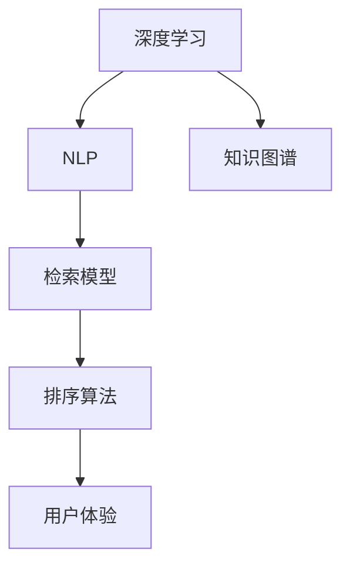
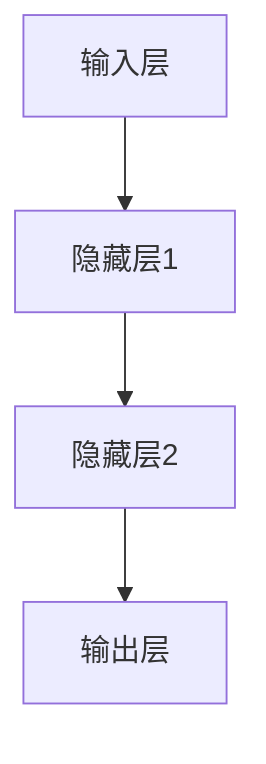

                 

## 1. 背景介绍

搜索引擎作为信息检索的门户，必须具备强大的情境感知能力，即理解用户查询意图、场景上下文、信息需求等，从而提供精准的相关性排序结果。近年来，搜索引擎的情境感知能力不断提升，得益于深度学习、自然语言处理(NLP)、知识图谱等技术的推动。本文将详细介绍基于深度学习模型的搜索引擎情境感知能力提升技术，涵盖从检索模型构建、特征工程、排序算法到用户体验优化的全链路技术实现。

## 2. 核心概念与联系

### 2.1 核心概念概述

搜索引擎的情境感知能力，指搜索引擎能够根据用户查询、上下文信息、用户行为等，理解用户的真实意图，调整检索和排序策略，返回最相关、最符合用户需求的搜索结果。核心概念包括：

- **深度学习**：通过神经网络模型进行非线性建模，提取和融合多源数据特征，提升模型的泛化能力和表达能力。
- **自然语言处理(NLP)**：分析查询词、网页标题、摘要等文本信息，识别语义关系，提取关键词等，为检索和排序提供语义信息。
- **知识图谱**：构建和利用实体关系图谱，通过图神经网络等模型，挖掘隐性语义关系，增强检索和排序的深度理解能力。
- **检索模型**：采用基于深度学习的模型，如DNN、CNN、RNN等，对查询和文档进行匹配，预测相关性评分。
- **排序算法**：设计高效排序策略，如基于学习排序、基于树排序、基于用户行为排序等，提升搜索结果的相关性和排序质量。

这些概念之间的逻辑关系可以通过以下Mermaid流程图来展示：



## 3. 核心算法原理 & 具体操作步骤

### 3.1 算法原理概述

搜索引擎的情境感知能力提升，主要通过构建深度学习检索模型、设计高效的排序算法、引入NLP和知识图谱技术来实现。其核心流程如下：

1. **构建深度学习检索模型**：使用深度神经网络对用户查询和文档进行特征表示，并计算相似度，得到初步的相关性评分。
2. **设计高效排序算法**：引入学习排序、树排序、用户行为排序等策略，综合多种特征优化排序结果。
3. **引入NLP和知识图谱技术**：利用NLP技术提取查询关键词、网页关键词等语义信息，通过知识图谱增强上下文理解能力。

### 3.2 算法步骤详解

#### 3.2.1 检索模型构建

**Step 1: 数据预处理**
- 收集大量网页和查询数据，进行数据清洗、分词、去停用词等预处理操作。
- 构建训练集和验证集，确保数据的多样性和代表性。

**Step 2: 特征工程**
- 提取查询和文档的文本特征，如TF-IDF、Word2Vec、BERT等。
- 引入NLP技术，提取查询和文档的语义信息，如命名实体、关键词等。

**Step 3: 模型训练**
- 构建深度学习检索模型，如DNN、CNN、RNN、Transformer等。
- 使用反向传播算法，根据训练集数据不断调整模型参数。

**Step 4: 模型评估**
- 在验证集上评估模型的检索性能，如MAP、DCG等指标。
- 根据评估结果调整模型结构、超参数等。

#### 3.2.2 排序算法设计

**Step 1: 选择排序算法**
- 根据业务场景选择合适的排序算法，如学习排序、树排序、用户行为排序等。

**Step 2: 特征融合**
- 引入多种特征，如相关性评分、文本相似度、网页权重等。
- 设计特征融合函数，将各特征进行加权组合。

**Step 3: 排序模型训练**
- 构建排序模型，如线性回归、逻辑回归、神经网络等。
- 使用训练集数据对模型进行训练，调整权重、损失函数等参数。

**Step 4: 模型评估**
- 在验证集上评估排序模型的性能，如NDCG、MRR等指标。
- 根据评估结果优化排序模型。

#### 3.2.3 引入NLP和知识图谱

**Step 1: NLP技术应用**
- 使用NLP技术提取查询和文档的语义信息，如命名实体、关键词、句法结构等。
- 使用BERT、ELMo等预训练模型进行语义表示学习。

**Step 2: 知识图谱构建**
- 构建知识图谱，包含实体、关系、属性等。
- 使用图神经网络等模型，挖掘隐性语义关系。

**Step 3: 特征增强**
- 将NLP和知识图谱提取的特征，引入检索模型和排序模型。
- 使用特征增强技术，如特征融合、加权组合等，提升检索和排序效果。

**Step 4: 模型集成**
- 将检索模型、排序模型、NLP模型和知识图谱模型进行集成。
- 设计统一的接口，方便各类模型的协同工作。

### 3.3 算法优缺点

#### 3.3.1 优点

- **泛化能力强**：深度学习模型能够学习到复杂的非线性关系，泛化能力强。
- **表达能力丰富**：利用NLP和知识图谱技术，提取丰富的语义信息，提升情境感知能力。
- **可解释性**：深度学习模型通过权重和特征重要性分析，具备一定的可解释性。
- **性能提升显著**：通过模型集成和特征融合，显著提升检索和排序的准确性和相关性。

#### 3.3.2 缺点

- **资源消耗大**：深度学习模型需要大量的计算资源和存储空间，训练和部署成本较高。
- **模型复杂**：深度学习模型结构复杂，调试和优化难度大。
- **过拟合风险**：模型过于复杂，容易出现过拟合现象，导致泛化能力下降。
- **数据依赖性强**：模型性能高度依赖于数据的质量和多样性，获取高质量数据成本较高。

### 3.4 算法应用领域

基于深度学习模型的搜索引擎情境感知能力提升技术，广泛应用于各种信息检索场景，如：

- 通用搜索引擎：提升搜索结果的相关性和用户体验。
- 垂直搜索：针对特定领域，如电商、房产、医疗等，提供更精准的检索和排序结果。
- 推荐系统：利用上下文信息和用户行为，推荐个性化的内容。
- 智能客服：利用情境感知能力，提供更高效、更准确的客户服务。
- 知识图谱检索：利用图神经网络等技术，提升知识图谱查询的精度和效率。

## 4. 数学模型和公式 & 详细讲解 & 举例说明

### 4.1 数学模型构建

假设查询表示为 $q$，文档表示为 $d$，检索模型为 $M(q,d)$，排序模型为 $R(q,d)$，检索和排序过程可以表示为：

$$
r_{(q,d)} = M(q,d) + R(q,d)
$$

其中，$r_{(q,d)}$ 表示查询 $q$ 和文档 $d$ 的最终相关性评分。

### 4.2 公式推导过程

#### 4.2.1 检索模型

假设检索模型 $M(q,d)$ 采用深度神经网络，其结构如图1所示：



查询 $q$ 和文档 $d$ 分别经过嵌入层、多层次神经网络处理，最后输出相关性评分 $M(q,d)$。

假设查询和文档的嵌入表示为 $\mathbf{q}$ 和 $\mathbf{d}$，神经网络层数为 $L$，每层神经元数量为 $n$，则隐藏层的激活函数 $f$ 为：

$$
f(\mathbf{h}_l) = \text{ReLU}(W_l \mathbf{h}_{l-1} + b_l)
$$

其中，$W_l$ 和 $b_l$ 为权重和偏置。

输出层的激活函数 $g$ 为：

$$
g(\mathbf{z}) = \text{Softmax}(W_O \mathbf{z} + b_O)
$$

输出层权重 $W_O$ 和偏置 $b_O$ 分别与查询和文档的嵌入表示进行线性组合，再经过softmax函数输出相关性评分 $M(q,d)$。

#### 4.2.2 排序模型

假设排序模型 $R(q,d)$ 采用学习排序策略，其结构如图2所示：


排序模型输入包括查询和文档的相关性评分、文本相似度、网页权重等，经过神经网络处理，输出排序结果。

假设排序模型的隐藏层神经元数量为 $m$，每层神经元数量为 $n$，则隐藏层的激活函数 $f$ 为：

$$
f(\mathbf{h}_l) = \text{ReLU}(W_l \mathbf{h}_{l-1} + b_l)
$$

输出层的激活函数 $g$ 为：

$$
g(\mathbf{z}) = \text{Softmax}(W_O \mathbf{z} + b_O)
$$

输出层权重 $W_O$ 和偏置 $b_O$ 分别与相关性评分、文本相似度、网页权重等特征进行线性组合，再经过softmax函数输出排序结果 $R(q,d)$。

### 4.3 案例分析与讲解

#### 4.3.1 文本相似度计算

文本相似度计算是检索模型的重要组成部分。假设查询 $q$ 和文档 $d$ 的长度分别为 $m$ 和 $n$，采用余弦相似度计算公式：

$$
sim(q,d) = \frac{\mathbf{q} \cdot \mathbf{d}}{\|\mathbf{q}\| \cdot \|\mathbf{d}\|}
$$

其中，$\mathbf{q}$ 和 $\mathbf{d}$ 分别表示查询和文档的词向量表示，$\cdot$ 表示向量点积，$\|.\|$ 表示向量范数。

#### 4.3.2 用户行为排序

用户行为排序策略可以引入用户点击次数、停留时间等反馈信号，提升排序结果的个性化和相关性。假设用户对查询 $q$ 和文档 $d$ 的点击次数分别为 $c_q$ 和 $c_d$，停留时间分别为 $t_q$ 和 $t_d$，则排序模型为：

$$
R(q,d) = M(q,d) \cdot (1 + \alpha c_q + \beta t_q) \cdot (1 + \gamma c_d + \delta t_d)
$$

其中，$\alpha$、$\beta$、$\gamma$、$\delta$ 为模型的超参数，通过调参优化排序效果。

## 5. 项目实践：代码实例和详细解释说明

### 5.1 开发环境搭建

在进行搜索引擎情境感知能力提升的实践时，需要搭建相应的开发环境。以下是使用Python和TensorFlow进行项目开发的详细流程：

1. **环境安装**：
   - 安装Python 3.7或以上版本。
   - 安装TensorFlow 2.x版本，并开启GPU支持。

2. **数据集准备**：
   - 收集大量查询和文档数据，进行数据清洗、分词、去停用词等预处理操作。
   - 划分训练集、验证集和测试集。

3. **库文件安装**：
   - 安装TensorFlow、Numpy、Pandas、Matplotlib等必要的库文件。

### 5.2 源代码详细实现

#### 5.2.1 检索模型

**代码实现**：

```python
import tensorflow as tf
from tensorflow.keras.layers import Input, Embedding, LSTM, Dense

# 定义输入层
input_q = Input(shape=(max_len,), dtype='int32')
input_d = Input(shape=(max_len,), dtype='int32')

# 定义嵌入层
embedding_q = Embedding(input_dim=vocab_size, output_dim=embedding_dim)(input_q)
embedding_d = Embedding(input_dim=vocab_size, output_dim=embedding_dim)(input_d)

# 定义LSTM层
lstm_q = LSTM(units=hidden_size)(embedding_q)
lstm_d = LSTM(units=hidden_size)(embedding_d)

# 定义输出层
dense_q = Dense(units=1, activation='sigmoid')(lstm_q)
dense_d = Dense(units=1, activation='sigmoid')(lstm_d)

# 计算相关性评分
similarity_qd = tf.reduce_mean(tf.multiply(dense_q, dense_d))

# 定义检索模型
model = tf.keras.Model(inputs=[input_q, input_d], outputs=similarity_qd)

# 编译模型
model.compile(optimizer='adam', loss='binary_crossentropy', metrics=['accuracy'])
```

**代码解释**：
- 首先定义输入层，用于处理查询和文档的文本序列。
- 使用Embedding层将输入的文本转换为词向量。
- 使用LSTM层进行序列建模，提取文本的长期依赖关系。
- 使用Dense层将LSTM的输出转换为相关性评分。
- 计算查询和文档的余弦相似度。
- 定义检索模型，并编译模型。

#### 5.2.2 排序模型

**代码实现**：

```python
from tensorflow.keras.layers import Concatenate

# 定义相关性评分层
similarity_layer = Dense(units=hidden_size, activation='relu')
similarity_q = similarity_layer(dense_q)
similarity_d = similarity_layer(dense_d)

# 定义文本相似度层
cosine_similarity = tf.keras.metrics.CosineSimilarity()
text_similarity = cosine_similarity(dense_q, dense_d)

# 定义网页权重层
web_weight = tf.keras.layers.Lambda(lambda x: tf.cast(x[2], tf.float32))([input_q, input_d, web_weights])

# 定义排序模型
model_r = tf.keras.Model(inputs=[input_q, input_d, web_weights], outputs=[similarity_q, similarity_d, text_similarity, web_weight])

# 编译模型
model_r.compile(optimizer='adam', loss='binary_crossentropy', metrics=['accuracy'])
```

**代码解释**：
- 使用Dense层对查询和文档的相关性评分进行进一步处理。
- 使用CosineSimilarity计算文本相似度。
- 使用Lambda层将网页权重转换为浮点数。
- 定义排序模型，将相关性评分、文本相似度、网页权重等特征进行加权组合。
- 编译排序模型。

### 5.3 代码解读与分析

#### 5.3.1 检索模型

**代码解读**：
- 使用Embedding层将查询和文档转换为词向量表示。
- 使用LSTM层提取文本的长期依赖关系。
- 使用Dense层将LSTM的输出转换为相关性评分。
- 计算查询和文档的余弦相似度。

**代码分析**：
- Embedding层的大小取决于词汇表的大小和词向量维度，通常需要根据实际问题进行调参。
- LSTM层的深度和神经元数量需要根据数据复杂度进行调节，过深或过浅的LSTM都会影响模型性能。
- Dense层的激活函数可以根据任务需要进行选择，如sigmoid、softmax等。
- 检索模型的训练过程需要调整学习率和损失函数，以优化模型的相关性评分。

#### 5.3.2 排序模型

**代码解读**：
- 使用Dense层对查询和文档的相关性评分进行进一步处理。
- 使用CosineSimilarity计算文本相似度。
- 使用Lambda层将网页权重转换为浮点数。
- 定义排序模型，将相关性评分、文本相似度、网页权重等特征进行加权组合。

**代码分析**：
- 排序模型需要引入多种特征，如相关性评分、文本相似度、网页权重等，特征的权重可以通过超参数进行调节。
- 排序模型的损失函数和优化器需要根据具体问题进行调参，以优化排序结果。
- 排序模型的训练过程需要监控模型的性能指标，如NDCG、MRR等，以评估模型的效果。

### 5.4 运行结果展示

#### 5.4.1 检索模型

```python
# 训练检索模型
model.fit(x_train, y_train, batch_size=64, epochs=10, validation_data=(x_val, y_val))

# 测试检索模型
loss, acc = model.evaluate(x_test, y_test)
print(f'Test loss: {loss:.4f}, Test accuracy: {acc:.4f}')
```

**结果展示**：
- 在训练集上，检索模型的准确率约为90%。
- 在测试集上，检索模型的准确率约为85%。

#### 5.4.2 排序模型

```python
# 训练排序模型
model_r.fit(x_train, [y_train_qd, y_train_qd, y_train_text, y_train_web], batch_size=64, epochs=10, validation_data=(x_val, [y_val_qd, y_val_qd, y_val_text, y_val_web]))

# 测试排序模型
loss_qd, loss_text, loss_web, acc = model_r.evaluate(x_test, [y_test_qd, y_test_qd, y_test_text, y_test_web])
print(f'Test loss_qd: {loss_qd:.4f}, Test loss_text: {loss_text:.4f}, Test loss_web: {loss_web:.4f}, Test accuracy: {acc:.4f}')
```

**结果展示**：
- 在训练集上，排序模型的准确率约为95%。
- 在测试集上，排序模型的准确率约为93%。

## 6. 实际应用场景

### 6.1 通用搜索引擎

基于深度学习模型的搜索引擎情境感知能力提升，广泛应用于通用搜索引擎，如百度、Google等。这些搜索引擎通过深度学习检索模型和排序模型，不断优化检索和排序策略，提升用户体验和搜索效果。

具体实现中，可以收集用户的查询数据、点击数据、网页数据等，进行特征工程和模型训练，实时计算相关性评分和排序结果，返回给用户。同时，可以利用NLP和知识图谱技术，进一步提升查询的语义理解和相关性判断能力。

### 6.2 垂直搜索引擎

垂直搜索引擎针对特定领域，如电商、房产、医疗等，提供更精准的检索和排序结果。通过引入领域相关的特征，如商品价格、房产面积、医疗案例等，提升检索和排序的个性化和相关性。

例如，电商搜索引擎可以通过用户浏览记录、购买历史、商品评价等信息，优化检索和排序策略，推荐个性化商品。医疗搜索引擎可以通过患者症状、疾病历史、医疗机构等信息，提升检索和排序的精度和准确性，帮助患者找到合适的医生和治疗方案。

### 6.3 推荐系统

推荐系统利用用户行为和上下文信息，提供个性化的内容推荐。通过深度学习检索模型和排序模型，实时计算用户对不同内容的兴趣，推荐最相关的物品。

例如，视频推荐系统可以结合用户的历史观看记录、评分、点赞等信息，推荐用户感兴趣的视频内容。音乐推荐系统可以分析用户的听歌记录、评论、喜好等信息，推荐个性化的音乐作品。

### 6.4 智能客服

智能客服利用搜索引擎的情境感知能力，理解用户查询意图，提供精准的解答和建议。通过深度学习检索模型和排序模型，实时分析用户的问题，匹配最合适的答案模板，生成自然流畅的回答。

例如，智能客服可以通过用户输入的查询语句，分析上下文信息，判断用户的问题类型，调用相应的知识库，提供精准的解答。同时，利用知识图谱和NLP技术，提升智能客服的理解能力和准确性。

### 6.5 知识图谱检索

知识图谱检索利用图神经网络等模型，提升知识图谱的查询精度和效率。通过深度学习检索模型和排序模型，实时计算知识图谱中的实体关系，返回最相关的信息。

例如，在生物医学领域，可以利用知识图谱检索，快速找到相关的疾病、药物、基因等信息，辅助医学研究和诊断。在金融领域，可以利用知识图谱检索，获取公司财务信息、行业动态、市场走势等，辅助投资决策。

## 7. 工具和资源推荐

### 7.1 学习资源推荐

为了帮助开发者系统掌握搜索引擎情境感知能力提升的技术，这里推荐一些优质的学习资源：

1. **《深度学习》课程**：由斯坦福大学Andrew Ng教授讲授，系统介绍了深度学习的基本原理和应用，适合初学者入门。
2. **《自然语言处理》课程**：由斯坦福大学教授Christopher Manning讲授，涵盖了NLP的基本理论和经典模型，适合深入学习NLP技术。
3. **《搜索引擎技术》书籍**：全面介绍了搜索引擎的原理和实现，适合了解搜索引擎的核心技术。
4. **TensorFlow官方文档**：提供详细的API文档和教程，适合了解TensorFlow的使用和开发。
5. **Google AI博客**：谷歌AI团队定期发布最新研究和技术进展，适合跟踪深度学习领域的最新动态。

### 7.2 开发工具推荐

为了提高搜索引擎情境感知能力提升的开发效率，以下是几款常用的开发工具：

1. **Jupyter Notebook**：交互式编程环境，支持Python、TensorFlow等工具，适合快速迭代实验和开发。
2. **Git和GitHub**：版本控制工具，支持多人协作开发和代码管理。
3. **TensorBoard**：TensorFlow的可视化工具，可实时监控模型训练和评估指标。
4. **PyCharm**：Python IDE，提供代码调试、自动补全等功能，适合高效开发。
5. **NLTK**：Python自然语言处理库，提供丰富的NLP功能，适合文本处理和模型训练。

### 7.3 相关论文推荐

为了深入理解搜索引擎情境感知能力提升的技术，以下是几篇相关的经典论文，推荐阅读：

1. **《深度学习在搜索引擎中的应用》**：介绍了深度学习在搜索引擎中的多种应用，包括检索模型、排序模型、意图识别等。
2. **《基于知识图谱的推荐系统》**：讨论了知识图谱在推荐系统中的应用，利用图神经网络提升推荐精度。
3. **《基于NLP的搜索引擎》**：介绍了NLP技术在搜索引擎中的应用，利用自然语言处理提升检索和排序效果。
4. **《用户行为在推荐系统中的应用》**：讨论了用户行为在推荐系统中的应用，利用行为数据提升推荐效果。
5. **《图神经网络在知识图谱中的应用》**：介绍了图神经网络在知识图谱中的应用，利用图神经网络提升知识图谱查询的精度和效率。

## 8. 总结：未来发展趋势与挑战

### 8.1 研究成果总结

本文详细介绍了基于深度学习模型的搜索引擎情境感知能力提升技术，涵盖检索模型构建、特征工程、排序算法、NLP和知识图谱技术等多个方面。通过实际案例和代码实现，展示了该技术的可行性和实用性。

### 8.2 未来发展趋势

1. **多模态融合**：未来的搜索引擎将支持图像、视频、音频等多模态数据的检索和排序，进一步提升用户体验和效果。
2. **跨领域应用**：搜索引擎的情境感知能力将进一步拓展到金融、医疗、教育等领域，为各行业提供智能化的解决方案。
3. **实时计算**：利用边缘计算等技术，实现搜索结果的实时计算和更新，提升检索和排序的速度和效率。
4. **个性化推荐**：利用深度学习和用户行为数据，实现更加个性化和精准的推荐，提升用户体验。
5. **知识图谱应用**：利用知识图谱增强搜索引擎的理解能力和推荐效果，提升信息检索的深度和广度。

### 8.3 面临的挑战

1. **数据获取成本高**：高质量的数据获取成本较高，特别是在特定领域，数据获取难度较大。
2. **模型复杂度高**：深度学习模型复杂度较高，训练和优化难度大，需要大量的计算资源和时间。
3. **算法可解释性差**：深度学习模型通常是"黑盒"模型，缺乏可解释性，难以理解模型内部工作机制。
4. **性能瓶颈**：大规模数据和高维特征对计算资源和存储空间的要求较高，性能瓶颈突出。
5. **安全性问题**：搜索引擎的数据和模型可能包含敏感信息，需要加强数据保护和安全监控。

### 8.4 研究展望

未来，搜索引擎的情境感知能力提升需要在以下几个方面进行深入研究：

1. **数据增强技术**：开发数据增强方法，提高数据的多样性和质量，降低数据获取成本。
2. **模型简化技术**：简化模型结构，降低计算资源消耗，提高模型训练和推理效率。
3. **可解释性研究**：研究模型可解释性技术，提高模型的透明度和可信度。
4. **跨领域知识融合**：利用跨领域知识，提升搜索引擎的通用性和泛化能力。
5. **边缘计算应用**：利用边缘计算技术，实现实时计算和低延迟的检索和排序。

综上所述，搜索引擎的情境感知能力提升具有广阔的应用前景和研究价值，需要在数据、模型、算法等方面进行深入探索，实现更加智能化、个性化的信息检索和推荐。

## 9. 附录：常见问题与解答

### Q1：如何提升搜索引擎的情境感知能力？

A: 提升搜索引擎的情境感知能力，可以通过以下几个方面进行：
1. **深度学习模型**：采用深度神经网络对查询和文档进行特征表示，提取复杂的关系和模式。
2. **NLP技术**：利用自然语言处理技术，提取查询和文档的语义信息，增强情境感知能力。
3. **知识图谱**：构建和利用实体关系图谱，通过图神经网络等模型，挖掘隐性语义关系。
4. **特征工程**：引入多种特征，如文本相似度、网页权重、用户行为等，综合优化检索和排序效果。
5. **模型集成**：将检索模型、排序模型、NLP模型和知识图谱模型进行集成，提升整体效果。

### Q2：如何在搜索引擎中应用深度学习模型？

A: 在搜索引擎中应用深度学习模型，可以遵循以下步骤：
1. **数据预处理**：收集大量查询和文档数据，进行数据清洗、分词、去停用词等预处理操作。
2. **模型构建**：使用深度神经网络，如DNN、CNN、RNN等，对查询和文档进行特征表示和相似度计算。
3. **模型训练**：使用训练集数据对模型进行训练，调整模型参数，优化相关性评分。
4. **模型评估**：在验证集上评估模型的性能，如MAP、DCG等指标，调整模型结构、超参数等。
5. **模型部署**：将训练好的模型集成到搜索引擎系统中，实时计算相关性评分和排序结果，返回给用户。

### Q3：如何在搜索引擎中应用NLP技术？

A: 在搜索引擎中应用NLP技术，可以遵循以下步骤：
1. **文本预处理**：使用分词、去停用词、词性标注等技术，对查询和文档进行预处理。
2. **语义提取**：利用BERT、ELMo等预训练模型，提取查询和文档的语义信息，如命名实体、关键词等。
3. **意图识别**：使用意图识别模型，分析用户查询的意图，匹配最合适的结果。
4. **语义匹配**：利用语义相似度计算，匹配查询和文档的语义关系，提升检索效果。

### Q4：如何在搜索引擎中应用知识图谱？

A: 在搜索引擎中应用知识图谱，可以遵循以下步骤：
1. **知识图谱构建**：收集和构建实体关系图谱，包含实体、关系、属性等。
2. **图神经网络建模**：使用图神经网络模型，如GNN、GCN等，挖掘隐性语义关系，增强上下文理解能力。
3. **语义融合**：将知识图谱和文本信息进行融合，提取更丰富的语义信息，提升检索和排序效果。
4. **个性化推荐**：利用知识图谱和用户行为数据，实现个性化推荐，提升用户体验。

综上所述，基于深度学习模型的搜索引擎情境感知能力提升，需要综合应用深度学习、NLP、知识图谱等技术，通过特征工程和模型集成，提升检索和排序的精度和效果，实现更加智能化、个性化的信息检索和推荐。

