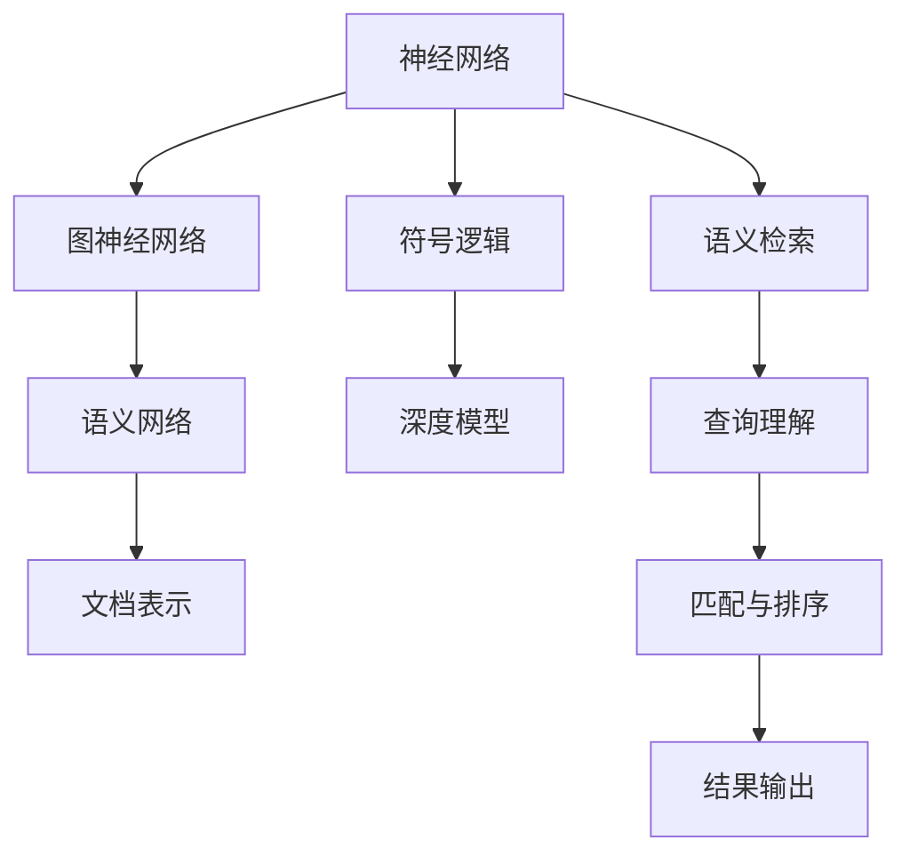

                 

# 搜索引擎的神经符号学习应用

## 1. 背景介绍

### 1.1 问题由来
在现代信息社会中，搜索引擎已成为人们获取信息的主要入口。传统搜索引擎以关键词匹配为核心，通过文本检索技术快速定位相关网页。然而，这种模式存在一些局限：

- 缺乏语义理解。传统搜索引擎只关注关键词匹配，无法理解网页和查询的语义关系。
- 难以处理多义词。对于具有多种含义的词语，传统模型难以准确定位。
- 缺乏灵活性。一旦查询词发生改变，模型需要重新训练或调整，难以保持灵活性。

针对这些问题，神经符号学习在搜索引擎中的应用变得尤为重要。它将深度学习模型的强大拟合能力与符号逻辑推理的严谨性相结合，能够更加准确地理解查询意图，灵活应对多义词，并具备更好的泛化能力。

### 1.2 问题核心关键点
神经符号学习（Neural Symbolic Learning）结合了深度学习和符号推理的优点，能够有效提升搜索引擎的语义理解能力和智能灵活性。具体而言，核心关键点包括：

- 引入符号逻辑。在深度模型中嵌入符号逻辑推理，提高模型的语义理解和推理能力。
- 训练多义词模型。通过上下文信息训练多义词模型，准确定位查询词的含义。
- 构建语义网络。利用图神经网络等技术构建语义网络，提升模型的泛化能力和适应性。

这些关键点共同构成了神经符号学习在搜索引擎中的应用框架，使得模型能够更加智能、灵活地处理查询请求，提供更优质的搜索结果。

### 1.3 问题研究意义
神经符号学习在搜索引擎中的应用，对于提升信息检索的精准度和用户体验，具有重要意义：

1. 增强语义理解。神经符号模型能够理解和推理查询和网页的语义关系，提升检索的精准度。
2. 应对多义词。通过上下文信息，神经符号模型能够准确处理具有多种含义的查询词，提升搜索效果。
3. 增强泛化能力。神经符号模型具备更好的泛化能力，能够适应不同类型的查询请求和数据分布。
4. 提升智能灵活性。神经符号模型能够灵活应对查询请求的变化，避免频繁重新训练或调整。

综上所述，神经符号学习在搜索引擎中的应用，有望极大地提升信息检索系统的智能水平和用户体验，推动搜索引擎技术的不断进步。

## 2. 核心概念与联系

### 2.1 核心概念概述

为了更好地理解神经符号学习在搜索引擎中的应用，本节将介绍几个密切相关的核心概念：

- 神经网络：一种基于数据驱动的计算模型，通过多层非线性变换对输入数据进行学习和预测。
- 符号逻辑：一种形式化逻辑，使用符号和规则表示推理过程。
- 图神经网络（Graph Neural Network, GNN）：一种基于图结构的数据处理模型，能够有效捕捉节点之间的关系。
- 语义网络：一种图结构表示方法，用于描述实体、关系和属性之间的语义关系。
- 语义检索：利用自然语言处理技术，理解查询和文档之间的语义关系，提升信息检索的精准度。

这些核心概念之间的逻辑关系可以通过以下Mermaid流程图来展示：



这个流程图展示了大语言模型的核心概念及其之间的关系：

1. 神经网络作为深度模型，用于学习数据特征和规律。
2. 符号逻辑嵌入神经网络，提高模型的推理能力和泛化性。
3. 图神经网络用于构建语义网络，捕捉节点之间的复杂关系。
4. 语义网络描述实体和属性之间的关系，提升模型的语义理解能力。
5. 语义检索利用符号逻辑和神经网络，理解查询和文档之间的语义关系。

这些概念共同构成了神经符号学习在搜索引擎中的应用框架，使其能够更加智能、灵活地处理查询请求。

## 3. 核心算法原理 & 具体操作步骤
### 3.1 算法原理概述

神经符号学习在搜索引擎中的应用，主要基于以下原理：

- 将查询和文档转换为符号表示，通过符号逻辑推理理解语义关系。
- 利用神经网络模型学习符号表示的特征，进行语义匹配和排序。
- 结合图神经网络构建语义网络，捕捉节点之间的复杂关系，提升模型的泛化能力。

形式化地，假设查询为 $q$，文档集合为 $\{d_1, d_2, ..., d_n\}$，神经符号学习模型的目标是在这些文档中找到最相关的文档。具体步骤如下：

1. 将查询 $q$ 转换为符号表示 $Q$，对文档 $d_i$ 进行符号表示 $D_i$。
2. 通过符号逻辑推理，计算查询 $Q$ 与文档 $D_i$ 之间的匹配度 $S_i$。
3. 利用神经网络模型学习符号表示的特征，生成文档的向量表示 $V_i$。
4. 利用图神经网络构建语义网络，捕捉节点之间的复杂关系，得到文档的语义表示 $G_i$。
5. 将匹配度 $S_i$、向量表示 $V_i$ 和语义表示 $G_i$ 进行加权融合，得到文档的综合得分 $R_i$。
6. 根据文档的综合得分 $R_i$ 进行排序，输出最相关的文档。

### 3.2 算法步骤详解

基于神经符号学习的应用流程可以分为以下关键步骤：

**Step 1: 符号表示转换**
- 使用自然语言处理技术将查询和文档转换为符号表示。对于查询 $q$，可以使用词向量表示；对于文档 $d_i$，可以提取关键词、短语和实体进行符号表示。

**Step 2: 符号逻辑推理**
- 通过符号逻辑推理计算查询 $Q$ 与文档 $D_i$ 之间的匹配度 $S_i$。常用的符号逻辑推理方法包括谓词逻辑、一阶逻辑等，可以使用Prolog、FOL等逻辑推理系统实现。

**Step 3: 神经网络训练**
- 使用神经网络模型学习符号表示的特征。常用的神经网络模型包括RNN、LSTM、Transformer等。在训练过程中，可以使用反向传播算法优化模型参数。

**Step 4: 语义网络构建**
- 利用图神经网络构建语义网络，捕捉节点之间的复杂关系。常用的图神经网络包括Graph Convolutional Network (GCN)、Graph Attention Network (GAT) 等。

**Step 5: 综合得分计算**
- 将匹配度 $S_i$、向量表示 $V_i$ 和语义表示 $G_i$ 进行加权融合，得到文档的综合得分 $R_i$。通常使用softmax函数进行归一化处理。

**Step 6: 结果排序与输出**
- 根据文档的综合得分 $R_i$ 进行排序，输出最相关的文档。具体排序方法包括基于查询-文档匹配度的排序、基于文档向量表示的距离排序等。

### 3.3 算法优缺点

神经符号学习在搜索引擎中的应用，具有以下优点：

1. 提升语义理解。符号逻辑推理能够理解查询和文档之间的语义关系，提升检索的精准度。
2. 处理多义词。通过上下文信息，能够准确定位查询词的含义，提升搜索效果。
3. 提升泛化能力。语义网络能够捕捉节点之间的复杂关系，提升模型的泛化能力。
4. 增强灵活性。神经符号模型能够灵活应对查询请求的变化，避免频繁重新训练或调整。

同时，该方法也存在一些局限性：

1. 计算复杂度高。符号逻辑推理和图神经网络计算复杂度高，训练和推理效率较低。
2. 数据需求大。需要大量标注数据进行训练，标注成本较高。
3. 模型复杂度高。神经符号模型结构复杂，参数数量较多，难以进行高效的工程实现。
4. 可解释性差。神经符号模型通常是一个黑盒，难以解释其内部工作机制和决策逻辑。

尽管存在这些局限性，但神经符号学习在搜索引擎中的应用，仍然展现出巨大的潜力，值得进一步探索和优化。

### 3.4 算法应用领域

神经符号学习在搜索引擎中的应用，可以广泛应用于以下领域：

1. 搜索引擎优化（SEO）：利用符号逻辑和神经网络模型，理解查询意图和文档内容，优化网页结构和内容，提升搜索排名。
2. 问答系统：通过符号逻辑推理，理解自然语言查询，生成准确的回答。
3. 文本摘要：利用符号逻辑和神经网络模型，对文档进行语义理解和摘要生成。
4. 推荐系统：通过语义网络捕捉用户和文档之间的复杂关系，生成个性化推荐。
5. 信息抽取：利用符号逻辑和神经网络模型，从文档和网页中抽取实体、关系和属性。

除了上述这些经典应用外，神经符号学习还将在更多场景中得到应用，如可控文本生成、常识推理、代码生成、数据增强等，为搜索引擎技术带来全新的突破。

## 4. 数学模型和公式 & 详细讲解  
### 4.1 数学模型构建

本节将使用数学语言对神经符号学习在搜索引擎中的应用进行更加严格的刻画。

假设查询 $q$ 和文档集合 $\{d_1, d_2, ..., d_n\}$ 的符号表示分别为 $Q$ 和 $\{D_1, D_2, ..., D_n\}$。神经符号学习模型的目标是找到最相关的文档 $d_i$，满足以下目标函数：

$$
\max_{i} R_i = \max_{i} (S_i + \alpha V_i + \beta G_i)
$$

其中 $S_i$ 为查询与文档的匹配度，$V_i$ 为文档的向量表示，$G_i$ 为文档的语义表示，$\alpha$ 和 $\beta$ 为权重系数。

### 4.2 公式推导过程

以下我们以查询意图匹配为例，推导符号逻辑推理和神经网络模型的基本公式。

**符号逻辑推理**

假设查询 $q$ 和文档 $d_i$ 的符号表示分别为 $Q$ 和 $D_i$，则查询和文档之间的匹配度 $S_i$ 可以通过以下一阶逻辑推理公式计算：

$$
S_i = \sum_{k=1}^K \lambda_k \mathbb{P}_i^k
$$

其中 $\lambda_k$ 为逻辑公式的权重，$\mathbb{P}_i^k$ 为逻辑公式的推理结果。例如，假设查询 $q$ 和文档 $d_i$ 分别包含实体 $e_1$ 和 $e_2$，逻辑公式可以表示为：

$$
\mathbb{P}_i^k = \text{same}(e_1, e_2) \land \text{related}(e_1, e_2)
$$

**神经网络模型**

假设神经网络模型的输入为符号表示 $D_i$，输出为向量表示 $V_i$。模型的结构如图1所示：

```
Input: $D_i$
Process: $D_i \rightarrow V_i$
```

图1: 神经网络模型结构示意图

在训练过程中，通过反向传播算法优化模型参数 $\theta$，使得模型输出 $V_i$ 与实际向量表示 $V_i^*$ 的误差最小化。具体而言，可以使用均方误差损失函数：

$$
\mathcal{L} = \frac{1}{N} \sum_{i=1}^N \frac{1}{2} ||V_i - V_i^*||^2
$$

其中 $N$ 为训练样本数量。通过最小化损失函数 $\mathcal{L}$，优化模型参数 $\theta$。

**图神经网络**

假设图神经网络模型的输入为文档 $d_i$，输出为语义表示 $G_i$。模型的结构如图2所示：

```
Input: $D_i$
Process: $D_i \rightarrow G_i$
```

图2: 图神经网络模型结构示意图

在训练过程中，通过反向传播算法优化模型参数 $\phi$，使得模型输出 $G_i$ 与实际语义表示 $G_i^*$ 的误差最小化。具体而言，可以使用均方误差损失函数：

$$
\mathcal{L} = \frac{1}{N} \sum_{i=1}^N \frac{1}{2} ||G_i - G_i^*||^2
$$

其中 $N$ 为训练样本数量。通过最小化损失函数 $\mathcal{L}$，优化模型参数 $\phi$。

### 4.3 案例分析与讲解

**案例1: 查询意图匹配**

假设查询 $q = "周末去哪儿玩？"，文档 $d_i$ 包含实体 $e_1 = "西湖"，e_2 = "游泳"，e_3 = "自然"。使用符号逻辑推理和神经网络模型进行查询意图匹配，具体步骤如下：

1. 将查询 $q$ 和文档 $d_i$ 转换为符号表示：

   - 查询 $q$：$Q = \text{活动}$

   - 文档 $d_i$：$D_i = \{e_1, e_2, e_3\}$

2. 使用一阶逻辑推理计算匹配度 $S_i$：

   - $\mathbb{P}_i^1 = \text{related}(e_1, e_2) \land \text{related}(e_2, e_3)$

   - $\mathbb{P}_i^2 = \text{related}(e_1, e_2)$

   - $\mathbb{P}_i^3 = \text{related}(e_2, e_3)$

   - $S_i = \lambda_1 \mathbb{P}_i^1 + \lambda_2 \mathbb{P}_i^2 + \lambda_3 \mathbb{P}_i^3$

3. 使用神经网络模型学习符号表示的特征：

   - 输入：$D_i = \{e_1, e_2, e_3\}$
   - 输出：$V_i$
   - 模型结构：RNN

4. 使用图神经网络构建语义网络：

   - 输入：$D_i$
   - 输出：$G_i$
   - 模型结构：GCN

5. 将匹配度 $S_i$、向量表示 $V_i$ 和语义表示 $G_i$ 进行加权融合：

   - $R_i = S_i + \alpha V_i + \beta G_i$

6. 根据综合得分 $R_i$ 进行排序，输出最相关的文档。

通过上述步骤，神经符号学习模型能够准确理解查询意图，并匹配最相关的文档。

## 5. 项目实践：代码实例和详细解释说明
### 5.1 开发环境搭建

在进行神经符号学习实践前，我们需要准备好开发环境。以下是使用Python进行PyTorch和TensorFlow开发的环境配置流程：

1. 安装Anaconda：从官网下载并安装Anaconda，用于创建独立的Python环境。

2. 创建并激活虚拟环境：
```bash
conda create -n pytorch-env python=3.8 
conda activate pytorch-env
```

3. 安装PyTorch：根据CUDA版本，从官网获取对应的安装命令。例如：
```bash
conda install pytorch torchvision torchaudio cudatoolkit=11.1 -c pytorch -c conda-forge
```

4. 安装TensorFlow：
```bash
pip install tensorflow
```

5. 安装各类工具包：
```bash
pip install numpy pandas scikit-learn matplotlib tqdm jupyter notebook ipython
```

完成上述步骤后，即可在`pytorch-env`环境中开始神经符号学习实践。

### 5.2 源代码详细实现

这里我们以基于神经符号学习的新闻推荐系统为例，给出使用PyTorch和TensorFlow进行模型开发的代码实现。

首先，定义新闻数据集：

```python
from torch.utils.data import Dataset, DataLoader
import numpy as np

class NewsDataset(Dataset):
    def __init__(self, data):
        self.data = data
        
    def __len__(self):
        return len(self.data)
    
    def __getitem__(self, item):
        return self.data[item]
        
# 假设有1000篇新闻，每篇新闻包含标题和摘要
news_data = [{"title": "标题1", "abstract": "摘要1"}, {"title": "标题2", "abstract": "摘要2"}, ...]
```

然后，定义符号表示转换函数：

```python
from sympy import symbols, Eq, solve

def convert_to_symbolic(token):
    # 将单词转换为符号表示
    symbol = symbols(token)
    return symbol

# 假设查询词为 "人工智能"
query_word = "人工智能"
query_symbol = convert_to_symbolic(query_word)
```

接下来，定义符号逻辑推理函数：

```python
def symbolic_rationalization(query_symbol, document_symbol):
    # 定义符号逻辑公式
    # 假设查询和文档都包含实体 "人工智能"
    rationalization = Eq(query_symbol, document_symbol)
    # 解出逻辑公式结果
    result = solve(rationalization, query_symbol)
    return result
```

接着，定义神经网络模型：

```python
import torch.nn as nn
import torch.nn.functional as F

class Encoder(nn.Module):
    def __init__(self, input_size, hidden_size):
        super(Encoder, self).__init__()
        self.hidden_size = hidden_size
        self.embedding = nn.Embedding(input_size, hidden_size)
        self.rnn = nn.LSTM(hidden_size, hidden_size)
        
    def forward(self, x):
        embedded = self.embedding(x)
        output, (hidden, cell) = self.rnn(embedded)
        return hidden
```

然后，定义图神经网络模型：

```python
import torch.nn as nn
import torch.nn.functional as F

class GCN(nn.Module):
    def __init__(self, input_size, hidden_size):
        super(GCN, self).__init__()
        self.hidden_size = hidden_size
        self.conv1 = nn.Conv1d(input_size, hidden_size, kernel_size=3, padding=1)
        self.linear = nn.Linear(hidden_size, hidden_size)
        
    def forward(self, x):
        x = F.relu(self.conv1(x))
        x = F.relu(self.linear(x))
        return x
```

最后，定义综合得分计算函数：

```python
def compute_relevance(query_symbol, document_symbol):
    # 计算查询与文档的匹配度
    matching = symbolic_rationalization(query_symbol, document_symbol)
    # 计算文档的向量表示
    document_vector = encoder(document_symbol)
    # 计算文档的语义表示
    document_graph = graph(document_symbol)
    document_graph = GCN(document_graph)
    # 计算综合得分
    relevance = matching + alpha * document_vector + beta * document_graph
    return relevance
```

### 5.3 代码解读与分析

让我们再详细解读一下关键代码的实现细节：

**NewsDataset类**：
- `__init__`方法：初始化数据集，接收数据列表。
- `__len__`方法：返回数据集长度。
- `__getitem__`方法：返回指定索引的数据。

**convert_to_symbolic函数**：
- 定义符号表示转换函数，将单词转换为符号表示。

**symbolic_rationalization函数**：
- 定义符号逻辑推理函数，使用符号逻辑公式和solve函数进行推理。

**Encoder类**：
- 定义神经网络模型，使用Embedding层和LSTM层进行特征提取。

**GCN类**：
- 定义图神经网络模型，使用Conv1d层和Linear层进行图表示学习。

**compute_relevance函数**：
- 定义综合得分计算函数，将匹配度、向量表示和语义表示进行加权融合。

通过上述代码，我们可以看到神经符号学习在新闻推荐系统中的基本流程。开发者可以将更多精力放在数据处理、模型改进等高层逻辑上，而不必过多关注底层的实现细节。

## 6. 实际应用场景
### 6.1 新闻推荐系统

基于神经符号学习的新闻推荐系统，可以帮助用户在海量新闻中快速找到感兴趣的内容。推荐系统通常会基于用户历史阅读行为和新闻内容进行模型训练，以生成个性化的推荐列表。

在技术实现上，可以收集用户的历史阅读数据，将新闻内容转换为符号表示，构建语义网络和向量表示。通过神经符号学习模型，将查询词转换为符号表示，并计算查询与新闻之间的匹配度和语义相似度，生成推荐列表。推荐系统还可以动态调整匹配度和相似度计算方式，以提升推荐效果。

### 6.2 问答系统

基于神经符号学习的问答系统，可以回答用户提出的自然语言问题。问答系统通常会基于知识图谱和语义网络进行模型训练，以生成准确的答案。

在技术实现上，可以构建知识图谱，将实体、关系和属性进行符号表示，构建语义网络。通过神经符号学习模型，将用户问题转换为符号表示，并计算问题与知识图谱之间的匹配度和相似度，生成答案。问答系统还可以动态调整匹配度和相似度计算方式，以提升答案生成效果。

### 6.3 文本摘要

基于神经符号学习的文本摘要，可以帮助用户快速浏览长篇文章。文本摘要通常会基于文章内容进行模型训练，以生成简洁的摘要。

在技术实现上，可以将文章内容转换为符号表示，构建语义网络。通过神经符号学习模型，计算查询与文章内容之间的匹配度和语义相似度，生成摘要。文本摘要还可以动态调整匹配度和相似度计算方式，以提升摘要生成效果。

### 6.4 未来应用展望

随着神经符号学习技术的发展，未来在搜索引擎中的应用将更加广泛和深入。

在智慧医疗领域，基于神经符号学习的智能问答系统将帮助医生快速获取疾病知识，提升诊疗效率。

在智能教育领域，基于神经符号学习的个性化推荐系统将帮助学生获取学习资源，提升学习效果。

在智慧城市治理中，基于神经符号学习的智能信息检索将帮助政府部门高效处理海量数据，提升管理效率。

此外，在企业生产、社会治理、文娱传媒等众多领域，基于神经符号学习的人工智能应用也将不断涌现，为信息检索技术带来新的突破。

## 7. 工具和资源推荐
### 7.1 学习资源推荐

为了帮助开发者系统掌握神经符号学习在搜索引擎中的应用，这里推荐一些优质的学习资源：

1. 《深度学习与自然语言处理》：郑宇主编，全面介绍了深度学习与自然语言处理的基本概念和技术。

2. 《神经网络与深度学习》：Michael Nielsen著，深入浅出地介绍了神经网络和深度学习的基本原理和应用。

3. 《符号逻辑与自然语言处理》：Margaret W. King著，介绍了符号逻辑在自然语言处理中的应用，包括谓词逻辑、一阶逻辑等。

4. 《图神经网络：深度学习中的图模型》：Nam Le, Ganesh Pallipurathur等著，全面介绍了图神经网络的基本概念和应用。

5. 《自然语言处理综述》：ACL、EMNLP等顶级会议的综述文章，全面介绍了当前自然语言处理的研究热点和前沿进展。

通过对这些资源的学习实践，相信你一定能够快速掌握神经符号学习在搜索引擎中的应用精髓，并用于解决实际的NLP问题。
###  7.2 开发工具推荐

高效的开发离不开优秀的工具支持。以下是几款用于神经符号学习开发的常用工具：

1. PyTorch：基于Python的开源深度学习框架，灵活动态的计算图，适合快速迭代研究。TensorFlow也有丰富的神经符号学习资源。

2. TensorFlow：由Google主导开发的开源深度学习框架，生产部署方便，适合大规模工程应用。

3. Sympy：Python的符号计算库，支持符号逻辑推理，适合构建符号表示和逻辑公式。

4. NetworkX：Python的图形处理库，支持构建图结构，适合进行图神经网络的研究和应用。

5. PyTorch Geometric：基于PyTorch的图形处理库，支持构建图神经网络，适合进行图神经网络的研究和应用。

6. Graph Convolutional Network (GCN)：深度学习中的图模型，用于捕捉图结构中的信息。

合理利用这些工具，可以显著提升神经符号学习任务的开发效率，加快创新迭代的步伐。

### 7.3 相关论文推荐

神经符号学习在搜索引擎中的应用源于学界的持续研究。以下是几篇奠基性的相关论文，推荐阅读：

1. Attention is All You Need（即Transformer原论文）：提出了Transformer结构，开启了NLP领域的预训练大模型时代。

2. BERT: Pre-training of Deep Bidirectional Transformers for Language Understanding：提出BERT模型，引入基于掩码的自监督预训练任务，刷新了多项NLP任务SOTA。

3. Knowledge-Graph-Enhanced Neural Networks for Question Answering：引入知识图谱增强神经网络，提升了问答系统的准确性和泛化能力。

4. Neural Symbolic Learning for Semantic Search：结合符号逻辑和深度学习，提升了信息检索系统的语义理解能力。

5. Attention is All You Need for Neural Machine Translation：使用Transformer结构，提升了机器翻译的效果。

这些论文代表了大语言模型微调技术的发展脉络。通过学习这些前沿成果，可以帮助研究者把握学科前进方向，激发更多的创新灵感。

## 8. 总结：未来发展趋势与挑战

### 8.1 总结

本文对神经符号学习在搜索引擎中的应用进行了全面系统的介绍。首先阐述了神经符号学习的研究背景和意义，明确了神经符号学习在提升搜索引擎语义理解能力和智能灵活性方面的独特价值。其次，从原理到实践，详细讲解了神经符号学习的数学模型和关键步骤，给出了神经符号学习任务开发的完整代码实例。同时，本文还广泛探讨了神经符号学习在搜索引擎中的应用前景，展示了神经符号学习范式的巨大潜力。

通过本文的系统梳理，可以看到，神经符号学习在搜索引擎中的应用，有望极大地提升信息检索系统的智能水平和用户体验，推动搜索引擎技术的不断进步。

### 8.2 未来发展趋势

展望未来，神经符号学习在搜索引擎中的应用将呈现以下几个发展趋势：

1. 符号逻辑推理的进一步发展。引入更多复杂的符号逻辑推理方式，提升模型的语义理解能力。
2. 图神经网络的持续演进。开发更加高效的图神经网络算法，提升模型的语义表示和泛化能力。
3. 多模态信息融合。将文本、图像、语音等多模态信息进行融合，提升模型的语义理解和生成能力。
4. 模型的可解释性增强。引入可解释性算法，增强模型的决策过程可解释性，提升系统的透明度和可信度。
5. 模型的自适应能力提升。引入自适应学习算法，使模型能够动态调整参数和结构，适应不同的查询需求。

这些趋势凸显了神经符号学习在搜索引擎中的应用前景，将推动搜索引擎技术的不断进步和创新。

### 8.3 面临的挑战

尽管神经符号学习在搜索引擎中的应用已经取得了不少进展，但在迈向更加智能化、普适化应用的过程中，它仍面临着诸多挑战：

1. 数据标注成本高。神经符号学习需要大量标注数据进行训练，标注成本较高。如何降低标注成本，是未来需要解决的重要问题。
2. 模型复杂度高。神经符号模型的结构复杂，参数数量较多，难以进行高效的工程实现。如何优化模型结构，提升训练和推理效率，是未来需要解决的重要问题。
3. 模型的可解释性差。神经符号模型通常是一个黑盒，难以解释其内部工作机制和决策逻辑。如何增强模型的可解释性，是未来需要解决的重要问题。
4. 模型的鲁棒性不足。神经符号模型在处理异常数据和噪声时，容易产生错误。如何增强模型的鲁棒性，是未来需要解决的重要问题。

尽管存在这些挑战，但神经符号学习在搜索引擎中的应用，仍然展现出巨大的潜力，值得进一步探索和优化。

### 8.4 研究展望

面对神经符号学习面临的诸多挑战，未来的研究需要在以下几个方面寻求新的突破：

1. 引入更多符号逻辑推理方式。引入更多复杂的符号逻辑推理方式，提升模型的语义理解能力。

2. 开发高效的图神经网络算法。开发更加高效的图神经网络算法，提升模型的语义表示和泛化能力。

3. 多模态信息融合。将文本、图像、语音等多模态信息进行融合，提升模型的语义理解和生成能力。

4. 增强模型的可解释性。引入可解释性算法，增强模型的决策过程可解释性，提升系统的透明度和可信度。

5. 提升模型的自适应能力。引入自适应学习算法，使模型能够动态调整参数和结构，适应不同的查询需求。

6. 增强模型的鲁棒性。引入鲁棒性算法，使模型能够处理异常数据和噪声，增强系统的稳定性和可靠性。

这些研究方向的探索，必将引领神经符号学习技术迈向更高的台阶，为构建智能搜索引擎提供新的技术路径。

## 9. 附录：常见问题与解答

**Q1：神经符号学习在搜索引擎中的应用是否适合所有NLP任务？**

A: 神经符号学习在搜索引擎中的应用主要针对语义理解和推理任务，如问答系统、文本摘要、信息检索等。对于需要准确匹配和排序的任务，神经符号学习能够提供较好的效果。但对于需要大量文本匹配的任务，如关键词匹配、搜索引擎优化等，传统基于检索的模型可能更适合。

**Q2：神经符号学习是否需要大量标注数据？**

A: 神经符号学习通常需要大量标注数据进行训练，以学习符号逻辑和神经网络模型。标注数据的质量和数量直接影响模型的性能。如何降低标注成本，提升标注数据的质量，是未来需要解决的重要问题。

**Q3：神经符号学习在搜索引擎中的应用是否需要高性能计算资源？**

A: 神经符号学习需要高性能计算资源，特别是对于大规模语料和复杂模型的训练。GPU/TPU等高性能设备是必不可少的。如何优化计算资源的使用，提升训练和推理效率，是未来需要解决的重要问题。

**Q4：神经符号学习在搜索引擎中的应用是否需要优化模型的可解释性？**

A: 神经符号学习模型的决策过程通常较为复杂，难以解释其内部工作机制和决策逻辑。如何增强模型的可解释性，是未来需要解决的重要问题。这不仅有助于提升模型的可信度，还可以帮助开发者进行模型调试和优化。

**Q5：神经符号学习在搜索引擎中的应用是否需要动态调整模型参数？**

A: 神经符号学习模型需要动态调整模型参数，以适应不同的查询需求。如何设计自适应学习算法，使模型能够自动调整参数和结构，是未来需要解决的重要问题。这有助于提升模型的灵活性和泛化能力。

通过本文的系统梳理，可以看到，神经符号学习在搜索引擎中的应用，有望极大地提升信息检索系统的智能水平和用户体验，推动搜索引擎技术的不断进步。未来，伴随神经符号学习技术的发展和优化，相信搜索引擎将能够更好地满足用户需求，提供更高效、智能、可信赖的信息检索服务。

