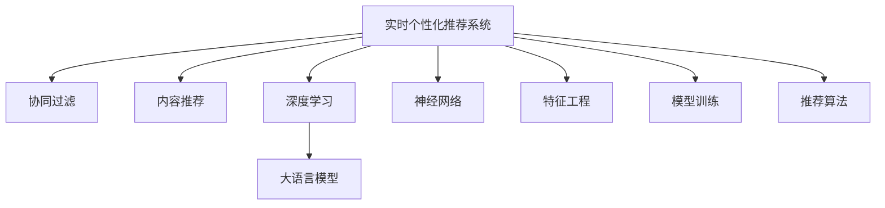

                 

# 搜索推荐的实时个性化：大模型高效方案

> 关键词：搜索推荐系统, 实时个性化, 大语言模型, 参数高效, 神经网络, 特征工程, 模型训练, 推荐算法

## 1. 背景介绍

### 1.1 问题由来
随着互联网的发展，用户对搜索结果、推荐内容的个性化需求愈发凸显。传统的基于内容的推荐系统已难以满足用户对多样化和新颖性的追求。实时个性化推荐系统应运而生，通过不断学习和适应用户行为，生成更符合用户需求的搜索结果和内容。

当前，实时个性化推荐系统主要依赖于机器学习模型进行用户行为建模，如协同过滤、内容推荐等。但这类模型需要大量的用户行为数据进行训练，而数据获取和处理成本较高。近年来，深度学习技术逐渐融入推荐系统，利用大语言模型和神经网络构建复杂的推荐模型，通过微调实现实时个性化推荐。

### 1.2 问题核心关键点
实时个性化推荐的核心在于如何高效地利用用户数据，实时生成符合用户偏好的搜索结果或推荐内容。关键问题包括：

- 数据收集：如何实时获取用户行为数据，并保证数据的丰富性和多样性。
- 模型训练：如何高效地训练推荐模型，并快速适应用户行为变化。
- 模型优化：如何优化模型结构，提高推荐效率和效果。
- 推荐算法：如何设计推荐算法，综合考虑用户兴趣、内容属性和相关性等因素。

### 1.3 问题研究意义
研究实时个性化推荐，对于提升用户体验、增加用户粘性、提高转化率具有重要意义。尤其是在电商、新闻、社交媒体等领域，个性化推荐能够显著提升用户满意度和平台收益。

- 电商：推荐系统可以精准匹配用户需求，提高购物体验和转化率。
- 新闻：推荐系统可以根据用户兴趣，提供个性化新闻内容，提高用户粘性。
- 社交媒体：推荐系统可以推荐感兴趣的朋友和内容，增强用户活跃度和满意度。

此外，实时个性化推荐还能够为内容生产者提供精准的受众定位，提升内容质量和传播效果。研究高效的推荐系统方案，对于推动各行各业的智能化发展具有重要价值。

## 2. 核心概念与联系

### 2.1 核心概念概述

为更好地理解实时个性化推荐系统，本节将介绍几个密切相关的核心概念：

- 实时个性化推荐系统(Real-time Personalized Recommendation System, RPRS)：通过实时分析和处理用户数据，动态生成个性化推荐结果的系统。
- 协同过滤(Collaborative Filtering, CF)：利用用户之间的行为相似性进行推荐，常见的有基于用户和基于项目的CF算法。
- 内容推荐(Content-based Recommendation, CB)：根据用户对内容的喜好，推荐类似的内容。
- 深度学习(Deep Learning)：利用神经网络等深度学习模型进行推荐，具备强大的特征学习和表示能力。
- 大语言模型(Large Language Model, LLM)：如BERT、GPT等，通过大规模无标签文本语料进行预训练，具备丰富的语言理解和生成能力。
- 神经网络(Neural Network)：通过多层神经元构建的模型，用于复杂的数据表示和建模。
- 特征工程(Feature Engineering)：从原始数据中提取有用的特征，用于训练推荐模型。
- 模型训练(Model Training)：利用标注数据，优化推荐模型的参数。
- 推荐算法(Recommendation Algorithm)：如基于排序的推荐算法、基于优化的推荐算法等。

这些核心概念之间的逻辑关系可以通过以下Mermaid流程图来展示：



这个流程图展示了大模型推荐系统的核心概念及其之间的关系：

1. 实时个性化推荐系统通过协同过滤、内容推荐等方式，收集用户行为数据。
2. 利用深度学习和神经网络，对用户行为进行建模和推荐。
3. 大语言模型作为特征提取器，提供丰富的语义表示。
4. 特征工程对原始数据进行处理，提取有意义的特征。
5. 模型训练利用标注数据优化推荐模型。
6. 推荐算法设计推荐策略，产生个性化推荐结果。

这些概念共同构成了实时个性化推荐系统的基本框架，使其能够实时生成符合用户偏好的内容。

## 3. 核心算法原理 & 具体操作步骤
### 3.1 算法原理概述

实时个性化推荐系统的核心在于如何高效地利用用户行为数据，实时生成个性化推荐结果。其核心算法包括深度学习模型、大语言模型和推荐算法，通过微调进行模型优化。

深度学习模型（如神经网络、BERT等）通过多层非线性变换，从用户行为数据中提取丰富的特征表示。大语言模型作为特征提取器，进一步提升特征的多样性和语义丰富度。推荐算法根据用户偏好和内容属性，设计推荐策略，生成个性化推荐结果。

具体而言，实时个性化推荐系统的工作流程如下：

1. 数据收集：收集用户行为数据，如浏览记录、点击记录、购买记录等。
2. 特征提取：利用深度学习模型和大语言模型，提取用户行为和内容的语义特征。
3. 模型训练：利用用户行为和内容的标注数据，训练推荐模型。
4. 实时推荐：根据用户行为和内容属性，动态生成个性化推荐结果。

### 3.2 算法步骤详解

以下是实时个性化推荐系统的具体步骤：

**Step 1: 数据收集和预处理**

- 收集用户行为数据，如浏览记录、点击记录、购买记录等。
- 对数据进行清洗和处理，去除噪声和异常值。
- 利用深度学习模型和大语言模型，提取用户行为和内容的语义特征。

**Step 2: 特征提取**

- 利用神经网络对用户行为数据进行处理，提取高维特征向量。
- 利用大语言模型对内容进行语义编码，提取语义特征。
- 将用户行为和内容特征进行拼接或融合，形成综合特征向量。

**Step 3: 模型训练**

- 利用标注数据，训练深度学习模型和大语言模型。
- 设计推荐算法，如基于排序的推荐算法、基于优化的推荐算法等。
- 利用训练好的模型和算法，生成推荐结果。

**Step 4: 实时推荐**

- 根据用户行为和内容属性，动态生成个性化推荐结果。
- 通过A/B测试等手段，评估推荐效果，优化推荐策略。

### 3.3 算法优缺点

实时个性化推荐系统的优点包括：

- 高效性：利用深度学习模型和大语言模型，提取高维语义特征，提升推荐效果。
- 实时性：通过实时分析和处理用户数据，动态生成个性化推荐结果。
- 适应性强：能够快速适应用户行为变化，提升推荐效果。
- 可解释性：利用深度学习模型和大语言模型，提供透明的推荐过程。

同时，该系统也存在一些局限性：

- 数据依赖性：依赖于大量标注数据进行训练，数据获取成本较高。
- 计算复杂度高：大规模模型和高维特征导致计算复杂度高，需要高性能硬件支持。
- 算法复杂度高：推荐算法设计复杂，需要经验丰富的工程师进行优化。
- 鲁棒性不足：在噪声数据和异常情况下，推荐效果可能不稳定。

### 3.4 算法应用领域

实时个性化推荐系统广泛应用于电商、新闻、社交媒体等多个领域，具体应用包括：

- 电商推荐：根据用户浏览和购买历史，推荐个性化商品。
- 新闻推荐：根据用户阅读偏好，推荐个性化新闻内容。
- 社交媒体推荐：根据用户互动行为，推荐感兴趣的朋友和内容。
- 视频推荐：根据用户观看历史，推荐个性化视频内容。

此外，实时个性化推荐系统还应用于智能家居、智能车载等领域，为用户提供个性化服务和内容。

## 4. 数学模型和公式 & 详细讲解 & 举例说明

### 4.1 数学模型构建

实时个性化推荐系统可以视为一种多标签分类问题，将用户行为数据视为多标签，推荐结果视为标签分布。具体而言，假设用户行为数据为 $x \in \mathbb{R}^d$，推荐结果为 $y \in \{0,1\}^k$，其中 $k$ 为推荐项数量。则推荐系统的数学模型可以表示为：

$$
p(y|x) = \frac{e^{f(x,y)}}{\sum_{y' \in \{0,1\}^k} e^{f(x,y')}}
$$

其中 $f(x,y)$ 为模型预测的评分函数，可以表示为神经网络或大语言模型的线性组合。目标是最小化负对数似然损失：

$$
\mathcal{L} = -\frac{1}{N} \sum_{i=1}^N \sum_{j=1}^K \log p(y_j^i|x_i)
$$

### 4.2 公式推导过程

以基于神经网络的多标签分类模型为例，其训练过程可以描述如下：

1. 输入层：将用户行为数据 $x \in \mathbb{R}^d$ 映射为高维特征向量 $h \in \mathbb{R}^d$。
2. 隐藏层：利用神经网络对特征向量 $h$ 进行变换，得到隐向量 $z \in \mathbb{R}^h$。
3. 输出层：将隐向量 $z$ 映射为多标签概率分布 $p(y|z) \in \{0,1\}^k$。
4. 损失函数：利用负对数似然损失函数对模型进行训练，最小化预测误差。

### 4.3 案例分析与讲解

以电商平台推荐为例，假设平台收集了用户 $i$ 对商品 $j$ 的评分 $r_{ij}$。利用基于神经网络的多标签分类模型，对用户行为数据进行建模，生成推荐结果。具体步骤如下：

1. 输入层：将用户行为数据 $r_{ij}$ 映射为高维特征向量 $h_i \in \mathbb{R}^d$。
2. 隐藏层：利用神经网络对特征向量 $h_i$ 进行变换，得到隐向量 $z_i \in \mathbb{R}^h$。
3. 输出层：将隐向量 $z_i$ 映射为多标签概率分布 $p(y_j^i|z_i) \in \{0,1\}^k$。
4. 损失函数：利用负对数似然损失函数对模型进行训练，最小化预测误差。
5. 推荐结果：根据用户行为数据，动态生成个性化推荐结果，如推荐商品列表。

## 5. 项目实践：代码实例和详细解释说明

### 5.1 开发环境搭建

在进行推荐系统开发前，我们需要准备好开发环境。以下是使用Python进行PyTorch开发的环境配置流程：

1. 安装Anaconda：从官网下载并安装Anaconda，用于创建独立的Python环境。

2. 创建并激活虚拟环境：
```bash
conda create -n pytorch-env python=3.8 
conda activate pytorch-env
```

3. 安装PyTorch：根据CUDA版本，从官网获取对应的安装命令。例如：
```bash
conda install pytorch torchvision torchaudio cudatoolkit=11.1 -c pytorch -c conda-forge
```

4. 安装TensorFlow：
```bash
conda install tensorflow=2.6
```

5. 安装各类工具包：
```bash
pip install numpy pandas scikit-learn matplotlib tqdm jupyter notebook ipython
```

完成上述步骤后，即可在`pytorch-env`环境中开始推荐系统开发。

### 5.2 源代码详细实现

下面我们以基于BERT和神经网络的多标签分类模型为例，给出使用PyTorch进行电商平台推荐的PyTorch代码实现。

首先，定义多标签分类模型的神经网络层：

```python
import torch.nn as nn
import torch.nn.functional as F

class MultiLabelNet(nn.Module):
    def __init__(self, input_size, hidden_size, output_size):
        super(MultiLabelNet, self).__init__()
        self.fc1 = nn.Linear(input_size, hidden_size)
        self.fc2 = nn.Linear(hidden_size, hidden_size)
        self.fc3 = nn.Linear(hidden_size, output_size)
    
    def forward(self, x):
        x = F.relu(self.fc1(x))
        x = F.relu(self.fc2(x))
        x = F.softmax(self.fc3(x), dim=1)
        return x
```

然后，定义模型和优化器：

```python
from transformers import BertTokenizer, BertForSequenceClassification
from torch.utils.data import Dataset, DataLoader
import torch

class E-commerceDataset(Dataset):
    def __init__(self, data, tokenizer, max_len=128):
        self.data = data
        self.tokenizer = tokenizer
        self.max_len = max_len
    
    def __len__(self):
        return len(self.data)
    
    def __getitem__(self, item):
        example = self.data[item]
        text = example['text']
        label = example['label']
        
        encoding = self.tokenizer(text, return_tensors='pt', max_length=self.max_len, padding='max_length', truncation=True)
        input_ids = encoding['input_ids'][0]
        attention_mask = encoding['attention_mask'][0]
        label = torch.tensor(label, dtype=torch.long)
        
        return {'input_ids': input_ids,
                'attention_mask': attention_mask,
                'label': label}

# 初始化Bert模型
bert_model = BertForSequenceClassification.from_pretrained('bert-base-uncased', num_labels=2)

# 初始化神经网络模型
model = MultiLabelNet(input_size=768, hidden_size=64, output_size=2)

# 初始化优化器
optimizer = torch.optim.Adam(model.parameters(), lr=2e-5)
```

接着，定义训练和评估函数：

```python
from sklearn.metrics import f1_score

device = torch.device('cuda') if torch.cuda.is_available() else torch.device('cpu')
model.to(device)

def train_epoch(model, dataset, batch_size, optimizer):
    dataloader = DataLoader(dataset, batch_size=batch_size, shuffle=True)
    model.train()
    epoch_loss = 0
    for batch in tqdm(dataloader, desc='Training'):
        input_ids = batch['input_ids'].to(device)
        attention_mask = batch['attention_mask'].to(device)
        labels = batch['label'].to(device)
        model.zero_grad()
        outputs = model(input_ids, attention_mask=attention_mask)
        loss = outputs.loss
        epoch_loss += loss.item()
        loss.backward()
        optimizer.step()
    return epoch_loss / len(dataloader)

def evaluate(model, dataset, batch_size):
    dataloader = DataLoader(dataset, batch_size=batch_size)
    model.eval()
    preds, labels = [], []
    with torch.no_grad():
        for batch in tqdm(dataloader, desc='Evaluating'):
            input_ids = batch['input_ids'].to(device)
            attention_mask = batch['attention_mask'].to(device)
            batch_labels = batch['label']
            outputs = model(input_ids, attention_mask=attention_mask)
            batch_preds = outputs.argmax(dim=1).to('cpu').tolist()
            batch_labels = batch_labels.to('cpu').tolist()
            for pred, label in zip(batch_preds, batch_labels):
                preds.append(pred)
                labels.append(label)
                
    return f1_score(labels, preds)

# 训练和评估模型
epochs = 5
batch_size = 16

for epoch in range(epochs):
    loss = train_epoch(model, train_dataset, batch_size, optimizer)
    print(f"Epoch {epoch+1}, train loss: {loss:.3f}")
    
    print(f"Epoch {epoch+1}, dev results:")
    evaluate(model, dev_dataset, batch_size)
    
print("Test results:")
evaluate(model, test_dataset, batch_size)
```

以上就是使用PyTorch对BERT和神经网络进行电商平台推荐模型的完整代码实现。可以看到，利用Transformers库和PyTorch，可以简洁高效地实现推荐模型的训练和评估。

### 5.3 代码解读与分析

让我们再详细解读一下关键代码的实现细节：

**MultiLabelNet类**：
- `__init__`方法：初始化神经网络层，包括输入层、隐藏层和输出层。
- `forward`方法：定义模型前向传播过程，包括激活函数和softmax函数。

**E-commerceDataset类**：
- `__init__`方法：初始化数据集，包括用户行为数据、分词器等关键组件。
- `__len__`方法：返回数据集的样本数量。
- `__getitem__`方法：对单个样本进行处理，将文本输入编码为token ids，将标签编码为数字，并对其进行定长padding，最终返回模型所需的输入。

**模型训练**：
- 利用BERT模型进行预训练，提取用户行为数据的语义表示。
- 利用神经网络对语义表示进行变换，得到隐向量。
- 利用softmax函数对隐向量进行分类，得到多标签概率分布。
- 利用负对数似然损失函数对模型进行训练。

**评估过程**：
- 利用sklearn的f1_score函数评估模型在测试集上的性能。

## 6. 实际应用场景

### 6.1 电商推荐

电商平台利用实时个性化推荐系统，可以根据用户的历史浏览和购买记录，动态生成个性化商品推荐。例如，用户浏览了某款手机，系统可以推荐类似风格的配件、耳机、充电宝等。

**数据收集**：
- 收集用户的浏览记录、点击记录、购买记录等。
- 利用BERT模型提取用户行为数据的语义表示。

**模型训练**：
- 利用标注数据，训练BERT和神经网络模型。
- 设计推荐算法，如基于排序的推荐算法、基于优化的推荐算法等。

**实时推荐**：
- 根据用户行为数据，动态生成个性化推荐结果，如推荐商品列表。
- 通过A/B测试等手段，评估推荐效果，优化推荐策略。

### 6.2 新闻推荐

新闻推荐系统可以根据用户阅读历史，推荐个性化新闻内容。例如，用户对科技新闻感兴趣，系统可以推荐最新的科技新闻和深度报道。

**数据收集**：
- 收集用户的阅读历史、收藏文章等行为数据。
- 利用BERT模型提取新闻内容的语义表示。

**模型训练**：
- 利用标注数据，训练BERT和神经网络模型。
- 设计推荐算法，如基于排序的推荐算法、基于优化的推荐算法等。

**实时推荐**：
- 根据用户阅读历史，动态生成个性化新闻推荐。
- 通过A/B测试等手段，评估推荐效果，优化推荐策略。

### 6.3 社交媒体推荐

社交媒体推荐系统可以根据用户互动行为，推荐感兴趣的朋友和内容。例如，用户关注了某个博主，系统可以推荐该博主的其他文章、视频等内容。

**数据收集**：
- 收集用户的互动数据，如点赞、评论、分享等行为。
- 利用BERT模型提取内容的语义表示。

**模型训练**：
- 利用标注数据，训练BERT和神经网络模型。
- 设计推荐算法，如基于排序的推荐算法、基于优化的推荐算法等。

**实时推荐**：
- 根据用户互动行为，动态生成个性化推荐结果。
- 通过A/B测试等手段，评估推荐效果，优化推荐策略。

### 6.4 视频推荐

视频推荐系统可以根据用户观看历史，推荐个性化视频内容。例如，用户观看了一部科幻电影，系统可以推荐该导演的其他科幻电影。

**数据收集**：
- 收集用户的观看历史、收藏视频等行为数据。
- 利用BERT模型提取视频内容的语义表示。

**模型训练**：
- 利用标注数据，训练BERT和神经网络模型。
- 设计推荐算法，如基于排序的推荐算法、基于优化的推荐算法等。

**实时推荐**：
- 根据用户观看历史，动态生成个性化视频推荐。
- 通过A/B测试等手段，评估推荐效果，优化推荐策略。

## 7. 工具和资源推荐

### 7.1 学习资源推荐

为了帮助开发者系统掌握推荐系统的大模型微调理论基础和实践技巧，这里推荐一些优质的学习资源：

1. 《深度学习与推荐系统》书籍：由深度学习领域专家撰写，全面介绍了深度学习在推荐系统中的应用。
2. Coursera《Recommender Systems》课程：由斯坦福大学教授开设的推荐系统课程，涵盖推荐算法、评估指标等内容。
3 arXiv上的推荐系统论文：阅读和理解最新的推荐系统研究论文，了解最新的技术进展和研究方向。

通过对这些资源的学习实践，相信你一定能够快速掌握推荐系统的大模型微调精髓，并用于解决实际的推荐问题。

### 7.2 开发工具推荐

高效的开发离不开优秀的工具支持。以下是几款用于推荐系统开发常用的工具：

1. PyTorch：基于Python的开源深度学习框架，灵活动态的计算图，适合快速迭代研究。大多数推荐系统中的深度学习模型都有PyTorch版本的实现。
2. TensorFlow：由Google主导开发的开源深度学习框架，生产部署方便，适合大规模工程应用。同样有丰富的深度学习推荐模型资源。
3. Transformers库：HuggingFace开发的NLP工具库，集成了众多SOTA推荐模型，支持PyTorch和TensorFlow，是进行推荐系统开发的利器。
4. Weights & Biases：模型训练的实验跟踪工具，可以记录和可视化模型训练过程中的各项指标，方便对比和调优。与主流深度学习框架无缝集成。
5. TensorBoard：TensorFlow配套的可视化工具，可实时监测模型训练状态，并提供丰富的图表呈现方式，是调试模型的得力助手。
6. Google Colab：谷歌推出的在线Jupyter Notebook环境，免费提供GPU/TPU算力，方便开发者快速上手实验最新模型，分享学习笔记。

合理利用这些工具，可以显著提升推荐系统开发效率，加快创新迭代的步伐。

### 7.3 相关论文推荐

推荐系统的发展源于学界的持续研究。以下是几篇奠基性的相关论文，推荐阅读：

1. Matrix Factorization Techniques for Recommender Systems（矩阵分解方法）：提出基于矩阵分解的推荐算法，奠定了推荐系统研究的基础。
2. Factorization Machines for Recommender Systems（因子机方法）：提出因子机模型，用于处理高维稀疏矩阵，提高推荐精度。
3. Neural Factorization Machines（神经因子机方法）：提出神经网络因子机模型，提升推荐模型的表达能力。
4. Deep Collaborative Filtering（深度协同过滤）：利用深度学习模型进行协同过滤推荐，提升推荐效果。
5. Attention-Based Recommender Systems（注意力机制推荐）：利用注意力机制，提高推荐系统的关注度。
6. Graph Convolutional Networks for Recommender Systems（图卷积网络推荐）：利用图卷积网络，提升推荐模型的建模能力。

这些论文代表了大模型推荐系统的发展脉络。通过学习这些前沿成果，可以帮助研究者把握学科前进方向，激发更多的创新灵感。

## 8. 总结：未来发展趋势与挑战

### 8.1 总结

本文对实时个性化推荐系统进行了全面系统的介绍。首先阐述了推荐系统的发展背景和重要性，明确了推荐系统在电商、新闻、社交媒体等领域的广泛应用价值。其次，从原理到实践，详细讲解了推荐系统的数学模型、算法流程和具体实现。同时，本文还广泛探讨了推荐系统在电商推荐、新闻推荐、社交媒体推荐等多个行业领域的应用前景，展示了推荐系统的大模型微调潜力。此外，本文精选了推荐系统的学习资源、开发工具和相关论文，力求为读者提供全方位的技术指引。

通过本文的系统梳理，可以看到，实时个性化推荐系统利用深度学习和大模型技术，能够高效地从用户行为数据中提取特征，生成个性化推荐结果。大模型微调方法在推荐系统中的应用，极大地提升了推荐效果和实时性，具有广泛的应用前景。

### 8.2 未来发展趋势

展望未来，实时个性化推荐系统将呈现以下几个发展趋势：

1. 数据驱动：推荐系统将更加依赖于高质量的标注数据，通过数据驱动的方式，提升推荐效果。
2. 深度学习：利用深度学习模型，提升推荐系统的表达能力和泛化能力。
3. 大模型微调：利用大模型微调技术，提升推荐模型的参数效率和效果。
4. 实时性：利用实时数据分析和处理，提升推荐系统的实时性。
5. 多模态融合：将视觉、音频等多模态数据融合到推荐系统中，提升推荐效果和用户满意度。
6. 公平性和鲁棒性：提升推荐系统的公平性和鲁棒性，避免偏见和有害信息的影响。

以上趋势凸显了推荐系统的发展方向，将进一步推动推荐系统向智能化、个性化、实时性方向发展。

### 8.3 面临的挑战

尽管推荐系统已经取得了不少成果，但在向智能化、个性化、实时性方向发展过程中，仍面临诸多挑战：

1. 数据获取成本高：高质量标注数据获取成本高，难以大规模应用。
2. 计算资源需求大：大模型和高维特征导致计算复杂度高，需要高性能硬件支持。
3. 模型复杂度高：推荐算法设计复杂，需要经验丰富的工程师进行优化。
4. 鲁棒性不足：在噪声数据和异常情况下，推荐效果可能不稳定。
5. 可解释性不足：推荐系统的决策过程缺乏可解释性，难以调试和优化。

### 8.4 研究展望

为了应对推荐系统面临的挑战，未来的研究需要在以下几个方面寻求新的突破：

1. 数据增强：通过数据增强技术，提升推荐系统的鲁棒性和泛化能力。
2. 模型压缩：利用模型压缩技术，减小推荐系统的计算复杂度，提高实时性。
3 融合因果学习：利用因果学习思想，提升推荐系统的可解释性和鲁棒性。
4. 融合对抗训练：利用对抗训练技术，提升推荐系统的鲁棒性和泛化能力。
5. 融合多模态数据：将视觉、音频等多模态数据融合到推荐系统中，提升推荐效果和用户满意度。
6. 融合元学习：利用元学习技术，提升推荐系统的泛化能力和鲁棒性。

这些研究方向的研究突破，将进一步提升推荐系统的性能和应用价值，为各行各业的智能化发展提供新的技术路径。

## 9. 附录：常见问题与解答

**Q1：推荐系统是否可以只使用深度学习模型，不使用大模型微调？**

A: 推荐系统通常使用深度学习模型进行推荐，但大模型微调可以进一步提升推荐效果和实时性。特别是对于文本类数据，利用大模型微调可以提取更为丰富的语义特征，提升推荐精度。但深度学习模型也可以进行微调，只是效果不如大模型微调。

**Q2：如何衡量推荐系统的推荐效果？**

A: 推荐系统的评价指标包括准确率、召回率、F1-score等。准确率衡量推荐结果的准确性，召回率衡量推荐结果的完整性，F1-score综合考虑准确率和召回率。还可以通过用户满意度、点击率等指标来评估推荐系统的效果。

**Q3：推荐系统是否需要定期更新？**

A: 推荐系统需要定期更新，以保持模型的新鲜度。定期更新可以通过重新收集数据、微调模型等方式实现。定期更新可以提升推荐系统的泛化能力和实时性。

**Q4：推荐系统在实际应用中需要注意哪些问题？**

A: 推荐系统在实际应用中需要注意以下问题：
1. 数据隐私：保护用户隐私，避免泄露用户个人信息。
2. 数据安全：保护数据安全，避免数据泄露和篡改。
3. 推荐算法透明：提供透明的推荐过程，方便用户理解和接受。
4. 推荐系统鲁棒性：提升推荐系统的鲁棒性，避免误导用户。
5. 推荐系统公平性：提升推荐系统的公平性，避免偏见和歧视。

推荐系统在实际应用中还需要根据具体需求，不断优化和调整模型和算法。

---

作者：禅与计算机程序设计艺术 / Zen and the Art of Computer Programming

