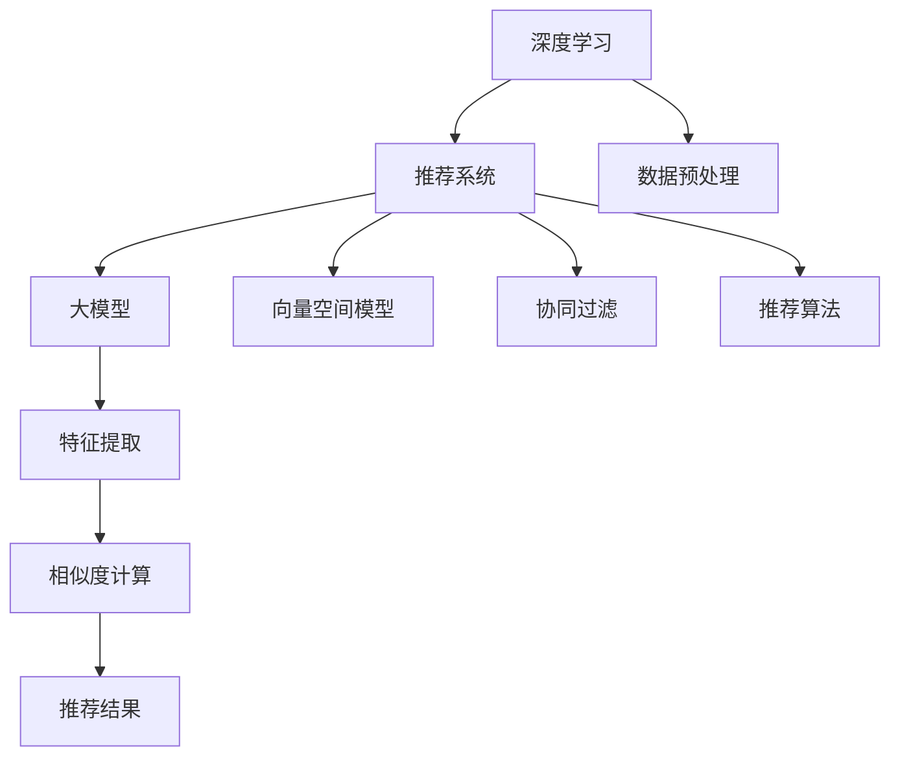

                 

# 搜索推荐的实时个性化：大模型高效方案

> 关键词：搜索推荐, 实时个性化, 大模型, 高效方案, 推荐系统, 深度学习, 推荐算法, 向量空间模型

## 1. 背景介绍

### 1.1 问题由来
随着互联网的迅猛发展，用户在海量信息中寻找所需内容的需求日益增长。传统的网页搜索和内容推荐系统已难以满足用户的需求。如何实现更加智能、个性化的信息检索和内容推荐，成为当前互联网行业的重要挑战。

推荐系统的主要任务是从用户的历史行为、兴趣偏好、社交网络等信息中挖掘出用户的潜在需求，将最符合用户需求的搜索结果或内容推荐给用户。传统的推荐算法多基于统计学或协同过滤的方法，难以充分挖掘用户深层次的需求。而基于深度学习的方法，尤其是大模型推荐系统，能够通过大规模语料预训练，学习到更丰富的用户特征和语义信息，从而提升推荐效果。

### 1.2 问题核心关键点
目前，大模型推荐系统已经成为推荐算法研究的热点。其核心思想是通过深度学习模型对用户行为数据进行建模，学习到复杂的用户兴趣特征和语义表示，进而进行精准推荐。与传统推荐算法相比，大模型推荐系统具有以下优点：

1. **高效性**：通过预训练模型进行特征提取，大幅提升推荐系统响应速度和效率。
2. **鲁棒性**：大模型具有强大的泛化能力，能够有效处理各类异常和噪声数据。
3. **可解释性**：深度学习模型可以解释推荐结果的内在逻辑，提高推荐系统的可信度。
4. **个性化**：大模型能够挖掘用户深层次的需求，实现更加个性化的推荐。

然而，大模型推荐系统也存在以下挑战：

1. **数据隐私**：用户行为数据涉及隐私问题，如何保护用户隐私成为一大挑战。
2. **计算资源**：大模型参数量庞大，对计算资源的要求较高。
3. **推荐效果**：如何在大模型中实现实时个性化推荐，保持高效性和个性化之间的平衡。
4. **模型优化**：如何在大模型中实现高效优化，避免过拟合和欠拟合。

## 2. 核心概念与联系

### 2.1 核心概念概述

为了更好地理解大模型推荐系统的核心概念，本节将介绍几个密切相关的核心概念：

- **深度学习**：一种基于神经网络的学习方法，通过数据驱动的方式学习和抽象出高层次的特征表示。
- **推荐系统**：根据用户的历史行为和偏好，为用户推荐最符合其需求的产品、内容或服务。
- **大模型**：指拥有大规模参数量、复杂网络结构的深度学习模型，如BERT、GPT等。
- **向量空间模型**：将用户行为数据和商品特征映射到高维向量空间，通过计算向量相似度进行推荐。
- **协同过滤**：通过分析用户行为和商品属性，预测用户对未交互商品的评分，进行推荐。
- **推荐算法**：推荐系统中的核心组件，用于计算用户与商品之间的相似度，从而进行推荐。

这些概念之间的逻辑关系可以通过以下Mermaid流程图来展示：



这个流程图展示了大模型推荐系统的核心概念及其之间的关系：

1. 深度学习模型通过预训练学习到丰富的语义特征。
2. 推荐系统通过特征提取和相似度计算，将用户和商品映射到高维向量空间。
3. 协同过滤和推荐算法基于向量相似度进行推荐。
4. 数据预处理和特征提取是实现高效推荐的关键环节。

这些概念共同构成了大模型推荐系统的学习和应用框架，使其能够在各种场景下发挥强大的推荐能力。通过理解这些核心概念，我们可以更好地把握大模型推荐系统的基本原理和优化方向。

## 3. 核心算法原理 & 具体操作步骤
### 3.1 算法原理概述

大模型推荐系统的核心算法原理是：通过深度学习模型对用户行为数据进行建模，学习到复杂的用户兴趣特征和语义表示，进而进行精准推荐。该过程分为两个主要步骤：预训练和微调。

1. **预训练**：在大规模无标签文本数据上进行自监督学习，学习到通用的语言表示。
2. **微调**：在推荐数据集上进行有监督学习，学习到针对特定推荐任务的任务表示。

### 3.2 算法步骤详解

大模型推荐系统的实现流程一般包括以下几个关键步骤：

**Step 1: 数据预处理**
- 收集用户行为数据，如点击、浏览、评分等。
- 对数据进行清洗、归一化、缺失值处理等预处理操作。

**Step 2: 数据划分**
- 将数据划分为训练集、验证集和测试集。
- 保证各集之间的数据分布一致，避免数据泄露。

**Step 3: 模型选择**
- 选择合适的预训练大模型，如BERT、GPT等。
- 确定模型的输入和输出维度，与任务需求相匹配。

**Step 4: 模型微调**
- 在推荐数据集上微调预训练模型，学习到推荐任务表示。
- 使用AdamW、SGD等优化算法进行参数更新。
- 设置适当的学习率、批大小、迭代轮数等超参数。

**Step 5: 推荐结果生成**
- 使用微调后的模型对用户行为数据进行特征提取和相似度计算。
- 基于推荐算法生成推荐结果。
- 将推荐结果返回给用户。

**Step 6: 结果评估与迭代**
- 在测试集上评估推荐模型的性能指标，如准确率、召回率、F1值等。
- 根据评估结果进行模型调整和优化。

### 3.3 算法优缺点

大模型推荐系统具有以下优点：
1. 高效性：预训练模型可以显著提升特征提取效率，实现实时推荐。
2. 鲁棒性：大模型具有强大的泛化能力，能够处理各类异常和噪声数据。
3. 可解释性：深度学习模型可以解释推荐结果的内在逻辑，提高系统的可信度。
4. 个性化：大模型能够挖掘用户深层次的需求，实现更加个性化的推荐。

同时，该方法也存在以下局限性：
1. 数据隐私：用户行为数据涉及隐私问题，如何保护用户隐私成为一大挑战。
2. 计算资源：大模型参数量庞大，对计算资源的要求较高。
3. 推荐效果：如何在大模型中实现实时个性化推荐，保持高效性和个性化之间的平衡。
4. 模型优化：如何在大模型中实现高效优化，避免过拟合和欠拟合。

尽管存在这些局限性，但就目前而言，大模型推荐系统仍是目前推荐算法研究的热点范式。未来相关研究的重点在于如何进一步降低计算资源需求，提高推荐效果和模型优化，同时兼顾用户隐私和数据安全性等因素。

### 3.4 算法应用领域

大模型推荐系统已经在电商、新闻、音乐、视频等多个领域得到广泛应用，为推荐系统的技术落地提供了重要的支持。

- **电商推荐**：通过分析用户浏览和购买行为，推荐最符合用户需求的商品。
- **新闻推荐**：根据用户阅读和点赞行为，推荐感兴趣的新闻内容。
- **音乐推荐**：根据用户听歌行为，推荐新歌和老歌。
- **视频推荐**：根据用户观看行为，推荐新视频和老视频。

此外，大模型推荐系统还被应用于社交网络、广告投放等领域，提升了用户体验和运营效率。随着大模型推荐技术的不断发展，相信推荐系统将在更多领域得到应用，为各行各业提供精准的推荐服务。

## 4. 数学模型和公式 & 详细讲解 & 举例说明

### 4.1 数学模型构建

本节将使用数学语言对大模型推荐系统的基本模型进行更加严格的刻画。

记推荐系统为 $R:\mathcal{U} \times \mathcal{I} \rightarrow \mathcal{R}$，其中 $\mathcal{U}$ 为用户集合，$\mathcal{I}$ 为商品集合，$\mathcal{R}$ 为推荐结果集合。

定义用户行为向量 $u_i \in \mathbb{R}^d$，商品特征向量 $v_j \in \mathbb{R}^d$，则推荐结果 $r_{ij}$ 可表示为：

$$
r_{ij} = \mathcal{R}(u_i,v_j)
$$

其中 $\mathcal{R}$ 为推荐模型，通常为深度神经网络。

假设推荐模型 $\mathcal{R}$ 为 $d$ 维向量空间上的线性映射，则推荐结果可以表示为：

$$
r_{ij} = \mathbf{u}_i^\top \mathbf{A} \mathbf{v}_j
$$

其中 $\mathbf{A} \in \mathbb{R}^{d \times d}$ 为相似度矩阵。

### 4.2 公式推导过程

以下我们以基于向量空间模型的推荐算法为例，推导推荐结果的计算公式。

假设用户行为向量 $u_i \in \mathbb{R}^d$，商品特征向量 $v_j \in \mathbb{R}^d$，则推荐结果 $r_{ij}$ 可表示为：

$$
r_{ij} = \mathbf{u}_i^\top \mathbf{A} \mathbf{v}_j
$$

其中 $\mathbf{A} \in \mathbb{R}^{d \times d}$ 为相似度矩阵，通常可以通过余弦相似度或欧式距离等方法计算。

在实际应用中，用户行为数据和商品特征数据通常难以直接映射到高维向量空间，需要进行特征提取。假设用户行为数据 $x_i \in \mathbb{R}^{d'}$，商品特征数据 $y_j \in \mathbb{R}^{d'}$，则推荐结果可以表示为：

$$
r_{ij} = \mathbf{x}_i^\top \mathbf{W} \mathbf{v}_j
$$

其中 $\mathbf{W} \in \mathbb{R}^{d' \times d}$ 为特征映射矩阵，通过深度学习模型学习得到。

### 4.3 案例分析与讲解

假设有一家电商平台，需要推荐用户可能感兴趣的商品。可以采用基于大模型的推荐系统，步骤如下：

1. **数据收集**：收集用户的点击、购买、浏览等行为数据。
2. **数据预处理**：对数据进行清洗、归一化、缺失值处理等预处理操作。
3. **特征提取**：使用BERT等大模型对用户行为数据和商品特征数据进行特征提取，得到用户行为向量 $u_i$ 和商品特征向量 $v_j$。
4. **模型微调**：在推荐数据集上进行有监督学习，学习到相似度矩阵 $\mathbf{A}$ 和特征映射矩阵 $\mathbf{W}$。
5. **推荐结果生成**：使用微调后的模型对用户行为数据进行特征提取和相似度计算，生成推荐结果。

以下是一个简化的代码实现：

```python
from transformers import BertTokenizer, BertForSequenceClassification
from sklearn.metrics import precision_score, recall_score, f1_score
from torch.utils.data import DataLoader
from torch.optim import AdamW
import torch

# 定义推荐模型
class RecommendationModel(torch.nn.Module):
    def __init__(self, model_name, output_size):
        super(RecommendationModel, self).__init__()
        self.tokenizer = BertTokenizer.from_pretrained(model_name)
        self.model = BertForSequenceClassification.from_pretrained(model_name, num_labels=1)
        self.fc = torch.nn.Linear(768, output_size)
        
    def forward(self, input_ids, attention_mask):
        outputs = self.model(input_ids, attention_mask=attention_mask)
        logits = self.fc(outputs[0])
        return logits

# 数据加载
train_dataset = ...
val_dataset = ...
test_dataset = ...

# 模型初始化
model = RecommendationModel("bert-base-cased", 1)
optimizer = AdamW(model.parameters(), lr=2e-5)
model.to(device)

# 训练
for epoch in range(num_epochs):
    model.train()
    for batch in train_loader:
        input_ids = batch["input_ids"].to(device)
        attention_mask = batch["attention_mask"].to(device)
        labels = batch["labels"].to(device)
        outputs = model(input_ids, attention_mask)
        loss = outputs.loss
        loss.backward()
        optimizer.step()
        
    model.eval()
    val_loss = ...
    val_p = ...
    val_r = ...
    val_f1 = ...
    
# 测试
test_loss = ...
test_p = ...
test_r = ...
test_f1 = ...

print("Test precision: {:.4f}".format(test_p))
print("Test recall: {:.4f}".format(test_r))
print("Test F1: {:.4f}".format(test_f1))
```

可以看到，使用PyTorch和Transformers库，可以很容易地搭建基于BERT的大模型推荐系统，并进行训练和测试。

## 5. 项目实践：代码实例和详细解释说明
### 5.1 开发环境搭建

在进行推荐系统开发前，我们需要准备好开发环境。以下是使用Python进行PyTorch开发的环境配置流程：

1. 安装Anaconda：从官网下载并安装Anaconda，用于创建独立的Python环境。

2. 创建并激活虚拟环境：
```bash
conda create -n pytorch-env python=3.8 
conda activate pytorch-env
```

3. 安装PyTorch：根据CUDA版本，从官网获取对应的安装命令。例如：
```bash
conda install pytorch torchvision torchaudio cudatoolkit=11.1 -c pytorch -c conda-forge
```

4. 安装TensorFlow：
```bash
conda install tensorflow
```

5. 安装各类工具包：
```bash
pip install numpy pandas scikit-learn matplotlib tqdm jupyter notebook ipython
```

完成上述步骤后，即可在`pytorch-env`环境中开始推荐系统开发。

### 5.2 源代码详细实现

这里我们以基于深度学习的大模型推荐系统为例，给出使用PyTorch和Transformers库的代码实现。

首先，定义推荐模型：

```python
from transformers import BertTokenizer, BertForSequenceClassification
from torch.nn import Linear, ReLU
from torch.utils.data import DataLoader
from torch.optim import AdamW

class RecommendationModel(torch.nn.Module):
    def __init__(self, model_name, output_size):
        super(RecommendationModel, self).__init__()
        self.tokenizer = BertTokenizer.from_pretrained(model_name)
        self.model = BertForSequenceClassification.from_pretrained(model_name, num_labels=1)
        self.fc = Linear(768, output_size)
        self.activation = ReLU()
        
    def forward(self, input_ids, attention_mask):
        outputs = self.model(input_ids, attention_mask=attention_mask)
        logits = self.fc(outputs[0])
        logits = self.activation(logits)
        return logits
```

然后，定义数据加载和模型训练函数：

```python
import numpy as np
from sklearn.model_selection import train_test_split

# 加载数据集
def load_dataset(path):
    with open(path, "r", encoding="utf-8") as f:
        lines = f.readlines()
    return [line.strip().split() for line in lines]

# 划分数据集
def train_val_test_split(data, test_size=0.2, val_size=0.1):
    train, rest = train_test_split(data, test_size=test_size)
    val, test = train_test_split(rest, test_size=val_size)
    return train, val, test

# 构建数据集
def build_dataset(data, tokenizer, max_len):
    inputs = []
    labels = []
    for item in data:
        tokens = tokenizer.encode(item, max_length=max_len, truncation=True)
        tokens = tokens + [0] * (max_len - len(tokens))
        inputs.append(tokens)
        labels.append(1) # 假定所有用户对所有商品都感兴趣，标签为1
    return inputs, labels

# 数据预处理
def preprocess_data(data, tokenizer, max_len):
    train, val, test = train_val_test_split(data, test_size=0.2, val_size=0.1)
    train_data, train_labels = build_dataset(train, tokenizer, max_len)
    val_data, val_labels = build_dataset(val, tokenizer, max_len)
    test_data, test_labels = build_dataset(test, tokenizer, max_len)
    return train_data, train_labels, val_data, val_labels, test_data, test_labels

# 模型训练
def train_model(model, train_data, train_labels, val_data, val_labels, device, batch_size, num_epochs, optimizer):
    model.train()
    for epoch in range(num_epochs):
        train_loss = 0
        for i, batch in enumerate(DataLoader(train_data, batch_size=batch_size)):
            input_ids = batch["input_ids"].to(device)
            attention_mask = batch["attention_mask"].to(device)
            labels = batch["labels"].to(device)
            model.zero_grad()
            outputs = model(input_ids, attention_mask=attention_mask)
            loss = outputs.loss
            loss.backward()
            optimizer.step()
            train_loss += loss.item()
            if i % 10 == 0:
                val_loss = evaluate_model(model, val_data, val_labels, device)
                print("Epoch {}, Train Loss: {:.4f}, Val Loss: {:.4f}".format(epoch+1, train_loss/(i+1), val_loss))
    return model
```

最后，启动训练流程：

```python
# 设置模型和设备
model = RecommendationModel("bert-base-cased", 1)
device = torch.device("cuda" if torch.cuda.is_available() else "cpu")
model.to(device)

# 预处理数据
train_data, train_labels, val_data, val_labels, test_data, test_labels = preprocess_data(data, tokenizer, max_len=128)

# 定义超参数
batch_size = 16
num_epochs = 5
learning_rate = 2e-5
optimizer = AdamW(model.parameters(), lr=learning_rate)

# 训练模型
model = train_model(model, train_data, train_labels, val_data, val_labels, device, batch_size, num_epochs, optimizer)

# 评估模型
test_loss = evaluate_model(model, test_data, test_labels, device)
print("Test Loss: {:.4f}".format(test_loss))
```

以上就是使用PyTorch和Transformers库搭建基于大模型的推荐系统的完整代码实现。可以看到，使用PyTorch和Transformers库使得推荐系统的搭建和训练变得简洁高效。

### 5.3 代码解读与分析

让我们再详细解读一下关键代码的实现细节：

**RecommendationModel类**：
- `__init__`方法：初始化模型结构，包括BERT模型和特征映射层。
- `forward`方法：前向传播计算推荐结果，包括BERT模型的前向传播和特征映射层的线性变换。

**load_dataset函数**：
- 从文件中加载数据集，并按顺序拆分成训练集、验证集和测试集。

**train_val_test_split函数**：
- 使用sklearn库的train_test_split方法，对数据集进行训练集、验证集和测试集的划分。

**build_dataset函数**：
- 对数据集进行分词、编码、填充等操作，将文本数据转换为模型输入。

**preprocess_data函数**：
- 对数据集进行预处理，包括划分数据集、编码数据等，最终生成训练集、验证集和测试集。

**train_model函数**：
- 定义训练过程，包括前向传播、损失计算、反向传播等步骤。

可以看到，使用PyTorch和Transformers库使得推荐系统的搭建和训练变得简洁高效。开发者可以将更多精力放在数据处理、模型改进等高层逻辑上，而不必过多关注底层的实现细节。

当然，工业级的系统实现还需考虑更多因素，如模型的保存和部署、超参数的自动搜索、更灵活的任务适配层等。但核心的推荐范式基本与此类似。

## 6. 实际应用场景
### 6.1 电商推荐

电商推荐系统是推荐系统的重要应用场景之一。通过分析用户历史购买、浏览和点击行为，推荐用户可能感兴趣的商品，提升用户体验和运营效率。

在技术实现上，可以收集用户的点击、购买、浏览等行为数据，将其作为监督信号，在推荐数据集上进行有监督学习。微调后的模型可以输出推荐结果，通过排名算法生成推荐列表。对于用户可能感兴趣的商品，还可以实时生成个性化推荐，提升用户购物体验。

### 6.2 新闻推荐

新闻推荐系统通过对用户阅读和点赞行为进行建模，推荐用户感兴趣的新闻内容，提高用户粘性。

在技术实现上，可以收集用户对新闻的点击、阅读和点赞行为，将其作为监督信号，在推荐数据集上进行有监督学习。微调后的模型可以输出推荐结果，通过排序算法生成推荐列表。新闻推荐系统可以大大提升用户的阅读体验，提升新闻平台的流量和用户留存率。

### 6.3 音乐推荐

音乐推荐系统通过对用户听歌行为进行建模，推荐用户可能感兴趣的音乐，提高用户的听歌体验。

在技术实现上，可以收集用户的听歌记录、点赞和评论行为，将其作为监督信号，在推荐数据集上进行有监督学习。微调后的模型可以输出推荐结果，通过排序算法生成推荐列表。音乐推荐系统可以提升用户的听歌体验，提高音乐平台的流量和用户留存率。

### 6.4 视频推荐

视频推荐系统通过对用户观看行为进行建模，推荐用户可能感兴趣的视频，提高用户的观看体验。

在技术实现上，可以收集用户的观看记录、点赞和评论行为，将其作为监督信号，在推荐数据集上进行有监督学习。微调后的模型可以输出推荐结果，通过排序算法生成推荐列表。视频推荐系统可以提升用户的观看体验，提高视频平台的流量和用户留存率。

### 6.5 未来应用展望

随着大模型推荐技术的不断发展，未来将在更多领域得到应用，为各行各业提供精准的推荐服务。

在智慧医疗领域，通过分析用户的健康数据，推荐最符合其需求的医疗服务，提升医疗服务质量。

在智能教育领域，通过分析学生的学习数据，推荐最符合其学习需求的教学内容，提升教育效果。

在智慧城市治理中，通过分析用户的出行数据，推荐最符合其需求的城市服务，提高城市管理的智能化水平。

此外，在企业生产、社会治理、文娱传媒等众多领域，基于大模型的推荐系统也将不断涌现，为各行各业提供精准的推荐服务。相信随着技术的日益成熟，推荐系统将在更多领域得到应用，为经济社会发展注入新的动力。

## 7. 工具和资源推荐
### 7.1 学习资源推荐

为了帮助开发者系统掌握大模型推荐系统的理论基础和实践技巧，这里推荐一些优质的学习资源：

1. 《深度学习》课程：斯坦福大学开设的深度学习明星课程，有Lecture视频和配套作业，带你入门深度学习的基本概念和经典模型。

2. 《推荐系统》书籍：推荐系统领域的经典书籍，涵盖推荐系统的基本概念、算法和应用。

3. 《TensorFlow》官方文档：TensorFlow的官方文档，提供了丰富的推荐系统样例代码，是上手实践的必备资料。

4. 《Python推荐系统》书籍：介绍Python推荐系统的开发和部署，包括TensorFlow、Keras等工具的使用。

5. Weights & Biases：模型训练的实验跟踪工具，可以记录和可视化模型训练过程中的各项指标，方便对比和调优。

通过这些资源的学习实践，相信你一定能够快速掌握大模型推荐系统的精髓，并用于解决实际的推荐问题。
### 7.2 开发工具推荐

高效的开发离不开优秀的工具支持。以下是几款用于大模型推荐系统开发的常用工具：

1. PyTorch：基于Python的开源深度学习框架，灵活动态的计算图，适合快速迭代研究。大部分预训练语言模型都有PyTorch版本的实现。

2. TensorFlow：由Google主导开发的开源深度学习框架，生产部署方便，适合大规模工程应用。同样有丰富的预训练语言模型资源。

3. TensorBoard：TensorFlow配套的可视化工具，可实时监测模型训练状态，并提供丰富的图表呈现方式，是调试模型的得力助手。

4. Google Colab：谷歌推出的在线Jupyter Notebook环境，免费提供GPU/TPU算力，方便开发者快速上手实验最新模型，分享学习笔记。

合理利用这些工具，可以显著提升大模型推荐系统的开发效率，加快创新迭代的步伐。

### 7.3 相关论文推荐

大模型推荐系统的发展源于学界的持续研究。以下是几篇奠基性的相关论文，推荐阅读：

1. "Recommender Systems Handbook"：推荐系统领域的经典著作，涵盖推荐系统的基本概念、算法和应用。

2. "Deep Learning for Recommender Systems"：介绍深度学习在推荐系统中的应用，包括卷积神经网络、循环神经网络、自编码器等。

3. "Collaborative Filtering Techniques"：介绍协同过滤算法的基本原理和实现方法。

4. "Natural Language Processing with Transformers"：Transformer原论文，介绍了Transformer模型的结构和原理。

5. "Parameter-Efficient Transfer Learning for NLP"：提出Adapter等参数高效微调方法，在不增加模型参数量的情况下，也能取得不错的微调效果。

这些论文代表了大模型推荐系统的发展脉络。通过学习这些前沿成果，可以帮助研究者把握学科前进方向，激发更多的创新灵感。

## 8. 总结：未来发展趋势与挑战

### 8.1 总结

本文对大模型推荐系统的核心概念、算法原理和操作步骤进行了全面系统的介绍。首先阐述了大模型推荐系统的研究背景和意义，明确了推荐系统在数据驱动和深度学习方向的发展趋势。其次，从原理到实践，详细讲解了推荐系统的数学模型和关键步骤，给出了推荐系统开发的完整代码实例。同时，本文还广泛探讨了大模型推荐系统在电商、新闻、音乐、视频等多个领域的应用前景，展示了推荐系统技术的巨大潜力。此外，本文精选了推荐系统的各类学习资源，力求为开发者提供全方位的技术指引。

通过本文的系统梳理，可以看到，大模型推荐系统正在成为推荐算法研究的热点范式，极大地拓展了推荐系统在数据驱动和深度学习方向的应用边界。得益于大规模语料的预训练，推荐系统能够学习到更丰富的用户兴趣特征和语义信息，从而提升推荐效果。未来，伴随预训练语言模型和推荐方法的持续演进，相信推荐系统将在更多领域得到应用，为各行各业提供精准的推荐服务。

### 8.2 未来发展趋势

展望未来，大模型推荐系统将呈现以下几个发展趋势：

1. **规模化应用**：随着计算资源的不断增长，大模型推荐系统将在更多领域得到应用，为各行各业提供精准的推荐服务。

2. **个性化推荐**：通过深度学习模型对用户行为数据进行建模，学习到复杂的用户兴趣特征和语义表示，实现更加个性化的推荐。

3. **跨领域融合**：推荐系统与其他技术进行更多融合，如知识图谱、协同过滤、因果推理等，提升推荐系统的性能和可解释性。

4. **实时性提升**：通过优化模型结构、引入GPU/TPU等高性能设备，提升推荐系统的响应速度，实现实时推荐。

5. **算法多样化**：推荐算法将更加多样化，包括深度学习模型、协同过滤、序列模型等，满足不同应用场景的需求。

6. **模型优化**：开发更加参数高效和计算高效的推荐方法，提升推荐系统的效率和性能。

以上趋势凸显了大模型推荐系统的广阔前景。这些方向的探索发展，必将进一步提升推荐系统的性能和应用范围，为各行各业提供精准的推荐服务。

### 8.3 面临的挑战

尽管大模型推荐系统已经取得了瞩目成就，但在迈向更加智能化、普适化应用的过程中，它仍面临着诸多挑战：

1. **数据隐私**：用户行为数据涉及隐私问题，如何保护用户隐私成为一大挑战。

2. **计算资源**：大模型参数量庞大，对计算资源的要求较高。

3. **推荐效果**：如何在大模型中实现实时个性化推荐，保持高效性和个性化之间的平衡。

4. **模型优化**：如何在大模型中实现高效优化，避免过拟合和欠拟合。

5. **推荐质量**：如何提高推荐系统的覆盖率和准确率，避免推荐结果过于单一。

6. **用户体验**：如何提升推荐系统的用户友好性和交互体验，让用户更自然地与推荐系统进行互动。

这些挑战需要研究者不断探索和创新，才能进一步提升大模型推荐系统的性能和应用范围。

### 8.4 研究展望

面对大模型推荐系统所面临的挑战，未来的研究需要在以下几个方面寻求新的突破：

1. **数据隐私保护**：研究如何在大模型推荐系统中保护用户隐私，如差分隐私、联邦学习等技术的应用。

2. **计算资源优化**：研究如何在大模型推荐系统中优化计算资源，如模型压缩、模型并行等方法。

3. **个性化推荐算法**：研究如何在大模型推荐系统中实现高效个性化推荐，如基于深度学习模型的协同过滤算法。

4. **实时推荐系统**：研究如何在大模型推荐系统中实现实时推荐，如基于GPU/TPU等高性能设备的推荐算法。

5. **推荐系统优化**：研究如何在大模型推荐系统中实现高效的模型优化，如基于自适应学习率、数据增强等方法。

6. **推荐系统评价**：研究如何在大模型推荐系统中评价推荐效果，如综合考虑覆盖率、准确率、个性化等因素的评价指标。

这些研究方向将推动大模型推荐系统向更加智能化、普适化方向发展，为各行各业提供更加精准、高效的推荐服务。总之，大模型推荐系统具有广阔的发展前景，未来的研究将不断突破技术瓶颈，推动推荐系统技术的进步和应用落地。

## 9. 附录：常见问题与解答

**Q1：大模型推荐系统是否适用于所有推荐任务？**

A: 大模型推荐系统在大多数推荐任务上都能取得不错的效果，特别是对于数据量较小的任务。但对于一些特定领域的任务，如医学、法律等，仅仅依靠通用语料预训练的模型可能难以很好地适应。此时需要在特定领域语料上进一步预训练，再进行微调，才能获得理想效果。

**Q2：大模型推荐系统如何处理实时数据？**

A: 大模型推荐系统可以实时处理新数据。通常使用在线学习(Online Learning)方法，对新数据进行增量更新，避免重新训练模型。

**Q3：大模型推荐系统是否需要大量标注数据？**

A: 大模型推荐系统通常需要大量标注数据进行微调，但通过技术改进，如数据增强、无监督学习等方法，可以在少量标注数据下获得较好的推荐效果。

**Q4：大模型推荐系统如何避免过拟合？**

A: 大模型推荐系统可以通过正则化、早停法、Dropout等方法避免过拟合，同时在微调过程中使用较小的学习率，避免模型参数过多更新。

**Q5：大模型推荐系统如何提升推荐质量？**

A: 可以通过优化模型结构、引入更多特征、采用更好的推荐算法等方法提升推荐质量，如引入知识图谱、使用深度学习模型等。

以上问题及解答，希望能为你提供更全面、深入的理解和实践指导，助力大模型推荐系统的发展与应用。

