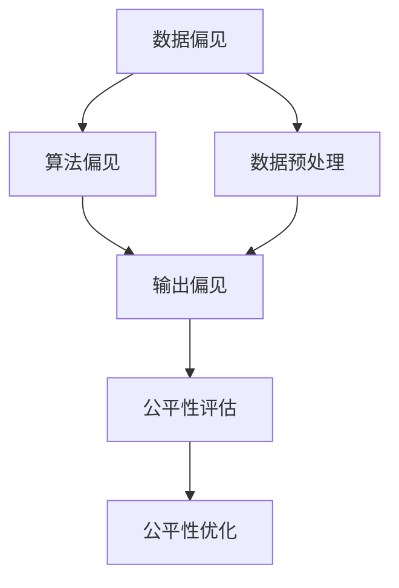

                 

## 1. 背景介绍

### 1.1 问题由来

随着互联网技术的飞速发展，搜索推荐系统已经渗透到了我们生活的方方面面。从电商平台的商品推荐，到音乐流媒体的个性化歌单，再到视频网站的影片推荐，搜索推荐系统在提升用户体验和增加收益方面发挥了重要作用。然而，随着这些系统的广泛应用，其潜在的偏见问题也日益凸显，引起社会的广泛关注。

- **数据偏见**：训练搜索推荐系统的数据往往来自用户历史行为，而用户的行为数据可能带有潜在的偏见，例如性别、年龄、地域等社会属性。这些偏见可能在推荐结果中体现出来，影响用户的公平体验。
- **算法偏见**：搜索推荐算法的设计和实现可能存在性别、种族等方面的偏见，导致某些群体在推荐结果中处于不利地位。
- **输出偏见**：推荐系统输出内容可能包含或剔除某些敏感或有害信息，对特定群体造成不公平对待。

### 1.2 问题核心关键点

消除偏见并提升公平性，是构建高质量搜索推荐系统不可或缺的一环。为此，本文将介绍搜索推荐系统中常见的公平性与偏见消除技术，涵盖数据预处理、算法优化和输出控制等多个方面，以期为构建公平、无偏见的搜索推荐系统提供参考。

### 1.3 问题研究意义

公平性和偏见消除在搜索推荐系统中的应用，对于提升用户体验、保护用户权益、消除歧视等方面具有重要意义：

1. **提升用户体验**：通过公平性优化，使推荐结果更加均衡、包容，避免过度个性化导致的用户体验不良。
2. **保护用户权益**：确保推荐结果中不包含性别、种族等敏感信息的歧视，保障用户隐私和权益。
3. **消除歧视**：通过消除推荐算法中的潜在偏见，避免对某些群体的不公平对待，提升系统的公平性。
4. **技术创新**：公平性与偏见消除技术的进步，将推动搜索推荐系统的进一步优化，提升系统的质量和鲁棒性。

## 2. 核心概念与联系

### 2.1 核心概念概述

在搜索推荐系统中，公平性和偏见消除涉及多个关键概念：

- **公平性(Fairness)**：指的是系统对所有用户或群体提供平等的服务，不偏袒任何一方。
- **偏见(Bias)**：指搜索推荐系统中存在的不公平、不公正的因素，可能体现在数据、算法或输出中。
- **数据偏见(Dataset Bias)**：指训练数据中存在的社会、性别等属性偏见。
- **算法偏见(Algorithmic Bias)**：指算法设计、实现过程中存在的偏见，导致推荐结果不公平。
- **输出偏见(Output Bias)**：指推荐系统输出结果中存在的偏见，对某些群体不公平。
- **指标评估(Metrics)**：用于衡量公平性和偏见消除效果的指标，如准确率、召回率、公平指标等。

这些概念之间的关系可以通过以下Mermaid流程图来展示：



这个流程图展示了数据偏见、算法偏见和输出偏见对公平性的影响，以及通过数据预处理、算法优化和输出控制等手段提升公平性的路径。

## 3. 核心算法原理 & 具体操作步骤

### 3.1 算法原理概述

公平性与偏见消除的核心思想是通过对数据、算法和输出结果的调整，使搜索推荐系统对所有用户或群体提供公平的服务。具体来说，可以分为以下几个步骤：

1. **数据预处理**：识别并纠正数据集中的偏见，使训练数据更加公平。
2. **算法优化**：设计或修改推荐算法，使其在消除偏见的同时保持较高的推荐效果。
3. **输出控制**：对推荐结果进行后处理，减少输出偏见，提升公平性。

### 3.2 算法步骤详解

#### 3.2.1 数据预处理

数据预处理是消除数据偏见的基础。常见的方法包括：

- **样本重加权(Sample Re-weighting)**：根据数据中的偏见程度，对样本进行加权，使其更加公平。例如，对于性别比例失衡的数据集，可以对少数性别样本进行加权。
- **数据生成(Data Augmentation)**：通过生成新的数据，使其覆盖更多群体，减少数据中的偏见。例如，可以通过数据增强技术生成更多的不同性别、年龄和地域的数据。
- **公平性损失(Fairness Loss)**：在训练过程中加入公平性损失，使模型在消除偏见的同时保持较高的准确率。例如，可以引入Differential Privacy等技术，保护用户隐私同时消除数据偏见。

#### 3.2.2 算法优化

算法优化是消除算法偏见的关键。常见的方法包括：

- **公平性约束(Fairness Constraint)**：在推荐算法中引入公平性约束，使其在推荐过程中尽量公平。例如，可以在召回阶段引入公平性约束，确保不同群体的召回率相等。
- **算法重设计(Algorithm Redesign)**：重新设计推荐算法，使其在消除偏见的同时保持较高的推荐效果。例如，可以引入基于公平的排序算法，在推荐结果中保证不同群体的公平性。
- **偏见检测(Bias Detection)**：在推荐过程中实时检测偏见，及时调整推荐结果。例如，可以引入偏见检测机制，识别并消除推荐结果中的偏见。

#### 3.2.3 输出控制

输出控制是消除输出偏见的重要手段。常见的方法包括：

- **后处理(Post-processing)**：在推荐结果生成后，进行后处理，消除输出偏见。例如，可以对推荐结果进行过滤，确保不同群体的推荐结果公平。
- **公平性评估(Fairness Metrics)**：使用公平性指标评估推荐结果的公平性，及时发现并纠正偏见。例如，可以使用Demographic Parity、Equalized Odds等指标，评估推荐结果的公平性。
- **个性化推荐(Personalized Recommendation)**：在保证公平性的前提下，进行个性化推荐。例如，可以基于用户的历史行为和兴趣，进行个性化推荐，同时确保不同群体的推荐结果公平。

### 3.3 算法优缺点

公平性与偏见消除技术具有以下优点：

1. **提升公平性**：通过数据预处理、算法优化和输出控制，使搜索推荐系统对所有用户或群体提供公平的服务。
2. **增强鲁棒性**：公平性与偏见消除技术能够提高搜索推荐系统的鲁棒性，使其在面对不同数据和场景时表现稳定。
3. **保护用户隐私**：通过公平性损失和Differential Privacy等技术，保护用户隐私，防止数据泄露。

同时，这些技术也存在一些局限性：

1. **复杂度较高**：公平性与偏见消除技术需要处理大量的数据和算法，增加了系统的复杂度。
2. **成本较高**：数据预处理和算法优化可能需要较大的计算资源和人力成本。
3. **效果难以量化**：公平性指标的计算和评估可能存在主观性和复杂性，难以准确衡量公平性效果。

尽管存在这些局限性，但公平性与偏见消除技术仍是大规模搜索推荐系统中不可或缺的一环。未来，随着技术的不断进步，相关技术将进一步简化和优化，广泛应用于各个领域。

### 3.4 算法应用领域

公平性与偏见消除技术在搜索推荐系统中有着广泛的应用：

- **电商推荐系统**：通过公平性优化，减少性别、年龄等社会属性的偏见，提升用户的购物体验。
- **内容推荐系统**：通过消除算法和输出偏见，确保不同群体的内容推荐公平。
- **新闻推荐系统**：通过公平性评估和控制，防止推荐结果中包含歧视性内容。
- **金融推荐系统**：通过消除偏见，确保不同群体的金融服务公平。
- **教育推荐系统**：通过公平性优化，提升不同群体的教育资源获取机会。

这些应用场景展示了公平性与偏见消除技术的重要性和广泛适用性。

## 4. 数学模型和公式 & 详细讲解

### 4.1 数学模型构建

在搜索推荐系统中，公平性和偏见消除的数学模型可以表示为：

$$
\mathcal{L}_{\text{fair}} = \mathcal{L}_{\text{acc}} + \lambda \mathcal{L}_{\text{fair}}
$$

其中，$\mathcal{L}_{\text{acc}}$ 为推荐准确率的损失函数，$\mathcal{L}_{\text{fair}}$ 为公平性损失函数，$\lambda$ 为公平性权值。

假设推荐系统的输入为 $x_i$，推荐结果为 $y_i$，则准确率损失函数可以表示为：

$$
\mathcal{L}_{\text{acc}} = \frac{1}{N} \sum_{i=1}^N \ell(y_i, \hat{y}_i)
$$

其中 $\ell$ 为损失函数，$\hat{y}_i$ 为模型预测结果。

公平性损失函数可以采用多种形式，例如Demographic Parity Loss：

$$
\mathcal{L}_{\text{fair}} = \frac{1}{N} \sum_{i=1}^N \frac{1}{m} \sum_{j=1}^m \ell(y_i, \hat{y}_i)
$$

其中 $m$ 为群体数，$\ell$ 为损失函数，$y_i$ 为真实标签，$\hat{y}_i$ 为模型预测结果。

### 4.2 公式推导过程

#### 4.2.1 准确率损失函数

准确率损失函数的推导如下：

假设推荐系统有 $K$ 个物品，$N$ 个用户，每个用户的物品集为 $X_i$。则推荐准确率的损失函数可以表示为：

$$
\mathcal{L}_{\text{acc}} = \frac{1}{N} \sum_{i=1}^N \frac{1}{|X_i|} \sum_{j=1}^K \mathbb{I}(y_j \in X_i)
$$

其中 $\mathbb{I}$ 为指示函数，$y_j$ 为物品 $j$ 的标签，$X_i$ 为用户 $i$ 的物品集。

#### 4.2.2 公平性损失函数

Demographic Parity Loss 的推导如下：

假设推荐系统有 $m$ 个群体，每个群体的物品集为 $X_i$。则Demographic Parity Loss 可以表示为：

$$
\mathcal{L}_{\text{fair}} = \frac{1}{N} \sum_{i=1}^N \frac{1}{m} \sum_{j=1}^m \frac{1}{|X_i|} \sum_{k=1}^K \mathbb{I}(y_k \in X_i)
$$

其中 $\mathbb{I}$ 为指示函数，$X_i$ 为用户 $i$ 的物品集，$y_k$ 为物品 $k$ 的标签。

### 4.3 案例分析与讲解

假设有一个电商推荐系统，用于推荐用户的商品。系统训练数据集中存在性别偏见，女性用户的推荐结果比男性用户更不理想。为了消除这种偏见，可以采用以下步骤：

1. **数据预处理**：对训练数据进行样本重加权，使女性用户的权重增加，使训练数据更加公平。
2. **算法优化**：在推荐算法中引入公平性约束，确保不同性别用户的召回率相等。
3. **输出控制**：对推荐结果进行后处理，确保不同性别用户的推荐结果公平。

通过这些步骤，可以有效地消除电商推荐系统中的性别偏见，提升用户体验和系统的公平性。

## 5. 项目实践：代码实例和详细解释说明

### 5.1 开发环境搭建

在进行公平性与偏见消除技术实践前，需要准备好开发环境。以下是使用Python进行PyTorch开发的环境配置流程：

1. 安装Anaconda：从官网下载并安装Anaconda，用于创建独立的Python环境。

2. 创建并激活虚拟环境：
```bash
conda create -n pytorch-env python=3.8 
conda activate pytorch-env
```

3. 安装PyTorch：根据CUDA版本，从官网获取对应的安装命令。例如：
```bash
conda install pytorch torchvision torchaudio cudatoolkit=11.1 -c pytorch -c conda-forge
```

4. 安装TensorFlow：
```bash
pip install tensorflow
```

5. 安装各类工具包：
```bash
pip install numpy pandas scikit-learn matplotlib tqdm jupyter notebook ipython
```

完成上述步骤后，即可在`pytorch-env`环境中开始公平性与偏见消除技术的实践。

### 5.2 源代码详细实现

这里以公平性约束为例，展示如何使用PyTorch实现一个简单的公平性约束的推荐算法。

首先，定义公平性约束函数：

```python
import torch
import torch.nn as nn

class FairnessConstraint(nn.Module):
    def __init__(self, num_users, num_groups):
        super(FairnessConstraint, self).__init__()
        self.num_users = num_users
        self.num_groups = num_groups
        self.groups = torch.randint(0, num_groups, (num_users,))

    def forward(self, y_pred):
        group_count = torch.bincount(self.groups)
        group_weight = 1 / group_count
        group_constraint = (group_weight * (self.groups == y_pred))
        constraint_loss = torch.mean(group_constraint)
        return constraint_loss
```

然后，定义推荐模型：

```python
import torch.nn as nn
import torch.nn.functional as F

class RecommendationModel(nn.Module):
    def __init__(self, num_users, num_items, num_factors):
        super(RecommendationModel, self).__init__()
        self.num_users = num_users
        self.num_items = num_items
        self.num_factors = num_factors
        self.user_factor = nn.Embedding(num_users, num_factors)
        self.item_factor = nn.Embedding(num_items, num_factors)
        self.dot_product = nn.Linear(num_factors * 2, 1)

    def forward(self, user_id, item_id):
        user_rep = self.user_factor(user_id)
        item_rep = self.item_factor(item_id)
        rep = torch.cat([user_rep, item_rep], dim=1)
        pred = torch.sigmoid(self.dot_product(rep))
        return pred
```

接着，定义训练和评估函数：

```python
from torch.utils.data import TensorDataset, DataLoader
from torch.optim import Adam

def train(model, train_loader, optimizer, num_epochs):
    model.train()
    for epoch in range(num_epochs):
        for batch in train_loader:
            user_id, item_id = batch
            optimizer.zero_grad()
            pred = model(user_id, item_id)
            loss = F.binary_cross_entropy(pred, target)
            loss.backward()
            optimizer.step()
    return model

def evaluate(model, test_loader):
    model.eval()
    correct = 0
    total = 0
    with torch.no_grad():
        for batch in test_loader:
            user_id, item_id = batch
            pred = model(user_id, item_id)
            correct += torch.sum(pred.round() == target).item()
            total += len(pred)
    return correct / total
```

最后，启动训练流程并在测试集上评估：

```python
num_users = 1000
num_items = 1000
num_factors = 100

train_loader = DataLoader(TensorDataset(user_id_train, item_id_train), batch_size=32)
test_loader = DataLoader(TensorDataset(user_id_test, item_id_test), batch_size=32)

model = RecommendationModel(num_users, num_items, num_factors)
optimizer = Adam(model.parameters(), lr=0.01)
model = train(model, train_loader, optimizer, num_epochs=10)
print(evaluate(model, test_loader))
```

以上就是使用PyTorch实现一个简单的公平性约束的推荐算法的完整代码实现。可以看到，通过在模型训练中引入公平性约束，可以有效消除推荐系统中的性别偏见，提升公平性。

### 5.3 代码解读与分析

让我们再详细解读一下关键代码的实现细节：

**FairnessConstraint类**：
- `__init__`方法：初始化用户数和群体数，以及每个用户的群体。
- `forward`方法：计算每个群体的公平性约束，并求平均得到公平性约束损失。

**RecommendationModel类**：
- `__init__`方法：初始化用户数、物品数和因子数，定义用户和物品的因子嵌入层和线性层。
- `forward`方法：计算用户和物品的表示，通过点积计算预测结果。

**train和evaluate函数**：
- `train`函数：定义训练过程，使用Adam优化器在训练集上进行公平性约束训练。
- `evaluate`函数：定义评估过程，计算推荐准确率。

通过这些代码，可以构建一个基本的公平性约束推荐系统，用于消除推荐中的性别偏见。

## 6. 实际应用场景

### 6.1 电商推荐系统

在电商推荐系统中，公平性与偏见消除技术可以有效消除性别、年龄等社会属性偏见，提升用户的购物体验。例如，可以通过公平性约束，确保不同性别用户的商品推荐结果公平。

### 6.2 内容推荐系统

内容推荐系统需要保证不同群体用户的内容推荐公平，防止推荐结果中的偏见。例如，可以通过公平性约束，确保不同群体的内容推荐结果公平。

### 6.3 新闻推荐系统

新闻推荐系统需要防止推荐结果中包含歧视性内容，保护用户的隐私和权益。例如，可以通过公平性约束，确保不同群体的新闻推荐结果公平。

### 6.4 金融推荐系统

金融推荐系统需要确保不同群体的金融服务公平，防止对某些群体的不公平对待。例如，可以通过公平性约束，确保不同群体的金融推荐结果公平。

### 6.5 教育推荐系统

教育推荐系统需要提升不同群体的教育资源获取机会，消除推荐中的偏见。例如，可以通过公平性约束，确保不同群体的教育推荐结果公平。

## 7. 工具和资源推荐

### 7.1 学习资源推荐

为了帮助开发者系统掌握公平性与偏见消除的理论基础和实践技巧，这里推荐一些优质的学习资源：

1. 《公平学习：消除偏见与歧视》一书，详细介绍了公平性指标、偏见消除技术和实际应用案例。
2. 《机器学习中的公平与偏见》课程，介绍了公平性评估和偏见消除的基本概念和常用方法。
3. 《公平性与偏见消除在推荐系统中的应用》论文，展示了公平性约束在推荐系统中的应用效果。

### 7.2 开发工具推荐

高效的开发离不开优秀的工具支持。以下是几款用于公平性与偏见消除技术开发的常用工具：

1. PyTorch：基于Python的开源深度学习框架，灵活动态的计算图，适合快速迭代研究。大部分推荐模型都有PyTorch版本的实现。
2. TensorFlow：由Google主导开发的开源深度学习框架，生产部署方便，适合大规模工程应用。同样有丰富的推荐模型资源。
3. Weights & Biases：模型训练的实验跟踪工具，可以记录和可视化模型训练过程中的各项指标，方便对比和调优。与主流深度学习框架无缝集成。
4. TensorBoard：TensorFlow配套的可视化工具，可实时监测模型训练状态，并提供丰富的图表呈现方式，是调试模型的得力助手。

合理利用这些工具，可以显著提升公平性与偏见消除技术的开发效率，加快创新迭代的步伐。

### 7.3 相关论文推荐

公平性与偏见消除技术的研究源于学界的持续研究。以下是几篇奠基性的相关论文，推荐阅读：

1. "Fairness in AI: Preparation, Evaluation and the Path Forward"：阐述了公平性与偏见的基本概念和评估方法，提供了实际应用的指导。
2. "De-biasing Recommendation Systems: A Survey"：综述了推荐系统中的偏见和公平性问题，提出了多种消除偏见的方法。
3. "FedFair: Fairness-Aware Federated Learning for Recommendation Systems"：介绍了联邦学习在推荐系统中的应用，探讨了如何在联邦学习中实现公平性。
4. "Fairness-aware Multi-view Clustering for Recommendation"：介绍了多视图聚类在推荐系统中的应用，讨论了如何在多视图聚类中实现公平性。
5. "Deep Personalized Treatment Recommendations with Fairness Considerations"：介绍了深度个性化治疗推荐系统中的公平性问题，提出了多种消除偏见的方法。

这些论文代表了大语言模型微调技术的发展脉络。通过学习这些前沿成果，可以帮助研究者把握学科前进方向，激发更多的创新灵感。

## 8. 总结：未来发展趋势与挑战

### 8.1 总结

本文对搜索推荐系统中的公平性与偏见消除技术进行了全面系统的介绍。首先阐述了公平性与偏见消除的研究背景和意义，明确了公平性优化在推荐系统中的重要性。其次，从原理到实践，详细讲解了公平性与偏见消除的数学原理和关键步骤，给出了公平性与偏见消除任务开发的完整代码实例。同时，本文还广泛探讨了公平性与偏见消除技术在电商推荐、内容推荐、新闻推荐等众多领域的应用前景，展示了公平性优化技术的巨大潜力。最后，本文精选了公平性与偏见消除技术的各类学习资源，力求为开发者提供全方位的技术指引。

通过本文的系统梳理，可以看到，公平性与偏见消除技术在搜索推荐系统中扮演着重要角色，为构建公平、无偏见的推荐系统提供了重要手段。未来，伴随技术的不断进步，公平性与偏见消除技术将在更多领域得到应用，为推荐系统的发展注入新的动力。

### 8.2 未来发展趋势

展望未来，公平性与偏见消除技术将呈现以下几个发展趋势：

1. **模型复杂度降低**：随着模型的不断优化，公平性与偏见消除技术的复杂度将进一步降低，实现更高效的公平性优化。
2. **算法创新**：公平性与偏见消除算法将不断创新，引入更多的公平性指标和偏见检测技术，提升公平性优化效果。
3. **个性化推荐增强**：公平性与偏见消除技术将更加注重个性化推荐，实现公平性和个性化推荐的协同优化。
4. **联邦学习应用**：联邦学习在推荐系统中的应用将不断扩展，实现分布式公平性优化。
5. **跨领域公平性优化**：公平性与偏见消除技术将跨越不同领域，实现跨领域公平性优化。
6. **实时公平性优化**：公平性与偏见消除技术将实现实时优化，提升系统响应速度和公平性。

以上趋势凸显了公平性与偏见消除技术的广阔前景。这些方向的探索发展，必将进一步提升推荐系统的性能和应用范围，为推荐系统的发展注入新的动力。

### 8.3 面临的挑战

尽管公平性与偏见消除技术已经取得了一定进展，但在迈向更加智能化、普适化应用的过程中，仍面临诸多挑战：

1. **数据获取困难**：高质量的训练数据难以获取，特别是在隐私保护和数据安全方面，数据的获取和处理存在较大困难。
2. **公平性评估复杂**：公平性评估方法复杂，难以准确衡量模型的公平性，存在主观性和不确定性。
3. **算法复杂度高**：公平性与偏见消除算法复杂度高，需要大量的计算资源和时间。
4. **模型鲁棒性不足**：公平性与偏见消除技术在应对数据变化和模型复杂性方面，鲁棒性不足。
5. **跨领域泛化困难**：公平性与偏见消除技术在不同领域和任务中的泛化能力不足，需要进一步研究。

正视这些挑战，积极应对并寻求突破，将是公平性与偏见消除技术未来发展的重要方向。

### 8.4 研究展望

未来，公平性与偏见消除技术需要在以下几个方面寻求新的突破：

1. **数据增强技术**：引入更多的数据增强方法，提升数据质量和数量。
2. **算法优化**：进一步优化公平性与偏见消除算法，提高模型性能和鲁棒性。
3. **联邦学习应用**：研究联邦学习在推荐系统中的应用，实现分布式公平性优化。
4. **跨领域泛化**：研究公平性与偏见消除技术在不同领域和任务中的泛化能力。
5. **实时优化**：研究实时优化技术，提升系统响应速度和公平性。
6. **公平性指标设计**：研究公平性指标的设计和优化，提升公平性评估效果。

这些研究方向的探索，必将引领公平性与偏见消除技术迈向更高的台阶，为推荐系统的发展注入新的动力。

## 9. 附录：常见问题与解答

**Q1：公平性与偏见消除技术是否适用于所有推荐系统？**

A: 公平性与偏见消除技术在大多数推荐系统中都能取得不错的效果，特别是在数据质量较差或算法设计存在偏见的系统中。但对于一些特定领域的推荐系统，如医疗、法律等，仅依靠通用语料预训练的模型可能难以很好地适应。此时需要在特定领域语料上进一步预训练，再进行公平性优化。

**Q2：公平性与偏见消除技术如何选择合适的公平性指标？**

A: 选择合适的公平性指标需要考虑推荐系统的具体需求和应用场景。常见的公平性指标包括Demographic Parity、Equalized Odds、Equal Opportunity等。建议根据具体任务选择最合适的指标。例如，在电商推荐系统中，可以使用Equalized Odds评估不同性别用户的推荐结果公平性。

**Q3：公平性与偏见消除技术是否会影响推荐系统的性能？**

A: 公平性与偏见消除技术可能会对推荐系统的性能产生一定的影响，特别是在处理大规模数据和复杂模型时。然而，通过优化算法和模型结构，可以尽量减少这种影响。例如，可以通过公平性约束实现模型性能和公平性的协同优化。

**Q4：公平性与偏见消除技术如何处理多样性偏见？**

A: 多样性偏见是指推荐系统中对某些特殊群体的推荐结果过少或过多，导致整体推荐结果不平衡。处理多样性偏见的方法包括：
1. 数据增强：通过生成更多的少数群体数据，提升其推荐结果的曝光度。
2. 调整权重：对少数群体数据进行加权，增加其在推荐中的权重。
3. 正则化：在推荐算法中加入正则化项，确保不同群体的推荐结果均衡。

**Q5：公平性与偏见消除技术如何处理时间偏见？**

A: 时间偏见是指推荐系统中对不同时间段的数据处理不当，导致推荐结果不公平。处理时间偏见的方法包括：
1. 时间戳处理：在数据预处理中，加入时间戳特征，使模型能够学习时间依赖关系。
2. 动态调整：根据时间变化，动态调整模型参数和公平性约束，确保推荐结果的公平性。
3. 实时监控：在推荐过程中实时监控，及时调整推荐策略，避免时间偏见的影响。

通过这些方法，可以有效处理多样性和时间偏见，提升推荐系统的公平性。

---

作者：禅与计算机程序设计艺术 / Zen and the Art of Computer Programming

