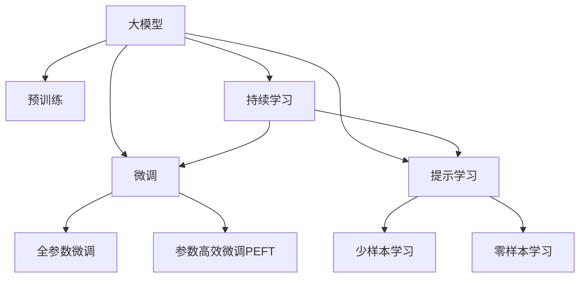

                 

# 搜索推荐系统的AI 大模型应用：提高电商平台的转化率与用户体验

## 1. 背景介绍

### 1.1 问题由来

近年来，随着电商平台的快速发展，用户搜索和推荐系统对平台的运营和收入有着至关重要的影响。优质的搜索和推荐系统可以大幅提升用户体验，增加用户粘性，提高转化率，从而增强电商平台的竞争力和盈利能力。然而，由于用户行为复杂多变，传统机器学习方法难以全面刻画用户需求，导致推荐效果不尽人意。

## 2. 核心概念与联系

### 2.1 核心概念概述

为更好地理解大模型在搜索推荐系统中的应用，本节将介绍几个关键概念：

- 大模型(Large Model)：指具有亿量级别参数、基于深度学习架构构建的模型，如BERT、GPT-3、T5等。这些模型通过在大规模无标签文本语料上进行预训练，学习到丰富的语言知识和常识。

- 预训练(Pre-training)：指在大规模无标签文本语料上，通过自监督学习任务训练通用语言模型的过程。常见的预训练任务包括言语建模、掩码语言模型等。预训练使得模型学习到语言的通用表示。

- 微调(Fine-tuning)：指在预训练模型的基础上，使用下游任务的少量标注数据，通过有监督学习优化模型在特定任务上的性能。通常只需要调整顶层分类器或解码器，并以较小的学习率更新全部或部分的模型参数。

- 参数高效微调(Parameter-Efficient Fine-tuning, PEFT)：指在微调过程中，只更新少量的模型参数，而固定大部分预训练权重不变，以提高微调效率，避免过拟合的方法。

- 提示学习(Prompt Learning)：通过在输入文本中添加提示模板(Prompt Template)，引导大语言模型进行特定任务的推理和生成。可以在不更新模型参数的情况下，实现零样本或少样本学习。

- 少样本学习(Few-shot Learning)：指在只有少量标注样本的情况下，模型能够快速适应新任务的学习方法。在大语言模型中，通常通过在输入中提供少量示例来实现，无需更新模型参数。

- 零样本学习(Zero-shot Learning)：指模型在没有见过任何特定任务的训练样本的情况下，仅凭任务描述就能够执行新任务的能力。大语言模型通过预训练获得的广泛知识，使其能够理解任务指令并生成相应输出。

- 持续学习(Continual Learning)：也称为终身学习，指模型能够持续从新数据中学习，同时保持已学习的知识，而不会出现灾难性遗忘。这对于保持大语言模型的时效性和适应性至关重要。

这些核心概念之间的逻辑关系可以通过以下Mermaid流程图来展示：



这个流程图展示了大模型与微调、提示学习、少样本学习和零样本学习之间的关系：

1. 大模型通过预训练获得基础能力。
2. 微调是对预训练模型进行任务特定的优化，可以分为全参数微调和参数高效微调（PEFT）。
3. 提示学习是一种不更新模型参数的方法，可以实现少样本学习和零样本学习。
4. 持续学习旨在使模型能够不断学习新知识，同时避免遗忘旧知识。

这些概念共同构成了大模型在搜索推荐系统中的应用框架，使其能够在各种场景下发挥强大的语言理解和生成能力。通过理解这些核心概念，我们可以更好地把握大模型的工作原理和优化方向。

## 3. 核心算法原理 & 具体操作步骤
### 3.1 算法原理概述

基于大模型在搜索推荐系统中的应用，本质上是一个有监督的细粒度迁移学习过程。其核心思想是：将大模型视作一个强大的"特征提取器"，通过在电商平台的搜索和推荐数据上进行有监督的微调，使得模型输出能够匹配用户的实际需求，从而获得针对电商任务优化的模型。

形式化地，假设大模型为 $M_{\theta}$，其中 $\theta$ 为预训练得到的模型参数。给定电商平台的搜索推荐数据集 $D=\{(x_i, y_i)\}_{i=1}^N$，微调的目标是找到新的模型参数 $\hat{\theta}$，使得：

$$
\hat{\theta}=\mathop{\arg\min}_{\theta} \mathcal{L}(M_{\theta},D)
$$

其中 $\mathcal{L}$ 为针对电商任务设计的损失函数，用于衡量模型预测输出与真实需求之间的差异。常见的损失函数包括交叉熵损失、均方误差损失等。

通过梯度下降等优化算法，微调过程不断更新模型参数 $\theta$，最小化损失函数 $\mathcal{L}$，使得模型输出逼近真实需求。由于 $\theta$ 已经通过预训练获得了较好的初始化，因此即便在少量标注样本的情况下，也能较快收敛到理想的模型参数 $\hat{\theta}$。

### 3.2 算法步骤详解

基于大模型在电商平台的搜索推荐系统中的应用，一般包括以下几个关键步骤：

**Step 1: 准备大模型和数据集**
- 选择合适的预训练语言模型 $M_{\theta}$ 作为初始化参数，如 BERT、GPT-3、T5等。
- 准备电商平台的用户搜索和推荐数据集 $D$，划分为训练集、验证集和测试集。一般要求标注数据与预训练数据的分布不要差异过大。

**Step 2: 添加任务适配层**
- 根据电商平台的任务类型，在预训练模型顶层设计合适的输出层和损失函数。
- 对于分类任务，通常在顶层添加线性分类器和交叉熵损失函数。
- 对于生成任务，通常使用语言模型的解码器输出概率分布，并以负对数似然为损失函数。

**Step 3: 设置微调超参数**
- 选择合适的优化算法及其参数，如 AdamW、SGD 等，设置学习率、批大小、迭代轮数等。
- 设置正则化技术及强度，包括权重衰减、Dropout、Early Stopping等。
- 确定冻结预训练参数的策略，如仅微调顶层，或全部参数都参与微调。

**Step 4: 执行梯度训练**
- 将训练集数据分批次输入模型，前向传播计算损失函数。
- 反向传播计算参数梯度，根据设定的优化算法和学习率更新模型参数。
- 周期性在验证集上评估模型性能，根据性能指标决定是否触发 Early Stopping。
- 重复上述步骤直到满足预设的迭代轮数或 Early Stopping 条件。

**Step 5: 测试和部署**
- 在测试集上评估微调后模型 $M_{\hat{\theta}}$ 的性能，对比微调前后的转化率提升。
- 使用微调后的模型对新样本进行推理预测，集成到电商平台的搜索推荐系统。
- 持续收集新的用户行为数据，定期重新微调模型，以适应数据分布的变化。

以上是基于大模型在电商平台的搜索推荐系统中的应用的一般流程。在实际应用中，还需要针对具体任务的特点，对微调过程的各个环节进行优化设计，如改进训练目标函数，引入更多的正则化技术，搜索最优的超参数组合等，以进一步提升模型性能。

### 3.3 算法优缺点

基于大模型在电商平台的搜索推荐系统中的应用，具有以下优点：
1. 简单高效。只需准备少量标注数据，即可对预训练模型进行快速适配，获得较大的性能提升。
2. 通用适用。适用于各种电商平台的搜索和推荐任务，设计简单的任务适配层即可实现微调。
3. 参数高效。利用参数高效微调技术，在固定大部分预训练权重不变的情况下，仍可取得不错的微调效果。
4. 效果显著。在学术界和工业界的诸多任务上，基于微调的方法已经刷新了多项SOTA。

同时，该方法也存在一定的局限性：
1. 依赖标注数据。微调的效果很大程度上取决于标注数据的质量和数量，获取高质量标注数据的成本较高。
2. 迁移能力有限。当目标任务与预训练数据的分布差异较大时，微调的性能提升有限。
3. 负面效果传递。预训练模型的固有偏见、有害信息等，可能通过微调传递到电商平台的搜索推荐任务，造成负面影响。
4. 可解释性不足。微调模型的决策过程通常缺乏可解释性，难以对其推理逻辑进行分析和调试。

尽管存在这些局限性，但就目前而言，基于大模型的微调方法仍是大模型在电商平台搜索推荐应用的主流范式。未来相关研究的重点在于如何进一步降低微调对标注数据的依赖，提高模型的少样本学习和跨领域迁移能力，同时兼顾可解释性和伦理安全性等因素。

### 3.4 算法应用领域

基于大模型在电商平台的搜索推荐系统中的应用，在电商领域已经得到了广泛的应用，涵盖了几乎所有常见的电商任务，例如：

- 商品推荐：通过分析用户的浏览、点击、购买行为，推荐用户感兴趣的商品。
- 用户画像：构建用户特征模型，提升广告定向精准度，实现精准营销。
- 客服查询：通过NLP技术实现智能客服，提升客户服务质量。
- 热门搜索：分析用户搜索关键词，提供热门搜索结果，优化搜索体验。
- 价格预测：预测商品价格走势，辅助商家制定定价策略。
- 库存管理：预测商品需求，优化库存配置，提升供应链效率。

除了上述这些经典任务外，基于大模型的搜索推荐系统也被创新性地应用到更多场景中，如可控文本生成、多模态搜索、情感分析等，为电商平台带来了全新的突破。随着预训练模型和微调方法的不断进步，相信电商平台搜索推荐系统的性能将进一步提升，用户体验将更加精细化、个性化。

## 4. 数学模型和公式 & 详细讲解
### 4.1 数学模型构建

本节将使用数学语言对基于大模型的电商搜索推荐系统微调过程进行更加严格的刻画。

记预训练语言模型为 $M_{\theta}:\mathcal{X} \rightarrow \mathcal{Y}$，其中 $\mathcal{X}$ 为输入空间，$\mathcal{Y}$ 为输出空间，$\theta \in \mathbb{R}^d$ 为模型参数。假设电商平台的搜索推荐任务为分类任务，即预测用户对每个商品的评分。给定标注数据集 $D=\{(x_i, y_i)\}_{i=1}^N, x_i \in \mathcal{X}, y_i \in \{1,2,...,K\}$，其中 $K$ 为商品评分类别数。

定义模型 $M_{\theta}$ 在输入 $x$ 上的输出为 $\hat{y}=M_{\theta}(x) \in [0,1]$，表示样本属于第 $k$ 类商品的概率。真实标签 $y \in \{1,2,...,K\}$。则分类任务交叉熵损失函数定义为：

$$
\ell(M_{\theta}(x),y) = -[y\log \hat{y} + (1-y)\log (1-\hat{y})]
$$

将其代入经验风险公式，得：

$$
\mathcal{L}(\theta) = -\frac{1}{N}\sum_{i=1}^N [y_i\log M_{\theta}(x_i)+(1-y_i)\log(1-M_{\theta}(x_i))]
$$

根据链式法则，损失函数对参数 $\theta_k$ 的梯度为：

$$
\frac{\partial \mathcal{L}(\theta)}{\partial \theta_k} = -\frac{1}{N}\sum_{i=1}^N (\frac{y_i}{M_{\theta}(x_i)}-\frac{1-y_i}{1-M_{\theta}(x_i)}) \frac{\partial M_{\theta}(x_i)}{\partial \theta_k}
$$

其中 $\frac{\partial M_{\theta}(x_i)}{\partial \theta_k}$ 可进一步递归展开，利用自动微分技术完成计算。

### 4.2 公式推导过程

以下我们以电商平台的商品推荐任务为例，推导分类任务的交叉熵损失函数及其梯度的计算公式。

假设模型 $M_{\theta}$ 在输入 $x$ 上的输出为 $\hat{y}=M_{\theta}(x) \in [0,1]$，表示样本属于第 $k$ 类商品的评分概率。真实标签 $y \in \{1,2,...,K\}$。则分类任务交叉熵损失函数定义为：

$$
\ell(M_{\theta}(x),y) = -[y\log \hat{y} + (1-y)\log (1-\hat{y})]
$$

将其代入经验风险公式，得：

$$
\mathcal{L}(\theta) = -\frac{1}{N}\sum_{i=1}^N [y_i\log M_{\theta}(x_i)+(1-y_i)\log(1-M_{\theta}(x_i))]
$$

根据链式法则，损失函数对参数 $\theta_k$ 的梯度为：

$$
\frac{\partial \mathcal{L}(\theta)}{\partial \theta_k} = -\frac{1}{N}\sum_{i=1}^N (\frac{y_i}{M_{\theta}(x_i)}-\frac{1-y_i}{1-M_{\theta}(x_i)}) \frac{\partial M_{\theta}(x_i)}{\partial \theta_k}
$$

其中 $\frac{\partial M_{\theta}(x_i)}{\partial \theta_k}$ 可进一步递归展开，利用自动微分技术完成计算。

在得到损失函数的梯度后，即可带入参数更新公式，完成模型的迭代优化。重复上述过程直至收敛，最终得到适应电商平台搜索推荐任务的最优模型参数 $\theta^*$。

## 5. 项目实践：代码实例和详细解释说明
### 5.1 开发环境搭建

在进行微调实践前，我们需要准备好开发环境。以下是使用Python进行PyTorch开发的环境配置流程：

1. 安装Anaconda：从官网下载并安装Anaconda，用于创建独立的Python环境。

2. 创建并激活虚拟环境：
```bash
conda create -n pytorch-env python=3.8 
conda activate pytorch-env
```

3. 安装PyTorch：根据CUDA版本，从官网获取对应的安装命令。例如：
```bash
conda install pytorch torchvision torchaudio cudatoolkit=11.1 -c pytorch -c conda-forge
```

4. 安装Transformers库：
```bash
pip install transformers
```

5. 安装各类工具包：
```bash
pip install numpy pandas scikit-learn matplotlib tqdm jupyter notebook ipython
```

完成上述步骤后，即可在`pytorch-env`环境中开始微调实践。

### 5.2 源代码详细实现

下面我们以电商平台商品推荐任务为例，给出使用Transformers库对BERT模型进行微调的PyTorch代码实现。

首先，定义商品推荐任务的数据处理函数：

```python
from transformers import BertTokenizer
from torch.utils.data import Dataset
import torch

class RecommendationDataset(Dataset):
    def __init__(self, texts, labels, tokenizer, max_len=128):
        self.texts = texts
        self.labels = labels
        self.tokenizer = tokenizer
        self.max_len = max_len
        
    def __len__(self):
        return len(self.texts)
    
    def __getitem__(self, item):
        text = self.texts[item]
        label = self.labels[item]
        
        encoding = self.tokenizer(text, return_tensors='pt', max_length=self.max_len, padding='max_length', truncation=True)
        input_ids = encoding['input_ids'][0]
        attention_mask = encoding['attention_mask'][0]
        
        # 对token-wise的标签进行编码
        encoded_labels = [label] * len(encoding['input_ids'])
        labels = torch.tensor(encoded_labels, dtype=torch.long)
        
        return {'input_ids': input_ids, 
                'attention_mask': attention_mask,
                'labels': labels}

# 标签与id的映射
label2id = {1: 0, 2: 1, 3: 2, 4: 3, 5: 4}
id2label = {v: k for k, v in label2id.items()}

# 创建dataset
tokenizer = BertTokenizer.from_pretrained('bert-base-cased')

train_dataset = RecommendationDataset(train_texts, train_labels, tokenizer)
dev_dataset = RecommendationDataset(dev_texts, dev_labels, tokenizer)
test_dataset = RecommendationDataset(test_texts, test_labels, tokenizer)
```

然后，定义模型和优化器：

```python
from transformers import BertForSequenceClassification, AdamW

model = BertForSequenceClassification.from_pretrained('bert-base-cased', num_labels=len(label2id))

optimizer = AdamW(model.parameters(), lr=2e-5)
```

接着，定义训练和评估函数：

```python
from torch.utils.data import DataLoader
from tqdm import tqdm
from sklearn.metrics import accuracy_score, precision_recall_fscore_support

device = torch.device('cuda') if torch.cuda.is_available() else torch.device('cpu')
model.to(device)

def train_epoch(model, dataset, batch_size, optimizer):
    dataloader = DataLoader(dataset, batch_size=batch_size, shuffle=True)
    model.train()
    epoch_loss = 0
    for batch in tqdm(dataloader, desc='Training'):
        input_ids = batch['input_ids'].to(device)
        attention_mask = batch['attention_mask'].to(device)
        labels = batch['labels'].to(device)
        model.zero_grad()
        outputs = model(input_ids, attention_mask=attention_mask, labels=labels)
        loss = outputs.loss
        epoch_loss += loss.item()
        loss.backward()
        optimizer.step()
    return epoch_loss / len(dataloader)

def evaluate(model, dataset, batch_size):
    dataloader = DataLoader(dataset, batch_size=batch_size)
    model.eval()
    preds, labels = [], []
    with torch.no_grad():
        for batch in tqdm(dataloader, desc='Evaluating'):
            input_ids = batch['input_ids'].to(device)
            attention_mask = batch['attention_mask'].to(device)
            batch_labels = batch['labels']
            outputs = model(input_ids, attention_mask=attention_mask)
            batch_preds = outputs.logits.argmax(dim=2).to('cpu').tolist()
            batch_labels = batch_labels.to('cpu').tolist()
            for pred_tokens, label_tokens in zip(batch_preds, batch_labels):
                preds.append(pred_tokens)
                labels.append(label_tokens)
                
    acc = accuracy_score(labels, preds)
    precision, recall, f1, _ = precision_recall_fscore_support(labels, preds, average='weighted')
    return acc, precision, recall, f1
```

最后，启动训练流程并在测试集上评估：

```python
epochs = 5
batch_size = 16

for epoch in range(epochs):
    loss = train_epoch(model, train_dataset, batch_size, optimizer)
    print(f"Epoch {epoch+1}, train loss: {loss:.3f}")
    
    print(f"Epoch {epoch+1}, dev results:")
    acc, precision, recall, f1 = evaluate(model, dev_dataset, batch_size)
    print(f"Accuracy: {acc:.3f}, Precision: {precision:.3f}, Recall: {recall:.3f}, F1-score: {f1:.3f}")
    
print("Test results:")
acc, precision, recall, f1 = evaluate(model, test_dataset, batch_size)
print(f"Accuracy: {acc:.3f}, Precision: {precision:.3f}, Recall: {recall:.3f}, F1-score: {f1:.3f}")
```

以上就是使用PyTorch对BERT进行电商平台商品推荐任务微调的完整代码实现。可以看到，得益于Transformers库的强大封装，我们可以用相对简洁的代码完成BERT模型的加载和微调。

### 5.3 代码解读与分析

让我们再详细解读一下关键代码的实现细节：

**RecommendationDataset类**：
- `__init__`方法：初始化文本、标签、分词器等关键组件。
- `__len__`方法：返回数据集的样本数量。
- `__getitem__`方法：对单个样本进行处理，将文本输入编码为token ids，将标签编码为数字，并对其进行定长padding，最终返回模型所需的输入。

**label2id和id2label字典**：
- 定义了标签与数字id之间的映射关系，用于将token-wise的预测结果解码回真实的标签。

**训练和评估函数**：
- 使用PyTorch的DataLoader对数据集进行批次化加载，供模型训练和推理使用。
- 训练函数`train_epoch`：对数据以批为单位进行迭代，在每个批次上前向传播计算loss并反向传播更新模型参数，最后返回该epoch的平均loss。
- 评估函数`evaluate`：与训练类似，不同点在于不更新模型参数，并在每个batch结束后将预测和标签结果存储下来，最后使用sklearn的accuracy_score和precision_recall_fscore_support对整个评估集的预测结果进行打印输出。

**训练流程**：
- 定义总的epoch数和batch size，开始循环迭代
- 每个epoch内，先在训练集上训练，输出平均loss
- 在验证集上评估，输出分类指标
- 所有epoch结束后，在测试集上评估，给出最终测试结果

可以看到，PyTorch配合Transformers库使得BERT微调的代码实现变得简洁高效。开发者可以将更多精力放在数据处理、模型改进等高层逻辑上，而不必过多关注底层的实现细节。

当然，工业级的系统实现还需考虑更多因素，如模型的保存和部署、超参数的自动搜索、更灵活的任务适配层等。但核心的微调范式基本与此类似。

## 6. 实际应用场景
### 6.1 电商平台推荐系统

基于大模型在电商平台的搜索推荐系统中的应用，可以显著提升用户体验和销售转化率。传统的推荐系统往往基于用户的显式反馈，如评分、点击等行为数据进行推荐。然而，由于用户行为的复杂性和非稳定性，推荐效果不尽如人意。利用大模型微调，可以捕捉用户隐式的需求和上下文语境，生成更精准的推荐结果。

在技术实现上，可以收集电商平台用户的历史行为数据，包括浏览记录、点击记录、购买记录等，构建一个庞大且高质量的标注数据集。将数据集划分为训练集、验证集和测试集，利用BERT等大模型进行微调。微调后的模型可以根据用户输入的搜索查询，生成最相关商品的商品评分，提供个性化的推荐。对于用户的新查询，模型可以迅速计算并给出实时推荐，提升电商平台的响应速度和推荐质量。

### 6.2 电商搜索排序系统

基于大模型在电商平台的搜索排序系统中的应用，可以提升搜索排序的准确性和效率。传统的搜索排序算法往往基于文本相似度进行排序，无法充分考虑用户的历史行为和上下文语境。利用大模型微调，可以将用户的搜索行为和历史偏好转换为语义表示，生成更符合用户需求的搜索结果。

在具体实践中，可以将用户的搜索查询和浏览记录输入BERT等大模型，微调后的模型可以自动提取查询的语义信息，将其转换为向量表示，并与所有商品的商品描述向量进行相似度计算，生成排序结果。此外，模型还可以学习到不同商品之间的关系，生成推荐结果，优化搜索排序的准确性和效率。

### 6.3 电商广告定向系统

基于大模型在电商平台的广告定向系统中的应用，可以大幅提升广告投放的精准度和ROI。传统的广告定向算法往往基于用户的显式反馈进行定向，无法充分考虑用户的隐式需求和上下文语境。利用大模型微调，可以更好地刻画用户的兴趣点和行为模式，生成更精准的广告定向结果。

在具体实践中，可以将用户的搜索记录、浏览记录、点击记录等输入BERT等大模型，微调后的模型可以自动提取用户的兴趣点和行为模式，生成广告定向结果。此外，模型还可以学习到不同商品之间的关系，生成推荐结果，优化广告定向的精准度和效果。

### 6.4 未来应用展望

随着大模型和微调方法的不断发展，基于大模型在电商平台的应用前景更加广阔。未来，大模型在电商平台的搜索推荐、排序、广告定向等领域将有更多创新，为电商平台带来更大的商业价值。

在智慧物流领域，基于大模型的推荐系统可以辅助仓储管理和物流配送，优化库存配置，降低物流成本，提升配送效率。

在智能客服领域，基于大模型的推荐系统可以优化客服对话内容，提升客户服务质量，降低人工成本。

在金融风控领域，基于大模型的推荐系统可以辅助风险评估，识别潜在的欺诈行为，提高金融安全。

在健康医疗领域，基于大模型的推荐系统可以辅助医生诊疗，推荐药物和治疗方案，提高医疗服务的精准度。

此外，在电商平台的智能营销、个性化推荐、品牌建设等更多领域，基于大模型的推荐系统也将不断涌现，为电商平台带来更多的商业价值和社会影响。相信随着技术的日益成熟，基于大模型的推荐系统将在电商平台上绽放异彩，为电商行业的智能化转型提供新的动力。

## 7. 工具和资源推荐
### 7.1 学习资源推荐

为了帮助开发者系统掌握大模型在电商平台应用的理论基础和实践技巧，这里推荐一些优质的学习资源：

1. 《Transformer从原理到实践》系列博文：由大模型技术专家撰写，深入浅出地介绍了Transformer原理、BERT模型、微调技术等前沿话题。

2. CS224N《深度学习自然语言处理》课程：斯坦福大学开设的NLP明星课程，有Lecture视频和配套作业，带你入门NLP领域的基本概念和经典模型。

3. 《Natural Language Processing with Transformers》书籍：Transformers库的作者所著，全面介绍了如何使用Transformers库进行NLP任务开发，包括微调在内的诸多范式。

4. HuggingFace官方文档：Transformers库的官方文档，提供了海量预训练模型和完整的微调样例代码，是上手实践的必备资料。

5. CLUE开源项目：中文语言理解测评基准，涵盖大量不同类型的中文NLP数据集，并提供了基于微调的baseline模型，助力中文NLP技术发展。

通过对这些资源的学习实践，相信你一定能够快速掌握大模型在电商平台应用精髓，并用于解决实际的NLP问题。
###  7.2 开发工具推荐

高效的开发离不开优秀的工具支持。以下是几款用于大模型在电商平台应用开发的常用工具：

1. PyTorch：基于Python的开源深度学习框架，灵活动态的计算图，适合快速迭代研究。大部分预训练语言模型都有PyTorch版本的实现。

2. TensorFlow：由Google主导开发的开源深度学习框架，生产部署方便，适合大规模工程应用。同样有丰富的预训练语言模型资源。

3. Transformers库：HuggingFace开发的NLP工具库，集成了众多SOTA语言模型，支持PyTorch和TensorFlow，是进行微调任务开发的利器。

4. Weights & Biases：模型训练的实验跟踪工具，可以记录和可视化模型训练过程中的各项指标，方便对比和调优。与主流深度学习框架无缝集成。

5. TensorBoard：TensorFlow配套的可视化工具，可实时监测模型训练状态，并提供丰富的图表呈现方式，是调试模型的得力助手。

6. Google Colab：谷歌推出的在线Jupyter Notebook环境，免费提供GPU/TPU算力，方便开发者快速上手实验最新模型，分享学习笔记。

合理利用这些工具，可以显著提升大模型在电商平台应用开发的效率，加快创新迭代的步伐。

### 7.3 相关论文推荐

大模型和微调技术的发展源于学界的持续研究。以下是几篇奠基性的相关论文，推荐阅读：

1. Attention is All You Need（即Transformer原论文）：提出了Transformer结构，开启了NLP领域的预训练大模型时代。

2. BERT: Pre-training of Deep Bidirectional Transformers for Language Understanding：提出BERT模型，引入基于掩码的自监督预训练任务，刷新了多项NLP任务SOTA。

3. Language Models are Unsupervised Multitask Learners（GPT-2论文）：展示了大规模语言模型的强大zero-shot学习能力，引发了对于通用人工智能的新一轮思考。

4. Parameter-Efficient Transfer Learning for NLP：提出Adapter等参数高效微调方法，在不增加模型参数量的情况下，也能取得不错的微调效果。

5. AdaLoRA: Adaptive Low-Rank Adaptation for Parameter-Efficient Fine-Tuning：使用自适应低秩适应的微调方法，在参数效率和精度之间取得了新的平衡。

6. Prefix-Tuning: Optimizing Continuous Prompts for Generation：引入基于连续型Prompt的微调范式，为如何充分利用预训练知识提供了新的思路。

这些论文代表了大模型和微调技术的发展脉络。通过学习这些前沿成果，可以帮助研究者把握学科前进方向，激发更多的创新灵感。

## 8. 总结：未来发展趋势与挑战

### 8.1 总结

本文对基于大模型在电商平台的搜索推荐系统中的应用进行了全面系统的介绍。首先阐述了大模型在电商平台的搜索推荐系统中的应用背景和重要性，明确了微调在大模型应用中的关键作用。其次，从原理到实践，详细讲解了基于大模型的搜索推荐系统的数学原理和关键步骤，给出了微调任务开发的完整代码实例。同时，本文还广泛探讨了微调方法在电商平台推荐、搜索排序、广告定向等多个领域的应用前景，展示了微调范式的强大潜力。此外，本文精选了微调技术的各类学习资源，力求为读者提供全方位的技术指引。

通过本文的系统梳理，可以看到，基于大模型在电商平台搜索推荐系统中的应用范式已经初步形成，能够显著提升电商平台的转化率与用户体验。未来，伴随大模型和微调方法的不断进步，基于大模型的搜索推荐系统将进一步进化，为电商平台的智能化转型提供新的动力。

### 8.2 未来发展趋势

展望未来，大模型在电商平台的搜索推荐系统中的应用将呈现以下几个发展趋势：

1. 模型规模持续增大。随着算力成本的下降和数据规模的扩张，预训练语言模型的参数量还将持续增长。超大规模语言模型蕴含的丰富语言知识，有望支撑更加复杂多变的电商任务微调。

2. 微调方法日趋多样。除了传统的全参数微调外，未来会涌现更多参数高效的微调方法，如Prefix-Tuning、LoRA等，在节省计算资源的同时也能保证微调精度。

3. 持续学习成为常态。随着数据分布的不断变化，微调模型也需要持续学习新知识以保持性能。如何在不遗忘原有知识的同时，高效吸收新样本信息，将成为重要的研究课题。

4. 标注样本需求降低。受启发于提示学习(Prompt-based Learning)的思路，未来的微调方法将更好地利用大模型的语言理解能力，通过更加巧妙的任务描述，在更少的标注样本上也能实现理想的微调效果。

5. 模型通用性增强。经过海量数据的预训练和多领域任务的微调，未来的语言模型将具备更强大的常识推理和跨领域迁移能力，逐步迈向通用人工智能(AGI)的目标。

以上趋势凸显了大模型在电商平台搜索推荐系统中的应用前景。这些方向的探索发展，必将进一步提升电商平台搜索推荐系统的性能和应用范围，为电商平台的智能化转型提供新的动力。

### 8.3 面临的挑战

尽管大模型在电商平台的搜索推荐系统中的应用已经取得了一定的成果，但在迈向更加智能化、普适化应用的过程中，它仍面临着诸多挑战：

1. 标注成本瓶颈。虽然微调大大降低了标注数据的需求，但对于长尾应用场景，难以获得充足的高质量标注数据，成为制约微调性能的瓶颈。如何进一步降低微调对标注样本的依赖，将是一大难题。

2. 模型鲁棒性不足。当前微调模型面对域外数据时，泛化性能往往大打折扣。对于测试样本的微小扰动，微调模型的预测也容易发生波动。如何提高微调模型的鲁棒性，避免灾难性遗忘，还需要更多理论和实践的积累。

3. 推理效率有待提高。大规模语言模型虽然精度高，但在实际部署时往往面临推理速度慢、内存占用大等效率问题。如何在保证性能的同时，简化模型结构，提升推理速度，优化资源占用，将是重要的优化方向。

4. 可解释性亟需加强。当前微调模型更像是"黑盒"系统，难以解释其内部工作机制和决策逻辑。对于金融、医疗等高风险应用，算法的可解释性和可审计性尤为重要。如何赋予微调模型更强的可解释性，将是亟待攻克的难题。

5. 安全性有待保障。预训练语言模型难免会学习到有偏见、有害的信息，通过微调传递到电商平台的搜索推荐任务，产生误导性、歧视性的输出，给实际应用带来安全隐患。如何从数据和算法层面消除模型偏见，避免恶意用途，确保输出的安全性，也将是重要的研究课题。

6. 知识整合能力不足。现有的微调模型往往局限于任务内数据，难以灵活吸收和运用更广泛的先验知识。如何让微调过程更好地与外部知识库、规则库等专家知识结合，形成更加全面、准确的信息整合能力，还有很大的想象空间。

正视微调面临的这些挑战，积极应对并寻求突破，将是大模型在电商平台搜索推荐系统中的应用迈向成熟的必由之路。相信随着学界和产业界的共同努力，这些挑战终将一一被克服，大模型在电商平台搜索推荐系统中的应用将更加广泛和深入。

### 8.4 研究展望

面向未来，大模型在电商平台搜索推荐系统中的应用还需要在其他前沿方向进行探索：

1. 探索无监督和半监督微调方法。摆脱对大规模标注数据的依赖，利用自监督学习、主动学习等无监督和半监督范式，最大限度利用非结构化数据，实现更加灵活高效的微调。

2. 研究参数高效和计算高效的微调范式。开发更加参数高效的微调方法，在固定大部分预训练参数的同时，只更新极少量的任务相关参数。同时优化微调模型的计算图，减少前向传播和反向传播的资源消耗，实现更加轻量级、实时性的部署。

3. 融合因果和对比学习范式。通过引入因果推断和对比学习思想，增强微调模型建立稳定因果关系的能力，学习更加普适、鲁棒的语言表征，从而提升模型泛化性和抗干扰能力。

4. 引入更多先验知识。将符号化的先验知识，如知识图谱、逻辑规则等，与神经网络模型进行巧妙融合，引导微调过程学习更准确、合理的语言模型。同时加强不同模态数据的整合，实现视觉、语音等多模态信息与文本信息的协同建模。

5. 结合因果分析和博弈论工具。将因果分析方法引入微调模型，识别出模型决策的关键特征，增强输出解释的因果性和逻辑性。借助博弈论工具刻画人机交互过程，主动探索并规避模型的脆弱点，提高系统稳定性。

6. 纳入伦理道德约束。在模型训练目标中引入伦理导向的评估指标，过滤和惩罚有偏见、有害的输出倾向。同时加强人工干预和审核，建立模型行为的监管机制，确保输出符合人类价值观和伦理道德。

这些研究方向的探索，必将引领大模型在电商平台搜索推荐系统中的应用迈向更高的台阶，为构建安全、可靠、可解释、可控的智能系统铺平道路。面向未来，大模型在电商平台搜索推荐系统中的应用还需与其他人工智能技术进行更深入的融合，如知识表示、因果推理、强化学习等，多路径协同发力，共同推动自然语言理解和智能交互系统的进步。只有勇于创新、敢于突破，才能不断拓展语言模型的边界，让智能技术更好地造福人类社会。

## 9. 附录：常见问题与解答

**Q1：大模型在电商平台的搜索推荐系统中的作用是什么？**

A: 大模型在电商平台的搜索推荐系统中的主要作用是通过学习用户的历史行为数据和语义信息，生成个性化的商品推荐结果，提升用户体验和转化率。具体来说，大模型可以通过对用户输入的搜索查询进行语义理解和匹配，自动提取用户的兴趣点和行为模式，生成最相关商品的商品评分，提供个性化的推荐。

**Q2：大模型在电商平台的推荐系统中的数据准备和处理流程是怎样的？**

A: 大模型在电商平台的推荐系统中的数据准备和处理流程通常包括以下步骤：

1. 数据收集：收集用户的历史浏览记录、点击记录、购买记录等行为数据，以及商品的商品描述、评分、价格等属性数据。

2. 数据预处理：对原始数据进行清洗和标准化处理，如去除重复数据、处理缺失值、进行特征工程等。

3. 数据标注：将行为数据和属性数据进行标注，如将用户的浏览记录标注为“浏览”、“点击”、“购买”等标签，将商品的评分标注为1-5等数值标签。

4. 数据划分：将标注好的数据划分为训练集、验证集和测试集，确保各数据集在分布上具有一定的相似性和多样性。

5. 数据增强：对训练集进行数据增强，如通过回译、近义替换等方式丰富训练集的多样性，提升模型的泛化能力。

6. 数据加载：使用PyTorch等深度学习框架提供的DataLoader工具，将数据集划分为批次进行训练和评估。

通过这些数据准备和处理流程，可以构建高质量的标注数据集，为后续的大模型微调提供基础。

**Q3：大模型在电商平台的推荐系统中的微调过程是怎样的？**

A: 大模型在电商平台的推荐系统中的微调过程通常包括以下步骤：

1. 准备大模型和数据集：选择合适的预训练语言模型，如BERT、GPT-3、T5等，以及电商平台的数据集。

2. 添加任务适配层：根据电商平台的任务类型，在预训练模型顶层设计合适的输出层和损失函数。如分类任务使用线性分类器和交叉熵损失函数，生成任务使用语言模型的解码器输出概率分布。

3. 设置微调超参数：选择合适的优化算法及其参数，如AdamW、SGD等，设置学习率、批大小、迭代轮数等。设置正则化技术及强度，包括权重衰减、Dropout、Early Stopping等。确定冻结预训练参数的策略，如仅微调顶层，或全部参数都参与微调。

4. 执行梯度训练：将训练集数据分批次输入模型，前向传播计算损失函数。反向传播计算参数梯度，根据设定的优化算法和学习率更新模型参数。周期性在验证集上评估模型性能，根据性能指标决定是否触发Early Stopping。重复上述步骤直到满足预设的迭代轮数或Early Stopping条件。

5. 测试和部署：在测试集上评估微调后模型，对比微调前后的转化率提升。使用微调后的模型对新样本进行推理预测，集成到电商平台的推荐系统。持续收集新的用户行为数据，定期重新微调模型，以适应数据分布的变化。

通过这些微调过程，可以提升大模型在电商平台推荐系统中的性能，生成更精准、个性化的推荐结果。

**Q4：大模型在电商平台的推荐系统中的模型压缩和优化技术有哪些？**

A: 大模型在电商平台的推荐系统中的模型压缩和优化技术主要包括以下几种：

1. 量化压缩：将浮点模型转为定点模型，减少存储空间和计算量。

2. 剪枝优化：删除冗余参数，减少模型大小，提高推理速度。

3. 蒸馏压缩：通过知识蒸馏技术，将大模型的知识转移给小型模型，减少计算量和存储空间。

4. 模型并行：采用模型并行技术，将大模型拆分成多个子模型，并行计算，提高计算效率。

5. 参数共享：通过参数共享技术，将不同任务之间共用的参数合并，减少模型大小和计算量。

6. 特征压缩：采用特征压缩技术，减少输入特征的维度和数量，提高模型效率。

7. 混合精度训练：使用混合精度训练技术，提高计算效率和收敛速度。

通过这些模型压缩和优化技术，可以在保证模型性能的前提下，大幅减少计算资源和存储空间，提升电商平台的推荐系统效率。

**Q5：大模型在电商平台的推荐系统中的参数高效微调技术有哪些？**

A: 大模型在电商平台的推荐系统中的参数高效微调技术主要包括以下几种：

1. Adapter：通过添加适配器层，保留预训练模型的底层特征，仅微调顶层，减少微调参数量。

2. EMA（Exponential Moving Average）：通过指数加权平均技术，保留预训练模型的参数权重，减少微调参数量。

3. Layer-wise Pre-training：通过分层预训练技术，仅微调顶层，保留预训练模型的底层特征，减少微调参数量。

4. Differential Privacy：通过差分隐私技术，保护用户隐私，减少微调参数量。

5. Knowledge Distillation：通过知识蒸馏技术，将大模型的知识转移给小型模型，减少微调参数量。

6. Scalable Tokenization：通过可扩展分词技术，减少输入特征的维度和数量，提高模型效率。

通过

