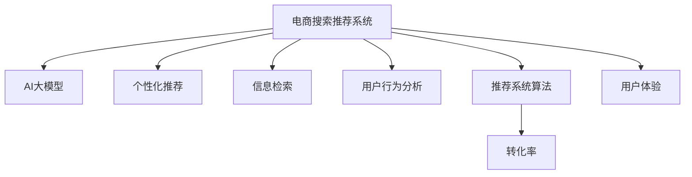

                 

# 搜索推荐系统的AI 大模型应用：提高电商平台的转化率与用户体验

> 关键词：电商搜索推荐系统、AI大模型、个性化推荐、信息检索、用户行为分析、转化率、用户体验

## 1. 背景介绍

### 1.1 问题由来
随着电子商务的迅速发展，在线购物已成为人们日常生活的一部分。电商平台为了提升用户满意度和转化率，不断创新推荐系统算法，以精准推荐商品满足用户需求。传统推荐系统大多基于协同过滤、基于内容的推荐等方法，依赖用户历史行为数据，难以实时适应用户的即时需求和兴趣变化。

AI 大模型的兴起为推荐系统带来了新的契机。大模型通过大规模语料和复杂结构的学习，可以全面掌握用户兴趣和行为特征，快速生成个性化的推荐结果，极大提升了推荐系统的灵活性和精准度。利用大模型进行推荐，已成为电商平台提升用户购买转化率和整体体验的有效手段。

### 1.2 问题核心关键点
AI 大模型在电商推荐系统中的应用，主要体现在以下几个方面：

- 模型预训练：利用大规模用户行为数据对大模型进行预训练，学习用户特征和行为模式。
- 实时推荐：在用户搜索或浏览商品时，根据实时输入数据，快速调用大模型进行个性化推荐。
- 动态更新：利用新增用户数据，动态调整模型参数，保持推荐模型的时效性。
- 多模态融合：结合用户搜索历史、浏览行为、评价反馈等多模态数据，生成更加综合的推荐结果。
- 跨域推荐：打破不同商品间的知识壁垒，提升跨领域商品的推荐精度。

通过上述技术手段，大模型在电商搜索推荐系统中的应用能够显著提升用户的购物体验和转化率，同时降低运营成本，提升平台竞争力。

### 1.3 问题研究意义
大模型在电商推荐系统中的应用，对于电商平台优化商品推荐，提升用户购买体验和转化率具有重要意义：

1. 精准推荐：大模型能够捕捉用户深层次的兴趣和需求，提供更加个性化、贴合用户偏好的推荐。
2. 提高转化率：通过精确匹配用户需求和商品信息，能够显著提升用户完成购买行为的可能性。
3. 提升用户体验：大模型的多模态融合和跨域推荐能力，能够实现更加全面、直观的商品展示，提升用户满意度。
4. 降低运营成本：自动化的推荐系统能够减少人工运营的复杂度和成本，提升运营效率。
5. 拓展应用场景：大模型推荐算法可以应用于全站商品推荐、个性化购物车、跨品类推荐等多个场景，增强平台功能。

因此，深入研究大模型在电商推荐系统中的应用，能够推动电商行业从以商品为中心的模式，向以用户为中心的模式转变，为电商平台的健康发展提供有力支持。

## 2. 核心概念与联系

### 2.1 核心概念概述

为更好地理解大模型在电商推荐系统中的应用，本节将介绍几个密切相关的核心概念：

- 电商搜索推荐系统：指电商平台上，通过分析用户行为数据，推荐符合用户兴趣的商品，提升用户体验和购买转化率的系统。
- AI大模型：指通过大规模数据预训练，具备复杂表示能力和强大泛化能力的大型神经网络模型。
- 个性化推荐：根据用户历史行为和兴趣偏好，生成个性化商品推荐列表的系统。
- 信息检索：从大量数据中快速定位符合用户查询需求的商品的系统。
- 用户行为分析：通过分析用户搜索、浏览、评价等行为数据，提取用户兴趣和需求的系统。
- 推荐系统算法：指能够从大量商品数据中，根据用户特征生成推荐结果的算法。
- 转化率：指用户从搜索商品到最终完成购买行为的比例。
- 用户体验：指用户在使用电商平台时所感受到的满意度和便捷度。

这些核心概念之间的逻辑关系可以通过以下Mermaid流程图来展示：



这个流程图展示了大模型在电商推荐系统中的应用逻辑：

1. 大模型作为电商搜索推荐系统的核心引擎，通过学习用户行为数据，生成个性化推荐。
2. 个性化推荐和信息检索是推荐系统算法的两个主要模块，实现精准推荐。
3. 用户行为分析和大模型联合使用，能够更加全面理解用户需求，生成动态更新的推荐结果。
4. 转化率和用户体验是电商搜索推荐系统的重要评价指标，直接影响平台销售业绩和用户满意度。

## 3. 核心算法原理 & 具体操作步骤
### 3.1 算法原理概述

基于AI大模型的电商搜索推荐系统，本质上是一种基于大规模语料和复杂结构的推荐算法。其核心思想是：利用大模型对海量用户行为数据进行预训练，学习用户特征和行为模式，然后根据用户实时输入，快速生成个性化推荐列表。

具体而言，电商推荐系统的实现过程如下：

1. 数据收集：收集用户历史行为数据（如搜索记录、浏览历史、评价反馈等）和商品信息数据。
2. 预训练模型：利用收集到的用户行为数据，对AI大模型进行预训练，学习用户兴趣和行为特征。
3. 实时推荐：根据用户实时输入数据（如搜索关键词、浏览记录等），调用预训练的大模型，生成个性化推荐列表。
4. 动态更新：定期更新模型参数，利用新增用户数据，保证推荐结果的实时性和精准度。
5. 多模态融合：结合用户多模态数据，如搜索、浏览、评价等，生成更加全面的推荐结果。
6. 跨域推荐：打破商品之间的知识壁垒，实现跨领域商品的推荐。

通过上述步骤，基于大模型的电商推荐系统能够在实时场景中，提供精准且个性化的推荐服务，提升用户的购买转化率和整体体验。

### 3.2 算法步骤详解

基于AI大模型的电商推荐系统一般包括以下几个关键步骤：

**Step 1: 数据收集与预处理**
- 收集用户行为数据和商品信息数据，并进行清洗、去重等预处理。
- 将数据分为训练集、验证集和测试集，准备进行模型训练和评估。

**Step 2: 模型选择与训练**
- 选择合适的AI大模型，如BERT、GPT等，并进行参数初始化。
- 将用户行为数据作为模型输入，利用预训练任务（如掩码语言模型、句子分类等），对大模型进行预训练。
- 设置训练超参数，包括学习率、批大小、迭代轮数等，并进行模型训练。

**Step 3: 实时推荐与调用**
- 实时获取用户输入数据（如搜索关键词、浏览记录等），调用预训练的大模型进行推理。
- 将用户输入数据与预训练模型输出进行融合，生成个性化推荐列表。
- 实时展示推荐结果，引导用户完成购买行为。

**Step 4: 动态更新与优化**
- 定期收集新用户数据，重新训练和优化预训练模型。
- 利用新增数据，更新模型参数，保证推荐结果的时效性和精准度。
- 利用A/B测试等手段，评估推荐效果，不断优化模型性能。

**Step 5: 多模态融合与跨域推荐**
- 结合用户多模态数据，生成更加全面的推荐结果。
- 利用知识图谱等工具，实现跨领域商品的推荐，提升推荐精度和覆盖面。

### 3.3 算法优缺点

基于AI大模型的电商推荐系统具有以下优点：

1. 精准度高：大模型能够捕捉用户深层次的兴趣和需求，生成更加个性化的推荐结果。
2. 实时性强：利用实时数据调用大模型，能够快速生成个性化推荐，提升用户体验。
3. 鲁棒性好：大模型具有较强的泛化能力，能够应对不同用户的复杂需求。
4. 覆盖面广：结合多模态数据和跨域推荐，能够涵盖更多商品和用户群体。

同时，该方法也存在一定的局限性：

1. 数据依赖度高：模型性能很大程度上依赖于数据的质量和数量，数据获取难度较大。
2. 模型复杂度高：大模型参数量庞大，训练和推理效率较低。
3. 动态调整难度大：模型需要定期更新，调整参数，成本较高。
4. 隐私风险大：用户行为数据涉及隐私，需要严格控制数据获取和使用方式。
5. 算法透明性差：大模型的内部机制复杂，难以解释推荐结果的生成逻辑。

尽管存在这些局限性，但就目前而言，基于AI大模型的推荐方法仍然是电商搜索推荐系统的主流范式。未来相关研究的重点在于如何进一步降低数据依赖，提高模型效率，提升推荐结果的透明度和可信度。

### 3.4 算法应用领域

基于大模型的电商推荐系统，在电商领域已经得到了广泛的应用，覆盖了几乎所有常见场景，例如：

- 全站推荐：利用大模型对全站商品进行推荐，提升用户浏览量和购买转化率。
- 个性化购物车：结合用户搜索历史和浏览行为，生成个性化的购物车推荐，提升用户体验。
- 跨品类推荐：打破不同商品之间的知识壁垒，实现跨品类商品的推荐，增加平台商品的多样性。
- 搜索推荐：在用户搜索关键词时，生成精准的推荐结果，提升搜索转化率。
- 新商品推荐：利用大模型对新商品进行预训练，生成基于用户兴趣的推荐列表，促进新商品销售。

除了上述这些经典应用外，大模型推荐系统还被创新性地应用到更多场景中，如智能客服、内容推荐、金融理财等，为电商推荐系统带来了全新的突破。随着预训练模型和推荐方法的不断进步，相信电商推荐系统必将在更多领域大放异彩。

## 4. 数学模型和公式 & 详细讲解  
### 4.1 数学模型构建

本节将使用数学语言对基于AI大模型的电商推荐系统进行更加严格的刻画。

记用户行为数据为 $D=\{(x_i,y_i)\}_{i=1}^N, x_i \in \mathcal{X}, y_i \in \mathcal{Y}$，其中 $\mathcal{X}$ 为用户行为特征，$\mathcal{Y}$ 为商品推荐。假设大模型为 $M_{\theta}$，其输入为 $\mathcal{X}$，输出为 $\mathcal{Y}$。

定义模型 $M_{\theta}$ 在用户行为数据 $(x,y)$ 上的损失函数为 $\ell(M_{\theta}(x),y)$，则在数据集 $D$ 上的经验风险为：

$$
\mathcal{L}(\theta) = \frac{1}{N}\sum_{i=1}^N \ell(M_{\theta}(x_i),y_i)
$$

微调的优化目标是最小化经验风险，即找到最优参数：

$$
\theta^* = \mathop{\arg\min}_{\theta} \mathcal{L}(\theta)
$$

在实践中，我们通常使用基于梯度的优化算法（如Adam、SGD等）来近似求解上述最优化问题。设 $\eta$ 为学习率，$\lambda$ 为正则化系数，则参数的更新公式为：

$$
\theta \leftarrow \theta - \eta \nabla_{\theta}\mathcal{L}(\theta) - \eta\lambda\theta
$$

其中 $\nabla_{\theta}\mathcal{L}(\theta)$ 为损失函数对参数 $\theta$ 的梯度，可通过反向传播算法高效计算。

### 4.2 公式推导过程

以下我们以二分类任务为例，推导交叉熵损失函数及其梯度的计算公式。

假设模型 $M_{\theta}$ 在用户行为数据 $(x,y)$ 上的输出为 $\hat{y}=M_{\theta}(x) \in [0,1]$，表示用户点击商品的概率。真实标签 $y \in \{0,1\}$。则二分类交叉熵损失函数定义为：

$$
\ell(M_{\theta}(x),y) = -[y\log \hat{y} + (1-y)\log (1-\hat{y})]
$$

将其代入经验风险公式，得：

$$
\mathcal{L}(\theta) = -\frac{1}{N}\sum_{i=1}^N [y_i\log M_{\theta}(x_i)+(1-y_i)\log(1-M_{\theta}(x_i))]
$$

根据链式法则，损失函数对参数 $\theta_k$ 的梯度为：

$$
\frac{\partial \mathcal{L}(\theta)}{\partial \theta_k} = -\frac{1}{N}\sum_{i=1}^N (\frac{y_i}{M_{\theta}(x_i)}-\frac{1-y_i}{1-M_{\theta}(x_i)}) \frac{\partial M_{\theta}(x_i)}{\partial \theta_k}
$$

其中 $\frac{\partial M_{\theta}(x_i)}{\partial \theta_k}$ 可进一步递归展开，利用自动微分技术完成计算。

在得到损失函数的梯度后，即可带入参数更新公式，完成模型的迭代优化。重复上述过程直至收敛，最终得到适应电商推荐任务的最优模型参数 $\theta^*$。

## 5. 项目实践：代码实例和详细解释说明
### 5.1 开发环境搭建

在进行电商推荐系统开发前，我们需要准备好开发环境。以下是使用Python进行PyTorch开发的环境配置流程：

1. 安装Anaconda：从官网下载并安装Anaconda，用于创建独立的Python环境。

2. 创建并激活虚拟环境：
```bash
conda create -n ecommerce-env python=3.8 
conda activate ecommerce-env
```

3. 安装PyTorch：根据CUDA版本，从官网获取对应的安装命令。例如：
```bash
conda install pytorch torchvision torchaudio cudatoolkit=11.1 -c pytorch -c conda-forge
```

4. 安装TensorFlow：由Google主导开发的开源深度学习框架，生产部署方便，适合大规模工程应用。同样有丰富的预训练语言模型资源。

5. 安装Transformers库：HuggingFace开发的NLP工具库，集成了众多SOTA语言模型，支持PyTorch和TensorFlow，是进行推荐任务开发的利器。

6. 安装各类工具包：
```bash
pip install numpy pandas scikit-learn matplotlib tqdm jupyter notebook ipython
```

完成上述步骤后，即可在`ecommerce-env`环境中开始推荐系统开发。

### 5.2 源代码详细实现

下面我以电商推荐系统中的商品推荐模块为例，给出使用Transformers库对BERT模型进行电商推荐系统开发的PyTorch代码实现。

首先，定义推荐系统任务的数据处理函数：

```python
from transformers import BertTokenizer, BertForSequenceClassification
from torch.utils.data import Dataset
import torch

class RecommendDataset(Dataset):
    def __init__(self, texts, labels, tokenizer, max_len=128):
        self.texts = texts
        self.labels = labels
        self.tokenizer = tokenizer
        self.max_len = max_len
        
    def __len__(self):
        return len(self.texts)
    
    def __getitem__(self, item):
        text = self.texts[item]
        label = self.labels[item]
        
        encoding = self.tokenizer(text, return_tensors='pt', max_length=self.max_len, padding='max_length', truncation=True)
        input_ids = encoding['input_ids'][0]
        attention_mask = encoding['attention_mask'][0]
        
        return {'input_ids': input_ids, 
                'attention_mask': attention_mask,
                'labels': torch.tensor(label, dtype=torch.long)}
```

然后，定义模型和优化器：

```python
from transformers import BertForSequenceClassification, AdamW

model = BertForSequenceClassification.from_pretrained('bert-base-cased', num_labels=2)

optimizer = AdamW(model.parameters(), lr=2e-5)
```

接着，定义训练和评估函数：

```python
from torch.utils.data import DataLoader
from tqdm import tqdm
from sklearn.metrics import accuracy_score

device = torch.device('cuda') if torch.cuda.is_available() else torch.device('cpu')
model.to(device)

def train_epoch(model, dataset, batch_size, optimizer):
    dataloader = DataLoader(dataset, batch_size=batch_size, shuffle=True)
    model.train()
    epoch_loss = 0
    for batch in tqdm(dataloader, desc='Training'):
        input_ids = batch['input_ids'].to(device)
        attention_mask = batch['attention_mask'].to(device)
        labels = batch['labels'].to(device)
        model.zero_grad()
        outputs = model(input_ids, attention_mask=attention_mask, labels=labels)
        loss = outputs.loss
        epoch_loss += loss.item()
        loss.backward()
        optimizer.step()
    return epoch_loss / len(dataloader)

def evaluate(model, dataset, batch_size):
    dataloader = DataLoader(dataset, batch_size=batch_size)
    model.eval()
    preds, labels = [], []
    with torch.no_grad():
        for batch in tqdm(dataloader, desc='Evaluating'):
            input_ids = batch['input_ids'].to(device)
            attention_mask = batch['attention_mask'].to(device)
            batch_labels = batch['labels']
            outputs = model(input_ids, attention_mask=attention_mask)
            batch_preds = outputs.logits.argmax(dim=2).to('cpu').tolist()
            batch_labels = batch_labels.to('cpu').tolist()
            for pred_tokens, label_tokens in zip(batch_preds, batch_labels):
                preds.append(pred_tokens)
                labels.append(label_tokens)
                
    print(accuracy_score(labels, preds))
```

最后，启动训练流程并在测试集上评估：

```python
epochs = 5
batch_size = 16

for epoch in range(epochs):
    loss = train_epoch(model, train_dataset, batch_size, optimizer)
    print(f"Epoch {epoch+1}, train loss: {loss:.3f}")
    
    print(f"Epoch {epoch+1}, test accuracy:")
    evaluate(model, test_dataset, batch_size)
    
print("All training and testing finished.")
```

以上就是使用PyTorch对BERT进行电商推荐系统开发的完整代码实现。可以看到，得益于Transformers库的强大封装，我们可以用相对简洁的代码完成BERT模型的加载和电商推荐系统的构建。

### 5.3 代码解读与分析

让我们再详细解读一下关键代码的实现细节：

**RecommendDataset类**：
- `__init__`方法：初始化文本、标签、分词器等关键组件。
- `__len__`方法：返回数据集的样本数量。
- `__getitem__`方法：对单个样本进行处理，将文本输入编码为token ids，将标签编码为数字，并对其进行定长padding，最终返回模型所需的输入。

**标签与id的映射**：
- 定义了标签与数字id之间的映射关系，用于将token-wise的预测结果解码回真实的标签。

**训练和评估函数**：
- 使用PyTorch的DataLoader对数据集进行批次化加载，供模型训练和推理使用。
- 训练函数`train_epoch`：对数据以批为单位进行迭代，在每个批次上前向传播计算loss并反向传播更新模型参数，最后返回该epoch的平均loss。
- 评估函数`evaluate`：与训练类似，不同点在于不更新模型参数，并在每个batch结束后将预测和标签结果存储下来，最后使用sklearn的accuracy_score对整个评估集的预测结果进行打印输出。

**训练流程**：
- 定义总的epoch数和batch size，开始循环迭代
- 每个epoch内，先在训练集上训练，输出平均loss
- 在测试集上评估，输出准确率
- 所有epoch结束后，给出最终评估结果

可以看到，PyTorch配合Transformers库使得BERT电商推荐系统的代码实现变得简洁高效。开发者可以将更多精力放在数据处理、模型改进等高层逻辑上，而不必过多关注底层的实现细节。

当然，工业级的系统实现还需考虑更多因素，如模型的保存和部署、超参数的自动搜索、更灵活的任务适配层等。但核心的电商推荐系统构建流程基本与此类似。

## 6. 实际应用场景
### 6.1 智能客服系统

智能客服系统是电商推荐系统的重要应用场景之一。通过将电商推荐算法应用于客服系统，可以实现更加个性化的用户服务。

具体而言，智能客服系统在接收到用户咨询时，首先利用大模型对用户输入进行语义理解，然后根据用户意图和上下文信息，生成个性化推荐列表，辅助客服人员进行回答。例如，用户询问某商品的价格时，系统可以自动推荐相关产品，提高客服效率。

### 6.2 个性化推荐

个性化推荐是电商推荐系统的核心功能，能够显著提升用户购物体验和购买转化率。利用大模型对用户行为数据进行预训练，生成个性化的推荐列表。

例如，用户在浏览商品时，系统根据用户的历史浏览记录和当前浏览行为，动态生成推荐商品列表，引导用户进一步购买。大模型的多模态融合能力，能够结合用户搜索历史、浏览记录、评价反馈等多模态数据，生成更加全面的推荐结果。

### 6.3 用户行为分析

用户行为分析是电商推荐系统的重要组成部分，通过分析用户历史行为数据，理解用户需求和偏好。利用大模型对用户行为数据进行预训练，学习用户特征和行为模式。

例如，通过分析用户搜索历史、购买记录、评价反馈等数据，系统能够全面了解用户兴趣和需求，生成更加精准的推荐结果。大模型的因果分析和对抗训练能力，能够识别用户行为中的异常和误导性信息，提高推荐系统的鲁棒性和安全性。

### 6.4 未来应用展望

随着大模型和电商推荐系统的发展，未来推荐技术将在更多领域得到应用，为电商平台的创新提供新的动力。

在智慧零售领域，基于大模型的推荐算法，能够实现商品搭配推荐、智能货架管理等功能，提升线下购物体验。

在智能家居领域，利用大模型对用户行为进行分析和预测，提供个性化的家居产品推荐，提升用户生活品质。

在智能金融领域，结合大模型和用户行为数据，提供个性化理财和投资建议，帮助用户进行财富管理。

此外，在智慧旅游、智能制造等多个领域，基于大模型的推荐系统也有广泛的应用前景，推动智能技术向更广泛的场景渗透。相信随着技术的日益成熟，电商推荐系统必将在更多行业大放异彩，为数字化转型提供有力支持。

## 7. 工具和资源推荐
### 7.1 学习资源推荐

为了帮助开发者系统掌握大模型在电商推荐系统中的应用，这里推荐一些优质的学习资源：

1. 《深度学习与电商推荐系统》系列博文：深入浅出地介绍了深度学习在电商推荐系统中的应用，包括模型构建、数据预处理、推荐算法等。

2. 《推荐系统算法与实战》书籍：系统介绍了推荐系统算法原理和应用实践，涵盖电商推荐系统的经典算法和案例。

3. CS4410《人工智能与数据挖掘》课程：南加州大学开设的AI与数据挖掘课程，涵盖了推荐系统、自然语言处理等前沿内容。

4. Coursera《机器学习基础》课程：斯坦福大学开设的机器学习入门课程，详细讲解了监督学习、无监督学习等机器学习基础概念。

5. 知乎专栏《推荐系统》：多位推荐系统专家共同撰写的推荐系统技术博客，涵盖了推荐系统算法和实际应用案例。

通过对这些资源的学习实践，相信你一定能够快速掌握大模型在电商推荐系统中的应用技巧，并用于解决实际的电商推荐问题。
###  7.2 开发工具推荐

高效的开发离不开优秀的工具支持。以下是几款用于电商推荐系统开发的常用工具：

1. PyTorch：基于Python的开源深度学习框架，灵活动态的计算图，适合快速迭代研究。大多数预训练语言模型都有PyTorch版本的实现。

2. TensorFlow：由Google主导开发的开源深度学习框架，生产部署方便，适合大规模工程应用。同样有丰富的预训练语言模型资源。

3. Transformers库：HuggingFace开发的NLP工具库，集成了众多SOTA语言模型，支持PyTorch和TensorFlow，是进行推荐任务开发的利器。

4. Weights & Biases：模型训练的实验跟踪工具，可以记录和可视化模型训练过程中的各项指标，方便对比和调优。与主流深度学习框架无缝集成。

5. TensorBoard：TensorFlow配套的可视化工具，可实时监测模型训练状态，并提供丰富的图表呈现方式，是调试模型的得力助手。

6. Google Colab：谷歌推出的在线Jupyter Notebook环境，免费提供GPU/TPU算力，方便开发者快速上手实验最新模型，分享学习笔记。

合理利用这些工具，可以显著提升电商推荐系统的开发效率，加快创新迭代的步伐。

### 7.3 相关论文推荐

大模型在电商推荐系统中的应用源于学界的持续研究。以下是几篇奠基性的相关论文，推荐阅读：

1. Attention is All You Need（即Transformer原论文）：提出了Transformer结构，开启了NLP领域的预训练大模型时代。

2. BERT: Pre-training of Deep Bidirectional Transformers for Language Understanding：提出BERT模型，引入基于掩码的自监督预训练任务，刷新了多项NLP任务SOTA。

3. TOWards an End-to-End Recommendation System with Attentive Topic Embeddings: A Tutorial: 介绍了基于注意力机制的推荐系统，展示了大模型在推荐系统中的应用潜力。

4. Transformer based Recommender systems: A Review：全面回顾了Transformer在推荐系统中的应用，展示了其在电商推荐系统中的广泛应用。

5. Sequence-aware Attention-based Recommender systems：研究了序列化注意力机制在推荐系统中的应用，提升了推荐的准确性和鲁棒性。

这些论文代表了大模型在电商推荐系统中的应用发展脉络。通过学习这些前沿成果，可以帮助研究者把握学科前进方向，激发更多的创新灵感。

## 8. 总结：未来发展趋势与挑战

### 8.1 总结

本文对基于AI大模型的电商推荐系统进行了全面系统的介绍。首先阐述了电商推荐系统的背景和应用价值，明确了电商推荐系统在提升用户购物体验和购买转化率方面的独特价值。其次，从原理到实践，详细讲解了电商推荐系统的数学模型和算法流程，给出了电商推荐系统开发的完整代码实例。同时，本文还广泛探讨了电商推荐系统在智能客服、个性化推荐、用户行为分析等多个领域的应用前景，展示了电商推荐系统在电商领域的重要作用。

通过本文的系统梳理，可以看到，基于AI大模型的电商推荐系统正在成为电商推荐系统的核心技术，极大提升了电商平台的运营效率和用户体验。未来，伴随大模型和推荐算法的持续演进，相信电商推荐系统必将在更多领域大放异彩，为电商平台的健康发展提供有力支持。

### 8.2 未来发展趋势

展望未来，电商推荐系统将呈现以下几个发展趋势：

1. 模型规模持续增大。随着算力成本的下降和数据规模的扩张，大模型参数量还将持续增长。超大规模语言模型蕴含的丰富知识，有望进一步提升推荐系统的精准度。

2. 推荐算法日趋多样。除了传统的协同过滤、基于内容的推荐等方法，未来将涌现更多基于深度学习的推荐算法，如基于Transformer的推荐算法。

3. 实时推荐成为常态。利用实时数据调用大模型，能够快速生成个性化推荐，提升用户体验。

4. 跨域推荐崛起。打破商品之间的知识壁垒，实现跨领域商品的推荐，提升推荐精度和覆盖面。

5. 多模态推荐崛起。结合用户多模态数据，如搜索、浏览、评价等，生成更加全面的推荐结果。

6. 智能客服系统融合推荐算法。通过结合大模型和推荐算法，智能客服系统能够更加智能地理解用户意图，生成更加个性化的推荐。

以上趋势凸显了电商推荐系统的广阔前景。这些方向的探索发展，必将进一步提升电商平台的运营效率和用户体验，推动电商行业的健康发展。

### 8.3 面临的挑战

尽管基于大模型的电商推荐系统已经取得了显著成效，但在迈向更加智能化、普适化应用的过程中，仍面临诸多挑战：

1. 数据依赖度高。电商推荐系统的性能很大程度上依赖于数据的质量和数量，数据获取难度较大。如何进一步降低数据依赖，提高推荐系统对数据变化的适应性，还需要更多技术和方法的支持。

2. 模型复杂度高。大模型参数量庞大，训练和推理效率较低。如何在保证推荐效果的同时，降低模型复杂度，提高推荐系统的实时性和效率，仍是一个重要问题。

3. 动态调整难度大。模型需要定期更新，调整参数，成本较高。如何简化模型更新流程，提高动态调整的效率，还需要更多的技术创新。

4. 隐私风险大。用户行为数据涉及隐私，需要严格控制数据获取和使用方式。如何保护用户隐私，增强数据安全性，还需要更多的技术手段和管理措施。

5. 算法透明性差。大模型的内部机制复杂，难以解释推荐结果的生成逻辑。如何提升推荐系统的可解释性，增强用户信任，还需要更多的研究和技术突破。

6. 推荐系统鲁棒性不足。电商推荐系统面对域外数据时，泛化性能往往大打折扣。如何提高推荐系统的鲁棒性，避免灾难性遗忘，还需要更多的理论和实践的积累。

尽管存在这些挑战，但就目前而言，基于AI大模型的电商推荐系统仍然是电商推荐系统的主流范式。未来相关研究的重点在于如何进一步降低数据依赖，提高模型效率，提升推荐结果的透明度和可信度。

### 8.4 研究展望

面对电商推荐系统所面临的种种挑战，未来的研究需要在以下几个方面寻求新的突破：

1. 探索无监督和半监督推荐方法。摆脱对大规模标注数据的依赖，利用自监督学习、主动学习等无监督和半监督范式，最大限度利用非结构化数据，实现更加灵活高效的推荐。

2. 研究参数高效和计算高效的推荐算法。开发更加参数高效的推荐算法，在固定大部分预训练参数的同时，只更新极少量的任务相关参数。同时优化推荐算法的计算图，减少前向传播和反向传播的资源消耗，实现更加轻量级、实时性的推荐系统。

3. 引入更多先验知识。将符号化的先验知识，如知识图谱、逻辑规则等，与神经网络模型进行巧妙融合，引导推荐过程学习更准确、合理的商品特征。

4. 结合因果分析和博弈论工具。将因果分析方法引入推荐系统，识别出推荐决策的关键特征，增强推荐结果的因果性和逻辑性。借助博弈论工具刻画人机交互过程，主动探索并规避推荐系统的脆弱点，提高系统稳定性。

5. 纳入伦理道德约束。在推荐系统训练目标中引入伦理导向的评估指标，过滤和惩罚有偏见、有害的推荐结果，确保推荐系统的公平性和安全性。

这些研究方向的探索，必将引领电商推荐系统迈向更高的台阶，为电商平台的健康发展提供有力支持。面向未来，大模型在电商推荐系统中的应用还需与其他人工智能技术进行更深入的融合，如知识表示、因果推理、强化学习等，多路径协同发力，共同推动电商推荐系统的技术进步和应用创新。只有勇于创新、敢于突破，才能不断拓展电商推荐系统的边界，让智能技术更好地服务于电商平台的业务发展。

## 9. 附录：常见问题与解答
**Q1：电商推荐系统如何处理长尾商品？**

A: 长尾商品通常需求量较小，但具有较高的转化率。电商推荐系统通过统计分析和数据挖掘，识别出这些长尾商品，并在推荐算法中赋予更高的权重。同时，系统通过动态调整和优化推荐策略，保证长尾商品能够获得足够的曝光机会，提升平台的销售业绩。

**Q2：大模型在电商推荐中如何保证用户隐私？**

A: 在电商推荐系统中，用户行为数据涉及隐私，需要严格控制数据获取和使用方式。系统通常采用匿名化处理，去除用户识别信息，保护用户隐私。此外，还可以通过差分隐私等技术，对用户数据进行处理，增强数据安全性。

**Q3：电商推荐系统如何应对新增用户数据？**

A: 电商推荐系统需要定期更新模型参数，利用新增用户数据进行模型优化。通常采用在线学习(Online Learning)或增量学习(Incremental Learning)算法，实时更新模型，保证推荐结果的时效性和精准度。同时，系统还需要设计合理的增量更新策略，避免模型过拟合和动态调整成本过高。

**Q4：电商推荐系统如何提升推荐结果的可解释性？**

A: 电商推荐系统通常采用黑盒模型，难以解释推荐结果的生成逻辑。可以通过引入可解释性工具，如SHAP、LIME等，对推荐结果进行局部解释，帮助用户理解推荐决策的依据。同时，系统还可以通过规则引擎、知识图谱等手段，增强推荐结果的可解释性。

**Q5：电商推荐系统如何处理用户行为的多样性和复杂性？**

A: 用户行为具有多样性和复杂性，电商推荐系统需要结合多种算法和技术，处理不同场景下的推荐问题。例如，可以通过混合模型、多任务学习等方式，综合利用各种算法的优势，提高推荐系统的鲁棒性和泛化能力。

总之，大模型在电商推荐系统中的应用，能够显著提升平台的运营效率和用户体验。未来，随着技术的不断进步和创新，相信电商推荐系统将进一步拓展其应用场景，为电商平台的健康发展提供有力支持。大模型推荐算法必将引领电商推荐系统迈向更高的台阶，推动电商行业迈向更加智能化、普适化的方向。

---

作者：禅与计算机程序设计艺术 / Zen and the Art of Computer Programming

