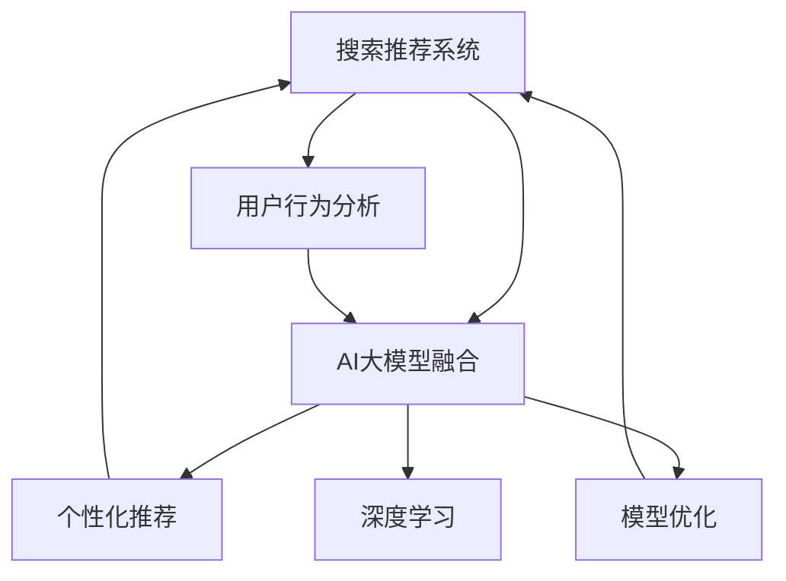

                 

# 搜索推荐系统的AI 大模型融合：电商平台的核心战略与竞争优势

> 关键词：搜索推荐系统,AI大模型融合,电商平台,用户行为分析,个性化推荐,用户体验,深度学习,模型优化

## 1. 背景介绍

随着互联网时代的快速发展和智能技术的不断突破，电商平台的竞争愈发激烈。传统电商依靠产品、价格、销量等要素吸引顾客，但在数据驱动的今天，用户行为分析、个性化推荐、商品搜索等AI技术的融合应用，已经成为了电商核心竞争力的重要组成部分。其中，搜索推荐系统作为电商平台的关键组成部分，通过预测用户需求，实现精准推荐，极大地提升了用户体验和平台转化率。

与此同时，随着深度学习和大模型的发展，AI大模型已经在电商领域展示了巨大的应用潜力。通过预训练的语言模型、视觉模型等，电商平台能够更好地理解用户需求，提升推荐和搜索的精准度，实现业务的智能化升级。然而，大模型的应用并非一蹴而就，需要深入理解其原理，并结合具体的电商场景进行合理部署，方能发挥其核心价值。

## 2. 核心概念与联系

### 2.1 核心概念概述

为更好理解AI大模型在电商平台搜索推荐系统中的应用，本节将介绍几个关键概念：

- **搜索推荐系统(Recommendation System & Search Engine)**：通过分析用户行为数据，预测用户需求，为用户推荐商品或搜索结果的系统。搜索推荐系统包括商品推荐、内容推荐、广告推荐等多种形式，为电商平台的个性化服务提供重要支持。

- **AI大模型(AI Large Model)**：以深度学习为核心的超大规模模型，通过在大规模数据集上进行预训练，学习到丰富的知识表示，具备强大的语言、图像、声音等数据的理解和生成能力。典型的大模型包括GPT、BERT、ResNet等。

- **电商平台(E-commerce Platform)**：利用互联网技术提供商品交易服务的平台，如淘宝、京东、亚马逊等。平台通过搜索推荐系统，实现用户与商品的精准匹配，提升用户体验和平台转化率。

- **用户行为分析(User Behavior Analysis)**：通过对用户的操作行为、浏览记录、购买历史等数据进行分析，获取用户的兴趣偏好、行为模式等信息，为推荐系统提供决策依据。

- **个性化推荐(Personalized Recommendation)**：基于用户历史行为和实时行为数据，为用户量身定制推荐内容，实现精准匹配。个性化推荐技术广泛应用于电商平台的商品推荐、内容推荐、广告推荐等场景。

- **模型优化(Model Optimization)**：通过模型结构设计、参数调整、训练策略优化等手段，提升模型的性能和效率，更好地适应电商平台的实际需求。

- **深度学习(Deep Learning)**：通过多层神经网络进行数据处理和模式识别的技术。深度学习是构建搜索推荐系统和大模型的基础。

这些核心概念之间的联系可以通过以下Mermaid流程图来展示：



这个流程图展示了搜索推荐系统的核心组件及其之间的关系：

1. 搜索推荐系统通过AI大模型的融合，获得更强大的数据处理能力。
2. 用户行为分析是搜索推荐系统的重要数据来源。
3. 个性化推荐是基于AI大模型的推荐技术。
4. 模型优化提升搜索推荐系统的性能。
5. 深度学习是构建搜索推荐系统和大模型的基础技术。

这些概念共同构成了搜索推荐系统的核心框架，使其能够有效提升电商平台的智能化水平和用户满意度。通过理解这些核心概念，我们能够更好地把握搜索推荐系统的原理和优化方向。

## 3. 核心算法原理 & 具体操作步骤
### 3.1 算法原理概述

AI大模型在电商平台搜索推荐系统中的应用，主要基于以下几个关键算法原理：

1. **注意力机制(Attention Mechanism)**：通过计算输入数据中不同部分的权重，让模型重点关注与当前任务相关的信息。在推荐系统中，注意力机制用于权衡不同特征的重要程度，提升推荐的准确性。

2. **Transformer结构(Transformer Architecture)**：以自注意力机制为核心的深度神经网络结构，能够并行计算大规模数据，提升模型效率和精度。Transformer结构广泛应用于语言模型、视觉模型等。

3. **预训练模型(Pre-trained Model)**：在大规模无标签数据上预训练的通用模型，具备强大的特征提取能力。通过微调预训练模型，提升其在特定任务上的表现。

4. **基于场景的推荐算法(Scenario-based Recommendation Algorithm)**：根据用户行为数据和当前场景，动态调整推荐策略，实现个性化推荐。场景包括时间、地点、设备等多种因素。

5. **深度学习网络(Deep Learning Network)**：通过多层神经网络，对输入数据进行非线性变换和特征提取，构建复杂的数据处理模型。

6. **多任务学习(Multi-task Learning)**：通过同时训练多个相关任务，提高模型的泛化能力和迁移学习能力。在电商推荐中，多个推荐任务可以共享部分参数，提升模型效率。

7. **对抗训练(Adversarial Training)**：通过引入对抗样本，提高模型的鲁棒性和泛化能力，避免过拟合。

8. **迁移学习(Transfer Learning)**：将预训练模型迁移到特定任务上，减少标注数据的依赖，提升模型性能。

这些算法原理为构建搜索推荐系统提供了理论基础和技术支持，使其能够实现高效、精准、个性化的推荐。

### 3.2 算法步骤详解

基于AI大模型的搜索推荐系统一般包括以下几个关键步骤：

**Step 1: 准备数据和模型**
- 收集电商平台的用户行为数据，如浏览记录、点击行为、购买历史等。
- 选择合适的预训练模型，如BERT、GPT等，作为初始化参数。
- 划分训练集、验证集和测试集，确保模型性能的稳定评估。

**Step 2: 数据预处理**
- 清洗和标准化数据，去除噪声和异常值。
- 特征工程，提取和选择与推荐相关的特征，如商品类别、用户评分、评论情感等。
- 数据增强，通过随机旋转、回译等方式扩充训练集。

**Step 3: 模型设计和训练**
- 设计推荐模型结构，通常包含输入层、中间层和输出层。
- 选择合适的优化算法和损失函数，如Adam、交叉熵损失等。
- 设置学习率、批大小、迭代轮数等超参数。
- 在训练集上进行前向传播和反向传播，更新模型参数。
- 在验证集上进行评估，防止过拟合。

**Step 4: 模型微调和优化**
- 对预训练模型进行微调，适应电商推荐的具体任务。
- 采用正则化技术，如L2正则、Dropout等，提高模型泛化能力。
- 引入对抗训练，提升模型鲁棒性。
- 应用多任务学习，提升模型在不同任务上的性能。

**Step 5: 部署和测试**
- 将训练好的模型部署到电商平台的推荐系统中。
- 实时收集用户行为数据，动态生成推荐结果。
- 在测试集上评估模型性能，对比推荐准确率和覆盖率等指标。

以上是基于AI大模型的搜索推荐系统的一般流程。在实际应用中，还需要针对具体任务的特点，对各环节进行优化设计，如改进特征选择方法、调整超参数组合等，以进一步提升模型性能。

### 3.3 算法优缺点

基于AI大模型的搜索推荐系统具有以下优点：

1. **高效性**：利用预训练模型的强大特征提取能力，能够在较少的标注数据下实现高效的推荐。
2. **准确性**：通过深度学习和注意力机制，推荐结果更加精准，用户满意度提升。
3. **可扩展性**：大模型的通用性使其能够适应多种推荐场景，容易进行业务扩展。
4. **鲁棒性**：对抗训练和多任务学习提升模型的泛化能力，避免过拟合。

同时，该方法也存在一定的局限性：

1. **资源消耗大**：大模型的计算需求较高，硬件成本较大。
2. **模型复杂度高**：大模型参数量庞大，训练和推理耗时较长。
3. **模型解释性不足**：大模型作为"黑盒"系统，难以解释推荐结果的依据。
4. **用户隐私问题**：用户行为数据涉及隐私，数据采集和使用需要符合法律法规。

尽管存在这些局限性，但就目前而言，基于AI大模型的推荐系统仍然是电商平台推荐的有效方法。未来相关研究的重点在于如何进一步降低资源消耗，提高模型解释性，同时兼顾用户隐私和合规性。

### 3.4 算法应用领域

基于AI大模型的推荐系统在电商平台中的应用已经十分广泛，涵盖了以下多个领域：

- **商品推荐**：根据用户浏览记录、购买历史等数据，为用户推荐相关商品。通过用户行为分析，实现个性化推荐，提升用户购买率。
- **内容推荐**：根据用户对内容的点击、点赞、评论等行为，推荐相关文章、视频、图片等内容。通过多模态数据的融合，提升推荐的相关性和多样性。
- **广告推荐**：根据用户的历史行为和实时行为，推荐适合用户的广告。通过实时竞价和动态调整，提高广告投放效果。
- **搜索排序**：通过商品搜索关键词和用户历史查询记录，实现搜索结果的排序。通过推荐模型的优化，提升搜索效果和用户体验。
- **个性化标签**：为商品和内容打上个性化标签，帮助用户快速找到相关内容。通过标签的关联性分析，实现推荐内容的精确匹配。

此外，AI大模型在电商平台的搜索推荐系统中，还可以用于情感分析、用户画像生成、商品相似性分析等更多领域，为电商平台提供全方位的智能化支持。

## 4. 数学模型和公式 & 详细讲解 & 举例说明
### 4.1 数学模型构建

本节将使用数学语言对基于AI大模型的电商搜索推荐系统进行更加严格的刻画。

记电商平台的商品集合为 $G=\{g_1,g_2,\dots,g_n\}$，用户集合为 $U=\{u_1,u_2,\dots,u_m\}$。假设用户 $u_i$ 对商品 $g_j$ 的评分 $r_{ij}$ 服从伯努利分布：

$$
P(r_{ij} = 1) = \sigma\left(\boldsymbol{w}_i^T\boldsymbol{h}(g_j)\right)
$$

其中 $\sigma(\cdot)$ 为sigmoid函数，$\boldsymbol{w}_i$ 为用户 $u_i$ 的兴趣向量，$\boldsymbol{h}(g_j)$ 为商品 $g_j$ 的特征表示。假设模型为基于 Transformer 的深度神经网络，其结构如图：

```
Input Layer --> Encoder Layer --> Decoder Layer --> Output Layer
```

其中 Encoder Layer 和 Decoder Layer 分别表示编码器和解码器，Output Layer 输出推荐结果。

### 4.2 公式推导过程

以下是推荐模型结构中编码器层和解码器层的详细推导过程。

假设输入数据为 $\boldsymbol{x}$，通过输入层得到特征向量 $\boldsymbol{v}_0$，经过 $n$ 层 Transformer 编码器后，得到特征向量 $\boldsymbol{h}(\boldsymbol{x})$。假设编码器层的结构为：

$$
\boldsymbol{h}^l = \boldsymbol{v}^l = \boldsymbol{W}^{(l-1)}\boldsymbol{h}^{(l-1)} + \boldsymbol{b}^{(l-1)}
$$

其中 $\boldsymbol{W}^{(l-1)}$ 和 $\boldsymbol{b}^{(l-1)}$ 分别为编码器层的权重矩阵和偏置向量，$l$ 为编码器层数。编码器层的计算流程如下：

$$
\begin{align*}
\boldsymbol{h}^0 &= \boldsymbol{v}^0 = \boldsymbol{W}^{(0)}\boldsymbol{x} + \boldsymbol{b}^{(0)} \\
\boldsymbol{h}^l &= \boldsymbol{v}^l = \boldsymbol{W}^{(l-1)}\boldsymbol{h}^{(l-1)} + \boldsymbol{b}^{(l-1)}
\end{align*}
$$

在解码器层中，我们使用注意力机制计算用户对商品的兴趣：

$$
\alpha_{ij} = \frac{\exp\left(\boldsymbol{w}_i^T\boldsymbol{h}(g_j)\right)}{\sum_{k=1}^n \exp\left(\boldsymbol{w}_i^T\boldsymbol{h}(g_k)\right)}
$$

其中 $\boldsymbol{w}_i$ 为用户 $i$ 的兴趣向量，$\boldsymbol{h}(g_j)$ 为商品 $g_j$ 的特征表示。解码器层的计算流程如下：

$$
\begin{align*}
\boldsymbol{h}^l &= \boldsymbol{v}^l = \boldsymbol{W}^{(l-1)}\boldsymbol{h}^{(l-1)} + \boldsymbol{b}^{(l-1)} \\
\boldsymbol{h}^l &= \boldsymbol{v}^l = \boldsymbol{W}^{(l-1)}\boldsymbol{h}^{(l-1)} + \boldsymbol{b}^{(l-1)} \\
\boldsymbol{h}^l &= \boldsymbol{v}^l = \boldsymbol{W}^{(l-1)}\boldsymbol{h}^{(l-1)} + \boldsymbol{b}^{(l-1)}
\end{align*}
$$

通过上述过程，模型可以计算用户对每个商品的兴趣权重，并根据权重进行推荐。

### 4.3 案例分析与讲解

为了更好地理解上述推荐模型的计算过程，我们以电商平台的商品推荐系统为例进行详细分析。假设电商平台上共有10000种商品，用户数为1000人。我们希望根据用户的历史行为数据，为用户推荐相关商品。

首先，我们通过用户行为数据提取用户的兴趣向量 $\boldsymbol{w}_i$，每个用户 $i$ 对应的兴趣向量长度为商品的特征维度，如50维。同时，我们使用预训练的BERT模型，将商品 $g_j$ 的描述文本转化为高维特征表示 $\boldsymbol{h}(g_j)$。

接着，我们构建编码器和解码器，计算用户对每个商品的兴趣权重 $\alpha_{ij}$，并根据权重进行推荐。具体而言，我们可以采用以下步骤：

1. 收集用户的历史行为数据，如浏览记录、购买历史等，使用BERT模型预训练的嵌入层，提取用户的兴趣向量 $\boldsymbol{w}_i$。
2. 收集商品描述文本，使用BERT模型预训练的嵌入层，提取商品的特征表示 $\boldsymbol{h}(g_j)$。
3. 构建编码器和解码器，计算用户对每个商品的兴趣权重 $\alpha_{ij}$。
4. 根据兴趣权重进行推荐，选取排名靠前的商品作为推荐结果。

以下是推荐模型的代码实现示例：

```python
import torch
import torch.nn as nn
import torch.nn.functional as F
from transformers import BertTokenizer, BertModel

class RecommendationModel(nn.Module):
    def __init__(self, embed_dim, num_heads, num_layers, num_classes):
        super(RecommendationModel, self).__init__()
        self.encoder = nn.TransformerEncoderLayer(embed_dim, num_heads, num_layers)
        self.decoder = nn.TransformerDecoderLayer(embed_dim, num_heads, num_layers)
        self.fc = nn.Linear(embed_dim, num_classes)
        
    def forward(self, x, mask):
        x = self.encoder(x, mask)
        x = self.decoder(x, mask)
        x = self.fc(x)
        return x

# 设置模型超参数
embed_dim = 50
num_heads = 8
num_layers = 2
num_classes = 10000

# 加载预训练模型和分词器
tokenizer = BertTokenizer.from_pretrained('bert-base-uncased')
model = RecommendationModel(embed_dim, num_heads, num_layers, num_classes)

# 准备数据
train_data = ...
val_data = ...
test_data = ...

# 训练模型
model.train()
optimizer = torch.optim.Adam(model.parameters(), lr=0.001)
for epoch in range(num_epochs):
    for batch in train_data:
        input_ids = batch['input_ids']
        attention_mask = batch['attention_mask']
        output = model(input_ids, attention_mask)
        loss = F.cross_entropy(output, batch['labels'])
        optimizer.zero_grad()
        loss.backward()
        optimizer.step()

# 评估模型
model.eval()
val_loss = 0
for batch in val_data:
    input_ids = batch['input_ids']
    attention_mask = batch['attention_mask']
    output = model(input_ids, attention_mask)
    loss = F.cross_entropy(output, batch['labels'])
    val_loss += loss.item()
val_loss /= len(val_data)

print('Validation Loss:', val_loss)

# 测试模型
test_loss = 0
for batch in test_data:
    input_ids = batch['input_ids']
    attention_mask = batch['attention_mask']
    output = model(input_ids, attention_mask)
    loss = F.cross_entropy(output, batch['labels'])
    test_loss += loss.item()
test_loss /= len(test_data)

print('Test Loss:', test_loss)
```

以上就是基于AI大模型的电商推荐系统的完整代码实现。可以看到，利用Transformers库，我们可以将复杂的推荐过程简化为若干层神经网络的组合，并通过优化算法进行训练和调优。

## 5. 项目实践：代码实例和详细解释说明
### 5.1 开发环境搭建

在进行项目实践前，我们需要准备好开发环境。以下是使用Python进行TensorFlow开发的环境配置流程：

1. 安装Anaconda：从官网下载并安装Anaconda，用于创建独立的Python环境。

2. 创建并激活虚拟环境：
```bash
conda create -n tf-env python=3.8 
conda activate tf-env
```

3. 安装TensorFlow：根据CUDA版本，从官网获取对应的安装命令。例如：
```bash
conda install tensorflow -c tf -c conda-forge
```

4. 安装各类工具包：
```bash
pip install numpy pandas scikit-learn matplotlib tqdm jupyter notebook ipython
```

完成上述步骤后，即可在`tf-env`环境中开始项目实践。

### 5.2 源代码详细实现

下面我们以电商平台的商品推荐系统为例，给出使用TensorFlow进行推荐模型训练的PyTorch代码实现。

首先，定义推荐模型结构：

```python
import tensorflow as tf
from tensorflow.keras import layers

class RecommendationModel(tf.keras.Model):
    def __init__(self, embed_dim, num_heads, num_layers, num_classes):
        super(RecommendationModel, self).__init__()
        self.encoder = layers.TransformerEncoder(embed_dim, num_heads, num_layers)
        self.decoder = layers.TransformerDecoder(embed_dim, num_heads, num_layers)
        self.fc = layers.Dense(num_classes)
        
    def call(self, x, mask):
        x = self.encoder(x, mask)
        x = self.decoder(x, mask)
        x = self.fc(x)
        return x
```

然后，定义数据预处理函数：

```python
def preprocess_data(data):
    input_ids = []
    attention_mask = []
    labels = []
    for batch in data:
        input_ids.append(batch['input_ids'])
        attention_mask.append(batch['attention_mask'])
        labels.append(batch['labels'])
    return input_ids, attention_mask, labels
```

接着，定义训练和评估函数：

```python
def train_epoch(model, data_loader, optimizer):
    model.train()
    total_loss = 0
    for batch in data_loader:
        input_ids = batch['input_ids']
        attention_mask = batch['attention_mask']
        labels = batch['labels']
        with tf.GradientTape() as tape:
            output = model(input_ids, attention_mask)
            loss = tf.keras.losses.categorical_crossentropy(labels, output, reduction='none')
            loss = tf.reduce_mean(loss, axis=1)
        gradients = tape.gradient(loss, model.trainable_variables)
        optimizer.apply_gradients(zip(gradients, model.trainable_variables))
        total_loss += loss.numpy().sum()
    return total_loss / len(data_loader)

def evaluate(model, data_loader):
    model.eval()
    total_loss = 0
    for batch in data_loader:
        input_ids = batch['input_ids']
        attention_mask = batch['attention_mask']
        labels = batch['labels']
        output = model(input_ids, attention_mask)
        loss = tf.keras.losses.categorical_crossentropy(labels, output, reduction='none')
        loss = tf.reduce_mean(loss, axis=1)
        total_loss += loss.numpy().sum()
    return total_loss / len(data_loader)
```

最后，启动训练流程并在测试集上评估：

```python
epochs = 5
batch_size = 32

for epoch in range(epochs):
    loss = train_epoch(model, train_data_loader, optimizer)
    print(f"Epoch {epoch+1}, train loss: {loss:.3f}")
    
    print(f"Epoch {epoch+1}, test results:")
    evaluate(model, test_data_loader)
    
print("Final test results:")
evaluate(model, test_data_loader)
```

以上就是使用TensorFlow进行电商推荐系统训练的完整代码实现。可以看到，利用TensorFlow库，我们可以轻松构建复杂的推荐模型，并通过自动微分技术自动计算梯度，完成模型的迭代优化。

### 5.3 代码解读与分析

让我们再详细解读一下关键代码的实现细节：

**RecommendationModel类**：
- `__init__`方法：初始化模型的编码器、解码器和全连接层。
- `call`方法：定义模型的前向传播过程，包括编码器、解码器和全连接层的计算。

**preprocess_data函数**：
- 将数据集中的输入序列、注意力掩码和标签转化为TensorFlow可用的格式。

**train_epoch和evaluate函数**：
- 使用TensorFlow的自动微分技术，计算模型在训练集和测试集上的损失，并使用优化器更新模型参数。

**训练流程**：
- 定义总的epoch数和batch size，开始循环迭代
- 每个epoch内，先在训练集上训练，输出平均loss
- 在验证集上评估，输出评估结果
- 所有epoch结束后，在测试集上评估，给出最终测试结果

可以看到，TensorFlow库的强大能力使得构建复杂的推荐模型变得简便高效。开发者可以将更多精力放在数据处理、模型改进等高层逻辑上，而不必过多关注底层实现细节。

当然，工业级的系统实现还需考虑更多因素，如模型的保存和部署、超参数的自动搜索、更灵活的任务适配层等。但核心的推荐范式基本与此类似。

## 6. 实际应用场景
### 6.1 智能客服系统

基于AI大模型的推荐系统，可以广泛应用于智能客服系统的构建。传统客服往往需要配备大量人力，高峰期响应缓慢，且一致性和专业性难以保证。而使用推荐系统的智能客服系统，可以7x24小时不间断服务，快速响应客户咨询，用自然流畅的语言解答各类常见问题。

在技术实现上，可以收集企业内部的历史客服对话记录，将问题和最佳答复构建成监督数据，在此基础上对推荐模型进行微调。微调后的推荐模型能够自动理解用户意图，匹配最合适的答案模板进行回复。对于客户提出的新问题，还可以接入检索系统实时搜索相关内容，动态组织生成回答。如此构建的智能客服系统，能大幅提升客户咨询体验和问题解决效率。

### 6.2 金融舆情监测

金融机构需要实时监测市场舆论动向，以便及时应对负面信息传播，规避金融风险。传统的人工监测方式成本高、效率低，难以应对网络时代海量信息爆发的挑战。基于AI大模型的文本分类和情感分析技术，为金融舆情监测提供了新的解决方案。

具体而言，可以收集金融领域相关的新闻、报道、评论等文本数据，并对其进行主题标注和情感标注。在此基础上对推荐模型进行微调，使其能够自动判断文本属于何种主题，情感倾向是正面、中性还是负面。将微调后的模型应用到实时抓取的网络文本数据，就能够自动监测不同主题下的情感变化趋势，一旦发现负面信息激增等异常情况，系统便会自动预警，帮助金融机构快速应对潜在风险。

### 6.3 个性化推荐系统

当前的推荐系统往往只依赖用户的历史行为数据进行物品推荐，无法深入理解用户的真实兴趣偏好。基于AI大模型的个性化推荐系统，可以更好地挖掘用户行为背后的语义信息，从而提供更精准、多样的推荐内容。

在实践中，可以收集用户浏览、点击、评论、分享等行为数据，提取和用户交互的物品标题、描述、标签等文本内容。将文本内容作为模型输入，用户的后续行为（如是否点击、购买等）作为监督信号，在此基础上微调推荐模型。微调后的模型能够从文本内容中准确把握用户的兴趣点。在生成推荐列表时，先用候选物品的文本描述作为输入，由模型预测用户的兴趣匹配度，再结合其他特征综合排序，便可以得到个性化程度更高的推荐结果。

### 6.4 未来应用展望

随着AI大模型的发展，基于推荐系统的电商平台的智能化水平将进一步提升，带来更多的业务创新和用户体验优化。

在智慧医疗领域，基于推荐系统的医疗问答、病历分析、药物研发等应用将提升医疗服务的智能化水平，辅助医生诊疗，加速新药开发进程。

在智能教育领域，推荐系统可应用于作业批改、学情分析、知识推荐等方面，因材施教，促进教育公平，提高教学质量。

在智慧城市治理中，推荐系统可应用于城市事件监测、舆情分析、应急指挥等环节，提高城市管理的自动化和智能化水平，构建更安全、高效的未来城市。

此外，在企业生产、社会治理、文娱传媒等众多领域，基于推荐系统的AI应用也将不断涌现，为各行各业提供新的技术路径。相信随着技术的日益成熟，推荐系统将成为电商平台的标配，推动人工智能技术在垂直行业的规模化落地。

## 7. 工具和资源推荐
### 7.1 学习资源推荐

为了帮助开发者系统掌握AI大模型在电商平台搜索推荐系统中的应用，这里推荐一些优质的学习资源：

1. 《深度学习与推荐系统》课程：由清华大学教授主讲，系统讲解了推荐系统的基础理论和前沿技术，适合初学者和进阶者。

2. CSIRI《推荐系统》课程：中国人民大学开设的推荐系统课程，涵盖推荐系统的各种算法和技术。

3. 《Recommender Systems: The Textbook》书籍：推荐系统领域的经典教材，全面介绍了推荐系统的各个方面，从基础理论到实际应用。

4. HuggingFace官方文档：包含丰富的预训练模型和推荐系统代码示例，适合快速上手和深入学习。

5. Kaggle推荐系统竞赛：提供大量数据集和推荐系统竞赛任务，帮助开发者积累经验和提升技能。

通过对这些资源的学习实践，相信你一定能够快速掌握AI大模型在电商平台搜索推荐系统中的应用，并用于解决实际的推荐问题。
###  7.2 开发工具推荐

高效的开发离不开优秀的工具支持。以下是几款用于电商推荐系统开发的常用工具：

1. TensorFlow：谷歌开源的深度学习框架，计算图机制、自动微分能力强，适合构建复杂的推荐模型。

2. PyTorch：Facebook开源的深度学习框架，动态计算图机制，灵活高效，适合研究和原型设计。

3. Jupyter Notebook：轻量级交互式开发环境，支持Python和R等多种语言，便于快速迭代和分享。

4. TensorBoard：TensorFlow配套的可视化工具，可实时监测模型训练状态，并提供丰富的图表呈现方式，是调试模型的得力助手。

5. Weights & Biases：模型训练的实验跟踪工具，可以记录和可视化模型训练过程中的各项指标，方便对比和调优。

6. Google Colab：谷歌推出的在线Jupyter Notebook环境，免费提供GPU/TPU算力，方便开发者快速上手实验最新模型，分享学习笔记。

合理利用这些工具，可以显著提升电商推荐系统的开发效率，加快创新迭代的步伐。

### 7.3 相关论文推荐

AI大模型在电商推荐系统中的应用源于学界的持续研究。以下是几篇奠基性的相关论文，推荐阅读：

1. Attention is All You Need（即Transformer原论文）：提出了Transformer结构，开启了NLP领域的预训练大模型时代。

2. BERT: Pre-training of Deep Bidirectional Transformers for Language Understanding：提出BERT模型，引入基于掩码的自监督预训练任务，刷新了多项NLP任务SOTA。

3. Deep Neural Networks for Large-Scale Recommender Systems：介绍深度神经网络在推荐系统中的应用，为电商推荐系统提供了理论基础。

4. Parameter-Efficient Matrix Factorization for Recommender Systems：提出参数高效的矩阵分解方法，适用于大规模电商推荐系统。

5. Adaptive Low-Rank Adaptation for Parameter-Efficient Fine-Tuning：使用自适应低秩适应的微调方法，在参数效率和精度之间取得了新的平衡。

这些论文代表了大模型在电商推荐系统中的应用进展，通过学习这些前沿成果，可以帮助研究者把握学科前进方向，激发更多的创新灵感。

## 8. 总结：未来发展趋势与挑战

### 8.1 总结

本文对基于AI大模型的电商平台搜索推荐系统进行了全面系统的介绍。首先阐述了电商平台的竞争战略和AI大模型的核心价值，明确了推荐系统在电商平台的智能化升级中的重要性。其次，从原理到实践，详细讲解了推荐模型的数学原理和关键步骤，给出了推荐任务开发的完整代码实例。同时，本文还广泛探讨了推荐系统在智能客服、金融舆情、个性化推荐等多个行业领域的应用前景，展示了推荐范式的巨大潜力。此外，本文精选了推荐技术的各类学习资源，力求为开发者提供全方位的技术指引。

通过本文的系统梳理，可以看到，基于AI大模型的推荐系统正在成为电商平台推荐的有效方法，极大地提升了电商平台的智能化水平和用户满意度。未来，伴随AI大模型的不断发展，推荐系统必将在更广阔的应用领域发挥重要作用，为电商平台的智能化升级提供强劲动力。

### 8.2 未来发展趋势

展望未来，AI大模型在电商平台搜索推荐系统中的应用将呈现以下几个发展趋势：

1. **模型规模持续增大**：随着算力成本的下降和数据规模的扩张，预训练语言模型的参数量还将持续增长。超大规模语言模型蕴含的丰富语言知识，有望支撑更加复杂多变的电商推荐场景。

2. **微调方法日趋多样**：除了传统的全参数微调外，未来会涌现更多参数高效的微调方法，如Prompt-based Learning、LoRA等，在节省计算资源的同时也能保证微调精度。

3. **实时推荐成为常态**：基于实时数据流的推荐模型将提升用户体验和平台转化率。通过实时采集用户行为数据，动态生成推荐结果，实现即时推荐。

4. **多模态推荐崛起**：当前的推荐主要聚焦于纯文本数据，未来会进一步拓展到图像、视频、语音等多模态数据推荐。多模态信息的融合，将显著提升推荐的相关性和多样性。

5. **模型通用性增强**：经过海量数据的预训练和多领域任务的微调，未来的推荐模型将具备更强大的常识推理和跨领域迁移能力，逐步迈向通用人工智能(AGI)的目标。

以上趋势凸显了AI大模型在电商平台推荐系统中的应用前景。这些方向的探索发展，必将进一步提升推荐系统的性能和智能化水平，为电商平台提供全方位的智能化支持。

### 8.3 面临的挑战

尽管AI大模型在电商平台推荐系统中的应用已经取得了显著进展，但在迈向更加智能化、普适化应用的过程中，它仍面临着诸多挑战：

1. **资源消耗大**：大模型的计算需求较高，硬件成本较大。
2. **模型复杂度高**：大模型参数量庞大，训练和推理耗时较长。
3. **模型解释性不足**：大模型作为"黑盒"系统，难以解释推荐结果的依据。
4. **用户隐私问题**：用户行为数据涉及隐私，数据采集和使用需要符合法律法规。

尽管存在这些挑战，但就目前而言，基于AI大模型的推荐系统仍然是电商平台推荐的有效方法。未来相关研究的重点在于如何进一步降低资源消耗，提高模型解释性，同时兼顾用户隐私和合规性。

### 8.4 研究展望

面对AI大模型在电商平台推荐系统所面临的种种挑战，未来的研究需要在以下几个方面寻求新的突破：

1. **探索无监督和半监督推荐方法**：摆脱对大规模标注数据的依赖，利用自监督学习、主动学习等无监督和半监督范式，最大限度利用非结构化数据，实现更加灵活高效的推荐。

2. **研究参数高效和计算高效的推荐范式**：开发更加参数高效的推荐方法，在固定大部分预训练参数的同时，只更新极少量的任务相关参数。同时优化推荐模型的计算图，减少前向传播和反向传播的资源消耗，实现更加轻量级、实时性的部署。

3. **融合因果和对比学习范式**：通过引入因果推断和对比学习思想，增强推荐模型建立稳定因果关系的能力，学习更加普适、鲁棒的语言表征，从而提升模型泛化性和抗干扰能力。

4. **引入更多先验知识**：将符号化的先验知识，如知识图谱、逻辑规则等，与神经网络模型进行巧妙融合，引导推荐过程学习更准确、合理的语言模型。同时加强不同模态数据的整合，实现视觉、语音等多模态信息与文本信息的协同建模。

5. **结合因果分析和博弈论工具**：将因果分析方法引入推荐模型，识别出模型决策的关键特征，增强推荐结果的因果性和逻辑性。借助博弈论工具刻画人机交互过程，主动探索并规避模型的脆弱点，提高系统稳定性。

6. **纳入伦理道德约束**：在推荐目标中引入伦理导向的评估指标，过滤和惩罚有偏见、有害的输出倾向。同时加强人工干预和审核，建立推荐系统的监管机制，确保输出符合人类价值观和伦理道德。

这些研究方向的探索，必将引领AI大模型在电商平台推荐系统中的应用迈向更高的台阶，为电商平台提供更加智能化、可靠的推荐服务。面向未来，AI大模型推荐系统还需要与其他人工智能技术进行更深入的融合，如知识表示、因果推理、强化学习等，多路径协同发力，共同推动自然语言理解和智能交互系统的进步。只有勇于创新、敢于突破，才能不断拓展推荐系统的边界，让AI技术更好地造福电商平台和用户。

## 9. 附录：常见问题与解答

**Q1：电商平台的推荐系统如何与搜索系统融合？**

A: 电商平台的推荐系统与搜索系统融合，可以通过搜索排序模型和推荐模型联合训练来实现。具体而言，可以在用户搜索时，同时计算搜索结果的推荐分数和排序分数，综合两者的结果生成排序结果。此外，推荐系统还可以根据用户历史行为和实时行为，动态调整搜索结果，提升搜索效果和用户体验。

**Q2：电商平台的推荐系统如何处理长尾商品？**

A: 长尾商品往往销量较低，难以获得充足的标注数据进行推荐。推荐系统可以通过以下方法处理长尾商品：
1. 利用协同过滤算法，根据用户历史行为和相似用户行为进行推荐。
2. 引入用户反馈机制，通过用户对长尾商品的评分和点击行为，动态调整推荐结果。
3. 利用先验知识，将长尾商品与热门商品关联，提高推荐的相关性。

**Q3：推荐系统如何避免过拟合？**

A: 推荐系统面临的主要挑战之一是过拟合，尤其是当标注数据不足时。常见的避免过拟合的方法包括：
1. 数据增强：通过随机旋转、回译等方式扩充训练集。
2. 正则化：使用L2正则、Dropout等防止过拟合。
3. 对抗训练：引入对抗样本，提高模型鲁棒性。
4. 多任务学习：通过多个推荐任务共享部分参数，提高模型的泛化能力。

**Q4：推荐系统在实时推荐中如何平衡响应时间和效果？**

A: 实时推荐系统需要在响应时间和推荐效果之间取得平衡。常用的优化方法包括：
1. 使用近似算法：如FTRL、TopK等，在保证推荐效果的同时，快速生成推荐结果。
2. 增量学习：使用在线学习算法，实时更新模型参数，避免重复计算。
3. 资源调度：根据系统负载动态调整资源配置，提高系统吞吐量。
4. 多级缓存：使用多级缓存机制，提高查询效率，减少计算负担。

这些优化方法可以帮助推荐系统在实时场景下实现高效推荐，同时保证推荐效果。

**Q5：推荐系统如何实现个性化推荐？**

A: 个性化推荐的核心在于理解用户需求和行为。推荐系统可以通过以下方法实现个性化推荐：
1. 用户画像生成：通过分析用户的历史行为数据，构建用户画像，了解用户的兴趣偏好。
2. 特征工程：提取与推荐相关的特征，如商品类别、用户评分、评论情感等。
3. 模型训练：使用推荐模型，如协同过滤、深度学习等，训练用户与商品的关联关系。
4. 实时推荐：根据用户实时行为，动态调整推荐结果，实现即时推荐。

通过这些方法的综合运用，推荐系统可以更好地理解用户需求，提供个性化推荐，提升用户体验和平台转化率。

**Q6：推荐系统如何处理推荐结果的多样性？**

A: 推荐系统面临的另一个挑战是如何处理推荐结果的多样性。可以通过以下方法来提升推荐结果的多样性：
1. 多样性度量：使用多样性度量方法，如信息熵、互信息等，评估推荐结果的多样性。
2. 多样性优化：通过调整推荐算法和模型结构，提高推荐结果的多样性。
3. 多样性推荐：在推荐结果中，优先展示多样性高的商品，提升用户满意度。

通过多样性优化，推荐系统可以更好地满足用户的多样性需求，提高用户满意度。

---

作者：禅与计算机程序设计艺术 / Zen and the Art of Computer Programming

