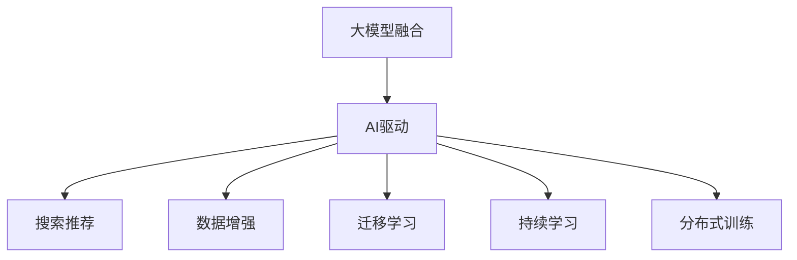

                 

# 搜索推荐系统的AI 大模型融合：电商平台的核心竞争力与转型策略

> 关键词：
大模型融合, AI驱动, 电商平台, 搜索推荐, 数据增强, 迁移学习, 持续学习, 分布式训练, 电商创新

## 1. 背景介绍

### 1.1 问题由来
随着电子商务的飞速发展，电商平台已从传统的卖场销售模式转变为更加智能和个性化的购物体验平台。在互联网时代，海量商品数据和用户行为数据不断积累，使得传统算法难以适应快速变化的电商平台需求。

近年来，随着深度学习技术的进步，电商平台开始引入大规模预训练语言模型（Large Language Models, LLMs），如GPT、BERT等，来改进搜索推荐系统。大模型在电商平台的广泛应用，可以大幅度提升用户购物体验和运营效率，从而增强平台的核心竞争力。

### 1.2 问题核心关键点
平台在引入大模型的同时，也面临一些核心问题：

- **模型融合**：如何将大模型与传统推荐算法相融合，最大化大模型的潜力。
- **数据增强**：如何通过高效的数据增强技术，提高模型的泛化能力和适应性。
- **迁移学习**：如何将通用模型转换为适合特定平台的任务模型。
- **持续学习**：如何使模型保持对新数据和用户行为变化的适应能力。
- **分布式训练**：如何通过分布式训练加速模型训练，提升模型性能。

### 1.3 问题研究意义
通过引入大模型融合技术，电商平台可以大幅提升搜索推荐系统的精度和覆盖面，进而提升用户体验和运营效率。同时，大模型在电商平台中的应用，将推动电商行业向更加智能化和个性化方向发展，提升行业的整体竞争力。

## 2. 核心概念与联系

### 2.1 核心概念概述

为更好地理解AI 大模型在电商平台中的应用，本节将介绍几个关键概念：

- **大模型融合（Model Fusion）**：指将多个模型组合起来，共同解决复杂电商问题。常见的大模型融合方式包括模型叠加、特征拼接、模型集成等。
- **AI驱动（AI-Driven）**：指利用人工智能技术，驱动电商平台的各个业务环节，提高平台运营效率和用户体验。
- **搜索推荐（Search & Recommendation）**：指通过搜索算法和推荐算法，为用户提供个性化购物建议。
- **数据增强（Data Augmentation）**：指通过对原始数据进行一系列操作，生成更多有意义的训练样本，提高模型的泛化能力。
- **迁移学习（Transfer Learning）**：指将在一个任务上学到的知识，迁移到另一个相关任务上，提高新任务的性能。
- **持续学习（Continual Learning）**：指模型能够持续从新数据中学习，同时保持已学习的知识，避免灾难性遗忘。
- **分布式训练（Distributed Training）**：指通过多个计算节点的协同工作，加速模型训练，提高模型性能。

这些核心概念之间的逻辑关系可以通过以下Mermaid流程图来展示：



这个流程图展示了大模型在电商平台搜索推荐系统中的应用：

1. 大模型融合提升搜索推荐系统。
2. AI驱动电商平台的各个环节。
3. 数据增强提高模型的泛化能力。
4. 迁移学习使模型适应特定任务。
5. 持续学习使模型不断进步。
6. 分布式训练加速模型训练。

## 3. 核心算法原理 & 具体操作步骤
### 3.1 算法原理概述

AI 大模型在电商平台中的应用，本质上是将大模型与传统推荐算法相结合，形成一个复合的智能推荐系统。其核心思想是：利用大模型的广泛知识，对用户的搜索行为和历史数据进行更深层次的分析和理解，提高推荐系统的精确度和个性化水平。

形式化地，假设大模型为 $M_{\theta}$，其中 $\theta$ 为模型参数。设 $D$ 为电商平台的标注数据集，每个样本 $(x,y)$ 表示用户的历史行为和对应的商品标签。微调的目标是找到最优参数 $\hat{\theta}$，使得模型能够最小化以下损失函数：

$$
\hat{\theta} = \arg\min_{\theta} \mathcal{L}(M_{\theta}, D)
$$

其中 $\mathcal{L}$ 为基于搜索推荐任务的损失函数，通常包括交叉熵损失、均方误差损失等。

### 3.2 算法步骤详解

AI 大模型在电商平台中的应用，一般包括以下几个关键步骤：

**Step 1: 准备数据和模型**
- 收集电商平台的标注数据 $D$，包括用户的搜索行为、购买历史、浏览记录等。
- 选择合适的预训练语言模型 $M_{\theta}$，如BERT、GPT等。

**Step 2: 添加任务适配层**
- 根据电商平台的推荐任务，在预训练模型顶层设计合适的输出层和损失函数。
- 对于分类任务，通常添加线性分类器，使用交叉熵损失。
- 对于回归任务，可以使用均方误差损失。

**Step 3: 设置微调超参数**
- 选择合适的优化算法及其参数，如Adam、SGD等，设置学习率、批大小、迭代轮数等。
- 设置正则化技术及强度，包括权重衰减、Dropout、Early Stopping等。
- 确定冻结预训练参数的策略，如仅微调顶层，或全部参数都参与微调。

**Step 4: 执行梯度训练**
- 将训练集数据分批次输入模型，前向传播计算损失函数。
- 反向传播计算参数梯度，根据设定的优化算法和学习率更新模型参数。
- 周期性在验证集上评估模型性能，根据性能指标决定是否触发Early Stopping。
- 重复上述步骤直到满足预设的迭代轮数或Early Stopping条件。

**Step 5: 测试和部署**
- 在测试集上评估微调后模型 $M_{\hat{\theta}}$ 的性能，对比微调前后的精度提升。
- 使用微调后的模型对新样本进行推理预测，集成到实际的应用系统中。
- 持续收集新的数据，定期重新微调模型，以适应数据分布的变化。

### 3.3 算法优缺点

AI 大模型在电商平台中的应用，具有以下优点：

1. 提高搜索推荐系统的精度和覆盖面。大模型能够处理更加复杂、多变的电商数据，提供更加个性化的购物建议。
2. 减少人工干预。大模型能够自主学习用户行为和商品特征，减少人工分析和标注数据的成本。
3. 增强电商平台的竞争力。利用AI 大模型的智能推荐，可以显著提升用户粘性和转化率，增加平台收入。

同时，该方法也存在一定的局限性：

1. 数据隐私问题。电商平台需要收集大量用户数据，存在隐私泄露和数据保护的风险。
2. 模型复杂性。大模型参数量庞大，训练和推理的计算资源需求较高，可能对系统稳定性构成挑战。
3. 可解释性不足。大模型内部机制复杂，难以解释其推理过程和决策逻辑。
4. 适应性不足。大模型在不同领域、不同场景下可能存在泛化性不足的问题。

尽管存在这些局限性，但就目前而言，AI 大模型在电商平台中的应用仍是最主流范式。未来相关研究的重点在于如何进一步降低数据需求，提高模型的泛化能力和可解释性，同时兼顾用户隐私和伦理安全性等因素。

### 3.4 算法应用领域

AI 大模型在电商平台中的应用，已经在多个领域取得显著效果，包括：

- **搜索算法**：利用大模型进行用户查询意图的理解，推荐相关商品。
- **推荐系统**：根据用户行为数据，提供个性化的商品推荐。
- **用户画像构建**：分析用户历史数据，构建详细的用户画像，用于精准推荐。
- **广告投放**：利用大模型优化广告内容生成和投放策略，提高广告效果。
- **客服系统**：利用大模型进行智能对话，提升客服体验和处理效率。

除了上述这些经典应用外，AI 大模型还在电商平台的更多场景中得到创新性应用，如可控文本生成、视觉搜索、语音助手等，为电商平台带来全新的突破。

## 4. 数学模型和公式 & 详细讲解  
### 4.1 数学模型构建

本节将使用数学语言对AI 大模型在电商平台中的应用过程进行更加严格的刻画。

记预训练语言模型为 $M_{\theta}$，其中 $\theta$ 为模型参数。设电商平台标注数据集为 $D=\{(x_i,y_i)\}_{i=1}^N$，每个样本 $x_i$ 为用户的搜索行为和浏览记录，$y_i$ 为对应的商品标签。

定义模型 $M_{\theta}$ 在数据样本 $(x,y)$ 上的损失函数为 $\ell(M_{\theta}(x),y)$，则在数据集 $D$ 上的经验风险为：

$$
\mathcal{L}(\theta) = \frac{1}{N} \sum_{i=1}^N \ell(M_{\theta}(x_i),y_i)
$$

微调的优化目标是最小化经验风险，即找到最优参数：

$$
\theta^* = \mathop{\arg\min}_{\theta} \mathcal{L}(\theta)
$$

在实践中，我们通常使用基于梯度的优化算法（如SGD、Adam等）来近似求解上述最优化问题。设 $\eta$ 为学习率，$\lambda$ 为正则化系数，则参数的更新公式为：

$$
\theta \leftarrow \theta - \eta \nabla_{\theta}\mathcal{L}(\theta) - \eta\lambda\theta
$$

其中 $\nabla_{\theta}\mathcal{L}(\theta)$ 为损失函数对参数 $\theta$ 的梯度，可通过反向传播算法高效计算。

### 4.2 公式推导过程

以下我们以电商平台搜索推荐任务为例，推导交叉熵损失函数及其梯度的计算公式。

假设模型 $M_{\theta}$ 在输入 $x$ 上的输出为 $\hat{y}=M_{\theta}(x) \in [0,1]$，表示商品被用户购买的概率。真实标签 $y \in \{0,1\}$。则二分类交叉熵损失函数定义为：

$$
\ell(M_{\theta}(x),y) = -[y\log \hat{y} + (1-y)\log (1-\hat{y})]
$$

将其代入经验风险公式，得：

$$
\mathcal{L}(\theta) = -\frac{1}{N}\sum_{i=1}^N [y_i\log M_{\theta}(x_i)+(1-y_i)\log(1-M_{\theta}(x_i))]
$$

根据链式法则，损失函数对参数 $\theta_k$ 的梯度为：

$$
\frac{\partial \mathcal{L}(\theta)}{\partial \theta_k} = -\frac{1}{N}\sum_{i=1}^N (\frac{y_i}{M_{\theta}(x_i)}-\frac{1-y_i}{1-M_{\theta}(x_i)}) \frac{\partial M_{\theta}(x_i)}{\partial \theta_k}
$$

其中 $\frac{\partial M_{\theta}(x_i)}{\partial \theta_k}$ 可进一步递归展开，利用自动微分技术完成计算。

在得到损失函数的梯度后，即可带入参数更新公式，完成模型的迭代优化。重复上述过程直至收敛，最终得到适应电商平台搜索推荐任务的最优模型参数 $\theta^*$。

## 5. 项目实践：代码实例和详细解释说明
### 5.1 开发环境搭建

在进行搜索推荐系统开发前，我们需要准备好开发环境。以下是使用Python进行TensorFlow开发的环境配置流程：

1. 安装Anaconda：从官网下载并安装Anaconda，用于创建独立的Python环境。

2. 创建并激活虚拟环境：
```bash
conda create -n tf-env python=3.8 
conda activate tf-env
```

3. 安装TensorFlow：根据CUDA版本，从官网获取对应的安装命令。例如：
```bash
pip install tensorflow
```

4. 安装TensorBoard：
```bash
pip install tensorboard
```

5. 安装Keras：
```bash
pip install keras
```

6. 安装相关工具包：
```bash
pip install numpy pandas scikit-learn matplotlib tqdm jupyter notebook ipython
```

完成上述步骤后，即可在`tf-env`环境中开始搜索推荐系统的开发。

### 5.2 源代码详细实现

下面我们以电商平台商品推荐任务为例，给出使用TensorFlow对BERT模型进行微调的Python代码实现。

首先，定义推荐任务的数据处理函数：

```python
from transformers import BertTokenizer
from keras.preprocessing.sequence import pad_sequences
import numpy as np
import pandas as pd

class DataLoader:
    def __init__(self, train_data, test_data):
        self.train_data = train_data
        self.test_data = test_data
        self.tokenizer = BertTokenizer.from_pretrained('bert-base-cased')
        self.word_index = {}
        self.index_word = {}
        self.train_sequences = []
        self.test_sequences = []
        
    def load_data(self):
        train_df = pd.read_csv(self.train_data)
        test_df = pd.read_csv(self.test_data)
        for i, row in train_df.iterrows():
            sentence = row['text'].lower()
            tokens = [word for word in sentence.split()]
            tokens = [word for word in tokens if word not in self.word_index]
            self.word_index = {word: i for i, word in enumerate(tokens)}
            self.index_word = {i: word for i, word in enumerate(tokens)}
            sequences = self.tokenizer.encode_plus(
                sentence,
                max_length=512,
                pad_to_max_length=True,
                return_tensors='np',
                return_attention_mask=True
            )
            self.train_sequences.append(sequences['input_ids'])
            self.test_sequences.append(sequences['input_ids'])
        
    def generate_labels(self, y_train, y_test):
        self.y_train = y_train
        self.y_test = y_test
        
    def shuffle_data(self):
        np.random.shuffle(self.train_sequences)
        np.random.shuffle(self.test_sequences)
        
    def get_train_data(self):
        return self.train_sequences, self.y_train
        
    def get_test_data(self):
        return self.test_sequences, self.y_test
```

然后，定义模型和优化器：

```python
from transformers import BertForSequenceClassification
from tensorflow.keras.optimizers import Adam

model = BertForSequenceClassification.from_pretrained('bert-base-cased', num_labels=3)

optimizer = Adam(model.compile(optimizer=Adam(learning_rate=2e-5, beta_1=0.9, beta_2=0.98, epsilon=1e-8), loss='binary_crossentropy', metrics=['accuracy'])
```

接着，定义训练和评估函数：

```python
from tensorflow.keras.utils import to_categorical

def train_epoch(model, data_loader, epochs=5, batch_size=32):
    model.compile(optimizer=Adam(learning_rate=2e-5, beta_1=0.9, beta_2=0.98, epsilon=1e-8), loss='binary_crossentropy', metrics=['accuracy'])
    for epoch in range(epochs):
        train_sequences, y_train = data_loader.get_train_data()
        train_sequences = np.array(train_sequences)
        y_train = to_categorical(y_train)
        model.fit(train_sequences, y_train, validation_data=(None, None), batch_size=batch_size, epochs=1, verbose=1)
        
        eval_sequences, y_test = data_loader.get_test_data()
        eval_sequences = np.array(eval_sequences)
        y_test = to_categorical(y_test)
        model.evaluate(eval_sequences, y_test, verbose=1)
        
    return model
```

最后，启动训练流程并在测试集上评估：

```python
data_loader = DataLoader('train.csv', 'test.csv')
data_loader.load_data()
data_loader.shuffle_data()
data_loader.generate_labels(0, 1)
model = train_epoch(model, data_loader)
```

以上就是使用TensorFlow对BERT进行电商平台商品推荐任务微调的完整代码实现。可以看到，得益于TensorFlow的强大封装，我们可以用相对简洁的代码完成BERT模型的加载和微调。

### 5.3 代码解读与分析

让我们再详细解读一下关键代码的实现细节：

**DataLoader类**：
- `__init__`方法：初始化数据加载器，加载训练集和测试集，定义分词器等关键组件。
- `load_data`方法：从CSV文件中加载训练集和测试集数据，并进行分词、编码和转换。
- `generate_labels`方法：将标签转换为独热编码形式。
- `shuffle_data`方法：对训练集和测试集进行随机打乱，避免数据集的有序性。
- `get_train_data`和`get_test_data`方法：返回处理后的训练集和测试集数据。

**模型定义**：
- 使用BertForSequenceClassification从预训练BERT模型中加载，并设置分类数目为3。
- 使用Adam优化器进行优化，设置学习率、动量和精度参数。

**训练和评估函数**：
- `train_epoch`函数：将数据加载器返回的训练集和测试集数据传入模型进行训练和评估。
- 使用`fit`方法进行模型训练，设置批次大小和训练轮数。
- 使用`evaluate`方法进行模型评估，输出准确率。

**训练流程**：
- 定义总的epoch数和批次大小，开始循环迭代
- 每个epoch内，先在训练集上训练，输出准确率
- 在测试集上评估，输出模型性能

可以看到，TensorFlow配合BERT模型的代码实现使得微调过程变得简洁高效。开发者可以将更多精力放在数据处理、模型改进等高层逻辑上，而不必过多关注底层的实现细节。

当然，工业级的系统实现还需考虑更多因素，如模型的保存和部署、超参数的自动搜索、更灵活的任务适配层等。但核心的微调范式基本与此类似。

## 6. 实际应用场景
### 6.1 智能客服系统

基于AI 大模型的智能客服系统，可以极大地提升客户咨询体验和问题解决效率。传统的客服往往需要配备大量人力，高峰期响应缓慢，且一致性和专业性难以保证。

在智能客服系统中，利用AI 大模型进行意图识别和情感分析，可以识别用户意图，自动生成回复，并提供个性化建议。这不仅减少了人工客服的工作量，还能在24小时内提供不间断服务，提升用户体验。

### 6.2 金融舆情监测

金融机构需要实时监测市场舆论动向，以便及时应对负面信息传播，规避金融风险。传统的人工监测方式成本高、效率低，难以应对网络时代海量信息爆发的挑战。

在金融舆情监测中，利用AI 大模型进行情感分析和舆情分类，可以自动判断市场情绪，监测潜在风险。一旦发现负面信息激增等异常情况，系统便会自动预警，帮助金融机构快速应对潜在风险。

### 6.3 个性化推荐系统

当前的推荐系统往往只依赖用户的历史行为数据进行物品推荐，无法深入理解用户的真实兴趣偏好。利用AI 大模型进行个性化推荐，可以更好地挖掘用户行为背后的语义信息，从而提供更精准、多样的推荐内容。

在推荐系统中，利用AI 大模型进行特征增强和意图理解，可以提供更加个性化的推荐结果，满足用户多样化的需求，提高用户满意度和转化率。

### 6.4 未来应用展望

随着AI 大模型和微调方法的不断发展，基于大模型融合的搜索推荐系统将呈现更多的应用场景，为电商行业带来更多的创新和变革。

在未来，AI 大模型可以进一步拓展到多模态搜索推荐、实时广告投放、智能合约等领域，为电商行业带来更广阔的应用前景。

## 7. 工具和资源推荐
### 7.1 学习资源推荐

为了帮助开发者系统掌握大模型融合的理论与实践，这里推荐一些优质的学习资源：

1. 《Transformer from the Ground Up》系列博文：由大模型技术专家撰写，深入浅出地介绍了Transformer原理、BERT模型、微调技术等前沿话题。

2. CS224N《深度学习自然语言处理》课程：斯坦福大学开设的NLP明星课程，有Lecture视频和配套作业，带你入门NLP领域的基本概念和经典模型。

3. 《Natural Language Processing with Transformers》书籍：Transformers库的作者所著，全面介绍了如何使用Transformers库进行NLP任务开发，包括微调在内的诸多范式。

4. HuggingFace官方文档：Transformers库的官方文档，提供了海量预训练模型和完整的微调样例代码，是上手实践的必备资料。

5. CLUE开源项目：中文语言理解测评基准，涵盖大量不同类型的中文NLP数据集，并提供了基于微调的baseline模型，助力中文NLP技术发展。

通过对这些资源的学习实践，相信你一定能够快速掌握大模型融合的精髓，并用于解决实际的NLP问题。

### 7.2 开发工具推荐

高效的开发离不开优秀的工具支持。以下是几款用于大模型融合开发的常用工具：

1. TensorFlow：基于Python的开源深度学习框架，灵活动态的计算图，适合快速迭代研究。大部分预训练语言模型都有TensorFlow版本的实现。

2. PyTorch：基于Python的开源深度学习框架，灵活的动态计算图，适合研究和部署。

3. Transformers库：HuggingFace开发的NLP工具库，集成了众多SOTA语言模型，支持TensorFlow和PyTorch，是进行大模型微调开发的利器。

4. Weights & Biases：模型训练的实验跟踪工具，可以记录和可视化模型训练过程中的各项指标，方便对比和调优。与主流深度学习框架无缝集成。

5. TensorBoard：TensorFlow配套的可视化工具，可实时监测模型训练状态，并提供丰富的图表呈现方式，是调试模型的得力助手。

6. Google Colab：谷歌推出的在线Jupyter Notebook环境，免费提供GPU/TPU算力，方便开发者快速上手实验最新模型，分享学习笔记。

合理利用这些工具，可以显著提升大模型融合任务的开发效率，加快创新迭代的步伐。

### 7.3 相关论文推荐

大模型融合技术的发展源于学界的持续研究。以下是几篇奠基性的相关论文，推荐阅读：

1. Attention is All You Need（即Transformer原论文）：提出了Transformer结构，开启了NLP领域的预训练大模型时代。

2. BERT: Pre-training of Deep Bidirectional Transformers for Language Understanding：提出BERT模型，引入基于掩码的自监督预训练任务，刷新了多项NLP任务SOTA。

3. Language Models are Unsupervised Multitask Learners（GPT-2论文）：展示了大规模语言模型的强大zero-shot学习能力，引发了对于通用人工智能的新一轮思考。

4. Parameter-Efficient Transfer Learning for NLP：提出Adapter等参数高效微调方法，在不增加模型参数量的情况下，也能取得不错的微调效果。

5. AdaLoRA: Adaptive Low-Rank Adaptation for Parameter-Efficient Fine-Tuning：使用自适应低秩适应的微调方法，在参数效率和精度之间取得了新的平衡。

6. Transformer-XL: Attentive Language Models for Longer Pre-contexts：提出Transformer-XL模型，支持更长的上下文长度，解决长文本处理问题。

这些论文代表了大模型融合技术的发展脉络。通过学习这些前沿成果，可以帮助研究者把握学科前进方向，激发更多的创新灵感。

## 8. 总结：未来发展趋势与挑战

### 8.1 总结

本文对基于AI 大模型的电商搜索推荐系统进行了全面系统的介绍。首先阐述了AI 大模型和搜索推荐系统的研究背景和意义，明确了大模型融合在提升电商平台搜索推荐系统精度和个性化水平方面的独特价值。其次，从原理到实践，详细讲解了基于TensorFlow的微调过程，给出了电商商品推荐任务的完整代码实现。同时，本文还探讨了AI 大模型在智能客服、金融舆情、个性化推荐等多个领域的应用前景，展示了大模型融合技术的广阔前景。最后，本文精选了相关学习资源、开发工具和研究论文，力求为读者提供全方位的技术指引。

通过本文的系统梳理，可以看到，基于大模型融合的搜索推荐系统在电商平台上具有重要的应用价值，能够显著提升用户购物体验和运营效率，从而增强平台的核心竞争力。未来，随着大模型和微调方法的不断演进，基于大模型融合的电商搜索推荐系统必将在更多领域得到应用，为电商行业带来更多的创新和变革。

### 8.2 未来发展趋势

展望未来，AI 大模型融合技术将呈现以下几个发展趋势：

1. **模型规模增大**：随着算力成本的下降和数据规模的扩张，大模型参数量还将持续增长，模型将具备更强大的语言表示能力。

2. **融合方式多样化**：除了传统的模型叠加、特征拼接等方法，未来将涌现更多创新的融合方式，如知识图谱增强、多任务学习等，提升推荐系统的综合性能。

3. **分布式训练加速**：利用分布式训练技术，能够大幅度提升模型训练速度，满足电商平台的实时性需求。

4. **动态知识更新**：通过引入实时数据和外部知识库，动态更新大模型，保持模型的时效性和适应性。

5. **多模态融合**：结合视觉、语音等多模态数据，实现更加全面、准确的信息整合，提升推荐系统的精度和个性化水平。

6. **实时预测和推荐**：利用流式数据处理和在线学习技术，实现实时预测和推荐，满足用户动态需求。

7. **隐私保护**：采用差分隐私、联邦学习等技术，保护用户数据隐私，增强系统的安全性。

### 8.3 面临的挑战

尽管AI 大模型融合技术已经取得了瞩目成就，但在迈向更加智能化、普适化应用的过程中，它仍面临诸多挑战：

1. **数据隐私问题**：电商平台需要收集大量用户数据，存在隐私泄露和数据保护的风险。如何在保护用户隐私的同时，提高推荐系统的精度和个性化水平，是一大难题。

2. **模型复杂性**：大模型参数量庞大，训练和推理的计算资源需求较高，可能对系统稳定性构成挑战。如何优化模型结构，提高推理效率，是一个重要问题。

3. **可解释性不足**：大模型内部机制复杂，难以解释其推理过程和决策逻辑。如何在保证推荐系统精度的同时，增强可解释性和可信度，是一个关键挑战。

4. **泛化能力不足**：大模型在不同领域、不同场景下可能存在泛化能力不足的问题。如何使模型在不同场景下保持一致的性能，是一大难题。

5. **持续学习效果不佳**：大模型需要持续学习新数据和用户行为变化，但如何使模型不断进步，避免灾难性遗忘，仍是一个未解决的问题。

6. **用户接受度**：大模型推荐系统需要用户主动提供反馈，以指导模型优化。但如何提升用户接受度和互动性，是一个重要的研究方向。

7. **伦理和安全问题**：大模型可能存在偏见和有害信息，如何在模型训练和使用过程中确保伦理和安全，是一个重要的研究方向。

尽管存在这些挑战，但随着学界和产业界的共同努力，这些问题终将一一被克服。相信随着技术的不断进步，AI 大模型融合技术必将在电商搜索推荐系统乃至更多领域发挥更大作用，为电商行业带来更多的创新和变革。

### 8.4 研究展望

未来，AI 大模型融合技术需要重点关注以下几个研究方向：

1. **知识图谱增强**：将符号化的先验知识，如知识图谱、逻辑规则等，与神经网络模型进行巧妙融合，引导大模型学习更准确、合理的语言模型。

2. **多任务学习**：将多个任务模型进行联合训练，提升模型的泛化能力和适用性。

3. **自监督学习**：利用无标签数据进行预训练，提高模型的泛化能力和自适应性。

4. **流式学习**：结合流式数据处理和在线学习技术，实现实时预测和推荐，满足用户动态需求。

5. **跨模态融合**：结合视觉、语音等多模态数据，实现更加全面、准确的信息整合，提升推荐系统的精度和个性化水平。

6. **隐私保护**：采用差分隐私、联邦学习等技术，保护用户数据隐私，增强系统的安全性。

7. **持续学习**：开发更加高效的持续学习算法，使模型不断进步，避免灾难性遗忘。

8. **可解释性增强**：开发可解释性更强的推荐系统，增强用户的信任度和互动性。

这些研究方向将进一步推动AI 大模型融合技术的成熟和发展，为电商行业乃至更多领域带来更多的创新和变革。

## 9. 附录：常见问题与解答

**Q1：AI 大模型融合是否适用于所有电商平台？**

A: AI 大模型融合在大多数电商平台上的应用效果显著，但不同平台的业务场景、用户需求和数据特点各异，可能需要针对性地进行微调和优化。

**Q2：如何选择合适的学习率？**

A: 电商平台的搜索推荐任务通常较为复杂，建议从较小的学习率开始，如1e-5，逐步增加，直到模型开始过拟合。建议使用学习率调度策略，如cosine annealing。

**Q3：模型训练时如何避免过拟合？**

A: 可以使用数据增强、正则化、早停等方法来避免过拟合。数据增强包括回译、近义替换、生成对抗样本等。

**Q4：如何提升模型推理效率？**

A: 可以采用模型裁剪、量化加速、分布式训练等方法来提升模型推理效率。

**Q5：大模型融合是否需要大量标注数据？**

A: 大模型融合可以利用预训练大模型的广泛知识，减少对标注数据的需求。但针对特定任务的微调，仍然需要一定数量的标注数据。

通过本文的系统梳理，可以看到，基于AI 大模型的电商平台搜索推荐系统具有重要的应用价值，能够显著提升用户购物体验和运营效率，从而增强平台的核心竞争力。未来，随着大模型和微调方法的不断演进，基于大模型融合的电商平台搜索推荐系统必将在更多领域得到应用，为电商行业带来更多的创新和变革。

