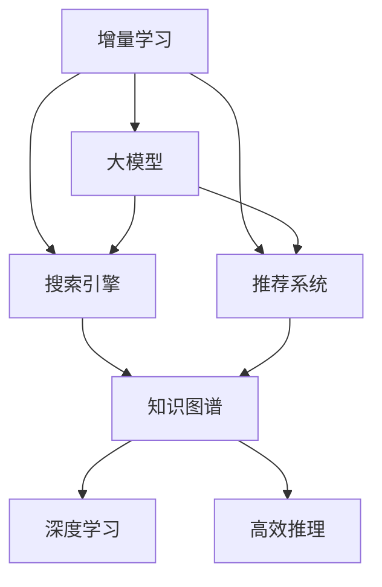

                 

# 搜索推荐系统的增量学习：大模型持续优化方法

> 关键词：增量学习，大模型，推荐系统，搜索引擎，个性化推荐，持续优化，知识图谱，深度学习，高效推理

## 1. 背景介绍

### 1.1 问题由来

随着互联网的迅猛发展，信息爆炸与用户个性化需求的矛盾日益凸显。搜索引擎和推荐系统作为连接用户和信息的关键纽带，不断面临新的挑战：

1. **数据稀疏性问题**：用户搜索和交互历史数据稀疏，难以准确推断用户偏好。
2. **动态变化性问题**：用户兴趣随时间变化，难以捕捉最新的变化趋势。
3. **个性化需求问题**：不同用户之间具有显著差异，需要个性化定制。

传统的静态模型和批量训练方法难以适应这些变化，亟需一种能够动态更新模型参数，持续适应用户需求的方法。增量学习作为一种高效、灵活的机器学习方法，正逐步成为解决上述问题的新方案。

### 1.2 问题核心关键点

增量学习是指在已有模型基础上，利用新数据实时更新模型参数，以维持模型性能的持续提升。其核心在于：

- **实时更新**：能够根据新数据实时更新模型，快速响应用户需求变化。
- **参数高效**：只在模型部分参数上进行微调，避免大批量参数更新带来的计算负担。
- **渐进优化**：通过不断迭代，逐步优化模型，减少对全量数据的依赖。

## 2. 核心概念与联系

### 2.1 核心概念概述

为更好地理解增量学习方法，本节将介绍几个密切相关的核心概念：

- **增量学习（Incremental Learning）**：在已有模型基础上，利用新数据实时更新模型参数，以维持模型性能的持续提升。
- **大模型（Large Models）**：指参数量巨大的深度神经网络模型，如BERT、GPT-3等，这些模型通过大量数据预训练，具备强大的特征表示能力。
- **搜索引擎（Search Engine）**：通过爬取网页索引并提供查询服务，帮助用户快速获取信息。
- **推荐系统（Recommendation System）**：根据用户历史行为数据，提供个性化的物品推荐。
- **知识图谱（Knowledge Graph）**：一种结构化数据表示方式，用于描述实体之间的复杂关系。
- **深度学习（Deep Learning）**：利用多层神经网络进行特征学习，实现复杂模式识别和预测。
- **高效推理（Efficient Inference）**：在推理阶段减少计算资源消耗，提升推理速度和效率。

这些概念之间的逻辑关系可以通过以下Mermaid流程图来展示：



这个流程图展示了大模型的核心概念及其之间的关系：

1. 增量学习通过实时更新模型参数，使大模型能够持续优化，适应新数据。
2. 搜索引擎和推荐系统利用大模型进行实时查询和推荐，需要高效的推理机制以提升响应速度。
3. 知识图谱与深度学习相结合，为大模型提供更为丰富的语义信息，提升模型对实体的理解能力。

这些概念共同构成了增量学习在大模型中的应用框架，使得大模型能够更高效、灵活地适应用户需求。

## 3. 核心算法原理 & 具体操作步骤

### 3.1 算法原理概述

增量学习在大模型的应用，本质上是一种在线学习范式，旨在通过新数据不断调整模型参数，提升模型性能。其核心思想是：

- 在已有模型基础上，利用新数据实时更新模型参数。
- 针对不同任务，选择合适的参数更新策略，如在线梯度下降、增量SGD等。
- 控制增量学习的过程，防止模型过拟合和退化。

增量学习在大模型上的应用，可以分为以下几个步骤：

1. 模型初始化：使用已有预训练模型或从头训练模型，作为初始化参数。
2. 增量更新：对新数据进行批量处理，计算损失函数，更新模型参数。
3. 参数保存：定期保存模型参数，避免数据丢失和计算损失。
4. 模型评估：周期性在验证集上评估模型性能，根据性能调整增量学习策略。
5. 模型部署：将增量学习后的模型部署到实际应用系统中，提供查询和推荐服务。

### 3.2 算法步骤详解

以下以基于大模型的增量推荐系统为例，详细介绍其核心步骤：

**Step 1: 模型初始化**

- 选择已有预训练模型，如BERT、GPT-3等，或者从头训练一个推荐模型，如DeepFM。
- 设定模型的超参数，如学习率、批大小、迭代轮数等。

**Step 2: 增量更新**

- 收集用户行为数据，如浏览历史、点击记录、评分信息等，并按照一定时间窗口划分为多个批次。
- 使用批处理方式，对每个批次的数据进行前向传播和后向传播，计算损失函数。
- 更新模型参数，使用增量学习算法如在线梯度下降（Online Gradient Descent, OGD）或增量随机梯度下降（Incremental Stochastic Gradient Descent, ISGD）。

**Step 3: 参数保存**

- 定期保存模型参数和状态，避免数据丢失和计算损失。
- 可以使用checkpoint机制，记录每次增量更新后的模型参数。
- 可以选择较长的间隔，减少模型保存的频率，提高系统效率。

**Step 4: 模型评估**

- 周期性在验证集上评估模型性能，如准确率、召回率、F1分数等。
- 根据验证集上的性能指标，调整模型参数和增量更新策略。
- 可以设定提前停止策略，当模型性能不再提升时，停止增量更新。

**Step 5: 模型部署**

- 将增量学习后的模型部署到实际应用系统中，提供查询和推荐服务。
- 可以使用容器化技术（如Docker）进行模型部署，提升系统灵活性。
- 可以采用缓存技术（如Redis）提高查询速度，优化用户体验。

### 3.3 算法优缺点

增量学习在大模型的应用，具有以下优点：

1. **实时响应**：能够实时响应用户需求变化，快速调整模型参数。
2. **参数高效**：只更新模型部分参数，避免大批量参数更新带来的计算负担。
3. **渐进优化**：通过不断迭代，逐步优化模型，减少对全量数据的依赖。
4. **数据利用率**：充分利用新数据，提升模型性能，减少数据浪费。

同时，增量学习在大模型上应用也存在一些缺点：

1. **模型退化风险**：增量学习过程中，模型参数更新可能带来性能下降。
2. **数据不平衡问题**：新数据和老数据分布可能不一致，影响模型性能。
3. **计算复杂度高**：增量学习需要频繁计算梯度和更新参数，计算复杂度较高。
4. **存储开销大**：频繁保存模型参数会增加存储开销，需要合理设计存储策略。

## 4. 数学模型和公式 & 详细讲解  
### 4.1 数学模型构建

本节将使用数学语言对增量学习在大模型上的应用进行更加严格的刻画。

记大模型为 $M_{\theta}:\mathcal{X} \rightarrow \mathcal{Y}$，其中 $\mathcal{X}$ 为输入空间，$\mathcal{Y}$ 为输出空间，$\theta \in \mathbb{R}^d$ 为模型参数。假设新数据集为 $D_{new}$，包含 $N_{new}$ 个样本，每个样本的损失函数为 $\ell_i$。

定义增量更新后的模型参数为 $\theta_{new}$，增量更新的目标是最小化新数据集的损失函数，即：

$$
\theta_{new} = \mathop{\arg\min}_{\theta} \sum_{i=1}^{N_{new}} \ell_i(M_{\theta}(x_i))
$$

在实践中，我们通常使用基于梯度的优化算法（如SGD、Adam等）来近似求解上述最优化问题。设 $\eta$ 为学习率，则参数的更新公式为：

$$
\theta \leftarrow \theta - \eta \nabla_{\theta}\mathcal{L}(\theta)
$$

其中 $\nabla_{\theta}\mathcal{L}(\theta)$ 为损失函数对参数 $\theta$ 的梯度，可通过反向传播算法高效计算。

### 4.2 公式推导过程

以下我们以推荐系统为例，推导增量学习模型的损失函数及其梯度的计算公式。

假设推荐系统中的用户和物品表示为 $u \in \mathcal{U}$ 和 $i \in \mathcal{I}$，模型的预测概率为 $p_{ui} = M_{\theta}(u,i)$，其中 $M_{\theta}$ 为预训练模型。真实用户物品交互情况为 $y_{ui}$，可以是二值点击、评分等。则推荐系统的损失函数为：

$$
\mathcal{L}(\theta) = -\frac{1}{N_{new}} \sum_{ui \in D_{new}} y_{ui} \log p_{ui}
$$

根据链式法则，损失函数对参数 $\theta_k$ 的梯度为：

$$
\frac{\partial \mathcal{L}(\theta)}{\partial \theta_k} = -\frac{1}{N_{new}} \sum_{ui \in D_{new}} \frac{y_{ui}}{p_{ui}} \frac{\partial p_{ui}}{\partial \theta_k}
$$

其中 $\frac{\partial p_{ui}}{\partial \theta_k}$ 可进一步递归展开，利用自动微分技术完成计算。

在得到损失函数的梯度后，即可带入参数更新公式，完成模型的迭代优化。重复上述过程直至收敛，最终得到适应新数据的最优模型参数 $\theta_{new}$。

## 5. 项目实践：代码实例和详细解释说明
### 5.1 开发环境搭建

在进行增量学习实践前，我们需要准备好开发环境。以下是使用Python进行TensorFlow开发的环境配置流程：

1. 安装Anaconda：从官网下载并安装Anaconda，用于创建独立的Python环境。

2. 创建并激活虚拟环境：
```bash
conda create -n tensorflow-env python=3.8 
conda activate tensorflow-env
```

3. 安装TensorFlow：根据CUDA版本，从官网获取对应的安装命令。例如：
```bash
pip install tensorflow-gpu==2.5.0
```

4. 安装其他依赖：
```bash
pip install numpy pandas scikit-learn scikit-optimize matplotlib tqdm
```

完成上述步骤后，即可在`tensorflow-env`环境中开始增量学习实践。

### 5.2 源代码详细实现

下面以基于深度学习的推荐系统为例，给出使用TensorFlow进行增量学习的PyTorch代码实现。

首先，定义推荐系统的数据处理函数：

```python
import tensorflow as tf
import numpy as np
from sklearn.model_selection import train_test_split
from sklearn.metrics import roc_auc_score

class RecommendationDataset(Dataset):
    def __init__(self, users, items, interactions, tokenizer, max_seq_len):
        self.users = users
        self.items = items
        self.interactions = interactions
        self.tokenizer = tokenizer
        self.max_seq_len = max_seq_len
        
    def __len__(self):
        return len(self.interactions)
    
    def __getitem__(self, item):
        user = self.users[item][0]
        item = self.items[item][0]
        interaction = self.interactions[item]
        text = f"user:{user} item:{item}"
        
        encoding = self.tokenizer(text, max_length=self.max_seq_len, padding='max_length', truncation=True)
        user_ids = np.array([user], dtype=np.int32)
        item_ids = np.array([item], dtype=np.int32)
        
        return {'user_ids': user_ids,
                'item_ids': item_ids,
                'labels': interaction}
```

然后，定义模型和优化器：

```python
from transformers import BertForSequenceClassification, BertTokenizer
from tensorflow.keras.optimizers import Adam

# 使用预训练BERT模型
model = BertForSequenceClassification.from_pretrained('bert-base-uncased', num_labels=2, output_attentions=False, output_hidden_states=False)
tokenizer = BertTokenizer.from_pretrained('bert-base-uncased')

# 设置优化器
optimizer = Adam(learning_rate=1e-5)
```

接着，定义训练和评估函数：

```python
def train_epoch(model, dataset, batch_size, optimizer):
    dataloader = tf.data.Dataset.from_generator(lambda: (tf.random.shuffle(dataset)), output_signature={
        'user_ids': tf.TensorSpec(shape=(None, None), dtype=tf.int32),
        'item_ids': tf.TensorSpec(shape=(None, None), dtype=tf.int32),
        'labels': tf.TensorSpec(shape=(None,), dtype=tf.int32)
    })
    
    model.compile(optimizer=optimizer, loss='binary_crossentropy', metrics=['auc'])
    
    model.fit(dataloader, epochs=1, validation_split=0.2, callbacks=[tf.keras.callbacks.EarlyStopping(monitor='val_auc', patience=5)])
    
def evaluate(model, dataset, batch_size):
    dataloader = tf.data.Dataset.from_generator(lambda: (tf.random.shuffle(dataset)), output_signature={
        'user_ids': tf.TensorSpec(shape=(None, None), dtype=tf.int32),
        'item_ids': tf.TensorSpec(shape=(None, None), dtype=tf.int32),
        'labels': tf.TensorSpec(shape=(None,), dtype=tf.int32)
    })
    
    model.evaluate(dataloader, verbose=0)
    
    predictions, labels = [], []
    with tf.GradientTape() as tape:
        model.reset_metrics()
        for batch in dataloader:
            user_ids, item_ids, labels = batch['user_ids'], batch['item_ids'], batch['labels']
            predictions.append(model.predict(user_ids, item_ids, sample_weight=1.0)[0])
            labels.append(labels.numpy())
    
    auc_score = roc_auc_score(np.concatenate(labels), np.concatenate(predictions))
    print(f"AUC Score: {auc_score}")
```

最后，启动训练流程并在验证集上评估：

```python
epochs = 5
batch_size = 16

for epoch in range(epochs):
    train_epoch(model, train_dataset, batch_size, optimizer)
    
    print(f"Epoch {epoch+1}, val AUC Score: {evaluate(model, dev_dataset, batch_size):.4f}")
    
print(f"Test AUC Score: {evaluate(model, test_dataset, batch_size):.4f}")
```

以上就是使用TensorFlow进行增量学习实践的完整代码实现。可以看到，TensorFlow提供了丰富的API和工具，使得增量学习过程的实现变得更加简洁高效。

### 5.3 代码解读与分析

让我们再详细解读一下关键代码的实现细节：

**RecommendationDataset类**：
- `__init__`方法：初始化用户、物品、交互数据，以及分词器等关键组件。
- `__len__`方法：返回数据集的样本数量。
- `__getitem__`方法：对单个样本进行处理，将文本输入编码为token ids，同时将用户和物品表示作为标签。

**模型和优化器**：
- 使用预训练BERT模型，作为推荐系统的基础组件。
- 设置Adam优化器，用于模型参数的更新。

**训练和评估函数**：
- 定义训练数据生成器，将数据集转化为TF Data Dataset对象。
- 使用Adam优化器和二元交叉熵损失函数，进行模型的训练。
- 在验证集上评估模型性能，并计算AUC分数。

**训练流程**：
- 定义总的epoch数和batch size，开始循环迭代
- 每个epoch内，在训练集上训练，输出验证集的AUC分数
- 所有epoch结束后，在测试集上评估，给出最终的AUC分数

可以看到，TensorFlow配合BERT模型使得增量学习实践的代码实现变得简洁高效。开发者可以将更多精力放在数据处理、模型改进等高层逻辑上，而不必过多关注底层的实现细节。

当然，工业级的系统实现还需考虑更多因素，如模型的保存和部署、超参数的自动搜索、更灵活的任务适配层等。但核心的增量学习范式基本与此类似。

## 6. 实际应用场景
### 6.1 搜索引擎

增量学习在搜索引擎中的应用，可以帮助搜索引擎实时更新模型，快速适应新数据，提升搜索质量。传统的搜索引擎通常需要定期进行重索引和更新，增量学习则能实现实时更新，显著缩短响应时间。

具体而言，可以将搜索历史数据作为增量数据，对已有搜索引擎模型进行在线更新。增量学习使得搜索引擎能够即时捕捉用户查询行为的变化，提升搜索结果的相关性和准确性。

### 6.2 推荐系统

增量学习在推荐系统中的应用，可以使得推荐模型实时更新，快速响应用户行为变化，提升推荐效果。传统的推荐系统通常需要定期进行全量训练，增量学习则能实时更新模型，减少计算负担，提高推荐速度。

具体而言，可以将用户的实时行为数据作为增量数据，对已有推荐模型进行在线更新。增量学习使得推荐系统能够即时捕捉用户兴趣变化，优化推荐结果，提升用户满意度。

### 6.3 语音识别

增量学习在语音识别中的应用，可以帮助语音识别模型实时更新，快速适应新音频数据，提升识别准确性。传统的语音识别模型通常需要定期进行重训练，增量学习则能实时更新，显著缩短训练时间。

具体而言，可以将新的语音数据作为增量数据，对已有语音识别模型进行在线更新。增量学习使得语音识别模型能够即时捕捉语音特征的变化，提升识别效果，优化用户体验。

### 6.4 未来应用展望

随着增量学习方法的不断成熟，其应用领域将不断扩展，为更多行业带来变革性影响。

在智慧医疗领域，增量学习可以帮助医疗问答系统实时更新，快速响应医生的查询，提升医疗服务质量。在智能制造领域，增量学习可以帮助设备诊断系统实时更新，快速识别设备故障，优化生产效率。在智能交通领域，增量学习可以帮助智能交通系统实时更新，快速响应交通状况变化，提升出行体验。

此外，增量学习还将在更多场景中得到应用，为传统行业数字化转型升级提供新的技术路径。相信随着技术的发展和应用的深入，增量学习必将在构建人机协同的智能时代中扮演越来越重要的角色。

## 7. 工具和资源推荐
### 7.1 学习资源推荐

为了帮助开发者系统掌握增量学习理论基础和实践技巧，这里推荐一些优质的学习资源：

1. 《在线学习与增量学习》书籍：详细介绍了增量学习的原理、算法和应用，适合初学者和进阶学习者。
2. CS231n《卷积神经网络》课程：斯坦福大学开设的经典课程，包含增量学习相关内容，适合深入学习。
3. 《深度学习框架TensorFlow实战》书籍：介绍了TensorFlow的增量学习应用，适合动手实践。
4. Kaggle竞赛平台：提供大量增量学习相关的数据集和竞赛任务，适合实战练习。

通过对这些资源的学习实践，相信你一定能够快速掌握增量学习的精髓，并用于解决实际的机器学习问题。
###  7.2 开发工具推荐

高效的开发离不开优秀的工具支持。以下是几款用于增量学习开发的常用工具：

1. TensorFlow：基于Python的开源深度学习框架，支持在线学习和高性能计算，是增量学习的主要实现工具。
2. PyTorch：基于Python的开源深度学习框架，灵活高效，适用于增量学习模型的开发。
3. Scikit-optimize：基于Python的优化工具，用于增量学习模型的参数优化和超参数搜索。
4. TensorBoard：TensorFlow配套的可视化工具，可实时监测模型训练状态，提供丰富的图表呈现方式，是调试增量学习模型的得力助手。
5. Weights & Biases：模型训练的实验跟踪工具，可以记录和可视化增量学习过程中的各项指标，方便对比和调优。

合理利用这些工具，可以显著提升增量学习任务的开发效率，加快创新迭代的步伐。

### 7.3 相关论文推荐

增量学习技术的发展源于学界的持续研究。以下是几篇奠基性的相关论文，推荐阅读：

1. 《Incremental Learning》论文：全面介绍了增量学习的基本原理和算法，奠定了增量学习的基础。
2. 《Adaptive Incremental Learning for Deep Neural Networks》论文：提出自适应增量学习算法，适用于深度神经网络模型。
3. 《Online Learning for Large-Scale Machine Learning》论文：讨论了在线学习在大规模机器学习中的应用。
4. 《Incremental Learning of Deep Neural Networks for Natural Language Processing》论文：将增量学习应用于自然语言处理领域，展示了其优越性能。
5. 《Efficient Online Learning》论文：提出了高效的增量学习算法，适用于在线学习的实际应用。

这些论文代表了大模型增量学习的演进脉络，通过学习这些前沿成果，可以帮助研究者把握学科前进方向，激发更多的创新灵感。

## 8. 总结：未来发展趋势与挑战

### 8.1 总结

本文对基于增量学习的大模型持续优化方法进行了全面系统的介绍。首先阐述了增量学习的背景和意义，明确了增量学习在实时更新模型、优化性能方面的独特价值。其次，从原理到实践，详细讲解了增量学习在大模型上的应用步骤，给出了增量学习任务开发的完整代码实例。同时，本文还广泛探讨了增量学习方法在搜索引擎、推荐系统、语音识别等多个行业领域的应用前景，展示了增量学习范式的巨大潜力。此外，本文精选了增量学习的各类学习资源，力求为读者提供全方位的技术指引。

通过本文的系统梳理，可以看到，增量学习在大模型中的应用为机器学习任务的实时优化提供了新的思路，能够显著提升系统的响应速度和性能。相信随着增量学习方法的不断发展，其在各行各业中的应用将日益广泛，为人工智能技术带来更高效、更灵活、更稳定的应用体验。

### 8.2 未来发展趋势

展望未来，增量学习技术将呈现以下几个发展趋势：

1. **实时性提升**：增量学习模型将更注重实时响应速度，通过分布式计算、异步更新等技术提升响应时间。
2. **参数高效优化**：增量学习算法将更加注重参数更新策略，通过在线梯度下降、增量SGD等方法提高参数更新效率。
3. **多模态融合**：增量学习模型将融合多模态数据，提升对复杂场景的理解能力。
4. **跨领域迁移**：增量学习模型将跨领域迁移能力进一步提升，通过迁移学习提升模型在不同任务间的通用性。
5. **安全性增强**：增量学习模型将注重数据安全性和隐私保护，通过差分隐私等技术保障用户隐私。
6. **伦理道德导向**：增量学习模型将更加注重伦理道德导向，通过公平性、透明性等指标优化模型决策。

以上趋势凸显了增量学习技术的应用前景，这些方向的探索发展，必将进一步提升机器学习系统的性能和应用范围，为人工智能技术带来新的突破。

### 8.3 面临的挑战

尽管增量学习技术已经取得了显著进展，但在实际应用中也面临诸多挑战：

1. **模型退化问题**：增量学习过程中，模型参数更新可能导致性能下降，如何保持模型稳定性和一致性仍需进一步研究。
2. **数据不平衡问题**：新数据和老数据分布可能不一致，如何有效处理数据不平衡问题，提升模型泛化能力。
3. **计算复杂度高**：增量学习需要频繁计算梯度和更新参数，计算复杂度较高，如何降低计算开销，提高系统效率。
4. **存储开销大**：频繁保存模型参数会增加存储开销，如何合理设计存储策略，减少存储成本。
5. **系统鲁棒性不足**：增量学习模型在面对异常数据和攻击时，可能出现退化或失效，如何提升系统鲁棒性，保障系统稳定。

这些挑战是增量学习技术走向成熟的重要障碍，需要进一步研究和解决。

### 8.4 研究展望

面对增量学习面临的种种挑战，未来的研究需要在以下几个方面寻求新的突破：

1. **自适应增量学习**：开发更加自适应的增量学习算法，能够根据数据变化自动调整模型参数，保持模型稳定性和一致性。
2. **增量SGD优化**：研究高效的增量SGD算法，减少计算开销，提升模型更新效率。
3. **数据平衡技术**：提出新的数据平衡方法，有效处理数据不平衡问题，提升模型泛化能力。
4. **分布式增量学习**：研究分布式增量学习算法，通过并行计算提升系统效率。
5. **知识图谱融合**：将知识图谱与增量学习模型融合，提升模型对复杂场景的理解能力。
6. **安全隐私保护**：研究差分隐私等技术，保障数据安全性和隐私保护，提升系统可信度。

这些研究方向的探索，必将引领增量学习技术迈向更高的台阶，为构建安全、可靠、高效的智能系统铺平道路。面向未来，增量学习技术还需要与其他人工智能技术进行更深入的融合，如知识表示、因果推理、强化学习等，多路径协同发力，共同推动人工智能技术的发展和进步。只有勇于创新、敢于突破，才能不断拓展增量学习技术的边界，让机器学习技术更好地造福人类社会。

## 9. 附录：常见问题与解答

**Q1：增量学习与传统的批量学习有何区别？**

A: 增量学习与传统的批量学习主要有以下区别：

1. **更新频率**：增量学习能够实时更新模型参数，而批量学习需要定期进行全量训练，更新频率较低。
2. **数据规模**：增量学习能够利用新数据进行增量更新，而批量学习需要等待全量数据收集。
3. **计算资源**：增量学习能够利用分布式计算和异步更新等技术，减少计算资源消耗，而批量学习需要全量数据和计算资源。
4. **鲁棒性**：增量学习能够及时捕捉新数据的变化，提升模型鲁棒性，而批量学习容易受老数据的影响，出现性能波动。

综上所述，增量学习能够实时响应新数据，提升模型性能和鲁棒性，是解决动态变化场景的重要方法。

**Q2：增量学习在大模型上如何避免过拟合？**

A: 增量学习在大模型上避免过拟合的方法主要有：

1. **正则化**：使用L2正则、Dropout等正则化技术，防止模型过拟合。
2. **学习率调整**：使用自适应学习率调整策略，如Adagrad、Adam等，避免学习率过大或过小。
3. **提前停止**：设定提前停止策略，当模型性能不再提升时，停止增量更新。
4. **增量更新策略**：选择合适的增量更新算法，如在线梯度下降、增量SGD等，避免一次性更新所有参数。
5. **数据增强**：通过数据增强技术，如回译、近义替换等，扩充训练集，减少过拟合风险。

这些方法可以结合使用，根据具体任务和数据特点进行灵活调整，确保增量学习过程的稳定性和有效性。

**Q3：增量学习在大模型上的实现难点有哪些？**

A: 增量学习在大模型上的实现难点主要有：

1. **计算复杂度高**：增量学习需要频繁计算梯度和更新参数，计算复杂度较高。
2. **数据不平衡问题**：新数据和老数据分布可能不一致，影响模型性能。
3. **存储开销大**：频繁保存模型参数会增加存储开销，需要合理设计存储策略。
4. **模型退化风险**：增量学习过程中，模型参数更新可能带来性能下降。
5. **系统鲁棒性不足**：增量学习模型在面对异常数据和攻击时，可能出现退化或失效。

这些难点需要通过优化算法、合理设计数据和模型、提升系统鲁棒性等方法来解决。只有克服这些难点，才能充分发挥增量学习的优势，实现高效、稳定的增量学习。

---

作者：禅与计算机程序设计艺术 / Zen and the Art of Computer Programming

