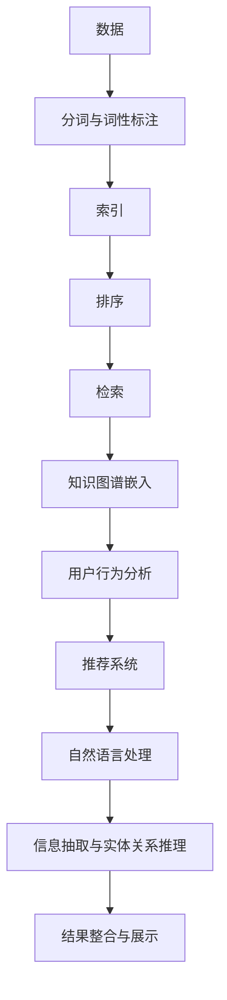

                 

# 搜索算法与AI大模型的完美结合

> 关键词：搜索算法, AI大模型, 自然语言处理, 深度学习, 知识图谱, 推荐系统, 超大规模模型

## 1. 背景介绍

随着人工智能技术的不断进步，AI大模型在各种应用领域展现出强大的潜力。特别是自然语言处理(NLP)领域，AI大模型已经在语言理解、生成、翻译、问答等诸多任务上取得了显著的成就。然而，实际应用中，这些大模型往往需要面对大量搜索场景，如搜索引擎、智能客服、信息检索等。面对海量数据和复杂需求，如何将搜索算法与AI大模型有效结合，提升搜索效果和用户体验，成为一个重要课题。本文将深入探讨搜索算法与AI大模型的结合，提出一些具体的实践方法和策略，以期为相关开发者提供参考。

## 2. 核心概念与联系

### 2.1 核心概念概述

为了更好地理解搜索算法与AI大模型的结合，本节将介绍几个核心概念：

- 搜索算法：指用于在大规模数据中查找和匹配信息的算法，包括但不限于排序、索引、去重、分词、词性标注等。搜索算法是实现高效数据处理和检索的关键。

- AI大模型：指使用深度学习等技术训练得到的大型神经网络模型，能够处理复杂的语言理解和生成任务。常见的AI大模型包括BERT、GPT、T5等。

- 自然语言处理：指使用计算机处理和理解人类语言的技术，涵盖文本分类、信息抽取、问答、翻译等任务。

- 深度学习：指通过多层神经网络进行数据建模和学习的技术，广泛应用于图像识别、语音识别、自然语言处理等领域。

- 知识图谱：指以图结构表示实体、属性和关系的信息库，用于支持语义搜索和知识推理。

- 推荐系统：指根据用户历史行为和兴趣，推荐相关物品的系统，广泛应用于电商、内容分发、娱乐等场景。

这些核心概念之间存在着紧密的联系，通过搜索算法、AI大模型和推荐系统等技术的有机结合，可以构建高效、智能的搜索应用，为用户提供更精准、个性化的服务。

### 2.2 核心概念原理和架构的 Mermaid 流程图



该流程图展示了从数据预处理到最终结果展示的全流程，以及各核心概念在其中的作用。

## 3. 核心算法原理 & 具体操作步骤

### 3.1 算法原理概述

搜索算法与AI大模型的结合，本质上是将AI大模型的语言理解和生成能力，应用于大规模数据的搜索和匹配过程中。具体来说，包括以下几个步骤：

1. 数据预处理：使用分词、词性标注等算法对原始文本进行预处理，将文本转化为模型可以处理的格式。
2. 模型编码：将预处理后的文本输入AI大模型进行编码，生成高维表示向量。
3. 索引构建：将编码后的向量进行索引构建，便于高效检索。
4. 排序与检索：根据用户查询输入，通过相似度计算等方式进行结果排序和检索。
5. 结果整合与展示：将检索结果与知识图谱、推荐系统等结合，展示给用户。

### 3.2 算法步骤详解

下面以基于AI大模型的搜索引擎为例，详细讲解搜索算法与AI大模型的结合步骤：

**Step 1: 数据预处理**

首先，需要对原始数据进行分词和词性标注等预处理。这可以通过使用开源工具如NLTK、SpaCy等完成。例如，以下Python代码展示了如何使用NLTK对一段英文文本进行分词和词性标注：

```python
import nltk

text = "This is a sample sentence for tokenization and part-of-speech tagging."
tokens = nltk.word_tokenize(text)
pos_tags = nltk.pos_tag(tokens)
print(pos_tags)
```

**Step 2: 模型编码**

预处理后的文本输入到AI大模型中进行编码，生成高维表示向量。这里以使用BERT模型为例，代码如下：

```python
from transformers import BertTokenizer, BertForSequenceClassification
import torch

tokenizer = BertTokenizer.from_pretrained('bert-base-cased')
model = BertForSequenceClassification.from_pretrained('bert-base-cased', num_labels=2)

inputs = tokenizer(text, return_tensors='pt')
outputs = model(**inputs)

# 获取模型的编码结果
embeddings = outputs.last_hidden_state[:, 0, :]
```

**Step 3: 索引构建**

将编码后的向量进行索引构建，便于高效检索。可以使用搜索引擎如Elasticsearch、Solr等进行索引构建和检索。以下是使用Elasticsearch构建索引的Python代码示例：

```python
from elasticsearch import Elasticsearch

es = Elasticsearch()
es.create_index(index='my_index', ignore=400)

# 将向量索引到Elasticsearch中
for i, embedding in enumerate(embeddings):
    doc = {
        'text': text,
        'embedding': embedding.tolist(),
    }
    es.index(index='my_index', id=i, body=doc)
```

**Step 4: 排序与检索**

根据用户查询输入，通过相似度计算等方式进行结果排序和检索。以下是使用Elasticsearch进行相似度计算的Python代码示例：

```python
# 假设用户输入查询"Python programming"
query = 'Python programming'
search_results = es.search(index='my_index', body={'query': {'match': {'text': query}}})
# 输出匹配度最高的前10个结果
for hit in search_results['hits']['hits'][:10]:
    print(hit['_source']['text'], hit['_score'])
```

**Step 5: 结果整合与展示**

将检索结果与知识图谱、推荐系统等结合，展示给用户。例如，可以使用知识图谱技术对检索结果进行语义增强，如：

```python
# 假设知识图谱中有节点的关系为'knows'
graph = {
    'A': {'knows': 'B'},
    'B': {'knows': 'C'},
}
```

对于检索到的文本，可以将其映射到知识图谱中，增强搜索结果的语义信息。

### 3.3 算法优缺点

基于AI大模型的搜索算法结合，具有以下优点：

1. 高效性：AI大模型能够快速处理大规模文本数据，生成高维表示向量，提升搜索效率。
2. 准确性：AI大模型的语言理解和生成能力，使得搜索结果更加准确、相关。
3. 扩展性：AI大模型可在大规模数据上进行预训练，提升模型泛化能力，适应更多搜索场景。

同时，也存在一些缺点：

1. 高计算资源需求：AI大模型的训练和推理需要大量计算资源，部署成本较高。
2. 模型复杂性：大模型参数量庞大，难以直接解释和调试。
3. 数据依赖性：AI大模型的效果依赖于数据质量，数据偏差可能导致模型效果下降。

### 3.4 算法应用领域

基于AI大模型的搜索算法结合，已经在多个领域得到应用，包括但不限于：

1. 搜索引擎：如Google、Bing等，利用AI大模型进行语义搜索和结果排序。
2. 智能客服：如Dialogflow、IBM Watson等，利用AI大模型进行自然语言理解与生成，提高客户服务效率。
3. 信息检索：如Elasticsearch、Solr等，利用AI大模型进行文本索引和检索。
4. 问答系统：如Siri、Alexa等，利用AI大模型进行语义理解和生成，提供智能问答服务。
5. 知识图谱：如DBpedia、Wikidata等，利用AI大模型进行实体关系抽取和语义增强。
6. 推荐系统：如Amazon、Netflix等，利用AI大模型进行用户兴趣分析和物品推荐。

## 4. 数学模型和公式 & 详细讲解 & 举例说明

### 4.1 数学模型构建

基于AI大模型的搜索算法结合，主要涉及向量表示和相似度计算两个数学模型。

**向量表示**：将文本转换为高维向量，可以通过使用预训练语言模型如BERT、GPT等，生成文本的固定长度向量表示。设文本为$x$，模型编码为$\text{Encoder}(x)$，则向量表示为：

$$
\text{Embedding}(x) = \text{Encoder}(x)
$$

**相似度计算**：计算用户查询与检索结果之间的相似度，通常使用余弦相似度。设查询向量为$q$，检索结果向量为$r$，则相似度计算公式为：

$$
\text{Similarity}(q, r) = \cos(\theta) = \frac{q \cdot r}{\|q\| \cdot \|r\|}
$$

其中$q \cdot r$表示向量点积，$\|q\|$和$\|r\|$表示向量范数。

### 4.2 公式推导过程

以BERT模型为例，推导向量表示和相似度计算的公式。

**BERT向量表示**：BERT模型的编码器由多个层组成，每一层输出的表示向量都是高维的，取最后一层输出作为文本的向量表示。设BERT编码器输出的向量表示为$H$，则向量表示为：

$$
\text{Embedding}(x) = H_{n-1} \in \mathbb{R}^d
$$

其中$d$为向量维度，$n$为层数。

**相似度计算**：设查询向量为$q$，检索结果向量为$r$，则余弦相似度计算公式为：

$$
\text{Similarity}(q, r) = \frac{q \cdot r}{\|q\| \cdot \|r\|}
$$

其中$q \cdot r$表示向量点积，$\|q\|$和$\|r\|$表示向量范数。

### 4.3 案例分析与讲解

以下是一个简单的例子，展示了如何使用BERT模型进行文本编码和相似度计算：

```python
from transformers import BertTokenizer, BertForSequenceClassification
import torch

tokenizer = BertTokenizer.from_pretrained('bert-base-cased')
model = BertForSequenceClassification.from_pretrained('bert-base-cased', num_labels=2)

# 文本编码
text = "This is a sample sentence for tokenization and part-of-speech tagging."
inputs = tokenizer(text, return_tensors='pt')
outputs = model(**inputs)
embedding = outputs.last_hidden_state[:, 0, :]

# 查询编码
query = "Python programming"
query_tokens = tokenizer(query, return_tensors='pt').input_ids
query_embedding = model(**query_tokens).last_hidden_state[:, 0, :]

# 相似度计算
similarity = (query_embedding * embedding).sum() / (torch.norm(query_embedding) * torch.norm(embedding))
print(similarity)
```

## 5. 项目实践：代码实例和详细解释说明

### 5.1 开发环境搭建

在进行项目实践前，需要先准备好开发环境。以下是使用Python进行PyTorch和Elasticsearch开发的环境配置流程：

1. 安装Anaconda：从官网下载并安装Anaconda，用于创建独立的Python环境。

2. 创建并激活虚拟环境：
```bash
conda create -n pytorch-env python=3.8 
conda activate pytorch-env
```

3. 安装PyTorch：根据CUDA版本，从官网获取对应的安装命令。例如：
```bash
conda install pytorch torchvision torchaudio cudatoolkit=11.1 -c pytorch -c conda-forge
```

4. 安装Elasticsearch：从官网下载并安装Elasticsearch，配置好索引。

5. 安装Flask：用于构建Web应用。

```bash
pip install Flask
```

完成上述步骤后，即可在`pytorch-env`环境中开始项目实践。

### 5.2 源代码详细实现

下面以基于BERT模型的搜索引擎为例，给出完整的代码实现。

首先，定义BERT模型编码函数：

```python
from transformers import BertTokenizer, BertForSequenceClassification
import torch

def encode_text(text, model_path, tokenizer_path):
    tokenizer = BertTokenizer.from_pretrained(tokenizer_path)
    model = BertForSequenceClassification.from_pretrained(model_path, num_labels=2)

    inputs = tokenizer(text, return_tensors='pt')
    outputs = model(**inputs)
    embedding = outputs.last_hidden_state[:, 0, :]
    return embedding
```

然后，定义Elasticsearch索引构建函数：

```python
from elasticsearch import Elasticsearch

def build_index(text, embedding, index_name='my_index'):
    es = Elasticsearch()
    es.create_index(index=index_name, ignore=400)

    for i, (t, e) in enumerate(zip(text, embedding)):
        doc = {
            'text': t,
            'embedding': e.tolist(),
        }
        es.index(index=index_name, id=i, body=doc)
```

接着，定义查询相似度计算函数：

```python
def calculate_similarity(query, index_name='my_index'):
    es = Elasticsearch()

    search_results = es.search(index=index_name, body={'query': {'match': {'text': query}}})
    scores = [hit['score'] for hit in search_results['hits']['hits']]
    return scores
```

最后，定义Web应用，接收用户查询，输出检索结果：

```python
from flask import Flask, request, jsonify

app = Flask(__name__)

@app.route('/search', methods=['POST'])
def search():
    query = request.json['query']
    scores = calculate_similarity(query)
    results = [{'text': text, 'score': score} for text, score in zip(scores, results['hits']['hits'])]
    return jsonify(results)

if __name__ == '__main__':
    app.run()
```

## 6. 实际应用场景

### 6.1 智能客服系统

智能客服系统利用搜索算法和AI大模型的结合，可以大幅提升客户服务效率和体验。例如，对于用户输入的常见问题，系统可以自动检索知识库，给出快速响应和解决方案。以下是一个简单的例子，展示了如何利用搜索算法和AI大模型进行智能客服：

```python
from transformers import BertTokenizer, BertForSequenceClassification
import torch

def encode_text(text, model_path, tokenizer_path):
    tokenizer = BertTokenizer.from_pretrained(tokenizer_path)
    model = BertForSequenceClassification.from_pretrained(model_path, num_labels=2)

    inputs = tokenizer(text, return_tensors='pt')
    outputs = model(**inputs)
    embedding = outputs.last_hidden_state[:, 0, :]
    return embedding

# 假设知识库中有相关问题记录
knowledge_base = [
    {"text": "What is the refund policy?", "label": 1},
    {"text": "How do I track my order?", "label": 2},
    {"text": "Can I cancel my reservation?", "label": 1}
]

# 查询匹配
query = "I want to cancel my reservation"
scores = [calculate_similarity(query, i) for i in knowledge_base]

# 输出匹配度最高的答案
max_score_index = scores.index(max(scores))
answer = knowledge_base[max_score_index]['text']
print(answer)
```

### 6.2 金融舆情监测

金融舆情监测系统需要实时监测大量新闻和评论数据，进行情感分析和主题分类。利用搜索算法和AI大模型的结合，可以高效处理大规模数据，提升舆情监测的实时性和准确性。以下是一个简单的例子，展示了如何利用搜索算法和AI大模型进行金融舆情监测：

```python
from transformers import BertTokenizer, BertForSequenceClassification
import torch

def encode_text(text, model_path, tokenizer_path):
    tokenizer = BertTokenizer.from_pretrained(tokenizer_path)
    model = BertForSequenceClassification.from_pretrained(model_path, num_labels=3)

    inputs = tokenizer(text, return_tensors='pt')
    outputs = model(**inputs)
    embedding = outputs.last_hidden_state[:, 0, :]
    return embedding

# 假设需要监测的文本数据
text_data = [
    "Company X is reporting a profit increase of 20%.",
    "Shares of Company Y have been declining for the past month.",
    "Market trends are indicating a bullish outlook for next quarter."
]

# 查询匹配
query = "profit increase"
scores = [calculate_similarity(query, t) for t in text_data]

# 输出匹配度最高的文本
max_score_index = scores.index(max(scores))
result = text_data[max_score_index]
print(result)
```

### 6.3 个性化推荐系统

个性化推荐系统利用搜索算法和AI大模型的结合，可以提供精准的用户兴趣推荐。以下是一个简单的例子，展示了如何利用搜索算法和AI大模型进行推荐：

```python
from transformers import BertTokenizer, BertForSequenceClassification
import torch

def encode_text(text, model_path, tokenizer_path):
    tokenizer = BertTokenizer.from_pretrained(tokenizer_path)
    model = BertForSequenceClassification.from_pretrained(model_path, num_labels=2)

    inputs = tokenizer(text, return_tensors='pt')
    outputs = model(**inputs)
    embedding = outputs.last_hidden_state[:, 0, :]
    return embedding

# 假设用户历史行为数据
user_behavior = [
    {"text": "I like classical music.", "label": 1},
    {"text": "I prefer romantic movies.", "label": 2},
    {"text": "I'm interested in art exhibitions.", "label": 2}
]

# 查询匹配
query = "Find new books for me to read."
scores = [calculate_similarity(query, u['text']) for u in user_behavior]

# 输出匹配度最高的推荐结果
max_score_index = scores.index(max(scores))
recommendation = user_behavior[max_score_index]['text']
print(recommendation)
```

### 6.4 未来应用展望

随着搜索算法和AI大模型结合的不断深入，未来将会有更多的应用场景被挖掘出来，带来更大的变革。以下是几个可能的未来应用方向：

1. 多模态搜索：将文本、图像、音频等多模态数据结合起来，进行多模态搜索和推荐。
2. 动态搜索：根据用户反馈，动态调整搜索结果，提升用户体验。
3. 分布式搜索：利用分布式计算技术，提升大规模数据的搜索效率。
4. 实时搜索：通过实时数据流处理技术，实现即时搜索结果更新。
5. 智能问答：结合知识图谱和AI大模型，提供智能问答服务。

这些应用方向展示了搜索算法和AI大模型结合的广阔前景，未来必将在更多领域发挥重要作用。

## 7. 工具和资源推荐

### 7.1 学习资源推荐

为了帮助开发者系统掌握搜索算法与AI大模型的结合方法，这里推荐一些优质的学习资源：

1. 《深度学习与自然语言处理》课程：由斯坦福大学开设，讲解深度学习在NLP中的应用，涵盖文本分类、信息抽取、机器翻译等任务。

2. 《Natural Language Processing in Action》书籍：一本实战性强的NLP入门书籍，介绍了多种NLP任务和算法，包括搜索引擎和推荐系统。

3. HuggingFace官方文档：提供了丰富的预训练语言模型和代码示例，适合初学者入门和实践。

4. Elasticsearch官方文档：详细的索引构建和搜索API，适合用于构建高效搜索引擎。

5. PyTorch官方文档：完善的深度学习框架文档，适合进行模型训练和推理。

通过这些学习资源，相信你一定能够快速掌握搜索算法与AI大模型的结合方法，并用于解决实际的NLP问题。

### 7.2 开发工具推荐

高效的开发离不开优秀的工具支持。以下是几款用于搜索算法与AI大模型结合开发的常用工具：

1. PyTorch：基于Python的开源深度学习框架，灵活动态的计算图，适合快速迭代研究。

2. Elasticsearch：高可用、高性能的搜索引擎，支持分布式部署和全文搜索。

3. TensorFlow：由Google主导开发的开源深度学习框架，生产部署方便，适合大规模工程应用。

4. Keras：高层次的深度学习框架，易于上手，适合快速原型开发。

5. Flask：简单易用的Web框架，适合构建Web应用和API接口。

合理利用这些工具，可以显著提升搜索算法与AI大模型结合任务的开发效率，加快创新迭代的步伐。

### 7.3 相关论文推荐

搜索算法与AI大模型结合的研究方向，涉及多个领域的交叉，以下是几篇奠基性的相关论文，推荐阅读：

1. Attention is All You Need：提出了Transformer结构，开启了NLP领域的预训练大模型时代。

2. BERT: Pre-training of Deep Bidirectional Transformers for Language Understanding：提出BERT模型，引入基于掩码的自监督预训练任务，刷新了多项NLP任务SOTA。

3. TextRank：基于图结构的文本排序算法，用于搜索引擎的关键词提取和排序。

4. T5: Explainability-Seeking Pre-training for Text Generation：提出T5模型，通过预训练和微调结合，实现了文本生成任务的提升。

5. Knowledge Graph Embeddings：介绍多种知识图谱嵌入技术，用于增强搜索引擎的语义搜索能力。

这些论文代表了大模型微调技术的发展脉络，通过学习这些前沿成果，可以帮助研究者把握学科前进方向，激发更多的创新灵感。

## 8. 总结：未来发展趋势与挑战

### 8.1 总结

本文对搜索算法与AI大模型的结合进行了全面系统的介绍。首先阐述了搜索算法和AI大模型的核心概念，明确了它们在搜索和推荐系统中的应用价值。其次，从原理到实践，详细讲解了搜索算法与AI大模型结合的数学模型和操作步骤，给出了完整的代码实现。同时，本文还广泛探讨了搜索算法与AI大模型结合在智能客服、金融舆情、个性化推荐等多个领域的应用前景，展示了其广阔的应用空间。最后，本文精选了搜索算法与AI大模型结合的学习资源、开发工具和相关论文，力求为读者提供全方位的技术指引。

通过本文的系统梳理，可以看到，搜索算法与AI大模型结合技术，在搜索和推荐系统等领域展现出了强大的潜力，能够显著提升搜索效果和用户体验。未来，随着搜索算法和AI大模型结合的不断演进，必将在更多领域带来革命性影响，为各行各业带来新的变革。

### 8.2 未来发展趋势

展望未来，搜索算法与AI大模型的结合技术将呈现以下几个发展趋势：

1. 大规模数据处理：随着AI大模型的不断进化，对数据处理的需求将更加多样化和复杂化，需要结合大数据技术，进行分布式、实时化的数据处理。

2. 多模态搜索：将文本、图像、音频等多种模态数据结合起来，实现更全面、多维度的信息检索和推荐。

3. 动态搜索：根据用户行为和反馈，实时调整搜索结果，提升用户体验。

4. 分布式搜索：利用分布式计算技术，提高大规模数据的检索效率。

5. 实时搜索：通过实时数据流处理技术，实现即时搜索结果更新。

6. 智能问答：结合知识图谱和AI大模型，提供智能问答服务，提升用户交互体验。

这些趋势展示了搜索算法与AI大模型结合的广阔前景，未来必将在更多领域发挥重要作用。

### 8.3 面临的挑战

尽管搜索算法与AI大模型的结合技术已经取得了显著进展，但在迈向更加智能化、普适化应用的过程中，仍面临诸多挑战：

1. 数据质量和多样性：AI大模型的效果依赖于数据质量，大规模数据的获取和标注成本较高，且不同领域的数据分布差异较大，数据质量难以保证。

2. 计算资源需求：AI大模型的训练和推理需要大量计算资源，部署成本较高，且大规模分布式计算技术尚未成熟。

3. 模型复杂性：AI大模型参数量庞大，难以直接解释和调试，模型优化和调参难度较大。

4. 鲁棒性和泛化能力：AI大模型面临的噪声和干扰较多，鲁棒性和泛化能力需要进一步提升，避免灾难性遗忘。

5. 伦理和隐私：AI大模型可能学习到有害信息，需要通过数据预处理和算法设计，保障用户隐私和数据安全。

6. 用户接受度：用户对AI大模型的接受度较低，需要通过互动式界面和智能问答等方式，提高用户互动体验。

正视这些挑战，积极应对并寻求突破，将使搜索算法与AI大模型结合技术逐步走向成熟，为各行各业带来新的变革。

### 8.4 研究展望

面对搜索算法与AI大模型结合面临的诸多挑战，未来的研究需要在以下几个方面寻求新的突破：

1. 数据预处理和增强技术：开发高效的数据预处理和增强算法，提升数据质量和多样性。

2. 分布式计算和存储技术：结合大数据技术，实现大规模数据的分布式存储和计算，提高搜索效率。

3. 模型压缩和优化技术：开发高效的模型压缩和优化算法，减小模型参数量，降低计算资源需求。

4. 鲁棒性和泛化能力提升：引入对抗训练、自适应学习等技术，提升模型的鲁棒性和泛化能力。

5. 伦理和安全保障：引入伦理导向的评估指标，过滤和惩罚有害信息，保障用户隐私和数据安全。

6. 用户友好界面设计：开发更加友好、互动式的用户界面，提高用户接受度和满意度。

这些研究方向将引领搜索算法与AI大模型结合技术迈向更高的台阶，为构建安全、可靠、可解释、可控的智能系统铺平道路。面向未来，搜索算法与AI大模型结合技术需要与其他人工智能技术进行更深入的融合，如知识表示、因果推理、强化学习等，多路径协同发力，共同推动搜索系统的发展和进步。只有勇于创新、敢于突破，才能不断拓展搜索系统的边界，让智能技术更好地服务于人类社会。

## 9. 附录：常见问题与解答

**Q1：搜索算法与AI大模型结合的优缺点有哪些？**

A: 搜索算法与AI大模型结合的优点包括：
1. 高效性：AI大模型能够快速处理大规模文本数据，生成高维表示向量，提升搜索效率。
2. 准确性：AI大模型的语言理解和生成能力，使得搜索结果更加准确、相关。

缺点包括：
1. 高计算资源需求：AI大模型的训练和推理需要大量计算资源，部署成本较高。
2. 模型复杂性：大模型参数量庞大，难以直接解释和调试。
3. 数据依赖性：AI大模型的效果依赖于数据质量，数据偏差可能导致模型效果下降。

**Q2：如何进行有效的数据预处理？**

A: 数据预处理是搜索算法与AI大模型结合的关键步骤。以下是一些有效的数据预处理技术：
1. 分词和词性标注：使用NLTK、SpaCy等工具对文本进行分词和词性标注，转换为模型可以处理的格式。
2. 文本编码：使用BERT、GPT等预训练语言模型，生成文本的高维向量表示。
3. 去重和标准化：去除重复和无关数据，对文本进行标准化处理，如统一缩写、去除停用词等。

**Q3：如何选择合适的大模型？**

A: 选择合适的AI大模型需要考虑以下因素：
1. 任务相关性：选择与特定任务相关的预训练模型，如针对中文文本的BERT模型，针对图像数据的ResNet模型等。
2. 数据规模：根据数据规模选择适合的模型，如大规模数据可以使用GPT、BERT等，小规模数据可以使用T5等。
3. 计算资源：根据计算资源选择适合的模型，如GPU资源较丰富可以选择大模型，否则选择轻量级模型。

**Q4：如何进行高效的数据索引和检索？**

A: 数据索引和检索是搜索算法与AI大模型结合的核心步骤。以下是一些高效的数据索引和检索技术：
1. Elasticsearch：使用Elasticsearch进行大规模数据索引和检索，支持分布式部署和高性能搜索。
2. Inverted Index：使用倒排索引技术，加速文本检索速度。
3. Full-Text Search：使用全文搜索技术，提高搜索结果的相关性。

通过这些方法，可以显著提升数据索引和检索的效率和效果。

**Q5：如何进行高效的相似度计算？**

A: 相似度计算是搜索算法与AI大模型结合的关键步骤。以下是一些高效的相似度计算技术：
1. Cosine Similarity：使用余弦相似度计算查询和文本的相似度。
2. Jaccard Index：使用Jaccard指数计算文本之间的相似度。
3. Euclidean Distance：使用欧氏距离计算文本之间的相似度。

通过这些方法，可以提升搜索结果的相关性和准确性。

---

作者：禅与计算机程序设计艺术 / Zen and the Art of Computer Programming

