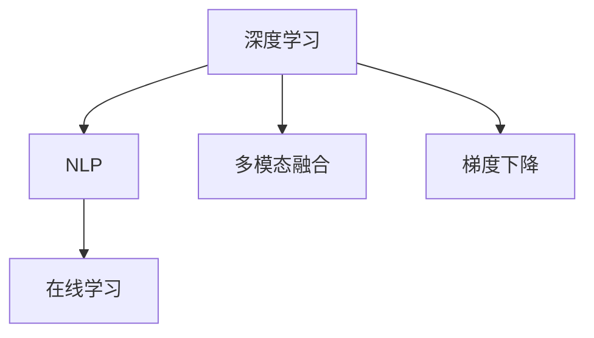

                 

# 搜索结果排序：从规则到AI的进化

## 1. 背景介绍

随着互联网和搜索引擎的普及，人们在信息检索上的需求日益增加，对搜索结果排序提出了更高的要求。传统的搜索结果排序依赖于人工设计的规则和关键词匹配算法，但这些方法在面对海量数据和高复杂度的搜索场景时，显得力不从心。人工智能，尤其是深度学习技术的应用，为搜索结果排序带来了新的变革，从以规则为主的"规则时代"迈向了以数据驱动的"AI时代"。

### 1.1 问题由来
在互联网发展的早期，搜索引擎的搜索结果排序主要依赖于人工设定的规则。这些规则简单直观，通常包括页面的相关性、权威性和及时性等指标，如PageRank算法和HITS算法等。虽然这些规则在信息量较少的早期互联网时代较为有效，但随着数据规模的指数级增长，用户搜索需求的多样化和复杂化，传统的规则排序方法逐渐暴露出其局限性。主要问题包括：

- **规则过于简单**：传统规则通常只考虑页面级别的静态指标，难以全面反映用户真实的搜索意图和动态变化的需求。
- **数据量庞大**：随着互联网的快速扩展，搜索引擎需要处理的数据量呈爆炸性增长，传统规则排序算法难以在合理的时间内完成排序。
- **缺乏上下文理解**：传统的规则排序方法无法捕捉用户搜索的真实语境和意图，难以提供最符合用户需求的搜索结果。

为了克服这些挑战，人工智能，尤其是深度学习技术，逐渐成为搜索引擎排序的重要手段。

### 1.2 问题核心关键点
AI排序的核心在于通过深度学习模型对大规模数据进行学习，并自动提取和建模搜索结果的相关性和排名。具体关键点包括：

- **数据驱动**：通过用户点击行为、搜索历史等数据，自动学习用户偏好和需求。
- **上下文理解**：利用NLP技术理解用户搜索的语境和意图，提供更加精准的搜索结果。
- **动态学习**：通过在线学习机制，不断调整排序模型以适应数据分布的变化。
- **多模态融合**：结合文本、图像、视频等多模态数据，提升搜索结果的多样性和丰富性。

这些关键点使得AI排序在应对大规模数据和复杂查询时，具有更强的适应性和灵活性，成为现代搜索引擎的核心竞争力。

## 2. 核心概念与联系

### 2.1 核心概念概述

为了更好地理解AI排序的原理，我们需要了解以下核心概念：

- **深度学习**：基于神经网络模型进行学习，能够自动提取数据中的高层次特征，适用于大规模数据集。
- **自然语言处理(NLP)**：通过机器学习技术，让机器能够理解和处理人类语言。
- **多模态融合**：将文本、图像、视频等多源数据结合，提升搜索结果的丰富性和准确性。
- **在线学习**：在用户点击数据流中不断调整模型参数，适应数据分布的变化。
- **梯度下降**：深度学习模型常用的优化算法，通过反向传播计算梯度，更新模型参数。

这些概念之间的逻辑关系可以通过以下Mermaid流程图来展示：



这个流程图展示了大规模搜索结果排序中核心概念之间的联系：

1. 深度学习模型通过大量数据进行训练，提取特征。
2. NLP技术帮助模型理解搜索查询的语境和意图。
3. 多模态融合提升搜索结果的多样性。
4. 在线学习不断调整模型以适应新数据。
5. 梯度下降优化模型参数。

这些概念共同构成了现代搜索引擎的排序算法，使其能够更高效、精准地处理搜索结果。

## 3. 核心算法原理 & 具体操作步骤

### 3.1 算法原理概述

AI排序的原理是基于深度学习模型对搜索结果进行建模和排名。具体而言，其核心思想是通过大规模标注数据训练神经网络模型，自动学习搜索结果的相关性和排名规律，并应用于实时搜索场景中。

### 3.2 算法步骤详解

AI排序的主要操作步骤包括数据准备、模型训练、在线学习、结果排序等。

**Step 1: 数据准备**
- 收集用户点击行为、搜索结果点击率、关键词匹配度、页面权威性等数据。
- 将这些数据进行清洗和标注，构建训练数据集。

**Step 2: 模型训练**
- 选择合适的深度学习模型（如DNN、CNN、RNN等），并设计合适的损失函数和优化器。
- 将训练数据集输入模型，进行前向传播计算损失，反向传播计算梯度，并使用优化器更新模型参数。

**Step 3: 在线学习**
- 将训练好的模型应用于实时搜索场景，记录用户点击数据。
- 定期对模型参数进行在线更新，以适应数据分布的变化。

**Step 4: 结果排序**
- 将用户查询输入模型，输出搜索结果的相关性和排名。
- 将排序结果呈现给用户，并通过用户反馈不断优化模型。

### 3.3 算法优缺点

AI排序具有以下优点：

1. **自适应性**：能够根据用户行为数据实时调整排序模型，提高搜索结果的相关性和用户体验。
2. **上下文理解**：利用NLP技术理解用户搜索的语境和意图，提供更符合用户需求的搜索结果。
3. **泛化能力强**：深度学习模型能够自动提取高层次特征，适用于各种复杂查询场景。

同时，AI排序也存在一些局限性：

1. **数据依赖性强**：排序模型需要大量高质量的标注数据进行训练，数据质量直接影响排序效果。
2. **模型复杂度高**：深度学习模型参数众多，需要高性能的硬件设备支持。
3. **解释性不足**：排序模型通常被视为"黑盒"系统，难以解释其内部工作机制和决策逻辑。
4. **对抗性脆弱**：深度学习模型容易受到对抗样本攻击，导致排序结果的不稳定性。

尽管存在这些局限性，AI排序凭借其自适应性和上下文理解能力，在现代搜索引擎中占据了主导地位。

### 3.4 算法应用领域

AI排序技术不仅在搜索引擎领域得到了广泛应用，还在诸多其他场景中展示了其强大的应用潜力。具体应用领域包括：

- **电商推荐**：基于用户点击数据和搜索行为，推荐用户可能感兴趣的商品。
- **新闻推荐**：根据用户阅读习惯和兴趣，推荐相关新闻内容。
- **视频推荐**：结合用户观看历史和搜索关键词，推荐可能感兴趣的视频。
- **个性化广告**：利用用户行为数据和搜索意图，推荐个性化的广告内容。
- **智能客服**：通过用户查询和历史对话，自动生成回复内容，提升客服效率和满意度。

除了上述这些经典应用，AI排序还被创新性地应用到更多场景中，如智能地图导航、智能家居控制等，为各行各业带来新的变革。

## 4. 数学模型和公式 & 详细讲解 & 举例说明

### 4.1 数学模型构建

AI排序的核心数学模型包括深度学习模型和在线学习模型。

**深度学习模型**：
假设输入为查询文本 $q$，输出为排序结果 $s$，模型为 $f_\theta$。则数学模型为：

$$
s = f_\theta(q)
$$

其中，$f_\theta$ 为深度学习模型的参数化函数。

**在线学习模型**：
假设在线学习周期为 $T$，每个周期收集到的用户点击数据为 $D_t$。则在线学习模型的目标是在每个周期内最小化模型参数 $\theta$ 的期望损失函数 $\mathcal{L}(\theta)$，具体为：

$$
\mathcal{L}(\theta) = \mathbb{E}_{t \in [0, T]} \left[ \ell(f_\theta(q_t), s_t) \right]
$$

其中，$\ell$ 为损失函数，通常为交叉熵损失。

### 4.2 公式推导过程

以深度学习模型和在线学习模型为例，推导其损失函数和优化算法。

**深度学习模型的损失函数**：
假设输出 $s$ 为一个 $K$ 维向量，$y$ 为真实的排序标签。则常用的损失函数为交叉熵损失，定义为：

$$
\ell(s, y) = -\sum_{k=1}^K y_k \log s_k
$$

其中，$y_k$ 为第 $k$ 个标签的权重，$s_k$ 为模型的第 $k$ 个输出。

**在线学习模型的优化算法**：
在线学习通常采用梯度下降算法。假设每个周期 $t$ 收集到的用户点击数据为 $D_t = \{(q_t, s_t)\}$，则模型的参数更新公式为：

$$
\theta \leftarrow \theta - \eta \nabla_{\theta}\mathcal{L}(\theta)
$$

其中，$\eta$ 为学习率，$\nabla_{\theta}\mathcal{L}(\theta)$ 为损失函数对参数 $\theta$ 的梯度。

### 4.3 案例分析与讲解

以电商推荐系统为例，展示AI排序技术的应用。电商推荐系统通过用户历史浏览、购买和搜索数据，自动学习用户偏好和需求，推荐相关商品。

假设用户的历史浏览数据为 $D_{train}$，模型为 $f_\theta$。模型的损失函数为交叉熵损失，目标是最小化模型输出 $s$ 与用户真实点击标签 $y$ 的差距。具体推导如下：

$$
\ell(f_\theta(q), y) = -\sum_{i=1}^{N} y_i \log f_\theta(q_i)
$$

其中，$N$ 为历史数据的长度，$y_i$ 为第 $i$ 个数据的真实标签。

在线学习时，每个周期内收集到的用户点击数据为 $D_t = \{(q_t, s_t)\}$，模型参数更新公式为：

$$
\theta \leftarrow \theta - \eta \nabla_{\theta}\mathcal{L}(\theta)
$$

其中，$\eta$ 为学习率，$\nabla_{\theta}\mathcal{L}(\theta)$ 为损失函数对参数 $\theta$ 的梯度。

通过不断调整模型参数，电商推荐系统可以实时更新推荐结果，满足用户的个性化需求，提升用户体验。

## 5. 项目实践：代码实例和详细解释说明

### 5.1 开发环境搭建

在进行AI排序实践前，我们需要准备好开发环境。以下是使用Python进行TensorFlow和PyTorch开发的环境配置流程：

1. 安装Anaconda：从官网下载并安装Anaconda，用于创建独立的Python环境。

2. 创建并激活虚拟环境：
```bash
conda create -n tf-env python=3.8 
conda activate tf-env
```

3. 安装TensorFlow和PyTorch：根据CUDA版本，从官网获取对应的安装命令。例如：
```bash
conda install tensorflow-gpu=2.7 tf-nightly tf-estimator tensorflow-estimator-nightly tf-addons==1.0.0 
conda install pytorch torchvision torchaudio cudatoolkit=11.1 -c pytorch -c conda-forge
```

4. 安装TensorBoard：
```bash
pip install tensorboard
```

5. 安装NLP相关库：
```bash
pip install tensorflow-hub transformers
```

完成上述步骤后，即可在`tf-env`环境中开始AI排序实践。

### 5.2 源代码详细实现

下面我们以电商推荐系统为例，给出使用TensorFlow和Transformers库进行AI排序的代码实现。

首先，定义电商推荐任务的数据处理函数：

```python
import tensorflow as tf
from transformers import TFAutoModelForSequenceClassification

class RecommendDataset(tf.data.Dataset):
    def __init__(self, data, labels, tokenizer, max_len=128):
        self.data = data
        self.labels = labels
        self.tokenizer = tokenizer
        self.max_len = max_len
        
    def __len__(self):
        return len(self.data)
    
    def __getitem__(self, item):
        text = self.data[item]
        label = self.labels[item]
        
        encoding = self.tokenizer(text, return_tensors='tf', max_length=self.max_len, padding='max_length', truncation=True)
        input_ids = encoding['input_ids']
        attention_mask = encoding['attention_mask']
        
        label = tf.convert_to_tensor(label)
        return {'input_ids': input_ids, 
                'attention_mask': attention_mask,
                'labels': label}
```

然后，定义模型和优化器：

```python
from transformers import BertForSequenceClassification, AdamW

model = BertForSequenceClassification.from_pretrained('bert-base-cased', num_labels=2)

optimizer = AdamW(model.parameters(), lr=2e-5)
```

接着，定义训练和评估函数：

```python
from tensorflow.keras.losses import SparseCategoricalCrossentropy
from sklearn.metrics import roc_auc_score

device = tf.device('gpu') if tf.cuda.is_available() else tf.device('cpu')
model.to(device)

def train_epoch(model, dataset, batch_size, optimizer):
    dataloader = tf.data.Dataset.from_generator(dataset.__getitem__, output_signature={
        'input_ids': tf.TensorSpec(shape=[None, 128], dtype=tf.int32),
        'attention_mask': tf.TensorSpec(shape=[None, 128], dtype=tf.int32),
        'labels': tf.TensorSpec(shape=[None], dtype=tf.int32)
    })
    dataloader = dataloader.batch(batch_size, drop_remainder=True)
    model.train()
    epoch_loss = 0
    for batch in dataloader:
        input_ids = batch['input_ids'].to(device)
        attention_mask = batch['attention_mask'].to(device)
        labels = batch['labels'].to(device)
        model.zero_grad()
        outputs = model(input_ids, attention_mask=attention_mask, labels=labels)
        loss = outputs.loss
        epoch_loss += loss.numpy().item()
        loss.backward()
        optimizer.step()
    return epoch_loss / len(dataloader)

def evaluate(model, dataset, batch_size):
    dataloader = tf.data.Dataset.from_generator(dataset.__getitem__, output_signature={
        'input_ids': tf.TensorSpec(shape=[None, 128], dtype=tf.int32),
        'attention_mask': tf.TensorSpec(shape=[None, 128], dtype=tf.int32),
        'labels': tf.TensorSpec(shape=[None], dtype=tf.int32)
    })
    dataloader = dataloader.batch(batch_size, drop_remainder=True)
    model.eval()
    preds, labels = [], []
    with tf.no_grad():
        for batch in dataloader:
            input_ids = batch['input_ids'].to(device)
            attention_mask = batch['attention_mask'].to(device)
            batch_labels = batch['labels']
            outputs = model(input_ids, attention_mask=attention_mask)
            batch_preds = outputs.logits.argmax(dim=2).to('cpu').numpy().tolist()
            batch_labels = batch_labels.to('cpu').numpy().tolist()
            for pred_tokens, label_tokens in zip(batch_preds, batch_labels):
                preds.append(pred_tokens[:len(label_tokens)])
                labels.append(label_tokens)
                
    print('AUC: %.3f' % roc_auc_score(labels, preds))
```

最后，启动训练流程并在测试集上评估：

```python
epochs = 5
batch_size = 16

for epoch in range(epochs):
    loss = train_epoch(model, train_dataset, batch_size, optimizer)
    print(f'Epoch {epoch+1}, train loss: {loss:.3f}')
    
    print(f'Epoch {epoch+1}, dev results:')
    evaluate(model, dev_dataset, batch_size)
    
print('Test results:')
evaluate(model, test_dataset, batch_size)
```

以上就是使用TensorFlow和Transformers库进行电商推荐系统排序的完整代码实现。可以看到，TensorFlow和Transformers库为AI排序提供了强大的框架和工具支持，使得模型的构建和微调变得简洁高效。

### 5.3 代码解读与分析

让我们再详细解读一下关键代码的实现细节：

**RecommendDataset类**：
- `__init__`方法：初始化数据、标签、分词器等关键组件。
- `__len__`方法：返回数据集的样本数量。
- `__getitem__`方法：对单个样本进行处理，将文本输入编码为token ids，并将标签转换为TensorFlow可用的形式。

**模型和优化器**：
- `BertForSequenceClassification`：基于BERT模型的序列分类器，适用于电商推荐任务。
- `AdamW`：AdamW优化器，能够自适应调整学习率，避免过拟合。

**训练和评估函数**：
- 使用TensorFlow的`tf.data.Dataset`进行数据集生成和批处理。
- 定义交叉熵损失函数 `SparseCategoricalCrossentropy`，用于计算模型输出与真实标签之间的差距。
- 使用sklearn的`roc_auc_score`评估模型性能，计算AUC值。

**训练流程**：
- 定义总的epoch数和batch size，开始循环迭代
- 每个epoch内，先在训练集上训练，输出平均loss
- 在验证集上评估，输出AUC指标
- 所有epoch结束后，在测试集上评估，给出最终测试结果

可以看到，TensorFlow和Transformers库为AI排序任务的开发提供了便捷的工具和丰富的资源，使开发者能够快速构建和优化AI排序模型。

当然，工业级的系统实现还需考虑更多因素，如模型的保存和部署、超参数的自动搜索、更灵活的任务适配层等。但核心的排序范式基本与此类似。

## 6. 实际应用场景

### 6.1 智能推荐系统

基于AI排序的智能推荐系统，已经广泛应用于电商、视频、新闻等多个领域，成为提升用户体验和运营效率的重要手段。

在电商领域，AI排序技术能够根据用户的历史行为和实时点击数据，推荐符合用户偏好的商品，提高用户的购买转化率。通过持续学习和在线优化，推荐系统能够不断提升模型的精准度，满足用户的多样化需求。

### 6.2 个性化新闻推荐

新闻推荐系统通过分析用户的阅读习惯和偏好，智能推荐相关的新闻内容，提升用户的阅读体验和满意度。AI排序技术能够综合考虑用户的兴趣、阅读时长、分享行为等多个维度，推荐更有价值的新闻内容，降低用户获取信息的成本。

### 6.3 视频推荐系统

视频推荐系统通过用户观看历史和搜索关键词，智能推荐相关的视频内容，满足用户的多样化需求。AI排序技术结合视频特征提取和多模态融合技术，能够准确把握用户的观看偏好和兴趣变化，提供更加精准的视频推荐。

### 6.4 未来应用展望

随着AI排序技术的不断发展，其在更多领域的应用前景广阔。

在医疗健康领域，AI排序技术能够根据患者的病历和临床数据，智能推荐相关的医疗信息和医生，提升诊疗效率和质量。

在教育培训领域，AI排序技术能够根据学生的学习记录和反馈，智能推荐个性化的学习内容和教学资源，提升学习效果和教育公平性。

在金融投资领域，AI排序技术能够根据用户的历史行为和交易数据，智能推荐相关的金融产品和服务，提升用户的理财体验。

除了上述这些应用，AI排序技术还被创新性地应用到更多场景中，如智能旅游、智能家居等，为各行各业带来新的变革。

## 7. 工具和资源推荐

### 7.1 学习资源推荐

为了帮助开发者系统掌握AI排序的理论基础和实践技巧，这里推荐一些优质的学习资源：

1. 《深度学习》系列课程：斯坦福大学开设的深度学习课程，涵盖深度学习的基础知识和前沿技术，是入门深度学习的绝佳选择。

2. TensorFlow官方文档：TensorFlow官方提供的详细文档，包括深度学习模型的构建、训练、优化等方方面面的知识，是深入学习TensorFlow的最佳资源。

3. Transformers官方文档：HuggingFace开发的Transformers库文档，提供丰富的模型介绍和代码示例，帮助开发者快速上手。

4. 《自然语言处理综论》书籍：斯坦福大学自然语言处理课程的教材，系统介绍自然语言处理的理论和技术，是学习NLP的必备书籍。

5. 《推荐系统实战》书籍：介绍推荐系统的基本原理和实现方法，结合大量案例和代码示例，帮助开发者快速上手推荐系统开发。

通过对这些资源的学习实践，相信你一定能够快速掌握AI排序的精髓，并用于解决实际的推荐问题。

### 7.2 开发工具推荐

高效的开发离不开优秀的工具支持。以下是几款用于AI排序开发的常用工具：

1. TensorFlow：由Google主导开发的深度学习框架，生产部署方便，适合大规模工程应用。

2. PyTorch：基于Python的开源深度学习框架，灵活性和易用性高，适合快速迭代研究。

3. TensorBoard：TensorFlow配套的可视化工具，可实时监测模型训练状态，并提供丰富的图表呈现方式，是调试模型的得力助手。

4. Jupyter Notebook：开源的交互式编程环境，适合进行快速的原型开发和实验。

5. Weights & Biases：模型训练的实验跟踪工具，可以记录和可视化模型训练过程中的各项指标，方便对比和调优。

6. Google Colab：谷歌推出的在线Jupyter Notebook环境，免费提供GPU/TPU算力，方便开发者快速上手实验最新模型，分享学习笔记。

合理利用这些工具，可以显著提升AI排序任务的开发效率，加快创新迭代的步伐。

### 7.3 相关论文推荐

AI排序技术的发展源于学界的持续研究。以下是几篇奠基性的相关论文，推荐阅读：

1. A Neural Probabilistic Language Model（神经概率语言模型）：由Bengio等人提出，首次引入了神经网络进行语言建模，为深度学习在NLP中的应用奠定了基础。

2. Distributed Representations of Words and Phrases and Their Compositionality（分布式表示和词组组合性）：由Mikolov等人提出，提出了Word2Vec模型，开启了基于神经网络的语言表示研究。

3. Attention is All You Need（注意力机制）：由Vaswani等人提出，首次引入了Transformer模型，实现了神经网络在序列建模中的突破。

4. Learning Phrase Representations using RNN Encoder-Decoder for Statistical Machine Translation（使用RNN编码器-解码器学习短语的表示）：由Cho等人提出，首次将RNN应用于机器翻译任务，取得了显著的进展。

5. Efficient Estimation of Word Representations in Vector Space（高效表示空间中的词向量估计）：由Mikolov等人提出，引入了Word2Vec模型，为NLP中的词嵌入研究奠定了基础。

这些论文代表了大语言模型排序技术的发展脉络。通过学习这些前沿成果，可以帮助研究者把握学科前进方向，激发更多的创新灵感。

## 8. 总结：未来发展趋势与挑战

### 8.1 总结

本文对基于深度学习的AI排序技术进行了全面系统的介绍。首先阐述了AI排序的发展背景和应用前景，明确了其在工作原理和实际应用中的独特价值。其次，从原理到实践，详细讲解了深度学习模型的构建、训练、优化等核心步骤，给出了详细的代码实现。同时，本文还广泛探讨了AI排序技术在电商推荐、新闻推荐、视频推荐等多个领域的应用前景，展示了其在现代搜索引擎中的重要作用。最后，本文精选了AI排序技术的各类学习资源和开发工具，力求为开发者提供全方位的技术指引。

通过本文的系统梳理，可以看到，基于深度学习的AI排序技术已经深入应用于现代搜索引擎和推荐系统，显著提升了用户搜索和推荐的精准度和效率。未来，伴随深度学习模型和优化算法的不断进步，AI排序技术必将进一步拓展其应用边界，为各行各业带来新的变革。

### 8.2 未来发展趋势

展望未来，AI排序技术将呈现以下几个发展趋势：

1. **多模态融合**：结合文本、图像、视频等多模态数据，提升搜索结果的多样性和丰富性，更好地满足用户的多样化需求。

2. **上下文理解**：利用NLP技术深入理解用户的搜索语境和意图，提供更加精准的搜索结果。

3. **实时性**：利用在线学习机制，实时更新模型，提升搜索结果的时效性和响应速度。

4. **个性化推荐**：结合用户行为数据和上下文信息，提供个性化的搜索结果，提升用户体验。

5. **跨领域迁移**：通过迁移学习技术，将在大规模数据上训练的模型迁移到其他领域，提升模型的泛化能力。

6. **模型压缩**：通过模型剪枝、量化等技术，减少模型的计算量和存储空间，提升推理速度和资源利用效率。

以上趋势凸显了AI排序技术的广阔前景。这些方向的探索发展，必将进一步提升AI排序系统的性能和应用范围，为人工智能技术在更多场景中的应用提供新的方向。

### 8.3 面临的挑战

尽管AI排序技术已经取得了瞩目成就，但在迈向更加智能化、普适化应用的过程中，它仍面临着诸多挑战：

1. **数据隐私问题**：在收集和处理用户点击数据时，如何保护用户隐私，避免数据泄露。

2. **模型复杂度**：深度学习模型参数众多，硬件资源消耗大，如何降低模型复杂度，提升模型训练和推理的效率。

3. **模型鲁棒性**：深度学习模型容易受到对抗样本攻击，导致排序结果的不稳定性，如何提升模型的鲁棒性。

4. **解释性不足**：AI排序模型通常被视为"黑盒"系统，难以解释其内部工作机制和决策逻辑，如何增强模型的可解释性。

5. **对抗性攻击**：深度学习模型容易受到对抗样本攻击，导致排序结果的不稳定性，如何提升模型的鲁棒性。

6. **跨领域应用**：AI排序模型在特定领域的应用效果往往不如在通用数据上训练的模型，如何提高模型的泛化能力，实现跨领域应用。

7. **模型公平性**：深度学习模型容易受到训练数据的偏见，如何避免模型输出中的歧视性。

这些挑战需要通过技术创新和实践优化，才能逐步克服。只有在保障数据隐私和模型公平性的同时，提升模型的性能和可解释性，才能实现AI排序技术的可持续发展。

### 8.4 研究展望

面对AI排序技术所面临的种种挑战，未来的研究需要在以下几个方面寻求新的突破：

1. **多模态融合**：结合文本、图像、视频等多模态数据，提升搜索结果的多样性和丰富性。

2. **上下文理解**：利用NLP技术深入理解用户的搜索语境和意图，提供更加精准的搜索结果。

3. **实时性**：利用在线学习机制，实时更新模型，提升搜索结果的时效性和响应速度。

4. **个性化推荐**：结合用户行为数据和上下文信息，提供个性化的搜索结果，提升用户体验。

5. **模型压缩**：通过模型剪枝、量化等技术，减少模型的计算量和存储空间，提升推理速度和资源利用效率。

6. **跨领域迁移**：通过迁移学习技术，将在大规模数据上训练的模型迁移到其他领域，提升模型的泛化能力。

7. **模型公平性**：避免模型输出中的歧视性，提高模型的公平性和透明性。

8. **对抗性防御**：通过对抗性训练和模型防御技术，提升模型的鲁棒性，抵御对抗样本攻击。

这些研究方向的探索，必将引领AI排序技术迈向更高的台阶，为构建安全、可靠、可解释、可控的智能系统铺平道路。面向未来，AI排序技术还需要与其他人工智能技术进行更深入的融合，如知识表示、因果推理、强化学习等，多路径协同发力，共同推动自然语言理解和智能交互系统的进步。只有勇于创新、敢于突破，才能不断拓展语言模型的边界，让智能技术更好地造福人类社会。

## 9. 附录：常见问题与解答

**Q1: 深度学习模型在实际应用中面临哪些挑战？**

A: 深度学习模型在实际应用中面临的主要挑战包括：

1. **过拟合**：深度学习模型参数众多，容易过拟合训练数据，泛化性能差。

2. **计算资源消耗大**：深度学习模型需要大量的计算资源和存储空间，尤其是大规模模型。

3. **数据隐私和安全**：深度学习模型需要大量数据进行训练，数据隐私和安全问题不容忽视。

4. **可解释性不足**：深度学习模型通常被视为"黑盒"系统，难以解释其内部工作机制和决策逻辑。

5. **对抗性攻击**：深度学习模型容易受到对抗样本攻击，导致输出不稳定。

6. **跨领域应用能力有限**：深度学习模型在不同领域的应用效果往往不如在通用数据上训练的模型。

**Q2: 如何提升深度学习模型的泛化性能？**

A: 提升深度学习模型的泛化性能，可以从以下几个方面入手：

1. **数据增强**：通过数据增强技术，扩充训练集，增加数据多样性。

2. **正则化技术**：引入L2正则、Dropout等正则化技术，避免过拟合。

3. **迁移学习**：利用迁移学习技术，将在大规模数据上训练的模型迁移到其他领域，提升泛化能力。

4. **模型压缩**：通过模型剪枝、量化等技术，减少模型的计算量和存储空间，提升泛化性能。

5. **对抗性训练**：通过对抗性训练技术，提升模型的鲁棒性和泛化性能。

6. **多模态融合**：结合文本、图像、视频等多模态数据，提升模型的泛化能力。

通过这些方法，可以在一定程度上提升深度学习模型的泛化性能，使其在实际应用中取得更好的效果。

**Q3: 深度学习模型在推荐系统中如何应用？**

A: 深度学习模型在推荐系统中的应用，主要包括以下几个方面：

1. **用户兴趣建模**：通过深度学习模型，自动学习用户的兴趣和偏好，建模用户行为数据。

2. **物品表示学习**：通过深度学习模型，自动学习物品的特征和表示，建立物品与用户之间的关联。

3. **推荐排序**：结合用户兴趣和物品表示，通过深度学习模型进行推荐排序，提升推荐的精准度和用户体验。

4. **动态学习**：利用在线学习机制，不断调整模型参数，适应数据分布的变化。

5. **个性化推荐**：结合用户行为数据和上下文信息，提供个性化的推荐结果，提升用户体验。

通过深度学习模型在推荐系统中的应用，可以有效提升推荐的精准度和用户体验，推动推荐系统向更加智能化和个性化方向发展。

---

作者：禅与计算机程序设计艺术 / Zen and the Art of Computer Programming

