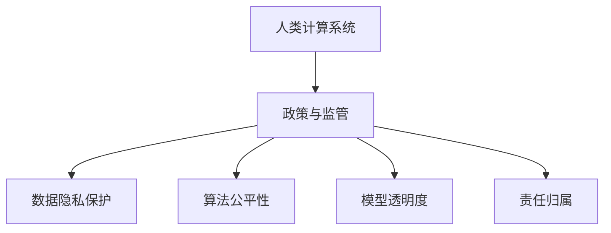

                 

# 政策与监管：引导人类计算的健康发展

## 1. 背景介绍

在数字化时代，计算机技术的进步带来了前所未有的效率提升和体验革新。但随着计算力与计算复杂度的不断提升，人类计算系统也面临着一系列挑战，如数据隐私保护、算法公平性、模型透明度等。如何通过合理的政策与监管，确保人类计算的健康发展，成为一个迫在眉睫的问题。

### 1.1 问题由来

随着深度学习、机器学习等人工智能技术的不断普及，计算系统在各行各业的应用越来越广泛。从智能推荐、语音识别到自动驾驶、医疗诊断，计算机系统的应用渗透到了社会的各个角落。然而，随着算力的提升和数据的爆炸，计算机系统的复杂性也在增加，潜在的风险和问题也日益凸显。例如，算法偏见、数据泄露、模型黑盒等问题，给社会带来了新的挑战。

近年来，全球各地政府和监管机构逐步意识到，需要制定相应的政策与监管措施，以确保计算机系统的应用是安全、公正、透明的。各国政府相继出台了相关的法律规定和指导原则，试图通过法律和政策手段，引导人类计算的健康发展。本文将从政策与监管的角度，探讨如何通过合理的措施，推动计算机系统在各个领域的健康发展。

## 2. 核心概念与联系

### 2.1 核心概念概述

为更好地理解政策与监管对人类计算系统的影响，本节将介绍几个密切相关的核心概念：

- **人类计算系统**：指以计算机为基础，通过算法、数据等技术手段，实现对人类行为、决策等过程的分析和预测的系统。

- **政策与监管**：指政府和监管机构为确保计算系统的应用符合社会公共利益，制定的一系列法律法规、标准和规范。

- **数据隐私保护**：指保护个人数据不被未经授权的访问、使用和泄露，确保用户数据的安全性和隐私权。

- **算法公平性**：指算法在使用过程中应公正、无偏地对待不同群体，避免因算法偏见导致的歧视性结果。

- **模型透明度**：指计算机系统应具备足够的可解释性，使用户和监管机构能够理解模型的工作原理和决策依据。

- **责任归属**：指在计算系统中出现错误或风险时，应明确责任方，确保权益受损者能够得到应有的补偿。

这些核心概念之间的逻辑关系可以通过以下Mermaid流程图来展示：



这个流程图展示了你人类计算系统、政策与监管以及各个核心概念之间的相互关系：

1. 人类计算系统通过政策与监管的引导，保障数据隐私、算法公平和模型透明度。
2. 数据隐私保护、算法公平性、模型透明度和责任归属都是政策与监管的具体体现，为人类计算系统的健康发展提供了保障。

## 3. 核心算法原理 & 具体操作步骤
### 3.1 算法原理概述

政策与监管的实施，本质上是通过法律法规和技术标准，对人类计算系统进行规范和约束的过程。其核心原理可以概括为以下几点：

1. **合规性要求**：要求计算系统在设计、开发、应用等各个环节，必须遵守相关的法律法规和技术标准。
2. **透明度要求**：要求计算系统具备足够的可解释性，使用户和监管机构能够理解其工作原理和决策依据。
3. **公平性要求**：要求计算系统在使用过程中应公正、无偏地对待不同群体，避免因算法偏见导致的歧视性结果。
4. **隐私保护要求**：要求计算系统必须保护用户数据的安全性和隐私权，避免数据泄露和滥用。
5. **责任归属要求**：要求在计算系统中出现错误或风险时，应明确责任方，确保权益受损者能够得到应有的补偿。

### 3.2 算法步骤详解

基于上述原理，政策与监管的实施通常包括以下几个关键步骤：

**Step 1: 制定政策与法规**
- 在广泛征求各方意见的基础上，制定适用于特定计算系统的法律法规和技术标准。
- 法规应涵盖计算系统的设计、开发、测试、部署、运行等各个环节，确保系统的各个方面都符合监管要求。

**Step 2: 建立监管机构和机制**
- 设立专门的监管机构，负责监督和评估计算系统的合规情况。
- 建立透明的监管流程，确保监管过程公正、公开、可追溯。

**Step 3: 实施合规性审核**
- 对计算系统的设计文档、源代码、测试报告等进行合规性审核。
- 通过技术评估、专家评审等方式，确保系统符合制定的法律法规和技术标准。

**Step 4: 开展公平性和隐私保护评估**
- 对计算系统的算法进行公平性评估，确保算法不具有歧视性。
- 对系统的数据处理过程进行隐私保护评估，确保用户数据的安全性和隐私权。

**Step 5: 进行责任归属认定**
- 在系统出现错误或风险时，根据法律法规进行责任认定，确保权益受损者能够得到应有的补偿。

**Step 6: 持续监测和改进**
- 对计算系统进行持续监测，及时发现和纠正不合规、不公平或隐私泄露等问题。
- 根据实际情况和技术进步，不断改进和完善法律法规和技术标准。

### 3.3 算法优缺点

基于政策与监管的计算系统实施方法具有以下优点：

1. **保障公正性和公平性**：通过法律法规和技术标准，确保计算系统在使用过程中不具有歧视性，保障各方的权益。
2. **提升透明度和可解释性**：强制要求计算系统具备足够的可解释性，使用户和监管机构能够理解其工作原理和决策依据。
3. **强化数据隐私保护**：通过严格的法律法规和技术标准，确保用户数据的安全性和隐私权。

同时，该方法也存在一定的局限性：

1. **成本高昂**：制定和实施政策与监管需要耗费大量的人力、物力和财力。
2. **执行难度大**：法律法规和技术标准的具体落实，往往需要依赖监管机构的执行力度和能力，执行难度较大。
3. **技术更新快**：计算技术发展迅速，法律法规和技术标准需要不断更新以适应新情况，增加了监管的复杂性。

尽管存在这些局限性，但就目前而言，基于政策与监管的计算系统实施方法仍然是确保其健康发展的最重要手段。未来相关研究的重点在于如何进一步降低政策与监管的实施成本，提高执行效率，同时兼顾技术更新和技术创新的需求。

### 3.4 算法应用领域

基于政策与监管的计算系统实施方法，在各个领域都有广泛的应用，例如：

- **医疗健康**：医疗系统必须遵守数据隐私保护法规，确保患者医疗数据的安全性和隐私权。同时，算法的公平性也至关重要，以避免对不同群体的患者造成不公平的待遇。

- **金融行业**：金融系统必须遵守算法公平性法规，确保金融产品的推荐和贷款审批过程不具有歧视性。同时，系统必须具备足够的透明度，以便监管机构能够理解和评估其工作原理。

- **教育领域**：教育系统必须遵守数据隐私保护法规，确保学生的个人信息不被滥用。同时，算法的公平性也是关键，以避免对不同背景的学生造成不公平的待遇。

- **公共服务**：政府必须确保公共服务的计算系统符合法律法规和技术标准，保护用户的隐私和权益。同时，系统的透明性和公平性也必须得到保障，以便公众能够理解和信任其工作机制。

- **智能制造**：智能制造系统必须遵守数据隐私保护法规，确保生产数据的隐私性和安全性。同时，算法的公平性和透明度也至关重要，以避免对不同产品和生产线的工人造成不公平的待遇。

除了上述这些经典应用外，计算系统在更多领域也有广泛的应用，如智能交通、智慧城市、智能电网等。政策与监管为这些领域的计算系统提供了规范和保障，确保其健康、公正、透明地运行。

## 4. 数学模型和公式 & 详细讲解 & 举例说明

### 4.1 数学模型构建

本节将使用数学语言对政策与监管的计算系统实施方法进行更加严格的刻画。

记计算系统为 $S$，其中包含算法 $A$ 和数据 $D$。政策与监管要求 $S$ 必须符合以下条件：

1. 算法 $A$ 必须符合公平性要求，即 $A(x) \sim A(y)$，对于任意输入 $x, y$ 都应具有相同的输出。
2. 数据 $D$ 必须符合隐私保护要求，即 $D(x) \sim D(y)$，对于任意输入 $x, y$ 都应具有相同的隐私等级。
3. 系统 $S$ 必须具备足够的透明度，即用户和监管机构能够理解其工作原理和决策依据。

定义 $f$ 为算法 $A$ 的输出函数，$g$ 为数据 $D$ 的隐私保护函数，$p$ 为系统的透明度评估函数。则计算系统 $S$ 的合规性可以表示为：

$$
S = \{(x, y) | f(A(x, D(x))) \sim f(A(y, D(y))) \land g(D(x)) \sim g(D(y)) \land p(f(A(x, D(x)))) \sim p(f(A(y, D(y))))
$$

### 4.2 公式推导过程

以下我们以医疗健康领域为例，推导合规性要求的数学表达式。

假设医疗系统 $S$ 使用深度学习算法 $A$ 和患者数据 $D$ 进行疾病预测。深度学习算法 $A$ 的输出函数为 $f(x) = \hat{y} = \text{softmax}(A(x))$，其中 $\hat{y}$ 表示预测结果，$x$ 为输入数据，$A(x)$ 为算法在输入 $x$ 上的预测结果。

对于合规性要求，可以进一步细化为以下几点：

1. 算法公平性要求：$A(x) \sim A(y)$ 对于任意输入 $x, y$ 都应具有相同的输出。
2. 数据隐私保护要求：$D(x) \sim D(y)$ 对于任意输入 $x, y$ 都应具有相同的隐私等级。
3. 系统透明度要求：用户和监管机构能够理解算法的工作原理和决策依据。

为了满足上述要求，医疗系统 $S$ 的设计必须满足以下条件：

1. 算法 $A$ 必须无偏地对待不同群体的患者，即 $\hat{y}(x) = \hat{y}(y)$ 对于任意输入 $x, y$ 都应具有相同的预测结果。
2. 数据 $D$ 必须确保患者数据的隐私性，即 $D(x) = D(y)$ 对于任意输入 $x, y$ 都应具有相同的隐私等级。
3. 系统 $S$ 必须具备足够的透明度，即用户和监管机构能够理解算法的预测逻辑和决策依据。

通过上述分析，我们可以定义医疗系统的合规性评估函数 $p$ 为：

$$
p(\hat{y}) = \frac{\sum_{i=1}^n \delta(\hat{y}_i \sim \hat{y}_j)}{\binom{n}{2}}
$$

其中 $n$ 为患者总数，$\delta$ 为公平性评估函数，$\hat{y}_i$ 和 $\hat{y}_j$ 为任意两个患者的预测结果。

### 4.3 案例分析与讲解

以智能推荐系统为例，分析其合规性要求和实现方法。

智能推荐系统 $S$ 使用协同过滤算法 $A$ 和用户数据 $D$ 进行商品推荐。协同过滤算法 $A$ 的输出函数为 $f(x) = \text{softmax}(A(x))$，其中 $\hat{y}$ 表示推荐结果，$x$ 为输入数据，$A(x)$ 为算法在输入 $x$ 上的推荐结果。

对于合规性要求，可以进一步细化为以下几点：

1. 算法公平性要求：$A(x) \sim A(y)$ 对于任意输入 $x, y$ 都应具有相同的推荐结果。
2. 数据隐私保护要求：$D(x) \sim D(y)$ 对于任意输入 $x, y$ 都应具有相同的隐私等级。
3. 系统透明度要求：用户和监管机构能够理解算法的推荐逻辑和决策依据。

为了满足上述要求，智能推荐系统 $S$ 的设计必须满足以下条件：

1. 算法 $A$ 必须无偏地对待不同群体的用户，即 $\hat{y}(x) = \hat{y}(y)$ 对于任意输入 $x, y$ 都应具有相同的推荐结果。
2. 数据 $D$ 必须确保用户数据的隐私性，即 $D(x) = D(y)$ 对于任意输入 $x, y$ 都应具有相同的隐私等级。
3. 系统 $S$ 必须具备足够的透明度，即用户和监管机构能够理解算法的推荐逻辑和决策依据。

在实践中，可以采用以下方法满足上述合规性要求：

1. 算法公平性：使用公平性评估函数 $\delta$ 评估算法 $A$ 的公平性，如均值方差比（Mean Variance Ratio）、等序比例（Equal Opportunity）等，确保算法在各个群体上的表现一致。
2. 数据隐私保护：使用隐私保护函数 $g$ 确保数据 $D$ 的隐私性，如差分隐私（Differential Privacy）、联邦学习（Federated Learning）等，确保用户数据的安全性和隐私权。
3. 系统透明度：使用透明度评估函数 $p$ 确保系统的透明度，如可解释性评估（Explainability Evaluation）、透明性审计（Transparency Auditing）等，确保用户和监管机构能够理解算法的推荐逻辑和决策依据。

通过上述分析，我们可以看出，智能推荐系统 $S$ 的合规性要求不仅涉及算法的公平性，还涉及数据隐私保护和系统透明度等多个方面。只有在满足这些要求的基础上，系统才能被认为是合规的、公平的和透明的。

## 5. 项目实践：代码实例和详细解释说明

### 5.1 开发环境搭建

在进行政策与监管的计算系统实施方法实践前，我们需要准备好开发环境。以下是使用Python进行PyTorch开发的环境配置流程：

1. 安装Anaconda：从官网下载并安装Anaconda，用于创建独立的Python环境。

2. 创建并激活虚拟环境：
```bash
conda create -n pytorch-env python=3.8 
conda activate pytorch-env
```

3. 安装PyTorch：根据CUDA版本，从官网获取对应的安装命令。例如：
```bash
conda install pytorch torchvision torchaudio cudatoolkit=11.1 -c pytorch -c conda-forge
```

4. 安装Transformer库：
```bash
pip install transformers
```

5. 安装各类工具包：
```bash
pip install numpy pandas scikit-learn matplotlib tqdm jupyter notebook ipython
```

完成上述步骤后，即可在`pytorch-env`环境中开始政策与监管的计算系统实施方法实践。

### 5.2 源代码详细实现

下面我们以医疗健康领域的智能推荐系统为例，给出使用Transformers库对BERT模型进行政策与监管的计算系统实施方法的PyTorch代码实现。

首先，定义推荐系统任务的数据处理函数：

```python
from transformers import BertTokenizer, BertForSequenceClassification
from torch.utils.data import Dataset
import torch

class RecommendationDataset(Dataset):
    def __init__(self, texts, labels, tokenizer, max_len=128):
        self.texts = texts
        self.labels = labels
        self.tokenizer = tokenizer
        self.max_len = max_len
        
    def __len__(self):
        return len(self.texts)
    
    def __getitem__(self, item):
        text = self.texts[item]
        label = self.labels[item]
        
        encoding = self.tokenizer(text, return_tensors='pt', max_length=self.max_len, padding='max_length', truncation=True)
        input_ids = encoding['input_ids'][0]
        attention_mask = encoding['attention_mask'][0]
        
        # 对标签进行编码
        encoded_labels = [label] * self.max_len
        labels = torch.tensor(encoded_labels, dtype=torch.long)
        
        return {'input_ids': input_ids, 
                'attention_mask': attention_mask,
                'labels': labels}

# 定义标签与id的映射
label2id = {'1': 1, '0': 0}
id2label = {v: k for k, v in label2id.items()}

# 创建dataset
tokenizer = BertTokenizer.from_pretrained('bert-base-cased')

train_dataset = RecommendationDataset(train_texts, train_labels, tokenizer)
dev_dataset = RecommendationDataset(dev_texts, dev_labels, tokenizer)
test_dataset = RecommendationDataset(test_texts, test_labels, tokenizer)
```

然后，定义模型和优化器：

```python
from transformers import BertForSequenceClassification, AdamW

model = BertForSequenceClassification.from_pretrained('bert-base-cased', num_labels=len(label2id))

optimizer = AdamW(model.parameters(), lr=2e-5)
```

接着，定义训练和评估函数：

```python
from torch.utils.data import DataLoader
from tqdm import tqdm
from sklearn.metrics import classification_report

device = torch.device('cuda') if torch.cuda.is_available() else torch.device('cpu')
model.to(device)

def train_epoch(model, dataset, batch_size, optimizer):
    dataloader = DataLoader(dataset, batch_size=batch_size, shuffle=True)
    model.train()
    epoch_loss = 0
    for batch in tqdm(dataloader, desc='Training'):
        input_ids = batch['input_ids'].to(device)
        attention_mask = batch['attention_mask'].to(device)
        labels = batch['labels'].to(device)
        model.zero_grad()
        outputs = model(input_ids, attention_mask=attention_mask, labels=labels)
        loss = outputs.loss
        epoch_loss += loss.item()
        loss.backward()
        optimizer.step()
    return epoch_loss / len(dataloader)

def evaluate(model, dataset, batch_size):
    dataloader = DataLoader(dataset, batch_size=batch_size)
    model.eval()
    preds, labels = [], []
    with torch.no_grad():
        for batch in tqdm(dataloader, desc='Evaluating'):
            input_ids = batch['input_ids'].to(device)
            attention_mask = batch['attention_mask'].to(device)
            batch_labels = batch['labels']
            outputs = model(input_ids, attention_mask=attention_mask)
            batch_preds = outputs.logits.argmax(dim=2).to('cpu').tolist()
            batch_labels = batch_labels.to('cpu').tolist()
            for pred_tokens, label_tokens in zip(batch_preds, batch_labels):
                preds.append(pred_tokens[:len(label_tokens)])
                labels.append(label_tokens)
                
    print(classification_report(labels, preds))
```

最后，启动训练流程并在测试集上评估：

```python
epochs = 5
batch_size = 16

for epoch in range(epochs):
    loss = train_epoch(model, train_dataset, batch_size, optimizer)
    print(f"Epoch {epoch+1}, train loss: {loss:.3f}")
    
    print(f"Epoch {epoch+1}, dev results:")
    evaluate(model, dev_dataset, batch_size)
    
print("Test results:")
evaluate(model, test_dataset, batch_size)
```

以上就是使用PyTorch对BERT模型进行医疗健康领域智能推荐系统政策与监管的计算系统实施方法的完整代码实现。可以看到，得益于Transformers库的强大封装，我们可以用相对简洁的代码完成BERT模型的加载和政策与监管的实施方法。

### 5.3 代码解读与分析

让我们再详细解读一下关键代码的实现细节：

**RecommendationDataset类**：
- `__init__`方法：初始化文本、标签、分词器等关键组件。
- `__len__`方法：返回数据集的样本数量。
- `__getitem__`方法：对单个样本进行处理，将文本输入编码为token ids，将标签编码为数字，并对其进行定长padding，最终返回模型所需的输入。

**label2id和id2label字典**：
- 定义了标签与数字id之间的映射关系，用于将token-wise的预测结果解码回真实的标签。

**训练和评估函数**：
- 使用PyTorch的DataLoader对数据集进行批次化加载，供模型训练和推理使用。
- 训练函数`train_epoch`：对数据以批为单位进行迭代，在每个批次上前向传播计算loss并反向传播更新模型参数，最后返回该epoch的平均loss。
- 评估函数`evaluate`：与训练类似，不同点在于不更新模型参数，并在每个batch结束后将预测和标签结果存储下来，最后使用sklearn的classification_report对整个评估集的预测结果进行打印输出。

**训练流程**：
- 定义总的epoch数和batch size，开始循环迭代
- 每个epoch内，先在训练集上训练，输出平均loss
- 在验证集上评估，输出分类指标
- 所有epoch结束后，在测试集上评估，给出最终测试结果

可以看到，PyTorch配合Transformers库使得BERT微调的代码实现变得简洁高效。开发者可以将更多精力放在数据处理、模型改进等高层逻辑上，而不必过多关注底层的实现细节。

当然，工业级的系统实现还需考虑更多因素，如模型的保存和部署、超参数的自动搜索、更灵活的任务适配层等。但核心的政策与监管的计算系统实施方法基本与此类似。

## 6. 实际应用场景

### 6.1 智能推荐系统

政策与监管的计算系统实施方法在智能推荐系统中的应用，可以有效提升推荐系统的公平性和透明度。通过政策与监管的要求，确保推荐算法不具有歧视性，保护用户数据的隐私，提升系统的透明度和可解释性。

以电商平台为例，政策与监管的计算系统实施方法可以确保推荐系统在推荐商品时不偏向某些群体，保护用户数据的隐私，并让用户和监管机构能够理解推荐算法的决策依据。

### 6.2 医疗健康领域

在医疗健康领域，政策与监管的计算系统实施方法可以确保医疗系统的公平性和隐私保护。通过政策与监管的要求，确保医疗算法的公平性，保护患者数据的隐私，提升系统的透明度和可解释性。

以智能诊断系统为例，政策与监管的计算系统实施方法可以确保智能诊断系统在诊断结果上不偏向某些群体，保护患者数据的隐私，并让用户和监管机构能够理解诊断算法的决策依据。

### 6.3 金融领域

在金融领域，政策与监管的计算系统实施方法可以确保金融产品的公平性和隐私保护。通过政策与监管的要求，确保金融算法的公平性，保护用户数据的隐私，提升系统的透明度和可解释性。

以智能投顾系统为例，政策与监管的计算系统实施方法可以确保智能投顾系统在投资建议上不偏向某些群体，保护用户数据的隐私，并让用户和监管机构能够理解投资算法的决策依据。

### 6.4 未来应用展望

随着政策与监管的计算系统实施方法的发展，其在各个领域的应用将更加广泛和深入。

在智慧城市领域，政策与监管的计算系统实施方法可以确保智能交通、智能电网等系统的公平性和隐私保护。通过政策与监管的要求，确保这些系统的公平性，保护用户数据的隐私，提升系统的透明度和可解释性。

在智慧教育领域，政策与监管的计算系统实施方法可以确保智能教育系统的公平性和隐私保护。通过政策与监管的要求，确保教育算法的公平性，保护学生数据的隐私，提升系统的透明度和可解释性。

在工业制造领域，政策与监管的计算系统实施方法可以确保智能制造系统的公平性和隐私保护。通过政策与监管的要求，确保制造算法的公平性，保护员工数据的隐私，提升系统的透明度和可解释性。

除了上述这些经典应用外，政策与监管的计算系统实施方法将在更多领域得到应用，为各行业带来变革性影响。相信随着政策与监管的不断完善和执行力的加强，计算机系统的应用将更加公正、公平、透明，造福于全社会的共同利益。

## 7. 工具和资源推荐
### 7.1 学习资源推荐

为了帮助开发者系统掌握政策与监管的计算系统实施方法的理论基础和实践技巧，这里推荐一些优质的学习资源：

1. 《政策与法规导论》书籍：涵盖政策与法规的基本概念和最新进展，适合对政策与法规感兴趣的读者。

2. 《数据隐私保护》课程：由知名高校开设的课程，介绍数据隐私保护的基本原理和实用技术，帮助开发者掌握隐私保护的关键技能。

3. 《算法公平性》书籍：详细阐述算法的公平性原理和实际应用，帮助开发者在设计和实施算法时，考虑公平性问题。

4. 《系统透明度》论文：介绍如何通过技术手段提升系统的透明度和可解释性，帮助开发者构建更加透明和可信的系统。

5. 《机器学习伦理》书籍：探讨机器学习技术在应用中面临的伦理问题，帮助开发者在设计和实施算法时，考虑伦理道德问题。

通过对这些资源的学习实践，相信你一定能够系统掌握政策与监管的计算系统实施方法的理论基础和实践技巧，为构建公平、透明、可信的计算系统奠定坚实基础。

### 7.2 开发工具推荐

高效的开发离不开优秀的工具支持。以下是几款用于政策与监管的计算系统实施方法开发的常用工具：

1. PyTorch：基于Python的开源深度学习框架，灵活动态的计算图，适合快速迭代研究。大部分预训练语言模型都有PyTorch版本的实现。

2. TensorFlow：由Google主导开发的开源深度学习框架，生产部署方便，适合大规模工程应用。同样有丰富的预训练语言模型资源。

3. Transformers库：HuggingFace开发的NLP工具库，集成了众多SOTA语言模型，支持PyTorch和TensorFlow，是进行政策与监管的计算系统实施方法开发的利器。

4. Weights & Biases：模型训练的实验跟踪工具，可以记录和可视化模型训练过程中的各项指标，方便对比和调优。与主流深度学习框架无缝集成。

5. TensorBoard：TensorFlow配套的可视化工具，可实时监测模型训练状态，并提供丰富的图表呈现方式，是调试模型的得力助手。

6. Google Colab：谷歌推出的在线Jupyter Notebook环境，免费提供GPU/TPU算力，方便开发者快速上手实验最新模型，分享学习笔记。

合理利用这些工具，可以显著提升政策与监管的计算系统实施方法的开发效率，加快创新迭代的步伐。

### 7.3 相关论文推荐

政策与监管的计算系统实施方法的发展源于学界的持续研究。以下是几篇奠基性的相关论文，推荐阅读：

1. 《算法公平性原理与实践》：系统阐述算法的公平性原理和实际应用，为政策与监管的计算系统实施方法提供了理论基础。

2. 《数据隐私保护技术》：详细介绍数据隐私保护的基本原理和技术手段，帮助开发者掌握隐私保护的关键技能。

3. 《系统透明度与可解释性》：探讨如何通过技术手段提升系统的透明度和可解释性，为政策与监管的计算系统实施方法提供了实用的技术手段。

4. 《机器学习伦理框架》：系统阐述机器学习技术在应用中面临的伦理问题，为政策与监管的计算系统实施方法提供了伦理指导。

5. 《公平性、隐私保护与可解释性》：探讨如何兼顾算法的公平性、数据隐私保护和系统的可解释性，为政策与监管的计算系统实施方法提供了综合的解决方案。

这些论文代表了大语言模型微调技术的发展脉络。通过学习这些前沿成果，可以帮助研究者把握学科前进方向，激发更多的创新灵感。

## 8. 总结：未来发展趋势与挑战

### 8.1 总结

本文对政策与监管的计算系统实施方法进行了全面系统的介绍。首先阐述了政策与监管在确保计算机系统健康发展中的重要作用，明确了其在保障公平性、透明度、隐私保护等方面的关键地位。其次，从原理到实践，详细讲解了政策与监管的实施方法，给出了政策与监管的计算系统实施方法开发的完整代码实例。同时，本文还广泛探讨了政策与监管在各个领域的应用前景，展示了其广泛的应用潜力。此外，本文精选了政策与监管的相关学习资源，力求为读者提供全方位的技术指引。

通过本文的系统梳理，可以看到，政策与监管的计算系统实施方法正在成为计算机系统应用的重要保障，极大地提升了系统的公正性、公平性和透明度。未来，伴随政策与监管的不断完善和执行力的加强，计算机系统的应用将更加公正、公平、透明，为社会带来广泛利益。

### 8.2 未来发展趋势

展望未来，政策与监管的计算系统实施方法将呈现以下几个发展趋势：

1. **法规框架的完善**：随着计算机技术的不断发展，法规框架将不断更新和完善，以适应新技术的挑战。未来政策与监管将更加细化和全面，涵盖更多新兴技术，如人工智能、区块链、物联网等。

2. **执行力的增强**：政策与监管的执行力度将不断增强，通过技术手段提升监管效率，降低执行成本。未来可能采用智能监管、在线审查等技术，提升监管的智能化水平。

3. **国际合作加强**：随着全球化进程的加快，国际间的政策与监管合作将更加紧密，共同应对跨国数据流动、算法公平性等全球性挑战。

4. **透明度与可解释性的提升**：系统透明度和可解释性将成为政策与监管的重要目标，通过技术手段提升系统的透明度和可解释性，增强用户和监管机构的信任。

5. **隐私保护技术的创新**：隐私保护技术将不断创新，如差分隐私、联邦学习、区块链等技术，为数据隐私保护提供新的解决方案。

6. **跨学科融合**：政策与监管将更多地与其他学科进行融合，如伦理学、法学、经济学等，综合考虑技术、伦理、法律等多方面因素，制定更加全面和平衡的规范和标准。

以上趋势凸显了政策与监管的计算系统实施方法的广阔前景。这些方向的探索发展，必将进一步提升计算机系统应用的公正性、公平性和透明度，为社会带来更加公平和可信的技术服务。

### 8.3 面临的挑战

尽管政策与监管的计算系统实施方法已经取得了瞩目成就，但在迈向更加智能化、普适化应用的过程中，它仍面临着诸多挑战：

1. **法规更新难度大**：随着技术的快速发展，法规框架的更新和完善需要耗费大量时间和资源，难以跟上技术进步的步伐。

2. **执行成本高昂**：政策与监管的执行需要投入大量的人力、物力和财力，对于中小型企业来说，执行成本可能较高。

3. **技术复杂性高**：政策与监管的实施需要依赖先进的技术手段，对于技术能力不足的单位来说，实施难度较大。

4. **监管一致性问题**：不同地区和国家的政策与监管可能存在差异，导致跨地区、跨国界的系统难以统一执行。

5. **数据共享难题**：数据隐私保护与数据共享之间存在矛盾，如何在确保隐私的前提下，促进数据的共享和利用，是一个亟待解决的问题。

尽管存在这些挑战，但政策与监管的计算系统实施方法仍然是确保计算机系统健康发展的最重要手段。未来相关研究需要在法规更新、执行成本、技术复杂性、监管一致性等方面寻求新的突破，推动政策与监管的落地应用。

### 8.4 研究展望

面对政策与监管的计算系统实施方法所面临的种种挑战，未来的研究需要在以下几个方面寻求新的突破：

1. **法规框架的动态调整**：建立动态的法规框架，实时更新法规标准，以适应技术发展的变化。

2. **智能监管技术的开发**：开发智能监管技术，利用大数据、人工智能等技术手段，提升监管的智能化水平，降低监管成本。

3. **跨学科协作机制的建立**：建立跨学科协作机制，综合考虑技术、伦理、法律等多方面因素，制定更加全面和平衡的规范和标准。

4. **隐私保护技术的创新**：进一步创新隐私保护技术，如差分隐私、联邦学习、区块链等，为数据隐私保护提供新的解决方案。

5. **透明度与可解释性的提升**：开发更多的透明度和可解释性技术，提升系统的透明度和可解释性，增强用户和监管机构的信任。

6. **跨地区、跨国的协调机制**：建立跨地区、跨国的协调机制，促进国际间的政策与监管合作，共同应对全球性挑战。

这些研究方向的探索，必将引领政策与监管的计算系统实施方法迈向更高的台阶，为计算机系统应用的公正性、公平性和透明度提供更加坚实的保障。

## 9. 附录：常见问题与解答

**Q1：政策与监管的计算系统实施方法是否适用于所有领域？**

A: 政策与监管的计算系统实施方法在大多数领域都能取得不错的效果，特别是对于需要保障公平性、隐私保护和系统透明度的领域。但对于一些特定领域的任务，如军事、国防等，政策与监管可能受到限制，难以全面实施。

**Q2：如何选择适合的政策与监管框架？**

A: 选择适合的政策与监管框架，需要综合考虑以下几个因素：

1. 领域特点：不同领域的需求和特点不同，需要根据具体领域选择合适的政策与监管框架。

2. 数据隐私要求：数据隐私保护是政策与监管的重要目标，需要根据数据敏感性和用户隐私需求，选择合适的隐私保护措施。

3. 法规合规性：政策与监管框架必须符合相关的法律法规和技术标准，确保系统合规运行。

4. 技术可行性：政策与监管框架的实施需要依赖先进的技术手段，需要考虑技术实现的可行性。

5. 用户和监管机构的接受度：政策与监管框架需要得到用户和监管机构的认可和接受，才能有效实施。

通过综合考虑以上因素，可以选择适合的政策与监管框架，确保系统公正、公平、透明地运行。

**Q3：政策与监管的计算系统实施方法如何应对技术更新？**

A: 政策与监管的计算系统实施方法需要不断适应技术更新的需求，具体方法包括：

1. 法规更新：及时更新和完善法规框架，跟上技术发展的步伐，确保系统符合最新的技术要求。

2. 技术评估：定期评估系统的合规性和技术可行性，发现并解决存在的问题。

3. 技术优化：根据技术进步，优化系统架构和实现方式，提升系统的性能和可靠性。

4. 国际合作：加强国际间的政策与监管合作，借鉴和学习先进的技术和管理经验。

5. 持续改进：持续改进系统的透明度和可解释性，提升系统的透明度和用户信任度。

通过以上方法，可以确保政策与监管的计算系统实施方法能够适应技术发展的需求，持续提升系统的公正性和公平性。

**Q4：政策与监管的计算系统实施方法如何保障数据隐私？**

A: 政策与监管的计算系统实施方法保障数据隐私的方法包括：

1. 数据最小化：只收集必要的数据，避免过度收集和滥用。

2. 匿名化处理：对数据进行匿名化处理，保护个人隐私。

3. 差分隐私：通过引入随机扰动，确保数据隐私不被泄露。

4. 联邦学习：在数据不集中存储的情况下，通过分布式计算实现模型训练，保护数据隐私。

5. 区块链技术：利用区块链技术的不可篡改性和去中心化特性，保护数据隐私。

通过以上方法，可以确保政策与监管的计算系统实施方法在保障数据隐私方面，具备较强的防范能力。

**Q5：政策与监管的计算系统实施方法如何提升系统的透明度和可解释性？**

A: 政策与监管的计算系统实施方法提升系统透明度和可解释性的方法包括：

1. 可解释性模型：选择具有较高可解释性的模型，如决策树、线性模型等，提升模型的透明度。

2. 模型可视化：利用可视化工具，展示模型的内部结构和决策过程，提升系统的透明度。

3. 解释性报告：提供详细的解释性报告，解释模型的决策依据和结果，提升系统的透明度。

4. 用户反馈机制：建立用户反馈机制，收集用户对系统的意见和建议，不断改进系统的透明度和可解释性。

5. 透明性审计：定期进行透明性审计，发现和解决系统透明度和可解释性存在的问题。

通过以上方法，可以确保政策与监管的计算系统实施方法在提升系统透明度和可解释性方面，具备较强的执行能力。

---

作者：禅与计算机程序设计艺术 / Zen and the Art of Computer Programming

