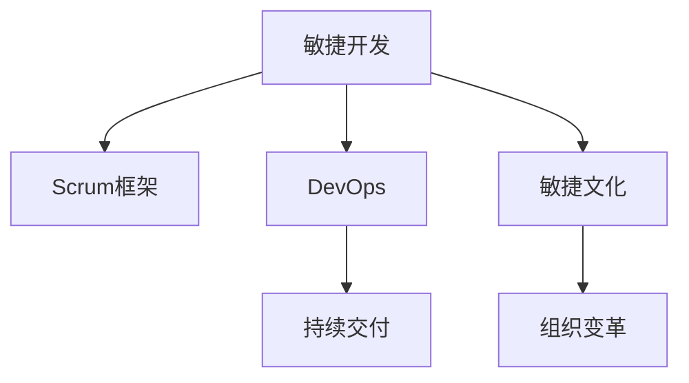

                 

# 敏捷管理：适应快速变化的市场环境

> 关键词：敏捷管理,Scrum框架,DevOps,持续交付,市场环境,敏捷文化,组织变革

## 1. 背景介绍

### 1.1 问题由来
在当今快速变化的商业环境中，企业需要快速响应市场需求，以保持竞争力。传统的瀑布式开发方法往往无法及时适应市场的快速变化，容易导致项目延期、成本超支等问题。敏捷管理方法，尤其是Scrum框架的提出，为解决这些问题提供了新的解决方案。

敏捷管理强调在需求变化频繁的情况下，通过迭代、增量开发、持续反馈等方式，快速响应市场变化，提高项目成功率和客户满意度。它已成为各行各业项目管理的首选方法之一。

### 1.2 问题核心关键点
敏捷管理的核心在于通过快速迭代和持续交付，实现项目的高效管理。其关键点包括：

- 迭代开发：将项目划分为多个短周期迭代，每个迭代周期内完成一定量的工作，逐步实现项目目标。
- 增量交付：每个迭代周期结束时交付可用的产品功能，通过不断积累，逐步完善产品。
- 客户反馈：定期与客户沟通，了解其需求变化，确保产品符合客户期望。
- 团队协作：组建跨职能团队，促进不同角色间的沟通协作，提高效率。

## 2. 核心概念与联系

### 2.1 核心概念概述

敏捷管理的核心概念包括以下几个方面：

- **敏捷开发(Agile Development)**：以用户需求为中心，通过迭代开发和持续反馈的方式，快速响应市场变化。
- **Scrum框架(Scrum Framework)**：一种敏捷开发框架，通过迭代周期(Sprint)和Scrum仪式(Sprint Ceremony)实现高效的团队协作和项目管理。
- **DevOps**：一种旨在优化软件开发和运维流程的方法，通过自动化和持续集成(CI)等方式，实现快速交付和反馈。
- **持续交付(Continuous Delivery)**：通过自动化和持续集成，将代码频繁发布到生产环境，确保高质量的交付速度。
- **敏捷文化(Agile Culture)**：一种鼓励团队合作、自我管理和持续改进的文化，以支持敏捷项目的成功实施。
- **组织变革(Organizational Change)**：通过改变组织结构和流程，适应敏捷管理的要求，提升企业的响应速度和创新能力。

这些概念之间相互关联，共同构成了敏捷管理的方法体系。通过理解这些核心概念，可以更好地把握敏捷管理的精髓和实践要点。

### 2.2 核心概念原理和架构的 Mermaid 流程图



## 3. 核心算法原理 & 具体操作步骤

### 3.1 算法原理概述

敏捷管理的核心在于通过迭代和增量交付，实现项目的快速响应和高效管理。其核心算法原理可以总结如下：

- **迭代周期(Sprint)**：将项目划分为若干个迭代周期，每个周期内完成一定量的工作，逐步实现项目目标。
- **Scrum仪式**：通过每日站会、Sprint评审和Sprint回顾等仪式，促进团队沟通协作，持续改进过程。
- **持续集成(CI)**：通过自动化测试和集成，实现快速交付和反馈，降低项目风险。
- **客户反馈**：通过定期的产品演示和客户沟通，了解客户需求变化，及时调整项目方向。

### 3.2 算法步骤详解

敏捷管理的具体操作步骤如下：

1. **需求分析和规划**：与客户沟通，明确项目需求和目标，制定初步计划。
2. **组建跨职能团队**：组建由开发、测试、产品、运营等不同角色组成的跨职能团队。
3. **划分迭代周期(Sprint)**：将项目划分为多个迭代周期，每个周期一般为2-4周。
4. **每日站会**：每天进行短会，讨论进展、问题和下一步工作，确保团队协作高效。
5. **Sprint评审**：每个Sprint结束时，向客户展示已完成的功能，获取反馈。
6. **Sprint回顾**：每个Sprint结束时，团队回顾整个过程，总结经验教训，进行持续改进。
7. **持续集成(CI)**：通过自动化测试和集成，实现代码的快速发布和反馈，降低项目风险。
8. **客户反馈**：定期与客户沟通，了解其需求变化，确保产品符合客户期望。

### 3.3 算法优缺点

敏捷管理的优点包括：

- **快速响应市场变化**：通过迭代和增量交付，快速适应市场需求，缩短项目周期。
- **提高团队协作效率**：通过Scrum仪式和每日站会，促进团队沟通协作，提高效率。
- **降低项目风险**：通过持续集成和客户反馈，及时发现和解决问题，降低项目风险。

缺点则包括：

- **对团队要求高**：需要组建跨职能团队，成员需具备较强的自我管理和团队协作能力。
- **需要定期调整计划**：在需求频繁变化的情况下，需要频繁调整计划，增加管理复杂度。
- **需要较长时间适应**：企业从传统管理方式转变为敏捷管理需要一定时间，初期适应难度较大。

### 3.4 算法应用领域

敏捷管理在各个领域都有广泛的应用，包括：

- **软件开发**：敏捷开发已成为软件开发的首选方法，通过Scrum框架实现高效的项目管理。
- **产品管理**：通过敏捷管理方法，快速响应市场需求，实现产品的快速迭代和优化。
- **市场营销**：通过敏捷方法，快速调整市场策略，提升市场响应速度。
- **项目管理**：敏捷管理方法适用于各种类型的项目管理，包括产品、工程、运营等。
- **组织管理**：通过引入敏捷文化，提升组织的创新能力和响应速度，促进企业转型升级。

## 4. 数学模型和公式 & 详细讲解 & 举例说明

### 4.1 数学模型构建

敏捷管理中常用的数学模型主要包括：

- **任务优先级(Priority)**：用于衡量任务的重要性和紧急性，优先处理高优先级任务。
- **迭代周期长度(Sprint Duration)**：用于衡量每个迭代周期的长度，一般为2-4周。
- **客户满意度(Customer Satisfaction)**：用于衡量客户对产品的满意程度，通常通过客户反馈问卷或满意度调查来获取。
- **团队效率(Team Efficiency)**：用于衡量团队完成任务的速度和质量，通常通过任务完成时间和代码质量来衡量。

### 4.2 公式推导过程

以任务优先级为例，其数学模型为：

$$
\text{优先级} = \text{权重} \times \text{紧急度} \times \text{重要性}
$$

其中权重、紧急度和重要性分别取值0-1之间，通过加权平均的方式计算任务优先级。

在敏捷管理中，通常采用WBS（工作分解结构）方法将项目分解为多个可管理的工作单元，每个工作单元赋以优先级和估算时间，通过加权平均的方式计算每个任务的优先级。

### 4.3 案例分析与讲解

某软件开发团队在项目初期采用瀑布式开发方法，但由于需求变化频繁，导致项目延期和成本超支。后来采用敏捷管理方法，通过划分迭代周期、每日站会和Sprint评审等方式，快速适应市场需求，缩短了项目周期，提高了客户满意度，降低了项目风险。

## 5. 项目实践：代码实例和详细解释说明

### 5.1 开发环境搭建

在进行敏捷管理项目实践前，我们需要准备好开发环境。以下是使用Scrum框架的JIRA进行敏捷管理配置的环境配置流程：

1. 安装JIRA：从官网下载并安装JIRA。
2. 创建项目：在JIRA中创建项目，设置项目名称、描述和项目类型。
3. 配置敏捷板：在项目设置中配置敏捷板，根据团队成员的角色和任务类型，划分不同的任务列。
4. 设置迭代周期：在敏捷板中设置迭代周期长度，一般为2-4周。
5. 添加任务：在敏捷板中添加任务，设置任务描述、优先级和负责人等属性。
6. 配置Scrum仪式：在JIRA中配置每日站会、Sprint评审和Sprint回顾等Scrum仪式。

### 5.2 源代码详细实现

下面以Scrum框架为例，给出使用JIRA进行敏捷管理的Python代码实现。

```python
from jira import JIRA
from jira import Issue

jira = JIRA('https://jira.example.com', username='user', password='pass')
project_key = 'PROJ-1'

def create_task(title, description, priority='High'):
    issue = jira.create_issue(project=project_key, summary=title, description=description, labels=['Backlog'], priority=priority)
    return issue.key

def update_task(task_key, status='In Progress', time_spent=8):
    issue = jira.issue(task_key)
    issue.update(fields={'status': status, 'time_spent': time_spent})

def close_task(task_key):
    issue = jira.issue(task_key)
    issue.update(fields={'status': 'Done'})

def move_task(task_key, column='Sprint'):
    issue = jira.issue(task_key)
    issue.update(fields={'status': {'value': column}})

def daily_standup():
    pass

def sprint_review():
    pass

def sprint_backlog():
    pass
```

### 5.3 代码解读与分析

让我们再详细解读一下关键代码的实现细节：

**create_task函数**：
- `jira.create_issue`方法：创建一个新的JIRA任务，指定项目、标题、描述、优先级和标签等属性。

**update_task函数**：
- `jira.issue`方法：获取指定任务的信息，并更新其状态和工时等属性。

**close_task函数**：
- `jira.issue`方法：获取指定任务的信息，并更新其状态为"Done"。

**move_task函数**：
- `jira.issue`方法：获取指定任务的信息，并更新其状态为指定的Sprint列。

**daily_standup函数**：
- 实际代码中需要实现每日站会的逻辑，通过JIRA获取当天的任务和状态信息，进行每日的汇报和任务安排。

**sprint_review函数**：
- 实际代码中需要实现Sprint评审的逻辑，通过JIRA获取Sprint中的任务信息，进行评审和反馈。

**sprint_backlog函数**：
- 实际代码中需要实现Sprint回顾的逻辑，通过JIRA获取Sprint中的任务信息，进行回顾和改进。

### 5.4 运行结果展示

在实际应用中，JIRA敏捷管理的运行结果可以通过以下方式展示：

1. **任务板(Burndown Chart)**：通过任务板展示每个任务的优先级和状态变化，帮助团队了解任务进度和优先级。
2. **任务状态图(Column Graph)**：通过任务状态图展示任务在Sprint中的状态变化，帮助团队了解任务完成情况。
3. **工时追踪(Time Tracking)**：通过工时追踪功能，记录每个任务的工作量，帮助团队评估效率和优化流程。
4. **迭代进度(Release Plan)**：通过迭代进度展示每个迭代周期的任务和目标，帮助团队规划和调整项目进度。

## 6. 实际应用场景

### 6.1 软件开发

敏捷管理在软件开发中的应用尤为广泛，通过Scrum框架实现高效的项目管理。在软件开发中，敏捷管理通过迭代和增量交付，快速响应市场需求，提高团队协作效率和客户满意度。

**实际应用案例**：某知名互联网公司采用敏捷管理方法开发新产品，通过每日站会、Sprint评审和Sprint回顾等方式，快速响应市场需求，缩短项目周期，提高了客户满意度。

### 6.2 产品管理

敏捷管理在产品管理中的应用，通过持续反馈和快速调整，实现产品的快速迭代和优化。产品团队定期与客户沟通，了解其需求变化，及时调整产品方向，确保产品符合市场需求。

**实际应用案例**：某大型电商平台采用敏捷管理方法管理新产品，通过每日站会、Sprint评审和Sprint回顾等方式，快速响应市场需求，缩短产品开发周期，提高了客户满意度和市场占有率。

### 6.3 市场营销

敏捷管理在市场营销中的应用，通过快速调整市场策略，提升市场响应速度和效率。市场营销团队定期与客户沟通，了解其需求变化，及时调整市场策略，提高市场响应速度和销售效果。

**实际应用案例**：某快消品企业采用敏捷管理方法管理市场推广活动，通过每日站会、Sprint评审和Sprint回顾等方式，快速响应市场需求，缩短市场推广周期，提高了市场响应速度和销售效果。

### 6.4 组织管理

敏捷管理在组织管理中的应用，通过引入敏捷文化，提升组织的创新能力和响应速度，促进企业转型升级。敏捷管理方法强调团队协作、自我管理和持续改进，帮助企业构建更加高效、灵活的组织结构。

**实际应用案例**：某大型制造企业采用敏捷管理方法进行组织转型，通过引入敏捷文化，提升组织的创新能力和响应速度，促进企业转型升级，提高了企业的市场竞争力和盈利能力。

## 7. 工具和资源推荐

### 7.1 学习资源推荐

为了帮助开发者系统掌握敏捷管理的理论基础和实践技巧，这里推荐一些优质的学习资源：

1. **《Scrum敏捷项目管理》系列书籍**：由Scrum认证培训师撰写，深入浅出地介绍了Scrum框架及其应用方法。
2. **Scrum.org官网**：提供Scrum认证培训和Scrum资源，帮助开发者掌握Scrum框架及其应用技巧。
3. **《敏捷开发：原则、模式与实践》书籍**：由敏捷大师Andy Hunt和David Thomas撰写，全面介绍了敏捷开发的原理和实践方法。
4. **Atlassian JIRA官方文档**：提供JIRA的详细文档和使用指南，帮助开发者掌握敏捷管理的工具使用技巧。
5. **Scrum指南(Scrum Guide)**：由Scrum官方发布，提供Scrum框架的详细指南和最佳实践，帮助开发者掌握Scrum框架及其应用方法。

通过对这些资源的学习实践，相信你一定能够快速掌握敏捷管理的精髓，并用于解决实际的项目管理问题。

### 7.2 开发工具推荐

高效的敏捷管理开发离不开优秀的工具支持。以下是几款用于敏捷管理开发的常用工具：

1. **JIRA**：Atlassian公司开发的敏捷管理工具，提供任务管理、工时追踪、迭代计划等功能，是敏捷管理的必备工具。
2. **Confluence**：Atlassian公司开发的文档管理工具，提供团队协作、知识共享、文档管理等功能，帮助团队高效协作。
3. **Trello**：一家开发任务管理工具，通过看板式的界面，帮助团队可视化任务状态和进展。
4. **Microsoft Project**：Microsoft公司开发的项目管理工具，提供计划、资源管理、任务跟踪等功能，适合大型企业使用。
5. **Asana**：一家团队协作工具，提供任务管理、项目管理、日程安排等功能，帮助团队高效协作。
6. **Google Docs**：Google公司开发的文档协作工具，提供实时协作、版本控制、权限管理等功能，方便团队文档共享。

合理利用这些工具，可以显著提升敏捷管理的开发效率，加快创新迭代的步伐。

### 7.3 相关论文推荐

敏捷管理的发展源于学界的持续研究。以下是几篇奠基性的相关论文，推荐阅读：

1. **《敏捷宣言》(Agile Manifesto)**：由17位软件开发专家发表的宣言，明确了敏捷管理的核心价值观和方法论。
2. **《Scrum：从敏捷到精益到精益敏捷》(Scrum: From Agile to Lean to Lean Agile)**：由Ken Schwaber撰写，介绍了Scrum框架及其应用方法。
3. **《敏捷开发：原则、模式与实践》(The Pragmatic Programmer)**：由Andy Hunt和David Thomas撰写，全面介绍了敏捷开发的原理和实践方法。
4. **《敏捷转型：从瀑布到敏捷》(Agile Transformation: From Waterfall to Agile)**：由Scrum专家Joel Bland撰写，介绍了敏捷转型的最佳实践和方法。
5. **《Scrum指南》(The Scrum Guide)**：由Scrum官方发布，提供Scrum框架的详细指南和最佳实践，帮助开发者掌握Scrum框架及其应用方法。

这些论文代表了大敏捷管理的发展脉络。通过学习这些前沿成果，可以帮助研究者把握学科前进方向，激发更多的创新灵感。

## 8. 总结：未来发展趋势与挑战

### 8.1 研究成果总结

敏捷管理自诞生以来，经过多年的发展，已经成为各行各业项目管理的首选方法之一。敏捷管理的核心在于通过迭代和增量交付，实现项目的快速响应和高效管理。敏捷管理在软件开发、产品管理、市场营销、组织管理等领域都有广泛应用，取得了显著成效。

### 8.2 未来发展趋势

展望未来，敏捷管理将呈现以下几个发展趋势：

1. **全敏捷管理(Agile Across the Enterprise)**：敏捷管理将从项目层面延伸到企业层面，实现全敏捷管理，提升企业的创新能力和市场响应速度。
2. **敏捷开发与DevOps融合**：敏捷开发与DevOps的融合将进一步提升软件的交付速度和质量，实现持续交付和持续反馈。
3. **跨职能团队(Cross-functional Teams)**：敏捷管理将进一步强调跨职能团队的协作，提升团队协作效率和项目成功率。
4. **自动化和智能化(Automation and AI)**：自动化和智能化技术将进一步提升敏捷管理的效率和质量，实现智能化的敏捷管理。
5. **持续改进和优化(Continuous Improvement and Optimization)**：敏捷管理将进一步强调持续改进和优化，提升团队和企业的敏捷能力。

### 8.3 面临的挑战

尽管敏捷管理已经取得了显著成效，但在迈向更加智能化、普适化应用的过程中，仍面临诸多挑战：

1. **团队协作难度**：敏捷管理对团队协作能力要求较高，需要组建跨职能团队，成员需具备较强的自我管理和团队协作能力。
2. **管理复杂度**：在需求频繁变化的情况下，需要频繁调整计划，增加管理复杂度。
3. **适应难度**：企业从传统管理方式转变为敏捷管理需要一定时间，初期适应难度较大。

### 8.4 研究展望

面对敏捷管理面临的挑战，未来的研究需要在以下几个方面寻求新的突破：

1. **引入AI和大数据**：通过引入AI和大数据技术，优化敏捷管理的决策过程，提升团队协作效率和项目成功率。
2. **优化流程和工具**：通过优化敏捷管理的流程和工具，进一步提升敏捷管理的效率和质量。
3. **增强团队能力**：通过培训和引导，增强团队成员的敏捷管理能力，提升团队的敏捷能力和响应速度。

总之，敏捷管理方法需要在实践中不断优化和改进，才能更好地适应快速变化的市场环境。只有在技术、流程、团队、文化等多个维度协同发力，才能真正实现敏捷管理的长期成功。

## 9. 附录：常见问题与解答

**Q1：敏捷管理是否适用于所有项目？**

A: 敏捷管理适用于需求变化频繁、市场环境快速变化的项目。但对于一些规模较小、需求稳定的项目，瀑布式开发方法可能更加适合。

**Q2：敏捷管理对团队有哪些要求？**

A: 敏捷管理对团队协作能力要求较高，需要组建跨职能团队，成员需具备较强的自我管理和团队协作能力。

**Q3：敏捷管理与瀑布式开发的区别是什么？**

A: 敏捷管理强调迭代和增量交付，快速响应市场需求；瀑布式开发则强调线性开发流程，逐步完成需求分析、设计、编码、测试等各个阶段。

**Q4：敏捷管理如何处理需求变更？**

A: 敏捷管理通过每日站会和Sprint评审等方式，及时反馈需求变更，灵活调整计划，确保项目顺利进行。

**Q5：敏捷管理如何实现持续交付？**

A: 敏捷管理通过持续集成和持续部署，实现代码的频繁发布和反馈，降低项目风险，提高交付速度。

---

作者：禅与计算机程序设计艺术 / Zen and the Art of Computer Programming

