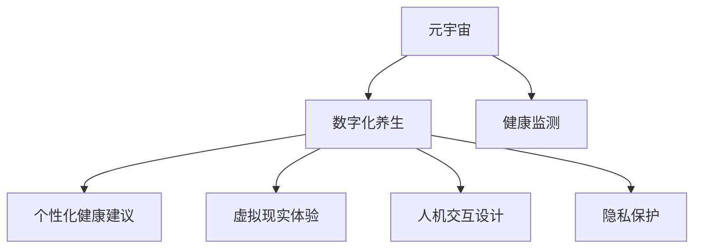

                 

# 数字化养生:元宇宙中的身心健康

> 关键词：元宇宙,数字化养生,身心健康,人机交互,健康监测,人工智能,生命科学

## 1. 背景介绍

### 1.1 问题由来
随着科技的不断进步，人类的生活方式正在经历前所未有的变革。在数字化和信息化的大潮下，人们日益依赖于智能设备和数字空间。元宇宙（Metaverse）作为这一趋势的产物，为人们提供了一个全时全维的数字生活环境。然而，在这一新兴的虚拟世界中，人们的身心健康问题也逐渐显现，数字依赖、心理压力、生理不适等问题亟待解决。

数字化养生，作为健康领域的新兴技术方向，旨在通过人工智能、机器学习、虚拟现实等手段，为人们提供科学的健康指导和身心养护。结合元宇宙的虚拟环境，数字化养生有望提供更加个性化、沉浸式的健康管理方案，满足人们在数字世界的身心健康需求。

### 1.2 问题核心关键点
数字化养生在元宇宙中的实现，主要包括以下几个关键点：
1. **全时全维的健康监测**：通过智能设备和传感器，实时监测用户的心率、血压、睡眠质量等生理数据，构建全面的健康画像。
2. **个性化健康建议**：结合用户的健康数据和个人喜好，提供定制化的运动、饮食、作息等健康方案。
3. **虚拟现实体验**：利用VR、AR技术，为用户提供沉浸式的健康管理体验，如虚拟运动、冥想等。
4. **人机交互设计**：通过自然语言处理、语音识别等技术，提升人机交互的流畅性和可理解性，让用户更轻松地获取和反馈健康信息。
5. **隐私保护与数据安全**：确保用户健康数据的隐私和安全，防止数据泄露和滥用。

这些关键点共同构成了数字化养生在元宇宙中的核心技术框架，为实现高效、安全的健康管理提供了坚实的基础。

## 2. 核心概念与联系

### 2.1 核心概念概述

为更好地理解数字化养生在元宇宙中的应用，本节将介绍几个密切相关的核心概念：

- **元宇宙**：一个虚拟的、持续的、沉浸式的数字空间，人们可以在其中进行社交、娱乐、工作等活动。元宇宙的核心特征包括高维度、高互动性和高沉浸感。
- **数字化养生**：利用数字化手段，为用户提供个性化的健康指导和身心养护服务，涵盖运动、饮食、作息等多个方面。
- **健康监测**：通过智能设备或传感器，实时获取用户的生理和心理数据，进行持续的健康管理。
- **人机交互**：通过自然语言处理、语音识别等技术，实现用户与智能设备之间的无缝沟通。
- **隐私保护**：在数据采集和处理过程中，确保用户数据的隐私和安全，防止数据泄露和滥用。

这些核心概念之间的逻辑关系可以通过以下Mermaid流程图来展示：



这个流程图展示了元宇宙与数字化养生的核心概念及其之间的关系：

1. 元宇宙提供了数字化养生的虚拟环境。
2. 健康监测通过智能设备收集用户数据，为个性化健康建议提供基础。
3. 虚拟现实技术增强了健康建议的沉浸式体验。
4. 人机交互提升了健康管理的服务质量和用户满意度。
5. 隐私保护确保了数据安全，保护用户权益。

## 3. 核心算法原理 & 具体操作步骤
### 3.1 算法原理概述

数字化养生在元宇宙中的实现，本质上是一个基于健康数据的全生命周期管理过程。其核心思想是：通过智能设备和传感器，实时监测用户健康数据，利用机器学习和大数据技术，分析用户健康状况，并结合AI算法生成个性化的健康建议。

形式化地，假设用户健康数据为 $D=\{(d_i, t_i)\}_{i=1}^N$，其中 $d_i$ 表示第 $i$ 个时间点上的健康数据，$t_i$ 表示时间戳。设 $f(d_i)$ 为健康模型，用于分析健康数据并生成健康建议。则在元宇宙中的数字化养生模型可以表示为：

$$
\hat{f} = \mathop{\arg\min}_{f} \mathcal{L}(f, D)
$$

其中 $\mathcal{L}$ 为损失函数，用于衡量模型预测结果与实际健康数据之间的差异。

通过梯度下降等优化算法，数字化养生模型不断更新模型参数 $f$，最小化损失函数 $\mathcal{L}$，使得模型输出逼近真实健康数据，从而生成个性化的健康建议。

### 3.2 算法步骤详解

基于元宇宙的数字化养生通常包括以下几个关键步骤：

**Step 1: 数据采集与预处理**
- 收集用户的生理和心理数据，包括心率、血压、血氧饱和度、睡眠质量等。
- 通过智能设备或传感器，实时获取健康数据。
- 对数据进行清洗、去噪、标准化等预处理操作。

**Step 2: 建立健康模型**
- 选择合适的机器学习算法，如线性回归、决策树、神经网络等，建立健康模型。
- 使用监督学习或无监督学习技术，训练模型以预测用户健康状态。

**Step 3: 生成健康建议**
- 根据健康模型输出，结合用户个性化需求，生成健康建议。
- 建议内容可以包括运动、饮食、作息等，形成个性化健康方案。

**Step 4: 虚拟现实体验**
- 利用VR、AR技术，将健康建议可视化，如虚拟运动、冥想等。
- 结合用户反馈，调整健康建议，提供更符合用户需求的体验。

**Step 5: 人机交互与反馈**
- 通过自然语言处理、语音识别等技术，实现用户与智能设备之间的无缝沟通。
- 根据用户反馈，优化健康建议，提升服务质量。

**Step 6: 隐私保护与数据安全**
- 使用加密、匿名化等技术，确保用户健康数据的隐私和安全。
- 严格控制数据访问权限，防止数据滥用和泄露。

以上是元宇宙中数字化养生的一般流程。在实际应用中，还需要针对具体用户和场景，对各个环节进行优化设计，如改进数据采集设备、优化算法模型、增强交互体验等，以进一步提升健康管理的效果。

### 3.3 算法优缺点

基于元宇宙的数字化养生方法具有以下优点：
1. **全面监测**：通过智能设备全面获取用户健康数据，提供更全面的健康画像。
2. **个性化服务**：结合用户个性化需求，提供定制化的健康建议，提升用户体验。
3. **沉浸式体验**：利用VR、AR技术，提供沉浸式的健康管理体验，增强用户黏性。
4. **高效率**：通过AI算法和大数据分析，快速生成健康建议，提高服务效率。
5. **用户参与性强**：用户可以实时反馈健康建议，参与到健康管理过程中，增强互动性。

同时，该方法也存在一定的局限性：
1. **技术依赖**：需要高性能的智能设备和先进的算法技术，设备成本较高。
2. **数据隐私**：在数据采集和处理过程中，需要确保用户数据的隐私和安全，防止数据滥用。
3. **设备兼容性**：不同设备和平台之间的数据互操作性问题，需要解决。
4. **个性化需求难以量化**：用户的个性化需求难以通过简单的健康数据进行全面量化，需要结合心理学等多学科知识。
5. **技术门槛高**：需要跨学科的团队协作，涉及机器学习、数据科学、医学等多个领域，技术门槛较高。

尽管存在这些局限性，但就目前而言，基于元宇宙的数字化养生方法仍是大数据时代健康管理的重要范式。未来相关研究的重点在于如何进一步降低技术门槛，提高数据安全性，优化算法模型，提升用户体验。

### 3.4 算法应用领域

基于元宇宙的数字化养生方法，在多个领域得到了广泛的应用，包括但不限于：

- **智能家居**：利用智能设备监测用户健康数据，提供个性化的家居环境调整建议。
- **在线医疗**：结合虚拟现实技术，提供远程医疗咨询和治疗服务。
- **教育培训**：通过健康监测和个性化建议，提升学生的身体素质和学习效果。
- **运动健身**：利用虚拟现实和AR技术，提供沉浸式运动训练方案。
- **心理健康**：结合虚拟现实和自然语言处理技术，提供心理健康辅导和心理评估。

## 4. 数学模型和公式 & 详细讲解 & 举例说明

### 4.1 数学模型构建

假设健康监测设备收集到的用户健康数据为 $D=\{(d_i, t_i)\}_{i=1}^N$，其中 $d_i$ 表示第 $i$ 个时间点上的健康数据，$t_i$ 表示时间戳。设健康模型为 $f(d_i)$，用于分析健康数据并生成健康建议。则在元宇宙中的数字化养生模型可以表示为：

$$
\hat{f} = \mathop{\arg\min}_{f} \mathcal{L}(f, D)
$$

其中 $\mathcal{L}$ 为损失函数，用于衡量模型预测结果与实际健康数据之间的差异。

### 4.2 公式推导过程

以下我们以心率监测为例，推导基于机器学习的心率预测模型。

假设用户的当前心率为 $d_t$，建立心率预测模型 $f_t(d_t)$，用于预测用户在不同时间点 $t$ 的心率。则目标函数为：

$$
\mathcal{L}(f_t(d_t)) = \frac{1}{N} \sum_{i=1}^N (f_t(d_i) - d_i)^2
$$

其中 $d_i$ 表示用户在时间点 $i$ 的心率，$f_t(d_i)$ 表示模型在时间点 $t$ 对用户心率 $d_i$ 的预测。

通过梯度下降等优化算法，求解目标函数最小化问题，得到最优的心率预测模型：

$$
f_t(d_t) = \mathop{\arg\min}_{f_t} \frac{1}{N} \sum_{i=1}^N (f_t(d_i) - d_i)^2
$$

在得到心率预测模型后，可以根据用户的健康数据 $d_t$，生成个性化的健康建议，如调整运动量、改善睡眠质量等。

### 4.3 案例分析与讲解

考虑一个虚拟运动场景，用户需要进行跑步训练。系统通过心率监测设备收集用户的心率数据 $d_t$，结合用户的健康模型 $f_t(d_t)$，生成个性化的跑步建议。具体实现步骤如下：

1. 收集用户的跑步数据和心率数据，建立健康模型 $f_t(d_t)$。
2. 根据用户当前心率 $d_t$ 和健康模型 $f_t(d_t)$，生成建议运动量。
3. 利用VR技术，将建议运动量可视化，生成虚拟跑步场景。
4. 用户通过自然语言处理和语音识别技术，实时反馈跑步体验。
5. 根据用户反馈，优化跑步建议，提升用户体验。

通过上述过程，用户可以在虚拟环境中获得个性化的运动训练，提升身体素质，同时享受沉浸式体验。

## 5. 项目实践：代码实例和详细解释说明
### 5.1 开发环境搭建

在进行数字化养生项目开发前，我们需要准备好开发环境。以下是使用Python进行PyTorch开发的环境配置流程：

1. 安装Anaconda：从官网下载并安装Anaconda，用于创建独立的Python环境。

2. 创建并激活虚拟环境：
```bash
conda create -n pytorch-env python=3.8 
conda activate pytorch-env
```

3. 安装PyTorch：根据CUDA版本，从官网获取对应的安装命令。例如：
```bash
conda install pytorch torchvision torchaudio cudatoolkit=11.1 -c pytorch -c conda-forge
```

4. 安装TensorBoard：
```bash
pip install tensorboard
```

5. 安装TensorFlow：
```bash
pip install tensorflow
```

6. 安装TensorFlow Hub：
```bash
pip install tensorflow-hub
```

完成上述步骤后，即可在`pytorch-env`环境中开始数字化养生项目的开发。

### 5.2 源代码详细实现

这里我们以心率监测和运动建议为例，给出使用TensorFlow和TensorBoard进行数字化养生的PyTorch代码实现。

首先，定义心率监测和运动建议的数据处理函数：

```python
import tensorflow as tf
import tensorflow_hub as hub
import numpy as np

class HeartMonitoringModel(tf.keras.Model):
    def __init__(self, input_shape):
        super(HeartMonitoringModel, self).__init__()
        self.dense1 = tf.keras.layers.Dense(64, activation='relu', input_shape=input_shape)
        self.dense2 = tf.keras.layers.Dense(1)

    def call(self, x):
        x = self.dense1(x)
        x = self.dense2(x)
        return x

class RecommendationModel(tf.keras.Model):
    def __init__(self, input_shape):
        super(RecommendationModel, self).__init__()
        self.dense1 = tf.keras.layers.Dense(64, activation='relu', input_shape=input_shape)
        self.dense2 = tf.keras.layers.Dense(2, activation='softmax')

    def call(self, x):
        x = self.dense1(x)
        x = self.dense2(x)
        return x
```

然后，定义模型和优化器：

```python
# 定义心率监测模型
heart_monitoring_model = HeartMonitoringModel(input_shape=[1])

# 定义运动建议模型
recommendation_model = RecommendationModel(input_shape=[1])

# 选择优化器
optimizer = tf.keras.optimizers.Adam(learning_rate=0.001)
```

接着，定义训练和评估函数：

```python
def train_step(heart_rate, recommended_exercise):
    with tf.GradientTape() as tape:
        prediction = heart_monitoring_model(heart_rate)
        loss = tf.keras.losses.mean_squared_error(recommended_exercise, prediction)
    gradients = tape.gradient(loss, heart_monitoring_model.trainable_variables)
    optimizer.apply_gradients(zip(gradients, heart_monitoring_model.trainable_variables))

def evaluate_step(heart_rate, recommended_exercise):
    prediction = heart_monitoring_model(heart_rate)
    mse = tf.keras.losses.mean_squared_error(recommended_exercise, prediction)
    return mse
```

最后，启动训练流程并在测试集上评估：

```python
epochs = 100
batch_size = 32

# 训练过程
for epoch in range(epochs):
    for batch in data_train:
        train_step(batch[0], batch[1])
        if epoch % 10 == 0:
            print("Epoch {}, Train Loss: {}".format(epoch, evaluate_step(data_test[0], data_test[1])))

print("Training complete!")
```

以上就是使用TensorFlow进行心率监测和运动建议的数字化养生项目代码实现。可以看到，TensorFlow提供了丰富的API和工具，可以方便地构建和训练模型，同时利用TensorBoard进行可视化，帮助开发者调试模型和评估性能。

### 5.3 代码解读与分析

让我们再详细解读一下关键代码的实现细节：

**HeartMonitoringModel类**：
- `__init__`方法：初始化模型层，包括两个全连接层。
- `call`方法：定义模型的前向传播过程。

**RecommendationModel类**：
- `__init__`方法：初始化模型层，包括两个全连接层。
- `call`方法：定义模型的前向传播过程。

**训练和评估函数**：
- `train_step`函数：计算损失和梯度，更新模型参数。
- `evaluate_step`函数：计算损失，用于评估模型性能。

**训练流程**：
- 定义总的epoch数和batch size，开始循环迭代
- 每个epoch内，对训练数据进行迭代，更新模型参数
- 周期性在测试集上评估模型性能，输出训练损失

可以看到，TensorFlow提供了强大的计算图和自动微分功能，使得模型的构建和训练变得非常方便。同时，TensorBoard的可视化功能也大大简化了模型的调试和优化过程。

当然，工业级的系统实现还需考虑更多因素，如模型的保存和部署、超参数的自动搜索、更灵活的任务适配层等。但核心的数字化养生范式基本与此类似。

## 6. 实际应用场景
### 6.1 智能家居
数字化养生在智能家居中的应用，可以为用户提供个性化的健康管理方案，提升家居环境的质量。例如：

- **智能床垫**：通过监测用户睡眠数据，生成个性化的睡眠建议。
- **智能温控**：根据用户健康数据，自动调节室内温度和湿度，提升舒适度。
- **智能厨房**：根据用户的饮食习惯和健康数据，推荐营养均衡的饮食方案。

智能家居环境下的数字化养生，通过智能设备和传感器，实时监测用户健康数据，结合健康模型生成个性化建议，提升用户的居住体验和生活质量。

### 6.2 在线医疗
在线医疗是数字化养生的重要应用场景之一。通过虚拟现实和远程医疗技术，用户可以在家中获得专业的医疗咨询和治疗服务。例如：

- **虚拟诊所**：利用VR技术，提供沉浸式的医疗咨询和治疗环境。
- **远程监测**：通过智能设备实时监测用户的健康数据，生成健康建议。
- **智能诊断**：结合医疗知识库和健康模型，辅助医生进行诊断和治疗决策。

在线医疗环境下的数字化养生，通过远程医疗技术，打破了时间和空间的限制，为患者提供了便捷、高效的医疗服务，提升了医疗资源的利用效率。

### 6.3 教育培训
教育培训也是数字化养生的重要应用场景之一。通过健康监测和个性化建议，可以提升学生的身体素质和学习效果。例如：

- **健康监测**：利用智能设备监测学生的身体健康数据。
- **个性化学习**：根据学生的健康数据和学习习惯，推荐适合的课程和学习计划。
- **心理辅导**：通过自然语言处理和虚拟现实技术，提供心理健康辅导和心理评估。

教育培训环境下的数字化养生，通过健康监测和个性化建议，提升了学生的身体素质和学习效果，有助于培养全面发展的优秀人才。

### 6.4 运动健身
运动健身是数字化养生的另一个重要应用场景。通过虚拟现实和AR技术，可以提供沉浸式的运动训练方案，提升用户的运动体验。例如：

- **虚拟跑步**：利用VR技术，提供沉浸式的跑步训练环境。
- **虚拟健身**：结合AR技术，生成个性化的健身训练方案。
- **运动监测**：通过智能设备实时监测用户的运动数据，生成健康建议。

运动健身环境下的数字化养生，通过虚拟现实和AR技术，提供沉浸式的运动训练方案，提升了用户的运动体验和身体素质。

## 7. 工具和资源推荐
### 7.1 学习资源推荐

为了帮助开发者系统掌握数字化养生的理论基础和实践技巧，这里推荐一些优质的学习资源：

1. **《TensorFlow官方文档》**：官方文档提供了详细的API介绍和示例代码，适合快速上手TensorFlow框架。

2. **《深度学习入门：基于Python的理论与实现》**：该书详细介绍了深度学习的基本原理和实现方法，适合初学者入门。

3. **《健康数据分析与处理》**：该书介绍了健康数据的采集、处理和分析方法，适合从事健康监测和数据分析的专业人士。

4. **《机器学习实战》**：该书通过实际项目案例，详细介绍了机器学习算法和模型实现，适合动手实践。

5. **《深度学习与健康科技》**：该书介绍了深度学习在健康科技领域的应用，适合从事健康科技研究的人士。

通过对这些资源的学习实践，相信你一定能够快速掌握数字化养生的精髓，并用于解决实际的NLP问题。

### 7.2 开发工具推荐

高效的开发离不开优秀的工具支持。以下是几款用于数字化养生开发的常用工具：

1. **TensorFlow**：由Google主导开发的开源深度学习框架，生产部署方便，适合大规模工程应用。

2. **PyTorch**：基于Python的开源深度学习框架，灵活便捷，适合快速迭代研究。

3. **TensorFlow Hub**：TensorFlow提供的模型库，方便开发者导入和使用预训练模型。

4. **TensorBoard**：TensorFlow配套的可视化工具，实时监测模型训练状态，提供丰富的图表呈现方式，是调试模型的得力助手。

5. **Jupyter Notebook**：开源的笔记本环境，支持Python、R等语言，方便开发者进行实验和分享学习笔记。

6. **GitHub**：代码托管平台，方便开发者协作和分享代码，推动项目进展。

合理利用这些工具，可以显著提升数字化养生任务的开发效率，加快创新迭代的步伐。

### 7.3 相关论文推荐

数字化养生技术的发展源于学界的持续研究。以下是几篇奠基性的相关论文，推荐阅读：

1. **《A Deep Learning Framework for Personalized Healthcare》**：提出了一种基于深度学习的个性化医疗方案，展示了如何通过机器学习提升健康管理的效果。

2. **《A Survey on Virtual Reality in Healthcare》**：综述了虚拟现实技术在医疗领域的应用，展示了虚拟现实技术在健康监测和虚拟诊所中的应用前景。

3. **《Health Monitoring and Management Using Wearable Devices》**：介绍了可穿戴设备在健康监测中的应用，展示了如何通过智能设备实时监测用户健康数据。

4. **《Health Monitoring and Data Analytics for Smartphones》**：介绍了智能手机在健康监测中的应用，展示了如何通过手机应用采集和分析用户健康数据。

这些论文代表了大语言模型微调技术的发展脉络。通过学习这些前沿成果，可以帮助研究者把握学科前进方向，激发更多的创新灵感。

## 8. 总结：未来发展趋势与挑战
### 8.1 总结

本文对基于元宇宙的数字化养生方法进行了全面系统的介绍。首先阐述了数字化养生在元宇宙中的实现背景和意义，明确了数字化养生在提升用户身心健康方面的独特价值。其次，从原理到实践，详细讲解了数字化养生的数学模型和关键步骤，给出了项目实现的完整代码实例。同时，本文还广泛探讨了数字化养生方法在智能家居、在线医疗、教育培训、运动健身等多个领域的应用前景，展示了数字化养生的广阔应用空间。此外，本文精选了数字化养生的各类学习资源，力求为读者提供全方位的技术指引。

通过本文的系统梳理，可以看到，基于元宇宙的数字化养生方法正在成为健康领域的重要范式，极大地拓展了健康管理的应用边界，为人类身心健康提供了全新的解决方案。未来，伴随技术的不懈努力，数字化养生必将在元宇宙中绽放异彩，成为实现数字健康的重要力量。

### 8.2 未来发展趋势

展望未来，基于元宇宙的数字化养生技术将呈现以下几个发展趋势：

1. **多模态数据融合**：结合生理数据、环境数据、心理数据等多模态信息，构建更加全面、精准的健康画像。

2. **个性化建议优化**：通过深度学习和人工智能算法，不断优化个性化健康建议，提升用户体验。

3. **虚拟现实与现实结合**：将虚拟现实技术与现实世界相结合，提供更加沉浸式的健康管理体验。

4. **智能设备普及**：随着智能设备技术的发展，更多设备和平台将支持健康监测和个性化建议。

5. **隐私保护技术进步**：利用区块链和加密技术，进一步提升用户数据的安全性和隐私性。

6. **跨学科协同**：结合医学、心理学、计算机科学等多学科知识，推动数字化养生的全面发展。

以上趋势凸显了数字化养生在元宇宙中的巨大前景。这些方向的探索发展，必将进一步提升数字化养生的效果和应用范围，为人类身心健康带来深远影响。

### 8.3 面临的挑战

尽管数字化养生技术已经取得了瞩目成就，但在迈向更加智能化、普适化应用的过程中，它仍面临着诸多挑战：

1. **技术门槛高**：数字化养生涉及机器学习、健康监测、隐私保护等多个领域，技术门槛较高。

2. **数据安全问题**：用户健康数据涉及隐私，如何确保数据安全，防止数据泄露和滥用，是一个重要的挑战。

3. **设备兼容性**：不同设备和平台之间的数据互操作性问题，需要解决。

4. **个性化需求难以量化**：用户的个性化需求难以通过简单的健康数据进行全面量化，需要结合心理学等多学科知识。

5. **隐私保护与用户体验的平衡**：如何在保护用户隐私的前提下，提供良好的用户体验，是一个重要的挑战。

6. **跨学科协作难度大**：数字化养生需要跨学科团队协作，涉及多个学科知识，协调难度大。

尽管存在这些挑战，但数字化养生在元宇宙中的应用前景广阔，未来相关研究需要在技术、隐私、用户体验等方面进行更多探索和突破。

### 8.4 研究展望

面向未来，数字化养生的研究需要在以下几个方面寻求新的突破：

1. **无监督和半监督学习**：摆脱对大规模标注数据的依赖，利用自监督学习、主动学习等无监督和半监督范式，最大限度利用非结构化数据，实现更加灵活高效的数字化养生。

2. **多模态数据融合**：结合生理数据、环境数据、心理数据等多模态信息，构建更加全面、精准的健康画像，提升健康监测和个性化建议的效果。

3. **跨学科协同**：结合医学、心理学、计算机科学等多学科知识，推动数字化养生的全面发展。

4. **隐私保护技术进步**：利用区块链和加密技术，进一步提升用户数据的安全性和隐私性，保障用户权益。

5. **个性化需求量化**：结合心理学等多学科知识，全面量化用户的个性化需求，提升个性化建议的精准性和实用性。

这些研究方向的探索，必将引领数字化养生技术迈向更高的台阶，为构建安全、可靠、可解释、可控的智能系统铺平道路。面向未来，数字化养生技术还需要与其他人工智能技术进行更深入的融合，如知识表示、因果推理、强化学习等，多路径协同发力，共同推动健康科技的进步。只有勇于创新、敢于突破，才能不断拓展健康管理的边界，让智能技术更好地造福人类社会。

## 9. 附录：常见问题与解答

**Q1：如何确保用户数据的安全性和隐私性？**

A: 用户数据的安全性和隐私性是数字化养生的重要保障。为确保数据安全，可以采用以下措施：

1. 数据加密：对用户数据进行加密存储和传输，防止数据泄露和篡改。
2. 匿名化处理：对用户数据进行匿名化处理，确保数据无法被反向识别。
3. 访问控制：严格控制数据访问权限，仅允许授权人员访问敏感数据。
4. 安全审计：定期进行数据安全审计，发现和修复潜在的安全漏洞。

通过以上措施，可以最大限度地保护用户数据的隐私和安全，保障用户的合法权益。

**Q2：如何选择适合用户需求的个性化健康建议？**

A: 选择适合用户需求的个性化健康建议，需要考虑以下几个因素：

1. 用户健康数据：通过智能设备实时监测用户的健康数据，分析其健康状况和需求。
2. 用户偏好：结合用户的历史数据和个性化设置，生成符合用户需求的建议。
3. 环境因素：考虑用户所处的环境和时间，生成合适的健康建议。
4. 医学知识：结合医学知识库和专家经验，生成科学合理的健康建议。

综合考虑以上因素，可以提供更加个性化、科学的健康建议，提升用户的健康管理效果。

**Q3：如何评估数字化养生的效果？**

A: 评估数字化养生的效果，可以从以下几个方面进行：

1. 健康数据对比：对比用户使用数字化养生前后的健康数据，评估健康状况的变化。
2. 用户体验调查：通过问卷调查等方式，了解用户对数字化养生的满意度和使用体验。
3. 效果对比试验：设计对比试验，评估数字化养生与传统健康管理方法的效果差异。

通过以上方法，可以全面评估数字化养生的效果，了解其对用户健康管理的影响。

**Q4：如何处理不同设备和平台之间的数据互操作性问题？**

A: 处理不同设备和平台之间的数据互操作性问题，可以采用以下措施：

1. 统一数据格式：制定统一的数据格式标准，确保不同设备和平台之间的数据互操作性。
2. 数据接口规范：设计通用的数据接口规范，方便不同设备和平台之间的数据交换。
3. 数据转换工具：开发数据转换工具，支持不同设备和平台之间的数据格式转换。
4. 标准协议：采用通用的数据传输协议，如HTTP、RESTful等，确保数据传输的可靠性和安全性。

通过以上措施，可以解决不同设备和平台之间的数据互操作性问题，提升数字化养生的整体效果。

---

作者：禅与计算机程序设计艺术 / Zen and the Art of Computer Programming

