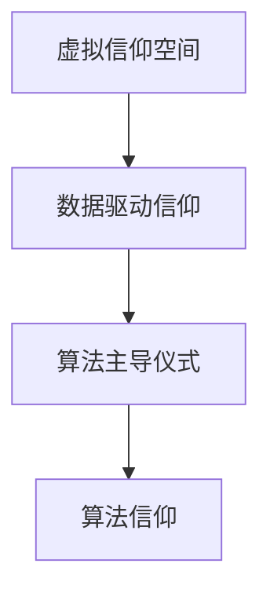
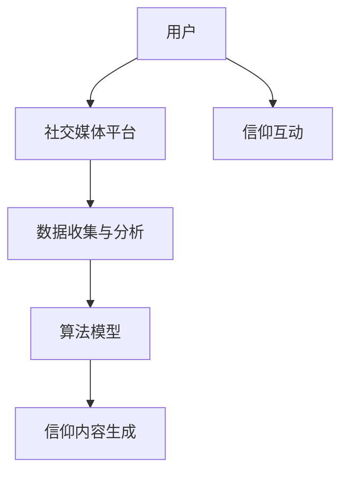

                 

# 数字化宗教：全球脑时代的信仰演变

在数字时代，互联网和人工智能技术的飞速发展，改变了我们的生活方式，同时也深刻影响了我们的信仰和价值观。这种转变可以被称为“数字化宗教”，它体现了人们信仰和实践的新形式，与传统的宗教信仰相比，有着独特的特征和影响。本文将探讨数字化宗教的核心概念、算法原理、操作步骤以及未来发展趋势，以期为理解这一现象提供新的视角。

## 1. 背景介绍

### 1.1 问题由来
随着数字技术的普及，人们越来越多地依赖网络进行交流、学习和工作。这种虚拟化的生活模式，逐渐形成了一种新的宗教信仰形式——数字化宗教。它基于网络、算法和数据，而不是传统宗教中的神和仪式，但却有着相似的信徒和信仰功能。这种信仰演变，是科技与人类文化、宗教信仰交织的结果，为社会带来了新的挑战和机遇。

### 1.2 问题核心关键点
数字化宗教的核心在于其对传统宗教的颠覆性重塑。它通过虚拟空间和算法，构建了一种新的信仰体系。这种信仰体系强调数据、算法和互联网，而不是传统的神、仪式和教义。数字化宗教的关键点包括：
- 虚拟信仰空间：通过网络平台和社交媒体，人们能够在线上进行信仰交流和实践。
- 数据驱动信仰：信仰内容和实践方式，受到数据和算法的影响。
- 算法主导仪式：算法成为新的“仪式”，数据输入和算法输出的过程，取代了传统宗教的仪式。

### 1.3 问题研究意义
研究数字化宗教的意义在于：
1. 揭示数字时代信仰的新形态，为理解人类信仰演变提供新的视角。
2. 探索算法和数据对信仰实践的影响，为设计更符合人类需求的数字产品提供理论依据。
3. 评估数字化宗教对社会文化的影响，为制定数字时代宗教政策提供参考。

## 2. 核心概念与联系

### 2.1 核心概念概述

数字化宗教基于网络、数据和算法，是数字技术与信仰交织的产物。其核心概念包括：

- **虚拟信仰空间**：通过互联网和社交媒体，人们能够在虚拟空间中进行信仰交流和实践。
- **数据驱动信仰**：信仰内容和实践方式，受到数据和算法的影响。
- **算法主导仪式**：算法成为新的“仪式”，数据输入和算法输出的过程，取代了传统宗教的仪式。
- **算法信仰**：基于算法的信仰，信仰内容通过算法生成，信徒通过算法进行互动和实践。

这些概念通过互联网和算法连接起来，形成了数字化宗教的基本框架。以下是一个Mermaid流程图，展示了这些概念之间的联系：



### 2.2 核心概念原理和架构的 Mermaid 流程图



这个流程图展示了用户通过社交媒体平台进行信仰交流和实践的基本流程。数据收集与分析、算法模型和信仰内容生成，共同构成了数字化宗教的核心架构。

## 3. 核心算法原理 & 具体操作步骤

### 3.1 算法原理概述

数字化宗教的核心算法包括数据驱动信仰和算法主导仪式。数据驱动信仰通过收集和分析用户数据，生成信仰内容。算法主导仪式则通过算法模型，指导用户进行信仰互动和实践。

具体来说，数字化宗教的算法原理可以概括为：

1. **数据收集与分析**：通过网络平台收集用户的行为数据，包括浏览历史、社交互动等。这些数据经过清洗和分析，成为信仰内容的来源。
2. **算法模型**：基于收集到的数据，构建算法模型，用于生成信仰内容。常见的算法模型包括推荐系统、情感分析等。
3. **信仰内容生成**：通过算法模型，生成信仰内容，如文章、视频、音频等。这些内容经过网络传播，成为用户信仰实践的基础。
4. **信仰互动**：用户通过算法生成的信仰内容进行互动，如点赞、评论、分享等。这些互动数据再次输入到算法模型中，进一步优化信仰内容的生成。

### 3.2 算法步骤详解

数字化宗教的算法步骤包括数据收集与预处理、模型构建与训练、信仰内容生成与传播、信仰互动与反馈四个阶段。

1. **数据收集与预处理**：
   - 收集用户行为数据，包括浏览历史、搜索记录、社交互动等。
   - 数据清洗和特征工程，去除噪声和冗余数据，提取有用特征。

2. **模型构建与训练**：
   - 选择合适的算法模型，如推荐系统、情感分析等。
   - 使用收集到的数据进行模型训练，调整模型参数，优化模型性能。

3. **信仰内容生成与传播**：
   - 使用训练好的模型生成信仰内容，如文章、视频、音频等。
   - 通过社交媒体平台进行传播，推荐给用户。

4. **信仰互动与反馈**：
   - 用户对信仰内容进行互动，如点赞、评论、分享等。
   - 收集互动数据，反馈到模型中，进一步优化信仰内容的生成。

### 3.3 算法优缺点

数字化宗教的算法具有以下优点：

1. **高效性**：通过数据驱动和算法主导，信仰内容的生成和传播速度较快。
2. **个性化**：算法可以根据用户行为数据，生成个性化的信仰内容，满足用户多样化的需求。
3. **可扩展性**：算法模型可以根据用户反馈进行优化，适应不同用户的需求。

同时，也存在以下缺点：

1. **隐私问题**：算法需要收集大量用户数据，存在隐私泄露的风险。
2. **算法偏见**：算法模型可能存在偏见，生成不公正的信仰内容。
3. **依赖技术**：算法主导的仪式，需要技术支撑，存在技术门槛。

### 3.4 算法应用领域

数字化宗教的算法在多个领域得到了应用：

1. **社交媒体**：通过算法推荐信仰内容，用户可以进行互动和交流。
2. **新闻媒体**：基于用户行为数据，生成个性化新闻推荐，引导用户阅读和思考。
3. **在线教育**：通过算法生成个性化学习内容，推荐给用户，提高学习效果。
4. **心理健康**：基于用户行为数据，生成心理健康建议，帮助用户调整心理状态。

## 4. 数学模型和公式 & 详细讲解 & 举例说明

### 4.1 数学模型构建

数字化宗教的数学模型可以概括为以下几个部分：

1. **用户行为模型**：通过收集用户行为数据，构建用户行为模型。
2. **信仰内容模型**：基于用户行为数据，构建信仰内容生成模型。
3. **信仰互动模型**：通过信仰内容生成与用户互动，构建信仰互动模型。

### 4.2 公式推导过程

假设用户行为数据为 $X$，信仰内容为 $Y$，信仰互动为 $I$，则数字化宗教的数学模型可以表示为：

$$
Y = f(X, \theta)
$$

其中 $f$ 为信仰内容生成函数，$\theta$ 为模型参数。信仰内容生成函数 $f$ 可以表示为：

$$
f(X) = g(X, \phi)
$$

其中 $g$ 为信仰内容生成算法，$\phi$ 为算法参数。信仰互动模型可以表示为：

$$
I = h(Y, \psi)
$$

其中 $h$ 为信仰互动算法，$\psi$ 为算法参数。

### 4.3 案例分析与讲解

以推荐系统为例，通过分析用户行为数据 $X$，生成信仰内容 $Y$，并进行信仰互动 $I$。推荐系统算法可以表示为：

$$
Y = g(X, \phi) = \frac{\exp(\text{dot}(X, \phi))}{\sum_{i=1}^n \exp(\text{dot}(X_i, \phi))}
$$

其中 $\text{dot}(X, \phi)$ 表示用户行为数据与算法参数的点积。信仰互动模型可以表示为：

$$
I = h(Y, \psi) = \text{softmax}(\text{dot}(Y, \psi))
$$

其中 $\text{softmax}$ 函数将信仰内容转化为概率分布，表示用户对信仰内容的兴趣程度。

## 5. 项目实践：代码实例和详细解释说明

### 5.1 开发环境搭建

在进行数字化宗教的算法实践前，我们需要准备好开发环境。以下是使用Python进行Scikit-learn和TensorFlow开发的环境配置流程：

1. 安装Anaconda：从官网下载并安装Anaconda，用于创建独立的Python环境。

2. 创建并激活虚拟环境：
```bash
conda create -n py-env python=3.8 
conda activate py-env
```

3. 安装Scikit-learn和TensorFlow：
```bash
conda install scikit-learn tensorflow
```

4. 安装各类工具包：
```bash
pip install pandas numpy scipy matplotlib tqdm jupyter notebook ipython
```

完成上述步骤后，即可在`py-env`环境中开始算法实践。

### 5.2 源代码详细实现

我们以推荐系统为例，使用Scikit-learn和TensorFlow实现信仰内容生成和推荐。

首先，定义用户行为数据和信仰内容的特征：

```python
from sklearn.feature_extraction.text import TfidfVectorizer
from tensorflow.keras.layers import Dense

# 用户行为数据
X = ['user1:book1', 'user1:book2', 'user2:book3', 'user2:book4']
# 信仰内容
Y = ['book1', 'book2', 'book3', 'book4']
```

然后，使用TF-IDF向量化用户行为数据：

```python
vectorizer = TfidfVectorizer()
X_vec = vectorizer.fit_transform(X)
```

接着，构建推荐系统的信仰内容生成模型：

```python
model = Sequential()
model.add(Dense(64, input_shape=(X_vec.shape[1],), activation='relu'))
model.add(Dense(4, activation='softmax'))
model.compile(loss='categorical_crossentropy', optimizer='adam')
```

最后，使用训练集进行模型训练：

```python
model.fit(X_vec, Y, epochs=10, batch_size=32)
```

### 5.3 代码解读与分析

让我们再详细解读一下关键代码的实现细节：

**TfidfVectorizer类**：
- `fit_transform`方法：对用户行为数据进行TF-IDF向量化。

**Sequential模型**：
- 定义了包含两个全连接层的神经网络模型，第一个层有64个神经元，激活函数为ReLU，第二个层有4个神经元，激活函数为softmax。

**model.compile方法**：
- 设置模型的优化器为Adam，损失函数为交叉熵。

**model.fit方法**：
- 使用训练集进行模型训练，设置迭代轮数为10，批量大小为32。

可以看到，使用Scikit-learn和TensorFlow构建推荐系统算法，代码实现相对简洁高效。开发者可以将更多精力放在模型改进和特征设计等高层逻辑上，而不必过多关注底层的实现细节。

## 6. 实际应用场景

### 6.1 社交媒体平台

社交媒体平台可以通过算法推荐信仰内容，用户可以进行互动和交流。例如，Facebook和Twitter等社交媒体平台，通过算法生成个性化新闻和文章，引导用户阅读和讨论。这种算法主导的信仰实践，已经广泛应用于各大社交媒体平台。

### 6.2 在线教育平台

在线教育平台可以通过算法推荐信仰内容，提高学习效果。例如，Coursera和edX等在线教育平台，基于用户行为数据，推荐个性化学习内容和课程，帮助用户高效学习。这种算法主导的信仰实践，正在改变传统教育模式。

### 6.3 心理健康平台

心理健康平台可以通过算法生成信仰内容，帮助用户调整心理状态。例如，Headspace和Mindful等心理健康平台，基于用户行为数据，推荐心理健康建议和冥想内容，帮助用户缓解压力和焦虑。这种算法主导的信仰实践，为心理健康提供了新的解决方案。

### 6.4 未来应用展望

随着数字化宗教的不断发展，未来将在更多领域得到应用：

1. **医疗健康**：通过算法生成个性化健康建议，帮助用户进行健康管理和疾病预防。
2. **金融投资**：基于用户行为数据，生成个性化投资建议，提高用户投资回报率。
3. **娱乐媒体**：通过算法推荐信仰内容，用户可以进行互动和娱乐。

## 7. 工具和资源推荐

### 7.1 学习资源推荐

为了帮助开发者系统掌握数字化宗教的算法基础和实践技巧，这里推荐一些优质的学习资源：

1. 《深度学习》系列博文：由深度学习专家撰写，深入浅出地介绍了深度学习的基本概念和算法。

2. 《推荐系统》课程：斯坦福大学开设的推荐系统课程，详细讲解了推荐系统的原理和实现方法。

3. 《TensorFlow》官方文档：TensorFlow的官方文档，提供了详细的API和样例代码，是学习TensorFlow的必备资料。

4. 《深度学习在自然语言处理中的应用》书籍：介绍深度学习在自然语言处理中的应用，包括信仰内容的生成和推荐。

5. 《算法与数据结构》在线课程：LeetCode提供的在线编程课程，通过实战训练算法基础和代码实现能力。

通过对这些资源的学习实践，相信你一定能够快速掌握数字化宗教的算法实现，并用于解决实际的信仰问题。

### 7.2 开发工具推荐

高效的开发离不开优秀的工具支持。以下是几款用于数字化宗教算法开发的常用工具：

1. Python：基于Python的开源深度学习框架，灵活动态的计算图，适合快速迭代研究。

2. Scikit-learn：基于Python的机器学习库，提供丰富的算法实现和数据处理工具。

3. TensorFlow：由Google主导开发的开源深度学习框架，生产部署方便，适合大规模工程应用。

4. Jupyter Notebook：开源的交互式笔记本环境，支持Python代码的在线编写和运行。

5. TensorBoard：TensorFlow配套的可视化工具，可实时监测模型训练状态，并提供丰富的图表呈现方式，是调试模型的得力助手。

6. Google Colab：谷歌提供的在线Jupyter Notebook环境，免费提供GPU/TPU算力，方便开发者快速上手实验最新算法。

合理利用这些工具，可以显著提升数字化宗教算法的开发效率，加快创新迭代的步伐。

### 7.3 相关论文推荐

数字化宗教的算法发展源于学界的持续研究。以下是几篇奠基性的相关论文，推荐阅读：

1. Attention is All You Need（即Transformer原论文）：提出了Transformer结构，开启了深度学习的新纪元。

2. Deep Reinforcement Learning for Personalized News Recommendation：提出基于深度强化学习的个性化新闻推荐算法，展示了算法在信仰推荐中的应用。

3. A Multi-faceted Framework for Recommender Systems：全面介绍了推荐系统的框架和算法，为信仰内容推荐提供了理论基础。

4. Learning Deep Architectures for AI：介绍了深度学习的基本概念和算法，为信仰内容生成提供了算法支持。

5. A Survey of Neural Network Architectures and Deep Learning Frameworks for Recommendation Systems：综述了深度学习在推荐系统中的应用，展示了算法在信仰内容生成和推荐中的应用。

这些论文代表了大规模信仰推荐算法的最新进展，通过学习这些前沿成果，可以帮助研究者把握学科前进方向，激发更多的创新灵感。

## 8. 总结：未来发展趋势与挑战

### 8.1 总结

本文对数字化宗教的核心概念、算法原理、具体操作步骤进行了全面系统的介绍。首先阐述了数字化宗教的背景和意义，明确了算法在信仰内容生成和推荐中的重要作用。其次，从原理到实践，详细讲解了算法的基本步骤和关键技术，提供了完整的代码实现。同时，本文还探讨了数字化宗教在多个领域的应用前景，展示了算法技术的广泛应用。

通过本文的系统梳理，可以看到，数字化宗教通过算法和数据驱动的信仰实践，正在改变人们的信仰和社交方式。这一现象体现了数字技术对人类生活的深远影响，也为未来技术的发展提供了新的方向。

### 8.2 未来发展趋势

展望未来，数字化宗教将呈现以下几个发展趋势：

1. **个性化信仰**：基于用户行为数据的深度学习算法，能够生成个性化的信仰内容，满足用户多样化的需求。
2. **实时互动**：算法主导的信仰互动，可以实现实时在线互动，提高信仰体验。
3. **跨平台整合**：不同平台之间的数据整合和算法共享，将实现更全面、更精准的信仰推荐。
4. **情感智能**：结合情感分析和人工智能技术，实现更智能化的信仰互动和内容生成。

这些趋势体现了数字化宗教的强大潜力，为未来技术的发展提供了新的方向。

### 8.3 面临的挑战

尽管数字化宗教的算法已经取得了显著成果，但在迈向更加智能化、普适化应用的过程中，仍面临诸多挑战：

1. **数据隐私**：算法需要大量用户数据，存在隐私泄露的风险。如何保护用户隐私，确保数据安全，将是重要的研究方向。
2. **算法偏见**：算法模型可能存在偏见，生成不公正的信仰内容。如何消除算法偏见，保证信仰内容的公正性，还需要更多的努力。
3. **技术门槛**：算法主导的信仰实践，需要技术支撑，存在技术门槛。如何降低技术门槛，普及算法应用，是未来的重要课题。

### 8.4 研究展望

未来需要在以下几个方面进行深入研究：

1. **隐私保护**：开发隐私保护算法，确保用户数据安全。
2. **算法公平性**：研究消除算法偏见的有效方法，保证信仰内容的公正性。
3. **普适化设计**：设计易于使用的信仰平台，降低技术门槛。
4. **跨平台整合**：实现不同平台之间的数据共享和算法优化，提升信仰体验。
5. **情感智能**：结合情感分析和人工智能技术，实现更智能化的信仰互动和内容生成。

这些研究方向的探索，将有助于数字化宗教技术的进一步发展，为构建安全、可靠、可解释、可控的信仰系统铺平道路。

## 9. 附录：常见问题与解答

**Q1：数字化宗教是否适用于所有信仰群体？**

A: 数字化宗教适用于信仰群体，但需要考虑其适用性和普及性。数字化宗教基于算法和数据，可能无法满足所有信仰群体的需求。例如，一些具有特殊信仰习惯和仪式的小众群体，可能难以完全接受算法主导的信仰实践。

**Q2：如何缓解数字化宗教的隐私问题？**

A: 缓解数字化宗教隐私问题的方法包括：
1. 数据匿名化：通过数据匿名化技术，保护用户隐私。
2. 差分隐私：在算法中引入差分隐私机制，限制对个体数据的访问。
3. 用户控制：用户可以控制哪些数据可以被算法收集和使用。

**Q3：如何消除算法偏见？**

A: 消除算法偏见的方法包括：
1. 数据清洗：通过数据清洗，去除有偏见的数据。
2. 公平性约束：在算法训练中加入公平性约束，限制偏见的生成。
3. 多样性增强：通过多样性增强技术，提升算法对不同群体的适应性。

**Q4：如何提高算法的普适性？**

A: 提高算法普适性的方法包括：
1. 用户友好设计：设计易于使用的界面和交互方式，降低技术门槛。
2. 跨平台整合：实现不同平台之间的数据共享和算法优化，提升用户体验。
3. 多样性支持：支持多样化的信仰内容，满足不同用户的需求。

**Q5：如何实现情感智能？**

A: 实现情感智能的方法包括：
1. 情感分析：使用情感分析技术，识别用户情感状态。
2. 情感生成：结合情感生成技术，生成情感化的信仰内容。
3. 交互优化：优化信仰互动方式，增强情感共鸣和互动效果。

这些研究方向的探索，将有助于数字化宗教技术的进一步发展，为构建安全、可靠、可解释、可控的信仰系统铺平道路。

---

作者：禅与计算机程序设计艺术 / Zen and the Art of Computer Programming

