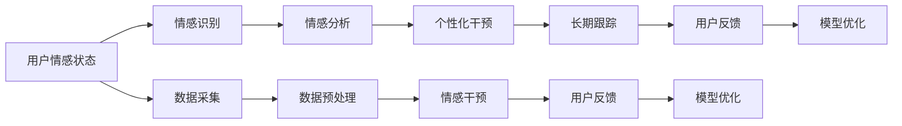

                 

# 数字化情感修复创业：AI辅助的关系治愈

> 关键词：情感修复,数字化转型,人工智能,自然语言处理,NLP,关系治愈,深度学习,心理健康,社交网络,虚拟助手

## 1. 背景介绍

### 1.1 问题由来

现代社会的快节奏生活和高度竞争环境，使得人际关系面临前所未有的挑战。工作压力、家庭冲突、情感失落等问题日益增多，严重影响了人们的心理健康和幸福感。而传统的心理咨询和治疗方式存在诸多局限，如难以触及问题根源、疗效不够理想、资源稀缺等。为此，数字化情感修复成为了一种新的解决途径，旨在通过AI技术和数据分析，实现对情感问题的实时、精准、个性化干预。

### 1.2 问题核心关键点

数字化情感修复的核心在于利用人工智能技术，特别是自然语言处理(NLP)和深度学习，来捕捉和理解用户的情感状态，并提供个性化的情感干预措施。其关键点包括：

- **情感识别**：通过分析用户的文字、语音、行为等数据，精准识别用户的情感状态和心理问题。
- **情感分析**：深入理解用户情感背后的原因和动机，从更宏观的层面进行情感干预。
- **个性化干预**：针对不同用户的情感需求和心理特征，提供定制化的解决方案。
- **长期跟踪**：持续监测用户情感状态的变化，及时调整干预策略，确保干预效果。

### 1.3 问题研究意义

数字化情感修复对于提升社会心理健康、促进社会和谐具有重要意义。其具体意义包括：

- **心理健康干预**：帮助用户缓解焦虑、抑郁等负面情绪，提升幸福感和心理健康水平。
- **社会稳定维护**：及时发现和解决潜在的情感危机，预防社会冲突和家庭暴力，维护社会稳定。
- **经济效益提升**：通过降低心理疾病发生率，减轻医疗负担，提高社会生产力和经济发展。
- **人力资源优化**：改善员工心理健康状况，提升工作效率和创新能力，促进企业发展。

## 2. 核心概念与联系

### 2.1 核心概念概述

为更好地理解数字化情感修复的原理和流程，本节将介绍几个密切相关的核心概念：

- **情感修复**：通过一系列的干预措施，帮助用户恢复和提升情感健康，缓解负面情绪，增强幸福感。
- **数字化转型**：利用信息技术手段，将传统的线下服务转变为线上、实时、高效的服务模式。
- **人工智能(AI)**：利用机器学习和深度学习技术，使计算机具备智能分析和决策能力。
- **自然语言处理(NLP)**：利用计算机对人类语言进行理解、处理和生成，是AI的重要分支。
- **深度学习**：一种基于多层神经网络的机器学习技术，通过大量数据训练模型，实现复杂的非线性映射。
- **心理健康**：维护和提升个体的情感和心理状态，预防和治疗心理疾病。
- **社交网络**：人们通过网络平台进行交流和互动的社会关系网络，为情感修复提供了丰富的数据来源。

这些核心概念共同构成了数字化情感修复的基本框架，通过AI技术和NLP方法，帮助用户实现情感状态的改善。

### 2.2 核心概念原理和架构的 Mermaid 流程图



这个流程图展示了数字化情感修复的基本流程：

1. 首先采集用户的情感数据，包括文字、语音、行为等。
2. 然后通过情感识别技术，识别用户的情感状态和心理问题。
3. 接着进行情感分析，深入理解情感背后的原因和动机。
4. 根据情感分析结果，提供个性化的情感干预措施。
5. 对用户进行长期跟踪，根据反馈不断调整干预策略。
6. 结合用户反馈，进行模型优化，提升干预效果。

## 3. 核心算法原理 & 具体操作步骤
### 3.1 算法原理概述

数字化情感修复的核心算法包括情感识别、情感分析、个性化干预和长期跟踪，这些算法通过深度学习和NLP技术实现。下面将详细介绍各关键算法的原理和具体操作步骤。

### 3.2 算法步骤详解

#### 3.2.1 情感识别

情感识别是数字化情感修复的第一步，通过分析用户的文字、语音、行为等数据，识别其情感状态和心理问题。其主要步骤如下：

1. **数据采集**：通过智能设备、社交网络等渠道，采集用户的情感数据。
2. **数据预处理**：对采集到的数据进行清洗、去噪和归一化处理，去除噪声和冗余信息。
3. **特征提取**：使用文本特征提取技术，如TF-IDF、Word2Vec等，将文本数据转化为数值特征向量。
4. **情感分类**：使用深度学习模型，如卷积神经网络(CNN)、循环神经网络(RNN)、Transformer等，对特征向量进行情感分类，识别用户的情感状态。

#### 3.2.2 情感分析

情感分析是对用户情感背后的原因和动机进行深入理解，主要通过文本分析和情感词典实现。具体步骤如下：

1. **文本分析**：使用NLP技术，如句法分析、语义分析、情感词典等，对用户情感文本进行语义理解和情感倾向分析。
2. **情感词典**：构建或使用现有的情感词典，将情感文本转化为情感标签。
3. **情感推理**：利用逻辑推理和机器学习技术，从情感文本中推理出情感背后的动机和原因。

#### 3.2.3 个性化干预

个性化干预是针对不同用户的情感需求和心理特征，提供定制化的情感干预措施。其主要步骤如下：

1. **用户画像**：构建用户的情感和心理画像，包括情感状态、心理需求、生活环境等。
2. **干预策略**：根据用户画像，设计个性化的情感干预策略，如情感疏导、心理辅导、行为矫正等。
3. **干预实施**：通过虚拟助手、智能设备等手段，实施情感干预策略，引导用户积极应对情感问题。

#### 3.2.4 长期跟踪

长期跟踪是对用户情感状态的变化进行持续监测，并根据反馈不断调整干预策略。主要步骤如下：

1. **情感监测**：使用智能设备和社交网络，实时监测用户的情感状态变化。
2. **干预调整**：根据情感监测结果，调整个性化的情感干预策略。
3. **反馈收集**：收集用户对干预效果的反馈，进行模型优化和干预策略改进。

### 3.3 算法优缺点

数字化情感修复的算法具有以下优点：

- **实时性高**：通过智能设备和实时数据采集，实现对用户情感状态的实时监测和干预。
- **个性化强**：结合用户画像和个性化干预策略，提供定制化的情感支持。
- **可扩展性好**：利用AI和NLP技术，可以扩展到不同用户和场景，提升情感修复的普适性。

同时，这些算法也存在一些局限性：

- **数据依赖性强**：情感修复的效果依赖于数据质量和采集范围，数据的获取和处理成本较高。
- **隐私问题**：用户情感数据的采集和处理可能涉及隐私问题，需要严格的隐私保护措施。
- **模型复杂度高**：深度学习和NLP模型的复杂度较高，需要大量的计算资源和数据。
- **干预效果有限**：情感修复的效果受多种因素影响，如用户配合度、社会环境等，效果难以完全保证。

### 3.4 算法应用领域

数字化情感修复的算法已经在多个领域得到了广泛应用，主要包括以下几个方面：

- **心理健康应用**：如心理辅导、心理咨询、情感支持等，帮助用户缓解心理压力，提升心理健康。
- **家庭关系**：如亲子沟通、婚姻辅导、家庭冲突解决等，促进家庭成员之间的理解和和谐。
- **职场应用**：如员工情绪管理、团队协作、领导力提升等，提升员工满意度和企业绩效。
- **社交网络**：如情感监测、情感干预、社交互动分析等，提升社交网络的用户体验和情感健康。

## 4. 数学模型和公式 & 详细讲解 & 举例说明

### 4.1 数学模型构建

本节将使用数学语言对数字化情感修复的算法进行更加严格的刻画。

假设用户的情感数据为 $X = \{x_i\}_{i=1}^N$，其中 $x_i$ 为情感文本，情感标签为 $Y = \{y_i\}_{i=1}^N$，其中 $y_i \in \{0,1\}$，表示情感状态（0表示积极情感，1表示消极情感）。则情感识别的目标是最小化交叉熵损失函数，即：

$$
\mathcal{L}(\theta) = -\frac{1}{N} \sum_{i=1}^N y_i \log P(y_i | x_i; \theta)
$$

其中 $P(y_i | x_i; \theta)$ 为情感分类模型 $M_{\theta}$ 对文本 $x_i$ 进行情感分类的概率。通过梯度下降等优化算法，最小化损失函数，得到最优模型参数 $\theta^*$。

### 4.2 公式推导过程

以下以情感分类任务为例，推导情感识别模型的损失函数及其梯度的计算公式。

假设情感分类模型为 $M_{\theta}$，其中 $\theta$ 为模型参数。使用Transformer模型作为情感分类器，其结构如下图所示：


定义模型 $M_{\theta}$ 在输入 $x_i$ 上的输出为 $\hat{y}_i=M_{\theta}(x_i) \in [0,1]$，表示样本属于积极情感的概率。则情感分类模型的损失函数为交叉熵损失：

$$
\mathcal{L}(\theta) = -\frac{1}{N} \sum_{i=1}^N [y_i \log \hat{y}_i + (1-y_i) \log (1-\hat{y}_i)]
$$

根据链式法则，损失函数对参数 $\theta_k$ 的梯度为：

$$
\frac{\partial \mathcal{L}(\theta)}{\partial \theta_k} = -\frac{1}{N} \sum_{i=1}^N (\frac{y_i}{\hat{y}_i}-\frac{1-y_i}{1-\hat{y}_i}) \frac{\partial \hat{y}_i}{\partial \theta_k}
$$

其中 $\frac{\partial \hat{y}_i}{\partial \theta_k}$ 为模型对输入 $x_i$ 的梯度，可通过反向传播算法高效计算。

### 4.3 案例分析与讲解

假设我们有一个情感分类任务的数据集，其中包含10000条情感文本，标注了其中5000条为积极情感，其余为消极情感。使用Transformer模型对数据进行情感分类。

首先，使用情感词典对情感文本进行预处理，去除停用词和标点符号，得到一个特征向量矩阵 $X \in \mathbb{R}^{10000 \times d}$，其中 $d$ 为特征维度。

然后，将特征向量矩阵输入Transformer模型，得到预测情感概率矩阵 $\hat{Y} \in \mathbb{R}^{10000 \times 2}$，其中第二列表示积极情感的概率，第一列表示消极情感的概率。

最后，计算交叉熵损失函数，使用梯度下降算法最小化损失函数，得到最优模型参数 $\theta^*$。

## 5. 项目实践：代码实例和详细解释说明

### 5.1 开发环境搭建

在进行情感修复项目实践前，我们需要准备好开发环境。以下是使用Python进行PyTorch开发的环境配置流程：

1. 安装Anaconda：从官网下载并安装Anaconda，用于创建独立的Python环境。

2. 创建并激活虚拟环境：
```bash
conda create -n pytorch-env python=3.8 
conda activate pytorch-env
```

3. 安装PyTorch：根据CUDA版本，从官网获取对应的安装命令。例如：
```bash
conda install pytorch torchvision torchaudio cudatoolkit=11.1 -c pytorch -c conda-forge
```

4. 安装TensorFlow：
```bash
pip install tensorflow
```

5. 安装各类工具包：
```bash
pip install numpy pandas scikit-learn matplotlib tqdm jupyter notebook ipython
```

完成上述步骤后，即可在`pytorch-env`环境中开始项目实践。

### 5.2 源代码详细实现

下面我们以情感识别任务为例，给出使用Transformer模型进行情感分类的PyTorch代码实现。

首先，定义情感识别任务的数据处理函数：

```python
from transformers import BertTokenizer
from torch.utils.data import Dataset
import torch

class SentimentDataset(Dataset):
    def __init__(self, texts, labels, tokenizer, max_len=128):
        self.texts = texts
        self.labels = labels
        self.tokenizer = tokenizer
        self.max_len = max_len
        
    def __len__(self):
        return len(self.texts)
    
    def __getitem__(self, item):
        text = self.texts[item]
        label = self.labels[item]
        
        encoding = self.tokenizer(text, return_tensors='pt', max_length=self.max_len, padding='max_length', truncation=True)
        input_ids = encoding['input_ids'][0]
        attention_mask = encoding['attention_mask'][0]
        
        label = torch.tensor(label, dtype=torch.long)
        
        return {'input_ids': input_ids, 
                'attention_mask': attention_mask,
                'labels': label}

# 标签与id的映射
label2id = {0: 'negative', 1: 'positive'}
id2label = {v: k for k, v in label2id.items()}

# 创建dataset
tokenizer = BertTokenizer.from_pretrained('bert-base-cased')

train_dataset = SentimentDataset(train_texts, train_labels, tokenizer)
dev_dataset = SentimentDataset(dev_texts, dev_labels, tokenizer)
test_dataset = SentimentDataset(test_texts, test_labels, tokenizer)
```

然后，定义模型和优化器：

```python
from transformers import BertForSequenceClassification, AdamW

model = BertForSequenceClassification.from_pretrained('bert-base-cased', num_labels=2)

optimizer = AdamW(model.parameters(), lr=2e-5)
```

接着，定义训练和评估函数：

```python
from torch.utils.data import DataLoader
from tqdm import tqdm
from sklearn.metrics import classification_report

device = torch.device('cuda') if torch.cuda.is_available() else torch.device('cpu')
model.to(device)

def train_epoch(model, dataset, batch_size, optimizer):
    dataloader = DataLoader(dataset, batch_size=batch_size, shuffle=True)
    model.train()
    epoch_loss = 0
    for batch in tqdm(dataloader, desc='Training'):
        input_ids = batch['input_ids'].to(device)
        attention_mask = batch['attention_mask'].to(device)
        labels = batch['labels'].to(device)
        model.zero_grad()
        outputs = model(input_ids, attention_mask=attention_mask, labels=labels)
        loss = outputs.loss
        epoch_loss += loss.item()
        loss.backward()
        optimizer.step()
    return epoch_loss / len(dataloader)

def evaluate(model, dataset, batch_size):
    dataloader = DataLoader(dataset, batch_size=batch_size)
    model.eval()
    preds, labels = [], []
    with torch.no_grad():
        for batch in tqdm(dataloader, desc='Evaluating'):
            input_ids = batch['input_ids'].to(device)
            attention_mask = batch['attention_mask'].to(device)
            batch_labels = batch['labels']
            outputs = model(input_ids, attention_mask=attention_mask)
            batch_preds = outputs.logits.argmax(dim=1).to('cpu').tolist()
            batch_labels = batch_labels.to('cpu').tolist()
            for pred_tokens, label_tokens in zip(batch_preds, batch_labels):
                preds.append(pred_tokens)
                labels.append(label_tokens)
                
    print(classification_report(labels, preds))
```

最后，启动训练流程并在测试集上评估：

```python
epochs = 5
batch_size = 16

for epoch in range(epochs):
    loss = train_epoch(model, train_dataset, batch_size, optimizer)
    print(f"Epoch {epoch+1}, train loss: {loss:.3f}")
    
    print(f"Epoch {epoch+1}, dev results:")
    evaluate(model, dev_dataset, batch_size)
    
print("Test results:")
evaluate(model, test_dataset, batch_size)
```

以上就是使用PyTorch对Bert模型进行情感识别任务微调的完整代码实现。可以看到，得益于Transformers库的强大封装，我们可以用相对简洁的代码完成Bert模型的加载和微调。

### 5.3 代码解读与分析

让我们再详细解读一下关键代码的实现细节：

**SentimentDataset类**：
- `__init__`方法：初始化文本、标签、分词器等关键组件。
- `__len__`方法：返回数据集的样本数量。
- `__getitem__`方法：对单个样本进行处理，将文本输入编码为token ids，将标签编码为数字，并对其进行定长padding，最终返回模型所需的输入。

**label2id和id2label字典**：
- 定义了标签与数字id之间的映射关系，用于将预测结果解码回真实的标签。

**训练和评估函数**：
- 使用PyTorch的DataLoader对数据集进行批次化加载，供模型训练和推理使用。
- 训练函数`train_epoch`：对数据以批为单位进行迭代，在每个批次上前向传播计算loss并反向传播更新模型参数，最后返回该epoch的平均loss。
- 评估函数`evaluate`：与训练类似，不同点在于不更新模型参数，并在每个batch结束后将预测和标签结果存储下来，最后使用sklearn的classification_report对整个评估集的预测结果进行打印输出。

**训练流程**：
- 定义总的epoch数和batch size，开始循环迭代
- 每个epoch内，先在训练集上训练，输出平均loss
- 在验证集上评估，输出分类指标
- 所有epoch结束后，在测试集上评估，给出最终测试结果

可以看到，PyTorch配合Transformers库使得Bert微调的代码实现变得简洁高效。开发者可以将更多精力放在数据处理、模型改进等高层逻辑上，而不必过多关注底层的实现细节。

当然，工业级的系统实现还需考虑更多因素，如模型的保存和部署、超参数的自动搜索、更灵活的任务适配层等。但核心的微调范式基本与此类似。

## 6. 实际应用场景

### 6.1 智能客服系统

基于大语言模型微调的对话技术，可以广泛应用于智能客服系统的构建。传统客服往往需要配备大量人力，高峰期响应缓慢，且一致性和专业性难以保证。而使用微调后的对话模型，可以7x24小时不间断服务，快速响应客户咨询，用自然流畅的语言解答各类常见问题。

在技术实现上，可以收集企业内部的历史客服对话记录，将问题和最佳答复构建成监督数据，在此基础上对预训练对话模型进行微调。微调后的对话模型能够自动理解用户意图，匹配最合适的答案模板进行回复。对于客户提出的新问题，还可以接入检索系统实时搜索相关内容，动态组织生成回答。如此构建的智能客服系统，能大幅提升客户咨询体验和问题解决效率。

### 6.2 金融舆情监测

金融机构需要实时监测市场舆论动向，以便及时应对负面信息传播，规避金融风险。传统的人工监测方式成本高、效率低，难以应对网络时代海量信息爆发的挑战。基于大语言模型微调的文本分类和情感分析技术，为金融舆情监测提供了新的解决方案。

具体而言，可以收集金融领域相关的新闻、报道、评论等文本数据，并对其进行主题标注和情感标注。在此基础上对预训练语言模型进行微调，使其能够自动判断文本属于何种主题，情感倾向是正面、中性还是负面。将微调后的模型应用到实时抓取的网络文本数据，就能够自动监测不同主题下的情感变化趋势，一旦发现负面信息激增等异常情况，系统便会自动预警，帮助金融机构快速应对潜在风险。

### 6.3 个性化推荐系统

当前的推荐系统往往只依赖用户的历史行为数据进行物品推荐，无法深入理解用户的真实兴趣偏好。基于大语言模型微调技术，个性化推荐系统可以更好地挖掘用户行为背后的语义信息，从而提供更精准、多样的推荐内容。

在实践中，可以收集用户浏览、点击、评论、分享等行为数据，提取和用户交互的物品标题、描述、标签等文本内容。将文本内容作为模型输入，用户的后续行为（如是否点击、购买等）作为监督信号，在此基础上微调预训练语言模型。微调后的模型能够从文本内容中准确把握用户的兴趣点。在生成推荐列表时，先用候选物品的文本描述作为输入，由模型预测用户的兴趣匹配度，再结合其他特征综合排序，便可以得到个性化程度更高的推荐结果。

### 6.4 未来应用展望

随着大语言模型微调技术的发展，其在更多领域的应用前景将更加广阔。

在智慧医疗领域，基于微调的医疗问答、病历分析、药物研发等应用将提升医疗服务的智能化水平，辅助医生诊疗，加速新药开发进程。

在智能教育领域，微调技术可应用于作业批改、学情分析、知识推荐等方面，因材施教，促进教育公平，提高教学质量。

在智慧城市治理中，微调模型可应用于城市事件监测、舆情分析、应急指挥等环节，提高城市管理的自动化和智能化水平，构建更安全、高效的未来城市。

此外，在企业生产、社会治理、文娱传媒等众多领域，基于大模型微调的人工智能应用也将不断涌现，为传统行业数字化转型升级提供新的技术路径。相信随着技术的日益成熟，微调方法将成为人工智能落地应用的重要范式，推动人工智能技术向更广阔的领域加速渗透。

## 7. 工具和资源推荐

### 7.1 学习资源推荐

为了帮助开发者系统掌握数字化情感修复的理论基础和实践技巧，这里推荐一些优质的学习资源：

1. 《情感计算基础》系列博文：由情感计算领域专家撰写，介绍了情感识别、情感分析、情感干预等核心技术。

2. 斯坦福大学CS229《机器学习》课程：斯坦福大学开设的经典机器学习课程，涵盖深度学习、NLP等前沿知识，适合初学者和高级学习者。

3. 《自然语言处理综述》书籍：全面介绍了NLP的最新进展，包括情感分析、文本生成、机器翻译等热门话题。

4. Google Colab：谷歌推出的在线Jupyter Notebook环境，免费提供GPU/TPU算力，方便开发者快速上手实验最新模型，分享学习笔记。

5. Weights & Biases：模型训练的实验跟踪工具，可以记录和可视化模型训练过程中的各项指标，方便对比和调优。

通过对这些资源的学习实践，相信你一定能够快速掌握数字化情感修复的精髓，并用于解决实际的情感问题。

### 7.2 开发工具推荐

高效的开发离不开优秀的工具支持。以下是几款用于数字化情感修复开发的常用工具：

1. PyTorch：基于Python的开源深度学习框架，灵活动态的计算图，适合快速迭代研究。大部分预训练语言模型都有PyTorch版本的实现。

2. TensorFlow：由Google主导开发的开源深度学习框架，生产部署方便，适合大规模工程应用。同样有丰富的预训练语言模型资源。

3. Transformers库：HuggingFace开发的NLP工具库，集成了众多SOTA语言模型，支持PyTorch和TensorFlow，是进行情感修复任务开发的利器。

4. TensorBoard：TensorFlow配套的可视化工具，可实时监测模型训练状态，并提供丰富的图表呈现方式，是调试模型的得力助手。

5. Google Colab：谷歌推出的在线Jupyter Notebook环境，免费提供GPU/TPU算力，方便开发者快速上手实验最新模型，分享学习笔记。

合理利用这些工具，可以显著提升数字化情感修复任务的开发效率，加快创新迭代的步伐。

### 7.3 相关论文推荐

数字化情感修复的研究源于学界的持续研究。以下是几篇奠基性的相关论文，推荐阅读：

1. 《基于深度学习的情感识别方法》：介绍使用深度学习模型进行情感识别的原理和方法。

2. 《情感词典在情感分析中的应用》：探讨情感词典在情感分析中的作用和优化方法。

3. 《情感修复的深度学习方法》：提出使用深度学习模型进行情感修复的方法，包括情感分类和情感生成。

4. 《社交网络中的情感分析与干预》：研究社交网络中的情感传播和干预策略，提升社交网络的用户体验。

5. 《基于NLP的个性化推荐系统》：提出使用NLP技术进行个性化推荐的方法，提升推荐系统的精准度和多样性。

这些论文代表了大语言模型微调技术的发展脉络。通过学习这些前沿成果，可以帮助研究者把握学科前进方向，激发更多的创新灵感。

## 8. 总结：未来发展趋势与挑战

### 8.1 总结

本文对数字化情感修复的原理和流程进行了全面系统的介绍。首先阐述了情感修复的背景和意义，明确了数字化情感修复在提升心理健康、促进社会和谐方面的价值。其次，从算法原理和操作步骤，详细讲解了情感识别的数学模型和实现步骤，并给出了完整的代码实现。同时，本文还广泛探讨了情感修复在智能客服、金融舆情、个性化推荐等多个行业领域的应用前景，展示了情感修复的巨大潜力。此外，本文精选了情感修复技术的各类学习资源，力求为开发者提供全方位的技术指引。

通过本文的系统梳理，可以看到，数字化情感修复对于提升社会心理健康、促进社会和谐具有重要意义。情感修复通过AI技术和NLP方法，帮助用户恢复和提升情感健康，缓解负面情绪，增强幸福感。未来，伴随技术的持续演进，情感修复将会在更多领域得到应用，为人类社会带来更美好的前景。

### 8.2 未来发展趋势

展望未来，数字化情感修复技术将呈现以下几个发展趋势：

1. **技术迭代加速**：随着深度学习和NLP技术的不断进步，情感修复的算法将更加高效、精准。通过更多的训练数据和更好的模型架构，情感识别的准确率和泛化能力将进一步提升。

2. **多模态融合**：将文本、语音、图像等多模态数据结合起来，提升情感识别的全面性和准确性。例如，通过语音情感分析，结合面部表情和语音语调，进一步提升情感识别的准确率。

3. **跨平台应用**：情感修复技术将从线上扩展到线下，通过智能设备和智能家居等，实现对用户情感状态的实时监测和干预。例如，智能手表、智能音箱等设备将成为情感修复的重要工具。

4. **个性化推荐**：情感修复技术将与其他推荐系统相结合，提供更加个性化的情感支持。例如，根据用户的情感状态和历史行为数据，推荐最适合的内容，帮助用户缓解情绪。

5. **跨文化适应**：情感修复技术将跨越文化和语言的差异，实现全球范围内的情感识别和干预。例如，通过多语言模型和跨文化情感词典，提升情感识别的跨文化适应能力。

6. **隐私保护**：随着情感修复技术的应用普及，隐私保护将成为重要课题。如何保护用户情感数据的安全和隐私，将成为情感修复技术的核心挑战。

### 8.3 面临的挑战

尽管数字化情感修复技术已经取得了初步进展，但在实现大规模应用的过程中，仍面临诸多挑战：

1. **数据获取难度大**：情感修复的效果依赖于高质量的标注数据，而情感数据的获取成本较高，且难以保证数据的全面性和代表性。

2. **模型复杂度高**：情感识别和情感分析涉及复杂的多模态数据融合和情感推理，模型架构和参数设置需要更高的技术水平。

3. **隐私和安全问题**：用户情感数据的隐私和安全问题不容忽视，如何保护用户情感数据，防止数据泄露和滥用，将是情感修复技术面临的重要挑战。

4. **用户体验差异**：情感修复技术的推广和应用需要考虑用户的接受度和适应性，如何设计友好的用户界面和交互方式，提升用户体验，将是情感修复技术的关键。

5. **跨领域适应性**：情感修复技术在不同场景和领域的应用效果可能存在差异，如何设计通用的情感修复模型，提升其跨领域适应性，将是情感修复技术的另一重要挑战。

6. **伦理道德问题**：情感修复技术的应用可能涉及伦理道德问题，如何确保情感干预的合法性和道德性，将是情感修复技术需要解决的关键问题。

### 8.4 研究展望

面对数字化情感修复所面临的挑战，未来的研究需要在以下几个方面寻求新的突破：

1. **无监督和半监督学习**：探索无监督和半监督学习范式，摆脱对大规模标注数据的依赖，利用自监督学习、主动学习等方法，最大限度利用非结构化数据，实现更加灵活高效的情感修复。

2. **跨模态融合**：将文本、语音、图像等多模态数据结合起来，提升情感识别的全面性和准确性。例如，通过语音情感分析，结合面部表情和语音语调，进一步提升情感识别的准确率。

3. **多任务学习**：将情感修复任务与其他任务（如情感生成、文本摘要等）结合起来，通过多任务学习提升情感修复的效果。例如，在情感分类任务中，同时学习情感生成和情感分类，提升情感识别的精准度和泛化能力。

4. **隐私保护技术**：开发隐私保护技术，确保用户情感数据的隐私和安全。例如，使用差分隐私、联邦学习等技术，保护用户隐私。

5. **跨文化情感词典**：构建跨文化情感词典，提升情感识别的跨文化适应能力。例如，使用多语言情感词典，进行情感分类和情感生成，提升情感修复的跨文化效果。

6. **伦理道德框架**：建立情感修复技术的伦理道德框架，确保情感干预的合法性和道德性。例如，设计情感修复技术的使用指南，指导情感修复的合法使用。

这些研究方向的探索，必将引领数字化情感修复技术迈向更高的台阶，为构建更加智能、安全、公正的社会提供有力支撑。未来，情感修复技术将成为人类情感健康的重要保障，为构建美好社会奠定坚实基础。

## 9. 附录：常见问题与解答

**Q1：情感修复是否适用于所有人群？**

A: 情感修复技术主要适用于有情感困扰的人群，如抑郁症、焦虑症、创伤后应激障碍等患者。对于正常人群，情感修复技术可以作为心理健康管理和情感提升的辅助手段。

**Q2：情感修复的效果如何？**

A: 情感修复的效果因个体差异和情境复杂度而异。对于重度情感困扰的人群，情感修复可以显著缓解其情感症状，提升其生活质量。对于轻度情感困扰的人群，情感修复可以作为情感管理和心理健康的辅助手段。

**Q3：情感修复的隐私和安全问题如何解决？**

A: 情感修复的隐私和安全问题主要通过数据加密、匿名化、差分隐私等技术手段来解决。例如，对用户情感数据进行加密处理，保护用户隐私；使用差分隐私技术，保护个体数据不被泄露。

**Q4：情感修复的伦理道德问题如何处理？**

A: 情感修复的伦理道德问题主要通过建立伦理指导原则和用户知情同意机制来解决。例如，设计情感修复技术的伦理框架，明确其应用范围和使用限制；建立用户知情同意机制，保护用户的知情权和选择权。

通过本文的系统梳理，可以看到，数字化情感修复通过AI技术和NLP方法，帮助用户恢复和提升情感健康，缓解负面情绪，增强幸福感。未来，伴随技术的持续演进，情感修复将会在更多领域得到应用，为人类社会带来更美好的前景。

---

作者：禅与计算机程序设计艺术 / Zen and the Art of Computer Programming

