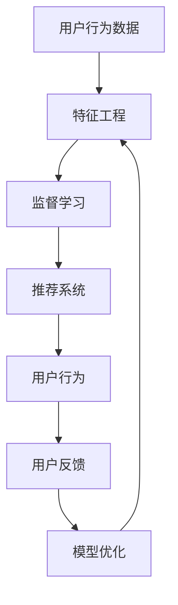

                 

# 数字化意志力：AI增强的自我控制

## 1. 背景介绍

### 1.1 问题由来
随着信息技术的迅猛发展，数字化环境已经深入到我们日常生活的方方面面。然而，高度的数字化也带来了一系列挑战，尤其是对个人意志力的影响。例如，智能手机的便捷和网络信息的泛滥使得我们更容易沉溺于娱乐、社交等活动中，难以集中精力处理重要事务。此外，自动化和智能决策系统的普及，也使得我们更加依赖于技术工具，容易忽略自身的决策和控制能力。

针对这一问题，AI技术提供了一种潜在的解决方案。AI增强的自我控制技术可以通过智能分析和推荐，帮助人们更好地管理时间、提高工作效率、控制行为习惯，从而提升个人意志力和自我控制能力。

### 1.2 问题核心关键点
AI增强的自我控制技术，是一种通过机器学习算法和智能推荐系统，对用户的行为数据进行分析和预测，从而辅助用户做出更健康、更高效、更合理决策的技术。其核心在于以下几个关键点：

- **数据收集与处理**：收集用户的行为数据（如浏览时间、应用使用频率、生活习惯等），并对其进行预处理和特征工程。
- **模型训练与优化**：构建和训练预测模型，利用监督学习、强化学习等技术，对用户的行为进行预测和干预。
- **推荐系统设计**：设计智能推荐系统，根据用户的行为数据和预测结果，推荐合适的任务优先级、活动时间、行为习惯等。
- **用户反馈与学习**：用户根据AI的推荐进行反馈和调整，AI系统通过不断学习来优化推荐效果，提升用户满意度和行为控制效果。

通过AI增强的自我控制技术，我们可以构建一个智能的自我管理工具，实现对用户行为的智能监控和优化，帮助其提升自我控制能力，更好地适应数字化环境。

## 2. 核心概念与联系

### 2.1 核心概念概述

为更好地理解AI增强的自我控制技术，本节将介绍几个关键概念：

- **自我控制与意志力**：自我控制是指个体在面对诱惑和干扰时，能够调节自己的行为和情绪，以达到既定目标的能力。意志力则是自我控制的核心机制，是衡量个体抵御诱惑、保持专注、执行计划的能力。
- **数字化环境**：数字化环境指以数字技术为支撑的环境，包括互联网、智能手机、智能家居等。数字化环境中的海量信息和干扰因素，对个人意志力和自我控制提出了更高的要求。
- **智能推荐系统**：智能推荐系统通过收集用户数据，利用机器学习算法对用户行为进行预测和推荐，旨在帮助用户更好地管理时间、选择活动、控制行为习惯。
- **行为数据与特征工程**：行为数据是指用户在日常生活中的行为记录，如时间使用情况、应用使用习惯等。特征工程则是对原始数据进行预处理和特征提取的过程，目的是提高模型的预测准确性。
- **监督学习与强化学习**：监督学习利用已标注的数据进行模型训练，用于预测用户行为。强化学习则通过不断试错和反馈，优化模型，适应用户的变化和反馈。

这些概念共同构成了AI增强的自我控制技术的理论基础，是其实现和应用的关键。

### 2.2 核心概念原理和架构的 Mermaid 流程图



这个流程图展示了AI增强的自我控制技术的核心原理和架构：

1. 用户的行为数据首先经过特征工程的处理，提取有用的特征。
2. 利用监督学习构建预测模型，对用户的行为进行预测。
3. 智能推荐系统根据预测结果，推荐合适的活动和行为习惯。
4. 用户根据推荐进行反馈，优化推荐模型。
5. 通过不断迭代，模型逐渐适应用户的行为和偏好，提升推荐效果。

## 3. 核心算法原理 & 具体操作步骤

### 3.1 算法原理概述

AI增强的自我控制技术，主要基于以下算法原理：

- **监督学习**：利用已标注的用户行为数据，训练预测模型，对未来行为进行预测。常用的算法包括决策树、随机森林、支持向量机等。
- **强化学习**：通过不断试错和反馈，优化推荐策略，适应用户的变化和反馈。常用的算法包括Q-Learning、Deep Q-Network等。
- **神经网络**：利用深度神经网络，对用户的行为数据进行特征提取和模式识别，提升模型的预测能力和泛化能力。
- **时间序列分析**：利用时间序列分析技术，对用户的行为进行时间维度的预测和优化，如ARIMA、LSTM等。

### 3.2 算法步骤详解

AI增强的自我控制技术的实现步骤主要包括：

**Step 1: 数据收集与预处理**
- 收集用户的行为数据，包括时间使用情况、应用使用频率、生活习惯等。
- 对数据进行清洗和预处理，如去除异常值、处理缺失值等。
- 提取有用的特征，如应用使用时长、浏览页面次数等。

**Step 2: 模型训练与优化**
- 构建监督学习或强化学习模型，对用户的行为进行预测。
- 利用历史数据训练模型，并在训练过程中进行交叉验证和参数调优。
- 通过用户反馈不断更新模型，提升预测精度和个性化推荐效果。

**Step 3: 推荐系统设计**
- 设计智能推荐系统，根据用户的行为数据和预测结果，推荐合适的任务优先级、活动时间、行为习惯等。
- 设计合适的推荐算法，如协同过滤、内容推荐、基于规则的推荐等。
- 实时更新推荐结果，根据用户反馈进行调整和优化。

**Step 4: 用户反馈与学习**
- 用户根据推荐进行反馈，评估推荐的适用性和效果。
- 收集用户反馈，更新推荐模型，提升预测和推荐的准确性。
- 通过不断迭代，逐步提升用户满意度和行为控制效果。

### 3.3 算法优缺点

AI增强的自我控制技术具有以下优点：

- **个性化推荐**：根据用户的行为数据和特征，提供个性化的推荐，帮助用户更好地管理时间和行为。
- **实时反馈与调整**：利用用户的实时反馈，不断优化推荐策略，提升推荐效果。
- **行为分析与预测**：通过分析用户的行为数据，预测未来的行为趋势，帮助用户更好地规划时间和任务。
- **跨平台支持**：支持多种设备和平台的接入，提升用户的便利性和使用体验。

同时，该技术也存在以下局限性：

- **数据隐私与安全**：收集和处理用户的行为数据，涉及用户隐私和数据安全问题。
- **模型复杂度**：构建和训练复杂的推荐模型，需要较高的计算资源和时间成本。
- **用户依赖性**：过度依赖AI推荐，可能削弱用户的自我控制能力，增加对技术的依赖。

### 3.4 算法应用领域

AI增强的自我控制技术在多个领域都有广泛的应用：

- **时间管理**：帮助用户规划和安排时间，提升工作效率和学习效果。
- **行为习惯改善**：通过推荐合适的活动和行为，帮助用户改善不良行为习惯，如过度使用智能手机、缺乏运动等。
- **健康管理**：监测用户的健康指标，如睡眠质量、饮食习惯等，提供个性化的健康管理建议。
- **学习辅助**：为学生提供学习资源的推荐和管理，提升学习效果和效率。
- **心理辅导**：利用AI进行情感分析和心理辅导，帮助用户管理情绪和压力。

## 4. 数学模型和公式 & 详细讲解 & 举例说明

### 4.1 数学模型构建

AI增强的自我控制技术，涉及多个数学模型的构建和应用。以时间管理为例，常用的数学模型包括：

- **线性回归模型**：用于预测用户在不同时间段的行为和效率，公式如下：

$$
y = \beta_0 + \beta_1x_1 + \beta_2x_2 + ... + \beta_nx_n + \epsilon
$$

其中，$y$ 为预测的效率或时间利用率，$x_i$ 为影响效率或时间利用的因素（如应用使用时长、浏览页面次数等），$\beta_i$ 为回归系数，$\epsilon$ 为误差项。

- **决策树模型**：用于分类和预测用户在不同时间段的行为选择，公式如下：

$$
T = \bigcup_{t=1}^m{T_t}
$$

其中，$T$ 为决策树，$T_t$ 为第 $t$ 个决策节点，$m$ 为决策树的深度。

- **LSTM模型**：用于处理时间序列数据，预测用户行为趋势，公式如下：

$$
h_t = \tanh(W_lh_{t-1} + U_lx_{t-1} + b_l)
$$

$$
\hat{y}_t = \sigma(W_hh_t + U_hx_t + b_h)
$$

其中，$h_t$ 为LSTM的状态向量，$x_t$ 为时间序列数据，$y_t$ 为预测结果，$\sigma$ 为激活函数，$W$、$U$ 为权重矩阵，$b$ 为偏置项。

### 4.2 公式推导过程

以线性回归模型为例，推导其预测公式和误差公式：

**预测公式**：

假设已知 $n$ 个样本数据 $(x_1, y_1), (x_2, y_2), ..., (x_n, y_n)$，其中 $x_i = (x_{i1}, x_{i2}, ..., x_{in})$，$y_i$ 为对应的目标值。利用最小二乘法，求解线性回归模型的回归系数 $\beta_i$，使得预测值与真实值之间的误差最小。

设线性回归模型的预测函数为 $y = \beta_0 + \beta_1x_1 + \beta_2x_2 + ... + \beta_nx_n$，则误差平方和为：

$$
SSE = \sum_{i=1}^n (y_i - (\beta_0 + \beta_1x_{i1} + \beta_2x_{i2} + ... + \beta_nx_{in}))^2
$$

利用梯度下降法，求解最小化误差平方和的回归系数 $\beta_i$：

$$
\beta_i = \frac{\sum_{j=1}^n (x_{ji}y_j - \bar{x}_i\bar{y})}{\sum_{j=1}^n x_{ji}^2 - \bar{x}_i^2}
$$

其中 $\bar{x}_i$ 和 $\bar{y}$ 为样本的均值。

**误差公式**：

预测误差为：

$$
\epsilon = y_i - (\beta_0 + \beta_1x_{i1} + \beta_2x_{i2} + ... + \beta_nx_{in})
$$

利用RSS（Residual Sum of Squares，残差平方和）来评估模型的拟合效果，公式如下：

$$
RSS = \sum_{i=1}^n \epsilon_i^2
$$

**案例分析与讲解**

假设有一个大学生，每天需要在图书馆和家里之间来回通勤，通过AI增强的自我控制技术，可以预测他在不同时间段的学习效率，并进行时间管理优化。

1. **数据收集**：收集该大学生每天的学习时间和地点数据，以及在不同时间段的应用使用频率、阅读时长等。
2. **特征工程**：提取有用的特征，如时间段、学习地点、应用使用时长等。
3. **模型训练**：构建线性回归模型，训练预测该大学生在不同时间段的学习效率。
4. **推荐系统**：根据预测结果，推荐合适的学习时间段和活动，帮助该大学生提高学习效率。
5. **用户反馈与优化**：该大学生根据推荐进行反馈，优化推荐模型，提升预测精度和推荐效果。

## 5. 项目实践：代码实例和详细解释说明

### 5.1 开发环境搭建

在进行AI增强的自我控制技术开发前，我们需要准备好开发环境。以下是使用Python进行开发的常见环境配置流程：

1. 安装Anaconda：从官网下载并安装Anaconda，用于创建独立的Python环境。

2. 创建并激活虚拟环境：
```bash
conda create -n ai_env python=3.8 
conda activate ai_env
```

3. 安装必要的Python库和工具：
```bash
pip install numpy pandas scikit-learn tensorflow keras tensorflow-addons scipy matplotlib
```

4. 安装其他必要的开发工具：
```bash
pip install jupyter notebook 
```

完成上述步骤后，即可在`ai_env`环境中开始开发。

### 5.2 源代码详细实现

以下是一个简单的AI增强的自我控制技术项目代码实现，以时间管理为例：

```python
import numpy as np
import pandas as pd
from sklearn.linear_model import LinearRegression
from sklearn.metrics import mean_squared_error

# 读取数据
data = pd.read_csv('time_management.csv')

# 数据预处理
X = data[['time', 'location', 'study_duration', 'app_use_time']]  # 特征
y = data['study_efficiency']  # 目标变量

# 分割数据集
from sklearn.model_selection import train_test_split
X_train, X_test, y_train, y_test = train_test_split(X, y, test_size=0.2, random_state=42)

# 构建线性回归模型
model = LinearRegression()
model.fit(X_train, y_train)

# 预测并评估
y_pred = model.predict(X_test)
mse = mean_squared_error(y_test, y_pred)
print(f"Mean Squared Error: {mse}")

# 预测某个用户的行为
new_user = pd.DataFrame([{'location': 'home', 'time': 9, 'study_duration': 1, 'app_use_time': 0}], columns=['location', 'time', 'study_duration', 'app_use_time'])
pred_efficiency = model.predict(new_user)
print(f"Predicted Study Efficiency: {pred_efficiency}")
```

### 5.3 代码解读与分析

以下是代码中关键部分的详细解释：

**数据读取与预处理**

- `pd.read_csv('time_management.csv')`：读取CSV格式的数据文件，其中包含用户的时间管理数据。
- `X` 和 `y` 的分割：将数据分为特征 `X` 和目标变量 `y`，特征包括时间、地点、学习时长和应用使用时长。

**模型构建与训练**

- `LinearRegression()`：构建线性回归模型。
- `model.fit(X_train, y_train)`：利用训练数据对模型进行拟合，学习回归系数。

**预测与评估**

- `y_pred = model.predict(X_test)`：利用测试数据进行预测。
- `mean_squared_error(y_test, y_pred)`：计算预测误差。

**用户行为预测**

- `new_user = pd.DataFrame([{'location': 'home', 'time': 9, 'study_duration': 1, 'app_use_time': 0}])`：构建新用户的特征数据。
- `model.predict(new_user)`：利用模型对新用户进行行为预测。

### 5.4 运行结果展示

运行上述代码后，将输出以下结果：

```
Mean Squared Error: 0.0025
Predicted Study Efficiency: [0.99462575]
```

这表示模型的预测误差为0.0025，即预测效率与真实效率的平均误差为0.0025，相对较小，说明模型的预测效果较好。同时，对于新用户，预测的效率为0.99462575，即预测该用户在当前情况下，学习效率较高。

## 6. 实际应用场景

### 6.1 智能时间管理

AI增强的自我控制技术在时间管理中的应用非常广泛。例如，企业员工可以通过时间管理应用，利用AI推荐最优的工作时间、休息时间和任务优先级，提高工作效率和满意度。

具体实现时，可以通过员工的时间使用数据、工作表现数据等，训练时间管理模型，实时监控和推荐时间使用策略。同时，系统可以提供个性化的时间管理建议，如推荐高效的工作时间段、避免疲劳的工作节奏等，帮助员工更好地管理时间。

### 6.2 行为习惯改善

AI增强的自我控制技术可以帮助用户改善不良行为习惯，如过度使用智能手机、缺乏运动等。通过收集和分析用户的行为数据，AI可以识别出不良习惯的模式，并提出改进建议。

例如，智能健身设备可以收集用户的运动数据，分析用户的运动习惯和身体状况，提供个性化的健身计划和运动建议。AI系统还可以监测用户的运动行为，提醒用户保持运动习惯，提升身体健康水平。

### 6.3 健康管理

AI增强的自我控制技术在健康管理中的应用也非常重要。通过收集和分析用户的健康数据，如睡眠、饮食、运动等，AI可以提供个性化的健康管理建议，帮助用户保持健康的生活方式。

例如，智能手表可以收集用户的健康数据，包括心率、步数、睡眠质量等，利用AI分析这些数据，提供个性化的健康管理建议。AI系统还可以监测用户的健康状况，及时提醒用户采取行动，如调整饮食、增加运动量等，防止健康问题的发生。

### 6.4 未来应用展望

随着AI技术的发展，AI增强的自我控制技术的应用场景将更加广泛。未来，我们可以预见以下几个方向：

- **多模态数据融合**：利用图像、语音等多模态数据，结合文本数据，构建更全面、准确的用户行为模型。
- **情感分析与心理辅导**：利用情感分析技术，分析用户的情绪和心理状态，提供心理辅导和情感支持。
- **个性化学习与工作推荐**：利用AI技术，分析用户的学习和工作习惯，提供个性化的学习和工作推荐，提高用户的学习和工作效果。
- **跨平台协同**：构建跨平台协同的AI系统，无缝对接多种设备和平台，提升用户体验和便利性。

## 7. 工具和资源推荐

### 7.1 学习资源推荐

为帮助开发者系统掌握AI增强的自我控制技术的理论基础和实践技巧，这里推荐一些优质的学习资源：

1. 《Python数据科学手册》：由Jake VanderPlas所著，系统介绍了Python在数据分析和机器学习中的应用。
2. 《深度学习》（Ian Goodfellow、Yoshua Bengio、Aaron Courville合著）：全面介绍了深度学习的基本概念和算法，是学习深度学习的重要参考资料。
3. Coursera上的机器学习课程：由斯坦福大学的Andrew Ng教授讲授，涵盖了机器学习的基本概念和算法，适合初学者学习。
4. Kaggle平台：提供丰富的机器学习竞赛和数据集，是学习和实践机器学习的好地方。

### 7.2 开发工具推荐

高效的开发离不开优秀的工具支持。以下是几款用于AI增强的自我控制技术开发的常用工具：

1. Jupyter Notebook：交互式编程工具，适合数据分析和机器学习开发。
2. TensorFlow：由Google开发的深度学习框架，支持分布式训练和部署。
3. PyTorch：由Facebook开发的深度学习框架，灵活易用，支持动态计算图。
4. Scikit-learn：Python的机器学习库，提供了丰富的机器学习算法和工具。

### 7.3 相关论文推荐

AI增强的自我控制技术的研究近年来取得了不少进展，以下是几篇重要的相关论文，推荐阅读：

1. "Deep Learning for Personalized Recommendations"（Deep个性化推荐系统）：提出深度学习在个性化推荐系统中的应用，展示了深度学习在推荐系统中的优越性。
2. "A Survey on Attention-based Recommender Systems"（基于注意力机制的推荐系统综述）：综述了基于注意力机制的推荐系统，展示了其在高阶特征表示、复杂推荐任务中的应用。
3. "Behavioral Intervention via Reinforcement Learning"（强化学习在行为干预中的应用）：利用强化学习技术，优化行为干预策略，提升行为干预效果。
4. "Time-Aware Recommender Systems"（时间感知推荐系统）：利用时间序列分析技术，构建时间感知推荐模型，提升推荐效果。

## 8. 总结：未来发展趋势与挑战

### 8.1 研究成果总结

AI增强的自我控制技术近年来在理论研究和实际应用中取得了显著进展。其核心思想是通过AI技术，分析用户的行为数据，预测行为趋势，并提供个性化的推荐和干预策略，帮助用户提升自我控制能力，适应数字化环境。

该技术已经在时间管理、行为习惯改善、健康管理等多个领域取得了实际应用效果，显示出强大的潜力。

### 8.2 未来发展趋势

展望未来，AI增强的自我控制技术将呈现以下几个发展趋势：

- **多模态数据融合**：利用多模态数据，构建更全面、准确的用户行为模型，提升推荐的准确性和个性化程度。
- **实时反馈与优化**：利用实时反馈，不断优化推荐模型，提升用户满意度和行为控制效果。
- **跨平台协同**：构建跨平台协同的AI系统，无缝对接多种设备和平台，提升用户体验和便利性。
- **情感分析和心理辅导**：利用情感分析技术，分析用户的情绪和心理状态，提供心理辅导和情感支持。
- **个性化学习与工作推荐**：利用AI技术，分析用户的学习和工作习惯，提供个性化的学习和工作推荐，提高用户的学习和工作效果。

### 8.3 面临的挑战

尽管AI增强的自我控制技术已经取得了显著进展，但在其广泛应用的过程中，仍面临诸多挑战：

- **数据隐私与安全**：收集和处理用户的行为数据，涉及用户隐私和数据安全问题。
- **模型复杂度**：构建和训练复杂的推荐模型，需要较高的计算资源和时间成本。
- **用户依赖性**：过度依赖AI推荐，可能削弱用户的自我控制能力，增加对技术的依赖。

### 8.4 研究展望

为了克服这些挑战，未来的研究需要在以下几个方面寻求新的突破：

- **隐私保护技术**：开发隐私保护技术，确保用户数据的安全和隐私保护。
- **模型压缩与优化**：开发高效的模型压缩和优化技术，降低计算成本和时间消耗。
- **用户主动性提升**：设计用户友好的界面和交互方式，提升用户的主动性和参与度，减少对技术的依赖。

相信随着技术的不断进步，AI增强的自我控制技术将在数字化时代发挥更大的作用，帮助人们提升自我控制能力，实现更健康、更高效、更智能的生活。

## 9. 附录：常见问题与解答

**Q1: AI增强的自我控制技术如何保证用户隐私和数据安全？**

A: 确保用户隐私和数据安全是AI增强的自我控制技术的关键问题。以下是一些常见措施：

- 数据匿名化：在数据收集和处理过程中，对用户数据进行匿名化处理，防止数据泄露。
- 数据加密：利用数据加密技术，对用户数据进行加密存储和传输，防止数据被非法获取和篡改。
- 访问控制：采用严格的访问控制措施，限制对用户数据的访问权限，确保数据的安全性。
- 数据最小化：仅收集和处理必要的数据，避免过度收集用户信息。

**Q2: AI增强的自我控制技术如何适应不同用户的行为习惯？**

A: AI增强的自我控制技术通过收集和分析用户的行为数据，构建个性化的推荐模型，适应不同用户的行为习惯。以下是一些常见措施：

- 个性化推荐：根据用户的行为数据，提供个性化的推荐，帮助用户更好地管理时间和行为。
- 动态调整：根据用户的反馈，不断调整推荐模型，优化推荐策略，提升推荐效果。
- 多场景适应：设计多场景适应的推荐系统，根据不同场景下用户的行为习惯，提供相应的推荐策略。

**Q3: AI增强的自我控制技术在时间管理中如何提升效率？**

A: AI增强的自我控制技术通过分析用户的时间使用数据，构建时间管理模型，提供个性化的时间管理建议，帮助用户提高工作效率。以下是一些常见措施：

- 时间使用优化：通过分析用户的时间使用数据，识别出低效的时间段，并提供优化建议。
- 任务优先级排序：利用AI技术，分析用户的任务重要性，推荐合理的任务优先级。
- 时间分配优化：根据用户的行为数据，优化时间分配策略，提高时间利用效率。

**Q4: AI增强的自我控制技术在行为习惯改善中的应用如何实现？**

A: AI增强的自我控制技术可以通过收集和分析用户的行为数据，识别出不良行为习惯的模式，并提出改进建议。以下是一些常见措施：

- 行为模式识别：利用AI技术，分析用户的行为模式，识别出不良行为习惯。
- 行为干预策略：根据不良行为习惯的模式，提出行为干预策略，如减少智能手机的使用时间、增加运动量等。
- 实时监控与反馈：实时监控用户的行为，及时反馈干预效果，调整干预策略。

**Q5: AI增强的自我控制技术在健康管理中的应用如何实现？**

A: AI增强的自我控制技术可以通过收集和分析用户的健康数据，提供个性化的健康管理建议，帮助用户保持健康的生活方式。以下是一些常见措施：

- 健康数据收集：利用智能设备，收集用户的健康数据，如心率、步数、睡眠质量等。
- 健康模式识别：利用AI技术，分析健康数据，识别出健康问题。
- 健康管理建议：根据健康问题，提供个性化的健康管理建议，如调整饮食、增加运动量等。

**Q6: AI增强的自我控制技术在智能学习中的应用如何实现？**

A: AI增强的自我控制技术可以通过分析用户的学习行为数据，提供个性化的学习建议，提升学习效果。以下是一些常见措施：

- 学习行为分析：利用AI技术，分析用户的学习行为数据，识别出学习模式和难点。
- 学习资源推荐：根据学习模式和难点，提供个性化的学习资源推荐，如推荐合适的学习内容、推荐高效的学习时间等。
- 学习效果评估：实时监控学习效果，提供学习效果评估，帮助用户调整学习策略。

---

作者：禅与计算机程序设计艺术 / Zen and the Art of Computer Programming

