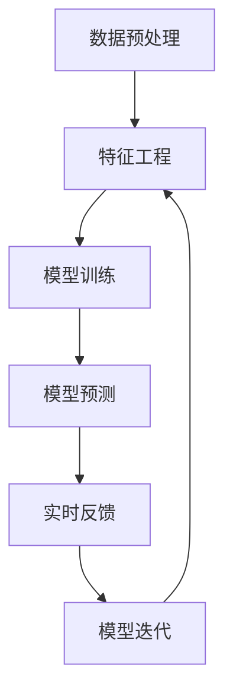

                 

# 数字化直觉：AI辅助的潜意识决策

> 关键词：数字化决策,人工智能,潜意识决策,算法优化,大数据分析

## 1. 背景介绍

### 1.1 问题由来
随着信息技术的飞速发展，数字化决策在各行各业中正逐渐成为主流。从金融、医疗到零售、教育，数字化决策正改变着人们的生产生活方式，也为各行各业带来了新的机遇与挑战。然而，由于数据量庞大、维度高、非结构化等特点，传统决策方式难以有效应对。人工智能（AI）技术的引入，为数字化决策提供了新的可能性。

其中，AI辅助的潜意识决策成为近年来的热门话题。潜意识决策，指的是人们在无意识状态下，快速、直觉性地做出决策的过程。这种决策方式，虽然看起来缺乏逻辑推理，但实际上往往能更准确地把握问题的本质，迅速找到最优解决方案。人工智能通过模拟和增强潜意识决策，帮助人们在大数据时代更高效地进行决策，提升决策质量和效率。

### 1.2 问题核心关键点
潜意识决策的核心在于快速、准确地把握问题的本质，并迅速做出最优决策。AI技术在这一过程中，主要通过以下几个方面来实现：
1. **数据预处理与特征工程**：对海量数据进行清洗、筛选和提取，生成对决策有意义的特征。
2. **模型训练与优化**：使用机器学习算法进行模型训练，通过不断优化提升模型精度和泛化能力。
3. **预测与解释**：通过模型预测未来的决策结果，并提供决策解释，帮助用户理解模型的决策逻辑。
4. **实时反馈与迭代**：通过反馈机制，不断调整模型参数和预测结果，实现持续改进。

以上几个方面共同构成了AI辅助潜意识决策的基本流程。通过对这些核心关键点的深入理解，可以更好地把握潜意识决策的AI实现技术。

## 2. 核心概念与联系

### 2.1 核心概念概述

为更好地理解AI辅助潜意识决策，本节将介绍几个密切相关的核心概念：

- **数据预处理与特征工程**：数据预处理是指对原始数据进行清洗、归一化等操作，以提升数据质量。特征工程则是对数据进行特征提取、转换、选择等处理，生成有意义的特征集合。数据预处理与特征工程是数据科学的基础，对模型的训练和预测效果有着重要影响。

- **机器学习算法**：机器学习算法是指利用统计学、信息论等方法，通过训练数据集构建模型，实现对新数据的预测和分类。常见的算法包括线性回归、逻辑回归、决策树、随机森林、支持向量机等。

- **模型训练与优化**：模型训练是指使用训练数据对机器学习算法进行参数拟合。模型优化则通过调整算法参数、引入正则化技术、增加数据量等手段，提升模型性能。

- **模型预测与解释**：模型预测是指使用训练好的模型对新数据进行预测。模型解释则是指对模型的预测结果进行可视化、可解释化处理，帮助用户理解模型决策逻辑。

- **实时反馈与迭代**：实时反馈是指在模型使用过程中，收集实际数据反馈，不断调整模型参数和预测结果。迭代则通过不断优化模型，实现持续改进。

这些核心概念之间的逻辑关系可以通过以下Mermaid流程图来展示：



这个流程图展示了大规模数据处理与模型训练的基本流程：

1. 原始数据经过预处理和特征工程，生成有意义的特征集。
2. 特征集输入模型进行训练，通过模型优化提升预测精度。
3. 模型对新数据进行预测，并收集反馈信息。
4. 反馈信息用于调整模型参数和预测结果，进行持续优化。

## 3. 核心算法原理 & 具体操作步骤

### 3.1 算法原理概述

AI辅助潜意识决策，本质上是一个基于数据驱动的决策优化过程。其核心思想是：通过数据预处理与特征工程，对原始数据进行处理，生成对决策有意义的特征；通过机器学习算法进行模型训练与优化，构建高精度的预测模型；最后，使用模型进行预测，并通过实时反馈与迭代机制，不断调整和优化模型，实现决策质量的持续提升。

形式化地，假设原始数据集为 $D=\{(x_i, y_i)\}_{i=1}^N$，其中 $x_i$ 为特征向量，$y_i$ 为标签。模型 $M$ 的训练目标是最小化经验风险，即找到最优模型参数 $\theta$，使得：

$$
\theta^* = \mathop{\arg\min}_{\theta} \mathcal{L}(M, D)
$$

其中 $\mathcal{L}$ 为损失函数，用于衡量模型预测与真实标签之间的差异。常见的损失函数包括均方误差、交叉熵等。

### 3.2 算法步骤详解

基于数据驱动的AI辅助潜意识决策，一般包括以下几个关键步骤：

**Step 1: 数据预处理与特征工程**
- 收集原始数据集 $D$，并进行清洗、归一化等预处理操作，保证数据质量。
- 设计特征提取策略，对数据进行特征选择、转换等操作，生成有意义的特征集 $X$。

**Step 2: 模型训练与优化**
- 选择合适的机器学习算法，如线性回归、决策树等，作为初始模型。
- 使用训练集 $D$ 对模型进行训练，最小化损失函数 $\mathcal{L}$，优化模型参数 $\theta$。
- 引入正则化技术，如L2正则、Dropout等，防止过拟合。
- 选择适当的优化算法，如梯度下降、Adam等，进行参数更新。

**Step 3: 模型预测与解释**
- 使用训练好的模型 $M_{\theta}$ 对新数据进行预测，生成决策结果。
- 对模型的预测结果进行可视化处理，如绘制决策边界、生成热力图等，帮助用户理解模型决策逻辑。
- 提供模型解释功能，如SHAP值、LIME等，解释模型预测结果的来源和依据。

**Step 4: 实时反馈与迭代**
- 收集模型使用过程中的实际数据反馈，用于调整模型参数和预测结果。
- 使用反馈数据进行模型微调，进一步提升模型性能。
- 通过迭代机制，不断优化模型，实现持续改进。

### 3.3 算法优缺点

AI辅助潜意识决策方法具有以下优点：
1. 高效快速：通过机器学习算法，模型能够在短时间内完成预测，实现快速决策。
2. 精度高：通过优化算法和正则化技术，模型能够提升预测精度，降低误判率。
3. 可解释性强：通过模型解释功能，用户能够理解模型的决策逻辑，增强决策信心。
4. 自适应强：通过实时反馈与迭代机制，模型能够不断调整和优化，提升决策质量。

同时，该方法也存在一定的局限性：
1. 数据依赖性强：模型的训练和预测依赖于高质量的数据，数据质量直接影响模型性能。
2. 模型复杂度高：复杂的模型结构需要较高的计算资源和时间成本，可能难以在实时环境中使用。
3. 过度依赖算法：模型的预测结果和决策质量高度依赖于算法的准确性和参数设置，需要经过充分调参。
4. 数据隐私问题：收集和使用数据的过程中，需要注意数据隐私和安全性，避免数据泄露和滥用。

尽管存在这些局限性，但就目前而言，AI辅助潜意识决策方法仍是大数据决策的主要范式。未来相关研究的重点在于如何进一步降低数据依赖，提高模型的实时性和自适应性，同时兼顾可解释性和数据隐私性等因素。

### 3.4 算法应用领域

AI辅助潜意识决策方法，在多个领域都有广泛的应用，例如：

- **金融风控**：通过数据分析和模型训练，实时监控金融交易异常，提前预警风险，降低金融损失。
- **医疗诊断**：利用患者数据和历史病例，构建预测模型，辅助医生进行疾病诊断和治疗方案选择。
- **零售推荐**：基于用户行为数据和产品特征，实时预测用户购买意向，实现个性化推荐，提升用户满意度。
- **智慧城市管理**：通过收集城市运行数据，预测和优化交通、能源、环境等系统，实现智能决策和管理。
- **智能制造**：使用传感器和物联网设备采集数据，构建预测模型，优化生产流程和资源分配，提升制造效率。

除了上述这些经典应用外，AI辅助潜意识决策方法还在更多场景中得到创新性地应用，如智能客服、灾害预警、舆情分析等，为各行各业带来了新的技术变革。随着AI技术的持续演进，相信未来将有更多应用场景得到深度挖掘，推动数字化决策的进一步发展。

## 4. 数学模型和公式 & 详细讲解 & 举例说明

### 4.1 数学模型构建

本节将使用数学语言对AI辅助潜意识决策过程进行更加严格的刻画。

假设原始数据集为 $D=\{(x_i, y_i)\}_{i=1}^N$，其中 $x_i$ 为特征向量，$y_i$ 为标签。模型 $M$ 的形式为 $M(x) = f(x; \theta)$，其中 $f$ 为模型函数，$\theta$ 为模型参数。模型 $M$ 的训练目标是最小化经验风险，即找到最优参数：

$$
\theta^* = \mathop{\arg\min}_{\theta} \mathcal{L}(M, D)
$$

在实践中，我们通常使用基于梯度的优化算法（如SGD、Adam等）来近似求解上述最优化问题。设 $\eta$ 为学习率，$\lambda$ 为正则化系数，则参数的更新公式为：

$$
\theta \leftarrow \theta - \eta \nabla_{\theta}\mathcal{L}(\theta) - \eta\lambda\theta
$$

其中 $\nabla_{\theta}\mathcal{L}(\theta)$ 为损失函数对参数 $\theta$ 的梯度，可通过反向传播算法高效计算。

### 4.2 公式推导过程

以下我们以线性回归为例，推导损失函数及其梯度的计算公式。

假设模型 $M$ 的形式为 $M(x) = \theta^Tx$，其中 $\theta$ 为模型参数。已知训练集 $D=\{(x_i, y_i)\}_{i=1}^N$，则经验风险为：

$$
\mathcal{L}(\theta) = \frac{1}{N}\sum_{i=1}^N (y_i - \theta^Tx_i)^2
$$

根据链式法则，损失函数对参数 $\theta_k$ 的梯度为：

$$
\frac{\partial \mathcal{L}(\theta)}{\partial \theta_k} = \frac{2}{N}\sum_{i=1}^N (y_i - \theta^Tx_i)(-x_{ik})
$$

在得到损失函数的梯度后，即可带入参数更新公式，完成模型的迭代优化。重复上述过程直至收敛，最终得到适应数据集的最优模型参数 $\theta^*$。

## 5. 项目实践：代码实例和详细解释说明

### 5.1 开发环境搭建

在进行项目实践前，我们需要准备好开发环境。以下是使用Python进行Scikit-learn开发的Python环境配置流程：

1. 安装Anaconda：从官网下载并安装Anaconda，用于创建独立的Python环境。

2. 创建并激活虚拟环境：
```bash
conda create -n sklearn-env python=3.8 
conda activate sklearn-env
```

3. 安装Scikit-learn：
```bash
conda install scikit-learn
```

4. 安装各类工具包：
```bash
pip install numpy pandas scikit-learn matplotlib tqdm jupyter notebook ipython
```

完成上述步骤后，即可在`sklearn-env`环境中开始项目实践。

### 5.2 源代码详细实现

这里我们以线性回归为例，给出使用Scikit-learn库进行数据预处理和模型训练的Python代码实现。

首先，定义数据预处理函数：

```python
import pandas as pd
import numpy as np
from sklearn.preprocessing import StandardScaler

def preprocess_data(data_path):
    data = pd.read_csv(data_path)
    X = data.drop('target', axis=1).values
    y = data['target'].values
    X = StandardScaler().fit_transform(X)
    return X, y
```

然后，定义模型训练函数：

```python
from sklearn.linear_model import LinearRegression

def train_model(X, y, learning_rate=0.01, epochs=1000):
    X_train, X_test, y_train, y_test = train_test_split(X, y, test_size=0.2, random_state=42)
    model = LinearRegression()
    for epoch in range(epochs):
        model.fit(X_train, y_train)
        y_pred = model.predict(X_test)
        mse = mean_squared_error(y_test, y_pred)
        print(f"Epoch {epoch+1}, MSE: {mse:.3f}")
    return model
```

接着，定义模型预测函数：

```python
def predict(model, X_new):
    y_pred = model.predict(X_new)
    return y_pred
```

最后，启动训练流程：

```python
X, y = preprocess_data('data.csv')
model = train_model(X, y)
X_new = [[1, 2, 3], [4, 5, 6]]
y_pred = predict(model, X_new)
print(f"Predictions: {y_pred}")
```

以上就是使用Scikit-learn库对线性回归模型进行数据预处理和模型训练的完整代码实现。可以看到，Scikit-learn库提供了丰富的数据处理和机器学习算法，使得模型开发过程更加高效和便捷。

### 5.3 代码解读与分析

让我们再详细解读一下关键代码的实现细节：

**preprocess_data函数**：
- 从CSV文件中读取数据，去除目标列，并对其进行标准化处理，生成特征集 $X$ 和标签集 $y$。

**train_model函数**：
- 对数据进行train-test split，划分为训练集和测试集。
- 使用线性回归模型进行训练，在每个epoch结束后，计算测试集上的均方误差（MSE），并输出。
- 训练结束后，返回训练好的模型。

**predict函数**：
- 使用训练好的模型对新数据进行预测，返回预测结果。

**训练流程**：
- 定义训练集的特征集 $X$ 和标签集 $y$。
- 在训练集上调用train_model函数进行模型训练，输出训练过程中的均方误差（MSE）。
- 定义新数据的特征集 $X_new$，调用predict函数进行预测，输出预测结果。

可以看到，Scikit-learn库的API设计简洁高效，大大降低了数据预处理和模型训练的复杂度。开发者可以将更多精力放在算法优化和模型解释上，而不必过多关注底层实现细节。

当然，工业级的系统实现还需考虑更多因素，如模型保存和部署、超参数调优、异常处理等。但核心的数据驱动决策过程基本与此类似。

## 6. 实际应用场景

### 6.1 金融风控

基于数据驱动的AI辅助潜意识决策，可以广泛应用于金融风控领域。传统的金融风控主要依赖专家经验，容易受到主观因素的影响，且难以应对新出现的风险。通过大数据分析和模型训练，AI辅助潜意识决策可以实时监控金融交易异常，提前预警风险，降低金融损失。

具体而言，可以收集用户的交易数据和行为数据，提取其中的关键特征，如交易金额、频率、来源等。在此基础上对模型进行训练，构建风险预测模型。实时监控用户交易行为，当预测到异常交易时，系统自动预警，采取措施规避风险。

### 6.2 医疗诊断

在医疗领域，AI辅助潜意识决策可以辅助医生进行疾病诊断和治疗方案选择。传统医疗诊断依赖医生经验，容易受到个人认知和情绪的影响，且难以应对复杂的病例。通过大数据分析和模型训练，AI辅助潜意识决策可以分析患者数据和历史病例，构建疾病预测模型。医生在诊疗过程中，根据AI的建议和预测结果，选择最优治疗方案，提升诊疗效果。

具体而言，可以收集患者的病历数据、影像数据、实验室数据等，提取其中的关键特征，如病情严重程度、症状表现等。在此基础上对模型进行训练，构建疾病预测模型。医生在诊疗过程中，根据AI的预测结果和建议，选择最优治疗方案，提升诊疗效果。

### 6.3 零售推荐

在零售领域，AI辅助潜意识决策可以基于用户行为数据和产品特征，实现个性化推荐，提升用户满意度和销售额。传统的推荐系统依赖用户历史行为数据，难以应对新用户的推荐需求。通过大数据分析和模型训练，AI辅助潜意识决策可以实现对新用户的推荐，提升推荐效果。

具体而言，可以收集用户的浏览、点击、购买等行为数据，提取其中的关键特征，如用户偏好、购买历史等。在此基础上对模型进行训练，构建推荐模型。实时监控用户行为，根据模型预测结果，向用户推荐最相关的商品，提升用户满意度。

### 6.4 未来应用展望

随着数据技术和AI算法的不断发展，基于数据驱动的AI辅助潜意识决策将具备更强大的预测和优化能力，应用于更多领域。

在智慧城市治理中，基于数据驱动的AI辅助潜意识决策可以实时监测和优化城市运行，提升城市管理水平。在智能制造中，基于数据驱动的AI辅助潜意识决策可以优化生产流程和资源分配，提升制造效率。在能源管理中，基于数据驱动的AI辅助潜意识决策可以实现能源的智能调度和管理，提升能源利用效率。

## 7. 工具和资源推荐

### 7.1 学习资源推荐

为了帮助开发者系统掌握AI辅助潜意识决策的理论基础和实践技巧，这里推荐一些优质的学习资源：

1. 《Python数据科学手册》系列博文：由数据科学专家撰写，深入浅出地介绍了Python数据处理和机器学习的基础知识和高级技巧。

2. CS229《机器学习》课程：斯坦福大学开设的机器学习经典课程，有Lecture视频和配套作业，帮助你掌握机器学习的基础和高级算法。

3. 《机器学习实战》书籍：该书详细介绍了机器学习算法的实现细节和应用案例，适合实践学习。

4. Kaggle竞赛平台：提供大量的机器学习和数据科学竞赛，通过实践积累经验，提升解决问题的能力。

5. GitHub开源项目：众多开源机器学习项目提供了丰富的学习资源和实战经验，适合深入学习和参考。

通过对这些资源的学习实践，相信你一定能够快速掌握AI辅助潜意识决策的精髓，并用于解决实际的NLP问题。

### 7.2 开发工具推荐

高效的开发离不开优秀的工具支持。以下是几款用于AI辅助潜意识决策开发的常用工具：

1. Python：作为数据科学和机器学习的主流语言，Python具有强大的库支持和社区生态，适合进行算法开发和数据分析。

2. Scikit-learn：由Python社区开发的机器学习库，提供丰富的算法实现和工具支持，适合进行模型训练和预测。

3. TensorFlow和PyTorch：主流的深度学习框架，支持大规模分布式计算，适合进行深度学习模型的开发和优化。

4. Jupyter Notebook：交互式的代码编辑器，支持Markdown和LaTeX语法，适合进行数据分析和模型展示。

5. GitHub和Gitee：开源代码托管平台，适合进行代码协作和版本管理。

合理利用这些工具，可以显著提升AI辅助潜意识决策任务的开发效率，加快创新迭代的步伐。

### 7.3 相关论文推荐

AI辅助潜意识决策的研究源于学界的持续研究。以下是几篇奠基性的相关论文，推荐阅读：

1. "A Tutorial on Principal Component Analysis"（主成分分析综述）：介绍主成分分析的基本原理和算法，是数据分析和特征工程的重要工具。

2. "Deep Learning for Healthcare"（医疗领域深度学习综述）：介绍深度学习在医疗领域的应用，包括影像分析、自然语言处理等。

3. "Random Forests"（随机森林算法）：介绍随机森林的基本原理和算法，是机器学习中的重要算法之一。

4. "Linear Regression Analysis"（线性回归分析）：介绍线性回归的基本原理和算法，是机器学习中的基础算法之一。

5. "Support Vector Machines"（支持向量机算法）：介绍支持向量机的基本原理和算法，是机器学习中的重要算法之一。

这些论文代表了大数据决策技术的发展脉络。通过学习这些前沿成果，可以帮助研究者把握学科前进方向，激发更多的创新灵感。

## 8. 总结：未来发展趋势与挑战

### 8.1 总结

本文对基于数据驱动的AI辅助潜意识决策方法进行了全面系统的介绍。首先阐述了数据驱动决策的背景和意义，明确了AI辅助潜意识决策在提升决策质量和效率方面的独特价值。其次，从原理到实践，详细讲解了潜意识决策的数学原理和关键步骤，给出了数据驱动决策任务开发的完整代码实例。同时，本文还广泛探讨了潜意识决策方法在金融风控、医疗诊断、零售推荐等多个行业领域的应用前景，展示了数据驱动决策的巨大潜力。此外，本文精选了数据驱动决策技术的各类学习资源，力求为读者提供全方位的技术指引。

通过本文的系统梳理，可以看到，基于数据驱动的AI辅助潜意识决策方法正在成为决策优化的主要范式，极大地拓展了机器学习算法的应用边界，催生了更多的落地场景。受益于大数据技术和AI算法的不断发展，基于数据驱动的决策系统必将在更多领域得到应用，为各行各业带来新的技术变革。未来，伴随数据技术和AI算法的持续演进，基于数据驱动的决策系统必将变得更加高效、精准、可靠，为社会经济的发展注入新的动力。

### 8.2 未来发展趋势

展望未来，数据驱动的AI辅助潜意识决策技术将呈现以下几个发展趋势：

1. 模型复杂度持续增大。随着深度学习技术的不断发展，模型的复杂度将进一步提高，能够更好地捕捉数据中的复杂关系和模式。

2. 数据驱动决策的范围不断扩展。数据驱动决策将逐步应用于更多领域，从金融、医疗到制造、能源等，为各行各业带来新的变革。

3. 实时化、智能化水平提升。数据驱动决策系统将更加注重实时性，能够快速响应环境变化和用户需求，实现智能化决策。

4. 自适应性增强。数据驱动决策系统将具备更强的自适应能力，能够不断从新数据中学习，持续优化决策模型。

5. 跨领域知识融合。数据驱动决策系统将更加注重跨领域知识的融合，通过引入外部知识库和专家规则，提升决策模型的鲁棒性和普适性。

以上趋势凸显了数据驱动决策技术的广阔前景。这些方向的探索发展，必将进一步提升数据驱动决策系统的性能和应用范围，为社会经济的发展注入新的动力。

### 8.3 面临的挑战

尽管数据驱动的AI辅助潜意识决策技术已经取得了瞩目成就，但在迈向更加智能化、普适化应用的过程中，它仍面临着诸多挑战：

1. 数据质量瓶颈。数据质量和数据量是数据驱动决策系统的核心，数据质量差、数据量不足都将影响决策结果的准确性。如何获取高质量、大规模的数据，是数据驱动决策系统的重要挑战。

2. 模型复杂度增加。随着模型复杂度的提升，数据驱动决策系统的计算成本和存储成本将大幅增加，如何在保证模型性能的同时，降低计算资源消耗，是数据驱动决策系统的关键问题。

3. 算法透明性不足。数据驱动决策系统往往被视为"黑盒"系统，难以解释其内部决策逻辑，特别是在高风险领域，缺乏透明性将影响系统的可信度和可靠性。

4. 数据隐私和安全问题。数据驱动决策系统需要收集和处理大量敏感数据，如何保障数据隐私和安全，防止数据泄露和滥用，是数据驱动决策系统的重要课题。

5. 跨领域知识整合难度大。数据驱动决策系统需要跨领域知识的融合，但不同领域的数据格式和特征差异较大，难以进行统一建模，需要投入大量时间和精力。

正视数据驱动决策系统面临的这些挑战，积极应对并寻求突破，将是大数据决策技术走向成熟的必由之路。相信随着学界和产业界的共同努力，这些挑战终将一一被克服，数据驱动决策系统必将在构建人机协同的智能时代中扮演越来越重要的角色。

### 8.4 研究展望

面对数据驱动决策系统所面临的种种挑战，未来的研究需要在以下几个方面寻求新的突破：

1. 探索更加高效的数据采集和预处理技术。通过提高数据质量和数据量，提升数据驱动决策系统的预测精度和鲁棒性。

2. 研究更加高效的模型优化和训练算法。通过优化算法和硬件设施，降低数据驱动决策系统的计算资源消耗，提升模型的实时性和可扩展性。

3. 引入更加透明和可解释的决策机制。通过模型解释和可视化技术，提升数据驱动决策系统的透明性和可解释性，增强用户信任和系统可靠性。

4. 引入更加安全和隐私保护机制。通过加密、匿名化等技术，保障数据驱动决策系统的数据隐私和安全，防止数据泄露和滥用。

5. 研究跨领域知识的整合和融合技术。通过引入外部知识库和专家规则，提升数据驱动决策系统的鲁棒性和普适性，实现跨领域知识的有效融合。

这些研究方向的探索，必将引领数据驱动决策技术的进一步发展，为构建高效、可靠、可解释的智能决策系统铺平道路。面向未来，数据驱动决策技术还需要与其他人工智能技术进行更深入的融合，如知识表示、因果推理、强化学习等，多路径协同发力，共同推动智能决策系统的进步。只有勇于创新、敢于突破，才能不断拓展数据驱动决策技术的边界，让智能决策技术更好地造福人类社会。

## 9. 附录：常见问题与解答

**Q1：数据驱动决策系统是否适用于所有行业？**

A: 数据驱动决策系统在大多数行业都有广泛的应用前景，特别是在金融、医疗、零售等领域。但对于一些对实时性要求不高的行业，如农业、旅游等，数据驱动决策系统的优势可能并不明显。因此，需要根据具体行业的需求和特点，选择合适的数据驱动决策技术。

**Q2：如何提高数据驱动决策系统的泛化能力？**

A: 提高数据驱动决策系统的泛化能力，需要从数据质量和数据量两个方面进行优化。具体而言，可以采用以下方法：
1. 数据清洗和预处理：对原始数据进行清洗和预处理，去除噪声和异常值，提升数据质量。
2. 数据增强和扩充：通过数据增强和扩充技术，增加数据量，提升数据驱动决策系统的泛化能力。
3. 引入跨领域知识：通过引入跨领域知识，提升数据驱动决策系统的鲁棒性和泛化能力。

**Q3：数据驱动决策系统如何实现自适应？**

A: 数据驱动决策系统的自适应能力，可以通过引入反馈机制和迭代优化技术实现。具体而言，可以采用以下方法：
1. 实时反馈机制：在决策过程中，实时收集实际结果和反馈信息，用于调整模型参数和预测结果。
2. 迭代优化技术：通过迭代优化技术，不断调整模型参数和预测结果，实现持续改进。

**Q4：数据驱动决策系统如何提高模型的透明性？**

A: 提高数据驱动决策系统的透明性，可以通过模型解释和可视化技术实现。具体而言，可以采用以下方法：
1. 模型解释技术：使用模型解释技术，如SHAP值、LIME等，解释模型预测结果的来源和依据。
2. 可视化技术：通过可视化技术，将模型的决策过程和结果展示出来，帮助用户理解模型决策逻辑。

**Q5：数据驱动决策系统如何保障数据隐私和安全？**

A: 保障数据驱动决策系统的数据隐私和安全，需要从数据采集、存储和传输等环节进行全链路保护。具体而言，可以采用以下方法：
1. 数据匿名化：对数据进行匿名化处理，防止数据泄露和滥用。
2. 数据加密：对数据进行加密处理，防止数据在传输和存储过程中的窃取和篡改。
3. 访问控制：通过访问控制技术，限制数据访问权限，防止未经授权的访问和操作。

这些措施可以有效保障数据驱动决策系统的数据隐私和安全，确保数据驱动决策技术的健康发展。

---

作者：禅与计算机程序设计艺术 / Zen and the Art of Computer Programming

