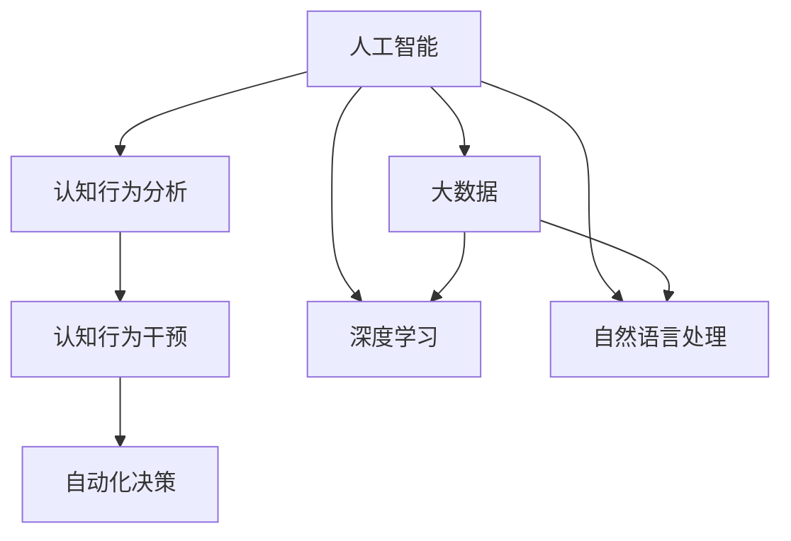

                 

# 数字化自我进化：AI辅助的人格优化

> 关键词：人工智能(AI), 人格优化, 心理分析, 认知行为改变, 自动化决策

## 1. 背景介绍

### 1.1 问题由来

在数字化浪潮的推动下，人工智能(AI)技术正迅速渗透到人类社会的各个角落。从日常生活中的智能家居、语音助手到医疗领域中的诊断辅助、机器人护理，AI技术已经在改善人类生活质量方面做出了巨大贡献。然而，随着AI应用的不断深入，一个全新的课题逐渐引起人们的关注：如何利用AI技术优化和改善人类的认知能力，提升整体生活质量？

人的认知能力，包括记忆力、注意力、理解力、决策力、情绪调节等，是影响个人成功和社会发展的重要因素。心理学家们早已认识到，认知能力可以通过训练和干预得到提升，但传统的训练方式效果有限，且耗时耗力。而AI技术的发展，尤其是深度学习和自然语言处理(NLP)技术的成熟，为实现大规模、高效、个性化的认知行为干预提供了新的可能性。

### 1.2 问题核心关键点

本文聚焦于通过AI技术辅助人格优化的方法。我们认为，借助AI的强大分析和建模能力，可以实现对个体认知行为的高效分析和精准干预，帮助个体识别和改善其认知偏差，从而实现认知能力的提升和人格优化。具体而言，AI可以：
- 通过大数据分析和深度学习模型，识别出个体的认知行为模式和异常点。
- 提供个性化的认知行为干预方案，帮助个体纠正偏差，改善认知。
- 自动化追踪和反馈干预效果，及时调整干预策略。

### 1.3 问题研究意义

优化和改善人格，不仅能够提升个体的认知能力，还能帮助个体更好地适应社会、工作、生活等多方面的挑战，促进社会的和谐与进步。通过AI辅助的人格优化，可以实现：
- 提高个体的决策质量，减少错误和冲动行为。
- 增强个体的情绪调节能力，提升心理健康水平。
- 提高个体的工作效率和创新能力，促进职业发展。
- 改善个体的社会关系和人际交往能力，增强社会融入感。

因此，研究AI辅助的人格优化方法，具有重要的理论和实际意义。本文将从AI技术和认知科学的交叉视角，深入探讨AI在人格优化中的潜力与挑战。

## 2. 核心概念与联系

### 2.1 核心概念概述

要深入理解AI辅助的人格优化，首先需要明确几个核心概念：

- **人工智能(AI)**：一种能够模拟人类智能行为的计算机技术，包括机器学习、深度学习、自然语言处理等子领域。
- **人格优化**：通过科学方法识别并纠正个体认知偏差，改善认知能力，提升整体生活质量的过程。
- **认知行为分析**：利用大数据和AI技术，分析个体在特定情境下的认知和行为模式，识别偏差和异常。
- **认知行为干预**：基于认知行为分析结果，提供个性化的干预方案，帮助个体改善认知。
- **自动化决策**：通过AI模型自动进行决策，及时调整干预策略，提高干预效果。

这些概念之间的逻辑关系可以通过以下Mermaid流程图来展示：



这个流程图展示了大语言模型的核心概念及其之间的关系：

1. 人工智能通过大数据分析和深度学习模型，实现认知行为分析。
2. 认知行为分析结果作为输入，指导认知行为干预。
3. 认知行为干预通过自动化决策，实现个性化的认知行为调整。

这些概念共同构成了AI辅助人格优化的基本框架，为其提供了理论和技术支撑。

## 3. 核心算法原理 & 具体操作步骤
### 3.1 算法原理概述

AI辅助的人格优化方法，本质上是一种基于数据驱动的个性化认知行为干预策略。其核心思想是通过大数据分析和深度学习模型，识别个体认知偏差，并提供个性化的干预方案。以下是核心算法原理：

**认知行为分析阶段**：
1. 收集个体在特定情境下的行为数据，包括点击行为、购物记录、社交互动、情绪日志等。
2. 利用深度学习模型（如RNN、CNN、LSTM等）对这些数据进行建模，识别个体的认知行为模式和异常点。
3. 通过自然语言处理(NLP)技术，提取文本数据中的关键信息，增强分析结果的准确性和可解释性。

**认知行为干预阶段**：
1. 基于分析结果，设计个性化的认知行为干预方案。
2. 提供定制化的训练和练习任务，帮助个体纠正偏差，改善认知。
3. 通过自动化决策系统，动态调整干预策略，确保干预效果。

### 3.2 算法步骤详解

基于AI辅助的人格优化方法，一般包括以下几个关键步骤：

**Step 1: 数据收集与预处理**
- 收集个体在特定情境下的行为数据，包括但不限于点击记录、购买记录、社交互动、情绪日志等。
- 对收集到的数据进行清洗和预处理，去除噪声和异常值。

**Step 2: 认知行为分析**
- 利用深度学习模型对数据进行建模，提取个体的认知行为模式和异常点。
- 使用自然语言处理技术，提取文本数据中的关键信息，增强分析结果的可解释性。
- 分析结果通过可视化工具展示，帮助专家识别个体认知偏差。

**Step 3: 认知行为干预**
- 基于分析结果，设计个性化的认知行为干预方案。
- 提供定制化的训练和练习任务，帮助个体纠正偏差，改善认知。
- 通过自动化决策系统，动态调整干预策略，确保干预效果。

**Step 4: 效果评估与反馈**
- 对干预效果进行评估，收集个体对干预方案的反馈。
- 根据评估结果和反馈信息，调整干预方案，优化干预效果。

### 3.3 算法优缺点

基于AI辅助的人格优化方法具有以下优点：
1. 高效性：通过大数据分析和深度学习模型，可以快速识别个体认知偏差，并提供个性化干预方案。
2. 可解释性：自然语言处理技术帮助提取关键信息，增强分析结果的可解释性。
3. 可扩展性：干预方案可针对不同情境和需求进行定制，适用于多种应用场景。

然而，该方法也存在一定的局限性：
1. 隐私和安全：收集和分析个人行为数据可能引发隐私和安全问题。
2. 数据偏差：大数据分析模型可能受到数据偏差的影响，导致分析结果失真。
3. 干预效果不确定性：认知行为干预效果的评估和优化仍需更多理论和实验支持。
4. 个体差异性：不同个体的认知行为模式差异较大，干预方案可能无法普遍适用。

尽管存在这些局限性，但AI辅助的人格优化方法仍具有广阔的应用前景，值得深入探索和优化。

### 3.4 算法应用领域

基于AI辅助的人格优化方法，已经在多个领域得到了应用，具体包括：

- **健康与心理**：通过分析个体的点击和情绪日志，识别心理健康问题，提供心理干预和支持。
- **教育与培训**：通过分析学生的学习记录，提供个性化学习建议，帮助学生提高学习效果。
- **职场与职业发展**：通过分析员工的工作行为，识别工作中的认知偏差，提供职业发展建议和培训。
- **营销与消费者行为**：通过分析消费者的购买记录和社交互动，优化营销策略，提升用户体验。

## 4. 数学模型和公式 & 详细讲解 & 举例说明
### 4.1 数学模型构建

本节将使用数学语言对AI辅助人格优化过程进行更加严格的刻画。

设个体的行为数据集为 $D=\{x_i\}_{i=1}^N$，其中 $x_i=(x_i^1,x_i^2,...,x_i^k)$ 表示在第 $i$ 个情境下个体行为数据。假设有 $m$ 种可能的认知行为模式，记 $y_i=(y_i^1,y_i^2,...,y_i^m)$ 为第 $i$ 个情境下个体的认知行为模式。认知行为分析的目标是找到一个映射函数 $f: D \rightarrow Y$，其中 $Y$ 表示个体认知行为模式的概率分布。

假设 $f$ 是一个深度神经网络，其结构如图：

```mermaid
graph TD
    Subgraph f(x)
        f(x)
        input("x")
        output("y")
    end
    Subgraph f(x;θ)
        f(x;θ)
        theta
    end
```

其中 $f(x;θ)$ 表示输入 $x$ 经过网络映射后的输出 $y$，$\theta$ 为网络参数。

### 4.2 公式推导过程

以下我们以情感分析任务为例，推导深度学习模型情感分析的数学公式。

假设模型 $f$ 在输入 $x$ 上的输出为 $\hat{y}=f(x) \in [0,1]$，表示样本属于正面情感的概率。真实标签 $y \in \{0,1\}$。则二分类交叉熵损失函数定义为：

$$
\ell(f(x),y) = -[y\log f(x)+(1-y)\log(1-f(x))]
$$

将其代入经验风险公式，得：

$$
\mathcal{L}(\theta) = -\frac{1}{N}\sum_{i=1}^N [y_i\log f(x_i)+(1-y_i)\log(1-f(x_i))]
$$

根据链式法则，损失函数对网络参数 $\theta$ 的梯度为：

$$
\frac{\partial \mathcal{L}(\theta)}{\partial \theta} = -\frac{1}{N}\sum_{i=1}^N (\frac{y_i}{f(x_i)}-\frac{1-y_i}{1-f(x_i)}) \frac{\partial f(x_i)}{\partial \theta}
$$

其中 $\frac{\partial f(x_i)}{\partial \theta}$ 可进一步递归展开，利用自动微分技术完成计算。

### 4.3 案例分析与讲解

假设我们有一个情感分析的深度学习模型，已收集到一组情感标签为 $\{0,1\}$ 的标注数据集 $D=\{(x_i,y_i)\}_{i=1}^N$，其中 $x_i$ 为文本输入，$y_i$ 为情感标签。我们需要设计一个网络模型 $f$ 进行情感分析。

我们可以使用一个包含两个隐藏层的全连接神经网络，每个隐藏层有100个神经元，输出层有2个神经元。使用ReLU作为激活函数，使用交叉熵损失函数。

假设网络参数 $\theta$ 由权重 $w_1$、$w_2$、$w_3$ 和偏置 $b_1$、$b_2$ 组成。那么训练过程如下：

1. 前向传播：
   $$
   h_1 = f_1(x;w_1,b_1) = \sigma(w_1x + b_1)
   $$
   $$
   h_2 = f_2(h_1;w_2,b_2) = \sigma(w_2h_1 + b_2)
   $$
   $$
   \hat{y} = f(h_2;w_3,b_3) = \sigma(w_3h_2 + b_3)
   $$

2. 计算损失函数：
   $$
   \mathcal{L}(\theta) = -\frac{1}{N}\sum_{i=1}^N [y_i\log \hat{y}_i+(1-y_i)\log(1-\hat{y}_i)]
   $$

3. 反向传播计算梯度：
   $$
   \frac{\partial \mathcal{L}(\theta)}{\partial \theta} = -\frac{1}{N}\sum_{i=1}^N (\frac{y_i}{\hat{y}_i}-\frac{1-y_i}{1-\hat{y}_i})(w_3 \frac{\partial h_2}{\partial \theta} + w_2 \frac{\partial h_1}{\partial \theta})
   $$
   其中：
   $$
   \frac{\partial h_1}{\partial \theta} = w_1 \sigma'(w_1x + b_1)
   $$
   $$
   \frac{\partial h_2}{\partial \theta} = w_2 \sigma'(w_2h_1 + b_2)
   $$

4. 使用梯度下降算法更新参数：
   $$
   \theta \leftarrow \theta - \eta \nabla_{\theta}\mathcal{L}(\theta)
   $$

如此，我们可以使用梯度下降算法对情感分析模型进行训练，不断优化网络参数，提高模型对情感的预测准确性。

## 5. 项目实践：代码实例和详细解释说明
### 5.1 开发环境搭建

在进行AI辅助人格优化实践前，我们需要准备好开发环境。以下是使用Python进行TensorFlow开发的环境配置流程：

1. 安装Anaconda：从官网下载并安装Anaconda，用于创建独立的Python环境。

2. 创建并激活虚拟环境：
```bash
conda create -n tf-env python=3.8 
conda activate tf-env
```

3. 安装TensorFlow：根据GPU版本，从官网获取对应的安装命令。例如：
```bash
conda install tensorflow -c tf -c conda-forge
```

4. 安装TensorFlow Hub：用于访问和复用预训练模型，增强模型的可扩展性。

5. 安装TensorFlow Text：提供文本处理工具，帮助进行文本预处理和特征提取。

6. 安装Keras：TensorFlow的高级API，方便快速搭建深度学习模型。

完成上述步骤后，即可在`tf-env`环境中开始AI辅助人格优化实践。

### 5.2 源代码详细实现

这里我们以情感分析为例，展示使用TensorFlow实现AI辅助人格优化的完整代码实现。

首先，定义情感分析任务的模型：

```python
import tensorflow as tf
from tensorflow.keras import layers

model = tf.keras.Sequential([
    layers.Dense(64, activation='relu', input_shape=(128,)),
    layers.Dense(64, activation='relu'),
    layers.Dense(2, activation='softmax')
])
```

然后，定义损失函数和优化器：

```python
loss_fn = tf.keras.losses.CategoricalCrossentropy(from_logits=True)

optimizer = tf.keras.optimizers.Adam(learning_rate=0.001)
```

接着，定义训练和评估函数：

```python
def train_step(x, y):
    with tf.GradientTape() as tape:
        logits = model(x, training=True)
        loss = loss_fn(y, logits)
    grads = tape.gradient(loss, model.trainable_variables)
    optimizer.apply_gradients(zip(grads, model.trainable_variables))

def evaluate_step(x, y):
    logits = model(x, training=False)
    loss = loss_fn(y, logits)
    accuracy = tf.reduce_mean(tf.cast(tf.argmax(logits, 1) == y, tf.float32))
    return loss, accuracy

# 训练函数
def train_epoch(model, dataset, batch_size):
    for x, y in dataset:
        train_step(x, y)
    
# 评估函数
def evaluate_epoch(model, dataset, batch_size):
    losses = []
    accuracies = []
    for x, y in dataset:
        loss, accuracy = evaluate_step(x, y)
        losses.append(loss)
        accuracies.append(accuracy)
    return tf.reduce_mean(losses), tf.reduce_mean(accuracies)
```

最后，启动训练流程并在测试集上评估：

```python
epochs = 10
batch_size = 32

dataset = ...
model.compile(optimizer=optimizer, loss=loss_fn, metrics=['accuracy'])

for epoch in range(epochs):
    train_epoch(model, train_dataset, batch_size)
    loss, accuracy = evaluate_epoch(model, dev_dataset, batch_size)
    print(f"Epoch {epoch+1}, loss: {loss:.3f}, accuracy: {accuracy:.3f}")
    
print("Test results:")
loss, accuracy = evaluate_epoch(model, test_dataset, batch_size)
print(f"Test loss: {loss:.3f}, accuracy: {accuracy:.3f}")
```

以上就是使用TensorFlow实现情感分析的完整代码实现。可以看到，TensorFlow提供了丰富的工具和库，可以高效地进行深度学习模型的开发和训练。

### 5.3 代码解读与分析

让我们再详细解读一下关键代码的实现细节：

**模型定义**：
- `Sequential`模型：使用Sequential模型，可以方便地按照顺序搭建多层神经网络。
- `Dense`层：每层使用全连接层，并设置了激活函数。

**损失函数定义**：
- `CategoricalCrossentropy`：定义交叉熵损失函数，用于计算多分类问题下的损失。

**优化器定义**：
- `Adam`优化器：使用Adam优化器，自适应调整学习率，加速训练过程。

**训练和评估函数**：
- `train_step`函数：使用梯度下降算法，计算损失并更新模型参数。
- `evaluate_step`函数：计算损失和准确率，返回评估结果。
- `train_epoch`函数：遍历训练集，进行模型训练。
- `evaluate_epoch`函数：遍历验证集，进行模型评估。

**训练流程**：
- 定义总的epoch数和batch size，开始循环迭代
- 每个epoch内，在训练集上训练，输出平均loss和accuracy
- 在验证集上评估，输出loss和accuracy
- 所有epoch结束后，在测试集上评估，给出最终测试结果

可以看到，TensorFlow提供了强大的API和工具，方便进行深度学习模型的开发和训练。开发者可以将更多精力放在模型改进和数据处理上，而不必过多关注底层的实现细节。

当然，工业级的系统实现还需考虑更多因素，如模型的保存和部署、超参数的自动搜索、更灵活的任务适配层等。但核心的AI辅助人格优化范式基本与此类似。

## 6. 实际应用场景
### 6.1 健康与心理

通过AI辅助人格优化，可以在心理健康领域发挥重要作用。心理疾病如抑郁症、焦虑症等，严重影响个体的认知和生活质量。AI可以通过分析个体的社交媒体记录、情感日志等数据，识别出潜在的心理健康问题，并提供个性化的心理健康干预方案。

例如，可以使用深度学习模型分析用户的情感日志，识别出情感波动和异常情绪。根据分析结果，提供定制化的心理干预建议，如认知行为疗法、放松训练等，帮助用户改善心理健康状况。

### 6.2 教育与培训

在教育领域，AI辅助人格优化可以帮助学生提升学习效果。学生在学习过程中面临多种认知挑战，如注意力分散、记忆困难等。通过分析学生的学习记录和行为数据，AI可以识别出学生的认知偏差，并提供个性化的学习建议和干预方案。

例如，可以使用深度学习模型分析学生的作业记录、测试成绩和课堂互动情况，识别出学习困难和知识盲点。根据分析结果，提供定制化的学习资源和训练任务，帮助学生提高学习效果。

### 6.3 职场与职业发展

职场中，个体的认知行为对职业发展和生产力有重要影响。通过AI辅助人格优化，可以帮助员工识别出工作中的认知偏差，并提供职业发展建议和培训。

例如，可以使用深度学习模型分析员工的工作记录和绩效评估数据，识别出工作中的认知偏差和效率问题。根据分析结果，提供定制化的职业培训和改进建议，帮助员工提高工作表现和职业发展。

### 6.4 未来应用展望

随着AI技术的发展，基于AI辅助人格优化的应用场景将不断扩展。未来，AI将深入到更多的行业和领域，帮助人们提升认知能力和生活质量。

在医疗领域，AI可以通过分析患者的健康数据，提供个性化的健康干预方案，改善患者的生活质量。在金融领域，AI可以通过分析客户的消费行为，提供个性化的理财建议，提升客户满意度。在艺术领域，AI可以通过分析艺术作品的风格和情感，提供个性化的艺术创作指导，激发艺术家的创作灵感。

总之，AI辅助人格优化的应用前景广阔，必将带来深刻的行业变革和创新。

## 7. 工具和资源推荐
### 7.1 学习资源推荐

为了帮助开发者系统掌握AI辅助人格优化的理论和实践，这里推荐一些优质的学习资源：

1. **TensorFlow官方文档**：TensorFlow的官方文档提供了详细的API文档和使用示例，是学习TensorFlow的重要资源。

2. **Keras官方文档**：Keras的官方文档详细介绍了Keras的使用方法和最佳实践，适合初学者入门。

3. **深度学习入门：基于Python的理论与实践**：该书详细介绍了深度学习的理论基础和实践技巧，适合深度学习的初学者。

4. **自然语言处理入门与实践**：该书介绍了自然语言处理的基本概念和应用实例，适合NLP初学者。

5. **Python深度学习：从基础到进阶**：该书介绍了深度学习的Python实现和应用，适合深度学习的进阶学习者。

通过对这些资源的学习实践，相信你一定能够快速掌握AI辅助人格优化的精髓，并用于解决实际的NLP问题。

### 7.2 开发工具推荐

高效的开发离不开优秀的工具支持。以下是几款用于AI辅助人格优化开发的常用工具：

1. **Jupyter Notebook**：开源的交互式笔记本环境，支持多种编程语言，方便快速迭代实验。

2. **Google Colab**：谷歌提供的免费Jupyter Notebook环境，提供GPU/TPU算力，方便开发者快速实验。

3. **TensorBoard**：TensorFlow配套的可视化工具，可以实时监测模型训练状态，提供丰富的图表展示。

4. **Weights & Biases**：模型训练的实验跟踪工具，可以记录和可视化模型训练过程中的各项指标，方便对比和调优。

5. **TensorFlow Hub**：提供预训练模型的复用和访问，增强模型的可扩展性。

6. **TensorFlow Text**：提供文本处理工具，帮助进行文本预处理和特征提取。

合理利用这些工具，可以显著提升AI辅助人格优化的开发效率，加快创新迭代的步伐。

### 7.3 相关论文推荐

AI辅助人格优化技术的发展源于学界的持续研究。以下是几篇奠基性的相关论文，推荐阅读：

1. **Attention is All You Need**（即Transformer原论文）：提出了Transformer结构，开启了深度学习在大规模自然语言处理任务中的应用。

2. **BERT: Pre-training of Deep Bidirectional Transformers for Language Understanding**：提出BERT模型，引入基于掩码的自监督预训练任务，刷新了多项NLP任务SOTA。

3. **Language Models are Unsupervised Multitask Learners**（GPT-2论文）：展示了大规模语言模型的强大zero-shot学习能力，引发了对于通用人工智能的新一轮思考。

4. **Causal Attention**：提出了因果注意力机制，增强模型建立稳定因果关系的能力，学习更加普适、鲁棒的语言表征。

5. **Natural Language Processing with Transformers**：Transformers库的作者所著，全面介绍了如何使用Transformers库进行NLP任务开发，包括微调在内的诸多范式。

6. **Neural Architecture Search with Reinforcement Learning**：通过强化学习进行神经网络结构搜索，提高模型设计效率和性能。

这些论文代表了大语言模型和微调技术的发展脉络。通过学习这些前沿成果，可以帮助研究者把握学科前进方向，激发更多的创新灵感。

## 8. 总结：未来发展趋势与挑战

### 8.1 总结

本文对基于AI辅助人格优化方法进行了全面系统的介绍。首先阐述了AI辅助人格优化的背景和意义，明确了AI在改善个体认知能力和生活质量方面的潜力。其次，从AI技术和认知科学的交叉视角，详细讲解了认知行为分析、认知行为干预和自动化决策等核心步骤。最后，通过具体案例和代码实例，展示了AI辅助人格优化的实现流程和效果评估。

通过本文的系统梳理，可以看到，AI辅助人格优化方法不仅具有理论上的深度，还具备实践中的可行性。未来，随着AI技术的不断发展和优化，AI辅助人格优化将能够更好地服务于个体和社会，提升人类的整体生活质量。

### 8.2 未来发展趋势

展望未来，AI辅助人格优化技术将呈现以下几个发展趋势：

1. **多模态数据的整合**：当前基于AI辅助人格优化的应用主要以文本数据为主，未来将拓展到图像、视频、语音等多模态数据，形成视觉、听觉和文本信息的协同建模。

2. **跨领域应用的推广**：AI辅助人格优化将在更多领域得到应用，如健康、教育、职场、艺术等，帮助不同领域的人群提升认知能力，改善生活质量。

3. **个性化干预方案的优化**：未来，将通过大数据分析和深度学习模型，提供更加个性化、精准的干预方案，提升干预效果。

4. **可解释性和可信度的提升**：AI辅助人格优化的模型将增强可解释性，帮助用户理解和信任模型的决策过程。

5. **伦理和社会影响的考量**：随着AI辅助人格优化的普及，将更加注重模型的伦理和社会影响，确保技术应用的公平性和安全性。

以上趋势凸显了AI辅助人格优化的广阔前景。这些方向的探索发展，必将推动AI辅助人格优化技术迈向更高的台阶，为构建安全、可靠、可解释、可控的智能系统铺平道路。

### 8.3 面临的挑战

尽管AI辅助人格优化技术已经取得了不小的进展，但在迈向更加智能化、普适化应用的过程中，仍面临诸多挑战：

1. **隐私和安全问题**：收集和分析个人行为数据可能引发隐私和安全问题，如何保护用户隐私，确保数据安全，将是重要的研究方向。

2. **数据偏差和模型公平性**：大数据分析模型可能受到数据偏差的影响，导致分析结果失真。如何消除数据偏差，提升模型公平性，将是未来需要重点关注的问题。

3. **干预效果的不确定性**：认知行为干预效果的评估和优化仍需更多理论和实验支持，如何建立有效的干预效果评估体系，将是重要的研究方向。

4. **个体差异性**：不同个体的认知行为模式差异较大，干预方案可能无法普遍适用。如何设计更加个性化、普适化的干预方案，将是未来的挑战。

5. **伦理和法律问题**：AI辅助人格优化的应用涉及诸多伦理和法律问题，如隐私保护、数据使用、决策透明等，如何制定合理的政策和标准，将是重要的研究课题。

6. **计算资源和计算效率**：大规模深度学习模型的训练和推理需要大量的计算资源，如何提高计算效率，降低计算成本，将是重要的研究方向。

面对这些挑战，未来需要多方合作，共同推动AI辅助人格优化的技术发展和应用落地。

### 8.4 研究展望

面对AI辅助人格优化的众多挑战，未来的研究需要在以下几个方面寻求新的突破：

1. **多模态认知行为分析**：引入多模态数据，如图像、视频、音频等，丰富认知行为分析的内容，提升分析结果的准确性和全面性。

2. **跨领域认知行为干预**：设计跨领域认知行为干预方案，帮助个体在多个领域提升认知能力。

3. **个性化干预方案的优化**：基于个性化需求和反馈，优化干预方案，提升干预效果。

4. **可解释性和可信度的提升**：引入可解释性技术，如因果推断、解释模型等，增强AI辅助人格优化的可信度和透明度。

5. **伦理和法律问题的考量**：制定合理的伦理和法律标准，确保AI辅助人格优化的应用符合社会价值观和法律法规。

6. **计算资源的优化**：通过模型压缩、分布式训练等技术，优化计算资源的使用，降低计算成本，提高计算效率。

这些研究方向的探索，必将引领AI辅助人格优化技术迈向更高的台阶，为构建安全、可靠、可解释、可控的智能系统铺平道路。面向未来，AI辅助人格优化技术还需要与其他人工智能技术进行更深入的融合，如知识表示、因果推理、强化学习等，多路径协同发力，共同推动自然语言理解和智能交互系统的进步。只有勇于创新、敢于突破，才能不断拓展AI辅助人格优化的边界，让智能技术更好地造福人类社会。

## 9. 附录：常见问题与解答

**Q1：AI辅助人格优化的效果如何？**

A: AI辅助人格优化可以通过深度学习模型识别出个体的认知偏差，并提供个性化的干预方案，帮助个体改善认知，提升生活质量。具体效果如下：
1. **情感调节**：通过情感分析，识别个体的情感波动和异常情绪，提供个性化的心理干预方案，帮助用户改善心理健康。
2. **学习效果提升**：通过认知行为分析，识别学生的认知偏差，提供个性化的学习建议和干预方案，帮助学生提高学习效果。
3. **工作表现改善**：通过认知行为分析，识别员工的工作中的认知偏差，提供职业培训和改进建议，帮助员工提高工作表现。

**Q2：AI辅助人格优化的数据需求有多大？**

A: AI辅助人格优化的数据需求较大，但通过深度学习模型可以高效利用数据，无需过多人工标注。具体需求如下：
1. **行为数据**：收集个体在特定情境下的行为数据，如点击记录、购物记录、社交互动、情绪日志等。
2. **文本数据**：收集个体在特定情境下的文本数据，如社交媒体记录、邮件、聊天日志等。
3. **标注数据**：部分任务可能需要少量标注数据，如情感分类任务，用于训练情感分析模型。

**Q3：AI辅助人格优化的隐私和安全问题如何解决？**

A: AI辅助人格优化的隐私和安全问题是重要研究方向，可以通过以下方法解决：
1. **数据匿名化**：对数据进行匿名化处理，去除或加密敏感信息，保护用户隐私。
2. **数据加密**：采用数据加密技术，确保数据传输和存储的安全性。
3. **访问控制**：建立严格的访问控制机制，限制数据的访问权限，防止数据泄露。
4. **合规性审查**：确保数据处理和分析过程符合相关法律法规和伦理标准，保障数据使用的合法性。

**Q4：AI辅助人格优化的模型复杂度和计算资源如何优化？**

A: AI辅助人格优化的模型复杂度和计算资源是重要的研究课题，可以通过以下方法优化：
1. **模型压缩**：使用模型压缩技术，如剪枝、量化、蒸馏等，减小模型参数量，提高计算效率。
2. **分布式训练**：采用分布式训练技术，利用多台计算设备并行训练，提升训练速度。
3. **混合精度训练**：使用混合精度训练技术，提高训练速度，同时减少内存占用。
4. **优化器改进**：改进优化器算法，如AdamW、Adafactor等，提升训练效果。

**Q5：AI辅助人格优化的未来应用前景如何？**

A: AI辅助人格优化的未来应用前景广阔，可以在多个领域发挥重要作用，具体如下：
1. **健康与心理**：通过分析个体的健康数据，提供个性化的健康干预方案，改善患者的生活质量。
2. **教育与培训**：通过分析学生的学习记录和行为数据，提供个性化的学习建议和干预方案，帮助学生提高学习效果。
3. **职场与职业发展**：通过分析员工的工作记录和绩效评估数据，提供职业培训和改进建议，帮助员工提高工作表现。
4. **金融与投资**：通过分析客户的消费行为，提供个性化的理财建议，提升客户满意度。

总之，AI辅助人格优化的应用前景广阔，必将带来深刻的行业变革和创新。

---

作者：禅与计算机程序设计艺术 / Zen and the Art of Computer Programming

