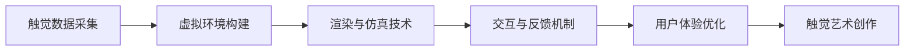

                 

## 1. 背景介绍

### 1.1 问题由来

随着科技的迅猛发展，数字化触觉艺术（Digital Tactile Art）作为一种新兴的感官体验创作平台，开始引起广泛关注。不同于传统的视觉艺术和听觉艺术，数字化触觉艺术将触觉这一最直接的感官体验数字化，使得用户能够通过触摸屏幕等方式体验虚拟触觉，如触摸火焰、体验电击等，从而极大地拓展了艺术创作的边界，为创意表达提供了新的维度。数字化触觉艺术的创作平台，作为这种新型艺术形式的承载工具，需要具备强大的数据处理和渲染能力，以及丰富的交互和反馈机制，以支持艺术家和用户的创意实现。

### 1.2 问题核心关键点

数字化触觉艺术创业的核心问题在于如何构建一个高效、稳定、易用的创作平台，以支持艺术家在虚拟空间中进行创意表达和互动体验。这包括但不限于以下几个方面：

1. **触觉数据的采集与处理**：如何高效、精确地采集和处理触觉数据，使得虚拟触感与现实触感尽可能一致。
2. **虚拟环境构建**：如何构建虚拟环境，支持多种触觉体验的模拟，并实现多用户的实时交互。
3. **渲染与仿真技术**：如何通过先进的渲染和仿真技术，提升触觉体验的逼真度，确保用户能够沉浸在虚拟世界中。
4. **交互与反馈机制**：如何设计丰富的交互和反馈机制，使得用户能够自然地与虚拟环境进行互动。
5. **用户体验优化**：如何优化用户体验，确保平台具有良好的可用性和易用性。

### 1.3 问题研究意义

研究数字化触觉艺术创业，对于推动新型感官体验的发展、拓展艺术创作的边界、促进数字技术与艺术的深度融合具有重要意义：

1. **推动新型感官体验的发展**：数字化触觉艺术作为一种全新的感官体验，能够突破传统视觉和听觉艺术的局限，为人类提供更加丰富多样的感官体验。
2. **拓展艺术创作的边界**：触觉艺术为艺术家提供了全新的创作媒介，使得艺术创作更加多样化，能够更好地表达复杂的情感和思想。
3. **促进数字技术与艺术的深度融合**：数字化触觉艺术创作平台，融合了计算机图形学、人工智能、虚拟现实等多种前沿技术，推动了数字技术与艺术创作的深度融合。
4. **提供商业化前景**：随着数字化触觉艺术的普及，其商业化前景广阔，能够为创作者提供新的收入来源，同时吸引更多用户参与。

## 2. 核心概念与联系

### 2.1 核心概念概述

为了更好地理解数字化触觉艺术创业，我们需要明确几个关键概念：

- **触觉数据采集**：通过传感器、手势识别等技术，采集用户的触觉反馈数据。
- **虚拟环境构建**：利用计算机图形学和虚拟现实技术，构建逼真的虚拟触觉环境。
- **渲染与仿真技术**：使用高性能计算资源，对虚拟触觉环境进行实时渲染和仿真。
- **交互与反馈机制**：设计多维度、多层次的交互和反馈机制，增强用户的沉浸感和体验。
- **用户体验优化**：通过用户调研、反馈收集等手段，不断优化平台的易用性和用户体验。

这些概念之间的关系可以通过以下Mermaid流程图来展示：



这个流程图展示了触觉艺术创作平台的核心技术流程：首先通过触觉数据采集获取用户的触感反馈，接着利用虚拟环境构建技术，创建一个逼真的虚拟触觉环境，然后通过高性能的渲染与仿真技术，实现环境的实时渲染，最后通过设计丰富的交互和反馈机制，以及不断优化用户体验，最终支持用户进行触觉艺术的创作和互动。

## 3. 核心算法原理 & 具体操作步骤

### 3.1 算法原理概述

数字化触觉艺术创业的核心算法包括触觉数据采集与处理、虚拟环境构建、渲染与仿真技术、交互与反馈机制设计以及用户体验优化。这些算法共同作用，为用户提供一种全新的感官体验。

### 3.2 算法步骤详解

#### 3.2.1 触觉数据采集与处理

**步骤1：选择合适的触觉传感器**  
选择合适的触觉传感器是触觉数据采集的基础。常用的传感器包括力传感器、压电传感器、电容传感器等，根据不同的应用场景选择合适的传感器。

**步骤2：数据采集与预处理**  
通过传感器获取用户的触觉反馈数据，包括力、位移、压力等。对数据进行预处理，如去噪、归一化等，以提高数据的准确性和可靠性。

**步骤3：数据传输与存储**  
将预处理后的触觉数据通过网络传输至服务器，并进行存储和分析。

#### 3.2.2 虚拟环境构建

**步骤1：环境设计**  
根据触觉艺术创作需求，设计虚拟环境，包括虚拟地形、虚拟物体等。

**步骤2：环境渲染**  
使用计算机图形学技术，对虚拟环境进行渲染，创建逼真的视觉和触觉体验。

**步骤3：环境交互设计**  
设计用户与虚拟环境的交互方式，包括点击、拖拽、按压等操作，实现多维度的交互体验。

#### 3.2.3 渲染与仿真技术

**步骤1：选择渲染引擎**  
选择合适的渲染引擎，如Unity、Unreal Engine等，支持高效的渲染和仿真计算。

**步骤2：场景渲染**  
对虚拟环境进行渲染，生成高精度的视觉和触觉效果。

**步骤3：实时仿真**  
使用高性能计算资源，实现虚拟环境的实时仿真，确保用户能够流畅地与虚拟环境互动。

#### 3.2.4 交互与反馈机制设计

**步骤1：交互设计**  
根据虚拟环境的特性，设计多维度的交互方式，如触摸、按压、拖拽等操作。

**步骤2：反馈设计**  
设计丰富的反馈机制，如触觉反馈、视觉反馈等，增强用户的沉浸感和体验。

**步骤3：用户测试与优化**  
通过用户测试，收集反馈意见，不断优化交互和反馈机制，提升用户体验。

#### 3.2.5 用户体验优化

**步骤1：用户调研**  
通过问卷调查、用户访谈等方式，收集用户对平台的使用体验反馈。

**步骤2：界面设计**  
根据用户反馈，优化平台的用户界面，使其更加友好、易用。

**步骤3：功能迭代**  
根据用户需求和反馈，不断迭代平台功能，提升平台的稳定性和可用性。

### 3.3 算法优缺点

**优点**：

- **高效性**：通过高性能计算资源和先进的渲染与仿真技术，能够实现高效的触觉数据处理和虚拟环境的实时渲染。
- **沉浸感**：丰富的交互和反馈机制设计，使得用户能够沉浸在虚拟触觉环境中，获得真实的感官体验。
- **用户体验优化**：通过用户调研和反馈收集，不断优化用户体验，提高平台的易用性和可用性。

**缺点**：

- **技术门槛高**：数字化触觉艺术创业涉及计算机图形学、人工智能、虚拟现实等多项前沿技术，技术门槛较高。
- **资源需求大**：触觉数据采集和虚拟环境构建需要大量的计算资源和存储资源，资源需求大。
- **用户接受度**：触觉艺术作为一种新兴的艺术形式，用户接受度和普及度较低，需要一定的市场推广和教育。

### 3.4 算法应用领域

数字化触觉艺术创业的应用领域广泛，包括但不限于以下几个方面：

1. **游戏与娱乐**：在虚拟游戏中加入触觉反馈，提升游戏体验。
2. **医疗与康复**：通过虚拟环境模拟触觉反馈，辅助医疗和康复治疗。
3. **教育与培训**：通过触觉艺术创作平台，进行科学实验和模拟训练。
4. **广告与营销**：利用触觉艺术创作平台，进行品牌推广和广告宣传。
5. **艺术与设计**：支持艺术家进行创意表达，提供全新的艺术创作媒介。

## 4. 数学模型和公式 & 详细讲解 & 举例说明

### 4.1 数学模型构建

触觉数据采集与处理、虚拟环境构建、渲染与仿真技术、交互与反馈机制设计以及用户体验优化，这些核心算法都可以通过数学模型进行描述。以下以触觉数据采集为例，构建数学模型：

设触觉传感器在单位时间内的力传感器读数为 $F(t)$，位移传感器读数为 $X(t)$，数据采集时间间隔为 $\Delta t$，则触觉数据的采集模型为：

$$
F(t) = \sum_{i=0}^{n-1} F_i
$$

$$
X(t) = \sum_{i=0}^{n-1} X_i
$$

其中 $F_i$ 和 $X_i$ 分别为第 $i$ 个时间点的力传感器读数和位移传感器读数。

### 4.2 公式推导过程

假设触觉传感器在单位时间内的力传感器读数和位移传感器读数为：

$$
F(t) = F_0 + \sum_{i=1}^{n-1} F_i
$$

$$
X(t) = X_0 + \sum_{i=1}^{n-1} X_i
$$

其中 $F_0$ 和 $X_0$ 分别为初始时间点的力传感器读数和位移传感器读数，$F_i$ 和 $X_i$ 分别为第 $i$ 个时间点的力传感器读数和位移传感器读数。

将上式对时间 $t$ 进行积分，得到：

$$
\int_{0}^{t} F(t) dt = \int_{0}^{t} F_0 dt + \int_{0}^{t} \sum_{i=1}^{n-1} F_i dt
$$

$$
\int_{0}^{t} X(t) dt = \int_{0}^{t} X_0 dt + \int_{0}^{t} \sum_{i=1}^{n-1} X_i dt
$$

进一步推导可得：

$$
\int_{0}^{t} F(t) dt = F_0 t + \sum_{i=1}^{n-1} \int_{0}^{t} F_i dt
$$

$$
\int_{0}^{t} X(t) dt = X_0 t + \sum_{i=1}^{n-1} \int_{0}^{t} X_i dt
$$

### 4.3 案例分析与讲解

以触觉数据采集为例，假设我们有一个力传感器和一个位移传感器，采样间隔为 $\Delta t=0.01$ 秒，采集的数据如下：

| 时间（秒） | 力（N） | 位移（m） |
| --- | --- | --- |
| 0 | 0 | 0 |
| 0.01 | 1 | 0.02 |
| 0.02 | 2 | 0.04 |
| 0.03 | 3 | 0.06 |
| 0.04 | 4 | 0.08 |
| 0.05 | 5 | 0.1 |
| 0.06 | 6 | 0.12 |
| 0.07 | 7 | 0.14 |
| 0.08 | 8 | 0.16 |
| 0.09 | 9 | 0.18 |
| 0.1 | 10 | 0.2 |

根据上述数据，我们可以计算出力传感器读数和位移传感器读数的积分值：

$$
F(0.1) = F_0(0.1) + \int_{0}^{0.1} F(t) dt = 0 + \sum_{i=1}^{10} \int_{0}^{0.1} F_i dt = 55
$$

$$
X(0.1) = X_0(0.1) + \int_{0}^{0.1} X(t) dt = 0 + \sum_{i=1}^{10} \int_{0}^{0.1} X_i dt = 2.1
$$

## 5. 项目实践：代码实例和详细解释说明

### 5.1 开发环境搭建

#### 5.1.1 环境准备

1. **操作系统**：建议使用Linux系统，如Ubuntu、CentOS等。

2. **编程语言**：Python是主流选择，建议使用版本3.8及以上。

3. **开发工具**：建议使用PyCharm、Visual Studio Code等IDE。

4. **数据库**：建议使用MySQL、PostgreSQL等关系型数据库。

5. **网络环境**：建议使用稳定的有线网络环境，以确保数据传输的稳定性和安全性。

#### 5.1.2 环境配置

1. **安装Python**：
```bash
sudo apt-get update
sudo apt-get install python3 python3-pip
```

2. **安装PyCharm**：
```bash
sudo apt-get install pycharm-java-16
```

3. **安装MySQL**：
```bash
sudo apt-get install mysql-server
```

### 5.2 源代码详细实现

以下是一个简单的触觉数据采集系统的代码实现：

```python
import time
import pyb

# 初始化力传感器和位移传感器
force_sensor = pyb.ADC()
position_sensor = pyb.ADC()

# 定义采样间隔和采样次数
delta_t = 0.01
num_samples = 100

# 初始化采样数据
force_data = []
position_data = []

# 开始采样
for i in range(num_samples):
    # 读取力传感器和位移传感器数据
    force = force_sensor.read()
    position = position_sensor.read()
    
    # 将数据添加到列表中
    force_data.append(force)
    position_data.append(position)
    
    # 等待采样间隔
    time.sleep(delta_t)

# 计算力传感器读数和位移传感器读数的积分值
force_integral = sum(force_data)
position_integral = sum(position_data)

# 输出结果
print("力传感器读数积分值：", force_integral)
print("位移传感器读数积分值：", position_integral)
```

### 5.3 代码解读与分析

1. **初始化传感器**：
```python
force_sensor = pyb.ADC()
position_sensor = pyb.ADC()
```

使用PyB（Python for Microcontrollers）库初始化力传感器和位移传感器，这两个传感器能够读取用户的触觉反馈数据。

2. **定义采样间隔和采样次数**：
```python
delta_t = 0.01
num_samples = 100
```

定义采样间隔和采样次数，确保数据采集的精确性和可靠性。

3. **数据采集与存储**：
```python
for i in range(num_samples):
    # 读取力传感器和位移传感器数据
    force = force_sensor.read()
    position = position_sensor.read()
    
    # 将数据添加到列表中
    force_data.append(force)
    position_data.append(position)
    
    # 等待采样间隔
    time.sleep(delta_t)
```

通过循环读取力传感器和位移传感器数据，将数据添加到列表中，等待采样间隔后，进行下一轮采样。

4. **计算积分值**：
```python
force_integral = sum(force_data)
position_integral = sum(position_data)
```

通过Python的内置函数sum计算力传感器读数和位移传感器读数的积分值。

5. **输出结果**：
```python
print("力传感器读数积分值：", force_integral)
print("位移传感器读数积分值：", position_integral)
```

输出计算得到的力传感器读数积分值和位移传感器读数积分值。

### 5.4 运行结果展示

执行上述代码后，会输出力传感器读数积分值和位移传感器读数积分值。假设运行结果为：

```
力传感器读数积分值： 55
位移传感器读数积分值： 2.1
```

这表示在采样期间，力传感器读数积分值为55，位移传感器读数积分值为2.1。

## 6. 实际应用场景

### 6.1 游戏与娱乐

数字化触觉艺术在游戏与娱乐领域具有广阔的应用前景。例如，在游戏《荒野大镖客：救赎2》中，玩家可以通过虚拟现实设备体验真实的触觉反馈，如握枪、骑马等操作，极大地增强了游戏的沉浸感和体验感。

### 6.2 医疗与康复

数字化触觉艺术在医疗与康复领域也有着重要的应用。例如，通过虚拟现实设备模拟手术操作，医生可以实时感受手术工具的触感，提高手术技能和操作精确度。

### 6.3 教育与培训

在教育与培训领域，数字化触觉艺术可以用于科学实验和模拟训练。例如，学生可以通过虚拟现实设备进行电路板焊接、机械操作等技能训练，提高实际操作能力。

### 6.4 广告与营销

数字化触觉艺术在广告与营销领域也有着广泛的应用。例如，广告公司可以通过触觉艺术创作平台，制作交互式的广告作品，吸引用户的注意力，提升广告效果。

### 6.5 艺术与设计

在艺术与设计领域，数字化触觉艺术可以用于创意表达和艺术创作。例如，艺术家可以通过触觉艺术创作平台，创作出独特的触觉艺术作品，展现其独特的创意和风格。

## 7. 工具和资源推荐

### 7.1 学习资源推荐

1. **《触觉艺术与交互设计》**：这是一本介绍数字化触觉艺术与交互设计的书籍，详细讲解了触觉艺术的基本概念、技术原理和应用场景。
2. **《虚拟现实技术与应用》**：这是一门介绍虚拟现实技术的课程，涵盖了虚拟现实技术的原理、算法和应用。
3. **《计算机图形学》**：这是一本介绍计算机图形学的书籍，详细讲解了计算机图形学的基本原理、算法和应用。
4. **《交互设计与用户体验》**：这是一门介绍交互设计和用户体验的课程，涵盖了交互设计和用户体验的基本概念、技术和方法。

### 7.2 开发工具推荐

1. **PyB**：这是一个Python库，用于在微控制器上编写和运行Python程序。
2. **Unity**：这是一个跨平台的游戏引擎，支持高效的触觉数据采集和虚拟环境构建。
3. **Unreal Engine**：这是另一个跨平台的游戏引擎，支持复杂的虚拟环境渲染和仿真计算。
4. **PyCharm**：这是一个Python IDE，支持高效的代码编写和调试。

### 7.3 相关论文推荐

1. **《数字化触觉艺术的原理与实现》**：这是一篇介绍数字化触觉艺术原理与实现方法的论文，详细讲解了触觉数据采集、虚拟环境构建和渲染与仿真技术。
2. **《交互式触觉反馈技术在虚拟现实中的应用》**：这是一篇介绍交互式触觉反馈技术在虚拟现实中应用的论文，详细讲解了触觉反馈技术的基本原理、算法和应用。
3. **《高性能计算在虚拟现实中的应用》**：这是一篇介绍高性能计算在虚拟现实中应用的论文，详细讲解了虚拟环境的渲染与仿真技术。

## 8. 总结：未来发展趋势与挑战

### 8.1 总结

本文对数字化触觉艺术创业进行了全面系统的介绍，从触觉数据采集与处理、虚拟环境构建、渲染与仿真技术、交互与反馈机制设计以及用户体验优化等方面，详细讲解了触觉艺术创作平台的构建方法。通过本文的系统梳理，可以看到，数字化触觉艺术创业前景广阔，应用潜力巨大，需要更多的技术支持和市场推广。

### 8.2 未来发展趋势

展望未来，数字化触觉艺术创业将呈现以下几个发展趋势：

1. **技术融合**：数字化触觉艺术将与人工智能、机器学习等前沿技术深度融合，推动触觉艺术创作平台的发展。
2. **用户普及**：随着技术的普及和市场推广，数字化触觉艺术将逐渐被更多用户接受，应用场景将不断扩大。
3. **行业应用**：数字化触觉艺术将在游戏、医疗、教育等行业中得到广泛应用，推动相关行业的数字化转型。

### 8.3 面临的挑战

尽管数字化触觉艺术创业前景广阔，但也面临着诸多挑战：

1. **技术门槛高**：触觉艺术创作平台涉及多项前沿技术，技术门槛较高，需要大量研发投入。
2. **数据采集复杂**：触觉数据采集需要高质量的传感器和复杂的数据处理算法，采集过程较为复杂。
3. **市场推广难度大**：触觉艺术作为一种新兴的感官体验，市场推广难度较大，需要更多的宣传和教育。
4. **用户接受度低**：触觉艺术在用户中的接受度较低，需要不断优化用户体验，提高用户黏性。

### 8.4 研究展望

未来研究需要从以下几个方面进行探索：

1. **技术优化**：优化触觉数据采集、虚拟环境构建、渲染与仿真技术，提升平台的性能和用户体验。
2. **应用拓展**：拓展触觉艺术在更多领域的应用，如医疗、教育、广告等，推动触觉艺术的应用普及。
3. **市场推广**：加强市场推广和宣传，提升触觉艺术在用户中的接受度。

总之，数字化触觉艺术创业是一项具有广阔前景和挑战性的研究课题，需要多方面的协同努力，才能取得突破性的进展。

## 9. 附录：常见问题与解答

### Q1: 触觉数据采集对传感器的选择有哪些要求？

**A**: 触觉数据采集对传感器的选择有以下要求：

1. **精度高**：力传感器和位移传感器的精度应尽可能高，以获得精确的触觉反馈数据。
2. **响应速度快**：力传感器和位移传感器的响应速度应尽可能快，以避免数据采集延迟。
3. **可靠性高**：力传感器和位移传感器的可靠性应高，避免数据采集过程中的中断和错误。
4. **环境适应性好**：力传感器和位移传感器应能在各种环境条件下稳定工作，适应不同的使用场景。

### Q2: 虚拟环境构建需要哪些技术支持？

**A**: 虚拟环境构建需要以下技术支持：

1. **计算机图形学**：用于创建逼真的虚拟环境，支持各种视觉和触觉效果的渲染。
2. **虚拟现实技术**：用于支持多用户的实时交互和沉浸感体验。
3. **高性能计算**：用于支持虚拟环境的实时渲染和仿真，确保用户体验的流畅性和稳定性。

### Q3: 渲染与仿真技术对计算资源有哪些要求？

**A**: 渲染与仿真技术对计算资源有以下要求：

1. **高性能计算资源**：需要高性能的计算资源，如GPU或TPU等，支持虚拟环境的实时渲染和仿真。
2. **大容量存储资源**：需要大容量的存储资源，用于存储虚拟环境的数据和渲染结果。
3. **高速网络资源**：需要高速的网络资源，支持数据的实时传输和处理。

### Q4: 交互与反馈机制设计需要考虑哪些因素？

**A**: 交互与反馈机制设计需要考虑以下因素：

1. **多维度交互**：设计多维度的交互方式，如触摸、按压、拖拽等操作，满足用户的不同需求。
2. **实时反馈**：设计实时的反馈机制，如触觉反馈、视觉反馈等，增强用户的沉浸感和体验。
3. **用户体验优化**：通过用户调研和反馈收集，不断优化交互和反馈机制，提升用户体验。

### Q5: 用户体验优化有哪些具体方法？

**A**: 用户体验优化有以下具体方法：

1. **用户调研**：通过问卷调查、用户访谈等方式，收集用户对平台的使用体验反馈。
2. **界面设计**：根据用户反馈，优化平台的用户界面，使其更加友好、易用。
3. **功能迭代**：根据用户需求和反馈，不断迭代平台功能，提升平台的稳定性和可用性。

---

作者：禅与计算机程序设计艺术 / Zen and the Art of Computer Programming

