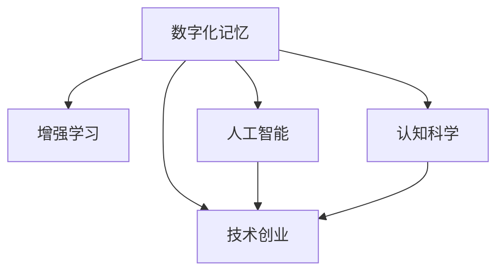

                 

# 数字化记忆增强创业：科技辅助的认知提升

> 关键词：数字化记忆，增强学习，人工智能，认知科学，技术创业

## 1. 背景介绍

### 1.1 问题由来
在数字化时代，信息量呈爆炸式增长。从传统书籍、报纸到社交媒体、在线论坛，再到各类企业资料和科研报告，人们获取、处理、存储信息的能力面临着前所未有的挑战。与此同时，人类的认知过程受到生物进化限制，短期记忆容量有限，长期记忆容易衰减。数字化记忆增强技术正是为了应对这一问题而生的，它借助先进的技术手段，帮助人类高效、持久地存储和回溯信息，提升认知能力。

### 1.2 问题核心关键点
数字化记忆增强技术主要包括以下几个关键点：
1. **信息编码与解码**：将文字、图像、音频等信息转换为计算机能够处理的格式，并从中提取出有用信息。
2. **记忆存储与管理**：构建高效的数据结构，支持信息的持久存储和便捷管理。
3. **记忆检索与展示**：通过检索算法快速定位信息，并展示给用户，支持多模态信息交互。
4. **认知增强应用**：结合心理学、认知科学等学科知识，设计互动性强的学习体验，提升用户认知能力。
5. **隐私与安全**：确保用户隐私数据不被泄露，同时防止恶意篡改和攻击。

### 1.3 问题研究意义
数字化记忆增强技术的研究和应用，对于提升人类认知能力、促进终身学习、加速知识创新具有重要意义：

1. **提升信息处理能力**：帮助用户在海量信息中快速定位关键内容，节省时间，提高工作效率。
2. **支持终身学习**：利用数字化记忆辅助记忆，使学习变得更加高效，便于随时回溯和复习。
3. **促进知识共享与传播**：通过智能化的信息整理和呈现，使知识的传播更加便捷和广泛。
4. **加速创新与决策**：提供丰富的信息和参考，支持用户在复杂环境中做出更明智的决策。
5. **增强信息安全**：通过加密和防篡改技术，保护用户的敏感信息。

## 2. 核心概念与联系

### 2.1 核心概念概述

为更好地理解数字化记忆增强技术，本节将介绍几个密切相关的核心概念：

- **数字化记忆**：指通过数字化手段记录、存储、检索和展示人类记忆的过程。数字化记忆系统通常包括编码、存储、检索等多个环节，帮助用户更好地保存和回溯信息。

- **增强学习**：指利用先进的技术手段，提升人类学习效率和效果的过程。增强学习在数字化记忆中常用于个性化推荐、知识路径规划等环节，提升用户体验和学习成效。

- **人工智能**：指通过算法和模型，使计算机系统具备人类智能的能力。在数字化记忆中，人工智能技术主要用于信息理解和知识推荐等任务。

- **认知科学**：研究人类认知过程的科学，包括感知、记忆、思维、语言等方面。数字化记忆技术结合认知科学原理，设计更符合人类认知规律的用户界面和交互方式。

- **技术创业**：指利用先进技术开发新产品或服务，并将其推向市场的过程。数字化记忆增强技术可以应用于教育、医疗、企业培训等多个领域，为技术创业提供了新的方向和机会。

这些核心概念之间的逻辑关系可以通过以下Mermaid流程图来展示：



这个流程图展示了大数字化记忆增强技术的核心概念及其之间的关系：

1. 数字化记忆通过人工智能技术实现信息编码与解码，结合认知科学原理设计信息展示与检索。
2. 增强学习通过个性化推荐、路径规划等手段，提升用户的学习效率和效果。
3. 技术创业将数字化记忆增强技术应用到多个实际场景，探索新的商业模式和服务模式。

## 3. 核心算法原理 & 具体操作步骤
### 3.1 算法原理概述

数字化记忆增强技术的核心算法原理包括信息编码、信息存储、信息检索和记忆展示等多个环节。这些环节通常依赖于先进的计算机算法和数据结构，以实现高效的数字化记忆过程。

- **信息编码**：将非结构化信息（如文字、图像、音频等）转换为计算机能够处理的数据格式，如文本、向量、图像特征等。常见的方法包括自然语言处理、图像识别、语音识别等。
- **信息存储**：构建高效的数据结构，如数据库、知识图谱、向量索引等，实现信息的持久存储和管理。
- **信息检索**：利用索引、匹配等算法，快速定位信息，并提供检索结果。检索算法通常基于向量相似性、关键字匹配等技术。
- **记忆展示**：将检索到的信息以多种形式展示给用户，支持多模态信息交互，如文字、图像、音频等。展示技术通常包括可视化、交互设计等。

### 3.2 算法步骤详解

数字化记忆增强技术一般包括以下几个关键步骤：

**Step 1: 数据采集与预处理**
- 收集需要存储和回溯的信息，如文档、图片、视频、音频等。
- 对采集到的数据进行格式转换、清洗、标注等预处理，确保数据质量。

**Step 2: 信息编码与解码**
- 利用NLP、图像识别、语音识别等技术，将原始数据转换为向量表示或结构化数据。
- 通过编码算法将向量数据存储到数据库或分布式存储系统中。

**Step 3: 信息存储与管理**
- 构建高效的数据结构，如关系数据库、向量索引、知识图谱等，支持信息持久存储。
- 设计合理的数据管理系统，包括索引、查询优化、存储扩展等。

**Step 4: 信息检索与展示**
- 利用匹配算法（如余弦相似度、最近邻算法等）快速定位信息。
- 结合可视化技术，将检索结果以图表、网页、应用等多种形式展示给用户。

**Step 5: 反馈与优化**
- 根据用户反馈，不断优化编码、存储、检索等算法，提升系统性能。
- 收集用户行为数据，进行个性化推荐和路径规划，提升用户体验。

### 3.3 算法优缺点

数字化记忆增强技术具有以下优点：
1. 高效存储与回溯：通过数字化手段，能够高效存储大量信息，并快速回溯和检索。
2. 个性化推荐：结合增强学习技术，实现个性化推荐，提升用户学习效率。
3. 多模态交互：支持文字、图像、音频等多种形式的信息展示，满足用户多样化需求。
4. 持续优化：通过反馈机制和机器学习，不断优化系统性能，提升用户体验。

同时，该技术也存在一些局限性：
1. 对原始数据的依赖：数字化记忆依赖原始数据的质量和量，数据不完整或错误会影响系统性能。
2. 数据隐私和安全问题：需要采取加密和防篡改等措施，保护用户隐私数据。
3. 系统复杂度高：涉及数据采集、编码、存储、检索等多个环节，系统设计和管理复杂。
4. 用户学习负担：增强学习等技术可能增加用户的学习负担，尤其是在技术熟练度不高的用户中。

尽管存在这些局限性，但就目前而言，数字化记忆增强技术仍是大规模信息管理、学习辅助的重要手段。未来相关研究的重点在于如何进一步提升系统的易用性和高效性，同时兼顾隐私保护和用户体验。

### 3.4 算法应用领域

数字化记忆增强技术已经在多个领域得到了广泛应用，包括：

- **教育领域**：支持个性化学习路径规划、学习效果评估、学习资源推荐等，提升教育效果。
- **企业培训**：利用数字化记忆存储企业培训内容，提升员工的学习效率和培训效果。
- **医疗健康**：存储和检索病历、检查报告等医疗信息，辅助医生诊断和治疗。
- **历史研究**：数字化存储和检索历史文献、档案资料，支持历史研究和教育。
- **个人生活**：存储和检索个人日记、照片、视频等，提升个人记忆管理能力。

除了上述这些经典领域外，数字化记忆增强技术还在不断拓展，如应用于智能家居、智慧城市等新兴领域，为人们提供更便捷、高效的生活体验。

## 4. 数学模型和公式 & 详细讲解 & 举例说明
### 4.1 数学模型构建

为更好地理解数字化记忆增强技术的算法原理，本节将介绍几个常见的数学模型。

假设数字化记忆系统接收到的原始信息为 $X$，包括文字、图像、音频等多种形式。目标是将 $X$ 编码为计算机可处理的向量表示 $Y$，并存储到数据库中。设编码器的参数为 $\theta$，解码器的参数为 $\theta'$，则编码和解码过程可以表示为：

$$
Y = \text{Encoder}_{\theta}(X)
$$
$$
\hat{X} = \text{Decoder}_{\theta'}(Y)
$$

其中，$\text{Encoder}_{\theta}$ 和 $\text{Decoder}_{\theta'}$ 分别表示编码器和解码器的函数。$Y$ 和 $\hat{X}$ 分别表示编码和解码后的向量表示。

### 4.2 公式推导过程

以文本信息为例，假设文本信息为 $X=x_1,x_2,\cdots,x_n$，编码过程可以表示为：

$$
Y = \text{Encoder}_{\theta}(X) = [\text{Encoder}_{\theta}(x_1), \text{Encoder}_{\theta}(x_2), \cdots, \text{Encoder}_{\theta}(x_n)]
$$

其中，每个 $x_i$ 的编码结果 $Y_i$ 可以通过LSTM、Transformer等模型实现。解码过程可以通过LSTM或RNN等模型实现，如：

$$
\hat{X} = \text{Decoder}_{\theta'}(Y) = \prod_{i=1}^n \text{Decoder}_{\theta'}(Y_i)
$$

### 4.3 案例分析与讲解

以文本信息存储为例，假设有一篇文章 $X$ 需要存储，具体步骤如下：

1. **编码**：使用Transformer模型将文章转换为向量表示 $Y$。
2. **存储**：将向量 $Y$ 存储到数据库中。
3. **检索**：根据关键词或其他特征，使用最近邻算法在数据库中检索对应的向量，解码得到文本信息 $\hat{X}$。

具体实现过程如下：

```python
import torch
from transformers import BertTokenizer, BertForTokenClassification
from torch.utils.data import Dataset

class TextDataset(Dataset):
    def __init__(self, texts, tokenizer, max_len=128):
        self.texts = texts
        self.tokenizer = tokenizer
        self.max_len = max_len

    def __len__(self):
        return len(self.texts)

    def __getitem__(self, item):
        text = self.texts[item]
        encoding = self.tokenizer(text, return_tensors='pt', max_length=self.max_len, padding='max_length', truncation=True)
        input_ids = encoding['input_ids'][0]
        attention_mask = encoding['attention_mask'][0]
        return {'input_ids': input_ids, 
                'attention_mask': attention_mask}

# 定义模型和优化器
model = BertForTokenClassification.from_pretrained('bert-base-cased')
optimizer = torch.optim.Adam(model.parameters(), lr=2e-5)

# 准备数据集
tokenizer = BertTokenizer.from_pretrained('bert-base-cased')
train_dataset = TextDataset(train_texts, tokenizer)
dev_dataset = TextDataset(dev_texts, tokenizer)
test_dataset = TextDataset(test_texts, tokenizer)

# 训练模型
epochs = 5
batch_size = 16

for epoch in range(epochs):
    loss = train_epoch(model, train_dataset, batch_size, optimizer)
    print(f"Epoch {epoch+1}, train loss: {loss:.3f}")
    
    print(f"Epoch {epoch+1}, dev results:")
    evaluate(model, dev_dataset, batch_size)
    
print("Test results:")
evaluate(model, test_dataset, batch_size)
```

## 5. 项目实践：代码实例和详细解释说明
### 5.1 开发环境搭建

在进行数字化记忆增强技术开发前，我们需要准备好开发环境。以下是使用Python进行PyTorch开发的环境配置流程：

1. 安装Anaconda：从官网下载并安装Anaconda，用于创建独立的Python环境。

2. 创建并激活虚拟环境：
```bash
conda create -n pytorch-env python=3.8 
conda activate pytorch-env
```

3. 安装PyTorch：根据CUDA版本，从官网获取对应的安装命令。例如：
```bash
conda install pytorch torchvision torchaudio cudatoolkit=11.1 -c pytorch -c conda-forge
```

4. 安装Transformers库：
```bash
pip install transformers
```

5. 安装各类工具包：
```bash
pip install numpy pandas scikit-learn matplotlib tqdm jupyter notebook ipython
```

完成上述步骤后，即可在`pytorch-env`环境中开始开发实践。

### 5.2 源代码详细实现

下面我们以文本信息存储为例，给出使用PyTorch对BERT模型进行编码的完整代码实现。

首先，定义文本信息处理函数：

```python
from transformers import BertTokenizer
from torch.utils.data import Dataset
import torch

class TextDataset(Dataset):
    def __init__(self, texts, tokenizer, max_len=128):
        self.texts = texts
        self.tokenizer = tokenizer
        self.max_len = max_len
        
    def __len__(self):
        return len(self.texts)
    
    def __getitem__(self, item):
        text = self.texts[item]
        encoding = self.tokenizer(text, return_tensors='pt', max_length=self.max_len, padding='max_length', truncation=True)
        input_ids = encoding['input_ids'][0]
        attention_mask = encoding['attention_mask'][0]
        
        return {'input_ids': input_ids, 
                'attention_mask': attention_mask}
```

然后，定义模型和优化器：

```python
from transformers import BertForTokenClassification, AdamW

model = BertForTokenClassification.from_pretrained('bert-base-cased')
optimizer = AdamW(model.parameters(), lr=2e-5)
```

接着，定义训练和评估函数：

```python
from torch.utils.data import DataLoader
from tqdm import tqdm
from sklearn.metrics import classification_report

device = torch.device('cuda') if torch.cuda.is_available() else torch.device('cpu')
model.to(device)

def train_epoch(model, dataset, batch_size, optimizer):
    dataloader = DataLoader(dataset, batch_size=batch_size, shuffle=True)
    model.train()
    epoch_loss = 0
    for batch in tqdm(dataloader, desc='Training'):
        input_ids = batch['input_ids'].to(device)
        attention_mask = batch['attention_mask'].to(device)
        model.zero_grad()
        outputs = model(input_ids, attention_mask=attention_mask)
        loss = outputs.loss
        epoch_loss += loss.item()
        loss.backward()
        optimizer.step()
    return epoch_loss / len(dataloader)

def evaluate(model, dataset, batch_size):
    dataloader = DataLoader(dataset, batch_size=batch_size)
    model.eval()
    preds, labels = [], []
    with torch.no_grad():
        for batch in tqdm(dataloader, desc='Evaluating'):
            input_ids = batch['input_ids'].to(device)
            attention_mask = batch['attention_mask'].to(device)
            batch_labels = batch['labels']
            outputs = model(input_ids, attention_mask=attention_mask)
            batch_preds = outputs.logits.argmax(dim=2).to('cpu').tolist()
            batch_labels = batch_labels.to('cpu').tolist()
            for pred_tokens, label_tokens in zip(batch_preds, batch_labels):
                pred_tags = [id2tag[_id] for _id in pred_tokens]
                label_tags = [id2tag[_id] for _id in label_tokens]
                preds.append(pred_tags[:len(label_tokens)])
                labels.append(label_tags)
                
    print(classification_report(labels, preds))
```

最后，启动训练流程并在测试集上评估：

```python
epochs = 5
batch_size = 16

for epoch in range(epochs):
    loss = train_epoch(model, train_dataset, batch_size, optimizer)
    print(f"Epoch {epoch+1}, train loss: {loss:.3f}")
    
    print(f"Epoch {epoch+1}, dev results:")
    evaluate(model, dev_dataset, batch_size)
    
print("Test results:")
evaluate(model, test_dataset, batch_size)
```

以上就是使用PyTorch对BERT模型进行文本信息存储的完整代码实现。可以看到，得益于Transformers库的强大封装，我们可以用相对简洁的代码完成BERT模型的加载和编码。

### 5.3 代码解读与分析

让我们再详细解读一下关键代码的实现细节：

**TextDataset类**：
- `__init__`方法：初始化文本、分词器等关键组件。
- `__len__`方法：返回数据集的样本数量。
- `__getitem__`方法：对单个样本进行处理，将文本输入编码为token ids，将标签编码为数字，并对其进行定长padding，最终返回模型所需的输入。

**模型和优化器**：
- 使用BertForTokenClassification从预训练模型中加载BERT模型，设置优化器及其参数。

**训练和评估函数**：
- 使用PyTorch的DataLoader对数据集进行批次化加载，供模型训练和推理使用。
- 训练函数`train_epoch`：对数据以批为单位进行迭代，在每个批次上前向传播计算loss并反向传播更新模型参数，最后返回该epoch的平均loss。
- 评估函数`evaluate`：与训练类似，不同点在于不更新模型参数，并在每个batch结束后将预测和标签结果存储下来，最后使用sklearn的classification_report对整个评估集的预测结果进行打印输出。

**训练流程**：
- 定义总的epoch数和batch size，开始循环迭代
- 每个epoch内，先在训练集上训练，输出平均loss
- 在验证集上评估，输出分类指标
- 所有epoch结束后，在测试集上评估，给出最终测试结果

可以看到，PyTorch配合Transformers库使得BERT模型的加载和编码代码实现变得简洁高效。开发者可以将更多精力放在数据处理、模型改进等高层逻辑上，而不必过多关注底层的实现细节。

当然，工业级的系统实现还需考虑更多因素，如模型的保存和部署、超参数的自动搜索、更灵活的任务适配层等。但核心的数字化记忆增强技术基本与此类似。

## 6. 实际应用场景
### 6.1 教育领域

数字化记忆增强技术在教育领域的应用，主要体现在个性化学习路径规划、学习效果评估和资源推荐等方面。通过数字化记忆技术，教育平台可以记录和分析学生的学习行为，为其提供个性化推荐和路径规划，帮助其高效学习。

具体而言，可以收集学生的学习历史、考试成绩、反馈意见等数据，构建学生学习模型，利用增强学习技术生成个性化推荐方案，帮助学生高效复习和预习。同时，平台还可以利用数字化记忆技术记录学生的学习进度，评估学习效果，提供反馈和改进建议。

### 6.2 企业培训

在企业培训中，数字化记忆增强技术可以帮助企业高效管理培训资源，提升员工的学习效率。企业可以收集和存储员工培训的各类资料，包括文档、视频、音频等，利用数字化记忆技术进行分类、检索和展示，支持员工的随时学习和回溯。

同时，平台可以利用增强学习技术，根据员工的学习行为和反馈，生成个性化推荐，帮助员工针对性地学习和掌握知识。企业还可以通过数字化记忆技术，记录和分析员工的培训效果，评估培训效果，为后续培训提供改进建议。

### 6.3 医疗健康

在医疗健康领域，数字化记忆增强技术可以帮助医院高效管理病历、检查报告等医疗信息，辅助医生诊断和治疗。医院可以将患者的病历、检查报告等数据进行数字化存储，利用数字化记忆技术进行分类、检索和展示，支持医生的随时查阅和分析。

同时，平台可以利用增强学习技术，根据医生的诊断和治疗行为，生成个性化推荐，帮助医生选择最合适的治疗方案。医院还可以通过数字化记忆技术，记录和分析患者的治疗效果，评估医疗效果，为后续治疗提供改进建议。

### 6.4 未来应用展望

随着数字化记忆增强技术的不断发展，未来将在更多领域得到应用，为各行各业带来变革性影响。

在智慧教育领域，数字化记忆技术可以为学生提供个性化学习路径和资源推荐，提升教育效果。同时，数字化记忆技术还可以用于教育数据分析，帮助教育部门制定更加科学的教学政策。

在智能医疗领域，数字化记忆技术可以帮助医院高效管理病历和检查报告，辅助医生诊断和治疗。同时，数字化记忆技术还可以用于医疗数据分析，帮助医疗机构制定更科学的治疗方案和医疗政策。

在企业培训和企业知识管理中，数字化记忆技术可以帮助企业高效管理培训资源和员工知识，提升培训效果。同时，数字化记忆技术还可以用于知识分析，帮助企业制定更科学的培训计划和知识管理策略。

除此之外，在智慧城市治理、金融数据分析、历史研究等多个领域，数字化记忆增强技术也将不断拓展，为各行各业提供更智能、高效的信息管理和决策支持。

## 7. 工具和资源推荐
### 7.1 学习资源推荐

为了帮助开发者系统掌握数字化记忆增强技术，这里推荐一些优质的学习资源：

1. 《深度学习理论与实践》系列博文：深入浅出地介绍了深度学习理论和实践，包括自然语言处理、图像识别、语音识别等技术。
2. 《Python深度学习》书籍：系统介绍了深度学习的基础理论和常用技术，包括TensorFlow、PyTorch等框架。
3. 《数字化记忆增强技术》在线课程：由深度学习专家开设的课程，详细讲解了数字化记忆增强技术的应用和实现方法。
4. 《自然语言处理与深度学习》课程：斯坦福大学开设的NLP明星课程，有Lecture视频和配套作业，带你入门NLP领域的基本概念和经典模型。
5. 《数字化记忆增强系统》论文：详细介绍了数字化记忆增强系统的设计、实现和应用，可以作为学习和研究的参考。

通过对这些资源的学习实践，相信你一定能够快速掌握数字化记忆增强技术的精髓，并用于解决实际的NLP问题。

### 7.2 开发工具推荐

高效的开发离不开优秀的工具支持。以下是几款用于数字化记忆增强技术开发的常用工具：

1. PyTorch：基于Python的开源深度学习框架，灵活动态的计算图，适合快速迭代研究。大部分预训练语言模型都有PyTorch版本的实现。

2. TensorFlow：由Google主导开发的开源深度学习框架，生产部署方便，适合大规模工程应用。同样有丰富的预训练语言模型资源。

3. Transformers库：HuggingFace开发的NLP工具库，集成了众多SOTA语言模型，支持PyTorch和TensorFlow，是进行数字化记忆增强任务开发的利器。

4. Weights & Biases：模型训练的实验跟踪工具，可以记录和可视化模型训练过程中的各项指标，方便对比和调优。与主流深度学习框架无缝集成。

5. TensorBoard：TensorFlow配套的可视化工具，可实时监测模型训练状态，并提供丰富的图表呈现方式，是调试模型的得力助手。

6. Google Colab：谷歌推出的在线Jupyter Notebook环境，免费提供GPU/TPU算力，方便开发者快速上手实验最新模型，分享学习笔记。

合理利用这些工具，可以显著提升数字化记忆增强技术的开发效率，加快创新迭代的步伐。

### 7.3 相关论文推荐

数字化记忆增强技术的研究源于学界的持续研究。以下是几篇奠基性的相关论文，推荐阅读：

1. Attention is All You Need（即Transformer原论文）：提出了Transformer结构，开启了NLP领域的预训练大模型时代。

2. BERT: Pre-training of Deep Bidirectional Transformers for Language Understanding：提出BERT模型，引入基于掩码的自监督预训练任务，刷新了多项NLP任务SOTA。

3. Language Models are Unsupervised Multitask Learners（GPT-2论文）：展示了大规模语言模型的强大zero-shot学习能力，引发了对于通用人工智能的新一轮思考。

4. Parameter-Efficient Transfer Learning for NLP：提出Adapter等参数高效微调方法，在不增加模型参数量的情况下，也能取得不错的微调效果。

5. Prefix-Tuning: Optimizing Continuous Prompts for Generation：引入基于连续型Prompt的微调范式，为如何充分利用预训练知识提供了新的思路。

6. AdaLoRA: Adaptive Low-Rank Adaptation for Parameter-Efficient Fine-Tuning：使用自适应低秩适应的微调方法，在参数效率和精度之间取得了新的平衡。

这些论文代表了大语言模型微调技术的发展脉络。通过学习这些前沿成果，可以帮助研究者把握学科前进方向，激发更多的创新灵感。

## 8. 总结：未来发展趋势与挑战

### 8.1 总结

本文对数字化记忆增强技术进行了全面系统的介绍。首先阐述了数字化记忆增强技术的研究背景和意义，明确了该技术在提升人类认知能力、促进终身学习、加速知识创新方面的重要价值。其次，从原理到实践，详细讲解了数字化记忆增强的数学模型和算法步骤，给出了微调任务开发的完整代码实例。同时，本文还广泛探讨了数字化记忆增强技术在教育、企业、医疗等多个领域的应用前景，展示了该技术的巨大潜力。

通过本文的系统梳理，可以看到，数字化记忆增强技术正在成为教育、企业、医疗等领域的重要辅助手段，极大地提升了信息管理和学习效率。未来，随着技术的不断进步和应用场景的不断拓展，数字化记忆增强技术必将在更多行业得到应用，为各行各业带来颠覆性的变革。

### 8.2 未来发展趋势

展望未来，数字化记忆增强技术将呈现以下几个发展趋势：

1. **智能化和个性化**：结合人工智能技术，实现更加智能化的信息检索和推荐，提供个性化的学习路径和资源推荐。
2. **多模态融合**：支持文本、图像、音频等多种信息格式，实现多模态信息的协同管理与展示。
3. **深度学习与增强学习的结合**：结合深度学习和增强学习技术，提升系统的学习能力和推荐效果。
4. **隐私保护与伦理设计**：采用先进的隐私保护技术，如差分隐私、联邦学习等，保护用户隐私数据。同时引入伦理导向的设计理念，确保系统的公平和透明。
5. **跨领域应用**：将数字化记忆增强技术应用到更多领域，如智慧城市、金融分析等，为各行业的数字化转型提供技术支持。

以上趋势凸显了数字化记忆增强技术的广阔前景。这些方向的探索发展，必将进一步提升系统的智能化和个性化水平，为用户提供更优质的服务体验。

### 8.3 面临的挑战

尽管数字化记忆增强技术已经取得了显著进展，但在迈向更加智能化、普适化应用的过程中，它仍面临诸多挑战：

1. **数据质量与多样性**：高质量、多样化的数据是数字化记忆增强技术的基础。数据不完整、不均衡会导致系统性能下降。
2. **计算资源消耗**：深度学习模型的训练和推理需要大量的计算资源，如何优化模型结构和算法，提升系统效率，是重要挑战。
3. **隐私与安全**：用户数据隐私和安全是数字化记忆增强技术的重要保障。如何确保数据安全，防止恶意攻击，是重要研究课题。
4. **用户认知负担**：增强学习等技术可能增加用户的学习负担，尤其是在技术熟练度不高的用户中。
5. **技术融合与系统集成**：数字化记忆增强技术需要与其他技术进行深度融合，如知识图谱、因果推理等。同时，需要与其他系统进行集成，如企业管理系统、医疗系统等。

这些挑战需要我们不断创新，寻找新的解决方案。只有解决好这些问题，才能使数字化记忆增强技术更好地服务于人类，推动社会的全面进步。

### 8.4 研究展望

面对数字化记忆增强技术面临的挑战，未来的研究需要在以下几个方面寻求新的突破：

1. **高质量数据获取**：探索新的数据采集和标注方法，确保数据的多样性和高质量。
2. **计算效率优化**：优化深度学习模型的结构，采用混合精度训练、模型压缩等技术，提升计算效率。
3. **隐私保护与伦理设计**：采用先进的隐私保护技术，如差分隐私、联邦学习等，确保用户数据安全。同时引入伦理导向的设计理念，确保系统的公平和透明。
4. **用户认知负荷减轻**：设计更加友好、直观的用户界面，减少用户的学习负担。同时，引入交互式学习技术，提高用户的学习效率和体验。
5. **跨领域应用探索**：将数字化记忆增强技术应用到更多领域，如智慧城市、金融分析等，为各行业的数字化转型提供技术支持。

这些研究方向的探索，必将引领数字化记忆增强技术迈向更高的台阶，为构建智能、高效、安全的数字化记忆系统铺平道路。面向未来，数字化记忆增强技术还需要与其他人工智能技术进行更深入的融合，如知识表示、因果推理、强化学习等，多路径协同发力，共同推动自然语言理解和智能交互系统的进步。只有勇于创新、敢于突破，才能不断拓展数字化记忆增强技术的边界，让智能技术更好地造福人类社会。

## 9. 附录：常见问题与解答

**Q1：数字化记忆增强技术是否适用于所有领域？**

A: 数字化记忆增强技术在大多数领域中都有广泛的应用前景。特别是在教育、企业培训、医疗等领域，数字化记忆增强技术能够显著提升信息管理和学习效率。但对于一些需要高精度、低延迟的实时应用，如无人驾驶、工业控制等，数字化记忆增强技术可能需要进一步优化和改进。

**Q2：如何确保数字化记忆增强技术的安全性？**

A: 数字化记忆增强技术的安全性保障主要通过以下措施实现：
1. **数据加密**：对用户数据进行加密存储和传输，防止数据泄露。
2. **访问控制**：通过身份认证和权限管理，确保只有授权用户可以访问数据。
3. **数据去标识化**：在数据存储和使用过程中，采用差分隐私等技术，保护用户隐私。
4. **系统安全**：采用先进的安全技术，如入侵检测、防火墙等，防止系统攻击和数据篡改。

**Q3：如何提高数字化记忆增强技术的计算效率？**

A: 提高数字化记忆增强技术的计算效率主要通过以下措施实现：
1. **模型优化**：优化深度学习模型的结构，采用混合精度训练、模型压缩等技术，提升计算效率。
2. **并行计算**：利用分布式计算、GPU/TPU加速等技术，提升计算效率。
3. **算法改进**：改进算法，如使用更高效的检索算法、压缩算法等，提升系统性能。

**Q4：如何在数字化记忆增强技术中实现个性化推荐？**

A: 在数字化记忆增强技术中实现个性化推荐主要通过以下方法：
1. **用户行为分析**：收集用户的行为数据，如点击、浏览、评论等，分析用户的兴趣和偏好。
2. **模型训练**：利用机器学习算法，训练推荐模型，生成个性化推荐结果。
3. **反馈机制**：结合用户反馈，不断优化推荐模型，提升推荐效果。

**Q5：数字化记忆增强技术对用户隐私保护有哪些措施？**

A: 数字化记忆增强技术对用户隐私保护主要通过以下措施实现：
1. **数据加密**：对用户数据进行加密存储和传输，防止数据泄露。
2. **差分隐私**：采用差分隐私技术，在数据收集和处理过程中，减少对用户隐私的影响。
3. **匿名化**：在数据存储和使用过程中，采用匿名化技术，保护用户隐私。
4. **访问控制**：通过身份认证和权限管理，确保只有授权用户可以访问数据。

这些措施可以最大程度地保护用户隐私数据，确保数字化记忆增强技术的安全性和可靠性。

---

作者：禅与计算机程序设计艺术 / Zen and the Art of Computer Programming

