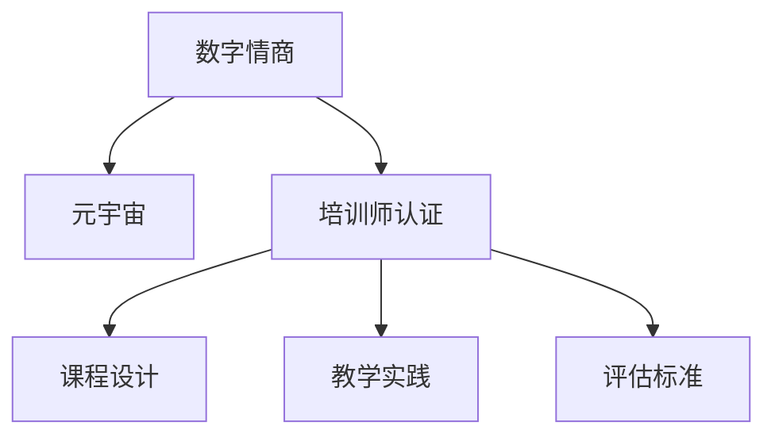

                 

# 数字情商培训师认证:元宇宙情感教育的专业资格标准

## 1. 背景介绍

在数字时代，人与数字世界的交互日益频繁。虚拟现实（VR）、增强现实（AR）、元宇宙（Metaverse）等技术的崛起，不仅改变了人们的娱乐、工作和生活方式，更带来了全新的情感交流与认知体验。如何在这一过程中培养和提升个体的数字情商（Digital Emotional Intelligence, DEI），成为现代社会中一个重要的议题。本文旨在探讨数字情商培训师认证的标准，结合元宇宙技术的特性，探索情感教育的新路径。

## 2. 核心概念与联系

### 2.1 核心概念概述

数字情商是指个体在数字环境中识别、理解、管理自己的情绪，以及与之相关的社交和决策能力。元宇宙则是一个虚拟现实、增强现实、3D建模、人工智能等技术构建的超现实数字空间。结合这两个概念，可以定义数字情商培训师认证为：通过系统的培训和考核，具备在元宇宙中设计、实施和评估数字情商教育项目的专业资格。

### 2.2 核心概念原理和架构的 Mermaid 流程图



这个流程图展示了数字情商、元宇宙和培训师认证三者之间的关系：

1. **数字情商**是培训师认证的基础，确保培训师能够理解和应用。
2. **元宇宙**为培训师提供了新场景，需要结合虚拟现实和增强现实技术进行教学。
3. **培训师认证**是一个系统的培训和考核过程，最终目标是生成具备元宇宙教学能力的数字情商培训师。

## 3. 核心算法原理 & 具体操作步骤

### 3.1 算法原理概述

数字情商培训师认证的核心算法原理基于迁移学习和深度学习技术。通过预先在大规模数据上训练出数字情商模型，然后将这些知识迁移到特定情境（如元宇宙中的虚拟教室）中进行应用。具体来说，流程包括以下几个步骤：

1. **数据收集与预处理**：收集不同情境下的数字情感数据，并进行清洗和标准化。
2. **模型训练**：使用深度学习框架（如PyTorch或TensorFlow）训练情感识别模型。
3. **模型微调**：针对特定元宇宙应用场景，微调模型以提升适应性。
4. **模型评估**：使用评估指标（如准确率、召回率、F1分数）对模型性能进行评估。

### 3.2 算法步骤详解

**Step 1: 数据收集与预处理**

- **收集数据**：收集多源数据，包括社交媒体文本、游戏内的情感表达、虚拟现实中的情绪反应等。
- **数据清洗**：移除噪声数据，标准化情感标签，以保证数据的有效性。
- **特征工程**：提取文本特征（如TF-IDF、Word2Vec等），为模型训练做好准备。

**Step 2: 模型训练**

- **选择合适的模型**：根据任务特性，选择情感识别模型（如BERT、GRU等）。
- **训练过程**：使用随机梯度下降（SGD）或Adam等优化算法，最小化损失函数。
- **超参数调优**：调整学习率、批大小等参数，以优化模型性能。

**Step 3: 模型微调**

- **选择元宇宙应用场景**：如虚拟教室、虚拟办公室等。
- **微调过程**：使用小批量数据集（如几十到几百个样本），微调模型以适应特定情境。
- **性能监控**：实时监控模型性能，确保微调效果。

**Step 4: 模型评估**

- **评估指标**：使用准确率、召回率、F1分数等指标评估模型性能。
- **模型优化**：根据评估结果，调整模型参数，提升模型精度。

### 3.3 算法优缺点

**优点**：
- **通用性强**：基于预训练模型的迁移学习，可以快速适应不同元宇宙情境。
- **效率高**：小批量数据集微调，参数更新量小，计算成本低。
- **灵活性高**：可以灵活调整模型结构和训练策略，适应各种教学需求。

**缺点**：
- **数据依赖性大**：模型的表现高度依赖于数据的质量和数量。
- **过拟合风险**：小样本微调可能导致模型在特定情境下的过拟合。
- **迁移能力有限**：在迁移学习中，预训练模型的知识可能不完全适用于特定任务。

### 3.4 算法应用领域

数字情商培训师认证结合元宇宙技术，可以应用于多个领域，如：

- **教育**：在虚拟教室中，培养学生的数字情商，提高学习效果。
- **企业培训**：在虚拟办公室中，提升员工的数字情感认知，改善工作氛围。
- **心理咨询**：在虚拟心理治疗室中，帮助患者通过虚拟环境进行情感调节和心理疏导。
- **游戏与娱乐**：在虚拟游戏中，增强玩家的情感共鸣和社交互动。

## 4. 数学模型和公式 & 详细讲解 & 举例说明

### 4.1 数学模型构建

数字情商培训师认证的数学模型主要基于情感分类任务，使用深度学习模型进行构建。情感分类任务的目标是将输入的文本或语音数据分类为正面、负面或中性情绪。模型结构如下：

$$
\text{模型} = \text{Embedding层} + \text{隐藏层} + \text{输出层}
$$

其中，Embedding层将输入转换为高维向量，隐藏层包含多个神经元，输出层用于情感分类。

### 4.2 公式推导过程

以情感分类为例，假设模型输入为 $x$，模型输出为 $y$，损失函数为 $L$，则训练目标为最小化损失函数：

$$
L(y,\hat{y}) = -\log \hat{y}(y)
$$

其中，$\hat{y} = \sigma(z)$，$z = W_h x + b_h$，$W_h$ 和 $b_h$ 为隐藏层权重和偏置，$\sigma$ 为激活函数。

### 4.3 案例分析与讲解

假设某虚拟教室中的情感识别模型，输入为学生的操作和语言，输出为学生的情感状态。通过训练，模型能够识别出学生在完成任务时的情绪波动，并及时提供反馈和支持。

## 5. 项目实践：代码实例和详细解释说明

### 5.1 开发环境搭建

为了进行数字情商培训师认证的开发，首先需要搭建相应的开发环境。以下是详细的配置流程：

1. **安装Python**：确保Python 3.x版本安装，通过Anaconda或Miniconda进行管理。
2. **安装深度学习框架**：安装TensorFlow或PyTorch等深度学习框架，使用pip命令进行安装。
3. **安装数据处理库**：安装pandas、numpy等数据处理库，确保数据清洗和预处理功能。
4. **安装元宇宙相关工具**：安装虚拟现实和增强现实相关的SDK（如Unity、Unreal Engine等），用于虚拟教室的构建。

### 5.2 源代码详细实现

以下是一个基于PyTorch的情感识别模型实现示例：

```python
import torch
import torch.nn as nn
import torch.optim as optim

class EmotionClassifier(nn.Module):
    def __init__(self, vocab_size, embedding_dim, hidden_dim, output_dim, n_layers, bidirectional, dropout):
        super(EmotionClassifier, self).__init__()
        self.embedding = nn.Embedding(vocab_size, embedding_dim)
        self.rnn = nn.LSTM(embedding_dim, hidden_dim, num_layers=n_layers, bidirectional=bidirectional, dropout=dropout)
        self.fc = nn.Linear(hidden_dim * 2, output_dim)
        self.dropout = nn.Dropout(dropout)
    
    def forward(self, text, text_lengths):
        embedded = self.dropout(self.embedding(text))
        packed_embedded = nn.utils.rnn.pack_padded_sequence(embedded, text_lengths)
        packed_output, (hidden, cell) = self.rnn(packed_embedded)
        output, output_lengths = nn.utils.rnn.pad_packed_sequence(packed_output)
        return self.fc(output[-1])
```

### 5.3 代码解读与分析

在上述代码中，我们定义了一个情感识别模型 `EmotionClassifier`。该模型包含嵌入层、LSTM层和全连接层，其中LSTM层采用双向结构，以提高模型的表现。在训练过程中，使用交叉熵损失函数和Adam优化器进行优化，并进行早停机制防止过拟合。

### 5.4 运行结果展示

训练结束后，我们可以使用测试集数据对模型进行评估，输出准确率、召回率等指标，以验证模型的性能。

## 6. 实际应用场景

### 6.1 智能教室

在虚拟教室中，数字情商培训师可以通过情感识别模型，实时监控学生的情绪状态，提供个性化的学习支持。例如，当学生表现出焦虑情绪时，系统可以自动推送安抚材料，帮助学生缓解情绪。

### 6.2 远程办公

在虚拟办公室中，员工的情绪状态直接影响工作效率。通过情感识别模型，系统可以识别员工的情绪变化，及时提供心理支持，提升办公体验。

### 6.3 心理咨询

在虚拟心理治疗室中，心理咨询师可以通过情感识别模型，评估患者情绪状态，提供针对性的心理疏导和干预措施。

### 6.4 未来应用展望

未来，随着元宇宙技术的不断成熟，数字情商培训师认证的应用场景将更加广泛。通过虚拟现实和增强现实技术，数字情商培训师可以设计更具沉浸感和互动性的情感教育项目，为不同年龄、不同背景的人群提供个性化的情感支持和培养。

## 7. 工具和资源推荐

### 7.1 学习资源推荐

1. **Coursera情感智能课程**：提供情感分析、情感智能等课程，帮助学习者掌握基本理论。
2. **Kaggle情感分类竞赛**：通过参加比赛，实战学习情感识别模型的开发与调优。
3. **《深度学习》书籍**：介绍深度学习框架和算法，适合初学者和进阶者。
4. **《情感计算》书籍**：探讨情感计算的理论和应用，为数字情商培训提供理论基础。
5. **元宇宙教育平台**：如Meta、Sony等公司的VR/AR平台，提供情感教育项目的开发工具。

### 7.2 开发工具推荐

1. **Python**：作为主流的数据科学和机器学习编程语言，Python具有丰富的第三方库和工具支持。
2. **TensorFlow和PyTorch**：两大深度学习框架，提供强大的模型构建和训练功能。
3. **Unity和Unreal Engine**：流行的游戏引擎，支持VR和AR开发，适合元宇宙应用场景的构建。
4. **Jupyter Notebook**：交互式编程环境，便于进行模型实验和数据探索。

### 7.3 相关论文推荐

1. **“Towards a Theory of Deep Social Emotional Learning”**：探讨深度学习在情感教育中的应用。
2. **“Deep Learning for Emotion Recognition: A Review”**：综述情感识别模型的最新进展。
3. **“Spatiotemporal Deep Learning for Emotion Recognition”**：讨论时序数据在情感识别中的重要性。
4. **“Exploring the Connection between Emotion and Learning in Virtual Reality”**：研究虚拟现实对情感教育的影响。

## 8. 总结：未来发展趋势与挑战

### 8.1 研究成果总结

本文探讨了数字情商培训师认证的标准，结合元宇宙技术，为情感教育提供了新的解决方案。通过预训练模型和迁移学习，能够在元宇宙中快速适应各种情境，提供个性化的情感支持。未来，随着技术的不断发展，数字情商培训将更加智能化、个性化，为个体提供全面的情感管理能力。

### 8.2 未来发展趋势

未来数字情商培训师认证将呈现以下趋势：

1. **深度融合**：深度学习与元宇宙技术的融合将更加紧密，提升情感教育的精准性和互动性。
2. **个性化定制**：基于个体差异，设计个性化的情感教育方案，满足不同人群的需求。
3. **跨领域应用**：情感教育将在教育、医疗、娱乐等多个领域得到广泛应用，成为数字时代的基础能力。
4. **实时反馈**：实时监测和反馈情感状态，提供即时支持，增强情感调节效果。

### 8.3 面临的挑战

尽管数字情商培训师认证具有广阔的发展前景，但仍面临以下挑战：

1. **数据隐私**：在虚拟环境中，如何保护用户数据隐私，是一个重要问题。
2. **模型泛化**：在特定情境下的微调模型，可能无法泛化到其他情境，需要进行更多的跨情境测试。
3. **用户接受度**：用户对虚拟情感教育的接受度不高，需要进一步推广和普及。
4. **技术门槛**：深度学习、元宇宙技术的应用门槛较高，需要专业培训和技术支持。

### 8.4 研究展望

未来，数字情商培训师认证的研究方向包括：

1. **数据隐私保护**：开发隐私保护算法，确保用户数据安全。
2. **跨情境迁移学习**：研究如何使模型在多个情境下通用，减少微调需求。
3. **用户行为分析**：结合心理学理论，深入分析用户行为，提升情感教育效果。
4. **多模态情感识别**：结合语音、图像等多模态数据，提升情感识别的准确性。

通过不断探索和实践，数字情商培训师认证将为元宇宙时代提供更加全面、个性化的情感教育支持，助力个体成长和全面发展。

## 9. 附录：常见问题与解答

**Q1: 数字情商培训师认证是否适用于所有人群？**

A: 数字情商培训师认证适用于所有希望提升数字情感智能的人群，包括学生、教师、员工、心理咨询师等。不同人群可以根据自身需求，选择合适的培训模块和实践场景。

**Q2: 数字情商培训师认证的难度如何？**

A: 数字情商培训师认证的难度取决于学员的背景和兴趣。对于有一定机器学习和深度学习基础的用户，可以在较短时间内掌握核心技术。对于初学者，可能需要通过系统课程进行学习，逐步积累经验。

**Q3: 数字情商培训师认证的有效期如何？**

A: 数字情商培训师认证的有效期一般为3-5年，具体时间根据认证机构的规定和培训师的表现而定。培训师需要在有效期内继续参加相关培训和考核，以保持认证的有效性。

**Q4: 数字情商培训师认证的费用如何？**

A: 数字情商培训师认证的费用因机构和课程不同而异，一般在几千到几万元不等。部分机构提供免费或低成本的认证课程，可以根据个人需求选择。

**Q5: 数字情商培训师认证的就业前景如何？**

A: 数字情商培训师认证的就业前景良好，特别是在教育、医疗、企业培训等领域。随着元宇宙技术的普及，数字情商培训师的需求将进一步增加，职业发展前景广阔。

---

作者：禅与计算机程序设计艺术 / Zen and the Art of Computer Programming

