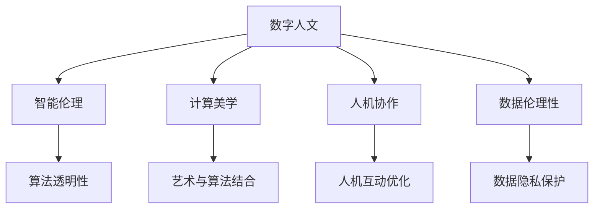

                 

# 数字时代的人文精神的回归

## 1. 背景介绍

### 1.1 问题由来
在数字时代的浪潮中，信息技术的高速发展带来了生活和工作方式的深刻变革。人们越来越多地依赖数字技术，从通讯、娱乐到教育、医疗，无不渗透着数据和算法的力量。然而，随着技术的深入应用，人们在享受便利的同时，也面临一系列新的问题：数据隐私、信息过载、人机交互的边界等。这要求我们不仅要关注技术本身，还要深入思考技术与人的关系，寻找新的平衡点。

### 1.2 问题核心关键点
1. 数据隐私保护：在数字化时代，个人数据成为一种新型资产，如何安全保护隐私，避免数据滥用，是数字社会必须解决的问题。
2. 信息过载问题：互联网时代信息量爆炸，用户难以甄别有用信息，如何有效管理和组织信息，提升信息检索效率，是信息科技需要解决的重要课题。
3. 人机交互的边界：随着AI、机器人等技术的发展，人类与机器的关系日益紧密，如何界定人机互动的边界，提升用户体验，是未来技术发展的关键。
4. 计算伦理：AI技术的广泛应用带来了伦理问题，如算法歧视、决策透明度等，如何在技术开发和应用中融入伦理考量，保障社会公平正义，成为科技伦理研究的重要方向。
5. 技术与人文的关系：如何在技术进步中注入人文关怀，平衡技术与人文的关系，让技术更好地服务于人类福祉，是数字时代技术发展需要思考的重要问题。

这些问题看似技术层面的挑战，实则触及了数字时代的核心价值命题，关乎人类的未来发展。本文将从技术与人文交织的角度，探讨如何通过技术创新，促进人文精神的回归，构建更加和谐的数字社会。

## 2. 核心概念与联系

### 2.1 核心概念概述

为更好地理解技术与人文精神的融合，本节将介绍几个密切相关的核心概念：

- **数字人文**：利用信息技术处理和分析人文数据，提升对人类历史、文化、社会等的理解和研究，推动人类文化遗产的保护与传承。
- **智能伦理**：在智能技术开发与应用过程中，注重算法决策的透明性、公正性和伦理性，避免技术滥用，保护用户权益。
- **计算美学**：研究如何通过算法、计算技术创造美，提升用户审美体验，促进技术与艺术的结合。
- **人机协作**：强调人在技术系统中的主导地位，注重技术对人的支持和辅助，而非替代，推动人机协作关系的建立。
- **数据伦理性**：在数据收集、处理和使用的全过程中，遵循伦理规范，保障数据隐私和安全，避免数据滥用。

这些核心概念之间的逻辑关系可以通过以下Mermaid流程图来展示：



这个流程图展示了大语言模型微调的各个概念及其之间的关系：

1. 数字人文和智能伦理是构建技术与人类和谐关系的基础。
2. 计算美学强调技术的美学价值，推动技术与艺术的融合。
3. 人机协作强调技术对人的支持和辅助作用，促进人机关系的和谐。
4. 数据伦理性保障数据的公平性和安全性，避免数据滥用。
5. 算法透明性、艺术与算法结合、人机互动优化、数据隐私保护等，是实现这些核心概念的重要途径。

## 3. 核心算法原理 & 具体操作步骤

### 3.1 算法原理概述

本文关注的核心算法原理是通过数字技术和人文价值的融合，促进技术创新的同时，回归人文精神。其核心思想是：利用数字技术处理和分析人文数据，挖掘人类文化的深层内涵，揭示人类社会的内在逻辑，并通过技术创新推动人类文化、社会和伦理的进步。

### 3.2 算法步骤详解

1. **数据收集与处理**：
   - 使用网络爬虫、传感器等技术收集文本、图片、音频等各类人文数据。
   - 对数据进行清洗、预处理和标注，去除噪声和无关信息，保留有价值的数据。

2. **数据分析与建模**：
   - 应用机器学习和深度学习算法对数据进行分析和建模，如自然语言处理、图像识别、语音识别等。
   - 构建模型，提取数据中的深层结构和规律，如情感分析、主题建模、关联网络等。

3. **算法创新与优化**：
   - 引入计算美学和艺术设计思想，优化算法，提升数据处理和分析的美学价值，增强用户体验。
   - 在算法设计中加入伦理考量，确保算法的透明性和公正性，避免算法偏见和滥用。

4. **人机协作与互动**：
   - 设计人机协作接口，增强用户参与感，提升用户对系统的理解和掌控。
   - 利用增强现实(AR)、虚拟现实(VR)等技术，模拟人类行为和情感，提升人机互动的自然性和真实感。

5. **算法评估与反馈**：
   - 在应用过程中，通过用户反馈、问卷调查等方式评估算法效果，识别存在的问题和不足。
   - 根据评估结果，持续优化算法和系统，提升用户体验和系统效果。

### 3.3 算法优缺点

数字时代人文精神的回归算法具有以下优点：
1. 促进技术与人文的融合，提升技术的社会价值。
2. 增强用户体验，提升用户对技术的满意度和认同感。
3. 推动伦理进步，保障技术应用的公正性和透明性。
4. 提升文化艺术的美学价值，丰富人类的审美体验。

同时，该算法也存在一些局限性：
1. 数据隐私和安全问题难以完全解决，需要持续关注和优化。
2. 算法复杂性高，计算资源消耗大，需要高性能硬件支持。
3. 算法效果受数据质量和多样性影响较大，需要精心设计和处理数据。
4. 算法的伦理和透明性仍需进一步探讨和规范，避免技术滥用。

尽管存在这些局限性，但数字时代人文精神的回归算法仍是大数据时代技术进步和人类发展的重要方向。通过不断优化算法和技术，可以更好地实现技术与人类福祉的和谐共进。

### 3.4 算法应用领域

数字时代人文精神的回归算法已经在诸多领域得到了广泛应用，例如：

1. **文化遗产保护**：通过数字化技术处理和分析文物数据，提升文化遗产的研究和保护水平。
2. **社会舆情分析**：利用情感分析和主题建模技术，分析社会舆情，预测和应对社会问题。
3. **教育智能化**：通过个性化推荐和学习分析，提升教育资源的利用效率，推动教育公平。
4. **医疗智能化**：利用深度学习和大数据分析，提升医疗诊断和治疗水平，推动医疗资源的公平分配。
5. **城市管理**：通过智能监控和数据分析，提升城市管理的智能化水平，构建智慧城市。
6. **艺术创作**：通过算法生成艺术作品，提升艺术创作的美学价值，推动艺术与科技的结合。

此外，数字时代人文精神的回归算法还广泛应用于智能家居、智能交通、智能客服等多个领域，为各行各业带来了新的突破。随着技术的不断进步，相信算法将在更多领域得到应用，为人类社会的发展注入新的活力。

## 4. 数学模型和公式 & 详细讲解  
### 4.1 数学模型构建

本节将使用数学语言对数字时代人文精神的回归算法进行更加严格的刻画。

记人文数据集为 $D=\{x_i\}_{i=1}^N$，其中 $x_i$ 为文本、图片等数据。假设模型为 $M_{\theta}$，其中 $\theta$ 为模型参数。

定义模型 $M_{\theta}$ 在数据样本 $x$ 上的损失函数为 $\ell(M_{\theta}(x),x)$，则在数据集 $D$ 上的经验风险为：

$$
\mathcal{L}(\theta) = \frac{1}{N}\sum_{i=1}^N \ell(M_{\theta}(x_i),x_i)
$$

微调的目标是最小化经验风险，即找到最优参数：

$$
\theta^* = \mathop{\arg\min}_{\theta} \mathcal{L}(\theta)
$$

在实践中，我们通常使用基于梯度的优化算法（如SGD、Adam等）来近似求解上述最优化问题。设 $\eta$ 为学习率，则参数的更新公式为：

$$
\theta \leftarrow \theta - \eta \nabla_{\theta}\mathcal{L}(\theta)
$$

其中 $\nabla_{\theta}\mathcal{L}(\theta)$ 为损失函数对参数 $\theta$ 的梯度，可通过反向传播算法高效计算。

### 4.2 公式推导过程

以下我们以情感分析任务为例，推导基于情感分析的人文数据处理和建模的数学公式。

假设模型 $M_{\theta}$ 在输入 $x$ 上的输出为 $\hat{y}=M_{\theta}(x)$，表示文本的情感倾向。真实标签 $y \in \{1, -1\}$，其中 $1$ 表示正面情感，$-1$ 表示负面情感。则情感分析的损失函数定义为：

$$
\ell(M_{\theta}(x),y) = -[y\log \hat{y} + (1-y)\log (1-\hat{y})]
$$

将其代入经验风险公式，得：

$$
\mathcal{L}(\theta) = -\frac{1}{N}\sum_{i=1}^N [y_i\log M_{\theta}(x_i)+(1-y_i)\log(1-M_{\theta}(x_i))]
$$

根据链式法则，损失函数对参数 $\theta_k$ 的梯度为：

$$
\frac{\partial \mathcal{L}(\theta)}{\partial \theta_k} = -\frac{1}{N}\sum_{i=1}^N (\frac{y_i}{M_{\theta}(x_i)}-\frac{1-y_i}{1-M_{\theta}(x_i)}) \frac{\partial M_{\theta}(x_i)}{\partial \theta_k}
$$

其中 $\frac{\partial M_{\theta}(x_i)}{\partial \theta_k}$ 可进一步递归展开，利用自动微分技术完成计算。

在得到损失函数的梯度后，即可带入参数更新公式，完成模型的迭代优化。重复上述过程直至收敛，最终得到适应下游任务的最优模型参数 $\theta^*$。

## 5. 项目实践：代码实例和详细解释说明
### 5.1 开发环境搭建

在进行微调实践前，我们需要准备好开发环境。以下是使用Python进行PyTorch开发的环境配置流程：

1. 安装Anaconda：从官网下载并安装Anaconda，用于创建独立的Python环境。

2. 创建并激活虚拟环境：
```bash
conda create -n pytorch-env python=3.8 
conda activate pytorch-env
```

3. 安装PyTorch：根据CUDA版本，从官网获取对应的安装命令。例如：
```bash
conda install pytorch torchvision torchaudio cudatoolkit=11.1 -c pytorch -c conda-forge
```

4. 安装Transformer库：
```bash
pip install transformers
```

5. 安装各类工具包：
```bash
pip install numpy pandas scikit-learn matplotlib tqdm jupyter notebook ipython
```

完成上述步骤后，即可在`pytorch-env`环境中开始微调实践。

### 5.2 源代码详细实现

这里我们以情感分析任务为例，给出使用Transformers库对BERT模型进行微调的PyTorch代码实现。

首先，定义情感分析任务的数据处理函数：

```python
from transformers import BertTokenizer
from torch.utils.data import Dataset
import torch

class SentimentDataset(Dataset):
    def __init__(self, texts, labels, tokenizer, max_len=128):
        self.texts = texts
        self.labels = labels
        self.tokenizer = tokenizer
        self.max_len = max_len
        
    def __len__(self):
        return len(self.texts)
    
    def __getitem__(self, item):
        text = self.texts[item]
        label = self.labels[item]
        
        encoding = self.tokenizer(text, return_tensors='pt', max_length=self.max_len, padding='max_length', truncation=True)
        input_ids = encoding['input_ids'][0]
        attention_mask = encoding['attention_mask'][0]
        
        # 对token-wise的标签进行编码
        encoded_labels = [1 if label == 'pos' else 0 for label in labels] 
        encoded_labels.extend([0]*(self.max_len - len(encoded_labels)))
        labels = torch.tensor(encoded_labels, dtype=torch.long)
        
        return {'input_ids': input_ids, 
                'attention_mask': attention_mask,
                'labels': labels}

# 标签与id的映射
label2id = {'pos': 0, 'neg': 1}
id2label = {v: k for k, v in label2id.items()}

# 创建dataset
tokenizer = BertTokenizer.from_pretrained('bert-base-cased')

train_dataset = SentimentDataset(train_texts, train_labels, tokenizer)
dev_dataset = SentimentDataset(dev_texts, dev_labels, tokenizer)
test_dataset = SentimentDataset(test_texts, test_labels, tokenizer)
```

然后，定义模型和优化器：

```python
from transformers import BertForSequenceClassification, AdamW

model = BertForSequenceClassification.from_pretrained('bert-base-cased', num_labels=2)

optimizer = AdamW(model.parameters(), lr=2e-5)
```

接着，定义训练和评估函数：

```python
from torch.utils.data import DataLoader
from tqdm import tqdm
from sklearn.metrics import classification_report

device = torch.device('cuda') if torch.cuda.is_available() else torch.device('cpu')
model.to(device)

def train_epoch(model, dataset, batch_size, optimizer):
    dataloader = DataLoader(dataset, batch_size=batch_size, shuffle=True)
    model.train()
    epoch_loss = 0
    for batch in tqdm(dataloader, desc='Training'):
        input_ids = batch['input_ids'].to(device)
        attention_mask = batch['attention_mask'].to(device)
        labels = batch['labels'].to(device)
        model.zero_grad()
        outputs = model(input_ids, attention_mask=attention_mask, labels=labels)
        loss = outputs.loss
        epoch_loss += loss.item()
        loss.backward()
        optimizer.step()
    return epoch_loss / len(dataloader)

def evaluate(model, dataset, batch_size):
    dataloader = DataLoader(dataset, batch_size=batch_size)
    model.eval()
    preds, labels = [], []
    with torch.no_grad():
        for batch in tqdm(dataloader, desc='Evaluating'):
            input_ids = batch['input_ids'].to(device)
            attention_mask = batch['attention_mask'].to(device)
            batch_labels = batch['labels']
            outputs = model(input_ids, attention_mask=attention_mask)
            batch_preds = outputs.logits.argmax(dim=1).to('cpu').tolist()
            batch_labels = batch_labels.to('cpu').tolist()
            for pred, label in zip(batch_preds, batch_labels):
                preds.append(pred)
                labels.append(label)
                
    print(classification_report(labels, preds))
```

最后，启动训练流程并在测试集上评估：

```python
epochs = 5
batch_size = 16

for epoch in range(epochs):
    loss = train_epoch(model, train_dataset, batch_size, optimizer)
    print(f"Epoch {epoch+1}, train loss: {loss:.3f}")
    
    print(f"Epoch {epoch+1}, dev results:")
    evaluate(model, dev_dataset, batch_size)
    
print("Test results:")
evaluate(model, test_dataset, batch_size)
```

以上就是使用PyTorch对BERT进行情感分析任务微调的完整代码实现。可以看到，得益于Transformers库的强大封装，我们可以用相对简洁的代码完成BERT模型的加载和微调。

### 5.3 代码解读与分析

让我们再详细解读一下关键代码的实现细节：

**SentimentDataset类**：
- `__init__`方法：初始化文本、标签、分词器等关键组件。
- `__len__`方法：返回数据集的样本数量。
- `__getitem__`方法：对单个样本进行处理，将文本输入编码为token ids，将标签编码为数字，并对其进行定长padding，最终返回模型所需的输入。

**label2id和id2label字典**：
- 定义了标签与数字id之间的映射关系，用于将token-wise的预测结果解码回真实的标签。

**训练和评估函数**：
- 使用PyTorch的DataLoader对数据集进行批次化加载，供模型训练和推理使用。
- 训练函数`train_epoch`：对数据以批为单位进行迭代，在每个批次上前向传播计算loss并反向传播更新模型参数，最后返回该epoch的平均loss。
- 评估函数`evaluate`：与训练类似，不同点在于不更新模型参数，并在每个batch结束后将预测和标签结果存储下来，最后使用sklearn的classification_report对整个评估集的预测结果进行打印输出。

**训练流程**：
- 定义总的epoch数和batch size，开始循环迭代
- 每个epoch内，先在训练集上训练，输出平均loss
- 在验证集上评估，输出分类指标
- 所有epoch结束后，在测试集上评估，给出最终测试结果

可以看到，PyTorch配合Transformers库使得BERT微调的代码实现变得简洁高效。开发者可以将更多精力放在数据处理、模型改进等高层逻辑上，而不必过多关注底层的实现细节。

当然，工业级的系统实现还需考虑更多因素，如模型的保存和部署、超参数的自动搜索、更灵活的任务适配层等。但核心的微调范式基本与此类似。

## 6. 实际应用场景
### 6.1 智能客服系统

基于数字时代人文精神的回归算法，智能客服系统可以更好地理解用户的情感和需求，提供更加个性化和人性化的服务。传统的客服系统往往依赖人工客服，效率低且难以保持一致性。而通过情感分析等技术，智能客服系统能够自动理解用户的情绪变化，根据用户反馈调整服务策略，提升用户体验。

在技术实现上，可以收集企业内部的历史客服对话记录，将问题-回答对作为监督数据，训练模型学习匹配答案。微调后的模型能够自动理解用户意图，匹配最合适的答案模板进行回复。对于客户提出的新问题，还可以接入检索系统实时搜索相关内容，动态组织生成回答。如此构建的智能客服系统，能大幅提升客户咨询体验和问题解决效率。

### 6.2 金融舆情监测

金融机构需要实时监测市场舆论动向，以便及时应对负面信息传播，规避金融风险。传统的舆情分析往往依赖人工监控，成本高且效率低。基于情感分析和主题建模等技术，智能舆情监测系统可以自动分析金融领域的新闻、报道、评论等文本数据，识别舆情变化趋势，预测市场风险，帮助金融机构快速应对潜在风险。

具体而言，可以收集金融领域相关的新闻、报道、评论等文本数据，并对其进行主题标注和情感标注。在此基础上对预训练语言模型进行微调，使其能够自动判断文本属于何种主题，情感倾向是正面、中性还是负面。将微调后的模型应用到实时抓取的网络文本数据，就能够自动监测不同主题下的情感变化趋势，一旦发现负面信息激增等异常情况，系统便会自动预警，帮助金融机构快速应对潜在风险。

### 6.3 个性化推荐系统

当前的推荐系统往往只依赖用户的历史行为数据进行物品推荐，难以深入理解用户的真实兴趣偏好。基于数字时代人文精神的回归算法，个性化推荐系统可以更好地挖掘用户行为背后的语义信息，从而提供更精准、多样的推荐内容。

在实践中，可以收集用户浏览、点击、评论、分享等行为数据，提取和用户交互的物品标题、描述、标签等文本内容。将文本内容作为模型输入，用户的后续行为（如是否点击、购买等）作为监督信号，在此基础上微调预训练语言模型。微调后的模型能够从文本内容中准确把握用户的兴趣点。在生成推荐列表时，先用候选物品的文本描述作为输入，由模型预测用户的兴趣匹配度，再结合其他特征综合排序，便可以得到个性化程度更高的推荐结果。

### 6.4 未来应用展望

随着数字时代人文精神的回归算法的发展，其在更多领域得到了应用，为各行各业带来了新的突破。

在智慧医疗领域，基于数字时代人文精神的回归算法，可以通过情感分析和主题建模等技术，分析患者情感和医疗行为，提升医疗服务的智能化水平，辅助医生诊疗，加速新药开发进程。

在智能教育领域，算法可以应用于作业批改、学情分析、知识推荐等方面，因材施教，促进教育公平，提高教学质量。

在智慧城市治理中，算法可应用于城市事件监测、舆情分析、应急指挥等环节，提高城市管理的智能化水平，构建智慧城市。

此外，在企业生产、社会治理、文娱传媒等众多领域，数字时代人文精神的回归算法也将不断涌现，为人类社会的发展注入新的活力。相信随着技术的不断进步，算法将在更多领域得到应用，为人类社会的发展注入新的活力。

## 7. 工具和资源推荐
### 7.1 学习资源推荐

为了帮助开发者系统掌握数字时代人文精神的回归算法的理论基础和实践技巧，这里推荐一些优质的学习资源：

1. 《数字人文与人工智能》系列博文：由大模型技术专家撰写，深入浅出地介绍了数字人文与人工智能的融合过程，以及算法在不同领域的应用。

2. 《智能伦理》课程：斯坦福大学开设的伦理与AI研究课程，涵盖算法透明性、数据隐私、算法偏见等伦理议题，帮助开发者在技术开发中融入伦理考量。

3. 《计算美学》书籍：探讨如何通过算法、计算技术创造美，提升用户审美体验，促进技术与艺术的结合。

4. 《人机协作》论文：研究如何通过增强现实、虚拟现实等技术，模拟人类行为和情感，提升人机互动的自然性和真实感。

5. 《数据伦理性》书籍：探讨如何从数据收集、处理到使用的全过程中，遵循伦理规范，保障数据隐私和安全。

通过对这些资源的学习实践，相信你一定能够快速掌握数字时代人文精神的回归算法的精髓，并用于解决实际的NLP问题。
###  7.2 开发工具推荐

高效的开发离不开优秀的工具支持。以下是几款用于数字时代人文精神的回归算法开发的常用工具：

1. PyTorch：基于Python的开源深度学习框架，灵活动态的计算图，适合快速迭代研究。大部分预训练语言模型都有PyTorch版本的实现。

2. TensorFlow：由Google主导开发的开源深度学习框架，生产部署方便，适合大规模工程应用。同样有丰富的预训练语言模型资源。

3. Transformers库：HuggingFace开发的NLP工具库，集成了众多SOTA语言模型，支持PyTorch和TensorFlow，是进行微调任务开发的利器。

4. Weights & Biases：模型训练的实验跟踪工具，可以记录和可视化模型训练过程中的各项指标，方便对比和调优。与主流深度学习框架无缝集成。

5. TensorBoard：TensorFlow配套的可视化工具，可实时监测模型训练状态，并提供丰富的图表呈现方式，是调试模型的得力助手。

6. Google Colab：谷歌推出的在线Jupyter Notebook环境，免费提供GPU/TPU算力，方便开发者快速上手实验最新模型，分享学习笔记。

合理利用这些工具，可以显著提升数字时代人文精神的回归算法的开发效率，加快创新迭代的步伐。

### 7.3 相关论文推荐

数字时代人文精神的回归算法的发展源于学界的持续研究。以下是几篇奠基性的相关论文，推荐阅读：

1. "Computing in the Arts" 论文：探讨如何通过算法、计算技术创造美，提升用户审美体验。

2. "Ethics and Artificial Intelligence" 论文：研究AI技术的伦理问题，强调算法透明性和公正性，避免算法偏见和滥用。

3. "Augmented Reality in HCI" 论文：研究如何通过增强现实技术，模拟人类行为和情感，提升人机互动的自然性和真实感。

4. "Data Privacy and Ethics" 书籍：探讨如何从数据收集、处理到使用的全过程中，遵循伦理规范，保障数据隐私和安全。

这些论文和书籍代表了数字时代人文精神的回归算法的最新研究成果，通过学习这些前沿成果，可以帮助研究者把握学科前进方向，激发更多的创新灵感。

## 8. 总结：未来发展趋势与挑战

### 8.1 总结

本文对数字时代人文精神的回归算法进行了全面系统的介绍。首先阐述了数字时代人文精神的回归算法的研究背景和意义，明确了算法在促进技术创新、回归人文精神方面的独特价值。其次，从原理到实践，详细讲解了数字时代人文精神的回归算法的数学原理和关键步骤，给出了算法任务开发的完整代码实例。同时，本文还广泛探讨了算法在智能客服、金融舆情、个性化推荐等多个行业领域的应用前景，展示了算法的巨大潜力。此外，本文精选了算法相关的学习资源，力求为读者提供全方位的技术指引。

通过本文的系统梳理，可以看到，数字时代人文精神的回归算法正在成为大数据时代技术进步和人类发展的重要方向。通过不断优化算法和技术，可以更好地实现技术与人类福祉的和谐共进。

### 8.2 未来发展趋势

展望未来，数字时代人文精神的回归算法将呈现以下几个发展趋势：

1. 技术与人文深度融合。数字时代人文精神的回归算法将进一步推动技术与人文的深度融合，提升技术的社会价值和人文关怀。
2. 多模态技术的融合。未来的算法将不仅关注文本数据，还将融合图像、视频、语音等多模态数据，提升技术的全面性和智能化水平。
3. 算法的伦理化和透明化。随着算法的广泛应用，如何保证算法的透明性和公正性，避免算法偏见和滥用，将是重要的研究方向。
4. 用户体验的提升。未来的算法将更加注重用户体验，提升人机互动的自然性和真实感，构建更加和谐的人机关系。
5. 数据的智能治理。未来的算法将更加注重数据的智能治理，保障数据隐私和安全，避免数据滥用。

以上趋势凸显了数字时代人文精神的回归算法的广阔前景。这些方向的探索发展，必将进一步提升算法的社会价值和人文关怀，推动技术进步和人类发展。

### 8.3 面临的挑战

尽管数字时代人文精神的回归算法已经取得了瞩目成就，但在迈向更加智能化、普适化应用的过程中，它仍面临着诸多挑战：

1. 数据隐私和安全问题难以完全解决，需要持续关注和优化。
2. 算法复杂性高，计算资源消耗大，需要高性能硬件支持。
3. 算法效果受数据质量和多样性影响较大，需要精心设计和处理数据。
4. 算法的伦理和透明性仍需进一步探讨和规范，避免技术滥用。
5. 用户体验的提升和系统性能优化仍需深入探索。
6. 数据的智能治理和数据隐私保护需要技术和管理双重努力。

尽管存在这些挑战，但数字时代人文精神的回归算法仍是大数据时代技术进步和人类发展的重要方向。通过不断优化算法和技术，可以更好地实现技术与人类福祉的和谐共进。

### 8.4 研究展望

面对数字时代人文精神的回归算法所面临的种种挑战，未来的研究需要在以下几个方面寻求新的突破：

1. 探索无监督和半监督微调方法。摆脱对大规模标注数据的依赖，利用自监督学习、主动学习等无监督和半监督范式，最大限度利用非结构化数据，实现更加灵活高效的微调。

2. 研究参数高效和计算高效的微调范式。开发更加参数高效的微调方法，在固定大部分预训练参数的同时，只更新极少量的任务相关参数。同时优化微调模型的计算图，减少前向传播和反向传播的资源消耗，实现更加轻量级、实时性的部署。

3. 融合因果和对比学习范式。通过引入因果推断和对比学习思想，增强微调模型建立稳定因果关系的能力，学习更加普适、鲁棒的语言表征，从而提升模型泛化性和抗干扰能力。

4. 引入更多先验知识。将符号化的先验知识，如知识图谱、逻辑规则等，与神经网络模型进行巧妙融合，引导微调过程学习更准确、合理的语言模型。同时加强不同模态数据的整合，实现视觉、语音等多模态信息与文本信息的协同建模。

5. 结合因果分析和博弈论工具。将因果分析方法引入微调模型，识别出模型决策的关键特征，增强输出解释的因果性和逻辑性。借助博弈论工具刻画人机交互过程，主动探索并规避模型的脆弱点，提高系统稳定性。

6. 纳入伦理道德约束。在模型训练目标中引入伦理导向的评估指标，过滤和惩罚有偏见、有害的输出倾向。同时加强人工干预和审核，建立模型行为的监管机制，确保输出符合人类价值观和伦理道德。

这些研究方向的探索，必将引领数字时代人文精神的回归算法技术迈向更高的台阶，为构建安全、可靠、可解释、可控的智能系统铺平道路。面向未来，算法还需要与其他人工智能技术进行更深入的融合，如知识表示、因果推理、强化学习等，多路径协同发力，共同推动自然语言理解和智能交互系统的进步。只有勇于创新、敢于突破，才能不断拓展语言模型的边界，让智能技术更好地造福人类社会。

## 9. 附录：常见问题与解答

**Q1：数字时代人文精神的回归算法是否适用于所有NLP任务？**

A: 数字时代人文精神的回归算法在大多数NLP任务上都能取得不错的效果，特别是对于数据量较小的任务。但对于一些特定领域的任务，如医学、法律等，仅仅依靠通用语料预训练的模型可能难以很好地适应。此时需要在特定领域语料上进一步预训练，再进行微调，才能获得理想效果。此外，对于一些需要时效性、个性化很强的任务，如对话、推荐等，微调方法也需要针对性的改进优化。

**Q2：数字时代人文精神的回归算法如何处理多模态数据？**

A: 数字时代人文精神的回归算法可以融合图像、视频、语音等多模态数据，提升系统的全面性和智能化水平。具体而言，可以将文本、图像、语音等数据分别输入模型进行处理，然后将各模态的结果进行整合，综合预测输出。例如，在情感分析任务中，可以将文本和语音数据同时输入模型，通过语音识别技术将语音转换为文本，再与文本数据一起进行情感分析。

**Q3：数字时代人文精神的回归算法如何处理长尾数据？**

A: 数字时代人文精神的回归算法在处理长尾数据时，可以采用主动学习和半监督学习等方法。主动学习通过从少量标注样本中学习模型预测概率，选择不确定性最大的样本进行标注，提升算法效果。半监督学习则是在大量未标注数据上微调模型，利用少量标注数据进行优化，提升模型的泛化能力。此外，还可以通过数据增强技术，扩充数据集，缓解长尾数据带来的问题。

**Q4：数字时代人文精神的回归算法如何确保算法的透明性和公正性？**

A: 确保算法的透明性和公正性是数字时代人文精神的回归算法的重要研究方向。具体的措施包括：
1. 算法公开透明：在模型训练和应用过程中，公开算法细节和决策依据，接受社会监督。
2. 模型可解释性：使用可解释性技术，如LIME、SHAP等，解释模型预测结果的逻辑和依据。
3. 数据隐私保护：采用数据加密、去标识化等技术，保障数据隐私和安全。
4. 算法公平性：通过公平性评估指标，如Disparate Impact、Equal Opportunity等，检测和修正算法偏见。
5. 多模型集成：构建多模型集成系统，通过模型投票等方式提高预测的稳定性。

这些措施可以确保算法的透明性和公正性，保障用户权益，提升算法在社会上的信任度。

**Q5：数字时代人文精神的回归算法在实际应用中需要注意哪些问题？**

A: 数字时代人文精神的回归算法在实际应用中需要注意以下问题：
1. 数据质量控制：确保输入数据的准确性和多样性，避免噪声和偏见影响算法效果。
2. 模型优化：在保证算法透明性和公正性的前提下，不断优化模型结构和参数，提升算法性能。
3. 用户反馈：通过用户反馈和数据分析，不断调整算法策略，提升用户体验和系统效果。
4. 安全防护：加强系统安全防护措施，防止数据泄露和恶意攻击，保障用户数据安全。
5. 伦理合规：确保算法应用符合相关法律法规，尊重用户隐私和权益。

这些问题的处理需要结合实际应用场景，综合考虑技术、伦理和社会因素，才能构建出安全、可靠、可解释、可控的智能系统。

---

作者：禅与计算机程序设计艺术 / Zen and the Art of Computer Programming

