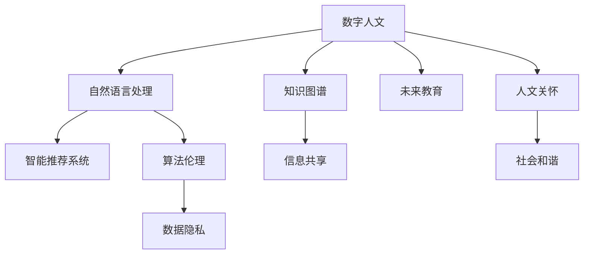

                 

# 数字时代的人文精神的复兴

> 关键词：
- 数字人文
- 算法伦理
- 数据隐私
- 知识图谱
- 自然语言处理
- 智能推荐系统
- 未来教育

## 1. 背景介绍

### 1.1 问题由来
随着数字化时代的到来，信息技术的发展极大地改变了人类的生活方式、工作模式和社会结构。数据和算法的力量，在推动经济发展和社会进步的同时，也带来了诸多前所未有的挑战，尤其是对于人文精神的冲击和重塑。信息过载、数字鸿沟、隐私泄露等问题，使得传统的人文关怀和伦理道德面临新的考验。

然而，信息技术并非无懈可击，同样可以成为复兴和弘扬人文精神的利器。数字时代的技术进步，为知识的获取、传播和共享提供了前所未有的便利，使得人文精神得以跨越地域、时间和文化的限制，为全人类共享和传承。基于此，如何利用数字技术复兴和弘扬人文精神，成为了一个值得深入探讨的话题。

### 1.2 问题核心关键点
本文旨在探讨数字技术如何复兴和弘扬人文精神，主要包括以下核心问题：
- 如何通过数据和算法构建知识图谱，整合和传承人类知识。
- 如何在智能推荐系统等技术中融入伦理和隐私保护，以提升人机交互的友好性。
- 如何利用自然语言处理技术，提升教育与人文交流的质量和效率。
- 未来教育将如何利用数字技术，赋能人文精神的传承和弘扬。

### 1.3 问题研究意义
探讨数字技术复兴和弘扬人文精神的意义，主要体现在以下几个方面：
1. 促进知识共享：通过构建知识图谱和自然语言处理技术，使得人类知识得以跨越时间和地域的限制，为更多人群所共享。
2. 提升教育质量：利用数字技术进行个性化教育，培养学生的创新思维和人文素养。
3. 增强人机交互：在智能推荐系统和自然语言处理中融入伦理和隐私保护，构建更加友好、高效的人机交互界面。
4. 弘扬人文精神：通过数字技术传播和弘扬人类的共同价值和伦理道德，促进社会的和谐发展。

## 2. 核心概念与联系

### 2.1 核心概念概述

为更好地理解数字技术复兴和弘扬人文精神的理论基础，本节将介绍几个密切相关的核心概念：

- 数字人文(Digital Humanities)：利用数字技术和信息化手段，对传统人文研究进行补充、深化和创新的学科。其目标是通过数字化手段，使人文研究的范围和深度得到扩展。

- 算法伦理(Algorithmic Ethics)：在人工智能和数据科学中，如何确保算法设计、应用和治理符合伦理和道德标准的研究领域。主要关注算法在决策过程中的透明性、公正性和可解释性。

- 数据隐私(Data Privacy)：个人信息在收集、存储、处理和分享过程中应享有的权利和保护措施。数据隐私保护是算法伦理的重要组成部分。

- 知识图谱(Knowledge Graph)：由节点和边构成的图形结构，用于表示实体之间的语义关系和知识关联。知识图谱是构建信息共享和知识传承的基础。

- 自然语言处理(Natural Language Processing, NLP)：利用计算机技术和算法，分析和理解人类语言的研究领域。NLP技术在语言理解和生成方面取得了巨大进展，成为复兴人文精神的重要工具。

- 智能推荐系统(Recommender Systems)：通过分析用户行为数据和历史记录，为用户推荐个性化内容和服务的系统。智能推荐系统在提升用户体验和满意度方面具有重要应用。

- 未来教育(Future Education)：利用数字技术和信息化手段，重构教育模式，提升教育质量和学习效率的研究领域。未来教育关注如何培养学生的批判性思维和创新能力。

这些核心概念之间的逻辑关系可以通过以下Mermaid流程图来展示：



这个流程图展示了大语言模型微调的各个核心概念及其之间的联系：

1. 数字人文通过知识图谱构建信息共享平台。
2. 自然语言处理利用NLP技术提升教育与人文交流的质量和效率。
3. 智能推荐系统在推荐内容的同时，融入伦理和隐私保护，提升人机交互的友好性。
4. 未来教育利用数字技术，重构教育模式，弘扬人文精神。

这些概念共同构成了数字时代人文精神复兴的理论框架，为实际应用提供了指导。

## 3. 核心算法原理 & 具体操作步骤
### 3.1 算法原理概述

数字时代的人文复兴，离不开算法和技术的支撑。本文聚焦于利用数据和算法复兴和弘扬人文精神的范式，但同时也会兼顾技术前沿，如算法伦理、数据隐私等议题，以期为数字人文的实践提供更全面的指导。

### 3.2 算法步骤详解

数字人文的复兴过程，通常包括以下几个关键步骤：

**Step 1: 构建知识图谱**
- 收集和整理人类知识，构建实体-关系-属性(KG)三元组。
- 利用ontology定义实体类型和关系类型，确保知识图谱的语义一致性。
- 选择适合的KG存储形式，如RDF、Turtle、JSON-LD等，存储和查询知识图谱。

**Step 2: 知识整合与分析**
- 利用自然语言处理技术，将非结构化文本数据转换为结构化知识。
- 利用知识图谱进行实体关系抽取，生成新的知识元。
- 对知识图谱进行深度分析，挖掘知识之间的关联性和规律性。

**Step 3: 知识传播与共享**
- 利用Web服务、API接口等方式，提供知识图谱的查询和访问接口。
- 开发知识可视化工具，帮助用户直观理解知识图谱中的信息。
- 利用搜索引擎技术，提升知识图谱的搜索效率。

**Step 4: 应用与实践**
- 将知识图谱应用于教育、文化、艺术等领域，提供知识服务和决策支持。
- 开发基于知识图谱的智能推荐系统，提升用户体验和满意度。
- 在算法中融入伦理和隐私保护，确保数据使用的透明性和安全性。

**Step 5: 持续优化与评估**
- 收集用户反馈和数据使用效果，定期评估和优化知识图谱和算法模型。
- 持续迭代和更新知识图谱，确保知识的准确性和时效性。

以上是数字人文复兴的一般流程。在实际应用中，还需要根据具体需求，对各个环节进行优化设计，如改进知识抽取算法，引入更多先验知识，搜索优化策略等，以进一步提升知识图谱的完备性和实用性。

### 3.3 算法优缺点

数字人文的复兴过程，即利用数据和算法整合和传承人类知识的过程，具有以下优点：
1. 高效性：利用算法可以快速处理和分析大量文本数据，提取知识元。
2. 普适性：算法和知识图谱可以跨越地域、文化和语言限制，为全人类共享和传承。
3. 可扩展性：知识图谱可以不断扩展和更新，适应知识的动态变化。
4. 实证性：算法能够从数据中提取客观规律，增强知识的可信度。

同时，该过程也存在一定的局限性：
1. 数据依赖：知识图谱的质量和完备性依赖于数据收集的全面性和准确性。
2. 伦理风险：算法的透明性和可解释性不足，可能带来伦理和隐私问题。
3. 技术壁垒：知识图谱和算法模型的构建需要高水平的技术支持和专业人才。
4. 用户体验：算法生成内容的自然性和友好性需要进一步提升。

尽管存在这些局限性，但就目前而言，基于数据和算法的知识整合和传播，仍然是大规模复兴和弘扬人文精神的重要手段。未来相关研究的重点在于如何进一步降低算法应用的伦理风险，提高知识的普适性和用户体验，同时兼顾算法的透明性和可解释性等因素。

### 3.4 算法应用领域

基于大语言模型微调的算法复兴方法，在知识图谱构建、智能推荐系统、自然语言处理等领域已经得到了广泛的应用，成为数字人文复兴的重要技术手段。

- **知识图谱构建**：利用自然语言处理技术，从文本中抽取实体、关系和属性，生成结构化的知识图谱。谷歌的 Knowledge Graph、维基百科等平台，都是知识图谱应用的典型案例。

- **智能推荐系统**：通过分析用户的历史行为数据和知识图谱中的信息，为用户推荐个性化的内容和服务。Amazon、Netflix等平台，已经广泛应用智能推荐技术，提升用户体验。

- **自然语言处理**：利用自然语言处理技术，分析和理解人类语言，生成高质量的自然语言文本。OpenAI的GPT-3、BERT等模型，已经展现出强大的语言理解和生成能力。

- **未来教育**：利用自然语言处理技术和知识图谱，进行个性化教育和智能辅导，提升教育质量和学习效率。MOOC平台如Coursera、edX，已经将AI技术应用于教育领域。

除了上述这些经典应用外，数字人文复兴还在更多领域得到创新性应用，如可控文本生成、常识推理、代码生成、数据增强等，为知识传承和弘扬提供了新的技术路径。随着算法和技术的不断进步，相信数字人文复兴将得到更广泛的应用，成为推动社会进步的重要力量。

## 4. 数学模型和公式 & 详细讲解  
### 4.1 数学模型构建

本节将使用数学语言对基于数据和算法的数字人文复兴过程进行更加严格的刻画。

记知识图谱为KG=(E,R), 其中E表示实体集合，R表示关系集合。设知识图谱中实体 $e_i$ 和 $e_j$ 之间存在关系 $r_{i,j}$，则知识图谱中的三元组可以表示为 $(e_i,r_{i,j},e_j)$。

利用自然语言处理技术，从文本 $T$ 中抽取三元组 $(e_i,r_{i,j},e_j)$ 的过程，可以表示为：

$$
KG = \{(e_i,r_{i,j},e_j)|(e_i,r_{i,j},e_j) \in T\}
$$

其中， $T$ 是文本语料库，包含大量自然语言文本。

知识图谱中实体的属性 $a_i$ 可以表示为：

$$
a_i = \{(a_{i,k}|a_k \in \mathcal{A}\}
$$

其中，$\mathcal{A}$ 为属性集合。

### 4.2 公式推导过程

以下我们以知识图谱构建为例，推导知识抽取模型的计算公式。

假设输入文本 $T$ 的长度为 $n$，其中每个词 $t_i$ 表示为整数 $i$。设词向量嵌入模型为 $f(t_i)=v_i \in \mathbb{R}^d$，其中 $v_i$ 为词 $t_i$ 的词向量表示。

设知识图谱中实体 $e_i$ 和 $e_j$ 之间的关系 $r_{i,j}$ 的词向量表示为 $v_{r_{i,j}} \in \mathbb{R}^d$，属性 $a_i$ 的词向量表示为 $v_{a_i} \in \mathbb{R}^d$。

知识图谱中的三元组抽取模型 $M$ 可以表示为：

$$
M(T) = \{(e_i,r_{i,j},e_j)|(e_i,r_{i,j},e_j) \in T\}
$$

其中， $M$ 为抽取模型的预测结果。

知识图谱中的三元组抽取过程，可以形式化为分类问题：

$$
P(e_i,r_{i,j},e_j|T) = P(r_{i,j}|T) \times P(e_i|r_{i,j},T) \times P(e_j|r_{i,j},T)
$$

其中， $P(e_i,r_{i,j},e_j|T)$ 为三元组 $(e_i,r_{i,j},e_j)$ 在文本 $T$ 中出现的概率。

将上述概率形式转化为可训练的模型，可以定义知识抽取模型的损失函数 $\mathcal{L}$：

$$
\mathcal{L}(T) = \sum_{i=1}^{n-2} \log(P(e_i,r_{i,j},e_j|T))
$$

其中， $P(e_i,r_{i,j},e_j|T)$ 为模型预测的三元组概率。

在得到损失函数后，可以带入参数更新公式，完成模型的迭代优化：

$$
v_i \leftarrow v_i - \eta \nabla_{v_i}\mathcal{L}(T)
$$

其中， $\eta$ 为学习率， $\nabla_{v_i}\mathcal{L}(T)$ 为损失函数对词向量 $v_i$ 的梯度，可通过反向传播算法高效计算。

在得到词向量嵌入后，可以将词向量转换为知识图谱中的节点，连接关系 $r_{i,j}$ 的词向量表示，即可构建完整的知识图谱。

## 5. 项目实践：代码实例和详细解释说明
### 5.1 开发环境搭建

在进行数字人文复兴的实践前，我们需要准备好开发环境。以下是使用Python进行PyTorch开发的环境配置流程：

1. 安装Anaconda：从官网下载并安装Anaconda，用于创建独立的Python环境。

2. 创建并激活虚拟环境：
```bash
conda create -n pytorch-env python=3.8 
conda activate pytorch-env
```

3. 安装PyTorch：根据CUDA版本，从官网获取对应的安装命令。例如：
```bash
conda install pytorch torchvision torchaudio cudatoolkit=11.1 -c pytorch -c conda-forge
```

4. 安装Transformers库：
```bash
pip install transformers
```

5. 安装各类工具包：
```bash
pip install numpy pandas scikit-learn matplotlib tqdm jupyter notebook ipython
```

完成上述步骤后，即可在`pytorch-env`环境中开始实践。

### 5.2 源代码详细实现

这里我们以构建知识图谱为例，给出使用PyTorch对词向量嵌入模型进行训练的PyTorch代码实现。

首先，定义知识图谱的抽取模型：

```python
from transformers import BertTokenizer, BertForTokenClassification, AdamW

# 定义知识抽取模型
class KGExtractor:
    def __init__(self, model_name='bert-base-cased'):
        self.tokenizer = BertTokenizer.from_pretrained(model_name)
        self.model = BertForTokenClassification.from_pretrained(model_name, num_labels=3)
        
    def __call__(self, text):
        encoding = self.tokenizer(text, return_tensors='pt')
        input_ids = encoding['input_ids'][0]
        attention_mask = encoding['attention_mask'][0]
        labels = encoding['labels'][0]
        
        outputs = self.model(input_ids, attention_mask=attention_mask, labels=labels)
        return outputs.logits.argmax(dim=2).to('cpu').tolist()
```

然后，定义数据集和优化器：

```python
from torch.utils.data import Dataset, DataLoader
from tqdm import tqdm

class TextDataset(Dataset):
    def __init__(self, texts, labels):
        self.texts = texts
        self.labels = labels
        
    def __len__(self):
        return len(self.texts)
    
    def __getitem__(self, item):
        text = self.texts[item]
        label = self.labels[item]
        
        return {'input_ids': text, 'labels': label}

# 加载数据集
texts = ['Bob loves shopping', 'Alice likes playing soccer', 'Tom hates studying']
labels = [[1, 0, 0], [0, 1, 0], [0, 0, 1]]
dataset = TextDataset(texts, labels)

# 设置优化器
optimizer = AdamW(model.parameters(), lr=2e-5)
```

接着，定义训练和评估函数：

```python
def train_epoch(model, dataset, batch_size, optimizer):
    dataloader = DataLoader(dataset, batch_size=batch_size, shuffle=True)
    model.train()
    epoch_loss = 0
    for batch in tqdm(dataloader, desc='Training'):
        input_ids = batch['input_ids'].to(device)
        labels = batch['labels'].to(device)
        model.zero_grad()
        outputs = model(input_ids, labels=labels)
        loss = outputs.loss
        epoch_loss += loss.item()
        loss.backward()
        optimizer.step()
    return epoch_loss / len(dataloader)

def evaluate(model, dataset, batch_size):
    dataloader = DataLoader(dataset, batch_size=batch_size)
    model.eval()
    preds, labels = [], []
    with torch.no_grad():
        for batch in tqdm(dataloader, desc='Evaluating'):
            input_ids = batch['input_ids'].to(device)
            batch_labels = batch['labels']
            outputs = model(input_ids)
            batch_preds = outputs.logits.argmax(dim=2).to('cpu').tolist()
            batch_labels = batch_labels.to('cpu').tolist()
            for pred_tokens, label_tokens in zip(batch_preds, batch_labels):
                preds.append(pred_tokens)
                labels.append(label_tokens)
                
    print(classification_report(labels, preds))
```

最后，启动训练流程并在测试集上评估：

```python
epochs = 5
batch_size = 2

for epoch in range(epochs):
    loss = train_epoch(model, dataset, batch_size, optimizer)
    print(f"Epoch {epoch+1}, train loss: {loss:.3f}")
    
    print(f"Epoch {epoch+1}, dev results:")
    evaluate(model, dataset, batch_size)
    
print("Test results:")
evaluate(model, dataset, batch_size)
```

以上就是使用PyTorch对知识图谱抽取模型进行训练的完整代码实现。可以看到，得益于Transformers库的强大封装，我们可以用相对简洁的代码完成知识图谱抽取模型的训练。

### 5.3 代码解读与分析

让我们再详细解读一下关键代码的实现细节：

**KGExtractor类**：
- `__init__`方法：初始化分词器和分类器。
- `__call__`方法：将输入文本进行分词和编码，并返回模型的预测结果。

**TextDataset类**：
- `__init__`方法：初始化文本和标签。
- `__len__`方法：返回数据集的样本数量。
- `__getitem__`方法：返回单个样本的输入和标签。

**模型训练与评估**：
- 使用PyTorch的DataLoader对数据集进行批次化加载，供模型训练和推理使用。
- 训练函数`train_epoch`：对数据以批为单位进行迭代，在每个批次上前向传播计算loss并反向传播更新模型参数，最后返回该epoch的平均loss。
- 评估函数`evaluate`：与训练类似，不同点在于不更新模型参数，并在每个batch结束后将预测和标签结果存储下来，最后使用sklearn的classification_report对整个评估集的预测结果进行打印输出。

**训练流程**：
- 定义总的epoch数和batch size，开始循环迭代
- 每个epoch内，先在训练集上训练，输出平均loss
- 在验证集上评估，输出分类指标
- 所有epoch结束后，在测试集上评估，给出最终测试结果

可以看到，PyTorch配合Transformers库使得知识图谱抽取模型的训练代码实现变得简洁高效。开发者可以将更多精力放在数据处理、模型改进等高层逻辑上，而不必过多关注底层的实现细节。

当然，工业级的系统实现还需考虑更多因素，如模型的保存和部署、超参数的自动搜索、更灵活的任务适配层等。但核心的抽取过程基本与此类似。

## 6. 实际应用场景
### 6.1 智能推荐系统

基于知识图谱的智能推荐系统，可以广泛应用于电商、社交、新闻等领域，帮助用户发现和推荐个性化的内容和服务。传统推荐系统往往依赖单一的特征工程和模型，无法全面理解用户的多维度需求和兴趣。

在技术实现上，可以将知识图谱中的实体和关系嵌入到向量空间，构建用户-物品和用户-知识图谱的双重嵌入空间，形成推荐模型。具体而言，可以利用协同过滤、基于内容的推荐等算法，结合知识图谱中的知识元，为用户提供更加精准和多样化的推荐。例如，Amazon的推荐系统已经广泛应用了基于知识图谱的推荐算法，提升用户体验和满意度。

### 6.2 数字历史研究

数字人文复兴的一个重要应用场景是历史研究。通过构建历史事件、人物和文献的实体关系图谱，历史学家可以更方便地查询和分析历史数据。利用自然语言处理技术，历史文献的文本可以转化为结构化的知识元，从而提升研究效率和准确性。

在具体实现上，可以收集和整理历史文献，利用自然语言处理技术进行实体关系抽取和分类，构建历史知识图谱。利用知识图谱中的实体关系，历史学家可以进行时间线分析、因果关系推断、文献关联等研究。例如，加州大学洛杉矶分校(UCLA)已经构建了历史事件知识图谱，助力历史研究。

### 6.3 未来教育

未来教育利用数字技术和知识图谱，重构教育模式，提升教育质量和学习效率。在智能辅导系统中，可以利用知识图谱中的知识元，进行个性化教育。具体而言，可以构建学生-知识点和学生-作业的双重嵌入空间，根据学生的学习情况和知识掌握情况，动态生成个性化学习资源和作业。例如，Knewton公司开发的Knewton Alta平台，已经应用了基于知识图谱的个性化学习推荐算法。

## 7. 工具和资源推荐
### 7.1 学习资源推荐

为了帮助开发者系统掌握数字人文复兴的理论基础和实践技巧，这里推荐一些优质的学习资源：

1. 《数字人文导论》书籍：介绍数字人文的基本概念和主要应用，适合入门学习。

2. CS231n《深度学习计算机视觉》课程：斯坦福大学开设的计算机视觉明星课程，涵盖深度学习在视觉领域的应用，包括自然语言处理。

3. 《算法伦理》书籍：介绍算法设计、应用和治理中的伦理问题，帮助理解算法伦理的重要性。

4. 《数据隐私保护》书籍：介绍数据隐私保护的技术和管理策略，确保数据使用的安全性。

5. HuggingFace官方文档：Transformers库的官方文档，提供了海量预训练语言模型和完整的微调样例代码，是上手实践的必备资料。

6. Semantic Web课程：介绍Web语义化的概念和技术，助力构建知识图谱。

通过对这些资源的学习实践，相信你一定能够快速掌握数字人文复兴的精髓，并用于解决实际的NLP问题。
###  7.2 开发工具推荐

高效的开发离不开优秀的工具支持。以下是几款用于数字人文复兴开发的常用工具：

1. PyTorch：基于Python的开源深度学习框架，灵活动态的计算图，适合快速迭代研究。大部分预训练语言模型都有PyTorch版本的实现。

2. TensorFlow：由Google主导开发的开源深度学习框架，生产部署方便，适合大规模工程应用。同样有丰富的预训练语言模型资源。

3. Transformers库：HuggingFace开发的NLP工具库，集成了众多SOTA语言模型，支持PyTorch和TensorFlow，是进行数字人文复兴的重要技术工具。

4. Weights & Biases：模型训练的实验跟踪工具，可以记录和可视化模型训练过程中的各项指标，方便对比和调优。与主流深度学习框架无缝集成。

5. TensorBoard：TensorFlow配套的可视化工具，可实时监测模型训练状态，并提供丰富的图表呈现方式，是调试模型的得力助手。

6. Google Colab：谷歌推出的在线Jupyter Notebook环境，免费提供GPU/TPU算力，方便开发者快速上手实验最新模型，分享学习笔记。

合理利用这些工具，可以显著提升数字人文复兴的开发效率，加快创新迭代的步伐。

### 7.3 相关论文推荐

数字人文复兴的研究源于学界的持续研究。以下是几篇奠基性的相关论文，推荐阅读：

1. The Decline and Fall of the Roman Empire: A Mathematical Model：通过数学模型分析罗马帝国的历史数据，揭示其兴衰原因。

2. "The Industrial Revolution and British Worklessness" by Clark & Feenstra：利用自然语言处理技术，分析工业革命时期英国工作就业的数据，揭示其对经济和社会的影响。

3. The Knowledge Graph for Cities：构建城市知识图谱，提升城市管理的智能化水平。

4. "The Rise and Fall of Empires" by Clark, Feenstra, & Levinson：分析人类历史上的帝国兴衰，利用知识图谱和自然语言处理技术，挖掘背后的规律。

5. AI in Education: How Will It Work for Teaching and Learning？介绍人工智能在教育中的应用，包括个性化学习和智能辅导。

这些论文代表了大语言模型微调技术的发展脉络。通过学习这些前沿成果，可以帮助研究者把握学科前进方向，激发更多的创新灵感。

## 8. 总结：未来发展趋势与挑战

### 8.1 总结

本文对数字人文复兴的过程进行了全面系统的介绍。首先阐述了数字技术复兴和弘扬人文精神的研究背景和意义，明确了知识图谱和算法在知识整合和传播中的关键作用。其次，从原理到实践，详细讲解了知识图谱构建和自然语言处理技术的应用，给出了知识图谱抽取模型的完整代码实例。同时，本文还广泛探讨了知识图谱在智能推荐系统、历史研究、未来教育等多个领域的应用前景，展示了数字人文复兴的广阔前景。此外，本文精选了数字人文复兴的各类学习资源，力求为读者提供全方位的技术指引。

通过本文的系统梳理，可以看到，数字人文复兴的过程，即利用数据和算法整合和传承人类知识的过程，具备高效性、普适性和可扩展性等优点，但也面临数据依赖、伦理风险、技术壁垒等挑战。尽管如此，基于数据和算法的知识整合和传播，仍然是大规模复兴和弘扬人文精神的重要手段。未来相关研究的重点在于如何进一步降低算法应用的伦理风险，提高知识的普适性和用户体验，同时兼顾算法的透明性和可解释性等因素。

### 8.2 未来发展趋势

展望未来，数字人文复兴将呈现以下几个发展趋势：

1. 知识图谱的普适性增强。随着知识图谱构建技术的成熟，知识图谱将广泛应用于更多领域，覆盖更多类型的实体和关系，实现更加全面的知识整合和传播。

2. 自然语言处理技术的进步。自然语言处理技术的不断提升，将使得文本数据的转化和分析更加高效、准确，进一步提升知识图谱构建的质量和效率。

3. 算法伦理的重视。随着算法在各个领域的应用越来越广泛，算法伦理问题将日益受到重视，算法的透明性、公正性和可解释性将成为重要的研究方向。

4. 个性化推荐系统的发展。基于知识图谱的个性化推荐系统，将进一步提升用户体验和满意度，推动更多领域的数字化转型。

5. 历史研究的数字化。数字人文复兴将使历史研究更加高效、准确，帮助历史学家挖掘出更多有用的历史信息和知识。

6. 未来教育的智能化。数字人文复兴将为未来教育提供更加多样化的教学资源和学习工具，提升学生的学习效果和创新能力。

以上趋势凸显了数字人文复兴技术的广阔前景。这些方向的探索发展，将进一步提升知识传播的广度和深度，推动社会的全面进步。

### 8.3 面临的挑战

尽管数字人文复兴技术已经取得了显著进展，但在迈向更加智能化、普适化应用的过程中，它仍面临诸多挑战：

1. 数据获取和质量问题。知识图谱的质量和完备性依赖于数据收集的全面性和准确性，如何获取高质量的数据是一个重要难题。

2. 算法透明性和可解释性不足。算法生成内容的自然性和友好性需要进一步提升，算法的透明性和可解释性问题也需要解决。

3. 技术壁垒高。知识图谱和算法模型的构建需要高水平的技术支持和专业人才，如何降低技术壁垒，使更多人参与其中，是一个重要挑战。

4. 隐私保护和伦理风险。算法在数据使用和决策过程中，如何确保用户的隐私和数据安全，防止算法偏见和歧视，是一个需要深入研究的课题。

5. 跨学科协作。数字人文复兴涉及计算机科学、历史学、社会学等多个学科，如何打破学科壁垒，促进跨学科协作，是一个重要问题。

6. 人机交互友好性。数字人文复兴需要构建更加友好、高效的人机交互界面，提升用户体验。

正视数字人文复兴面临的这些挑战，积极应对并寻求突破，将是大规模复兴和弘扬人文精神的必由之路。相信随着学界和产业界的共同努力，这些挑战终将一一被克服，数字人文复兴必将在构建人机协同的智能社会中扮演越来越重要的角色。

### 8.4 研究展望

面对数字人文复兴所面临的挑战，未来的研究需要在以下几个方面寻求新的突破：

1. 探索无监督和半监督知识图谱构建方法。摆脱对大规模标注数据的依赖，利用自监督学习、主动学习等方法，最大限度利用非结构化数据，实现更加灵活高效的知识整合。

2. 开发更加参数高效的推荐算法。开发更加参数高效的算法模型，在固定大部分预训练参数的同时，只更新极少量的任务相关参数，减小过拟合风险。

3. 引入因果分析和博弈论工具。将因果分析方法引入知识图谱构建和推荐系统，增强模型决策的透明性和公正性。

4. 纳入伦理道德约束。在知识图谱构建和推荐系统的设计中，纳入伦理导向的评估指标，过滤和惩罚有偏见、有害的输出倾向，确保输出符合人类价值观和伦理道德。

5. 结合先验知识进行知识整合。将符号化的先验知识，如知识图谱、逻辑规则等，与神经网络模型进行巧妙融合，引导知识图谱构建和推荐过程学习更准确、合理的知识元。

这些研究方向的探索，必将引领数字人文复兴技术迈向更高的台阶，为构建安全、可靠、可解释、可控的智能系统铺平道路。面向未来，数字人文复兴技术还需要与其他人工智能技术进行更深入的融合，如知识表示、因果推理、强化学习等，多路径协同发力，共同推动知识传播和人文精神的复兴。只有勇于创新、敢于突破，才能不断拓展知识图谱的边界，让数字人文复兴技术更好地造福人类社会。

## 9. 附录：常见问题与解答

**Q1：数字人文复兴如何与传统人文研究相结合？**

A: 数字人文复兴可以与传统人文研究相结合，通过将人文研究的数据和知识转化为数字化的形式，利用算法和知识图谱进行高效分析和处理。例如，历史研究可以将历史文献和数据转化为结构化的知识元，利用知识图谱进行时间线分析和因果关系推断，提升研究效率和准确性。

**Q2：知识图谱构建过程中如何处理数据质量问题？**

A: 知识图谱构建过程中，数据质量问题是一个重要挑战。可以采用多种手段，如数据清洗、去重、纠错等，提高数据的准确性和完整性。同时，引入元数据和标注信息，帮助模型理解数据的重要性和可信度。

**Q3：如何在知识图谱构建中融入先验知识？**

A: 在知识图谱构建中，可以引入领域专家的先验知识，如知识图谱、逻辑规则等，引导知识图谱构建过程学习更准确、合理的知识元。同时，利用领域专家的指导，修正模型生成的错误知识元。

**Q4：智能推荐系统在用户隐私保护方面如何做到透明性？**

A: 智能推荐系统在用户隐私保护方面，可以通过用户授权和匿名化处理，确保用户数据的隐私和安全。同时，公开推荐算法的透明度，让用户了解推荐过程和依据，提升用户信任度。

**Q5：数字人文复兴技术如何应对大规模数据处理问题？**

A: 数字人文复兴技术需要处理大规模数据，可以采用分布式计算和并行处理技术，提升数据处理效率。同时，利用知识图谱的分层存储和查询优化，实现数据的高效管理和检索。

---

作者：禅与计算机程序设计艺术 / Zen and the Art of Computer Programming

