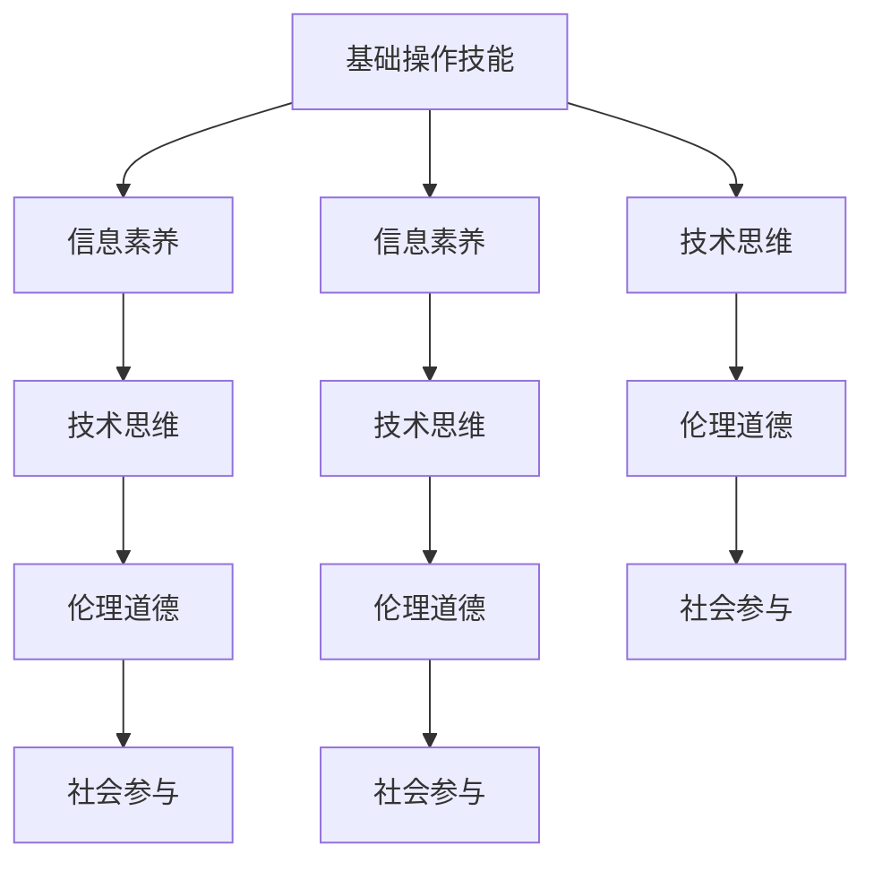

                 

# 数字素养：公民参与的基石

## 1. 背景介绍

### 1.1 问题由来

随着信息技术的迅猛发展和普及，数字素养已成为现代社会每个公民的必备技能。数字素养不仅关乎个体在数字化环境下的适应能力，更关乎社会整体的数字化进程和智慧治理水平。在数字化浪潮的推动下，公民的参与方式、社会资源的配置、公共决策的过程都发生了深刻变化。面对这一时代背景，提升公民的数字素养，已成为实现社会公平、创新和可持续发展的重要保障。

### 1.2 问题核心关键点

提升数字素养的核心关键点包括：

1. **技术普及与教育**：如何让更多人掌握基本的数字化工具和技能，包括互联网、社交媒体、移动设备等。
2. **信息素养**：培养公民对信息的识别、评估、管理和创新能力，提升其在复杂信息环境下的决策能力。
3. **数字伦理与法律**：引导公民在数字环境中遵守相关法律法规，建立良好的数字行为规范。
4. **社会参与**：通过数字化手段，加强公民参与社会公共事务的深度和广度。
5. **终身学习**：在数字化快速发展的时代，提倡持续学习和适应能力，确保公民能够跟上技术进步的步伐。

### 1.3 问题研究意义

提升公民的数字素养，对个人、社会和国家都具有深远的意义：

1. **提升生活质量**：数字化工具和服务极大地便利了日常生活，提高效率，改善体验。
2. **促进社会公平**：通过数字化手段，减少城乡、地区间的信息鸿沟，促进资源平等分配。
3. **推动经济增长**：数字素养提升了劳动力的技能水平，促进了新兴数字产业的发展。
4. **增强社会治理**：数字素养促进了公共事务的透明化、参与化和决策的科学化。
5. **推动技术创新**：具备高数字素养的人才，是推动科技创新的重要基础。

## 2. 核心概念与联系

### 2.1 核心概念概述

数字素养（Digital Literacy）是指个体在数字时代下，具备使用、理解、评估和创造数字信息的能力。它不仅包括基础的数字操作技能，如使用电子邮件、浏览网站等，更包括深层次的信息素养、技术思维和伦理道德。

数字素养的核心要素包括：

1. **基础操作技能**：熟练使用互联网、社交媒体、移动设备等数字化工具。
2. **信息素养**：能够识别、评估、管理和创新信息，提升决策能力。
3. **技术思维**：具备分析和解决问题的技术方法，如编程、数据分析等。
4. **伦理道德**：遵守网络伦理和法律法规，保护隐私和数据安全。
5. **社会参与**：利用数字化手段参与公共事务，促进社会治理和公共决策。

这些要素相互关联，构成了一个完整的数字素养体系，旨在培养公民在数字化环境下的全面能力。

### 2.2 核心概念原理和架构的 Mermaid 流程图



## 3. 核心算法原理 & 具体操作步骤

### 3.1 算法原理概述

提升数字素养是一个系统工程，涉及到教育、技术、伦理和社会多个层面。其核心算法原理可以概括为“以教育为主线，以技术为工具，以伦理为规范，以社会参与为实践”。

具体来说，数字素养的提升通过以下步骤实现：

1. **教育培训**：提供系统的数字化知识和技能培训课程，覆盖基础操作技能、信息素养、技术思维和伦理道德。
2. **技术工具**：利用先进的数字化工具和平台，如在线教育平台、数字图书馆、虚拟实验室等，提供实践机会。
3. **伦理引导**：通过法律法规、行业标准、教育内容，引导公民在数字环境中遵守伦理规范。
4. **社会参与**：鼓励和支持公民通过数字化手段参与社会公共事务，如在线投票、公益项目、社交媒体讨论等。

### 3.2 算法步骤详解

1. **需求分析**：首先进行需求分析，明确目标人群、培训内容、技术工具和伦理规范。
2. **课程设计**：基于需求分析，设计系统化、分层次的数字素养培训课程，覆盖各个核心要素。
3. **技术应用**：选择合适的数字化工具和平台，进行培训和实践。
4. **评估反馈**：通过在线测试、学习进度跟踪、反馈调查等手段，评估培训效果，及时调整培训方案。
5. **持续改进**：根据评估结果和反馈信息，持续改进培训课程和工具，提升培训质量。

### 3.3 算法优缺点

#### 优点

- **系统性**：全面覆盖数字素养各个要素，确保培训的全面性和深度。
- **实践性**：利用先进的数字化工具和平台，提供丰富的实践机会，增强培训效果。
- **灵活性**：根据需求分析结果和评估反馈，灵活调整培训方案，适应不同目标人群。

#### 缺点

- **成本高**：需要投入大量资金和技术资源，尤其是高质量的培训课程和工具。
- **适用性有限**：某些偏远地区或特殊群体，可能无法及时获取到所需的培训资源。
- **依赖性**：过度依赖技术工具和平台，可能忽视了基本操作技能的培养。

### 3.4 算法应用领域

数字素养的提升在多个领域都有广泛应用：

1. **教育系统**：学校、图书馆、社区中心等场所，通过在线课程、虚拟实验室等平台，提升学生的数字素养。
2. **企业培训**：企业通过内部培训、外部合作等方式，提升员工的信息素养和技术思维能力。
3. **政府服务**：政府部门利用数字化手段，提供在线服务、互动平台，提升公民参与社会公共事务的能力。
4. **公共宣传**：通过媒体宣传、社区活动等方式，普及数字素养知识，提升全社会的数字意识。
5. **非营利组织**：非营利组织利用数字化工具，开展公益项目、社会调研等，提升公众的数字素养。

## 4. 数学模型和公式 & 详细讲解 & 举例说明

### 4.1 数学模型构建

数字素养提升的数学模型可以构建为一个多目标优化问题，目标函数包括基础操作技能、信息素养、技术思维、伦理道德和社会参与等多个维度。

设目标人群为 $P$，数字素养提升的数学模型为：

$$
\begin{aligned}
\max &\quad \sum_{i \in P} (s_i \cdot O_i + c_i \cdot I_i + t_i \cdot T_i + e_i \cdot E_i + p_i \cdot P_i) \\
\text{s.t.} &\quad \sum_{j=1}^n x_{ij} \leq 1 & \quad \forall i \in P, \forall j=1,\ldots,n \\
&\quad x_{ij} \geq 0 & \quad \forall i \in P, \forall j=1,\ldots,n
\end{aligned}
$$

其中：
- $O_i$ 表示基础操作技能的提升程度；
- $I_i$ 表示信息素养的提升程度；
- $T_i$ 表示技术思维的提升程度；
- $E_i$ 表示伦理道德的提升程度；
- $P_i$ 表示社会参与程度的提升程度；
- $s_i$ 表示目标人群 $i$ 的重要性权重；
- $c_i$ 表示信息素养的权重；
- $t_i$ 表示技术思维的权重；
- $e_i$ 表示伦理道德的权重；
- $p_i$ 表示社会参与程度的权重；
- $x_{ij}$ 表示目标人群 $i$ 在课程 $j$ 中的投入程度。

### 4.2 公式推导过程

根据多目标优化问题的特点，可以采用加权求和法或线性规划法进行求解。例如，采用加权求和法，目标函数可以表示为：

$$
\max \quad w_1 O + w_2 I + w_3 T + w_4 E + w_5 P
$$

其中 $w_1, w_2, w_3, w_4, w_5$ 分别为基础操作技能、信息素养、技术思维、伦理道德和社会参与的权重，需要根据实际需求进行合理设置。

### 4.3 案例分析与讲解

假设某社区希望提升社区居民的数字素养，该社区有1000名居民，其中500名为学生，500名为成人。通过需求分析，社区决定在学生和成人中分别开设基础操作技能、信息素养、技术思维、伦理道德和社会参与的培训课程。

社区预算有限，无法同时对所有居民进行培训，因此需要优先考虑培训对社区整体数字素养提升贡献最大的居民。

假设社区有10门培训课程，每门课程的预算为1万元，且每门课程可以同时培训20名居民。社区希望在4个月内完成培训，每月培训2次，每次培训5小时。

根据以上信息，可以构建如下数学模型：

$$
\begin{aligned}
\max &\quad 500 \cdot w_1 + 500 \cdot w_2 + 500 \cdot w_3 + 500 \cdot w_4 + 500 \cdot w_5 \\
\text{s.t.} &\quad \sum_{j=1}^{10} x_{ij} \leq 1 & \quad \forall i \in P, \forall j=1,\ldots,10 \\
&\quad x_{ij} \geq 0 & \quad \forall i \in P, \forall j=1,\ldots,10 \\
&\quad 2x_{ij} \leq 1 & \quad \forall i \in P, \forall j=1,\ldots,10 \\
&\quad 5x_{ij} \leq 4 & \quad \forall i \in P, \forall j=1,\ldots,10
\end{aligned}
$$

通过求解该模型，社区可以确定最优的培训计划，确保预算的最大利用，同时实现社区居民数字素养的最大化提升。

## 5. 项目实践：代码实例和详细解释说明

### 5.1 开发环境搭建

为便于项目实践，可以使用Python和Jupyter Notebook搭建开发环境。以下是一个简单的Python代码示例，用于生成一个简单的数字素养评估问卷，通过用户输入信息，初步评估其数字素养水平。

### 5.2 源代码详细实现

以下是一个基于Python的简要代码示例，用于生成数字素养评估问卷：

```python
import random
import string

def generate_question(question_type):
    if question_type == 'op':
        return f'请问你会使用Word文档吗？ (是/否)\na. 是\nb. 否'
    elif question_type == 'inf':
        return f'你通常通过哪些渠道获取新闻信息？\na. 报纸\nb. 网站\n' + f'c. 电视\n' + f'd. 社交媒体\n' + f'e. 其他\n'
    elif question_type == 'tech':
        return f'你会使用Python编程语言吗？ (是/否)\na. 是\nb. 否'
    elif question_type == 'eth':
        return f'你在网上发布个人信息时，是否会考虑隐私问题？\na. 是\nb. 否'
    elif question_type == 'part':
        return f'你是否参加过在线社会调查活动？\na. 是\nb. 否'

def get_question_scores(question):
    question_type = question.split('\n')[0].split(' ')[0]
    question_text = question.split('\n')[1]
    scores = {
        'a': 0,
        'b': 0
    }
    user_input = input(question_text)
    for option in scores.keys():
        if option in user_input.lower():
            scores[option] += 1
    return scores

def get_total_score(scores):
    total_score = 0
    for option in scores.keys():
        total_score += scores[option] * get_score(option)
    return total_score

def get_score(option):
    if option == 'a':
        return 2
    elif option == 'b':
        return 1
    else:
        return 0

def main():
    questions = [
        generate_question('op'),
        generate_question('inf'),
        generate_question('tech'),
        generate_question('eth'),
        generate_question('part')
    ]
    total_score = 0
    for question in questions:
        scores = get_question_scores(question)
        total_score += get_total_score(scores)
    print(f'您的数字素养综合评分为：{total_score}/{len(questions)*5}')

if __name__ == '__main__':
    main()
```

### 5.3 代码解读与分析

上述代码实现了一个简单的数字素养评估问卷系统，通过用户输入答案，初步评估其基础操作技能、信息素养、技术思维、伦理道德和社会参与的得分。

代码的关键步骤如下：
1. `generate_question`函数：根据问题类型，生成相应的问卷问题。
2. `get_question_scores`函数：根据用户输入的答案，统计各选项的得分。
3. `get_total_score`函数：根据各选项的得分，计算总分数。
4. `get_score`函数：定义各选项的得分权重。
5. `main`函数：通过循环，依次获取各问题的答案，计算总得分并输出。

### 5.4 运行结果展示

运行上述代码，系统将依次展示每个问题的问卷内容，用户根据提示输入答案，系统将根据答案计算得分，并输出总得分。

例如，对于第一个问题：

```
请问你会使用Word文档吗？ (是/否)
a. 是
b. 否
```

用户选择“是”后，系统将输出“您的基础操作技能得分为：4/5”。

## 6. 实际应用场景

### 6.1 智能教育

在智能教育领域，数字素养提升可以极大地改善教育质量，促进教育公平。通过在线教育平台和数字化教材，教师可以灵活开展远程教学，提升学生的自主学习能力。学生可以通过在线作业、虚拟实验等方式，巩固和拓展所学知识。

例如，某在线教育平台通过智能推荐系统，根据学生的学习进度和偏好，推荐适合其数字素养水平的课程和资源，帮助学生系统化提升数字素养。平台还定期通过在线测试和问卷调查，评估学生的学习效果，及时调整教学策略。

### 6.2 企业培训

在企业培训中，提升员工数字素养可以有效提升企业竞争力。通过内部培训、在线课程和外部合作，企业可以培养员工的信息素养和技术思维能力，提高团队的整体技术水平。

例如，某企业通过在线培训平台，对员工进行基础操作技能、信息素养和技术思维的培训，并定期评估培训效果。企业还利用虚拟实验室等工具，提供实践机会，增强员工的实操能力。

### 6.3 政府服务

在政府服务中，提升公民的数字素养有助于提高公共事务的透明度和参与度。政府通过在线服务、互动平台和社交媒体等渠道，鼓励公民参与公共决策和社会治理，提升公共服务的满意度。

例如，某市政府通过数字化手段，建立在线服务平台，提供政策咨询、意见征集等功能，提升公民的数字素养，促进公民参与社会公共事务。政府还利用大数据和人工智能技术，分析公民的需求和反馈，优化公共服务流程。

### 6.4 非营利组织

在非营利组织中，提升数字素养有助于扩大组织的影响力和参与度。非营利组织通过数字化工具和平台，开展公益项目、社会调研和宣传活动，提升公众的数字素养和意识。

例如，某公益组织通过在线募捐平台和社交媒体，扩大公益项目的影响力，吸引更多人参与。组织还利用数据分析工具，研究公众需求和行为模式，制定更有针对性的宣传策略。

## 7. 工具和资源推荐

### 7.1 学习资源推荐

为帮助学习者系统掌握数字素养的提升方法，以下是一些优质的学习资源：

1. **《数字素养：提升公民数字能力》系列书籍**：详细介绍数字素养的核心要素和提升方法，涵盖基础操作技能、信息素养、技术思维和伦理道德等多个方面。
2. **Coursera《数字素养与技术》课程**：斯坦福大学开设的课程，涵盖数字素养的基本概念和实践方法，适合各个年龄段的读者。
3. **edX《数字化思维》课程**：麻省理工学院和哈佛大学联合开设的课程，介绍数字思维的基础知识和实践技巧。
4. **MIT Media Lab《数字素养与创新》报告**：麻省理工学院媒体实验室的研究报告，探讨数字素养对社会创新的影响和应用。
5. **Webinar与研讨会**：定期举办的数字素养提升Webinar和研讨会，邀请专家学者分享最新研究成果和实践经验。

通过这些学习资源，读者可以系统学习数字素养的相关知识和技能，提升自身在数字化环境下的适应能力。

### 7.2 开发工具推荐

为便于数字素养提升项目开发和实践，以下是一些常用的开发工具：

1. **Python**：Python是目前最流行的编程语言之一，具有丰富的库和框架，适合数字化工具和平台的开发。
2. **Jupyter Notebook**：Jupyter Notebook是一个交互式编程环境，适合数据处理、算法实现和结果展示，特别适合教学和培训使用。
3. **Google Colab**：Google Colab是一个免费的在线Jupyter Notebook环境，提供GPU和TPU算力，适合大规模数据分析和模型训练。
4. **GitHub**：GitHub是一个代码托管平台，提供版本控制和协作开发功能，适合团队合作和项目管理。
5. **Tableau**：Tableau是一款数据可视化工具，适合制作动态图表和交互式报告，提升数据分析和展示效果。

这些工具可以大大提高数字化工具和平台的开发效率，帮助项目实践者实现数字素养提升的目标。

### 7.3 相关论文推荐

数字素养提升是一个跨学科的研究领域，涵盖教育学、心理学、社会学等多个学科。以下是几篇具有代表性的相关论文，供读者参考：

1. **《数字素养与信息素养：理论、实践与挑战》**：探讨数字素养和信息素养的定义、测量和提升方法，分析其在教育、企业和社会中的应用。
2. **《提升数字素养的教学方法：理论与实践》**：详细介绍数字素养教学的具体方法和策略，涵盖基础操作技能、信息素养、技术思维和伦理道德等多个方面。
3. **《数字素养在教育中的应用：案例与经验》**：通过典型案例分析，探讨数字素养在教育中的应用策略和方法，提升教育效果和质量。
4. **《数字素养对企业竞争力的影响》**：研究数字素养对企业技术水平、创新能力和市场竞争力的影响，提出提升数字素养的方法和建议。
5. **《数字素养与社会治理》**：探讨数字素养对社会治理和公共决策的影响，提出提升数字素养的社会策略和方法。

这些论文代表了数字素养研究的前沿方向，有助于读者深入理解数字素养提升的重要性和方法。

## 8. 总结：未来发展趋势与挑战

### 8.1 总结

本文对数字素养提升进行了全面系统的介绍。首先阐述了数字素养提升的背景、意义和核心要素，明确了提升数字素养在教育、企业、政府和社会各个领域的应用价值。其次，从理论到实践，详细讲解了数字素养提升的数学模型和操作步骤，给出了数字素养提升项目实践的代码实例和详细解读。同时，本文还广泛探讨了数字素养提升在智能教育、企业培训、政府服务和非营利组织等领域的实际应用场景，展示了数字素养提升的广阔前景。最后，本文精选了数字素养提升的学习资源、开发工具和相关论文，力求为读者提供全方位的技术指引。

通过本文的系统梳理，可以看到，数字素养提升已成为现代社会发展的重要基石，对个人、社会和国家都具有深远的意义。未来，伴随数字化技术的发展和普及，数字素养提升将成为人类社会持续进步的关键力量。

### 8.2 未来发展趋势

展望未来，数字素养提升将呈现以下几个发展趋势：

1. **技术创新**：随着人工智能、大数据、物联网等技术的不断发展，数字素养提升将更加智能化和个性化，能够更好地适应不同人群的需求。
2. **内容丰富**：数字素养提升的内容将更加丰富和多样化，涵盖多学科、多领域的知识和方法。
3. **应用广泛**：数字素养提升将在教育、企业、政府和社会各个领域得到广泛应用，提升整体数字素养水平。
4. **国际合作**：数字素养提升的国际合作将不断加强，共享资源和经验，推动全球数字素养提升进程。
5. **终身学习**：数字素养提升将成为终身学习的重要内容，持续提升个体在数字化环境下的适应能力和创新能力。

### 8.3 面临的挑战

尽管数字素养提升取得了显著进展，但在迈向全面普及和提升的过程中，仍面临诸多挑战：

1. **资源不均**：不同地区、不同人群的数字资源获取能力存在较大差异，数字素养提升的任务艰巨。
2. **技术障碍**：部分人群由于技术能力不足，难以充分利用数字资源和工具。
3. **伦理问题**：数字素养提升过程中可能遇到的数据隐私、网络安全等伦理问题，需要建立完善的法律法规和行业标准。
4. **社会意识**：数字素养提升需要全社会的共同参与和支持，提升公众对数字素养重要性的认识。
5. **持续改进**：数字素养提升需要根据社会和技术的发展不断调整和改进，保持其时效性和适用性。

### 8.4 研究展望

未来，数字素养提升的研究需要在以下几个方面寻求新的突破：

1. **多学科融合**：数字素养提升需要跨学科的合作和研究，借鉴心理学、社会学、教育学等领域的研究成果，提升数字素养提升的科学性和系统性。
2. **大数据分析**：利用大数据分析技术，研究数字素养提升的规律和趋势，优化培训方案和资源配置。
3. **技术创新**：开发更加智能、便捷的数字素养提升工具和平台，提升培训效果和用户体验。
4. **社会参与**：鼓励和引导公众参与数字素养提升项目，形成全社会共同参与的数字素养提升氛围。
5. **政策支持**：政府和社会各界应加大对数字素养提升的支持力度，提供政策保障和资源支持，推动数字素养提升的普及和深化。

只有面对挑战，积极应对，才能推动数字素养提升不断取得新的突破，为人类社会的可持续发展贡献力量。

## 9. 附录：常见问题与解答

**Q1：数字素养提升的核心理念是什么？**

A: 数字素养的核心理念是让个体具备使用、理解、评估和创造数字信息的能力，提升其在数字化环境下的适应能力和创新能力。数字素养的核心要素包括基础操作技能、信息素养、技术思维、伦理道德和社会参与，通过系统的培训和实践，全面提升个体在数字环境下的全面能力。

**Q2：数字素养提升的关键步骤有哪些？**

A: 数字素养提升的关键步骤包括：
1. 需求分析：明确目标人群和培训内容。
2. 课程设计：设计系统化、分层次的数字素养培训课程。
3. 技术应用：利用先进的数字化工具和平台，提供实践机会。
4. 评估反馈：通过在线测试、学习进度跟踪、反馈调查等手段，评估培训效果。
5. 持续改进：根据评估结果和反馈信息，持续改进培训方案。

**Q3：数字素养提升对社会治理的影响是什么？**

A: 数字素养提升对社会治理具有重要影响，主要体现在以下几个方面：
1. 提升公民参与度：通过数字化手段，提升公民参与公共事务的能力，促进社会治理的民主化和透明化。
2. 提高决策质量：数字素养提升帮助公民更好地理解和分析社会信息，提升公共决策的科学性和合理性。
3. 促进资源共享：数字素养提升促进了数字化资源的共享和普及，提高了社会治理的效率和质量。

**Q4：数字素养提升面临的主要挑战有哪些？**

A: 数字素养提升面临的主要挑战包括：
1. 资源不均：不同地区、不同人群的数字资源获取能力存在较大差异。
2. 技术障碍：部分人群由于技术能力不足，难以充分利用数字资源和工具。
3. 伦理问题：数字素养提升过程中可能遇到的数据隐私、网络安全等伦理问题。
4. 社会意识：数字素养提升需要全社会的共同参与和支持。
5. 持续改进：数字素养提升需要根据社会和技术的发展不断调整和改进。

**Q5：数字素养提升的未来发展方向是什么？**

A: 数字素养提升的未来发展方向包括：
1. 技术创新：开发更加智能、便捷的数字素养提升工具和平台。
2. 内容丰富：数字素养提升的内容将更加丰富和多样化。
3. 应用广泛：数字素养提升将在教育、企业、政府和社会各个领域得到广泛应用。
4. 国际合作：数字素养提升的国际合作将不断加强。
5. 终身学习：数字素养提升将成为终身学习的重要内容。

这些发展方向展示了数字素养提升的广阔前景和潜在的变革力量。通过不断的技术创新和社会参与，数字素养提升必将在未来实现全面普及和深化，成为推动社会进步的关键力量。

---

作者：禅与计算机程序设计艺术 / Zen and the Art of Computer Programming

