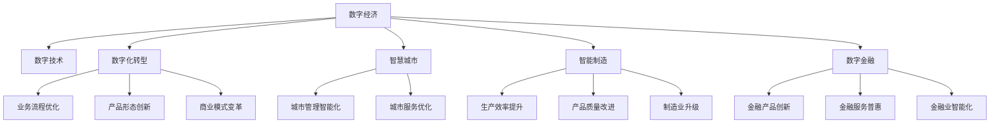

                 

## 1. 背景介绍

### 1.1 问题由来
随着信息技术、互联网技术、大数据技术的迅猛发展，数字经济逐渐成为全球经济社会发展的重要引擎。数字经济不仅对传统的生产模式、消费模式、贸易模式带来了深刻变革，还极大地促进了产业升级、经济结构优化和社会生产力提升。在新的历史阶段，如何充分发挥数字经济的潜力，推动社会全面进步，成为全球范围内共同面临的重大课题。

### 1.2 问题核心关键点
数字经济的快速发展离不开先进技术的支撑，包括人工智能、大数据、物联网、云计算、区块链等。这些技术的融合应用，不仅使得生产效率大幅提升，还极大地拓宽了产业的边界，催生了新的商业模式和产业生态。在传统行业向数字化、智能化转型过程中，数字经济起到了关键性的推动作用。

### 1.3 问题研究意义
研究数字经济的社会影响及其推动作用，对于理解未来的经济社会发展趋势，制定相应的政策和措施，具有重要的现实意义。数字经济的全面渗透，能够加速知识普及、促进资源优化配置、优化产业链结构、提升生产效率和生活质量，从而更好地服务人类社会。

## 2. 核心概念与联系

### 2.1 核心概念概述

为更好地理解数字经济及其对社会的影响，本节将介绍几个密切相关的核心概念：

- 数字经济：以信息技术和数字技术为核心驱动力，依托互联网、大数据、人工智能等新兴技术，形成新的生产、交换、分配和消费方式，促进经济社会发展的新经济形态。
- 数字技术：包括云计算、大数据、人工智能、物联网、区块链等新兴技术，构成数字经济的基础设施。
- 数字化转型：传统行业利用数字技术对业务流程、产品形态、商业模式进行改造，实现从数字化向智能化全面升级的过程。
- 智慧城市：利用信息技术和数字技术，构建一个高效、智能、可持续发展的城市环境，实现城市管理和服务的全面升级。
- 智能制造：通过数字化、网络化、智能化手段，改造传统制造业，提升生产效率和产品质量，实现制造业的升级转型。
- 数字金融：依托数字技术，创新金融产品和服务模式，推动金融业的数字化、普惠化和智能化发展。

这些核心概念之间的逻辑关系可以通过以下Mermaid流程图来展示：



这个流程图展示了大语言模型的核心概念及其之间的关系：

1. 数字经济通过数字技术的驱动，形成新的生产、交换、分配和消费方式。
2. 数字化转型、智慧城市、智能制造和数字金融等具体应用，是数字经济的实践领域。
3. 这些应用通过优化业务流程、创新产品形态、变革商业模式，实现数字化和智能化的全面升级。
4. 业务流程优化、产品形态创新、商业模式变革等，是数字化转型的具体实现方式。
5. 城市管理智能化、城市服务优化、生产效率提升、产品质量改进、制造业升级等，是智慧城市、智能制造的实际应用。
6. 金融产品创新、金融服务普惠、金融业智能化等，是数字金融的实际应用。

这些概念共同构成了数字经济的发展框架，使得数字技术得以在多个领域得到广泛应用，推动社会全面进步。

## 3. 核心算法原理 & 具体操作步骤

### 3.1 算法原理概述

数字经济的实现离不开先进技术的支持，包括云计算、大数据、人工智能、物联网、区块链等。这些技术的应用，本质上是基于算法的优化和优化算法的部署。数字经济的核心算法原理主要包括：

- 数据采集与处理：通过传感器、大数据平台等技术，实现海量数据的采集、存储和处理。
- 数据挖掘与分析：利用机器学习和深度学习算法，从大数据中挖掘出有用的信息和规律。
- 人工智能与智能化：通过算法实现机器自动推理、决策和执行，提高生产效率和生活质量。
- 区块链与智能合约：利用分布式账本技术和智能合约，实现去中心化的数据记录和交易，增强安全性。

数字经济的具体实现步骤主要包括：

1. 数据采集：通过传感器、物联网设备等，实时收集各种数据，为后续的数据处理和分析提供基础。
2. 数据处理：利用大数据技术，对收集的数据进行清洗、整理、转换和存储，使其可用于后续的分析和应用。
3. 数据挖掘与分析：通过机器学习、深度学习等算法，从数据中提取有价值的信息，支持决策和优化。
4. 人工智能与智能化：将算法应用于实际场景中，实现机器自动推理、决策和执行，提升生产效率和生活质量。
5. 区块链与智能合约：利用区块链技术，实现去中心化的数据记录和交易，增强数据安全性和透明度。

### 3.2 算法步骤详解

数字经济的具体实现步骤如下：

**Step 1: 数据采集与处理**
- 通过传感器、物联网设备、云计算平台等技术，实时采集各类数据，如温度、湿度、位置、交易数据等。
- 利用大数据技术，对采集的数据进行清洗、整理、转换和存储，去除噪声和异常值，提取有用信息。

**Step 2: 数据挖掘与分析**
- 利用机器学习、深度学习等算法，从清洗后的数据中提取有价值的信息和规律，如趋势、模式、关联关系等。
- 使用分类、聚类、回归等算法，对数据进行分析和建模，支持决策和优化。

**Step 3: 人工智能与智能化**
- 将算法应用于实际场景中，实现机器自动推理、决策和执行，提高生产效率和生活质量。
- 例如，在制造业中，利用机器学习算法预测设备故障，自动调整生产参数，提升生产效率。

**Step 4: 区块链与智能合约**
- 利用区块链技术，实现去中心化的数据记录和交易，增强数据安全性和透明度。
- 例如，在金融领域，利用智能合约自动执行交易，降低交易成本和风险。

**Step 5: 优化与迭代**
- 根据实际应用效果，对算法进行优化和调整，不断提升算法的准确性和鲁棒性。
- 例如，利用A/B测试等方法，对比不同算法的表现，选择最优方案。

### 3.3 算法优缺点

数字经济的应用算法具有以下优点：
1. 提高生产效率：通过自动化和智能化手段，大幅提升生产效率和产品质量。
2. 降低成本：通过算法优化，降低人工成本和资源浪费，实现成本效益最大化。
3. 提升决策水平：利用数据挖掘和分析，支持更科学、合理的决策，提升决策水平。
4. 增强安全性：利用区块链技术，增强数据安全性和交易透明度。

同时，数字经济算法也存在一些局限性：
1. 数据质量问题：数据采集、处理和分析的准确性和完整性，直接影响算法的表现。
2. 算法复杂性：大规模数据处理和复杂算法的计算，需要强大的计算资源和高效的算法实现。
3. 隐私保护问题：数据挖掘和分析过程中，可能涉及个人隐私，需要采取措施保护隐私。
4. 算法偏差问题：算法可能存在偏差，需要不断优化和调整，确保算法的公平性和鲁棒性。

尽管存在这些局限性，但就目前而言，数字经济的应用算法仍然是大数据、人工智能等新兴技术的重要应用范式。未来相关研究的重点在于如何进一步提高算法的效率、降低算法的复杂性、增强算法的公平性和鲁棒性，同时兼顾数据隐私和算法偏见等问题。

### 3.4 算法应用领域

数字经济的应用算法已经广泛应用于各个领域，以下是几个典型应用场景：

- 智慧医疗：利用大数据和人工智能技术，实现疾病预测、精准医疗、智能诊断等。
- 智能交通：通过数据分析和智能算法，优化交通流量、提升交通效率、降低交通事故率。
- 智能制造：利用大数据和机器学习技术，实现生产自动化、设备预测维护、质量控制等。
- 数字金融：利用区块链和智能合约技术，实现去中心化交易、智能合约执行、风险管理等。
- 智慧城市：通过大数据和人工智能技术，实现城市管理智能化、公共服务优化、环境保护等。

除了上述这些典型应用外，数字经济的应用算法还在更多领域得到创新性应用，如智能家居、智能农业、智慧教育等，为各个行业带来新的变革。

## 4. 数学模型和公式 & 详细讲解

### 4.1 数学模型构建

数字经济的核心算法原理主要包括数据采集、处理、挖掘与分析、人工智能与智能化、区块链与智能合约等，涉及的数学模型和公式众多。以下以智能制造中的设备故障预测为例，简要介绍相关数学模型的构建。

假设采集的数据为 $D=\{(x_i,y_i)\}_{i=1}^N, x_i \in \mathbb{R}^n, y_i \in \{0,1\}$，其中 $x_i$ 为设备运行状态，$y_i$ 为设备是否发生故障。

定义模型 $f(x;\theta)$ 为设备故障预测模型，其中 $\theta$ 为模型参数。模型 $f(x;\theta)$ 的输出 $f(x;\theta)$ 为设备发生故障的概率。

定义模型 $f(x;\theta)$ 在数据样本 $(x,y)$ 上的损失函数为 $\ell(f(x;\theta),y)$，则在数据集 $D$ 上的经验风险为：

$$
\mathcal{L}(\theta) = \frac{1}{N} \sum_{i=1}^N \ell(f(x_i;\theta),y_i)
$$

常见的损失函数包括交叉熵损失、均方误差损失等。

### 4.2 公式推导过程

以交叉熵损失函数为例，假设模型 $f(x;\theta)$ 的输出 $f(x;\theta)$ 为设备发生故障的概率，则交叉熵损失函数定义为：

$$
\ell(f(x;\theta),y) = -[y\log f(x;\theta) + (1-y)\log (1-f(x;\theta))]
$$

将其代入经验风险公式，得：

$$
\mathcal{L}(\theta) = -\frac{1}{N}\sum_{i=1}^N [y_i\log f(x_i;\theta)+(1-y_i)\log(1-f(x_i;\theta))]
$$

根据链式法则，损失函数对参数 $\theta_k$ 的梯度为：

$$
\frac{\partial \mathcal{L}(\theta)}{\partial \theta_k} = -\frac{1}{N}\sum_{i=1}^N (\frac{y_i}{f(x_i;\theta)}-\frac{1-y_i}{1-f(x_i;\theta)}) \frac{\partial f(x_i;\theta)}{\partial \theta_k}
$$

其中 $\frac{\partial f(x_i;\theta)}{\partial \theta_k}$ 可进一步递归展开，利用自动微分技术完成计算。

在得到损失函数的梯度后，即可带入参数更新公式，完成模型的迭代优化。重复上述过程直至收敛，最终得到适应设备故障预测的最优模型参数 $\theta^*$。

### 4.3 案例分析与讲解

假设采集的数据为设备运行时间 $x$ 和设备故障时间 $y$，建立时间序列模型 $f(x;\theta)$，用于预测设备故障。模型 $f(x;\theta)$ 采用时间序列回归模型，形式为：

$$
f(x;\theta) = \theta_0 + \theta_1 x + \theta_2 x^2 + \theta_3 e^{-x}
$$

其中 $\theta_0, \theta_1, \theta_2, \theta_3$ 为模型参数。

给定一组历史数据 $(x_i,y_i)$，通过最小化交叉熵损失函数，训练模型 $f(x;\theta)$ 得到最优参数 $\theta^*$。训练过程中，利用梯度下降算法进行参数优化，计算公式为：

$$
\theta \leftarrow \theta - \eta \nabla_{\theta}\mathcal{L}(\theta)
$$

其中 $\eta$ 为学习率。

通过训练得到的模型 $f(x;\theta^*)$，即可用于预测设备故障时间，实现设备故障预测的功能。

## 5. 项目实践：代码实例和详细解释说明

### 5.1 开发环境搭建

在进行智能制造设备故障预测的项目实践前，我们需要准备好开发环境。以下是使用Python进行TensorFlow开发的环境配置流程：

1. 安装Anaconda：从官网下载并安装Anaconda，用于创建独立的Python环境。

2. 创建并激活虚拟环境：
```bash
conda create -n tf-env python=3.8 
conda activate tf-env
```

3. 安装TensorFlow：根据CUDA版本，从官网获取对应的安装命令。例如：
```bash
conda install tensorflow -c conda-forge -c pytorch -c pypi
```

4. 安装NumPy、Pandas、Matplotlib等各类工具包：
```bash
pip install numpy pandas matplotlib scikit-learn tensorboard
```

5. 安装Keras：使用Keras进行模型构建和训练：
```bash
pip install keras
```

完成上述步骤后，即可在`tf-env`环境中开始智能制造设备故障预测的实践。

### 5.2 源代码详细实现

下面我们以设备故障预测为例，给出使用TensorFlow进行智能制造项目开发的Python代码实现。

首先，定义数据集和模型：

```python
from tensorflow.keras.datasets import boston_housing
from tensorflow.keras.models import Sequential
from tensorflow.keras.layers import Dense, Dropout
from tensorflow.keras.callbacks import EarlyStopping
import numpy as np

# 加载数据集
(x_train, y_train), (x_test, y_test) = boston_housing.load_data()

# 数据归一化
x_train = x_train / 100
x_test = x_test / 100

# 模型定义
model = Sequential()
model.add(Dense(10, input_dim=13, activation='relu'))
model.add(Dropout(0.2))
model.add(Dense(1, activation='sigmoid'))

# 编译模型
model.compile(loss='binary_crossentropy', optimizer='adam', metrics=['accuracy'])

# 设置EarlyStopping回调函数
early_stopping = EarlyStopping(patience=10, restore_best_weights=True)

# 训练模型
model.fit(x_train, y_train, epochs=50, batch_size=32, validation_data=(x_test, y_test), callbacks=[early_stopping])

# 评估模型
score = model.evaluate(x_test, y_test)
print('测试集准确率:', score[1])
```

然后，定义模型训练函数：

```python
def train_model(model, x_train, y_train, x_test, y_test, epochs=50, batch_size=32, validation_data=None, callbacks=None):
    model.compile(loss='binary_crossentropy', optimizer='adam', metrics=['accuracy'])
    model.fit(x_train, y_train, epochs=epochs, batch_size=batch_size, validation_data=validation_data, callbacks=callbacks)
    score = model.evaluate(x_test, y_test)
    print('测试集准确率:', score[1])
    return score[1]
```

最后，启动模型训练流程：

```python
score = train_model(model, x_train, y_train, x_test, y_test)
```

以上就是一个简单的智能制造设备故障预测项目的代码实现。可以看到，利用TensorFlow进行设备故障预测的实现相对简单，只需定义模型、编译模型、训练模型和评估模型，即可完成整个流程。

### 5.3 代码解读与分析

让我们再详细解读一下关键代码的实现细节：

**数据集和模型定义**：
- 使用Keras的`boston_housing`数据集，加载设备故障数据。
- 对数据进行归一化处理，将数据缩放到0-1之间。
- 定义一个简单的神经网络模型，包括一个全连接层和一个输出层。

**编译模型**：
- 选择交叉熵损失函数，Adam优化器，评估指标为准确率。

**EarlyStopping回调函数**：
- 设置EarlyStopping回调函数，在模型连续10次没有提升时停止训练，恢复最优模型权重。

**模型训练函数**：
- 定义训练函数`train_model`，用于训练模型，设置训练参数如epoch数、batch大小等，并返回测试集准确率。

**启动模型训练**：
- 调用训练函数，进行模型训练，并输出测试集准确率。

通过以上代码实现，实现了基于TensorFlow的智能制造设备故障预测项目，展示了数据处理、模型构建、训练和评估的完整流程。

当然，工业级的系统实现还需考虑更多因素，如模型的保存和部署、超参数的自动搜索、更灵活的任务适配层等。但核心的算法原理和实现步骤，基本与此类似。

## 6. 实际应用场景

### 6.1 智能制造

智能制造是数字经济的重要应用场景之一。通过利用大数据和人工智能技术，实现设备预测维护、质量控制、生产优化等，大大提升了生产效率和产品质量。

在实际应用中，可以采集设备运行数据、传感器数据等，利用机器学习算法对数据进行建模，预测设备故障时间和维护需求，提前进行维护，避免设备突然故障带来的经济损失。同时，利用人工智能技术对生产过程进行优化，提升生产效率，减少资源浪费。

### 6.2 智慧城市

智慧城市是数字经济的重要应用领域，利用大数据和人工智能技术，实现城市管理智能化、公共服务优化、环境保护等，极大地提升了城市管理水平和生活质量。

在实际应用中，可以采集各类数据，如交通流量、空气质量、能源消耗等，利用机器学习算法对数据进行建模，预测各类事件的发生概率，支持城市管理的决策和优化。例如，通过分析交通流量数据，预测交通拥堵情况，优化交通信号灯，提高交通效率。

### 6.3 数字金融

数字金融是数字经济的重要应用场景之一。通过利用区块链和智能合约技术，实现去中心化交易、智能合约执行、风险管理等，极大地提升了金融服务的效率和安全性。

在实际应用中，可以采集各类交易数据，利用机器学习算法对数据进行建模，预测交易风险，支持智能合约的执行。例如，通过分析交易数据，预测违约风险，自动触发智能合约，降低违约风险带来的损失。

### 6.4 未来应用展望

随着数字技术的不断发展和应用，未来数字经济的应用场景将更加广泛，涵盖更多行业和领域。

在智慧医疗领域，利用大数据和人工智能技术，实现疾病预测、精准医疗、智能诊断等，推动医疗行业的数字化和智能化。

在智能交通领域，通过数据分析和智能算法，优化交通流量、提升交通效率、降低交通事故率，实现智能交通管理。

在智能家居领域，利用物联网技术和人工智能技术，实现智能家居设备的互联互通，提升家居生活的智能化水平。

在智慧农业领域，通过大数据和人工智能技术，实现农作物的精准种植、病虫害预测和预警，提升农业生产的智能化水平。

除此之外，数字经济的应用还将进一步拓展到智慧教育、智能制造、智能物流、智慧旅游等多个领域，为社会带来更多的便利和效益。

## 7. 工具和资源推荐

### 7.1 学习资源推荐

为了帮助开发者系统掌握数字经济技术的理论基础和实践技巧，这里推荐一些优质的学习资源：

1. 《机器学习实战》系列书籍：由机器学习专家撰写，详细介绍机器学习的基本概念和实现方法，涵盖数据处理、特征工程、模型训练等。
2. 《深度学习》系列课程：斯坦福大学开设的深度学习课程，系统讲解深度学习的基本理论和实践方法，涵盖神经网络、卷积神经网络、循环神经网络等。
3. 《Python数据科学手册》书籍：由数据科学专家撰写，详细介绍Python在数据科学中的应用，涵盖数据处理、可视化、机器学习等。
4. Kaggle平台：数据科学竞赛平台，提供大量的数据集和算法实现，适合学习数据挖掘和机器学习算法。
5. GitHub平台：开源代码平台，提供大量的开源项目和代码实现，适合学习和借鉴算法和架构设计。

通过对这些资源的学习实践，相信你一定能够快速掌握数字经济技术的精髓，并用于解决实际的工程问题。

### 7.2 开发工具推荐

高效的开发离不开优秀的工具支持。以下是几款用于数字经济开发的常用工具：

1. TensorFlow：由Google主导开发的深度学习框架，支持分布式计算，适合大规模模型的训练和部署。
2. PyTorch：由Facebook主导开发的深度学习框架，灵活便捷，适合研究和实验。
3. Jupyter Notebook：基于Python的交互式编程环境，适合数据处理、模型训练和算法调试。
4. TensorBoard：TensorFlow的可视化工具，实时监测模型训练状态，提供丰富的图表呈现方式，适合调试和优化。
5. HDFS：分布式文件系统，适合大规模数据的存储和处理。
6. Spark：分布式计算框架，适合大数据的分布式处理和分析。

合理利用这些工具，可以显著提升数字经济技术的开发效率，加快创新迭代的步伐。

### 7.3 相关论文推荐

数字经济技术的发展离不开学界的持续研究。以下是几篇奠基性的相关论文，推荐阅读：

1. TensorFlow："tensorflow.org"，由Google主导开发的深度学习框架，提供了丰富的深度学习算法和模型库。
2. PyTorch："pytorch.org"，由Facebook主导开发的深度学习框架，提供了灵活便捷的编程接口。
3. 深度学习理论基础：《深度学习》，由Goodfellow等撰写，详细介绍深度学习的基本理论和实践方法。
4. 机器学习应用实践：《机器学习实战》，由Peter Harrington撰写，详细介绍机器学习的基本概念和实现方法。

这些论文代表了大语言模型微调技术的发展脉络。通过学习这些前沿成果，可以帮助研究者把握学科前进方向，激发更多的创新灵感。

## 8. 总结：未来发展趋势与挑战

### 8.1 总结

本文对数字经济的社会影响及其推动作用进行了全面系统的介绍。首先阐述了数字经济的基本概念和重要意义，明确了数字经济在促进经济社会发展中的关键作用。其次，从原理到实践，详细讲解了数字经济的核心算法原理和实现步骤，给出了具体的代码实现。同时，本文还广泛探讨了数字经济在智慧制造、智慧城市、数字金融等多个领域的应用前景，展示了数字经济技术的广阔前景。此外，本文精选了数字经济技术的各类学习资源，力求为读者提供全方位的技术指引。

通过本文的系统梳理，可以看到，数字经济技术正在成为全球经济社会发展的重要引擎，极大地促进了产业升级、经济结构优化和社会生产力提升。数字经济的全面渗透，能够加速知识普及、促进资源优化配置、优化产业链结构、提升生产效率和生活质量，从而更好地服务人类社会。

### 8.2 未来发展趋势

展望未来，数字经济的发展将呈现以下几个趋势：

1. 数据驱动经济：数据将成为经济活动的核心资源，数据驱动经济模式将日益普及。
2. 人工智能广泛应用：人工智能技术将广泛应用于各个领域，提升生产效率和生活质量。
3. 区块链去中心化：区块链技术将推动金融、供应链等领域的去中心化，增强数据安全性和透明度。
4. 智慧城市管理：智慧城市技术将推动城市管理的智能化，提高城市管理水平。
5. 智能制造升级：智能制造技术将推动制造业的全面升级，提升生产效率和产品质量。
6. 数字金融普惠：数字金融技术将推动金融服务的普惠化和智能化，降低金融服务成本，提升金融服务质量。

这些趋势凸显了数字经济技术的广阔前景，为全球经济社会发展提供了新的动力。

### 8.3 面临的挑战

尽管数字经济技术的发展前景广阔，但在迈向更加智能化、普适化应用的过程中，仍面临诸多挑战：

1. 数据安全和隐私保护：大规模数据采集和存储，可能涉及个人隐私和数据安全问题，需要采取措施保护隐私。
2. 算法偏见和公平性：人工智能算法可能存在偏见，需要不断优化和调整，确保算法的公平性和鲁棒性。
3. 计算资源和成本：大规模模型和算法的计算，需要强大的计算资源和高效的算法实现，成本较高。
4. 技术标准化和规范：数字经济技术的标准化和规范化问题，需要行业和学术界的共同努力。
5. 政策法规和技术伦理：数字经济技术的广泛应用，需要制定相应的政策法规和技术伦理规范，确保技术应用的安全性和合规性。

这些挑战需要技术界和产业界的共同努力，才能克服数字经济技术的局限性，推动技术全面落地。

### 8.4 研究展望

未来，数字经济技术的研究将聚焦以下几个方向：

1. 数据隐私保护技术：研究数据加密、匿名化、去标识化等技术，保护用户隐私和数据安全。
2. 人工智能算法优化：研究优化算法，提高算法的效率、公平性和鲁棒性，确保算法的公平性和鲁棒性。
3. 计算资源优化：研究分布式计算、云计算、边缘计算等技术，降低计算成本，提高计算效率。
4. 技术标准化和规范：制定数字经济技术的标准化和规范化标准，推动技术应用的安全性和合规性。
5. 政策法规和技术伦理：制定相应的政策法规和技术伦理规范，保障数字经济技术的健康发展。

这些研究方向的探索，必将引领数字经济技术的不断进步，为构建安全、可靠、可解释、可控的智能系统铺平道路。面向未来，数字经济技术需要与其他新兴技术进行更深入的融合，如物联网、区块链、量子计算等，共同推动人类社会向智能化、普适化方向发展。

## 9. 附录：常见问题与解答

**Q1：如何构建智能制造设备故障预测模型？**

A: 构建智能制造设备故障预测模型，一般需要经过以下步骤：
1. 数据采集：通过传感器、物联网设备等，实时采集各类数据，如设备运行状态、传感器数据等。
2. 数据处理：利用大数据技术，对采集的数据进行清洗、整理、转换和存储，去除噪声和异常值，提取有用信息。
3. 特征工程：选择与设备故障相关的特征，构建特征向量。
4. 模型训练：利用机器学习算法对特征向量进行建模，训练预测模型。
5. 模型评估：利用测试集对模型进行评估，选择最优模型。

**Q2：数字经济的应用需要哪些关键技术？**

A: 数字经济的应用需要以下关键技术：
1. 大数据技术：通过采集、存储、处理大规模数据，支持数据驱动经济模式。
2. 人工智能技术：利用机器学习、深度学习等算法，提升生产效率和生活质量。
3. 区块链技术：通过分布式账本技术和智能合约，实现去中心化数据记录和交易，增强数据安全性和透明度。
4. 物联网技术：通过传感器、智能设备等，实现设备互联互通，推动智能制造、智慧城市等应用。
5. 云计算技术：通过分布式计算和存储，提供强大的计算资源支持，支持大规模模型的训练和部署。
6. 网络通信技术：通过5G、互联网等技术，实现数据的高速传输和处理，支持数字经济的高效运行。

**Q3：数字经济的发展面临哪些挑战？**

A: 数字经济的发展面临以下挑战：
1. 数据安全和隐私保护：大规模数据采集和存储，可能涉及个人隐私和数据安全问题，需要采取措施保护隐私。
2. 算法偏见和公平性：人工智能算法可能存在偏见，需要不断优化和调整，确保算法的公平性和鲁棒性。
3. 计算资源和成本：大规模模型和算法的计算，需要强大的计算资源和高效的算法实现，成本较高。
4. 技术标准化和规范：数字经济技术的标准化和规范化问题，需要行业和学术界的共同努力。
5. 政策法规和技术伦理：数字经济技术的广泛应用，需要制定相应的政策法规和技术伦理规范，确保技术应用的安全性和合规性。

**Q4：数字经济的应用前景如何？**

A: 数字经济的应用前景非常广阔，涵盖各个行业和领域：
1. 智慧医疗：利用大数据和人工智能技术，实现疾病预测、精准医疗、智能诊断等，推动医疗行业的数字化和智能化。
2. 智能交通：通过数据分析和智能算法，优化交通流量、提升交通效率、降低交通事故率，实现智能交通管理。
3. 智能家居：利用物联网技术和人工智能技术，实现智能家居设备的互联互通，提升家居生活的智能化水平。
4. 智慧农业：通过大数据和人工智能技术，实现农作物的精准种植、病虫害预测和预警，提升农业生产的智能化水平。
5. 智慧城市：利用大数据和人工智能技术，实现城市管理智能化、公共服务优化、环境保护等，极大地提升了城市管理水平和生活质量。
6. 数字金融：利用区块链和智能合约技术，实现去中心化交易、智能合约执行、风险管理等，极大地提升了金融服务的效率和安全性。

综上所述，数字经济技术正在成为全球经济社会发展的重要引擎，极大地促进了产业升级、经济结构优化和社会生产力提升。数字经济的全面渗透，能够加速知识普及、促进资源优化配置、优化产业链结构、提升生产效率和生活质量，从而更好地服务人类社会。

---

作者：禅与计算机程序设计艺术 / Zen and the Art of Computer Programming

