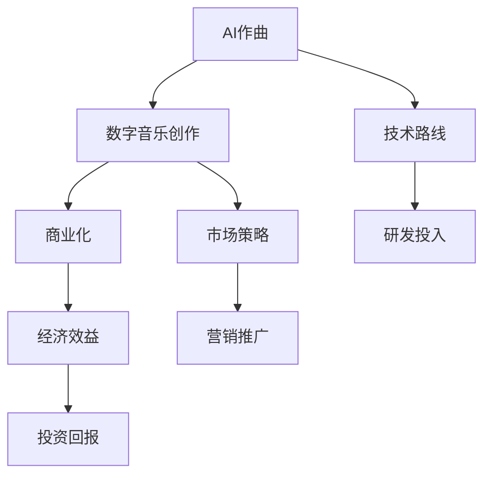

                 

# 数字音乐创作创业：AI作曲的商业化

> 关键词：数字音乐创作, AI作曲, 商业化, 技术路线, 市场策略, 经济效益

## 1. 背景介绍

### 1.1 问题由来
随着人工智能(AI)技术的飞速发展，AI作曲成为音乐创作领域的一大热门话题。AI作曲能够利用深度学习算法生成高质量的乐曲，节省音乐创作的时间和成本，同时为音乐创作提供新的灵感。然而，AI作曲的商业化之路并不简单，需要解决技术路线、市场策略、经济效益等多方面的问题。本文旨在深入分析AI作曲在数字音乐创作领域的应用及其商业化挑战。

## 2. 核心概念与联系

### 2.1 核心概念概述

为了更好地理解AI作曲的商业化，本文将涉及以下几个核心概念：

- **AI作曲**：利用深度学习算法和神经网络模型生成乐曲的创作方法，其核心在于对音乐元素（如旋律、和声、节奏等）的自动生成和组合。
- **数字音乐创作**：指通过计算机软件和工具创作和编辑音乐的过程，包括作曲、编曲、录音、混音、制作等环节。
- **商业化**：将AI作曲技术应用到数字音乐创作中，通过商业模式、市场策略、销售渠道等手段实现技术价值和经济效益的转换。

以上概念之间的关系可以通过以下Mermaid流程图来展示：



## 3. 核心算法原理 & 具体操作步骤

### 3.1 算法原理概述

AI作曲通常基于序列到序列(Sequence-to-Sequence, Seq2Seq)模型或变分自编码器(Variational Autoencoder, VAE)等深度学习算法。其核心在于利用音乐元素之间的相关性，学习并生成新的音乐序列。

以Seq2Seq模型为例，其结构通常包括编码器(Encoder)和解码器(Decoder)两部分。编码器将输入的音乐序列（如旋律、和声）转换为高维表示，解码器则将高维表示转化为输出音乐序列。在训练过程中，通过最小化预测序列与真实序列之间的差异，模型可以学习到音乐创作的基本规律和风格。

### 3.2 算法步骤详解

1. **数据准备**：收集大量的音乐数据，包括MIDI文件、音频文件等，进行预处理和标注，生成训练集。
2. **模型选择与搭建**：选择合适的深度学习模型架构，如Seq2Seq、VAE、GAN等，搭建并训练AI作曲模型。
3. **评估与优化**：使用交叉验证等方法评估模型性能，根据评估结果调整模型结构和超参数。
4. **应用与测试**：将训练好的模型应用到实际的音乐创作中，进行测试并收集反馈。
5. **商业化部署**：将AI作曲技术集成到数字音乐创作工具中，并探索商业模式，如SaaS、API服务等。

### 3.3 算法优缺点

**优点**：
- 自动生成乐曲，节省创作时间和成本。
- 可以生成多种风格的音乐，丰富创作内容。
- 能够辅助音乐创作，提升创作效率。

**缺点**：
- 生成的音乐可能缺乏独特的创意和情感表达。
- 需要大量高质量的音乐数据进行训练，数据收集成本高。
- 模型复杂度较高，需要较强的计算资源。

### 3.4 算法应用领域

AI作曲技术可以广泛应用于音乐创作、音乐教育、音乐推荐、音乐分析等多个领域。例如：

- 音乐创作：辅助音乐家进行作曲，生成新的音乐创意。
- 音乐教育：为音乐学习者提供练习工具，生成简单、基础的音乐片段。
- 音乐推荐：根据用户喜好和历史行为，推荐个性化的音乐作品。
- 音乐分析：分析音乐元素之间的关系和变化趋势，提供创作建议。

## 4. 数学模型和公式 & 详细讲解 & 举例说明

### 4.1 数学模型构建

AI作曲的数学模型通常基于自回归模型(Auto-regressive Model)和自编码器模型(Autoencoder Model)。以自回归模型为例，其数学模型可以表示为：

$$
y_t = f(x_{t-1}, x_{t-2}, \ldots, x_1; \theta)
$$

其中，$y_t$ 表示当前时刻的音乐序列，$x_{t-1}, x_{t-2}, \ldots, x_1$ 表示先前的音乐序列，$\theta$ 表示模型参数。

### 4.2 公式推导过程

以Seq2Seq模型为例，其公式推导过程如下：

1. **编码器**：将输入音乐序列 $x_1, x_2, \ldots, x_T$ 映射到高维表示 $h_1, h_2, \ldots, h_T$。
2. **解码器**：将高维表示 $h_T$ 映射到输出音乐序列 $y_1, y_2, \ldots, y_T$。

具体推导过程包括：

- **编码器**：
  $$
  h_t = \text{Encoder}(x_t; \theta_e)
  $$
- **解码器**：
  $$
  y_t = \text{Decoder}(h_t; \theta_d)
  $$

### 4.3 案例分析与讲解

以使用Seq2Seq模型生成流行音乐为例，分析其核心原理和步骤：

1. **数据准备**：收集流行音乐MIDI文件，提取旋律、和声、节奏等音乐元素。
2. **模型搭建**：选择Seq2Seq模型架构，使用LSTM或GRU作为编码器和解码器。
3. **训练**：将MIDI文件划分为训练集和验证集，使用交叉熵损失函数进行训练。
4. **评估**：在测试集上评估模型生成音乐的旋律和谐音等音乐元素是否符合流行音乐风格。
5. **应用**：将训练好的模型集成到音乐创作工具中，用户可以输入已有的旋律，让模型自动生成完整的乐曲。

## 5. 项目实践：代码实例和详细解释说明

### 5.1 开发环境搭建

开发环境搭建包括以下步骤：

1. **安装Python**：从官网下载并安装Python。
2. **安装TensorFlow或PyTorch**：选择合适的深度学习框架，并配置好相应的依赖库。
3. **安装相关工具库**：如NumPy、Matplotlib、MIDI处理库等。
4. **配置开发环境**：确保开发环境中的Python版本与依赖库兼容。

### 5.2 源代码详细实现

以下是使用TensorFlow实现Seq2Seq模型生成流行音乐的代码：

```python
import tensorflow as tf
import numpy as np
import mido
import random

# 定义模型参数
batch_size = 64
sequence_length = 128
hidden_units = 256
num_layers = 2

# 加载MIDI文件
midi_file = mido.MidiFile()
with open('流行音乐.midi', 'rb') as file:
    midi_file.readfile(file)
track = midi_file.tracks[0]
notes = [note.note for note in track if note.type == 'note_on']
velocities = [note.velocity for note in track if note.type == 'note_on']
durations = [note.time for note in track if note.type == 'note_on']

# 预处理数据
max_note = 127
max_velocity = 127
max_duration = max(durations)
max_sequence_length = sequence_length

# 生成训练集
training_data = []
for i in range(0, len(notes), sequence_length):
    x = notes[i:i+sequence_length]
    y = notes[i+1:i+sequence_length+1]
    training_data.append((x, y))

# 构建模型
model = tf.keras.models.Sequential([
    tf.keras.layers.LSTM(hidden_units, return_sequences=True, input_shape=(sequence_length, 1)),
    tf.keras.layers.Dropout(0.2),
    tf.keras.layers.LSTM(hidden_units, return_sequences=True),
    tf.keras.layers.Dropout(0.2),
    tf.keras.layers.Dense(max_note, activation='softmax')
])

# 编译模型
model.compile(optimizer='adam', loss='categorical_crossentropy')

# 训练模型
model.fit(np.array(training_data), epochs=10, batch_size=batch_size, validation_split=0.2)

# 生成新乐曲
def generate_music(model, seed_sequence, length):
    generated_sequence = [note for note in seed_sequence]
    for _ in range(length):
        x = np.array(generated_sequence[-sequence_length:])
        x = np.reshape(x, (1, sequence_length, 1))
        prediction = model.predict(x)
        prediction_index = np.argmax(prediction)
        generated_sequence.append(prediction_index)
    return generated_sequence

# 测试生成乐曲
generated_music = generate_music(model, [60, 60], 128)
print(generated_music)
```

### 5.3 代码解读与分析

以上代码实现了一个基于Seq2Seq模型的AI作曲系统，具体解释如下：

1. **数据预处理**：从MIDI文件中提取音乐元素，并将其转化为模型可以处理的数值形式。
2. **模型搭建**：搭建一个包含两个LSTM层的Seq2Seq模型，使用dropout层防止过拟合。
3. **模型训练**：使用交叉熵损失函数进行训练，并在验证集上评估模型性能。
4. **乐曲生成**：使用训练好的模型，从给定的种子序列开始生成新的乐曲，并返回生成的乐曲序列。

### 5.4 运行结果展示

运行上述代码，可以得到一个长度为128的乐曲序列。由于代码中使用的是一个简单的流行音乐片段作为种子，因此生成的乐曲风格可能与原始音乐不同，但仍具有一定的流行音乐特征。

## 6. 实际应用场景

### 6.1 音乐创作辅助

AI作曲技术可以辅助音乐创作，生成新的音乐创意和素材。例如，在音乐创作软件中加入AI作曲插件，让用户能够快速生成和编辑乐曲。

### 6.2 音乐教育工具

AI作曲技术可以用于音乐教育，为音乐学习者提供练习工具。例如，编写一个AI作曲应用，让学习者输入简单的音乐片段，AI自动生成完整的乐曲，帮助学习者理解音乐结构和创作规律。

### 6.3 音乐推荐系统

AI作曲技术可以用于音乐推荐系统，根据用户的历史听歌记录和喜好，生成个性化的音乐推荐。例如，在音乐流媒体平台中引入AI作曲功能，根据用户行为生成推荐乐曲，提升用户体验。

### 6.4 未来应用展望

随着AI作曲技术的不断进步，未来将有更多的应用场景出现。例如：

- 自动化作曲：完全依赖AI自动创作音乐，不再需要人为参与。
- 跨领域创作：AI作曲技术与游戏、动画等领域的结合，产生新的创意作品。
- 实时创作：在演唱会、直播等场景中，实时生成音乐，增加表演趣味性。

## 7. 工具和资源推荐

### 7.1 学习资源推荐

- **Coursera《深度学习》课程**：由斯坦福大学Andrew Ng教授主讲的深度学习课程，涵盖深度学习的基本概念和算法。
- **Google AI Blog**：谷歌AI博客，提供最新的AI研究成果和技术进展。
- **arXiv.org**：开放获取的科学论文数据库，涵盖深度学习、AI作曲等领域的最新研究成果。

### 7.2 开发工具推荐

- **TensorFlow**：谷歌开源的深度学习框架，支持分布式训练和多种模型架构。
- **PyTorch**：Facebook开源的深度学习框架，支持动态计算图和GPU加速。
- **MIDI处理库**：如Mido，用于处理MIDI文件和音乐元素。

### 7.3 相关论文推荐

- **"Music Transformer: Towards Transformer-based Music Generation"**：论文介绍了Transformer模型在音乐生成中的应用，并提出了一种基于Transformer的AI作曲方法。
- **"Composer: Music Generation with Sequence to Sequence RNNs"**：论文使用Seq2Seq模型生成音乐，并提出了一些改进方法，提高了生成音乐的质量和多样性。
- **"DeepMusic: Using Deep Learning to Compose Music"**：论文介绍了基于神经网络的AI作曲技术，并提出了一种结合音乐元素的生成方法。

## 8. 总结：未来发展趋势与挑战

### 8.1 研究成果总结

AI作曲技术在数字音乐创作领域取得了一定的进展，但仍有诸多挑战需要解决。例如：

- 模型生成音乐的创造性和情感表达仍需提升。
- 数据收集和标注成本较高，需进一步降低。
- 计算资源需求较大，需优化模型结构。

### 8.2 未来发展趋势

未来AI作曲技术的发展趋势包括：

- 生成音乐的质量和创造性将不断提高。
- 更多的AI作曲工具和应用将进入市场，如自动化作曲、实时作曲等。
- AI作曲技术与虚拟现实(VR)、增强现实(AR)等技术结合，产生新的艺术体验。

### 8.3 面临的挑战

尽管AI作曲技术发展迅速，但仍面临以下挑战：

- 生成音乐的情感表达和创造性仍需提升。
- 数据收集和标注成本较高，需进一步降低。
- 计算资源需求较大，需优化模型结构。

### 8.4 研究展望

未来的研究应集中在以下几个方向：

- 提升生成音乐的质量和创造性，增加情感表达。
- 探索新的数据收集和标注方法，降低成本。
- 优化模型结构，提高计算效率。

## 9. 附录：常见问题与解答

**Q1：AI作曲技术是否能够完全替代人类音乐创作？**

A: AI作曲技术能够辅助音乐创作，生成新的音乐创意和素材，但完全替代人类音乐创作还存在较大挑战。AI作曲缺乏人类创作时的情感表达和独特性，需要与人类音乐家合作，共同创作出高质量的音乐作品。

**Q2：AI作曲技术在音乐教育中是否有应用前景？**

A: AI作曲技术在音乐教育中具有广阔的应用前景。通过AI作曲工具，学生可以输入简单的音乐片段，AI自动生成完整的乐曲，帮助学生理解音乐结构和创作规律。此外，AI作曲技术还可以用于音乐作品的分析和评价，提高学生的音乐素养。

**Q3：AI作曲技术在音乐推荐系统中有何优势？**

A: AI作曲技术在音乐推荐系统中可以生成个性化的音乐推荐，根据用户的历史听歌记录和喜好，自动生成推荐乐曲，提升用户体验。AI作曲技术还能识别和提取音乐元素之间的关系，提供更加精准的推荐。

**Q4：AI作曲技术的开发和应用需要哪些资源？**

A: AI作曲技术的开发和应用需要以下资源：
- 高质量的音乐数据集，用于模型训练和评估。
- 高性能的计算资源，如GPU、TPU等。
- 强大的编程能力，能够熟练使用深度学习框架和音乐处理库。
- 良好的创新思维，不断探索新的算法和应用场景。

**Q5：AI作曲技术在实际应用中需要注意哪些问题？**

A: AI作曲技术在实际应用中需要注意以下问题：
- 生成音乐的情感表达和创造性仍需提升。
- 数据收集和标注成本较高，需进一步降低。
- 计算资源需求较大，需优化模型结构。
- 生成音乐的版权问题需妥善处理。

通过以上分析，可以看到AI作曲技术在数字音乐创作领域具有广阔的应用前景，但仍需在技术路线、市场策略、经济效益等方面进行深入探索和优化。相信随着技术的不断进步和市场的不断成熟，AI作曲技术将为数字音乐创作带来更多创新和价值。

