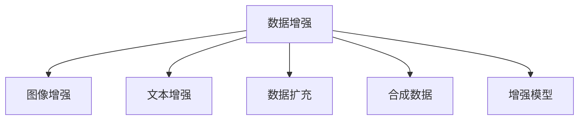

                 

# 数据增强技术：图像和文本

> 关键词：数据增强,图像增强,文本增强,数据扩充,图像处理,自然语言处理,合成数据

## 1. 背景介绍

在现代深度学习中，数据是模型训练的基础，数据的质量和数量直接决定了模型性能的上限。然而，在实际应用中，尤其是图像和文本等复杂数据类型，获取高质量的标注数据往往非常困难且昂贵。数据增强技术由此应运而生，它通过创造性地生成合成数据，扩充训练集的规模，显著提升模型的泛化能力和鲁棒性。

### 1.1 问题由来
图像和文本领域的预训练模型，如卷积神经网络(CNN)和Transformer等，依赖于大量数据进行训练，以学习数据的复杂特征和内在规律。然而，对于某些特定领域或场景，例如医学影像、法律文本等，可获取的标注数据往往稀缺。同时，大量数据收集和标注的成本极高，且可能存在数据偏差和不平衡。

数据增强技术的出现，提供了一种有效缓解数据稀缺问题的方法。通过合成数据增强，模型可以在更广泛的领域和场景中学习，增强其泛化能力。

### 1.2 问题核心关键点
数据增强技术通过生成新的、具有一定代表性的数据样本来扩充训练集。它不依赖于标注数据，因此可以在数据稀缺或标注困难的情况下进行模型训练。

数据增强的核心在于如何生成高质量、具有代表性的合成数据，以保持与真实数据相似性。常用的增强技术包括图像旋转、平移、缩放、裁剪、噪声添加等，文本增强包括同义词替换、随机插入、打乱顺序等。

数据增强效果的好坏，很大程度上取决于增强策略的选择和参数的设定。在实践中，通常需要综合考虑数据多样性、模型适应性和计算效率，进行多轮试验和评估。

### 1.3 问题研究意义
数据增强技术对于提升深度学习模型在实际应用中的性能具有重要意义：

1. **提高数据量**：增强技术可以大幅度扩充训练数据集，降低过拟合风险。
2. **增强泛化能力**：通过多样化的数据输入，模型能够学习到更全面的特征表示，提升泛化能力。
3. **提升鲁棒性**：增强后的数据包含更多的变化模式和干扰因素，可以增强模型的鲁棒性。
4. **降低成本**：增强技术可以减少对标注数据的依赖，降低数据收集和标注的成本。
5. **适应性广**：增强后的数据可以适用于多种应用场景，提升模型的应用范围和灵活性。

## 2. 核心概念与联系

### 2.1 核心概念概述

本节将介绍数据增强技术的核心概念及其相互联系。

- **数据增强(Data Augmentation)**：通过生成合成数据扩充训练集的技术。
- **图像增强(Computer Vision Data Augmentation)**：针对图像数据，通过变换、变形、遮挡等方式生成合成图像。
- **文本增强(Natural Language Processing Data Augmentation)**：针对文本数据，通过同义词替换、插入、打乱等方式生成合成文本。
- **数据扩充(Training Data Expansion)**：通过生成新的数据样本来增加训练集大小。
- **合成数据(Synthetic Data)**：利用算法生成，以模拟真实数据分布的伪造数据。
- **增强模型(Augmented Model)**：使用增强数据进行训练，提升模型泛化能力和鲁棒性的模型。

这些概念之间的逻辑关系可以通过以下Mermaid流程图来展示：



这个流程图展示了大数据增强技术的核心概念及其相互关系：

1. 数据增强是大数据增强技术的基础。
2. 图像增强和文本增强分别针对视觉和文本数据进行变换和生成。
3. 数据扩充是数据增强的一种实现方式。
4. 合成数据是大数据增强技术中的一种关键手段。
5. 增强模型是应用数据增强技术后获得性能提升的模型。

## 3. 核心算法原理 & 具体操作步骤
### 3.1 算法原理概述

数据增强技术的核心思想是通过变换、变形、遮挡等方式，生成与原始数据相似的合成数据，以扩充训练集。其核心在于如何设计生成算法，使其生成的数据尽可能地与真实数据相似，同时具备一定的多样性。

### 3.2 算法步骤详解

#### 3.2.1 图像增强步骤

1. **随机裁剪(Random Crop)**：随机从原始图像中裁剪出指定大小的一个区域作为合成图像。例如，将一张640x480的图片随机裁剪为256x256大小。

2. **随机平移(Random Shift)**：将原始图像在水平或垂直方向随机平移一定距离。例如，将一张图片随机平移1到10个像素。

3. **随机旋转(Random Rotation)**：随机旋转原始图像一定角度。例如，将一张图片随机旋转0到180度。

4. **随机翻转(Random Flip)**：随机水平或垂直翻转原始图像。例如，将一张图片随机翻转90度。

5. **随机缩放(Random Scale)**：随机调整原始图像的大小。例如，将一张图片随机缩放50%到200%。

6. **随机噪声(Random Noise)**：在原始图像上随机添加噪声。例如，在图片中随机添加高斯噪声或椒盐噪声。

7. **颜色变换(Color Augmentation)**：随机调整图像的亮度、对比度、饱和度等。例如，将图片随机降低20%亮度，增加10%对比度。

8. **遮挡遮挡(Masking)**：在原始图像上随机生成遮挡区域。例如，将一部分图片随机遮挡住，减少可视化信息。

这些步骤可以组合使用，生成多样化的合成图像。例如，先随机旋转、平移、裁剪，再添加噪声、颜色变换和遮挡，可以生成多种形式的合成图像。

#### 3.2.2 文本增强步骤

1. **同义词替换(Synonym Replacement)**：随机替换文本中的单词为同义词。例如，将"apple"替换为"banana"。

2. **随机插入(Random Insertion)**：随机在文本中插入一个单词或短语。例如，在句子中随机插入一个形容词。

3. **随机删除(Random Deletion)**：随机删除文本中的单词或短语。例如，删除句子中的一个单词。

4. **随机交换(Random Swap)**：随机交换文本中的单词顺序。例如，将"hello world"随机交换为"world hello"。

5. **随机乱序(Random Shuffle)**：随机打乱文本中单词的顺序。例如，将"hello world"随机打乱为"wold hll"。

6. **随机插入空格(Random Space Insertion)**：随机在文本中插入空格。例如，在单词之间随机插入空格。

7. **随机删除空格(Random Space Deletion)**：随机删除文本中的空格。例如，删除单词之间的空格。

这些步骤可以组合使用，生成多样化的合成文本。例如，先进行同义词替换、插入，再删除、交换和乱序，可以生成多种形式的合成文本。

### 3.3 算法优缺点

#### 3.3.1 图像增强优点

1. **数据量增加**：图像增强技术可以生成大量合成图像，极大地扩充了训练集的规模。
2. **泛化能力增强**：通过多样化的图像变换，模型可以学习到更多的特征表示，提升泛化能力。
3. **鲁棒性提高**：增强后的图像包含更多的变化模式和干扰因素，可以增强模型的鲁棒性。
4. **适应性广**：增强后的图像可以适用于多种应用场景，提升模型的应用范围和灵活性。

#### 3.3.2 图像增强缺点

1. **计算成本高**：图像增强计算复杂度高，特别是在大规模数据集上进行增强时，需要消耗大量的计算资源。
2. **可能引入噪声**：如果增强策略不当，可能引入噪声或伪造数据，影响模型的性能。
3. **生成样本多样性不足**：生成的样本可能存在多样性不足的问题，不能全面覆盖数据分布。
4. **数据分布变化**：增强后的数据可能与真实数据存在一定的差异，需要重新进行分布调整。

#### 3.3.3 文本增强优点

1. **数据量增加**：文本增强技术可以生成大量合成文本，极大地扩充了训练集的规模。
2. **泛化能力增强**：通过多样化的文本变换，模型可以学习到更多的语言特征，提升泛化能力。
3. **鲁棒性提高**：增强后的文本包含更多的语言变化模式，可以增强模型的鲁棒性。
4. **适应性广**：增强后的文本可以适用于多种应用场景，提升模型的应用范围和灵活性。

#### 3.3.4 文本增强缺点

1. **计算成本高**：文本增强计算复杂度较高，特别是在大规模数据集上进行增强时，需要消耗大量的计算资源。
2. **可能引入噪声**：如果增强策略不当，可能引入噪声或伪造数据，影响模型的性能。
3. **生成样本多样性不足**：生成的样本可能存在多样性不足的问题，不能全面覆盖数据分布。
4. **数据分布变化**：增强后的数据可能与真实数据存在一定的差异，需要重新进行分布调整。

### 3.4 算法应用领域

数据增强技术在图像和文本领域有广泛的应用：

- **医学影像**：图像增强技术可以用于扩充医学影像数据集，提升诊断模型的性能。
- **法律文本**：文本增强技术可以用于扩充法律文本数据集，提升自然语言处理模型的准确性。
- **金融风控**：图像增强技术可以用于扩充金融诈骗图像数据集，提升异常检测模型的鲁棒性。
- **自然灾害预测**：图像增强技术可以用于扩充自然灾害图像数据集，提升预测模型的泛化能力。
- **环境监测**：图像增强技术可以用于扩充环境监测图像数据集，提升污染物检测模型的准确性。
- **安全监控**：图像增强技术可以用于扩充安全监控图像数据集，提升异常行为检测模型的鲁棒性。
- **社交媒体分析**：文本增强技术可以用于扩充社交媒体文本数据集，提升情感分析模型的准确性。
- **在线客服**：文本增强技术可以用于扩充在线客服文本数据集，提升问答系统的泛化能力。

## 4. 数学模型和公式 & 详细讲解  
### 4.1 数学模型构建

本节将使用数学语言对数据增强技术的核心模型进行严格的刻画。

记原始图像数据为 $x$，增强后的图像数据为 $x'$。假设增强过程为 $f(x)$，则增强模型可以表示为：

$$
x' = f(x)
$$

其中 $f(x)$ 为增强函数，可以表示为一系列变换操作的组合。例如，随机旋转可以表示为：

$$
f_{\theta}(x) = \left\{
  \begin{array}{ll}
    R_{\theta}(x) & \text{with probability } p \\
    x & \text{with probability } 1-p
  \end{array}
\right.
$$

其中 $R_{\theta}(x)$ 表示旋转 $\theta$ 角度，$p$ 为旋转概率。

对于文本增强，假设原始文本为 $t$，增强后的文本为 $t'$。增强过程同样为 $f(t)$，可以表示为一系列变换操作的组合。例如，随机替换可以表示为：

$$
f_{\theta}(t) = \left\{
  \begin{array}{ll}
    \text{Replace } t_i \text{ with } t'_i & \text{with probability } p \\
    t & \text{with probability } 1-p
  \end{array}
\right.
$$

其中 $t_i$ 表示文本中的第 $i$ 个单词，$t'_i$ 表示其同义词。

### 4.2 公式推导过程

#### 4.2.1 图像增强

以随机旋转为例，假设原始图像为 $x$，旋转角度为 $\theta$，生成增强后的图像 $x'$。图像增强的数学模型为：

$$
x' = R_{\theta}(x)
$$

其中 $R_{\theta}(\cdot)$ 表示旋转变换操作，可以表示为：

$$
R_{\theta}(x) = x \odot \begin{bmatrix} \cos(\theta) & -\sin(\theta) \\ \sin(\theta) & \cos(\theta) \end{bmatrix}
$$

其中 $\odot$ 表示矩阵乘法，$\theta$ 为旋转角度。

以随机平移为例，假设原始图像为 $x$，平移距离为 $(t_x, t_y)$，生成增强后的图像 $x'$。图像增强的数学模型为：

$$
x' = T_{\mathbf{t}}(x)
$$

其中 $T_{\mathbf{t}}(\cdot)$ 表示平移变换操作，可以表示为：

$$
T_{\mathbf{t}}(x) = x + \mathbf{t}
$$

其中 $\mathbf{t} = [t_x, t_y]^T$ 表示平移向量。

#### 4.2.2 文本增强

以随机替换为例，假设原始文本为 $t$，替换概率为 $p$，生成增强后的文本 $t'$。文本增强的数学模型为：

$$
t' = R_{p}(t)
$$

其中 $R_{p}(\cdot)$ 表示替换变换操作，可以表示为：

$$
R_{p}(t) = \left\{
  \begin{array}{ll}
    t' & \text{with probability } p \\
    t & \text{with probability } 1-p
  \end{array}
\right.
$$

其中 $t'$ 表示替换后的文本。

以随机插入为例，假设原始文本为 $t$，插入概率为 $p$，生成增强后的文本 $t'$。文本增强的数学模型为：

$$
t' = I_{p}(t)
$$

其中 $I_{p}(\cdot)$ 表示插入变换操作，可以表示为：

$$
I_{p}(t) = \left\{
  \begin{array}{ll}
    t + w & \text{with probability } p \\
    t & \text{with probability } 1-p
  \end{array}
\right.
$$

其中 $w$ 表示插入的单词。

### 4.3 案例分析与讲解

#### 4.3.1 图像增强案例

假设有一张尺寸为 $640 \times 480$ 的医学影像图像 $x$，我们需要对其进行增强处理，生成一张尺寸为 $256 \times 256$ 的增强图像 $x'$。

1. **随机裁剪**：从原始图像 $x$ 中随机裁剪出 $256 \times 256$ 的区域作为增强图像 $x'$。

2. **随机旋转**：将原始图像 $x$ 随机旋转 $30\degree$ 到 $60\degree$，生成增强图像 $x'$。

3. **随机平移**：将原始图像 $x$ 在水平和垂直方向随机平移 $1$ 到 $10$ 个像素，生成增强图像 $x'$。

4. **随机缩放**：将原始图像 $x$ 随机缩放 $50\%$ 到 $200\%$，生成增强图像 $x'$。

5. **随机噪声**：在增强图像 $x'$ 上随机添加高斯噪声或椒盐噪声，生成增强图像 $x'$。

6. **颜色变换**：将增强图像 $x'$ 的亮度降低 $20\%$，对比度增加 $10\%$，生成增强图像 $x'$。

通过这些步骤，可以生成多种形式的增强图像 $x'$。例如，可以将 $x$ 随机裁剪为 $256 \times 256$，旋转 $45\degree$，平移 $5$ 个像素，缩放 $150\%$，添加高斯噪声，调整亮度和对比度后生成增强图像 $x'$。

#### 4.3.2 文本增强案例

假设有一段文本 $t$："The cat sat on the mat."，我们需要对其进行增强处理，生成另一段文本 $t'$。

1. **同义词替换**：将文本 $t$ 中的 "cat" 替换为 "dog"，生成增强文本 $t'$。

2. **随机插入**：在文本 $t$ 中随机插入一个单词，例如 "happy"，生成增强文本 $t'$。

3. **随机删除**：从文本 $t$ 中随机删除一个单词，例如 "mat"，生成增强文本 $t'$。

4. **随机交换**：将文本 $t$ 中的 "sat" 和 "on" 交换位置，生成增强文本 $t'$。

5. **随机乱序**：将文本 $t$ 中的单词随机打乱顺序，例如 "the cat on sat mat."，生成增强文本 $t'$。

6. **随机插入空格**：在文本 $t$ 中随机插入空格，例如 "The cat sat on the mat."，生成增强文本 $t'$。

通过这些步骤，可以生成多种形式的增强文本 $t'$。例如，可以将 "cat" 替换为 "dog"，再插入 "happy"，删除 "mat"，交换 "sat" 和 "on"，乱序 "the cat on sat mat." 后生成增强文本 $t'$。

## 5. 项目实践：代码实例和详细解释说明
### 5.1 开发环境搭建

在进行数据增强实践前，我们需要准备好开发环境。以下是使用Python进行PyTorch开发的环境配置流程：

1. 安装Anaconda：从官网下载并安装Anaconda，用于创建独立的Python环境。

2. 创建并激活虚拟环境：
```bash
conda create -n pytorch-env python=3.8 
conda activate pytorch-env
```

3. 安装PyTorch：根据CUDA版本，从官网获取对应的安装命令。例如：
```bash
conda install pytorch torchvision torchaudio cudatoolkit=11.1 -c pytorch -c conda-forge
```

4. 安装Transformers库：
```bash
pip install transformers
```

5. 安装各类工具包：
```bash
pip install numpy pandas scikit-learn matplotlib tqdm jupyter notebook ipython
```

完成上述步骤后，即可在`pytorch-env`环境中开始数据增强实践。

### 5.2 源代码详细实现

下面我们以图像增强为例，给出使用PyTorch实现随机旋转、平移和缩放的代码实现。

首先，定义图像增强类：

```python
import torch
import torchvision.transforms as transforms
from PIL import Image

class ImageAugmentation:
    def __init__(self, transform):
        self.transform = transform
    
    def __call__(self, x):
        return self.transform(x)
```

然后，定义随机旋转、平移和缩放的具体实现：

```python
def random_rotation(x, degrees):
    """Randomly rotate the image."""
    rotate_angle = degrees
    rotate_matrix = transforms.Affine(
        angle=rotate_angle,
        center=(0.5, 0.5),
        scale=1.0,
        shear=0,
        translate=(0, 0)
    )
    transform = transforms.Affine(rotate_matrix)
    return transform(x)

def random_shift(x, degrees):
    """Randomly shift the image."""
    shift_x = int(degrees * torch.randn(1)[0])
    shift_y = int(degrees * torch.randn(1)[0])
    transform = transforms.functional.affine(
        x, 
        angle=0,
        translate=(shift_x, shift_y),
        scale=1.0,
        center=(0.5, 0.5)
    )
    return transform(x)

def random_scale(x, scale):
    """Randomly scale the image."""
    scale_factor = scale
    transform = transforms.Affine(
        angle=0,
        center=(0.5, 0.5),
        scale=scale_factor,
        shear=0,
        translate=(0, 0)
    )
    return transform(x)
```

接着，定义增强函数：

```python
def augment_image(x, degrees=45, scale=0.5):
    """Augment the image with random rotation, shift and scale."""
    transform = transforms.Compose([
        random_rotation(x, degrees),
        random_shift(x, degrees),
        random_scale(x, scale)
    ])
    return transform(x)
```

最后，使用上述代码实现数据增强：

```python
from PIL import Image
from torchvision.transforms import ToTensor

# Load image
image = Image.open('image.jpg')
image_tensor = ToTensor()(image)

# Define transform
transform = transforms.Compose([
    transforms.Resize(256),
    transforms.ToTensor(),
    transforms.Normalize(mean=[0.5, 0.5, 0.5], std=[0.5, 0.5, 0.5])
])

# Define augmenter
augmenter = ImageAugmentation(transform)

# Apply augmentation
augmented_image = augmenter(image_tensor)
augmented_image = torch.clamp(augmented_image, 0, 1)
```

以上就是使用PyTorch对图像进行随机旋转、平移和缩放的数据增强代码实现。可以看到，通过组合使用各种增强策略，可以生成多种形式的增强图像，有效扩充训练集。

### 5.3 代码解读与分析

让我们再详细解读一下关键代码的实现细节：

**ImageAugmentation类**：
- `__init__`方法：初始化增强函数。
- `__call__`方法：定义增强函数的调用方式。

**random_rotation函数**：
- 随机生成旋转角度 $\theta$。
- 构造旋转矩阵 $R_{\theta}$。
- 使用旋转矩阵生成增强图像 $x'$。

**random_shift函数**：
- 随机生成平移距离 $(t_x, t_y)$。
- 构造平移矩阵 $T_{\mathbf{t}}$。
- 使用平移矩阵生成增强图像 $x'$。

**random_scale函数**：
- 随机生成缩放因子 $\mathbf{s}$。
- 构造缩放矩阵 $S_{\mathbf{s}}$。
- 使用缩放矩阵生成增强图像 $x'$。

**augment_image函数**：
- 定义增强函数 $f(x)$，包括随机旋转、平移和缩放。
- 使用 `transforms.Compose` 组合多个增强操作。
- 在训练集上应用增强函数 $f(x)$。

**ToTensor函数**：
- 将图像转换为张量形式，方便在PyTorch中使用。

**Normalize函数**：
- 对图像进行归一化处理，使像素值在 $[0, 1]$ 范围内。

在实践中，还可以通过组合使用更多的增强策略，生成更丰富的增强图像。例如，可以添加噪声、颜色变换、遮挡等，使增强图像更加多样化和真实。

## 6. 实际应用场景
### 6.1 智能医疗影像分析

在智能医疗影像分析中，数据增强技术可以显著提升模型对病变检测和分类的能力。例如，通过随机旋转、平移和缩放，生成多种形式的医学影像图像，增强模型的泛化能力。

在具体实现中，可以从大规模医学影像数据库中随机抽取图片，进行增强处理。增强后的图像可以作为训练集的补充，用于训练医学影像分类器。例如，可以对乳腺癌的X光片进行增强，生成多种形式的图像，提升模型对不同角度、不同大小病变的检测能力。

### 6.2 金融市场预测

在金融市场预测中，数据增强技术可以用于扩充历史交易数据集，提升模型对市场波动的预测能力。例如，通过随机旋转、平移和缩放，生成多种形式的K线图，增强模型的泛化能力。

在具体实现中，可以从历史交易数据中随机抽取K线图，进行增强处理。增强后的K线图可以作为训练集的补充，用于训练市场预测模型。例如，可以对历史股价数据进行增强，生成多种形式的K线图，提升模型对不同时间段、不同规模市场波动的预测能力。

### 6.3 自动驾驶

在自动驾驶中，数据增强技术可以用于扩充驾驶场景数据集，提升模型对复杂驾驶环境的感知能力。例如，通过随机旋转、平移和缩放，生成多种形式的驾驶场景图像，增强模型的泛化能力。

在具体实现中，可以从大规模驾驶场景数据集中随机抽取图像，进行增强处理。增强后的图像可以作为训练集的补充，用于训练自动驾驶模型。例如，可以对驾驶场景图像进行增强，生成多种形式的图像，提升模型对不同天气、不同道路、不同车辆的感知能力。

### 6.4 自然灾害预警

在自然灾害预警中，数据增强技术可以用于扩充灾害图像数据集，提升模型对灾害的预测和预警能力。例如，通过随机旋转、平移和缩放，生成多种形式的灾害图像，增强模型的泛化能力。

在具体实现中，可以从历史灾害图像数据集中随机抽取图像，进行增强处理。增强后的图像可以作为训练集的补充，用于训练灾害预测模型。例如，可以对洪水、地震、火灾等灾害图像进行增强，生成多种形式的图像，提升模型对不同场景、不同规模灾害的预测能力。

### 6.5 社交媒体情感分析

在社交媒体情感分析中，数据增强技术可以用于扩充文本数据集，提升模型对用户情感的识别能力。例如，通过同义词替换、插入、删除等，生成多种形式的文本，增强模型的泛化能力。

在具体实现中，可以从社交媒体文本数据集中随机抽取文本，进行增强处理。增强后的文本可以作为训练集的补充，用于训练情感分析模型。例如，可以对用户评论进行增强，生成多种形式的文本，提升模型对不同情感、不同场景的识别能力。

## 7. 工具和资源推荐
### 7.1 学习资源推荐

为了帮助开发者系统掌握数据增强技术的理论基础和实践技巧，这里推荐一些优质的学习资源：

1. 《深度学习：数据增强》系列博文：由深度学习专家撰写，深入浅出地介绍了数据增强技术的原理、方法与应用。

2. CS231n《卷积神经网络》课程：斯坦福大学开设的深度学习明星课程，有Lecture视频和配套作业，详细讲解了图像增强的原理和实现。

3. 《深度学习基础：数据增强》书籍：系统介绍数据增强技术的理论基础和实践技巧，涵盖图像和文本等多种数据类型。

4. PyTorch官方文档：PyTorch的官方文档，提供了海量数据增强算子和模型，是进行实践的必备资料。

5. TensorFlow官方文档：TensorFlow的官方文档，提供了丰富的人工智能库，包括图像和文本增强技术。

通过对这些资源的学习实践，相信你一定能够快速掌握数据增强技术的精髓，并用于解决实际的NLP问题。

### 7.2 开发工具推荐

高效的开发离不开优秀的工具支持。以下是几款用于数据增强开发的常用工具：

1. PyTorch：基于Python的开源深度学习框架，灵活动态的计算图，适合快速迭代研究。

2. TensorFlow：由Google主导开发的开源深度学习框架，生产部署方便，适合大规模工程应用。

3. TorchVision库：PyTorch的计算机视觉库，集成了大量图像增强算子和模型。

4. Keras：基于TensorFlow和Theano的高级神经网络API，支持多种数据增强方法。

5. Data Augment：Keras插件，用于数据增强的多功能工具，支持多种数据类型和增强策略。

6. ImageNet：大规模图像数据库，包含各种数据增强的示例代码，方便开发者进行学习和实践。

合理利用这些工具，可以显著提升数据增强任务的开发效率，加快创新迭代的步伐。

### 7.3 相关论文推荐

数据增强技术的持续演进得益于学界的持续研究。以下是几篇奠基性的相关论文，推荐阅读：

1. Data Augmentation by Learning Transforms（ICML 2013）：提出基于神经网络的数据增强方法，通过学习变换函数生成合成数据。

2. Beyond Random Image Patching for Data Augmentation（ECCV 2018）：提出基于混合变换的数据增强方法，生成多种形式的合成图像。

3. Mixup: Beyond Empirical Risk Minimization for Learning Deep Neural Networks with Large Data Sets（ICLR 2019）：提出Mixup技术，通过线性插值生成合成样本，提升模型的泛化能力。

4. Augmenting Training Data by Synthesizing Textual Analogies（ACL 2019）：提出基于文本生成器生成合成文本的数据增强方法。

5. U-ResNet: Learning Deeper High-Resolution Representations for Image Segmentation（ICLR 2020）：提出U-ResNet模型，通过递归结构生成高分辨率图像，增强模型的细节感知能力。

这些论文代表了大数据增强技术的发展脉络。通过学习这些前沿成果，可以帮助研究者把握学科前进方向，激发更多的创新灵感。

## 8. 总结：未来发展趋势与挑战

### 8.1 总结

本文对数据增强技术的核心原理和实践方法进行了全面系统的介绍。首先阐述了数据增强技术的基本概念和研究背景，明确了增强技术在提升模型泛化能力和鲁棒性方面的重要价值。其次，从原理到实践，详细讲解了数据增强的数学模型和关键步骤，给出了数据增强任务开发的完整代码实例。同时，本文还广泛探讨了数据增强技术在多个领域的实际应用，展示了其广泛的应用前景。

通过本文的系统梳理，可以看到，数据增强技术在提升深度学习模型性能、降低标注数据依赖、增强泛化能力和鲁棒性等方面具有显著优势。未来，伴随技术的不断演进，数据增强将更加智能化、多样化，进一步提升模型的应用能力和表现。

### 8.2 未来发展趋势

展望未来，数据增强技术将呈现以下几个发展趋势：

1. **自动化增强**：增强策略的自动化设计和优化，可以大幅提升数据增强的效率和效果。未来，结合强化学习和自动调参技术，自动生成最优增强策略，将是大数据增强技术的重要发展方向。

2. **多模态增强**：数据增强不再局限于单一模态，多模态数据的增强将提升模型的跨领域适应性。未来，结合图像、文本、音频等多种模态的增强方法，可以构建更全面、更灵活的数据增强系统。

3. **增强算法融合**：多种增强算法可以组合使用，生成更丰富、更具多样性的合成数据。未来，结合多种增强算法的融合，可以构建更高效、更鲁棒的数据增强系统。

4. **增强与生成结合**：生成对抗网络（GAN）和变分自编码器（VAE）等生成技术，可以用于生成更加真实、更具多样性的合成数据。未来，结合生成技术的数据增强方法，将提升模型的泛化能力和鲁棒性。

5. **自适应增强**：数据增强策略可以根据不同任务和数据分布自适应调整。未来，结合自适应学习策略，可以构建更加智能、更加高效的数据增强系统。

以上趋势凸显了大数据增强技术的广阔前景。这些方向的探索发展，必将进一步提升深度学习模型的性能和应用范围，为人工智能技术带来新的突破。

### 8.3 面临的挑战

尽管数据增强技术已经取得了显著成果，但在迈向更加智能化、普适化应用的过程中，它仍面临着诸多挑战：

1. **增强策略设计复杂**：数据增强策略的设计和优化复杂，需要结合多种增强方法，进行多轮试验和评估。如何在有限的时间内设计出最优的增强策略，将是一大难题。

2. **计算资源消耗大**：数据增强计算复杂度高，特别是在大规模数据集上进行增强时，需要消耗大量的计算资源。如何在保证增强效果的同时，降低计算成本，将是重要的优化方向。

3. **生成数据多样性不足**：生成的数据可能存在多样性不足的问题，不能全面覆盖数据分布。如何提升生成数据的丰富度，增强模型泛化能力，将是重要的研究课题。

4. **数据分布变化**：增强后的数据可能与真实数据存在一定的差异，需要重新进行分布调整。如何在增强过程中保持数据分布的一致性，将是重要的优化方向。

5. **增强数据质量**：生成的数据可能存在噪声或伪造数据，影响模型的性能。如何保证增强数据的真实性、有效性，将是重要的研究课题。

6. **鲁棒性不足**：增强后的数据可能引入鲁棒性不足的问题，导致模型性能下降。如何提升增强数据的鲁棒性，保持模型的稳定性，将是重要的研究课题。

以上挑战凸显了数据增强技术在应用中的局限性。未来，相关研究需要在这些方面寻求新的突破，才能进一步推动大数据增强技术的成熟和应用。

### 8.4 研究展望

面对大数据增强技术所面临的挑战，未来的研究需要在以下几个方面寻求新的突破：

1. **自动化增强算法**：结合强化学习和自动调参技术，自动生成最优增强策略，减少人为干预和设计成本。

2. **多模态增强算法**：结合多种增强算法的融合，构建更全面、更灵活的数据增强系统，提升模型的跨领域适应性。

3. **生成增强算法**：结合生成对抗网络（GAN）和变分自编码器（VAE）等生成技术，提升生成的数据的丰富度和真实性。

4. **自适应增强算法**：结合自适应学习策略，构建更加智能、更加高效的数据增强系统，提升数据增强的实时性和灵活性。

5. **鲁棒性增强算法**：结合鲁棒性学习算法，提升增强数据的鲁棒性，保持模型的稳定性。

6. **数据分布一致性算法**：结合数据分布优化算法，在增强过程中保持数据分布的一致性，提升模型的泛化能力。

这些研究方向将引领大数据增强技术的进一步发展，为深度学习模型的泛化能力和鲁棒性带来新的突破。面向未来，大数据增强技术还需要与其他人工智能技术进行更深入的融合，如知识表示、因果推理、强化学习等，多路径协同发力，共同推动人工智能技术的发展。

## 9. 附录：常见问题与解答

**Q1：数据增强技术是否适用于所有NLP任务？**

A: 数据增强技术在大多数NLP任务上都能取得不错的效果，特别是对于数据量较小的任务。但对于一些特定领域的任务，如医学、法律等，仅仅依靠通用语料预训练的模型可能难以很好地适应。此时需要在特定领域语料上进一步预训练，再进行增强，才能获得理想效果。此外，对于一些需要时效性、个性化很强的任务，如对话、推荐等，增强方法也需要针对性的改进优化。

**Q2：数据增强过程中如何选择增强策略？**

A: 数据增强策略的选择和优化需要考虑多个因素，如任务类型、数据分布、计算资源等。常见的增强策略包括图像旋转、平移、缩放、裁剪、噪声添加等，文本增强包括同义词替换、随机插入、打乱顺序等。在具体选择时，可以参考相关领域的研究成果，并结合实际任务特点进行灵活调整。

**Q3：数据增强是否需要标注数据？**

A: 数据增强技术不需要标注数据，通过变换、变形、遮挡等方式生成合成数据，可以直接扩充训练集的规模。但增强后的数据仍需经过训练过程，才能提升模型的泛化能力和鲁棒性。

**Q4：数据增强是否会引入噪声？**

A: 数据增强可能会引入噪声，特别是在增强策略不当或数据分布不一致的情况下。为保证增强数据的真实性和有效性，可以结合多种增强策略，并进行多轮试验和评估，找到最优增强方案。同时，可以在增强过程中加入正则化技术，如L2正则、Dropout等，减少噪声对模型的影响。

**Q5：数据增强是否会影响计算效率？**

A: 数据增强计算复杂度高，特别是在大规模数据集上进行增强时，需要消耗大量的计算资源。为提高计算效率，可以采用模型并行、混合精度训练、梯度积累等技术，优化数据增强的计算过程。同时，可以结合生成对抗网络（GAN）和变分自编码器（VAE）等生成技术，提升增强数据的生成速度和效率。

通过本文的系统梳理，可以看到，数据增强技术在提升深度学习模型性能、降低标注数据依赖、增强泛化能力和鲁棒性等方面具有显著优势。未来，伴随技术的不断演进，数据增强将更加智能化、多样化，进一步提升模型的应用能力和表现。

---

作者：禅与计算机程序设计艺术 / Zen and the Art of Computer Programming

