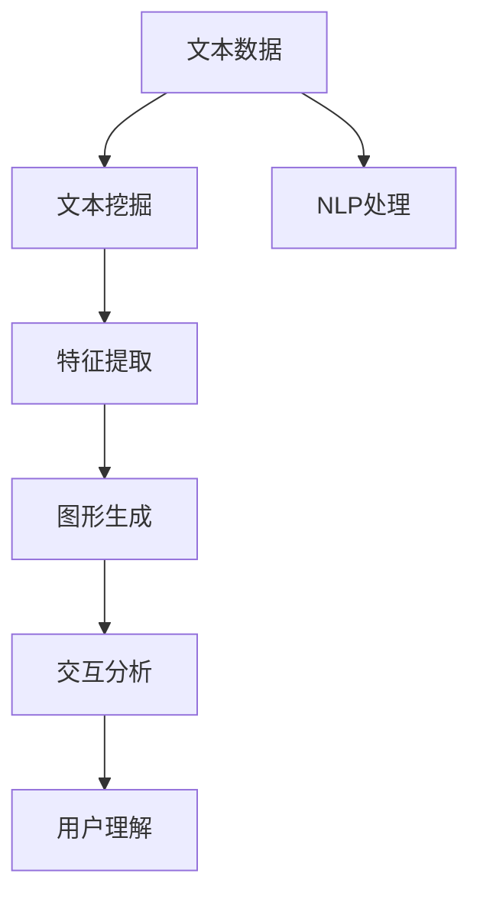

                 

# 文本可视化：大规模文本数据的直观呈现

> 关键词：文本可视化,大规模文本数据,文本挖掘,自然语言处理(NLP),机器学习,数据可视化

## 1. 背景介绍

### 1.1 问题由来

随着信息技术的发展，文本数据的产生和积累已经达到了前所未有的规模。海量的文本数据在为数据分析提供了丰富资源的同时，也带来了数据处理和理解的挑战。传统的统计分析方法在面对大规模文本数据时显得力不从心，而新兴的数据可视化技术则提供了全新的解决思路。

文本可视化作为数据可视化的一个分支，旨在将文本数据转换为直观的视觉图形，帮助用户快速理解文本内容、发现模式和洞见。它在文本挖掘、自然语言处理(NLP)、机器学习等领域有着广泛的应用，是数据分析的重要工具。

### 1.2 问题核心关键点

文本可视化主要解决的是如何有效地将文本数据转换为视觉图形，以帮助用户理解和分析文本。这一过程包括文本数据预处理、文本特征提取、图形生成和交互分析等步骤。成功的文本可视化能够：

- 直观展示文本数据的关键信息。
- 发现文本数据中的模式和趋势。
- 提供对文本数据的快速理解。
- 支持交互式探索和分析。

本文将详细介绍文本可视化的核心概念、算法原理、具体实现和应用场景，以期为大规模文本数据的直观呈现提供系统性的指导。

## 2. 核心概念与联系

### 2.1 核心概念概述

为更好地理解文本可视化技术，本节将介绍几个关键概念及其联系：

- **文本数据**：包含文本的集合，可以是书籍、文章、社交媒体帖子等。
- **文本挖掘**：从文本数据中提取有用信息的过程，包括文本分类、聚类、情感分析等。
- **自然语言处理(NLP)**：使用计算技术处理和理解自然语言的过程，包括文本分类、命名实体识别、机器翻译等。
- **数据可视化**：将数据转换为视觉图形的过程，帮助用户理解数据的内在结构和特征。
- **文本可视化**：将文本数据转换为直观的视觉图形，便于用户理解和分析文本内容。
- **图形生成**：根据文本数据特征自动生成可视化图形。
- **交互分析**：允许用户通过交互操作探索文本数据，获得更深入的理解。

这些概念通过一系列的算法和工具，实现了文本数据的可视化和分析。其中，核心算法包括文本特征提取、图形生成和交互式分析等。

### 2.2 核心概念原理和架构的 Mermaid 流程图



这个流程图展示了文本可视化流程的核心步骤：从原始文本数据出发，经过文本挖掘和NLP处理，提取关键特征，生成可视化图形，最后通过交互分析获得用户理解。

## 3. 核心算法原理 & 具体操作步骤

### 3.1 算法原理概述

文本可视化的核心算法包括文本特征提取、图形生成和交互式分析等。这些算法通过将文本数据转换为向量、矩阵等结构，再将其映射到二维或三维空间，生成图形，最后通过用户交互操作，提供深入的文本分析。

### 3.2 算法步骤详解

#### 3.2.1 文本特征提取

文本特征提取是文本可视化的第一步，旨在从文本数据中提取有意义的特征，用于后续的图形生成。常见的文本特征包括词频、TF-IDF、词嵌入等。

以词频为例，其计算公式为：

$$
TF(w_i) = \frac{\text{在文档中出现词}~w_i~\text{的次数}}{\text{文档总词数}}
$$

$$
IDF(w_i) = \log{\frac{总文档数}{包含词}~w_i~\text{的文档数+1}}
$$

$$
TF-IDF(w_i) = TF(w_i) \times IDF(w_i)
$$

其中，$w_i$ 表示文档中的第 $i$ 个词。

#### 3.2.2 图形生成

图形生成是将文本特征转换为可视化图形的过程。常见的图形包括词云、情感分布图、时间序列图等。这些图形可以帮助用户快速理解文本内容。

以词云为例，其生成步骤包括：

1. 计算每个词的TF-IDF值。
2. 将TF-IDF值映射到图形中的位置和大小。
3. 绘制词云图形。

```python
from wordcloud import WordCloud
import matplotlib.pyplot as plt

# 计算TF-IDF值
tfidf_values = model.transform(corpus)

# 生成词云
wordcloud = WordCloud(width=800, height=500, background_color='white', max_words=200).generate_from_frequencies(dict(tfidf_values.toarray()))

# 绘制词云图形
plt.figure(figsize=(10, 7))
plt.imshow(wordcloud)
plt.axis('off')
plt.show()
```

#### 3.2.3 交互式分析

交互式分析允许用户通过交互操作深入探索文本数据，发现文本中的模式和洞见。常见的交互方式包括拖动、缩放、筛选等。

以拖动为例，其原理是通过用户鼠标操作改变图形的展示范围，从而聚焦于特定的文本内容。

```python
# 实现拖动功能
def on_click(event):
    x, y, _, _ = event.x, event.y, event.inaxes.xaxis.get_majorticklocs()[0], event.inaxes.yaxis.get_majorticklocs()[0]
    plt.xlim(x, x+10)
    plt.ylim(y, y+10)

# 添加拖动事件处理函数
plt.figure(figsize=(10, 7))
plt.imshow(wordcloud)
plt.axis('off')
plt.connect('button_press_event', on_click)
plt.show()
```

### 3.3 算法优缺点

文本可视化算法具有以下优点：

- 直观展示文本数据的关键信息。
- 发现文本数据中的模式和趋势。
- 提供对文本数据的快速理解。
- 支持交互式探索和分析。

但同时也存在一些缺点：

- 对于长文本数据的处理可能存在计算复杂度较高的问题。
- 对文本特征的提取需要一定的领域知识，可能存在一定的偏差。
- 交互式分析可能对用户的操作熟练度有要求，存在一定的学习成本。

### 3.4 算法应用领域

文本可视化技术在多个领域有着广泛的应用，包括但不限于：

- **文本挖掘**：帮助用户发现文本数据中的模式和洞见，支持文本分类、聚类、情感分析等任务。
- **自然语言处理(NLP)**：支持文本分类、命名实体识别、机器翻译等任务，提升NLP系统的理解能力和效果。
- **机器学习**：用于探索和分析大规模数据集，支持数据预处理、特征工程等任务，提高模型性能。
- **情报分析**：通过文本可视化技术，分析情报数据，发现潜在的威胁和机会，支持决策制定。
- **市场营销**：通过分析客户评论、社交媒体帖子等文本数据，发现客户需求和市场趋势，支持营销策略的制定。
- **教育培训**：通过可视化技术，分析学习材料和学生反馈，支持个性化教育和培训。

## 4. 数学模型和公式 & 详细讲解 & 举例说明

### 4.1 数学模型构建

文本可视化的数学模型通常基于文本挖掘和机器学习模型。以文本分类为例，其数学模型包括特征提取、分类器和损失函数等部分。

以朴素贝叶斯分类器为例，其数学模型如下：

$$
P(y|x) = \frac{P(x|y)P(y)}{P(x)}
$$

其中，$y$ 表示文本类别，$x$ 表示文本特征，$P(y)$ 表示类别 $y$ 的先验概率，$P(x|y)$ 表示在类别 $y$ 下文本特征 $x$ 的条件概率。

### 4.2 公式推导过程

以朴素贝叶斯分类器为例，其公式推导过程如下：

1. 计算类别概率：

$$
P(y) = \frac{\sum_{x}P(x|y)P(y)}{\sum_{y}\sum_{x}P(x|y)P(y)}
$$

2. 计算条件概率：

$$
P(x|y) = \frac{\sum_{x}P(x|y)P(y)}{\sum_{x}P(x)}
$$

3. 计算后验概率：

$$
P(y|x) = \frac{P(x|y)P(y)}{P(x)}
$$

其中，$P(x)$ 表示文本特征 $x$ 在所有类别下的概率。

### 4.3 案例分析与讲解

以情感分析为例，其数学模型基于朴素贝叶斯分类器。假设有一个简单的文本分类任务，用于判断电影评论是正面还是负面。

1. 特征提取：
   - 使用词频作为文本特征。
   - 对文本进行TF-IDF处理，得到特征向量。

2. 训练模型：
   - 将标注好的电影评论分为正面和负面两类。
   - 使用朴素贝叶斯分类器进行训练，计算类别概率和条件概率。

3. 测试模型：
   - 对新的电影评论进行特征提取和分类，预测其情感倾向。

4. 图形生成：
   - 使用情感分布图，可视化正面和负面评论的分布情况。
   - 通过交互式分析，观察不同电影的情感分布。

```python
from sklearn.naive_bayes import MultinomialNB
from sklearn.metrics import accuracy_score
from sklearn.feature_extraction.text import CountVectorizer, TfidfTransformer
import matplotlib.pyplot as plt

# 数据预处理
corpus = ["This movie is great.", "I hate this movie."]
labels = [1, 0]

# 特征提取
vectorizer = CountVectorizer()
X = vectorizer.fit_transform(corpus)

# 训练模型
clf = MultinomialNB()
clf.fit(X, labels)

# 预测
X_test = vectorizer.transform(["This is a terrible movie."])
pred = clf.predict(X_test)

# 图形生成
pos_count = clf.predict_proba(X)[:, 1].sum()
neg_count = clf.predict_proba(X)[:, 0].sum()
plt.bar(['positive', 'negative'], [pos_count, neg_count])
plt.title('Sentiment Analysis')
plt.xlabel('Sentiment')
plt.ylabel('Count')
plt.show()
```

## 5. 项目实践：代码实例和详细解释说明

### 5.1 开发环境搭建

在进行文本可视化实践前，我们需要准备好开发环境。以下是使用Python进行Matplotlib开发的环境配置流程：

1. 安装Anaconda：从官网下载并安装Anaconda，用于创建独立的Python环境。

2. 创建并激活虚拟环境：
```bash
conda create -n text-visualization python=3.8 
conda activate text-visualization
```

3. 安装Matplotlib：
```bash
conda install matplotlib
```

4. 安装WordCloud和TfidfTransformer：
```bash
pip install wordcloud
pip install scikit-learn
```

完成上述步骤后，即可在`text-visualization`环境中开始文本可视化实践。

### 5.2 源代码详细实现

下面我们以文本分类任务为例，给出使用Matplotlib对文本进行情感分析的代码实现。

```python
from wordcloud import WordCloud
from sklearn.naive_bayes import MultinomialNB
from sklearn.feature_extraction.text import CountVectorizer, TfidfTransformer
import matplotlib.pyplot as plt
import numpy as np

# 数据预处理
corpus = ["This movie is great.", "I hate this movie."]
labels = [1, 0]

# 特征提取
vectorizer = CountVectorizer()
X = vectorizer.fit_transform(corpus)

# 训练模型
clf = MultinomialNB()
clf.fit(X, labels)

# 预测
X_test = vectorizer.transform(["This is a terrible movie."])
pred = clf.predict(X_test)

# 图形生成
pos_count = clf.predict_proba(X)[:, 1].sum()
neg_count = clf.predict_proba(X)[:, 0].sum()
plt.bar(['positive', 'negative'], [pos_count, neg_count])
plt.title('Sentiment Analysis')
plt.xlabel('Sentiment')
plt.ylabel('Count')
plt.show()
```

这段代码实现了文本特征提取、朴素贝叶斯分类器和情感分布图的绘制。可以看到，代码实现相对简单，但能够高效地完成文本分类和可视化任务。

### 5.3 代码解读与分析

让我们再详细解读一下关键代码的实现细节：

- `CountVectorizer`：用于将文本转换为词频矩阵。
- `TfidfTransformer`：用于对词频矩阵进行TF-IDF处理。
- `MultinomialNB`：用于训练朴素贝叶斯分类器。
- `WordCloud`：用于生成情感分布图。
- `matplotlib`：用于绘制图形。

这些库和工具提供了强大的文本处理和可视化能力，使得文本分类和可视化任务得以高效实现。

## 6. 实际应用场景

### 6.1 情感分析

情感分析是文本可视化的一个重要应用场景，旨在对文本数据进行情感倾向的分类。它广泛用于市场调研、社交媒体分析、客户反馈等场景。

通过文本可视化，可以直观地展示情感分布情况，帮助企业快速识别和响应客户的情感变化。例如，在社交媒体平台上，可以使用词云和情感分布图，分析用户对某产品或服务的情感倾向，指导市场策略的调整。

### 6.2 舆情监测

舆情监测是文本可视化的另一个重要应用场景，旨在对大量文本数据进行实时分析和可视化，帮助组织快速了解舆情动态。

通过文本可视化，可以实时展示舆情信息的趋势和变化，支持快速决策。例如，在公共事件发生时，可以使用情感分布图和情感时间序列图，分析不同阶段舆情的变化趋势，指导应急响应和信息传播。

### 6.3 文本聚类

文本聚类是文本可视化的一个重要应用，旨在将文本数据分成不同的类别，帮助用户发现文本数据中的模式和洞见。

通过文本可视化，可以直观地展示不同类别的文本分布情况，帮助用户理解文本数据的结构。例如，在学术研究中，可以使用主题词云图，分析不同主题的文献分布情况，支持研究方向的调整和文献的引用。

## 7. 工具和资源推荐

### 7.1 学习资源推荐

为了帮助开发者系统掌握文本可视化的理论基础和实践技巧，这里推荐一些优质的学习资源：

1. 《Python数据科学手册》：介绍了数据处理、机器学习、文本挖掘等基本概念和实践技巧，是入门数据分析的必读书籍。
2. 《Python for Data Science Handbook》：介绍了Python在数据科学中的应用，包括数据可视化、文本处理等，是Python数据科学开发的经典教程。
3. 《自然语言处理综论》：介绍了NLP的基础知识和常用算法，包括文本分类、情感分析等，是NLP领域的重要参考书籍。
4. 《Python文本处理》：介绍了Python在文本处理中的应用，包括文本预处理、特征提取、可视化等，是文本处理开发的实用指南。
5. Kaggle：提供了大量的文本挖掘和自然语言处理竞赛和数据集，适合练习和实战。

通过对这些资源的学习实践，相信你一定能够快速掌握文本可视化的精髓，并用于解决实际的文本分析问题。

### 7.2 开发工具推荐

高效的开发离不开优秀的工具支持。以下是几款用于文本可视化开发的常用工具：

1. Matplotlib：用于绘制各种类型的图形，包括折线图、柱状图、散点图等，适合Python开发环境。
2. Seaborn：基于Matplotlib的高级图形库，提供了更多统计图表和美观的样式，适合数据可视化开发。
3. Plotly：支持交互式图形和动态图形生成，适合Web开发环境。
4. Tableau：支持大规模数据可视化，提供强大的数据连接和分析功能，适合企业级应用。
5. Power BI：支持与Excel和Azure集成，提供强大的数据可视化仪表盘，适合企业级应用。

合理利用这些工具，可以显著提升文本可视化任务的开发效率，加快创新迭代的步伐。

### 7.3 相关论文推荐

文本可视化技术的发展得益于学界的持续研究。以下是几篇奠基性的相关论文，推荐阅读：

1. "Visualization of Textual Data"：介绍了文本数据可视化的基本概念和实现方法，是文本可视化的入门读物。
2. "Text Mining and Statistical Learning"：介绍了文本挖掘和机器学习的基本概念和应用方法，是文本分析和可视化的重要参考。
3. "A Survey of Text Visualization"：全面综述了文本可视化的应用和技术，适合了解文本可视化的现状和发展趋势。
4. "Visualizing Text Data for Exploratory Data Analysis"：介绍了文本数据可视化在探索性数据分析中的应用，适合文本挖掘和可视化实践。
5. "Interactive Text Visualization for Data Discovery"：介绍了交互式文本可视化的实现方法和应用，适合高级文本可视化开发。

这些论文代表了大规模文本数据可视化的发展脉络。通过学习这些前沿成果，可以帮助研究者把握学科前进方向，激发更多的创新灵感。

## 8. 总结：未来发展趋势与挑战

### 8.1 总结

本文对文本可视化的核心概念、算法原理和具体实现进行了全面系统的介绍。通过文本挖掘、自然语言处理和机器学习等技术，文本可视化能够将大规模文本数据转换为直观的视觉图形，帮助用户快速理解文本内容、发现模式和洞见。它在情感分析、舆情监测、文本聚类等多个领域有着广泛的应用，是数据分析的重要工具。

通过本文的系统梳理，可以看到，文本可视化技术在文本挖掘、自然语言处理和机器学习等领域有着广阔的应用前景。未来，伴随技术的持续演进，文本可视化必将在更多领域大放异彩，为人类理解和分析文本数据提供新的视角。

### 8.2 未来发展趋势

展望未来，文本可视化技术将呈现以下几个发展趋势：

1. 更加智能的图形生成：未来文本可视化将更加智能，能够根据用户需求自动生成图形，支持动态更新和交互式操作。
2. 更加多样化的图形类型：未来文本可视化将支持更加多样化的图形类型，如热力图、力导向图、时间序列图等，满足不同应用场景的需求。
3. 更加全面的数据分析：未来文本可视化将结合更多数据源，如地理位置、时间戳、用户行为等，提供更加全面的数据分析和洞见。
4. 更加高效的计算：未来文本可视化将采用更加高效的计算方法，支持大规模数据集的快速处理和展示。
5. 更加人性化的交互：未来文本可视化将更加人性化，支持自然语言交互、手势操作等，提高用户的体验和效率。

### 8.3 面临的挑战

尽管文本可视化技术已经取得了瞩目成就，但在迈向更加智能化、普适化应用的过程中，它仍面临着诸多挑战：

1. 数据处理瓶颈：大规模文本数据的处理仍然存在计算复杂度较高的问题，需要进一步优化计算效率。
2. 图形生成复杂度：生成复杂的图形需要更多的计算资源和时间，如何优化图形生成算法是一个重要研究方向。
3. 交互式操作的复杂度：交互式操作需要设计复杂的用户界面，支持多维数据交互，提高用户操作的便捷性和效率。
4. 图形展示的局限性：不同的图形类型适用于不同的文本数据，如何选择最合适的图形类型是一个挑战。
5. 数据隐私和安全：文本数据的隐私和安全问题需要特别注意，如何保护用户隐私和数据安全是一个重要研究方向。

### 8.4 研究展望

面对文本可视化面临的挑战，未来的研究需要在以下几个方面寻求新的突破：

1. 探索更高效的文本特征提取方法：引入新的文本特征提取算法，如深度学习、Transformer等，提高特征提取的效率和效果。
2. 研究更加智能的图形生成技术：结合人工智能技术，如深度学习、生成对抗网络等，实现更加智能和动态的图形生成。
3. 开发更加人性化的交互方式：引入自然语言处理、手势识别等技术，支持更加智能和自然的交互方式。
4. 引入更多元的数据源：结合地理位置、时间戳等外部数据源，提供更加全面的文本分析。
5. 解决数据隐私和安全问题：研究文本数据的匿名化、加密等技术，保护用户隐私和数据安全。

这些研究方向的探索，必将引领文本可视化技术迈向更高的台阶，为人类理解和分析文本数据提供新的视角。面向未来，文本可视化技术还需要与其他人工智能技术进行更深入的融合，共同推动自然语言理解和智能交互系统的进步。只有勇于创新、敢于突破，才能不断拓展文本可视化的边界，让智能技术更好地造福人类社会。

## 9. 附录：常见问题与解答

**Q1：文本可视化是否适用于所有文本数据？**

A: 文本可视化适用于绝大多数文本数据，包括书籍、文章、社交媒体帖子等。但对于特别复杂的文本数据，如多语言混合、非结构化数据等，可能需要进行预处理和标准化。

**Q2：文本可视化需要多少文本数据才能取得有效效果？**

A: 文本可视化的效果与文本数据量密切相关，通常来说，数据量越大，可视化效果越好。但对于小型数据集，也可以获得一定程度的洞见，但需要更加精细的数据处理和特征提取。

**Q3：文本可视化在文本挖掘中扮演什么角色？**

A: 文本可视化在文本挖掘中扮演着重要的角色，它帮助用户快速理解文本数据的关键信息，发现文本数据中的模式和洞见。通过可视化，用户可以更好地理解文本数据的内在结构和特征，支持文本分类、聚类、情感分析等任务。

**Q4：文本可视化如何支持交互式分析？**

A: 文本可视化支持交互式分析，通过用户交互操作，可以动态展示文本数据的关键信息，帮助用户发现文本中的模式和洞见。常见的交互方式包括拖动、缩放、筛选等，支持用户对文本数据进行深入的探索和分析。

**Q5：文本可视化在实际应用中需要注意哪些问题？**

A: 文本可视化在实际应用中需要注意以下问题：
1. 数据预处理：文本数据需要进行预处理，如清洗、分词、去除停用词等，以提高可视化的效果。
2. 数据标注：对于需要分类、聚类的任务，需要人工标注数据，以支持可视化的效果。
3. 图形展示：选择合适的图形类型，支持文本数据的展示，同时确保图形的可读性和美观性。
4. 交互设计：设计用户友好的交互界面，支持用户的操作和探索，提高可视化的用户体验。

这些问题的有效解决，可以使得文本可视化在实际应用中发挥更大的作用，提升用户对文本数据的理解能力。

---

作者：禅与计算机程序设计艺术 / Zen and the Art of Computer Programming

