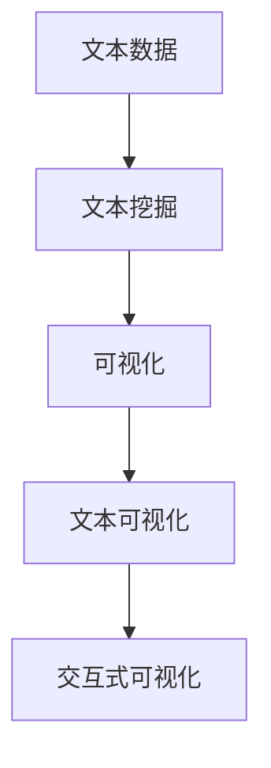

                 

# 文本可视化：大规模文本数据的直观呈现

> 关键词：文本可视化, 文本分析, 大规模数据, 交互式可视化, 自然语言处理(NLP), 文本挖掘

## 1. 背景介绍

### 1.1 问题由来
随着互联网技术的普及，文本数据的生成和传播速度呈指数级增长。从社交媒体、新闻网站、学术文献到企业报告，文本数据源源不断，为研究人员提供了丰富的语料库。然而，面对海量文本数据，如何高效地进行文本分析、发现关键信息并转化为可操作的洞察，成为当前数据科学和自然语言处理(NLP)领域的一项重大挑战。传统的文本分析方法，如关键词提取、主题建模等，往往难以捕捉文本中的细微变化和复杂关系。而文本可视化作为一种直观呈现数据的新手段，被越来越多地应用于文本分析中。通过将文本数据映射到可视化图表中，可以直观展示数据分布、趋势、关联等关键信息，从而更快速、准确地获取文本数据中的有用信息。

### 1.2 问题核心关键点
文本可视化的核心思想是通过图表、图形等直观的方式，将文本数据转换成可视化图表，以帮助用户快速理解文本内容、发现模式、提取关键信息。其核心关键点包括：

1. **数据表示**：如何将文本数据转换为图表元素，如单词、短语、句子等。
2. **可视化策略**：如何选择可视化策略，如词云、情感分布图、关系图等。
3. **交互设计**：如何设计交互界面，允许用户通过点击、滑动等操作来探索文本数据。
4. **分析模型**：如何将文本数据和可视化结果结合起来，进行深入分析。

### 1.3 问题研究意义
文本可视化技术在信息检索、文本挖掘、情感分析、舆情监测等领域有着广泛的应用。它能够帮助用户更直观地理解文本数据，发现文本中的重要模式和趋势，从而提高文本分析的效率和准确性。具体意义包括：

1. **提高效率**：通过可视化手段，快速识别文本中的关键信息，减少手动分析的时间和成本。
2. **增强洞察**：可视化能够提供更加直观的视图，帮助用户发现文本中的隐含模式和关联，进而做出更准确的决策。
3. **促进交流**：可视化图表易于分享和讨论，有助于团队协作和知识传递。
4. **支持教育**：通过可视化技术，帮助学生更好地理解和掌握文本知识，提高教学效果。

## 2. 核心概念与联系

### 2.1 核心概念概述

为了更好地理解文本可视化技术，本节将介绍几个密切相关的核心概念：

- **文本数据**：指由文本构成的数据集，包括新闻、书籍、论文、社交媒体帖子等。
- **文本挖掘**：通过自动化手段从文本数据中提取有用信息的过程，包括文本分类、实体识别、情感分析等。
- **数据可视化**：通过图形、图表等方式呈现数据，使数据更易于理解和分析。
- **文本可视化**：将文本数据转换为可视化图表，帮助用户直观理解文本内容、发现模式、提取关键信息。
- **交互式可视化**：允许用户通过交互界面探索和分析数据，提升用户体验和分析效果。

这些核心概念之间的关系可以通过以下Mermaid流程图来展示：



这个流程图展示了文本数据到可视化图表的过程：

1. 文本数据通过文本挖掘技术进行预处理，提取有用的信息。
2. 提取的信息再经过可视化技术，转换为直观的图表。
3. 图表通过交互式设计，允许用户进行互动探索和分析。

## 3. 核心算法原理 & 具体操作步骤
### 3.1 算法原理概述

文本可视化通常基于以下基本原理：

1. **文本预处理**：清洗、分词、词性标注等。
2. **信息提取**：通过统计、聚类、分类等技术提取文本中的关键信息。
3. **可视化表示**：将提取的信息转换为可视化图表元素，如单词云、情感分布图、关系图等。
4. **交互设计**：设计交互界面，允许用户探索和分析可视化图表。

### 3.2 算法步骤详解

文本可视化的具体实现步骤如下：

**Step 1: 数据准备**
- 收集需要可视化的文本数据，并对其进行预处理，包括去噪、分词、停用词过滤等。

**Step 2: 信息提取**
- 使用统计、聚类、分类等技术，从文本中提取关键信息，如高频词、主题、情感等。

**Step 3: 可视化表示**
- 将提取的关键信息转换为可视化图表元素，如词云、情感分布图、关系图等。

**Step 4: 交互设计**
- 设计交互界面，允许用户通过点击、滑动、放大缩小等操作探索文本数据，发现其中的模式和趋势。

**Step 5: 结果展示**
- 将可视化图表展示给用户，进行进一步分析和决策。

### 3.3 算法优缺点

文本可视化具有以下优点：

1. **直观性**：直观呈现文本数据，易于理解。
2. **发现模式**：帮助用户发现文本中的隐含模式和关联。
3. **交互性**：允许用户通过交互界面进行探索和分析。

同时，文本可视化也存在一些局限：

1. **数据处理**：需要大量预处理工作，对文本质量要求高。
2. **可视化复杂度**：对于复杂的数据结构，可视化表示可能过于简单或复杂。
3. **用户经验**：需要用户具有一定的数据分析经验才能有效利用可视化结果。
4. **技术门槛**：需要掌握可视化工具和编程技能。

### 3.4 算法应用领域

文本可视化技术在多个领域都有广泛应用，包括：

- **舆情监测**：通过可视化分析社交媒体、新闻等文本数据，了解公众情绪和舆情动态。
- **内容推荐**：利用文本挖掘和可视化技术，推荐用户可能感兴趣的内容。
- **市场分析**：通过可视化分析市场报告、新闻等文本数据，发现市场趋势和机会。
- **情感分析**：通过情感分布图等可视化手段，分析用户对产品或服务的情感反馈。
- **文本分类**：利用可视化技术展示不同分类结果的分布，帮助用户理解分类结果。

## 4. 数学模型和公式 & 详细讲解 & 举例说明

### 4.1 数学模型构建

文本可视化的数学模型主要涉及以下几个步骤：

1. **文本表示**：将文本转换为数值向量。
2. **信息提取**：从文本向量中提取关键信息，如高频词、主题等。
3. **可视化表示**：将关键信息转换为可视化图表元素。

### 4.2 公式推导过程

以词云为例，展示文本可视化的公式推导过程：

**Step 1: 文本表示**

设文本数据集为 $D=\{x_1,x_2,\dots,x_n\}$，每个文本 $x_i$ 表示为 $x_i=(w_{i,1},w_{i,2},\dots,w_{i,m})$，其中 $w_{i,j}$ 表示文本 $x_i$ 中第 $j$ 个词。

假设使用词频统计方法将文本转换为向量表示，则 $x_i$ 可以表示为词频向量 $\vec{x}_i=(f_{i,1},f_{i,2},\dots,f_{i,m})$，其中 $f_{i,j}$ 表示词 $w_{i,j}$ 在文本 $x_i$ 中出现的频率。

**Step 2: 信息提取**

从文本向量 $\vec{x}_i$ 中提取关键信息，可以使用TF-IDF（Term Frequency-Inverse Document Frequency）、LDA（Latent Dirichlet Allocation）等技术。例如，使用TF-IDF方法，提取文本中每个词的TF-IDF值：

$$
tf(w_{i,j}) = \frac{f_{i,j}}{\sum_{k=1}^m f_{i,k}}
$$

$$
idf(w_j) = \log \frac{N}{\sum_{i=1}^N tf(w_{i,j})}
$$

其中 $N$ 为文本总数，$tf(w_{i,j})$ 和 $idf(w_j)$ 分别为词 $w_{i,j}$ 在文本 $x_i$ 和整个语料库中的TF-IDF值。

**Step 3: 可视化表示**

词云是一种常见的文本可视化形式，用于展示文本中高频词的分布。假设提取的TF-IDF值为 $\vec{v}_i=(v_{i,1},v_{i,2},\dots,v_{i,m})$，则词云的可视化表示可以通过以下公式计算：

$$
vis_{i,j} = v_{i,j} * \text{scale}(v_{i,j}, \text{max\_value})
$$

其中 $vis_{i,j}$ 表示第 $j$ 个词在词云中的大小，$scale$ 表示缩放函数，$\text{max\_value}$ 表示词云的最大值。

通过上述公式，可以将文本数据转换为直观的词云图，帮助用户直观理解文本中高频词的分布。

### 4.3 案例分析与讲解

以舆情监测为例，展示文本可视化的具体应用：

1. **数据准备**：收集社交媒体、新闻网站上的文本数据，并进行预处理。

2. **信息提取**：使用情感分析模型提取文本中的情感倾向，如正面、负面、中性等。

3. **可视化表示**：将情感倾向转换为情感分布图，通过柱状图、饼图等形式展示情感分布。

4. **交互设计**：设计交互界面，允许用户选择时间范围、情感类别等参数，实时更新可视化结果。

通过情感分布图，用户可以直观了解某个时间段内公众情绪的变化趋势，识别出可能引起舆情波动的关键事件或话题，从而制定相应的应对措施。

## 5. 项目实践：代码实例和详细解释说明
### 5.1 开发环境搭建

在进行文本可视化项目实践前，我们需要准备好开发环境。以下是使用Python进行开发的环境配置流程：

1. 安装Anaconda：从官网下载并安装Anaconda，用于创建独立的Python环境。

2. 创建并激活虚拟环境：
```bash
conda create -n text-visualization python=3.8 
conda activate text-visualization
```

3. 安装相关库：
```bash
conda install pandas matplotlib seaborn jupyter notebook ipython
```

4. 下载数据集：
```bash
wget https://raw.githubusercontent.com/stanfordnlp/tagger/master/data/cleaned.gold
```

完成上述步骤后，即可在`text-visualization`环境中开始项目实践。

### 5.2 源代码详细实现

下面我们以词云生成为例，展示文本可视化的具体实现过程。

首先，定义词云生成函数：

```python
import matplotlib.pyplot as plt
from wordcloud import WordCloud
import jieba

def generate_wordcloud(text_file, title):
    with open(text_file, 'r', encoding='utf-8') as f:
        text = f.read()
    words = jieba.cut(text)
    wordcloud = WordCloud(width=800, height=400, max_words=200).generate(' '.join(words))
    plt.figure(figsize=(8, 4))
    plt.imshow(wordcloud, interpolation='bilinear')
    plt.axis('off')
    plt.title(title)
    plt.show()
```

然后，使用词云生成函数生成词云图：

```python
generate_wordcloud('cleaned.gold', 'Title 1')
```

在函数中，我们使用了第三方库`WordCloud`生成词云，并使用`jieba`库进行中文分词。运行代码后，即可生成词云图。

### 5.3 代码解读与分析

让我们再详细解读一下关键代码的实现细节：

**generate_wordcloud函数**：
- `with open(text_file, 'r', encoding='utf-8') as f:`：打开文件，并读取其中的文本数据。
- `jieba.cut(text)`：使用`jieba`库进行中文分词，返回单词列表。
- `WordCloud`：创建词云对象，设置宽度、高度和最大词数等参数。
- `generate(' '.join(words))`：根据单词列表生成词云。
- `plt.figure(figsize=(8, 4))`：设置画布大小。
- `plt.imshow(wordcloud, interpolation='bilinear')`：显示词云图。
- `plt.axis('off')`：关闭坐标轴。
- `plt.title(title)`：设置图表标题。
- `plt.show()`：显示图表。

通过上述代码，我们实现了从文本文件生成词云图的过程。可以看到，代码简洁高效，易于理解和修改。

## 6. 实际应用场景
### 6.1 舆情监测

舆情监测是文本可视化的一个重要应用场景。通过可视化分析社交媒体、新闻等文本数据，了解公众情绪和舆情动态，为舆情管理提供科学依据。

在技术实现上，可以收集社交媒体、新闻网站上的文本数据，并对其进行情感分析。将情感分析结果转换为情感分布图，实时展示公众情绪的变化趋势，识别出可能引起舆情波动的关键事件或话题，从而制定相应的应对措施。

### 6.2 市场分析

市场分析是文本可视化的另一个重要应用场景。通过可视化分析市场报告、新闻等文本数据，发现市场趋势和机会，为投资决策提供数据支持。

在技术实现上，可以收集市场报告、新闻等文本数据，并对其进行主题提取和情感分析。将提取的主题和情感分布转换为关系图、情感分布图等可视化图表，帮助用户直观理解市场动态和趋势，发现潜在的投资机会。

### 6.3 内容推荐

内容推荐是文本可视化的典型应用之一。通过可视化分析用户评论、反馈等文本数据，了解用户偏好，为内容推荐提供数据支持。

在技术实现上，可以收集用户评论、反馈等文本数据，并对其进行情感分析。将情感分析结果转换为情感分布图，实时展示用户对不同内容的情感倾向，识别出用户偏好的内容和主题，从而进行个性化推荐。

### 6.4 未来应用展望

随着文本可视化技术的不断进步，其在更多领域的应用前景将更加广阔：

1. **智能客服**：通过可视化分析客户反馈、投诉等文本数据，了解客户需求和痛点，为智能客服系统提供数据支持。
2. **医疗健康**：通过可视化分析医学报告、病历等文本数据，发现疾病趋势和风险，为医疗健康决策提供科学依据。
3. **金融风险**：通过可视化分析金融报告、新闻等文本数据，发现市场风险和机会，为金融投资决策提供数据支持。
4. **教育培训**：通过可视化分析学生反馈、评估等文本数据，了解学生需求和问题，为教育培训提供数据支持。
5. **社交网络**：通过可视化分析社交媒体、论坛等文本数据，了解公众情绪和话题趋势，为社交网络管理提供科学依据。

## 7. 工具和资源推荐
### 7.1 学习资源推荐

为了帮助开发者系统掌握文本可视化技术，这里推荐一些优质的学习资源：

1. **Python文本可视化教程**：详解如何使用Python进行文本可视化，涵盖词云、情感分布图、关系图等多种形式。
2. **自然语言处理（NLP）课程**：包括文本挖掘、情感分析等NLP技术，帮助理解文本数据处理和分析方法。
3. **Jupyter Notebook入门**：介绍Jupyter Notebook的使用和数据可视化，适合初学者快速上手。
4. **Tableau入门教程**：讲解如何使用Tableau进行数据可视化，涵盖交互式图表、仪表盘等多种形式。

通过对这些资源的学习实践，相信你一定能够快速掌握文本可视化技术的精髓，并用于解决实际的文本分析问题。

### 7.2 开发工具推荐

高效的开发离不开优秀的工具支持。以下是几款用于文本可视化开发的常用工具：

1. **Jupyter Notebook**：免费的交互式编程环境，支持Python等多种语言，适合快速迭代研究。
2. **Tableau**：商业级的可视化工具，支持复杂图表和交互式仪表盘，适合数据可视化应用开发。
3. **PyCharm**：专业的Python开发工具，支持调试、测试等多种功能，适合开发复杂的文本可视化系统。
4. **D3.js**：开源的JavaScript库，支持创建交互式图表和数据可视化，适合Web前端开发。

合理利用这些工具，可以显著提升文本可视化任务的开发效率，加快创新迭代的步伐。

### 7.3 相关论文推荐

文本可视化技术的发展源于学界的持续研究。以下是几篇奠基性的相关论文，推荐阅读：

1. **Visualization of Text Data with TensorFlow**：介绍如何使用TensorFlow进行文本可视化，涵盖词云、情感分布图等多种形式。
2. **Text Visualization Techniques**：总结了文本可视化中的常见技术，如词云、关系图、情感分布图等，适合技术实践参考。
3. **Natural Language Processing with Text Visualization**：讲解了文本可视化的基本原理和技术，适合理解文本可视化的核心概念。

这些论文代表了大语言模型微调技术的发展脉络。通过学习这些前沿成果，可以帮助研究者把握学科前进方向，激发更多的创新灵感。

## 8. 总结：未来发展趋势与挑战
### 8.1 总结

本文对文本可视化技术进行了全面系统的介绍。首先阐述了文本可视化的研究背景和意义，明确了其在大数据时代的重要性和应用价值。其次，从原理到实践，详细讲解了文本可视化的数学原理和关键步骤，给出了文本可视化任务开发的完整代码实例。同时，本文还广泛探讨了文本可视化技术在舆情监测、市场分析、内容推荐等多个领域的应用前景，展示了文本可视化技术的巨大潜力。此外，本文精选了文本可视化的各类学习资源，力求为读者提供全方位的技术指引。

通过本文的系统梳理，可以看到，文本可视化技术在信息检索、文本挖掘、情感分析、舆情监测等领域有着广泛的应用。它能够帮助用户更直观地理解文本数据，发现文本中的隐含模式和关联，从而提高文本分析的效率和准确性。未来，随着文本可视化技术的不断进步，其在更多领域的应用前景将更加广阔，为人类认知智能的进化带来深远影响。

### 8.2 未来发展趋势

展望未来，文本可视化技术将呈现以下几个发展趋势：

1. **数据源多样化**：从单一文本数据扩展到多源数据融合，涵盖社交媒体、新闻、日志等多种数据形式。
2. **交互性增强**：通过交互式界面，允许用户实时探索和分析文本数据，发现数据中的细微变化。
3. **可视化复杂化**：从单一图表扩展到复杂可视化组合，涵盖词云、情感分布图、关系图等多种形式。
4. **自动化提升**：通过自动化技术，提升文本可视化的效率和准确性，减少手动干预。
5. **数据压缩与优化**：在保证可视化效果的前提下，对文本数据进行压缩和优化，减少存储空间和计算时间。
6. **跨平台应用**：将文本可视化技术应用到更多平台，如移动端、Web端等，提升用户体验。

这些趋势凸显了文本可视化技术的广阔前景，将极大地提升文本数据分析和决策的效率和准确性。

### 8.3 面临的挑战

尽管文本可视化技术已经取得了显著成就，但在迈向更加智能化、普适化应用的过程中，它仍面临着诸多挑战：

1. **数据处理**：需要大量预处理工作，对文本质量要求高，处理复杂数据时容易出现噪声和偏差。
2. **可视化复杂度**：对于复杂的数据结构，可视化表示可能过于简单或复杂，难以直观呈现。
3. **用户经验**：需要用户具有一定的数据分析经验才能有效利用可视化结果，部分用户可能缺乏相关知识。
4. **技术门槛**：需要掌握可视化工具和编程技能，部分用户可能缺乏相关技能。
5. **计算资源**：可视化过程需要大量计算资源，对于大规模数据集处理效率较低。

正视文本可视化面临的这些挑战，积极应对并寻求突破，将使其在实际应用中发挥更大作用。

### 8.4 研究展望

未来的文本可视化研究可以从以下几个方向进行：

1. **多源数据融合**：将多种数据源融合，综合展示文本数据中的信息，提升可视化效果。
2. **自动化生成**：通过自动化技术，提升文本可视化的效率和准确性，减少手动干预。
3. **可视化交互**：设计更加灵活的交互界面，允许用户通过点击、滑动、放大缩小等操作探索文本数据。
4. **可视化增强**：使用增强现实(AR)、虚拟现实(VR)等技术，增强文本可视化的沉浸感和交互性。
5. **知识驱动**：将知识图谱、逻辑规则等外部知识与文本可视化结合，提升可视化效果和分析能力。

这些研究方向的探索，将进一步提升文本可视化技术的效率和准确性，推动其广泛应用于更多领域，为人类认知智能的进化带来深远影响。

## 9. 附录：常见问题与解答

**Q1：文本可视化是否适用于所有文本数据？**

A: 文本可视化适用于多种文本数据形式，包括新闻、报告、评论、日志等。但对于一些特定的文本数据，如基因序列、代码片段等，需要根据具体情况选择合适的可视化方法。

**Q2：文本可视化需要处理哪些预处理步骤？**

A: 文本可视化需要处理的步骤包括分词、去噪、停用词过滤等。具体预处理步骤需要根据文本数据的特点进行灵活选择。

**Q3：如何选择可视化策略？**

A: 选择可视化策略需要考虑文本数据的特点和分析目的。常见的可视化策略包括词云、情感分布图、关系图等。对于情感分析、舆情监测等任务，可以选择情感分布图；对于主题提取、内容推荐等任务，可以选择词云和关系图。

**Q4：如何进行文本数据的自动化可视化？**

A: 可以使用自动化技术，如自然语言处理(NLP)、机器学习等，提升文本可视化的效率和准确性。常见的自动化技术包括TF-IDF、LDA、情感分析等。

**Q5：如何提高文本可视化的可解释性？**

A: 可以通过解释图表中的元素，增强文本可视化的可解释性。例如，在词云中，可以通过标注高频词的TF-IDF值，解释词云中的每个元素代表的含义。

通过本文的系统梳理，可以看到，文本可视化技术在信息检索、文本挖掘、情感分析、舆情监测等领域有着广泛的应用。它能够帮助用户更直观地理解文本数据，发现文本中的隐含模式和关联，从而提高文本分析的效率和准确性。未来，随着文本可视化技术的不断进步，其在更多领域的应用前景将更加广阔，为人类认知智能的进化带来深远影响。

---

作者：禅与计算机程序设计艺术 / Zen and the Art of Computer Programming

