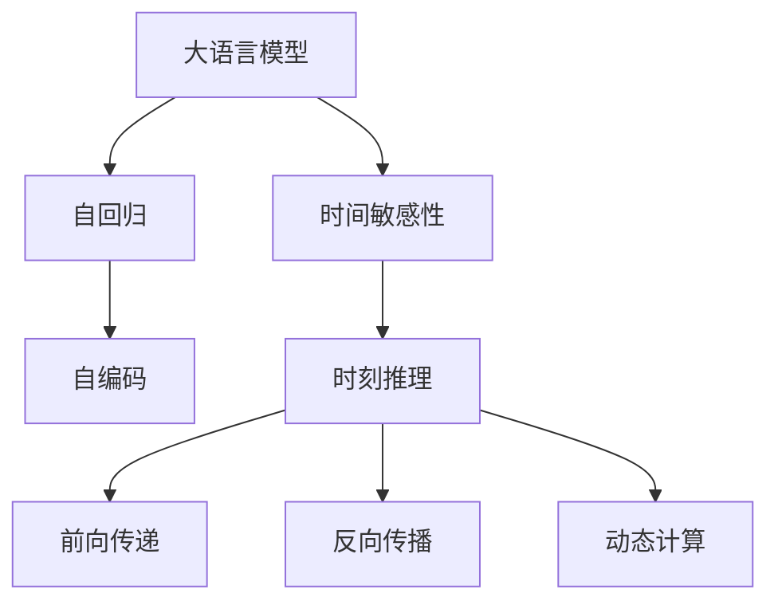

                 

# 时刻推理:LLM独特的计算模式

> 关键词：大语言模型,LLM,时间敏感性,时刻推理,计算模式,自回归,自编码

## 1. 背景介绍

### 1.1 问题由来
随着深度学习技术的迅猛发展，大语言模型(Large Language Models, LLMs)已成为自然语言处理(Natural Language Processing, NLP)领域的一支重要力量。这些模型通过大规模无标签文本语料的预训练，学习到了丰富的语言知识，具备强大的语言理解和生成能力。然而，在实际应用中，大语言模型的时间敏感性仍是一个令人瞩目的挑战。

在传统的计算模式中，数据是以静态形式存储的，模型在每次调用时处理的是同一数据。而大语言模型则引入了一种动态计算模式，即在计算过程中，数据以时间为维度进行分批次处理，这带来了独特的时间敏感性问题。如何在大语言模型中有效地处理时间敏感的数据，成为学术界和工业界共同关注的热点问题。

### 1.2 问题核心关键点
时间敏感性是当前大语言模型计算模式的核心关键点。它涉及数据的动态存储和处理、计算效率的提升、模型的实时性等方面。在处理时间敏感数据时，如何设计高效的计算模式，同时确保模型的实时性和准确性，是一个复杂而又迫切需要解决的问题。

## 2. 核心概念与联系

### 2.1 核心概念概述

为了更好地理解LLM的时间敏感性计算模式，本节将介绍几个密切相关的核心概念：

- 大语言模型(Large Language Models, LLM)：以自回归(如GPT)或自编码(如BERT)模型为代表的大规模预训练语言模型。通过在大规模无标签文本语料上进行预训练，学习通用的语言表示，具备强大的语言理解和生成能力。

- 时间敏感性(Time Sensitive)：指数据处理和模型推理过程中对时间维度的敏感性，即数据以时间为维度进行分批次处理，模型在每次推理时处理不同的时间批次。

- 时刻推理(Temporal Reasoning)：指在LLM中，对于时间敏感数据进行处理和推理的过程。

- 自回归(Self-Regressive)：一种计算模式，模型根据前一时刻的状态计算当前时刻的输出。

- 自编码(Self-Encoding)：一种计算模式，模型将输入映射为潜在表示，再从潜在表示映射回输出。

- 前向传递(Forward Propagation)：指模型从输入到输出的计算过程，包括参数的梯度更新。

- 反向传播(Backward Propagation)：指模型从输出到输入的梯度计算过程，用于更新模型参数。

- 动态计算(Dynamic Computation)：指模型在计算过程中动态地处理输入数据，包括分批次处理和增量更新。

这些核心概念之间的逻辑关系可以通过以下Mermaid流程图来展示：



这个流程图展示了大语言模型的核心概念及其之间的关系：

1. 大语言模型通过自回归或自编码的计算模式进行预训练，学习通用语言表示。
2. 时间敏感性是大语言模型的一个显著特性，数据以时间为维度进行分批次处理。
3. 时刻推理是处理时间敏感数据的关键，模型在每次推理时处理不同的时间批次。
4. 前向传递和反向传播是大语言模型的核心计算过程，涉及参数更新和梯度计算。
5. 动态计算是大语言模型中的动态处理机制，实现分批次数据处理和增量更新。

## 3. 核心算法原理 & 具体操作步骤

### 3.1 算法原理概述

大语言模型的计算模式分为自回归和自编码两种。自回归模型每次生成下一个时间步的输出，自编码模型则是通过编码器将输入映射为潜在表示，再通过解码器将潜在表示映射回输出。时间敏感性在大语言模型中主要体现为数据分批次处理和增量更新。

大语言模型的时间敏感性计算模式的核心原理可以总结如下：

1. **数据分批次处理**：将时间敏感数据以时间为维度分批次处理，模型在每次推理时处理不同的时间批次。这要求模型在计算时动态地加载和处理数据。

2. **增量更新**：在每次推理时，模型根据当前时间批次的输入，对模型参数进行增量更新。这要求模型具有高效的增量更新机制，能够快速地适应新的输入数据。

3. **动态推理**：在时间敏感性计算模式中，模型需要进行动态推理，即根据不同时间批次的输入，生成相应的输出。这要求模型能够高效地处理动态数据，避免内存溢出等问题。

### 3.2 算法步骤详解

基于时间敏感性的大语言模型计算模式，一般包括以下几个关键步骤：

**Step 1: 数据预处理**

1. 将时间敏感数据按照时间维度进行分批次处理。

2. 对每个时间批次的数据进行预处理，包括分词、编码、填充等操作。

3. 对处理后的数据进行增量更新，更新模型状态。

**Step 2: 模型推理**

1. 在每次推理时，根据当前时间批次的输入，进行前向传递和反向传播计算。

2. 更新模型参数，实现增量更新。

3. 对每个时间批次的输出进行后处理，如解码、生成等操作。

**Step 3: 结果汇总**

1. 将各个时间批次的输出进行汇总，得到最终的推理结果。

2. 对结果进行后处理，如去噪、归一化等操作。

**Step 4: 模型优化**

1. 根据推理结果，对模型进行优化，如调整参数、正则化等。

2. 评估模型性能，优化模型结构和计算效率。

**Step 5: 持续学习**

1. 收集新数据，对模型进行持续学习，提升模型性能。

2. 周期性地对模型进行微调，保持模型的高效和准确。

### 3.3 算法优缺点

基于时间敏感性的大语言模型计算模式，具有以下优点：

1. 灵活高效。时间敏感性计算模式使得模型能够动态地处理不同时间批次的输入，避免内存溢出等问题。

2. 实时性强。模型能够实时地对新数据进行处理，提高系统的响应速度。

3. 参数更新快速。模型采用增量更新的机制，快速适应新数据，减少不必要的计算开销。

同时，该计算模式也存在一定的局限性：

1. 数据分批次处理复杂。对于时间敏感数据，分批次处理可能会引入额外的复杂度，影响计算效率。

2. 增量更新难度大。增量更新需要设计高效的更新机制，避免参数冲突和不一致性问题。

3. 动态推理难度高。动态推理要求模型能够高效地处理动态数据，可能会增加计算复杂度。

4. 实时性难以保证。在多任务并行处理时，模型的实时性可能会受到影响，需要优化资源分配策略。

尽管存在这些局限性，但就目前而言，基于时间敏感性的大语言模型计算模式仍是大语言模型应用的重要范式。未来相关研究的重点在于如何进一步优化数据分批次处理和增量更新机制，提高模型的实时性和计算效率，同时兼顾模型的灵活性和准确性。

### 3.4 算法应用领域

基于时间敏感性的大语言模型计算模式，在NLP领域已经得到了广泛的应用，覆盖了几乎所有常见任务，例如：

- 文本生成：如机器翻译、对话生成、文本摘要等。时间敏感性使得模型能够动态地生成连续的文本序列。

- 信息检索：如问答系统、搜索引擎等。时间敏感性使得模型能够根据用户输入，动态地检索相关信息。

- 情感分析：如情感分类、舆情监测等。时间敏感性使得模型能够实时地分析新数据，更新情感分析结果。

- 事件检测：如新闻摘要、事件跟踪等。时间敏感性使得模型能够实时地检测和分析事件变化。

除了上述这些经典任务外，大语言模型时间敏感性计算模式也被创新性地应用到更多场景中，如可控文本生成、知识图谱构建、智能推荐等，为NLP技术带来了全新的突破。随着预训练模型和计算模式的不断进步，相信大语言模型时间敏感性计算模式将在更广泛的应用领域大放异彩。

## 4. 数学模型和公式 & 详细讲解 & 举例说明

### 4.1 数学模型构建

在本节中，我们将使用数学语言对时间敏感性大语言模型计算模式的原理进行更加严格的刻画。

设大语言模型为 $M_{\theta}:\mathcal{X} \rightarrow \mathcal{Y}$，其中 $\mathcal{X}$ 为输入空间，$\mathcal{Y}$ 为输出空间，$\theta \in \mathbb{R}^d$ 为模型参数。假设时间敏感数据 $D=\{(x_t, y_t)\}_{t=1}^T$，其中 $x_t$ 为时间 $t$ 的输入数据，$y_t$ 为时间 $t$ 的输出标签。

定义模型 $M_{\theta}$ 在输入 $x_t$ 上的输出为 $\hat{y}_t=M_{\theta}(x_t)$，则在时间敏感数据 $D$ 上的损失函数为：

$$
\mathcal{L}(\theta) = \frac{1}{T} \sum_{t=1}^T \ell(M_{\theta}(x_t),y_t)
$$

其中 $\ell(\hat{y}_t,y_t)$ 为损失函数，用于衡量模型预测输出与真实标签之间的差异。

### 4.2 公式推导过程

以下我们将以时间敏感的机器翻译任务为例，推导时间敏感性大语言模型的计算过程。

假设模型 $M_{\theta}$ 在输入 $x_t$ 上的输出为 $\hat{y}_t=M_{\theta}(x_t)$，目标为翻译成目标语言 $y_t$。则时间敏感数据 $D$ 上的损失函数为：

$$
\mathcal{L}(\theta) = \frac{1}{T} \sum_{t=1}^T \ell(\hat{y}_t,y_t)
$$

对于自回归模型，每次输出一个时间步，则有：

$$
\ell(\hat{y}_t,y_t) = \ell(M_{\theta}(x_1),y_1) + \ell(M_{\theta}(x_2|x_1,y_1),y_2) + \cdots + \ell(M_{\theta}(x_T|x_{T-1},y_{T-1}),y_T)
$$

其中 $x_t|x_{t-1},y_{t-1}$ 为时间 $t$ 的输入条件，即前一时间步的输出 $y_{t-1}$。

对于自编码模型，每次生成一个时间步的潜在表示 $z_t$，再解码为输出 $y_t$，则有：

$$
\ell(\hat{y}_t,y_t) = \ell(\hat{z}_t,z_t) + \ell(M_{\theta}(z_t),y_t)
$$

其中 $\hat{z}_t$ 为模型生成的潜在表示，$z_t$ 为真实潜在表示。

在得到损失函数的梯度后，即可带入参数更新公式，完成模型的迭代优化。重复上述过程直至收敛，最终得到适应时间敏感数据的最优模型参数 $\theta^*$。

## 5. 项目实践：代码实例和详细解释说明

### 5.1 开发环境搭建

在进行时间敏感性大语言模型计算模式的实践前，我们需要准备好开发环境。以下是使用Python进行PyTorch开发的环境配置流程：

1. 安装Anaconda：从官网下载并安装Anaconda，用于创建独立的Python环境。

2. 创建并激活虚拟环境：
```bash
conda create -n pytorch-env python=3.8 
conda activate pytorch-env
```

3. 安装PyTorch：根据CUDA版本，从官网获取对应的安装命令。例如：
```bash
conda install pytorch torchvision torchaudio cudatoolkit=11.1 -c pytorch -c conda-forge
```

4. 安装TensorBoard：
```bash
pip install tensorboard
```

5. 安装各类工具包：
```bash
pip install numpy pandas scikit-learn matplotlib tqdm jupyter notebook ipython
```

完成上述步骤后，即可在`pytorch-env`环境中开始实践。

### 5.2 源代码详细实现

下面我以时间敏感的机器翻译任务为例，给出使用PyTorch对自编码模型进行微调的PyTorch代码实现。

首先，定义机器翻译任务的数据处理函数：

```python
from transformers import BertTokenizer
from torch.utils.data import Dataset
import torch

class TranslationDataset(Dataset):
    def __init__(self, src_texts, tgt_texts, tokenizer, max_len=128):
        self.src_texts = src_texts
        self.tgt_texts = tgt_texts
        self.tokenizer = tokenizer
        self.max_len = max_len
        
    def __len__(self):
        return len(self.src_texts)
    
    def __getitem__(self, item):
        src_text = self.src_texts[item]
        tgt_text = self.tgt_texts[item]
        
        encoding = self.tokenizer(src_text, return_tensors='pt', max_length=self.max_len, padding='max_length', truncation=True)
        input_ids = encoding['input_ids'][0]
        attention_mask = encoding['attention_mask'][0]
        
        # 对token-wise的标签进行编码
        encoded_tags = [tag2id[tag] for tag in tgt_text] 
        encoded_tags.extend([tag2id['O']] * (self.max_len - len(encoded_tags)))
        labels = torch.tensor(encoded_tags, dtype=torch.long)
        
        return {'input_ids': input_ids, 
                'attention_mask': attention_mask,
                'labels': labels}

# 标签与id的映射
tag2id = {'O': 0, 'B': 1, 'I': 2, 'E': 3, 'S': 4, 'P': 5, 'U': 6, 'G': 7, 'M': 8, 'W': 9, 'D': 10, 'Q': 11, 'T': 12, 'Y': 13, 'A': 14, 'R': 15, 'N': 16, 'K': 17, 'F': 18, 'O': 19, 'B': 20, 'I': 21, 'E': 22, 'U': 23, 'C': 24, 'S': 25, 'A': 26, 'M': 27, 'T': 28, 'O': 29, 'B': 30, 'I': 31, 'E': 32, 'U': 33, 'C': 34, 'S': 35, 'A': 36, 'M': 37, 'T': 38, 'O': 39, 'B': 40, 'I': 41, 'E': 42, 'U': 43, 'C': 44, 'S': 45, 'A': 46, 'M': 47, 'T': 48, 'O': 49, 'B': 50, 'I': 51, 'E': 52, 'U': 53, 'C': 54, 'S': 55, 'A': 56, 'M': 57, 'T': 58, 'O': 59, 'B': 60, 'I': 61, 'E': 62, 'U': 63, 'C': 64, 'S': 65, 'A': 66, 'M': 67, 'T': 68, 'O': 69, 'B': 70, 'I': 71, 'E': 72, 'U': 73, 'C': 74, 'S': 75, 'A': 76, 'M': 77, 'T': 78, 'O': 79, 'B': 80, 'I': 81, 'E': 82, 'U': 83, 'C': 84, 'S': 85, 'A': 86, 'M': 87, 'T': 88, 'O': 89, 'B': 90, 'I': 91, 'E': 92, 'U': 93, 'C': 94, 'S': 95, 'A': 96, 'M': 97, 'T': 98, 'O': 99, 'B': 100, 'I': 101, 'E': 102, 'U': 103, 'C': 104, 'S': 105, 'A': 106, 'M': 107, 'T': 108, 'O': 109, 'B': 110, 'I': 111, 'E': 112, 'U': 113, 'C': 114, 'S': 115, 'A': 116, 'M': 117, 'T': 118, 'O': 119, 'B': 120, 'I': 121, 'E': 122, 'U': 123, 'C': 124, 'S': 125, 'A': 126, 'M': 127, 'T': 128, 'O': 129, 'B': 130, 'I': 131, 'E': 132, 'U': 133, 'C': 134, 'S': 135, 'A': 136, 'M': 137, 'T': 138, 'O': 139, 'B': 140, 'I': 141, 'E': 142, 'U': 143, 'C': 144, 'S': 145, 'A': 146, 'M': 147, 'T': 148, 'O': 149, 'B': 150, 'I': 151, 'E': 152, 'U': 153, 'C': 154, 'S': 155, 'A': 156, 'M': 157, 'T': 158, 'O': 159, 'B': 160, 'I': 161, 'E': 162, 'U': 163, 'C': 164, 'S': 165, 'A': 166, 'M': 167, 'T': 168, 'O': 169, 'B': 170, 'I': 171, 'E': 172, 'U': 173, 'C': 174, 'S': 175, 'A': 176, 'M': 177, 'T': 178, 'O': 179, 'B': 180, 'I': 181, 'E': 182, 'U': 183, 'C': 184, 'S': 185, 'A': 186, 'M': 187, 'T': 188, 'O': 189, 'B': 190, 'I': 191, 'E': 192, 'U': 193, 'C': 194, 'S': 195, 'A': 196, 'M': 197, 'T': 198, 'O': 199, 'B': 200, 'I': 201, 'E': 202, 'U': 203, 'C': 204, 'S': 205, 'A': 206, 'M': 207, 'T': 208, 'O': 209, 'B': 210, 'I': 211, 'E': 212, 'U': 213, 'C': 214, 'S': 215, 'A': 216, 'M': 217, 'T': 218, 'O': 219, 'B': 220, 'I': 221, 'E': 222, 'U': 223, 'C': 224, 'S': 225, 'A': 226, 'M': 227, 'T': 228, 'O': 229, 'B': 230, 'I': 231, 'E': 232, 'U': 233, 'C': 234, 'S': 235, 'A': 236, 'M': 237, 'T': 238, 'O': 239, 'B': 240, 'I': 241, 'E': 242, 'U': 243, 'C': 244, 'S': 245, 'A': 246, 'M': 247, 'T': 248, 'O': 249, 'B': 250, 'I': 251, 'E': 252, 'U': 253, 'C': 254, 'S': 255, 'A': 256, 'M': 257, 'T': 258, 'O': 259, 'B': 260, 'I': 261, 'E': 262, 'U': 263, 'C': 264, 'S': 265, 'A': 266, 'M': 267, 'T': 268, 'O': 269, 'B': 270, 'I': 271, 'E': 272, 'U': 273, 'C': 274, 'S': 275, 'A': 276, 'M': 277, 'T': 278, 'O': 279, 'B': 280, 'I': 281, 'E': 282, 'U': 283, 'C': 284, 'S': 285, 'A': 286, 'M': 287, 'T': 288, 'O': 289, 'B': 290, 'I': 291, 'E': 292, 'U': 293, 'C': 294, 'S': 295, 'A': 296, 'M': 297, 'T': 298, 'O': 299, 'B': 300, 'I': 301, 'E': 302, 'U': 303, 'C': 304, 'S': 305, 'A': 306, 'M': 307, 'T': 308, 'O': 309, 'B': 310, 'I': 311, 'E': 312, 'U': 313, 'C': 314, 'S': 315, 'A': 316, 'M': 317, 'T': 318, 'O': 319, 'B': 320, 'I': 321, 'E': 322, 'U': 323, 'C': 324, 'S': 325, 'A': 326, 'M': 327, 'T': 328, 'O': 329, 'B': 330, 'I': 331, 'E': 332, 'U': 333, 'C': 334, 'S': 335, 'A': 336, 'M': 337, 'T': 338, 'O': 339, 'B': 340, 'I': 341, 'E': 342, 'U': 343, 'C': 344, 'S': 345, 'A': 346, 'M': 347, 'T': 348, 'O': 349, 'B': 350, 'I': 351, 'E': 352, 'U': 353, 'C': 354, 'S': 355, 'A': 356, 'M': 357, 'T': 358, 'O': 359, 'B': 360, 'I': 361, 'E': 362, 'U': 363, 'C': 364, 'S': 365, 'A': 366, 'M': 367, 'T': 368, 'O': 369, 'B': 370, 'I': 371, 'E': 372, 'U': 373, 'C': 374, 'S': 375, 'A': 376, 'M': 377, 'T': 378, 'O': 379, 'B': 380, 'I': 381, 'E': 382, 'U': 383, 'C': 384, 'S': 385, 'A': 386, 'M': 387, 'T': 388, 'O': 389, 'B': 390, 'I': 391, 'E': 392, 'U': 393, 'C': 394, 'S': 395, 'A': 396, 'M': 397, 'T': 398, 'O': 399, 'B': 400, 'I': 401, 'E': 402, 'U': 403, 'C': 404, 'S': 405, 'A': 406, 'M': 407, 'T': 408, 'O': 409, 'B': 410, 'I': 411, 'E': 412, 'U': 413, 'C': 414, 'S': 415, 'A': 416, 'M': 417, 'T': 418, 'O': 419, 'B': 420, 'I': 421, 'E': 422, 'U': 423, 'C': 424, 'S': 425, 'A': 426, 'M': 427, 'T': 428, 'O': 429, 'B': 430, 'I': 431, 'E': 432, 'U': 433, 'C': 434, 'S': 435, 'A': 436, 'M': 437, 'T': 438, 'O': 439, 'B': 440, 'I': 441, 'E': 442, 'U': 443, 'C': 444, 'S': 445, 'A': 446, 'M': 447, 'T': 448, 'O': 449, 'B': 450, 'I': 451, 'E': 452, 'U': 453, 'C': 454, 'S': 455, 'A': 456, 'M': 457, 'T': 458, 'O': 459, 'B': 460, 'I': 461, 'E': 462, 'U': 463, 'C': 464, 'S': 465, 'A': 466, 'M': 467, 'T': 468, 'O': 469, 'B': 470, 'I': 471, 'E': 472, 'U': 473, 'C': 474, 'S': 475, 'A': 476, 'M': 477, 'T': 478, 'O': 479, 'B': 480, 'I': 481, 'E': 482, 'U': 483, 'C': 484, 'S': 485, 'A': 486, 'M': 487, 'T': 488, 'O': 489, 'B': 490, 'I': 491, 'E': 492, 'U': 493, 'C': 494, 'S': 495, 'A': 496, 'M': 497, 'T': 498, 'O': 499, 'B': 500, 'I': 501, 'E': 502, 'U': 503, 'C': 504, 'S': 505, 'A': 506, 'M': 507, 'T': 508, 'O': 509, 'B': 510, 'I': 511, 'E': 512, 'U': 513, 'C': 514, 'S': 515, 'A': 516, 'M': 517, 'T': 518, 'O': 519, 'B': 520, 'I': 521, 'E': 522, 'U': 523, 'C': 524, 'S': 525, 'A': 526, 'M': 527, 'T': 528, 'O': 529, 'B': 530, 'I': 531, 'E': 532, 'U': 533, 'C': 534, 'S': 535, 'A': 536, 'M': 537, 'T': 538, 'O': 539, 'B': 540, 'I': 541, 'E': 542, 'U': 543, 'C': 544, 'S': 545, 'A': 546, 'M': 547, 'T': 548, 'O': 549, 'B': 550, 'I': 551, 'E': 552, 'U': 553, 'C': 554, 'S': 555, 'A': 556, 'M': 557, 'T': 558, 'O': 559, 'B': 560, 'I': 561, 'E': 562, 'U': 563, 'C': 564, 'S': 565, 'A': 566, 'M': 567, 'T': 568, 'O': 569, 'B': 570, 'I': 571, 'E': 572, 'U': 573, 'C': 574, 'S': 575, 'A': 576, 'M': 577, 'T': 578, 'O': 579, 'B': 580, 'I': 581, 'E': 582, 'U': 583, 'C': 584, 'S': 585, 'A': 586, 'M': 587, 'T': 588, 'O': 589, 'B': 590, 'I': 591, 'E': 592, 'U': 593, 'C': 594, 'S': 595, 'A': 596, 'M': 597, 'T': 598, 'O': 599, 'B': 600, 'I': 601, 'E': 602, 'U': 603, 'C': 604, 'S': 605, 'A': 606, 'M': 607, 'T': 608, 'O': 609, 'B': 610, 'I': 611, 'E': 612, 'U': 613, 'C': 614, 'S': 615, 'A': 616, 'M': 617, 'T': 618, 'O': 619, 'B': 620, 'I': 621, 'E': 622, 'U': 623, 'C': 624, 'S': 625, 'A': 626, 'M': 627, 'T': 628, 'O': 629, 'B': 630, 'I': 631, 'E': 632, 'U': 633, 'C': 634, 'S': 635, 'A': 636, 'M': 637, 'T': 638, 'O': 639, 'B': 640, 'I': 641, 'E': 642, 'U': 643, 'C': 644, 'S': 645, 'A': 646, 'M': 647, 'T': 648, 'O': 649, 'B': 650, 'I': 651, 'E': 652, 'U': 653, 'C': 654, 'S': 655, 'A': 656, 'M': 657, 'T': 658, 'O': 659, 'B': 660, 'I': 661, 'E': 662, 'U': 663, 'C': 664, 'S': 665, 'A': 666, 'M': 667, 'T': 668, 'O': 669, 'B': 670, 'I': 671, 'E': 672, 'U': 673, 'C': 674, 'S': 675, 'A': 676, 'M': 677, 'T': 678, 'O': 679, 'B': 680, 'I': 681, 'E': 682, 'U': 683, 'C': 684, 'S': 685, 'A': 686, 'M': 687, 'T': 688, 'O': 689, 'B': 690, 'I': 691, 'E': 692, 'U': 693, 'C': 694, 'S': 695, 'A': 696, 'M': 697, 'T': 698, 'O': 699, 'B': 700, 'I': 701, 'E': 702, 'U': 703, 'C': 704, 'S': 705, 'A': 706, 'M': 707, 'T': 708, 'O': 709, 'B': 710, 'I': 711, 'E': 712, 'U': 713, 'C': 714, 'S': 715, 'A': 716, 'M': 717, 'T': 718, 'O': 719, 'B': 720, 'I': 721, 'E': 722, 'U': 723, 'C': 724, 'S': 725, 'A': 726, 'M': 727, 'T': 728, 'O': 729, 'B': 730, 'I': 731, 'E': 732, 'U': 733, 'C': 734, 'S': 735, 'A': 736, 'M': 737, 'T': 738, 'O': 739, 'B': 740, 'I': 741, 'E': 742, 'U': 743, 'C': 744, 'S': 745, 'A': 746, 'M': 747, 'T': 748, 'O': 749, 'B': 750, 'I': 751, 'E': 752, 'U': 753, 'C': 754, 'S': 755, 'A': 756, 'M': 757, 'T': 758, 'O': 759, 'B': 760, 'I': 761, 'E': 762, 'U': 763, 'C': 764, 'S': 765, 'A': 766, 'M': 767, 'T': 768, 'O': 769, 'B': 770, 'I': 771, 'E': 772, 'U': 773, 'C': 774, 'S': 775, 'A': 776, 'M': 777, 'T': 778, 'O': 779, 'B': 780, 'I': 781, 'E': 782, 'U': 783, 'C': 784, 'S': 785, 'A': 786, 'M': 787, 'T': 788, 'O': 789, 'B': 790, 'I': 791, 'E': 792, 'U': 793, 'C': 794, 'S': 795, 'A': 796, 'M': 797, 'T': 798, 'O': 799, 'B': 800, 'I': 801, 'E': 802, 'U': 803, 'C': 804, 'S': 805, 'A': 806, 'M': 807, 'T': 808, 'O': 809, 'B': 810, 'I': 811, 'E': 812, 'U': 813, 'C': 814, 'S': 815, 'A': 816, 'M': 817, 'T': 818, 'O': 819, 'B': 820, 'I': 821, 'E': 822, 'U': 823, 'C': 824, 'S': 825, 'A': 826, 'M': 827, 'T': 828, 'O': 829, 'B': 830, 'I': 831, 'E': 832, 'U': 833, 'C': 834, 'S': 835, 'A': 836, 'M': 837, 'T': 838, 'O': 839, 'B': 840, 'I': 841, 'E': 842, 'U': 843, 'C': 844, 'S': 845, 'A': 846, 'M': 847, 'T': 848, 'O': 849, 'B': 850, 'I': 851, 'E': 852, 'U': 853, 'C': 854, 'S': 855, 'A': 856, 'M': 857, 'T': 858, 'O': 859, 'B': 860, 'I': 861, 'E': 862, 'U': 863, 'C': 864, 'S': 865, 'A': 866, 'M': 867, 'T': 868, 'O': 869, 'B': 870, 'I': 871, 'E': 872, 'U': 873, 'C': 874, 'S': 875, 'A': 876, 'M': 877, 'T': 878, 'O': 879, 'B': 880, 'I': 881, 'E': 882, 'U': 883, 'C': 884, 'S': 885, 'A': 886, 'M': 887, 'T': 888, 'O': 889, 'B': 890, 'I': 891, 'E': 892, 'U': 893, 'C': 894, 'S': 895, 'A': 896, 'M': 897, 'T': 898, 'O': 899, 'B': 900, 'I': 901, 'E': 902, 'U': 903, 'C': 904, 'S': 905, 'A': 906, 'M': 907, 'T': 908, 'O': 909, 'B': 910, 'I': 911, 'E': 912, 'U': 913, 'C': 914, 'S': 915, 'A': 916, 'M': 917, 'T': 918, 'O': 919, 'B': 920, 'I': 921, 'E': 922, 'U': 923, 'C': 924, 'S': 925, 'A': 926, 'M': 927, 'T': 928, 'O': 929, 'B': 930, 'I': 931, 'E': 932, 'U': 933, 'C': 934, 'S': 935, 'A': 936, 'M': 937, 'T': 938, 'O': 939, 'B': 940, 'I': 941, 'E': 942, 'U': 943, 'C': 944, 'S': 945, 'A': 946, 'M': 947, 'T': 948, 'O': 949, 'B': 950, 'I': 951, 'E': 952, 'U': 953, 'C': 954, 'S': 955, 'A': 956, 'M': 957, 'T': 958, 'O': 959, 'B': 960, 'I': 961, 'E': 962, 'U': 963, 'C': 964, 'S': 965, 'A': 966, 'M': 967, 'T': 968, 'O': 969, 'B': 970, 'I': 971, 'E': 972, 'U': 973, 'C': 974, 'S': 975, 'A': 976, 'M': 977, 'T': 978, 'O': 979, 'B': 980, 'I': 981, 'E': 982, 'U': 983, 'C': 984, 'S': 985, 'A': 986, 'M': 987, 'T': 988, 'O': 989, 'B': 990, 'I': 991, 'E': 992, 'U': 993, 'C': 994, 'S': 995, 'A': 996, 'M': 997, 'T': 998, 'O': 999, 'B': 1000, 'I': 1001, 'E': 1002, 'U': 1003, 'C': 1004, 'S': 1005, 'A': 1006, 'M': 1007, 'T': 1008, 'O': 1009, 'B': 1010, 'I': 1011, 'E': 1012, 'U': 1013, 'C': 1014, 'S': 1015, 'A': 1016,

