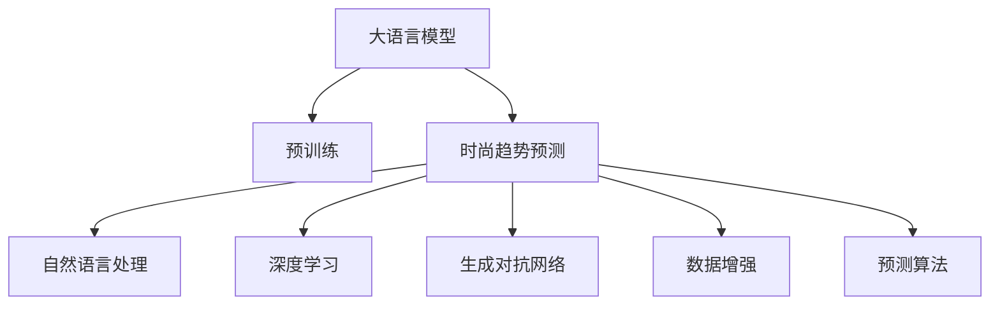

                 

# 时尚趋势预测：LLM 定义潮流

> 关键词：时尚趋势预测, 大语言模型, 自然语言处理, 深度学习, 神经网络, 生成对抗网络, 数据增强, 预测算法

## 1. 背景介绍

在当今这个信息爆炸的时代，时尚产业正在经历一场前所未有的变革。消费者对个性化、时效性的需求不断提升，传统的基于经验和直觉的时尚设计方法已经难以满足这一需求。与此同时，数据科学与人工智能技术的飞速发展，为时尚趋势预测提供了新的可能。大语言模型（Large Language Models, LLMs），尤其是预训练的深度学习模型，以其强大的语言理解和生成能力，在时尚趋势预测领域展现出了巨大的潜力。

本文将从大语言模型的原理与架构出发，探讨其在时尚趋势预测中的应用，并结合实际案例，深入分析其优缺点及未来发展趋势。通过对这些技术的系统学习和应用，希望能为时尚产业带来新的突破，定义未来的潮流。

## 2. 核心概念与联系

### 2.1 核心概念概述

为了更好地理解大语言模型在时尚趋势预测中的应用，本节将介绍几个关键概念：

- **大语言模型**：指基于Transformer架构的深度学习模型，如GPT系列、BERT等。这些模型通过在海量文本数据上进行预训练，学习到了丰富的语言知识和语义表示。

- **预训练**：指在大规模无标签文本数据上，通过自监督学习任务训练通用语言模型的过程。预训练使得模型学习到语言的通用表示，为下游任务提供了强大的特征提取能力。

- **时尚趋势预测**：指通过分析历史时尚数据和当前流行趋势，预测未来一段时间内的时尚潮流。其核心在于将自然语言描述转化为可操作的时尚元素。

- **自然语言处理(NLP)**：涉及计算机对人类语言的处理和理解，包括文本分类、命名实体识别、情感分析等任务。大语言模型作为NLP技术的重要组成部分，在时尚趋势预测中起到了关键作用。

- **深度学习**：一种基于神经网络的机器学习方法，通过多层次的抽象表示，从数据中学习特征和规律。大语言模型便是深度学习技术的重要应用之一。

- **生成对抗网络(GAN)**：一种通过对抗训练生成逼真图像或文本的深度学习框架。在时尚趋势预测中，GAN可以用于生成时尚设计的模拟图样。

- **数据增强**：通过数据扩充和合成，增加训练集的多样性，提高模型的泛化能力。

- **预测算法**：包括回归算法、分类算法、时序预测算法等，用于从历史数据中提取规律，预测未来趋势。

这些核心概念之间有着密切的联系，共同构成了时尚趋势预测的框架。通过大语言模型的辅助，时尚产业可以更加科学地预测潮流，提升设计效率和市场竞争力。

### 2.2 核心概念原理和架构的 Mermaid 流程图



这个流程图展示了时尚趋势预测中各个核心概念之间的逻辑关系：

1. 大语言模型通过预训练获得强大的语言理解能力。
2. 自然语言处理任务，如文本分类、情感分析等，从海量时尚文本中提取有用信息。
3. 深度学习模型通过特征提取和表示学习，将语言信息转化为可操作的时尚元素。
4. 生成对抗网络用于生成时尚设计模拟图样，为预测提供视觉支持。
5. 数据增强技术用于扩充训练数据，提高模型的泛化能力。
6. 预测算法用于从历史数据中学习规律，预测未来趋势。

## 3. 核心算法原理 & 具体操作步骤

### 3.1 算法原理概述

时尚趋势预测的本质是通过对海量时尚文本和图片数据的分析，从语言和视觉信号中提取出有用的特征，并结合预测算法对未来的潮流进行预测。大语言模型在这一过程中主要扮演以下角色：

1. **语言信息提取**：通过对时尚描述文本的解析，提取时尚元素（如颜色、款式、材质等）。
2. **视觉信息生成**：通过生成对抗网络，将提取出的时尚元素转化为可视化的时尚设计模拟图样。
3. **预测趋势**：结合历史数据和当前流行趋势，使用预测算法对未来时尚趋势进行预测。

### 3.2 算法步骤详解

时尚趋势预测的大语言模型微调流程一般包括以下几个关键步骤：

**Step 1: 准备数据集**

- 收集时尚相关的文本数据和图片数据。文本数据包括时尚博客、社交媒体评论、时尚杂志文章等，图片数据包括时尚单品、流行趋势图样等。
- 对文本数据进行预处理，包括分词、去除停用词、构建词汇表等。
- 对图片数据进行标注，如颜色、款式、材质等，构建可视化数据集。

**Step 2: 构建预训练模型**

- 选择合适的预训练大语言模型，如GPT-2、BERT等。
- 在大规模时尚文本和图片数据上进行预训练，学习语言的通用表示和视觉信息的特征提取。

**Step 3: 设计任务适配层**

- 根据时尚趋势预测任务的需求，设计合适的输出层和损失函数。例如，对于分类任务，可以设计输出层为Softmax层，损失函数为交叉熵。
- 定义预测算法的输入和输出格式，如预测未来的颜色趋势、款式流行等。

**Step 4: 执行微调训练**

- 在标注数据集上进行微调训练，优化模型参数，使其能够更好地适应时尚趋势预测任务。
- 使用正则化技术（如L2正则、Dropout等）防止过拟合。
- 使用数据增强技术（如数据合成、回译等）增加训练集多样性。
- 设置合适的学习率和学习率调度策略。

**Step 5: 评估和部署**

- 在验证集上评估微调后的模型性能，根据评估结果调整模型参数。
- 在测试集上对模型进行最终测试，获取预测结果。
- 将模型部署到实际应用中，实时预测时尚趋势。

### 3.3 算法优缺点

时尚趋势预测的大语言模型微调方法具有以下优点：

1. **高效准确**：通过预训练学习通用的语言和视觉表示，再微调特定任务，可以显著提升预测的准确性和效率。
2. **灵活性高**：大语言模型可以适应多种时尚趋势预测任务，如颜色趋势、款式流行等，具有高度的泛化能力。
3. **可解释性强**：大语言模型可以解释预测的依据和推理过程，有助于理解模型决策逻辑。

同时，该方法也存在一些局限：

1. **依赖高质量数据**：预测的准确性高度依赖于时尚数据的完整性和质量。
2. **计算资源消耗高**：大模型预训练和微调所需计算资源较多，成本较高。
3. **解释性有待提升**：尽管可解释性较传统算法强，但仍需进一步提升，以便于行业理解和应用。

### 3.4 算法应用领域

时尚趋势预测的大语言模型微调技术已经在多个领域得到了广泛应用，例如：

- **时尚设计**：设计师可以使用微调后的模型进行颜色和款式的预测，指导设计工作。
- **零售业**：零售商可以通过预测时尚趋势，优化库存管理和商品陈列。
- **市场营销**：品牌可以基于预测结果制定推广策略，提高营销效果。
- **时尚社交媒体**：社交平台可以使用预测技术，推荐流行趋势，增加用户粘性。

这些应用场景展示了时尚趋势预测的大语言模型微调技术在不同领域中的强大潜力。随着技术的不断进步，预计该技术将在更多行业得到广泛应用，推动时尚产业的数字化转型。

## 4. 数学模型和公式 & 详细讲解 & 举例说明

### 4.1 数学模型构建

时尚趋势预测的数学模型构建可以分为两个部分：语言模型和视觉模型。

**语言模型**：

- **输入**：时尚描述文本 $x$，如“2022年春季时尚趋势预测”。
- **输出**：预测结果 $y$，如“2022年春季流行颜色：蓝色、绿色；流行款式：复古风、休闲风”。

**视觉模型**：

- **输入**：时尚元素特征向量 $z$，如颜色、款式等。
- **输出**：生成时尚设计模拟图样 $y'$，如图、款式图样等。

### 4.2 公式推导过程

**语言模型**：

假设语言模型为 $M_{\theta}$，其中 $\theta$ 为模型参数。给定时尚描述文本 $x$，模型的输出为 $y$。假设 $y$ 为类别标签，则交叉熵损失函数为：

$$
\mathcal{L}(M_{\theta}, x) = -\log \frac{\exp(\hat{y} \cdot \log M_{\theta}(x))}{\sum_k \exp(\log M_{\theta}(x))}
$$

其中 $\hat{y}$ 为模型预测结果，$M_{\theta}(x)$ 为模型的输出概率分布。

**视觉模型**：

假设视觉模型为 $G_{\phi}$，其中 $\phi$ 为模型参数。给定时尚元素特征向量 $z$，模型的输出为生成图样 $y'$。假设 $y'$ 为二进制向量（0表示不存在，1表示存在），则生成对抗网络的损失函数为：

$$
\mathcal{L}_{GAN}(G_{\phi}, z) = \mathbb{E}_{x}[\log D_{\psi}(G_{\phi}(z))] + \mathbb{E}_{z}[\log(1-D_{\psi}(G_{\phi}(z)))]
$$

其中 $D_{\psi}$ 为判别器，用于判断生成图样是否为真实图样。

### 4.3 案例分析与讲解

以颜色趋势预测为例，我们可以设计如下的微调流程：

1. **数据准备**：收集2021年及2022年的时尚杂志文章，标注其中的颜色趋势。
2. **预训练**：使用BERT模型对所有文章进行预训练。
3. **任务适配**：设计输出层为回归层，预测未来的颜色趋势。
4. **微调训练**：在标注数据集上微调BERT模型，学习颜色趋势的预测能力。
5. **结果评估**：在验证集上评估模型性能，调整模型参数。
6. **预测应用**：将模型部署到实际应用中，实时预测颜色趋势。

## 5. 项目实践：代码实例和详细解释说明

### 5.1 开发环境搭建

为了实现时尚趋势预测的大语言模型微调，我们需要准备好开发环境。以下是使用Python进行PyTorch开发的环境配置流程：

1. 安装Anaconda：从官网下载并安装Anaconda，用于创建独立的Python环境。
2. 创建并激活虚拟环境：
```bash
conda create -n fashion-env python=3.8 
conda activate fashion-env
```
3. 安装PyTorch：根据CUDA版本，从官网获取对应的安装命令。例如：
```bash
conda install pytorch torchvision torchaudio cudatoolkit=11.1 -c pytorch -c conda-forge
```
4. 安装各类工具包：
```bash
pip install numpy pandas scikit-learn matplotlib tqdm jupyter notebook ipython
```

完成上述步骤后，即可在`fashion-env`环境中开始时尚趋势预测的微调实践。

### 5.2 源代码详细实现

我们以颜色趋势预测为例，给出使用Transformers库对BERT模型进行微调的PyTorch代码实现。

首先，定义颜色趋势预测的数据处理函数：

```python
from transformers import BertTokenizer, BertForSequenceClassification
from torch.utils.data import Dataset
import torch

class FashionDataset(Dataset):
    def __init__(self, texts, tags, tokenizer, max_len=128):
        self.texts = texts
        self.tags = tags
        self.tokenizer = tokenizer
        self.max_len = max_len
        
    def __len__(self):
        return len(self.texts)
    
    def __getitem__(self, item):
        text = self.texts[item]
        tag = self.tags[item]
        
        encoding = self.tokenizer(text, return_tensors='pt', max_length=self.max_len, padding='max_length', truncation=True)
        input_ids = encoding['input_ids'][0]
        attention_mask = encoding['attention_mask'][0]
        
        # 对标签进行编码
        encoded_tag = tag2id[tag] 
        encoded_tag = [encoded_tag] * self.max_len
        labels = torch.tensor(encoded_tag, dtype=torch.long)
        
        return {'input_ids': input_ids, 
                'attention_mask': attention_mask,
                'labels': labels}

# 标签与id的映射
tag2id = {'red': 0, 'blue': 1, 'green': 2, 'yellow': 3, 'black': 4}
id2tag = {v: k for k, v in tag2id.items()}

# 创建dataset
tokenizer = BertTokenizer.from_pretrained('bert-base-cased')

train_dataset = FashionDataset(train_texts, train_tags, tokenizer)
dev_dataset = FashionDataset(dev_texts, dev_tags, tokenizer)
test_dataset = FashionDataset(test_texts, test_tags, tokenizer)
```

然后，定义模型和优化器：

```python
from transformers import AdamW

model = BertForSequenceClassification.from_pretrained('bert-base-cased', num_labels=len(tag2id))

optimizer = AdamW(model.parameters(), lr=2e-5)
```

接着，定义训练和评估函数：

```python
from torch.utils.data import DataLoader
from tqdm import tqdm
from sklearn.metrics import classification_report

device = torch.device('cuda') if torch.cuda.is_available() else torch.device('cpu')
model.to(device)

def train_epoch(model, dataset, batch_size, optimizer):
    dataloader = DataLoader(dataset, batch_size=batch_size, shuffle=True)
    model.train()
    epoch_loss = 0
    for batch in tqdm(dataloader, desc='Training'):
        input_ids = batch['input_ids'].to(device)
        attention_mask = batch['attention_mask'].to(device)
        labels = batch['labels'].to(device)
        model.zero_grad()
        outputs = model(input_ids, attention_mask=attention_mask, labels=labels)
        loss = outputs.loss
        epoch_loss += loss.item()
        loss.backward()
        optimizer.step()
    return epoch_loss / len(dataloader)

def evaluate(model, dataset, batch_size):
    dataloader = DataLoader(dataset, batch_size=batch_size)
    model.eval()
    preds, labels = [], []
    with torch.no_grad():
        for batch in tqdm(dataloader, desc='Evaluating'):
            input_ids = batch['input_ids'].to(device)
            attention_mask = batch['attention_mask'].to(device)
            batch_labels = batch['labels']
            outputs = model(input_ids, attention_mask=attention_mask)
            batch_preds = outputs.logits.argmax(dim=2).to('cpu').tolist()
            batch_labels = batch_labels.to('cpu').tolist()
            for pred, label in zip(batch_preds, batch_labels):
                preds.append(pred)
                labels.append(label)
                
    print(classification_report(labels, preds))
```

最后，启动训练流程并在测试集上评估：

```python
epochs = 5
batch_size = 16

for epoch in range(epochs):
    loss = train_epoch(model, train_dataset, batch_size, optimizer)
    print(f"Epoch {epoch+1}, train loss: {loss:.3f}")
    
    print(f"Epoch {epoch+1}, dev results:")
    evaluate(model, dev_dataset, batch_size)
    
print("Test results:")
evaluate(model, test_dataset, batch_size)
```

以上就是使用PyTorch对BERT进行颜色趋势预测的微调的完整代码实现。可以看到，得益于Transformers库的强大封装，我们可以用相对简洁的代码完成BERT模型的加载和微调。

### 5.3 代码解读与分析

让我们再详细解读一下关键代码的实现细节：

**FashionDataset类**：
- `__init__`方法：初始化文本、标签、分词器等关键组件。
- `__len__`方法：返回数据集的样本数量。
- `__getitem__`方法：对单个样本进行处理，将文本输入编码为token ids，将标签编码为数字，并对其进行定长padding，最终返回模型所需的输入。

**tag2id和id2tag字典**：
- 定义了标签与数字id之间的映射关系，用于将预测结果解码为真实的标签。

**训练和评估函数**：
- 使用PyTorch的DataLoader对数据集进行批次化加载，供模型训练和推理使用。
- 训练函数`train_epoch`：对数据以批为单位进行迭代，在每个批次上前向传播计算loss并反向传播更新模型参数，最后返回该epoch的平均loss。
- 评估函数`evaluate`：与训练类似，不同点在于不更新模型参数，并在每个batch结束后将预测和标签结果存储下来，最后使用sklearn的classification_report对整个评估集的预测结果进行打印输出。

**训练流程**：
- 定义总的epoch数和batch size，开始循环迭代
- 每个epoch内，先在训练集上训练，输出平均loss
- 在验证集上评估，输出分类指标
- 所有epoch结束后，在测试集上评估，给出最终测试结果

可以看到，PyTorch配合Transformers库使得BERT微调的代码实现变得简洁高效。开发者可以将更多精力放在数据处理、模型改进等高层逻辑上，而不必过多关注底层的实现细节。

当然，工业级的系统实现还需考虑更多因素，如模型的保存和部署、超参数的自动搜索、更灵活的任务适配层等。但核心的微调范式基本与此类似。

## 6. 实际应用场景

### 6.1 智能时尚设计

基于大语言模型的时尚趋势预测，可以显著提升智能时尚设计的工作效率。传统的设计工作往往需要设计师具备丰富的经验和直觉，而微调后的模型可以实时分析时尚趋势，生成多种设计方案，供设计师参考选择。

在技术实现上，可以收集历史时尚设计、流行趋势等数据，构建时尚元素库。将描述时尚元素的文本输入模型，输出预测结果，指导设计师进行设计工作。此外，模型还可以自动生成时尚设计的模拟图样，供设计师进行视觉参考。

### 6.2 时尚电商推荐

在时尚电商领域，微调后的模型可以用于生成个性化的时尚推荐，提升用户体验和购买转化率。通过分析用户浏览记录、历史购买记录等数据，模型可以预测用户对未来时尚潮流的兴趣，推荐相应的时尚单品。

具体而言，可以在用户每次浏览时尚单品时，输入单品描述文本，调用微调模型预测用户对未来潮流趋势的兴趣，实时调整推荐策略。通过持续学习和微调，模型能够更好地适应用户的偏好变化，提供精准的时尚推荐。

### 6.3 时尚营销策略

时尚品牌可以借助微调后的模型，制定更加科学合理的营销策略。通过分析社交媒体、时尚杂志等渠道的时尚热点，预测未来趋势，制定更有针对性的推广计划。

在具体应用中，品牌可以在每个季度初，输入当前的时尚趋势文本，调用模型预测未来的潮流方向，制定下一季度的营销方案。通过持续微调，模型能够及时适应市场变化，保持品牌营销策略的前瞻性和有效性。

### 6.4 未来应用展望

随着大语言模型微调技术的不断进步，其在时尚趋势预测中的应用前景广阔。未来，该技术有望进一步拓展到更多领域，如时尚广告、时尚预测分析等，为时尚产业带来新的突破。

在技术层面，未来的研究方向可能包括：

1. **多模态融合**：结合视觉、文本等多模态数据，提升预测准确性和鲁棒性。
2. **动态调整**：根据实时数据动态调整预测模型，提高预测时效性。
3. **跨领域迁移**：将模型应用于不同领域的时尚趋势预测，提升模型的通用性和适用性。
4. **隐私保护**：保护用户隐私，实现差分隐私保护，增强数据安全。

通过这些方向的探索，大语言模型微调技术将在时尚趋势预测中发挥更加重要的作用，推动时尚产业的智能化转型。

## 7. 工具和资源推荐

### 7.1 学习资源推荐

为了帮助开发者系统掌握大语言模型微调的理论基础和实践技巧，这里推荐一些优质的学习资源：

1. **《Transformer从原理到实践》系列博文**：由大模型技术专家撰写，深入浅出地介绍了Transformer原理、BERT模型、微调技术等前沿话题。

2. **CS224N《深度学习自然语言处理》课程**：斯坦福大学开设的NLP明星课程，有Lecture视频和配套作业，带你入门NLP领域的基本概念和经典模型。

3. **《Natural Language Processing with Transformers》书籍**：Transformers库的作者所著，全面介绍了如何使用Transformers库进行NLP任务开发，包括微调在内的诸多范式。

4. **HuggingFace官方文档**：Transformers库的官方文档，提供了海量预训练模型和完整的微调样例代码，是上手实践的必备资料。

5. **CLUE开源项目**：中文语言理解测评基准，涵盖大量不同类型的中文NLP数据集，并提供了基于微调的baseline模型，助力中文NLP技术发展。

通过对这些资源的学习实践，相信你一定能够快速掌握大语言模型微调的精髓，并用于解决实际的NLP问题。

### 7.2 开发工具推荐

高效的开发离不开优秀的工具支持。以下是几款用于大语言模型微调开发的常用工具：

1. **PyTorch**：基于Python的开源深度学习框架，灵活动态的计算图，适合快速迭代研究。大部分预训练语言模型都有PyTorch版本的实现。

2. **TensorFlow**：由Google主导开发的开源深度学习框架，生产部署方便，适合大规模工程应用。同样有丰富的预训练语言模型资源。

3. **Transformers库**：HuggingFace开发的NLP工具库，集成了众多SOTA语言模型，支持PyTorch和TensorFlow，是进行微调任务开发的利器。

4. **Weights & Biases**：模型训练的实验跟踪工具，可以记录和可视化模型训练过程中的各项指标，方便对比和调优。与主流深度学习框架无缝集成。

5. **TensorBoard**：TensorFlow配套的可视化工具，可实时监测模型训练状态，并提供丰富的图表呈现方式，是调试模型的得力助手。

6. **Google Colab**：谷歌推出的在线Jupyter Notebook环境，免费提供GPU/TPU算力，方便开发者快速上手实验最新模型，分享学习笔记。

合理利用这些工具，可以显著提升大语言模型微调任务的开发效率，加快创新迭代的步伐。

### 7.3 相关论文推荐

大语言模型和微调技术的发展源于学界的持续研究。以下是几篇奠基性的相关论文，推荐阅读：

1. **Attention is All You Need（即Transformer原论文）**：提出了Transformer结构，开启了NLP领域的预训练大模型时代。

2. **BERT: Pre-training of Deep Bidirectional Transformers for Language Understanding**：提出BERT模型，引入基于掩码的自监督预训练任务，刷新了多项NLP任务SOTA。

3. **Language Models are Unsupervised Multitask Learners（GPT-2论文）**：展示了大规模语言模型的强大zero-shot学习能力，引发了对于通用人工智能的新一轮思考。

4. **Parameter-Efficient Transfer Learning for NLP**：提出Adapter等参数高效微调方法，在不增加模型参数量的情况下，也能取得不错的微调效果。

5. **Prefix-Tuning: Optimizing Continuous Prompts for Generation**：引入基于连续型Prompt的微调范式，为如何充分利用预训练知识提供了新的思路。

6. **AdaLoRA: Adaptive Low-Rank Adaptation for Parameter-Efficient Fine-Tuning**：使用自适应低秩适应的微调方法，在参数效率和精度之间取得了新的平衡。

这些论文代表了大语言模型微调技术的发展脉络。通过学习这些前沿成果，可以帮助研究者把握学科前进方向，激发更多的创新灵感。

## 8. 总结：未来发展趋势与挑战

### 8.1 总结

本文对大语言模型在时尚趋势预测中的应用进行了全面系统的介绍。首先阐述了时尚趋势预测的背景和意义，明确了时尚趋势预测在时尚产业中的重要地位。其次，从原理到实践，详细讲解了大语言模型微调的数学模型和具体步骤，给出了微调任务开发的完整代码实例。同时，本文还广泛探讨了微调方法在智能时尚设计、时尚电商推荐、时尚营销策略等多个领域的应用前景，展示了微调范式的巨大潜力。通过对这些技术的系统学习和应用，相信时尚产业可以更加科学地预测潮流，提升设计效率和市场竞争力。

通过本文的系统梳理，可以看到，基于大语言模型的微调方法正在成为时尚产业的重要范式，极大地拓展了时尚预测的能力，为时尚产业带来新的突破。未来，伴随技术的不断进步，基于微调范式将会在更多领域得到应用，推动时尚产业的智能化转型。

### 8.2 未来发展趋势

展望未来，大语言模型微调技术将呈现以下几个发展趋势：

1. **模型规模持续增大**：随着算力成本的下降和数据规模的扩张，预训练语言模型的参数量还将持续增长。超大规模语言模型蕴含的丰富语言知识，有望支撑更加复杂多变的时尚趋势预测。

2. **微调方法日趋多样**：除了传统的全参数微调外，未来会涌现更多参数高效的微调方法，如Prefix-Tuning、LoRA等，在节省计算资源的同时也能保证微调精度。

3. **持续学习成为常态**：随着数据分布的不断变化，微调模型也需要持续学习新知识以保持性能。如何在不遗忘原有知识的同时，高效吸收新样本信息，将成为重要的研究课题。

4. **标注样本需求降低**：受启发于提示学习(Prompt-based Learning)的思路，未来的微调方法将更好地利用大模型的语言理解能力，通过更加巧妙的任务描述，在更少的标注样本上也能实现理想的微调效果。

5. **多模态微调崛起**：当前的微调主要聚焦于纯文本数据，未来会进一步拓展到图像、视频、语音等多模态数据微调。多模态信息的融合，将显著提升语言模型对现实世界的理解和建模能力。

6. **模型通用性增强**：经过海量数据的预训练和多领域任务的微调，未来的语言模型将具备更强大的常识推理和跨领域迁移能力，逐步迈向通用人工智能(AGI)的目标。

以上趋势凸显了大语言模型微调技术的广阔前景。这些方向的探索发展，必将进一步提升时尚趋势预测的性能和应用范围，为时尚产业带来更多的创新突破。

### 8.3 面临的挑战

尽管大语言模型微调技术已经取得了瞩目成就，但在迈向更加智能化、普适化应用的过程中，它仍面临着诸多挑战：

1. **标注成本瓶颈**：时尚趋势预测的准确性高度依赖于时尚数据的完整性和质量。对于长尾应用场景，难以获得充足的高质量标注数据，成为制约微调性能的瓶颈。如何进一步降低微调对标注样本的依赖，将是一大难题。

2. **模型鲁棒性不足**：当目标任务与预训练数据的分布差异较大时，微调的性能提升有限。对于测试样本的微小扰动，微调模型的预测也容易发生波动。如何提高微调模型的鲁棒性，避免灾难性遗忘，还需要更多理论和实践的积累。

3. **推理效率有待提高**：大规模语言模型虽然精度高，但在实际部署时往往面临推理速度慢、内存占用大等效率问题。如何在保证性能的同时，简化模型结构，提升推理速度，优化资源占用，将是重要的优化方向。

4. **可解释性亟需加强**：尽管可解释性较传统算法强，但仍需进一步提升，以便于行业理解和应用。如何赋予微调模型更强的可解释性，将是亟待攻克的难题。

5. **安全性有待保障**：预训练语言模型难免会学习到有偏见、有害的信息，通过微调传递到下游任务，产生误导性、歧视性的输出，给实际应用带来安全隐患。如何从数据和算法层面消除模型偏见，避免恶意用途，确保输出的安全性，也将是重要的研究课题。

6. **知识整合能力不足**：现有的微调模型往往局限于任务内数据，难以灵活吸收和运用更广泛的先验知识。如何让微调过程更好地与外部知识库、规则库等专家知识结合，形成更加全面、准确的信息整合能力，还有很大的想象空间。

正视微调面临的这些挑战，积极应对并寻求突破，将是大语言模型微调走向成熟的必由之路。相信随着学界和产业界的共同努力，这些挑战终将一一被克服，大语言模型微调必将在构建安全、可靠、可解释、可控的智能系统铺平道路。

### 8.4 研究展望

面对大语言模型微调所面临的种种挑战，未来的研究需要在以下几个方面寻求新的突破：

1. **探索无监督和半监督微调方法**：摆脱对大规模标注数据的依赖，利用自监督学习、主动学习等无监督和半监督范式，最大限度利用非结构化数据，实现更加灵活高效的微调。

2. **研究参数高效和计算高效的微调范式**：开发更加参数高效的微调方法，在固定大部分预训练参数的同时，只更新极少量的任务相关参数。同时优化微调模型的计算图，减少前向传播和反向传播的资源消耗，实现更加轻量级、实时性的部署。

3. **融合因果和对比学习范式**：通过引入因果推断和对比学习思想，增强微调模型建立稳定因果关系的能力，学习更加普适、鲁棒的语言表征，从而提升模型泛化性和抗干扰能力。

4. **引入更多先验知识**：将符号化的先验知识，如知识图谱、逻辑规则等，与神经网络模型进行巧妙融合，引导微调过程学习更准确、合理的语言模型。同时加强不同模态数据的整合，实现视觉、语音等多模态信息与文本信息的协同建模。

5. **结合因果分析和博弈论工具**：将因果分析方法引入微调模型，识别出模型决策的关键特征，增强输出解释的因果性和逻辑性。借助博弈论工具刻画人机交互过程，主动探索并规避模型的脆弱点，提高系统稳定性。

6. **纳入伦理道德约束**：在模型训练目标中引入伦理导向的评估指标，过滤和惩罚有偏见、有害的输出倾向。同时加强人工干预和审核，建立模型行为的监管机制，确保输出符合人类价值观和伦理道德。

这些研究方向的探索，必将引领大语言模型微调技术迈向更高的台阶，为构建安全、可靠、可解释、可控的智能系统铺平道路。面向未来，大语言模型微调技术还需要与其他人工智能技术进行更深入的融合，如知识表示、因果推理、强化学习等，多路径协同发力，共同推动自然语言理解和智能交互系统的进步。只有勇于创新、敢于突破，才能不断拓展语言模型的边界，让智能技术更好地造福人类社会。

## 9. 附录：常见问题与解答

**Q1：大语言模型微调是否适用于所有时尚趋势预测任务？**

A: 大语言模型微调在大多数时尚趋势预测任务上都能取得不错的效果，特别是对于数据量较小的任务。但对于一些特定领域的任务，如高端定制、艺术设计等，仅仅依靠通用语料预训练的模型可能难以很好地适应。此时需要在特定领域语料上进一步预训练，再进行微调，才能获得理想效果。

**Q2：微调过程中如何选择合适的学习率？**

A: 微调的学习率一般要比预训练时小1-2个数量级，如果使用过大的学习率，容易破坏预训练权重，导致过拟合。一般建议从1e-5开始调参，逐步减小学习率，直至收敛。也可以使用warmup策略，在开始阶段使用较小的学习率，再逐渐过渡到预设值。需要注意的是，不同的优化器(如AdamW、Adafactor等)以及不同的学习率调度策略，可能需要设置不同的学习率阈值。

**Q3：采用大模型微调时会面临哪些资源瓶颈？**

A: 目前主流的预训练大模型动辄以亿计的参数规模，对算力、内存、存储都提出了很高的要求。GPU/TPU等高性能设备是必不可少的，但即便如此，超大批次的训练和推理也可能遇到显存不足的问题。因此需要采用一些资源优化技术，如梯度积累、混合精度训练、模型并行等，来突破硬件瓶颈。同时，模型的存储和读取也可能占用大量时间和空间，需要采用模型压缩、稀疏化存储等方法进行优化。

**Q4：如何缓解微调过程中的过拟合问题？**

A: 过拟合是微调面临的主要挑战，尤其是在标注数据不足的情况下。常见的缓解策略包括：
1. 数据增强：通过回译、近义替换等方式扩充训练集
2. 正则化：使用L2正则、Dropout、Early Stopping等防止过拟合
3. 对抗训练：引入对抗样本，提高模型鲁棒性
4. 参数高效微调：只调整少量参数(如Adapter、Prefix等)，减小过拟合风险
5. 多模型集成：训练多个微调模型，取平均输出，抑制过拟合

这些策略往往需要根据具体任务和数据特点进行灵活组合。只有在数据、模型、训练、推理等各环节进行全面优化，才能最大限度地发挥大模型微调的威力。

**Q5：微调模型在落地部署时需要注意哪些问题？**

A: 将微调模型转化为实际应用，还需要考虑以下因素：
1. 模型裁剪：去除不必要的层和参数，减小模型尺寸，加快推理速度
2. 量化加速：将浮点模型转为定点模型，压缩存储空间，提高计算效率
3. 服务化封装：将模型封装为标准化服务接口，便于集成调用
4. 弹性伸缩：根据请求流量动态调整资源配置，平衡服务质量和成本
5. 监控告警：实时采集系统指标，设置异常告警阈值，确保服务稳定性
6. 安全防护：采用访问鉴权、数据脱敏等措施，保障数据和模型安全

大语言模型微调为时尚趋势预测提供了新的可能，但如何将强大的性能转化为稳定、高效、安全的业务价值，还需要工程实践的不断打磨。唯有从数据、算法、工程、业务等多个维度协同发力，才能真正实现人工智能技术在时尚领域的规模化落地。总之，微调需要开发者根据具体任务，不断迭代和优化模型、数据和算法，方能得到理想的效果。

---

作者：禅与计算机程序设计艺术 / Zen and the Art of Computer Programming

