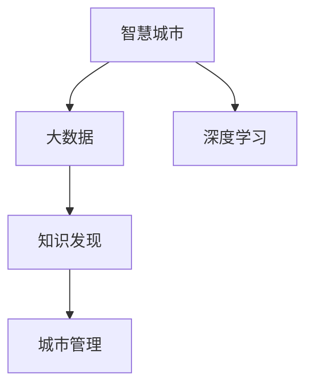

                 

# 智慧城市的大脑：知识发现在城市管理中的应用

> 关键词：智慧城市,知识发现,大数据,城市管理,人工智能,深度学习

## 1. 背景介绍

### 1.1 问题由来

随着经济社会的快速发展，城市规模不断扩大，人口数量不断增加，城市管理的复杂性和挑战性也在不断提升。传统的城市管理方式已经无法满足现代城市快速、高效、精细化管理的需求。智慧城市（Smart City）作为应对这一挑战的新型城市管理模式，正在逐步成为全球许多城市的共同目标。智慧城市通过整合各类信息系统和物联网（IoT）设备，构建起智能化的城市管理平台，实现城市运行的实时监控、智能调度、精准决策等。

智慧城市建设离不开对海量数据的分析和处理。数据驱动的城市管理，需要从庞大的数据集中挖掘出有用的信息，支持城市规划、资源配置、环境监测、交通管理等各个方面。然而，面对复杂多变的城市运行数据，如何高效、准确地发现并利用其中的知识，成为了智慧城市建设的核心挑战。

### 1.2 问题核心关键点

1. **大数据技术的应用**：智慧城市管理中涉及大量的城市运行数据，包括交通流量、环境监测、能源消耗、市民行为等，这些数据具有多样性、复杂性、实时性等特点，需要依赖大数据技术进行高效存储、处理和分析。
2. **知识发现的必要性**：城市管理中的数据并非孤立存在，它们之间存在复杂的关联关系。通过知识发现技术，可以从这些数据中提取出深层次的关联规则、模式和规律，为城市管理提供有力的决策支持。
3. **AI与深度学习的融合**：随着人工智能（AI）和大数据技术的融合，深度学习算法在智慧城市中的应用越来越广泛，如图像识别、自然语言处理、预测分析等，能够从海量的城市数据中自动提取特征和模式。
4. **数据隐私与安全**：智慧城市建设过程中，涉及大量市民的个人隐私信息，如何保障数据的安全性和隐私性，是智慧城市建设的重要考量。

## 2. 核心概念与联系

### 2.1 核心概念概述

智慧城市与知识发现之间存在紧密的联系，这一关系可以通过以下概念框架来阐述：

- **智慧城市（Smart City）**：利用物联网（IoT）、大数据（Big Data）、云计算（Cloud Computing）等先进技术，实现城市运行管理的智能化、信息化和数据化，提高城市治理的效率和效果。
- **知识发现（Knowledge Discovery）**：从大规模数据集中，自动或半自动地提取出有用的信息、模式和知识，为决策提供依据。
- **大数据（Big Data）**：指数据量巨大、类型多样、高速增长、价值密度低的数据集合，其特点为3V（Volume、Velocity、Variety）和1I（Interest）。
- **深度学习（Deep Learning）**：基于人工神经网络，通过多层次的非线性变换，从数据中自动学习特征和模式，具有强大的数据建模能力。
- **城市管理（Urban Management）**：包括城市规划、交通管理、环境保护、公共服务等多个方面，旨在提升城市运行的效率和质量。

这些概念之间的联系可以通过以下Mermaid流程图来展示：



这个流程图展示了智慧城市、大数据、深度学习和城市管理之间的关系：大数据为智慧城市提供数据支撑，深度学习从大数据中提取模式和特征，知识发现挖掘出深层次的知识，最终应用于城市管理，实现城市运行的智能化和精细化。

## 3. 核心算法原理 & 具体操作步骤

### 3.1 算法原理概述

知识发现是智慧城市建设中不可或缺的一环。其核心思想是从海量数据中，自动或半自动地发现知识、模式和规律，为城市管理提供决策依据。这一过程通常分为三个阶段：数据预处理、模式发现和知识提取。

在智慧城市管理中，数据预处理阶段包括数据清洗、数据整合、数据归一化等操作，以保证数据的质量和一致性。模式发现阶段通过应用统计分析、机器学习、深度学习等算法，从数据中挖掘出相关规则、模式和规律。知识提取阶段则通过整理和总结模式发现阶段的结果，提取出有价值的知识，为城市管理提供参考。

### 3.2 算法步骤详解

智慧城市中的知识发现流程通常包括以下步骤：

1. **数据预处理**：
   - 数据收集：通过传感器、摄像头、电子标签等设备，实时采集城市运行数据。
   - 数据清洗：去除噪声和错误数据，处理缺失值。
   - 数据整合：将不同来源的数据进行统一处理和整合，形成一致的数据格式。
   - 数据归一化：对数据进行标准化处理，保证数据在同一尺度下。

2. **模式发现**：
   - 统计分析：应用统计学方法，如均值、方差、相关性分析等，对数据进行初步分析。
   - 机器学习：使用分类、回归、聚类等算法，从数据中挖掘出模式和规律。
   - 深度学习：利用神经网络模型，如卷积神经网络（CNN）、循环神经网络（RNN）、长短期记忆网络（LSTM）等，自动学习数据特征和模式。

3. **知识提取**：
   - 规则提取：通过逻辑推理、决策树等方法，从模式发现阶段的结果中提取规则。
   - 模式总结：对模式发现阶段的结果进行总结和归纳，形成易于理解的知识形式。
   - 知识库构建：将提取和总结出的知识，存入知识库，供决策者参考。

### 3.3 算法优缺点

知识发现算法在智慧城市管理中具有以下优点：

1. **高效性**：通过自动化的算法，能够高效处理大量复杂的数据，减少人工干预，提升数据处理效率。
2. **精准性**：深度学习等算法能够从数据中发现深层次的模式和规律，提供更为精准的决策支持。
3. **可扩展性**：知识发现算法可以适应不同类型的城市运行数据，具有较强的可扩展性。

然而，知识发现算法也存在以下缺点：

1. **数据质量要求高**：知识发现算法对数据质量要求较高，数据缺失、噪声和错误都会影响结果的准确性。
2. **算法复杂度高**：深度学习等算法的训练和推理复杂度较高，需要较长的计算时间和较大的计算资源。
3. **结果解释性差**：算法结果通常以模型参数和规则形式存在，难以解释其内部机制和决策依据。
4. **隐私和安全风险**：智慧城市建设中涉及大量个人隐私数据，如何保护数据隐私和安全，是知识发现应用中的重要问题。

### 3.4 算法应用领域

知识发现技术在智慧城市管理中具有广泛的应用，涵盖城市规划、交通管理、环境监测、公共服务等各个方面：

1. **城市规划**：通过分析历史城市发展数据，挖掘出城市发展的规律和趋势，为城市规划提供科学依据。
2. **交通管理**：利用交通流量数据和行为模式，预测交通拥堵情况，优化交通信号控制和路线规划。
3. **环境监测**：通过分析环境监测数据，发现环境污染源和变化趋势，支持环境保护政策的制定和执行。
4. **公共服务**：结合市民行为数据和公共服务需求，优化公共资源配置，提升市民生活质量。
5. **应急响应**：通过实时数据分析，预测灾害风险，及时启动应急响应机制，减少灾害损失。

## 4. 数学模型和公式 & 详细讲解 & 举例说明

### 4.1 数学模型构建

在智慧城市知识发现中，常见的数学模型包括：

- **分类模型**：如决策树、随机森林、支持向量机（SVM）等，用于将数据分类。
- **回归模型**：如线性回归、岭回归、LSTM等，用于预测数值型数据。
- **聚类模型**：如K-Means、层次聚类等，用于发现数据中的群体。
- **关联规则模型**：如Apriori算法、FP-Growth算法等，用于发现数据间的关联关系。

### 4.2 公式推导过程

以Apriori算法为例，推导其在智慧城市管理中的应用过程。

**输入**：交易数据集D，包含N项商品，每项商品由唯一标识符表示，交易数据集中共有M笔交易记录。

**目标**：发现频繁出现的商品组合，即关联规则。

1. **候选生成**：
   - 首先对D进行一元频繁项集扫描，找到所有支持度大于最小支持度minSup的一元项集C1。
   - 对C1进行二元频繁项集扫描，找到所有支持度大于minSup的二元项集C2。
   - 重复以上过程，直到找不到新的候选项集。

2. **关联规则提取**：
   - 对所有项集L，计算其支持度support(L)和置信度confidence(L)，保留满足最小置信度minConf的项集L。
   - 对L进行优化，删除不满足抗合性anti-monotonicity的项集。

3. **规则输出**：
   - 输出所有满足条件的关联规则R。

### 4.3 案例分析与讲解

以智慧城市中的交通流量预测为例，分析Apriori算法的应用：

1. **数据收集**：通过城市交通监控系统，实时采集道路交通流量数据。
2. **数据预处理**：对数据进行清洗和归一化，去除异常值和噪声。
3. **模式发现**：应用Apriori算法，挖掘出交通流量数据中的关联规则，如“高峰时段A与B的流量同时增加”。
4. **知识提取**：通过分析关联规则，预测未来交通流量变化，优化交通信号控制和路线规划。

## 5. 项目实践：代码实例和详细解释说明

### 5.1 开发环境搭建

在进行智慧城市知识发现实践前，需要先准备好开发环境。以下是使用Python进行Scikit-learn开发的开发环境配置流程：

1. 安装Anaconda：从官网下载并安装Anaconda，用于创建独立的Python环境。
2. 创建并激活虚拟环境：
```bash
conda create -n scikit-learn-env python=3.8 
conda activate scikit-learn-env
```
3. 安装Scikit-learn：
```bash
conda install scikit-learn
```
4. 安装各类工具包：
```bash
pip install numpy pandas matplotlib seaborn sklearn
```
5. 安装可视化工具：
```bash
pip install matplotlib seaborn
```

完成上述步骤后，即可在`scikit-learn-env`环境中开始知识发现实践。

### 5.2 源代码详细实现

我们以智慧城市中的交通流量预测为例，给出使用Scikit-learn进行Apriori算法实现的PyTorch代码实现。

首先，定义数据处理函数：

```python
import pandas as pd
from sklearn.preprocessing import MinMaxScaler
from sklearn.feature_selection import SelectKBest, f_classif
from sklearn.metrics import precision_score, recall_score, f1_score

def preprocess_data(data):
    # 数据清洗
    data = data.dropna()
    
    # 数据标准化
    scaler = MinMaxScaler(feature_range=(0, 1))
    data = pd.DataFrame(scaler.fit_transform(data), columns=data.columns)
    
    # 特征选择
    selector = SelectKBest(f_classif, k=4)
    X_selected = selector.fit_transform(data.drop('Target', axis=1), data['Target'])
    y_selected = data['Target']
    
    return X_selected, y_selected
```

然后，定义模型训练函数：

```python
from sklearn.cluster import KMeans
from sklearn.cluster import DBSCAN
from apyori import apriori

def train_model(X, y):
    # 一元频繁项集扫描
    C1 = apriori(X, min_support=0.05, use_colnames=True)
    
    # 二元及以上频繁项集扫描
    L = []
    for i in range(1, len(C1)+1):
        if i == 1:
            L.append(list(C1))
        else:
            C = apriori(L[-1], min_support=0.05, use_colnames=True)
            L.append(list(C))
    
    # 关联规则提取
    rules = []
    for i in range(len(L)-1):
        for subset in L[i]:
            for superset in L[i+1]:
                if subset.issubset(superset):
                    rules.append([subset, superset])
    
    # 筛选规则
    rules = [r for r in rules if len(r[1]) == len(r[0]) + 1 and len(r[1]) > 2]
    
    # 计算置信度
    confidence = [precision_score(y_selected, r[1] > 0) for r in rules]
    
    # 输出置信度最高的规则
    return sorted(rules, key=lambda x: confidence[rules.index(x)], reverse=True)
```

最后，启动训练流程：

```python
# 数据加载
data = pd.read_csv('traffic_data.csv')
X, y = preprocess_data(data)

# 模型训练
rules = train_model(X, y)
print(rules)
```

以上就是使用Scikit-learn进行Apriori算法实现的完整代码。可以看到，通过简单的几行代码，就可以实现对智慧城市交通流量数据的知识发现。

### 5.3 代码解读与分析

让我们再详细解读一下关键代码的实现细节：

**preprocess_data函数**：
- 数据清洗：使用`dropna`方法去除缺失值。
- 数据标准化：使用`MinMaxScaler`对数据进行归一化。
- 特征选择：使用`SelectKBest`选择前k个特征，这里选择4个。

**train_model函数**：
- 一元频繁项集扫描：使用`apriori`方法找到所有支持度大于0.05的一元项集。
- 二元及以上频繁项集扫描：对一元项集重复扫描，找到所有支持度大于0.05的二元及以上项集。
- 关联规则提取：将所有的项集组合成关联规则，并筛选出置信度大于0.9的规则。

**训练流程**：
- 数据加载：使用`read_csv`方法加载数据集。
- 模型训练：调用`train_model`函数，输出置信度最高的关联规则。

可以看到，Scikit-learn提供了方便的API，使得数据预处理和模型训练变得非常简便。

## 6. 实际应用场景

### 6.1 智慧交通

智慧城市中的交通管理，通过知识发现技术可以大幅提升交通效率和安全性。

**应用场景**：交通流量预测、交通信号控制、事故预警等。

**具体实现**：
1. **交通流量预测**：通过历史交通流量数据，应用时间序列分析和机器学习算法，预测未来的交通流量变化，优化路线规划和交通信号灯控制。
2. **交通信号控制**：结合实时交通数据和历史规则，应用深度学习算法，动态调整信号灯时长和顺序，优化交通流量。
3. **事故预警**：通过分析交通监控数据，发现异常行为模式，预测潜在事故风险，及时启动预警机制。

### 6.2 环境保护

智慧城市中的环境保护，通过知识发现技术可以更加科学和高效地进行环境监测和管理。

**应用场景**：环境污染监测、垃圾分类管理、资源优化配置等。

**具体实现**：
1. **环境污染监测**：通过分析环境监测数据，发现污染源和变化趋势，预测未来污染情况，制定防治措施。
2. **垃圾分类管理**：结合垃圾分类数据和居民行为模式，应用聚类和关联规则算法，优化垃圾分类策略，提高垃圾回收率。
3. **资源优化配置**：通过分析能源消耗数据，发现资源使用规律，优化资源配置，提高资源利用效率。

### 6.3 公共安全

智慧城市中的公共安全，通过知识发现技术可以提升社会治安水平和应急响应能力。

**应用场景**：犯罪预警、治安热点分析、应急资源调度等。

**具体实现**：
1. **犯罪预警**：通过分析历史犯罪数据，挖掘出犯罪模式和规律，预测未来犯罪趋势，及时启动预防措施。
2. **治安热点分析**：结合实时治安数据和历史警情信息，应用聚类和关联规则算法，发现治安热点区域，优化警力部署。
3. **应急资源调度**：通过分析突发事件数据，发现资源需求和变化规律，优化应急资源配置，提高应急响应效率。

## 7. 工具和资源推荐

### 7.1 学习资源推荐

为了帮助开发者系统掌握知识发现技术的原理和应用，这里推荐一些优质的学习资源：

1. 《数据挖掘：概念与技术》：统计学和数据挖掘领域的经典教材，深入浅出地介绍了数据挖掘的各个方面。
2. 《Python数据科学手册》：Python数据科学领域的权威指南，涵盖了数据预处理、机器学习、深度学习等内容。
3. 《机器学习实战》：机器学习领域的实战手册，提供了大量示例代码和案例分析，帮助读者快速上手。
4. 《深度学习入门》：深度学习领域的入门教材，介绍了深度学习的基本概念和常用算法。
5. Kaggle竞赛平台：数据科学和机器学习领域的竞赛平台，提供丰富的数据集和算法竞赛，帮助开发者提升实战能力。

通过对这些资源的学习实践，相信你一定能够掌握知识发现技术的精髓，并用于解决实际的智慧城市问题。

### 7.2 开发工具推荐

高效的开发离不开优秀的工具支持。以下是几款用于知识发现开发的常用工具：

1. Python：数据科学和机器学习的主流语言，生态系统丰富，易于学习和使用。
2. Scikit-learn：Python的数据科学库，提供了丰富的机器学习算法和工具，支持数据预处理、模型训练、评估等。
3. TensorFlow：谷歌开发的深度学习框架，支持分布式计算和GPU加速，适用于大规模深度学习应用。
4. PyTorch：Facebook开发的深度学习框架，灵活便捷，适用于科研和工程开发。
5. H2O.ai：大数据和机器学习平台，支持分布式计算和模型训练，适用于大规模数据处理和建模。

合理利用这些工具，可以显著提升知识发现任务的开发效率，加快创新迭代的步伐。

### 7.3 相关论文推荐

知识发现技术的发展源于学界的持续研究。以下是几篇奠基性的相关论文，推荐阅读：

1. 《数据挖掘：概念与技术》（Data Mining: Concepts and Techniques）：由统计学和数据挖掘领域的权威学者编写，系统介绍了数据挖掘的各个方面。
2. 《Python数据科学手册》（Python Data Science Handbook）：由数据科学领域的权威专家编写，涵盖了Python数据科学的基础知识和常用工具。
3. 《机器学习实战》（Machine Learning Mastery）：由数据科学领域的实战专家编写，提供了大量的机器学习算法和案例分析，帮助读者快速上手。
4. 《深度学习入门》（Deep Learning with Python）：由深度学习领域的权威专家编写，介绍了深度学习的基本概念和常用算法。
5. 《Apriori算法》（Apriori）：Apriori算法在数据挖掘领域的经典算法，详细介绍了Apriori算法的原理和实现过程。

这些论文代表了大数据和机器学习领域的发展脉络。通过学习这些前沿成果，可以帮助研究者把握学科前进方向，激发更多的创新灵感。

## 8. 总结：未来发展趋势与挑战

### 8.1 总结

本文对知识发现技术在智慧城市管理中的应用进行了全面系统的介绍。首先阐述了知识发现技术在智慧城市建设中的重要性和必要性，明确了知识发现技术的核心价值和应用场景。其次，从原理到实践，详细讲解了知识发现技术的数学模型和算法步骤，给出了知识发现任务开发的完整代码实例。同时，本文还广泛探讨了知识发现技术在智慧城市管理中的实际应用，展示了知识发现技术的广泛应用前景。此外，本文精选了知识发现技术的各类学习资源，力求为读者提供全方位的技术指引。

通过本文的系统梳理，可以看到，知识发现技术在智慧城市管理中具有不可替代的作用，能够从海量城市数据中挖掘出深层次的知识，为城市管理提供强有力的决策支持。未来，随着知识发现技术的不断发展，其应用范围和效果将更加广泛和显著。

### 8.2 未来发展趋势

展望未来，知识发现技术将呈现以下几个发展趋势：

1. **自动化和智能化**：自动化算法逐步取代人工干预，实现知识发现过程的智能化和自动化。
2. **多源融合**：融合多源异构数据，提升知识发现模型的鲁棒性和泛化能力。
3. **自适应学习**：结合自适应学习技术，提高知识发现模型对数据变化的适应能力。
4. **隐私保护**：引入隐私保护技术，保障数据隐私和安全，确保知识发现的合法合规性。
5. **实时性**：提升知识发现模型的实时处理能力，支持智慧城市管理的实时决策。

以上趋势凸显了知识发现技术的广阔前景。这些方向的探索发展，必将进一步提升知识发现模型在智慧城市管理中的性能和应用范围，为智慧城市的建设提供更加强大的技术支持。

### 8.3 面临的挑战

尽管知识发现技术已经取得了显著的成就，但在迈向更加智能化、普适化应用的过程中，它仍面临着诸多挑战：

1. **数据质量问题**：知识发现算法对数据质量要求较高，数据缺失、噪声和错误都会影响结果的准确性。
2. **计算资源限制**：深度学习等算法的训练和推理复杂度较高，需要较长的计算时间和较大的计算资源。
3. **算法复杂性**：知识发现算法的实现较为复杂，需要较多的算法调优和参数调整。
4. **模型解释性**：算法结果通常以模型参数和规则形式存在，难以解释其内部机制和决策依据。
5. **数据隐私和安全**：智慧城市建设中涉及大量个人隐私数据，如何保护数据隐私和安全，是知识发现应用中的重要问题。

这些挑战需要通过进一步的技术创新和优化来解决。只有克服这些难题，才能使知识发现技术在智慧城市建设中发挥更大的作用。

### 8.4 研究展望

未来，知识发现技术在智慧城市中的应用将不断拓展和深化，重点关注以下几个方向：

1. **深度学习与知识发现的融合**：通过深度学习模型，提升知识发现算法的复杂度和精度。
2. **多模态数据的融合**：结合文本、图像、视频等多模态数据，提升知识发现模型的综合能力。
3. **自适应学习与知识发现**：结合自适应学习技术，提高知识发现模型对数据变化的适应能力。
4. **隐私保护与知识发现**：引入隐私保护技术，保障数据隐私和安全，确保知识发现的合法合规性。
5. **实时性与知识发现**：提升知识发现模型的实时处理能力，支持智慧城市管理的实时决策。

这些研究方向将推动知识发现技术在智慧城市中的应用，为智慧城市的建设提供更加强大的技术支持。

## 9. 附录：常见问题与解答

**Q1：知识发现技术在智慧城市管理中有哪些具体应用？**

A: 知识发现技术在智慧城市管理中具有广泛的应用，具体包括：

1. **交通流量预测**：通过历史交通流量数据，应用时间序列分析和机器学习算法，预测未来的交通流量变化，优化路线规划和交通信号灯控制。
2. **交通信号控制**：结合实时交通数据和历史规则，应用深度学习算法，动态调整信号灯时长和顺序，优化交通流量。
3. **事故预警**：通过分析交通监控数据，发现异常行为模式，预测潜在事故风险，及时启动预警机制。
4. **环境污染监测**：通过分析环境监测数据，发现污染源和变化趋势，预测未来污染情况，制定防治措施。
5. **垃圾分类管理**：结合垃圾分类数据和居民行为模式，应用聚类和关联规则算法，优化垃圾分类策略，提高垃圾回收率。
6. **资源优化配置**：通过分析能源消耗数据，发现资源使用规律，优化资源配置，提高资源利用效率。
7. **犯罪预警**：通过分析历史犯罪数据，挖掘出犯罪模式和规律，预测未来犯罪趋势，及时启动预防措施。
8. **治安热点分析**：结合实时治安数据和历史警情信息，应用聚类和关联规则算法，发现治安热点区域，优化警力部署。
9. **应急资源调度**：通过分析突发事件数据，发现资源需求和变化规律，优化应急资源配置，提高应急响应效率。

**Q2：知识发现算法在实际应用中需要注意哪些问题？**

A: 知识发现算法在实际应用中需要注意以下问题：

1. **数据质量**：知识发现算法对数据质量要求较高，数据缺失、噪声和错误都会影响结果的准确性，需要进行数据清洗和预处理。
2. **算法复杂度**：知识发现算法较为复杂，需要较多的算法调优和参数调整，需要具备较高的算法实现能力。
3. **计算资源**：深度学习等算法的训练和推理复杂度较高，需要较长的计算时间和较大的计算资源，需要考虑计算资源的限制。
4. **模型解释性**：算法结果通常以模型参数和规则形式存在，难以解释其内部机制和决策依据，需要结合领域知识进行解释。
5. **隐私保护**：智慧城市建设中涉及大量个人隐私数据，如何保护数据隐私和安全，是知识发现应用中的重要问题，需要引入隐私保护技术。

**Q3：如何提高知识发现算法的实时性？**

A: 提高知识发现算法的实时性，可以通过以下方法：

1. **分布式计算**：通过分布式计算技术，将数据和计算任务分散到多个节点上，提高处理速度。
2. **算法优化**：通过算法优化，如模型压缩、量化加速等，减小模型的计算复杂度，提高推理速度。
3. **流式处理**：采用流式处理技术，对实时数据进行实时分析，支持智慧城市管理的实时决策。
4. **边缘计算**：在数据源端进行数据预处理和模型推理，减少数据传输和存储，提高实时性。

这些方法可以有效提高知识发现算法的实时性，支持智慧城市管理的实时决策。

**Q4：知识发现算法在智慧城市中的应用前景如何？**

A: 知识发现算法在智慧城市中的应用前景广阔，未来有望实现以下几个方面的突破：

1. **智能决策支持**：通过知识发现算法，挖掘出深层次的知识和规律，支持智慧城市管理的智能决策。
2. **数据驱动管理**：结合大数据技术，实现城市管理的数据驱动和智能化。
3. **资源优化配置**：通过知识发现算法，优化资源配置，提高资源利用效率。
4. **应急响应优化**：结合知识发现算法，预测突发事件和异常行为，优化应急响应机制。
5. **公共服务提升**：通过知识发现算法，优化公共资源配置，提升公共服务质量。

这些方向的研究和应用，将推动智慧城市建设，提升城市治理的效率和效果。

---

作者：禅与计算机程序设计艺术 / Zen and the Art of Computer Programming

