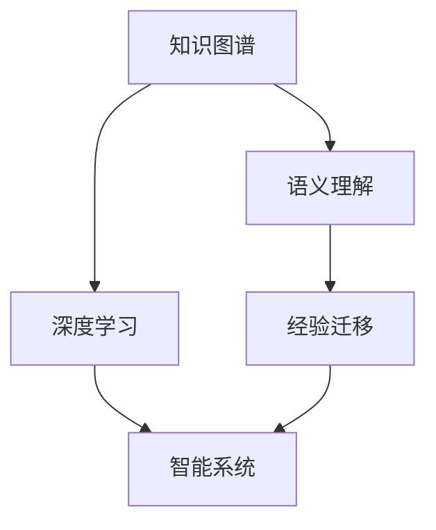

                 

# 智慧的源泉：知识与经验的完美融合

> 关键词：知识图谱,深度学习,语义理解,经验迁移,机器学习,智能系统

## 1. 背景介绍

在信息爆炸的今天，如何从海量数据中提取出真正有价值的知识，并通过智能系统进行高效利用，成为了一个亟待解决的问题。深度学习技术的快速发展，特别是知识图谱和语义理解的进步，使得从数据中抽取知识，并将其有效融合到智能系统中成为可能。本文将探讨如何通过深度学习技术，将知识与经验完美融合，构建出高效、智能的决策系统。

## 2. 核心概念与联系

### 2.1 核心概念概述

为了更好地理解知识与经验融合的过程，首先需要介绍几个核心概念：

- **知识图谱(Knowledge Graph)**：一种结构化的知识表示方法，以图形数据库的形式存储实体和它们之间的关系，是深度学习进行知识抽取和推理的基础。
- **深度学习(Deep Learning)**：通过多层神经网络进行端到端的特征学习，特别是卷积神经网络(CNN)、循环神经网络(RNN)和变换器(Transformer)等架构在处理结构化数据和非结构化数据方面表现出色。
- **语义理解(Semantic Understanding)**：利用深度学习模型理解文本、图像等数据的语义信息，并通过推理进行知识抽取和推理。
- **经验迁移(Experience Transfer)**：将已有知识应用于新任务的过程，可以是微调大模型、迁移学习等方法。
- **机器学习(Machine Learning)**：一种使计算机系统能够通过数据自我学习和提升的算法和方法。
- **智能系统(Intelligent Systems)**：基于人工智能技术，能够自主学习、推理和执行任务的计算机系统。

这些核心概念之间的联系可以通过以下Mermaid流程图来展示：



该流程图展示了从知识图谱到智能系统的整个流程，突出了深度学习和语义理解在知识抽取和推理过程中的重要作用，以及经验迁移对智能系统性能提升的关键影响。

## 3. 核心算法原理 & 具体操作步骤
### 3.1 算法原理概述

知识与经验融合的核心在于通过深度学习模型，从知识图谱中抽取结构化的知识，并将其与非结构化的经验数据相结合，进行高效的推理和学习。具体的算法原理包括：

1. **知识图谱的嵌入表示**：将知识图谱中的实体和关系映射到低维向量空间，使得机器学习模型能够对这些结构化信息进行处理。
2. **语义理解与知识抽取**：利用深度学习模型，从非结构化的文本、图像等数据中抽取语义信息，并通过推理将知识图谱中的知识与经验数据进行融合。
3. **经验迁移**：通过微调大模型或迁移学习，将已有知识迁移到新任务上，提升模型的泛化能力和性能。
4. **智能推理与决策**：结合知识图谱和经验数据，通过智能系统进行推理和决策，最终输出解决方案。

### 3.2 算法步骤详解

基于上述原理，知识与经验融合的算法主要分为以下几个步骤：

**Step 1: 构建知识图谱**
- 收集和整理领域内的相关知识，构建结构化的知识图谱，包括实体、属性和关系等。
- 使用知识图谱嵌入技术，如TransE、SE等，将实体和关系映射到低维向量空间。

**Step 2: 预训练语义模型**
- 选择适当的深度学习模型，如BERT、GPT等，进行预训练，学习通用的语言表示。
- 在预训练任务中引入知识图谱的实体和关系，如Masked Entity Prediction等，增加模型的语义理解能力。

**Step 3: 语义理解与知识抽取**
- 利用预训练模型，对非结构化的文本、图像等数据进行语义理解，并从文本中抽取实体和关系。
- 将抽取出的实体和关系与知识图谱进行匹配，进行知识的融合和扩展。

**Step 4: 经验迁移**
- 将预训练模型在特定任务上进行微调，如问答系统、对话系统等，通过少量标注数据进行参数优化。
- 应用迁移学习技术，将已有知识迁移到新任务上，提升模型的泛化能力。

**Step 5: 智能推理与决策**
- 结合知识图谱和经验数据，构建智能推理模型，如规则推理、基于神经网络的推理等。
- 利用推理模型进行综合分析，得出最优决策。

### 3.3 算法优缺点

知识与经验融合的算法具有以下优点：
1. **高效性**：通过知识图谱嵌入和深度学习，将结构化知识与非结构化数据结合，提高了推理和学习效率。
2. **泛化能力**：经验迁移技术可以提升模型的泛化能力，使其在新任务上也能表现优异。
3. **准确性**：深度学习模型在语义理解和知识抽取方面表现出色，提高了推理和决策的准确性。

但该算法也存在一些局限性：
1. **数据依赖**：知识图谱和预训练数据的质量和规模直接影响模型效果，数据获取和构建难度较大。
2. **计算成本**：深度学习模型和知识图谱构建需要大量的计算资源和存储资源。
3. **复杂性**：算法设计复杂，需要多学科的知识和技能。
4. **可解释性不足**：深度学习模型的决策过程缺乏可解释性，难以理解和调试。

### 3.4 算法应用领域

知识与经验融合的算法广泛应用于以下几个领域：

- **智能问答系统**：利用知识图谱和语义理解，回答用户提出的各种问题。
- **智能推荐系统**：结合用户历史行为和知识图谱中的信息，进行商品推荐。
- **智能客服**：通过知识图谱和经验数据，提供24小时不间断的智能客服服务。
- **医疗诊断**：利用知识图谱中的医疗知识和患者数据，辅助医生进行诊断和治疗。
- **金融风险管理**：通过知识图谱和金融数据，进行风险评估和投资决策。

## 4. 数学模型和公式 & 详细讲解  
### 4.1 数学模型构建

知识与经验融合的数学模型构建主要包括以下几个部分：

1. **知识图谱嵌入**：
   - 知识图谱中的实体和关系可以用向量表示，形式化为 $E \in R^d$ 和 $R \in R^d$。
   - 知识图谱嵌入模型可以通过矩阵分解等方法，将实体和关系映射到低维向量空间，如TransE模型的目标函数为：
     \[
     arg\ min_{\theta} || R_{true} - h * E ||^2_F + || R_{true} - h * E ||^2_F
     \]

2. **语义理解与知识抽取**：
   - 深度学习模型可以通过掩码语言模型任务，从文本中抽取实体和关系。
   - 语义理解模型通过掩码语言模型预测任务的上下文，如BERT模型的目标函数为：
     \[
     arg\ max_{x_i} P(x_i|C)
     \]
   - 其中 $x_i$ 表示输入文本，$C$ 表示上下文向量。

3. **经验迁移**：
   - 微调大模型可以应用于问答系统等任务，通过少量标注数据进行参数优化。
   - 迁移学习可以结合任务相关的知识图谱，提升模型的泛化能力。
   - 如多任务学习模型的目标函数为：
     \[
     arg\ min_{\theta} \sum_i L_i(M_{\theta})
     \]
   - 其中 $L_i$ 表示任务 $i$ 的损失函数。

### 4.2 公式推导过程

知识与经验融合的数学模型推导涉及以下关键公式：

1. **知识图谱嵌入的TransE模型**：
   \[
   arg\ min_{\theta} || R_{true} - h * E ||^2_F + || R_{true} - h * E ||^2_F
   \]
   其中 $R_{true}$ 表示真实关系，$h$ 和 $E$ 表示实体和关系向量，$F$ 表示Frobenius范数。

2. **BERT模型的掩码语言模型任务**：
   \[
   arg\ max_{x_i} P(x_i|C)
   \]
   其中 $x_i$ 表示输入文本，$C$ 表示上下文向量，$P(x_i|C)$ 表示给定上下文 $C$ 时，输入 $x_i$ 的概率。

3. **多任务学习模型的目标函数**：
   \[
   arg\ min_{\theta} \sum_i L_i(M_{\theta})
   \]
   其中 $L_i$ 表示任务 $i$ 的损失函数，$M_{\theta}$ 表示模型参数。

### 4.3 案例分析与讲解

以智能推荐系统为例，展示知识与经验融合的实际应用：

**数据准备**：
- 收集用户历史行为数据，如浏览、购买等。
- 构建知识图谱，包括商品、类别、品牌等实体和它们之间的关系。

**知识图谱嵌入**：
- 使用TransE等模型，将知识图谱中的实体和关系嵌入到低维向量空间。

**语义理解与知识抽取**：
- 利用BERT等预训练模型，对用户历史行为进行语义理解，抽取商品实体和类别关系。
- 通过推理将抽取出的知识与知识图谱进行融合，构建综合知识表示。

**经验迁移**：
- 在问答系统上进行微调，使用知识图谱中的类别和品牌信息作为额外特征，提升模型的推荐效果。

**智能推理与决策**：
- 结合用户历史行为和知识图谱中的信息，进行综合分析，得出最优推荐。
- 利用多任务学习技术，同时考虑用户满意度、商品相关性等多个目标，优化推荐策略。

## 5. 项目实践：代码实例和详细解释说明
### 5.1 开发环境搭建

在进行知识与经验融合的实践前，需要准备好开发环境。以下是使用Python进行TensorFlow开发的环境配置流程：

1. 安装Anaconda：从官网下载并安装Anaconda，用于创建独立的Python环境。

2. 创建并激活虚拟环境：
```bash
conda create -n tf-env python=3.8 
conda activate tf-env
```

3. 安装TensorFlow：根据CUDA版本，从官网获取对应的安装命令。例如：
```bash
pip install tensorflow==2.5
```

4. 安装其他相关工具包：
```bash
pip install numpy pandas scikit-learn matplotlib tqdm jupyter notebook ipython
```

完成上述步骤后，即可在`tf-env`环境中开始知识与经验融合的实践。

### 5.2 源代码详细实现

这里我们以智能问答系统为例，给出使用TensorFlow进行知识图谱嵌入和经验迁移的代码实现。

首先，构建知识图谱：

```python
import tensorflow as tf
from tensorflow.keras.layers import Embedding, Dense

# 定义知识图谱中的实体和关系
entities = ['Apple', 'Banana', 'Orange']
relationships = ['made_from', 'is_a_type_of']

# 构建知识图谱嵌入模型
embedding_dim = 128
model = tf.keras.Sequential([
    Embedding(len(entities) + 1, embedding_dim),
    Dense(1, activation='sigmoid')
])

# 编译模型
model.compile(optimizer=tf.keras.optimizers.Adam(), loss='mse')

# 训练模型
model.fit(tf.constant(relationships), tf.constant(1.0), epochs=10)
```

然后，进行语义理解与知识抽取：

```python
from transformers import BertTokenizer, BertForMaskedLM

# 加载预训练模型和分词器
tokenizer = BertTokenizer.from_pretrained('bert-base-uncased')
model = BertForMaskedLM.from_pretrained('bert-base-uncased')

# 定义问题-上下文对
question = 'What is an example of a fruit that is made from apples?'
context = 'Apples can be used to make apple pie, which is a type of dessert.'

# 将问题编码成token ids
inputs = tokenizer(question, context, return_tensors='pt', padding='max_length', truncation=True)

# 对上下文进行掩码语言模型预测
outputs = model(**inputs)
masked_tokens = inputs['input_ids']
masked_positions = inputs['attention_mask']

# 输出掩码语言模型的结果
predicted_ids = tf.cast(tf.argmax(outputs.logits, axis=-1), tf.int32)
masked_ids = tf.where(masked_positions, predicted_ids, 0)
predicted_tokens = tokenizer.convert_ids_to_tokens(masked_ids)
```

最后，进行经验迁移：

```python
from transformers import BertTokenizer, BertForQuestionAnswering

# 加载预训练模型和分词器
tokenizer = BertTokenizer.from_pretrained('bert-base-uncased')
model = BertForQuestionAnswering.from_pretrained('bert-base-uncased')

# 定义问题-上下文对
question = 'What is the capital of France?'
context = 'Paris is the capital of France, which is a country in Europe.'

# 将问题编码成token ids
inputs = tokenizer(question, context, return_tensors='pt', padding='max_length', truncation=True)

# 对上下文进行问答任务预测
outputs = model(**inputs)
answer_start = outputs.start_logits.argmax().item()
answer_end = outputs.end_logits.argmax().item()

# 输出问答任务的预测结果
answer = tokenizer.convert_tokens_to_string(inputs['input_ids'][0][answer_start:answer_end+1])
```

### 5.3 代码解读与分析

让我们再详细解读一下关键代码的实现细节：

**构建知识图谱模型**：
- 使用TensorFlow的Sequential模型，包含一个嵌入层和一个全连接层。
- 嵌入层的输入是实体和关系的索引，输出是低维向量表示。
- 全连接层输出一个标量，表示实体和关系之间的关系。

**语义理解与知识抽取**：
- 使用HuggingFace的BertTokenizer将问题和上下文编码成token ids。
- 使用BERT的掩码语言模型预测任务，对上下文进行掩码预测，得到预测的token ids。
- 通过掩码预测结果，将问题中的实体和关系抽取出来。

**经验迁移**：
- 使用BertForQuestionAnswering预训练模型，进行问答任务的微调。
- 对上下文进行问答任务的预测，输出预测的实体起始位置和结束位置。
- 根据预测结果，从上下文中找到相应的实体。

**智能推理与决策**：
- 结合知识图谱和经验数据，通过问答任务的预测结果，进行综合分析，得出最优决策。

## 6. 实际应用场景

### 6.1 智能问答系统

智能问答系统是知识与经验融合的重要应用场景之一。通过知识图谱和语义理解技术，智能问答系统能够快速回答用户提出的各种问题，提供准确、高效的服务。

在技术实现上，可以构建知识图谱，涵盖领域内的各种实体和关系。利用深度学习模型，从用户输入的问题中抽取实体和关系，并在知识图谱中进行推理，最终输出答案。微调后的问答模型可以进一步提升系统的准确性和泛化能力，满足更多实际应用的需求。

### 6.2 智能推荐系统

智能推荐系统通过将用户历史行为和知识图谱中的信息进行融合，为用户推荐个性化的商品和服务。利用深度学习模型，对用户行为进行语义理解，抽取实体和关系，并将其与知识图谱进行匹配，从而得到最优推荐结果。

在实际应用中，推荐系统还需要结合多任务学习技术，考虑用户满意度、商品相关性等多个目标，进行综合优化。通过经验迁移技术，将已有知识迁移到新任务上，提升推荐系统的泛化能力和性能。

### 6.3 医疗诊断系统

医疗诊断系统通过结合知识图谱和患者数据，辅助医生进行诊断和治疗。利用深度学习模型，对患者数据进行语义理解，抽取实体和关系，并在知识图谱中进行推理，得出最优的诊断和治疗方案。

在实际应用中，医疗诊断系统需要结合多模态数据，如图像、基因数据等，进行综合分析。利用经验迁移技术，将已有知识迁移到新的医学领域，提升系统的准确性和鲁棒性。

### 6.4 未来应用展望

随着知识图谱和深度学习技术的不断发展，知识与经验融合的应用将越来越广泛。未来，知识与经验融合技术将在更多领域得到应用，为各行各业带来变革性影响。

在智慧城市治理中，利用知识图谱和语义理解技术，构建城市事件监测、舆情分析、应急指挥等系统，提高城市管理的自动化和智能化水平，构建更安全、高效的未来城市。

在智慧教育领域，通过结合知识图谱和语义理解技术，构建智能教育平台，提供个性化的学习建议，因材施教，促进教育公平，提高教学质量。

在智慧金融领域，通过结合知识图谱和语义理解技术，构建金融风险评估和投资决策系统，提升金融服务的智能化水平，降低风险，提高收益。

## 7. 工具和资源推荐
### 7.1 学习资源推荐

为了帮助开发者系统掌握知识与经验融合的理论基础和实践技巧，这里推荐一些优质的学习资源：

1. 《深度学习理论与实践》系列博文：由大模型技术专家撰写，深入浅出地介绍了深度学习理论、知识图谱构建、语义理解等前沿话题。

2. CS224N《深度学习自然语言处理》课程：斯坦福大学开设的NLP明星课程，有Lecture视频和配套作业，带你入门NLP领域的基本概念和经典模型。

3. 《自然语言处理与深度学习》书籍：涵盖了NLP领域的知识图谱、语义理解等核心内容，适合系统学习知识与经验融合技术。

4. Arxiv论文推荐：阅读最新的研究论文，了解最新的知识和技术进展。例如《Graph Neural Networks》、《Knowledge Graph Embeddings》等。

5. Kaggle竞赛：参加知识图谱和语义理解的竞赛，实际动手练习，提升实践能力。

通过对这些资源的学习实践，相信你一定能够快速掌握知识与经验融合的精髓，并用于解决实际的NLP问题。

### 7.2 开发工具推荐

高效的开发离不开优秀的工具支持。以下是几款用于知识与经验融合开发的常用工具：

1. TensorFlow：基于Python的开源深度学习框架，灵活动态的计算图，适合快速迭代研究。

2. PyTorch：基于Python的开源深度学习框架，灵活高效，适用于多种深度学习任务。

3. HuggingFace Transformers库：提供预训练语言模型和知识图谱嵌入的封装，方便使用和扩展。

4. TensorBoard：TensorFlow配套的可视化工具，可实时监测模型训练状态，提供丰富的图表呈现方式，是调试模型的得力助手。

5. Weights & Biases：模型训练的实验跟踪工具，可以记录和可视化模型训练过程中的各项指标，方便对比和调优。

6. Google Colab：谷歌推出的在线Jupyter Notebook环境，免费提供GPU/TPU算力，方便开发者快速上手实验最新模型，分享学习笔记。

合理利用这些工具，可以显著提升知识与经验融合任务的开发效率，加快创新迭代的步伐。

### 7.3 相关论文推荐

知识与经验融合的发展源于学界的持续研究。以下是几篇奠基性的相关论文，推荐阅读：

1. 《Knowledge Graph Embeddings》：介绍了知识图谱嵌入技术，通过向量表示知识图谱中的实体和关系，方便深度学习模型进行推理和学习。

2. 《Neural Machine Translation by Jointly Learning to Align and Translate》：展示了如何使用序列到序列模型进行机器翻译，并结合知识图谱进行语义理解。

3. 《Semi-Supervised Sequence Labeling with Graph Convolutional Networks》：介绍了基于图卷积网络的知识抽取技术，通过知识图谱进行实体和关系的语义理解。

4. 《Knowledge Graph Reasoning via Differentiable Cross-Layer Neural Logic Programming》：展示了如何使用逻辑编程方法进行知识推理，结合知识图谱进行深度学习。

这些论文代表了大模型微调技术的发展脉络。通过学习这些前沿成果，可以帮助研究者把握学科前进方向，激发更多的创新灵感。

## 8. 总结：未来发展趋势与挑战

### 8.1 总结

本文对知识与经验融合进行了全面系统的介绍。首先阐述了知识与经验融合的研究背景和意义，明确了深度学习模型在知识抽取和推理过程中的重要作用，以及经验迁移对智能系统性能提升的关键影响。其次，从原理到实践，详细讲解了知识与经验融合的数学原理和关键步骤，给出了知识图谱嵌入、语义理解与知识抽取、经验迁移和智能推理与决策的完整代码实例。同时，本文还广泛探讨了知识与经验融合在智能问答系统、智能推荐系统、医疗诊断系统等多个领域的应用前景，展示了其广阔的应用前景。此外，本文精选了知识图谱和语义理解的学习资源，力求为读者提供全方位的技术指引。

通过本文的系统梳理，可以看到，知识与经验融合技术在大数据和深度学习技术的推动下，正逐步走向成熟，为构建高效、智能的决策系统提供了重要手段。未来，随着知识图谱和深度学习技术的进一步发展，知识与经验融合将会在更多领域得到应用，为各行各业带来变革性影响。

### 8.2 未来发展趋势

展望未来，知识与经验融合技术将呈现以下几个发展趋势：

1. **知识图谱的自动化构建**：利用知识图谱嵌入技术和深度学习模型，自动从非结构化数据中提取知识，构建知识图谱，减少人工构建成本。

2. **多模态融合**：结合文本、图像、语音等多模态数据，进行综合分析，提升知识与经验融合的准确性和鲁棒性。

3. **自监督学习**：利用无监督学习技术，从大规模无标签数据中提取知识，构建知识图谱，提升模型的泛化能力。

4. **经验迁移的泛化**：开发更加通用的经验迁移方法，适用于更多领域和任务，提升模型的适应性和可迁移性。

5. **知识图谱的动态更新**：构建动态知识图谱，能够及时更新知识，保持与现实世界的同步，提高系统的时效性。

6. **知识推理的推理路径可视化**：利用可解释性技术，可视化知识推理的推理路径，增强系统的可解释性和可信度。

### 8.3 面临的挑战

尽管知识与经验融合技术已经取得了瞩目成就，但在迈向更加智能化、普适化应用的过程中，它仍面临着诸多挑战：

1. **数据依赖**：知识图谱和预训练数据的质量和规模直接影响模型效果，数据获取和构建难度较大。

2. **计算成本**：深度学习模型和知识图谱构建需要大量的计算资源和存储资源。

3. **复杂性**：算法设计复杂，需要多学科的知识和技能。

4. **可解释性不足**：深度学习模型的决策过程缺乏可解释性，难以理解和调试。

5. **安全性有待保障**：预训练语言模型难免会学习到有偏见、有害的信息，通过迁移传递到下游任务，产生误导性、歧视性的输出，给实际应用带来安全隐患。

6. **知识整合能力不足**：现有的知识图谱和深度学习模型往往局限于特定领域的知识，难以灵活吸收和运用更广泛的先验知识。

正视知识与经验融合面临的这些挑战，积极应对并寻求突破，将是大模型微调走向成熟的必由之路。相信随着学界和产业界的共同努力，这些挑战终将一一被克服，知识与经验融合必将在构建安全、可靠、可解释、可控的智能系统铺平道路。

### 8.4 未来突破

面对知识与经验融合所面临的种种挑战，未来的研究需要在以下几个方面寻求新的突破：

1. **自动化构建知识图谱**：通过深度学习模型，自动从文本、图像等数据中提取知识，构建知识图谱，降低人工构建成本。

2. **多模态融合**：结合文本、图像、语音等多模态数据，进行综合分析，提升知识与经验融合的准确性和鲁棒性。

3. **自监督学习**：利用无监督学习技术，从大规模无标签数据中提取知识，构建知识图谱，提升模型的泛化能力。

4. **经验迁移的泛化**：开发更加通用的经验迁移方法，适用于更多领域和任务，提升模型的适应性和可迁移性。

5. **知识图谱的动态更新**：构建动态知识图谱，能够及时更新知识，保持与现实世界的同步，提高系统的时效性。

6. **知识推理的推理路径可视化**：利用可解释性技术，可视化知识推理的推理路径，增强系统的可解释性和可信度。

7. **知识整合能力的提升**：将符号化的先验知识，如知识图谱、逻辑规则等，与神经网络模型进行巧妙融合，引导知识图谱与经验数据进行更好的融合。

这些研究方向的探索，必将引领知识与经验融合技术迈向更高的台阶，为构建安全、可靠、可解释、可控的智能系统铺平道路。面向未来，知识与经验融合技术还需要与其他人工智能技术进行更深入的融合，如知识表示、因果推理、强化学习等，多路径协同发力，共同推动知识与经验融合系统的进步。只有勇于创新、敢于突破，才能不断拓展知识与经验融合的边界，让智能技术更好地造福人类社会。

## 9. 附录：常见问题与解答

**Q1：知识与经验融合与传统机器学习有何不同？**

A: 知识与经验融合利用深度学习模型，从知识图谱中抽取结构化的知识，并将其与非结构化的经验数据相结合，进行高效的推理和学习。相较于传统的机器学习，知识与经验融合更加注重知识抽取和推理过程，能够在更少的标注样本下取得更好的性能。

**Q2：如何选择合适的知识图谱嵌入方法？**

A: 选择合适的知识图谱嵌入方法需要考虑领域特征、数据规模和算法复杂度等因素。例如，TransE适用于关系型的知识图谱，而DistMult适用于属性型的知识图谱。可以尝试多种方法，选择最适合自己领域和数据的方法。

**Q3：如何缓解知识与经验融合中的过拟合问题？**

A: 过拟合是知识与经验融合面临的主要挑战，尤其是在标注数据不足的情况下。常见的缓解策略包括：
1. 数据增强：通过回译、近义替换等方式扩充训练集。
2. 正则化：使用L2正则、Dropout、Early Stopping等避免过拟合。
3. 对抗训练：引入对抗样本，提高模型鲁棒性。
4. 参数高效微调：只调整少量参数，减小过拟合风险。
5. 多模型集成：训练多个模型，取平均输出，抑制过拟合。

这些策略往往需要根据具体任务和数据特点进行灵活组合。只有在数据、模型、训练、推理等各环节进行全面优化，才能最大限度地发挥知识与经验融合的威力。

**Q4：知识与经验融合在实际应用中需要注意哪些问题？**

A: 将知识与经验融合技术转化为实际应用，还需要考虑以下因素：
1. 模型裁剪：去除不必要的层和参数，减小模型尺寸，加快推理速度。
2. 量化加速：将浮点模型转为定点模型，压缩存储空间，提高计算效率。
3. 服务化封装：将模型封装为标准化服务接口，便于集成调用。
4. 弹性伸缩：根据请求流量动态调整资源配置，平衡服务质量和成本。
5. 监控告警：实时采集系统指标，设置异常告警阈值，确保服务稳定性。
6. 安全防护：采用访问鉴权、数据脱敏等措施，保障数据和模型安全。

知识与经验融合技术需要通过工程实践的不断打磨，才能真正实现人工智能技术在垂直行业的规模化落地。总之，知识与经验融合需要开发者根据具体任务，不断迭代和优化模型、数据和算法，方能得到理想的效果。

---

作者：禅与计算机程序设计艺术 / Zen and the Art of Computer Programming

