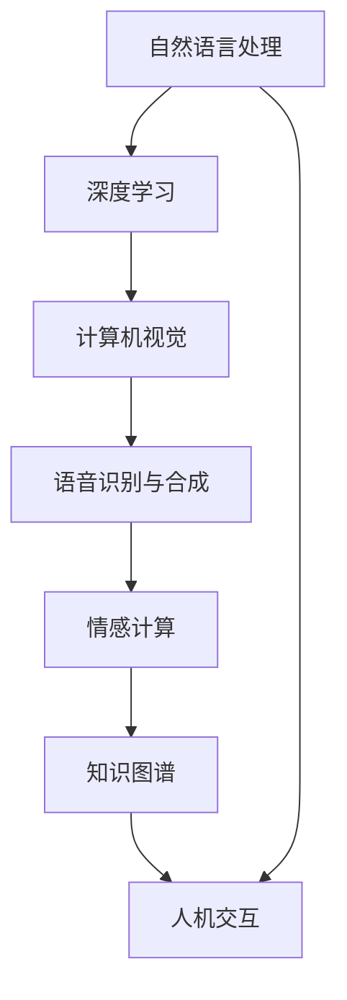

                 

# 智能宠物情感陪护创业：AI驱动的宠物心理关怀

## 1. 背景介绍

### 1.1 问题由来
随着人们生活水平的提高，宠物已经成为了许多家庭的成员。养宠物不仅能带来欢乐和陪伴，还能对心理健康产生积极影响。然而，随着时间推移，不少宠物主人都面临了宠物“孤独症”的困扰：长时间的独守空房，缺乏人情的陪伴，让宠物的生理和心理健康都受到了影响。

### 1.2 问题核心关键点
如何通过科技手段，为宠物提供更好的心理关怀和陪伴，成为当下宠物主人的迫切需求。基于深度学习和自然语言处理技术的智能宠物情感陪护系统，可以实时监控宠物的状态，通过智能对话和互动，减轻宠物的孤独感，改善宠物的生理和心理健康。

### 1.3 问题研究意义
智能宠物情感陪护系统通过AI技术为宠物提供陪伴和关怀，有助于提升宠物的生活质量，促进宠物主人的心理健康。同时，这也为宠物行业提供了全新的技术解决方案，推动宠物经济向智能化、个性化、定制化发展。

## 2. 核心概念与联系

### 2.1 核心概念概述

智能宠物情感陪护系统将AI技术引入宠物陪伴和心理关怀，以实现对宠物的实时监控、情感交互、行为分析和健康评估。其中涉及的核心概念包括：

- 自然语言处理(NLP)：通过对宠物与主人的对话内容进行情感分析和行为理解，生成合适的回应。
- 深度学习(DL)：使用深度神经网络对宠物行为进行模式识别和预测，生成动态反馈和建议。
- 计算机视觉(CV)：利用摄像头捕捉宠物的姿态、面部表情和行为，实时评估其生理状态。
- 语音识别与合成(SAS)：对宠物的叫声和主人的语音进行识别与合成，实现人机交互。
- 情感计算(EC)：分析宠物与主人的对话情感，判断宠物的情绪状态，提供相应的陪伴建议。
- 知识图谱(KG)：构建宠物相关的知识库，辅助系统进行推理和决策。
- 人机交互(HCI)：优化用户界面和交互体验，提升用户的使用舒适度和满意度。

这些概念共同构成了智能宠物情感陪护系统的技术框架，通过智能算法和设备的综合运用，为宠物提供全方位的关怀服务。

### 2.2 核心概念原理和架构的 Mermaid 流程图(Mermaid 流程节点中不要有括号、逗号等特殊字符)


## 3. 核心算法原理 & 具体操作步骤

### 3.1 算法原理概述

智能宠物情感陪护系统通过深度学习和自然语言处理技术，实现对宠物状态的实时监控和情感交互。系统主要由以下三个部分组成：

- **行为分析模块**：使用深度神经网络对摄像头捕捉到的宠物行为进行实时识别和分类，生成行为特征向量。
- **情感分析模块**：通过NLP技术对宠物与主人的对话进行情感分析和意图识别，生成情感状态标签。
- **反馈生成模块**：根据行为和情感状态标签，利用知识图谱进行推理和决策，生成适合宠物的陪伴建议和行为反馈。

### 3.2 算法步骤详解

#### 步骤1：数据采集和预处理
- 使用摄像头、麦克风等设备采集宠物与主人的交互数据。
- 对视频、音频进行预处理，去除噪声，提取关键特征。

#### 步骤2：模型训练
- 使用行为和情感标签数据集训练行为识别和情感分析模型。
- 使用知识图谱作为先验知识，辅助模型推理决策。

#### 步骤3：实时交互
- 对实时采集的视频、音频数据进行预处理和特征提取。
- 利用训练好的模型，对行为和情感进行实时识别和分析。
- 根据分析结果，生成适合宠物的陪伴建议和行为反馈。

#### 步骤4：用户交互
- 将生成的内容通过语音合成器合成，输出到智能音箱或移动设备。
- 用户可以通过语音交互，进一步定制反馈内容和模式。

#### 步骤5：系统反馈
- 根据用户反馈，调整模型的参数和行为策略。
- 不断迭代优化，提升系统的准确性和个性化程度。

### 3.3 算法优缺点

智能宠物情感陪护系统的优点在于：
- 实时性强：能够实时监控和互动，及时响应宠物的情感需求。
- 多模态融合：综合利用摄像头、麦克风、传感器等设备的数据，全面了解宠物状态。
- 个性化服务：根据宠物的特征和行为，生成定制化的陪伴建议。
- 便捷易用：用户界面友好，操作简单，易于上手。

然而，该系统也存在一些不足之处：
- 数据依赖：需要大量的高质标注数据来训练模型，标注成本较高。
- 隐私问题：实时监控涉及宠物隐私保护，需要合法合规的使用。
- 资源消耗：大规模深度学习模型的推理和训练需要较高的计算资源。
- 环境适应：系统对环境噪声和光照变化敏感，需要优化算法应对。

### 3.4 算法应用领域

智能宠物情感陪护系统主要应用于以下几个领域：
- **宠物陪伴和监控**：实时监控宠物状态，提供语音和行为反馈，减少宠物孤独感。
- **宠物健康管理**：通过分析宠物行为和生理数据，预警异常情况，提供健康管理建议。
- **宠物行为训练**：利用自然语言处理技术，引导宠物完成训练任务，提升训练效果。
- **宠物心理治疗**：对宠物进行情感分析和行为干预，辅助心理治疗，改善心理状态。
- **宠物市场服务**：为宠物店、宠物医院、宠物租赁等提供智能服务，提升用户体验。

## 4. 数学模型和公式 & 详细讲解 & 举例说明

### 4.1 数学模型构建

智能宠物情感陪护系统涉及多个领域的数学模型，以下以情感分析模块为例，展示其中的数学模型构建。

假设情感分析模型输入为文本序列 $x=\{x_1, x_2, ..., x_n\}$，其中每个文本元素 $x_i$ 表示一个词向量或短句，情感分析模型输出为情感标签 $y \in \{0,1\}$，0表示中性情感，1表示积极情感。

### 4.2 公式推导过程

情感分析模型的主要任务是对输入文本进行情感分类。其中常用的方法包括：

- **卷积神经网络(CNN)**：通过卷积层提取文本特征，利用池化层进行特征融合，最终通过全连接层输出情感标签。
- **长短时记忆网络(LSTM)**：利用LSTM对文本序列进行时序建模，提取长期依赖关系，再通过输出层预测情感标签。
- **双向长短时记忆网络(BLSTM)**：利用双向LSTM捕捉文本序列的正反时序信息，提升情感分类的准确性。

以CNN为例，情感分析模型的公式推导如下：

$$
h_i = \sigma(W*x_i + b)
$$

$$
f_i = \max(h_i)
$$

$$
y = \sigma(W*y + b)
$$

其中，$h_i$ 为卷积层的输出特征，$f_i$ 为池化层的输出特征，$y$ 为情感分类结果。

### 4.3 案例分析与讲解

以一句话“好开心！”为例，情感分析模型首先将其转换为词向量序列，输入到CNN模型中进行卷积和池化操作，生成特征向量 $h$。然后利用softmax函数将特征向量映射到情感标签概率分布上，输出情感标签为1，表示积极情感。

## 5. 项目实践：代码实例和详细解释说明

### 5.1 开发环境搭建

智能宠物情感陪护系统的开发环境搭建包括：
- **Python**：作为主要编程语言。
- **TensorFlow**：深度学习框架，用于训练模型。
- **NLTK**：自然语言处理库，用于处理文本数据。
- **OpenCV**：计算机视觉库，用于处理摄像头数据。
- **PyAudio**：音频处理库，用于处理麦克风数据。

安装命令：
```bash
pip install tensorflow nltk opencv pyaudio
```

### 5.2 源代码详细实现

以下是情感分析模块的Python代码实现：

```python
import tensorflow as tf
from tensorflow.keras.layers import Conv1D, MaxPooling1D, Dense, Dropout
from tensorflow.keras.models import Sequential

def build_model(vocab_size, embedding_dim, hidden_dim):
    model = Sequential()
    model.add(Embedding(vocab_size, embedding_dim))
    model.add(Conv1D(hidden_dim, 5, activation='relu'))
    model.add(MaxPooling1D(pool_size=4))
    model.add(Dropout(0.5))
    model.add(Dense(1, activation='sigmoid'))
    model.compile(loss='binary_crossentropy', optimizer='adam', metrics=['accuracy'])
    return model
```

该代码实现了基于CNN的情感分析模型。其中，`Embedding`层将词向量序列转换为模型可以处理的张量，`Conv1D`层和`MaxPooling1D`层用于提取文本特征，`Dense`层用于输出情感标签。

### 5.3 代码解读与分析

代码中，`Embedding`层将词向量序列转换为模型可以处理的张量，`Conv1D`层和`MaxPooling1D`层用于提取文本特征，`Dense`层用于输出情感标签。模型使用二分类交叉熵损失函数，通过Adam优化器进行训练。

## 6. 实际应用场景

### 6.1 智能宠物陪伴

智能宠物陪伴是智能宠物情感陪护系统的核心应用场景。通过实时监控和互动，系统可以识别宠物的情感状态，生成适合的陪伴建议和行为反馈，提升宠物的幸福感。例如，当宠物表现出孤独感时，系统会播放舒缓的音乐或与宠物对话，减轻其孤独情绪。

### 6.2 宠物健康管理

宠物健康管理是智能宠物情感陪护系统的另一重要应用。系统通过分析宠物的行为和生理数据，可以预警异常情况，提供健康管理建议。例如，当宠物长时间不活动时，系统会提醒主人注意宠物健康状况，必要时预约兽医进行检查。

### 6.3 宠物行为训练

智能宠物情感陪护系统还可以辅助宠物行为训练。通过自然语言处理技术，系统可以引导宠物完成训练任务，提升训练效果。例如，当主人训练宠物时，系统会提供相应的语音和行为指导，帮助宠物更好地完成任务。

### 6.4 宠物心理治疗

宠物心理治疗是智能宠物情感陪护系统的高级应用。系统通过情感分析和行为干预，可以辅助宠物进行心理治疗。例如，当宠物情绪低落时，系统会播放舒缓的音乐或进行心理对话，帮助宠物恢复情绪。

## 7. 工具和资源推荐

### 7.1 学习资源推荐

智能宠物情感陪护系统的开发涉及深度学习、自然语言处理、计算机视觉等多个领域，以下是相关学习资源推荐：

1. **深度学习课程**：包括斯坦福大学CS231n、Coursera上的深度学习课程等，涵盖深度学习的基本理论和实践技能。
2. **自然语言处理课程**：包括斯坦福大学CS224N、Coursera上的NLP课程等，涵盖自然语言处理的基本概念和常用模型。
3. **计算机视觉课程**：包括斯坦福大学CS231n、Coursera上的计算机视觉课程等，涵盖计算机视觉的基本理论和实践技能。
4. **情感计算课程**：包括MIT的情感计算课程，涵盖情感计算的基本概念和常用方法。
5. **知识图谱课程**：包括斯坦福大学Knowledge Graphs课程，涵盖知识图谱的基本概念和常用技术。

### 7.2 开发工具推荐

智能宠物情感陪护系统的开发涉及多个工具和库，以下是相关推荐：

1. **TensorFlow**：深度学习框架，提供高效的模型训练和推理功能。
2. **NLTK**：自然语言处理库，提供丰富的文本处理工具和算法。
3. **OpenCV**：计算机视觉库，提供高效的视频处理和分析功能。
4. **PyAudio**：音频处理库，提供高效的音频处理和分析功能。
5. **TensorBoard**：模型训练和推理的可视化工具，提供实时监控和调试功能。

### 7.3 相关论文推荐

智能宠物情感陪护系统涉及多个领域的理论和实践，以下是相关论文推荐：

1. **《深度学习在宠物行为分析中的应用》**：讨论了深度学习在宠物行为分析中的理论基础和实践应用。
2. **《情感计算在宠物陪伴中的应用》**：讨论了情感计算在宠物陪伴中的应用，提供了情感分析的算法和实践方法。
3. **《知识图谱在宠物健康管理中的应用》**：讨论了知识图谱在宠物健康管理中的应用，提供了知识推理和决策的方法。

## 8. 总结：未来发展趋势与挑战

### 8.1 研究成果总结

智能宠物情感陪护系统通过深度学习和自然语言处理技术，实现了对宠物的实时监控和情感交互。系统已经取得了初步的应用效果，提升了宠物的幸福感和健康水平，为宠物主人提供了便捷的服务。

### 8.2 未来发展趋势

智能宠物情感陪护系统在未来的发展中，将呈现以下几个趋势：

1. **多模态融合**：系统将进一步融合视觉、语音、传感器等多种数据源，提供更加全面和准确的情感分析。
2. **个性化服务**：系统将根据宠物的个性化特征，生成更加定制化的陪伴和健康管理方案。
3. **实时互动**：系统将进一步优化人机交互界面，提升用户体验，实现更加自然的互动。
4. **智能决策**：系统将利用知识图谱和多模态数据融合技术，提升决策的准确性和鲁棒性。

### 8.3 面临的挑战

智能宠物情感陪护系统在未来的发展中，仍面临一些挑战：

1. **数据隐私**：实时监控涉及宠物隐私保护，需要合法合规的使用。
2. **环境适应**：系统对环境噪声和光照变化敏感，需要优化算法应对。
3. **计算资源**：大规模深度学习模型的推理和训练需要较高的计算资源。
4. **模型鲁棒性**：系统需要在多变的环境下保持稳定性和鲁棒性。

### 8.4 研究展望

智能宠物情感陪护系统在未来的发展中，需要在以下方面进行进一步的研究：

1. **数据隐私保护**：开发隐私保护技术，确保宠物隐私安全。
2. **环境适应优化**：开发环境适应算法，提升系统鲁棒性。
3. **计算资源优化**：优化模型结构和算法，减少计算资源消耗。
4. **多模态融合**：进一步融合多种数据源，提供更加全面和准确的情感分析。
5. **个性化服务**：开发个性化推荐算法，提供更加定制化的服务。

总之，智能宠物情感陪护系统在未来的发展中，需要不断地优化算法和技术，提升系统的性能和用户体验，为宠物提供更加全面和便捷的陪伴和健康管理服务。

## 9. 附录：常见问题与解答

**Q1: 智能宠物情感陪护系统如何实时监控宠物的行为和情感？**

A: 系统通过摄像头、麦克风等设备采集宠物与主人的交互数据，然后利用深度学习和自然语言处理技术进行实时分析和处理。系统可以实时监控宠物的行为和情感状态，生成适合的陪伴建议和行为反馈。

**Q2: 智能宠物情感陪护系统如何使用知识图谱进行决策？**

A: 系统将构建宠物相关的知识图谱，用于辅助模型进行推理和决策。在生成陪伴建议和行为反馈时，系统会利用知识图谱进行推理和推理，以提供更加全面和准确的决策方案。

**Q3: 智能宠物情感陪护系统是否需要高质标注数据？**

A: 是的，智能宠物情感陪护系统的训练需要大量的高质标注数据。标注数据的质量和数量对系统的性能和准确性有直接影响，因此需要投入大量资源进行标注。

**Q4: 智能宠物情感陪护系统如何确保隐私保护？**

A: 系统在数据采集和存储过程中，将严格遵守相关法律法规，确保宠物隐私安全。系统将采用数据加密和匿名化等技术，确保数据在传输和存储过程中的安全。

**Q5: 智能宠物情感陪护系统如何优化算法和模型？**

A: 系统将不断优化算法和模型，以提升系统的性能和用户体验。例如，利用强化学习技术进行模型优化，或采用迁移学习技术进行模型迁移。

**Q6: 智能宠物情感陪护系统是否适合所有宠物？**

A: 智能宠物情感陪护系统适用于大部分宠物，但需要注意宠物的性格和行为特点，进行适当的调整和优化。例如，对于一些行为较为生动的宠物，系统需要更加灵敏和细致。

作者：禅与计算机程序设计艺术 / Zen and the Art of Computer Programming

