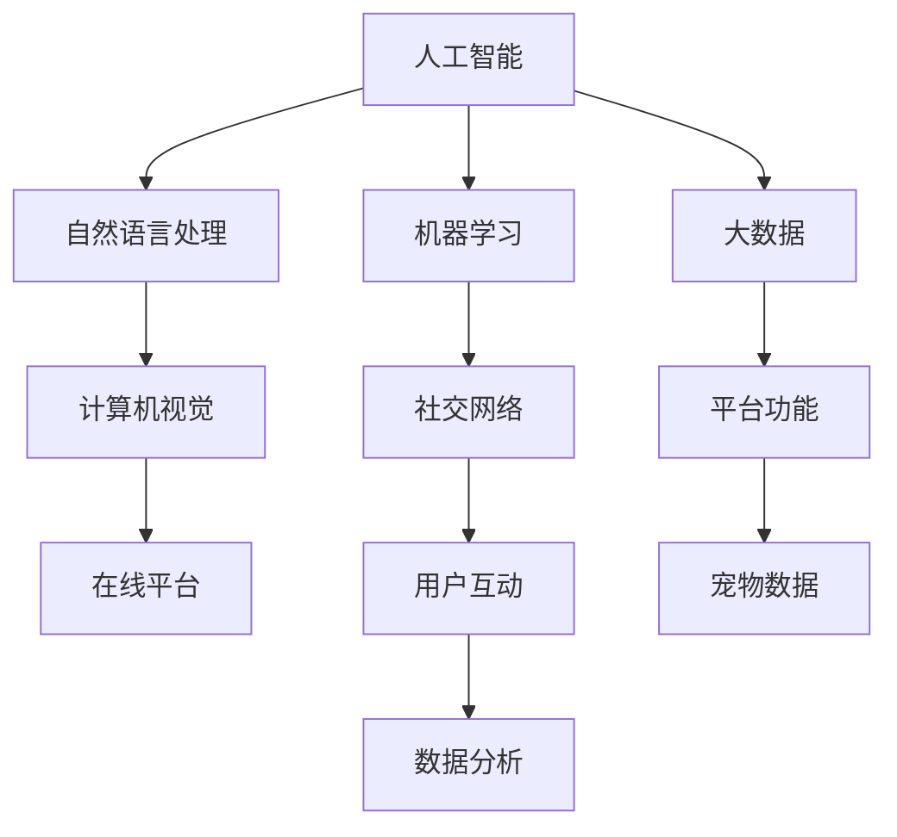

                 

# 智能宠物社交创业：宠物间的线上互动

> 关键词：人工智能,自然语言处理(NLP),计算机视觉,机器学习,社交网络,在线平台

## 1. 背景介绍

随着科技的发展和人们生活水平的提高，越来越多的人开始养宠物，宠物社交的需求日益增长。传统的宠物社交方式局限于线下，费时费力，难以满足宠物主人和宠物之间的情感互动需求。而通过智能宠物社交创业，利用AI技术搭建宠物社交平台，可以实现线上宠物间的互动，提供便捷、高效、安全的社交方式。

## 2. 核心概念与联系

### 2.1 核心概念概述

要构建一个成功的智能宠物社交平台，涉及多个核心概念，如下：

- **人工智能(AI)**：指利用计算机技术和算法，使计算机具备类似人类的智能行为，包括感知、理解、学习、推理、决策等。
- **自然语言处理(NLP)**：指让计算机理解、处理和生成自然语言的技术，包括语音识别、语义理解、机器翻译、文本生成等。
- **计算机视觉(CV)**：指让计算机"看到"并理解图像和视频中的内容的技术，包括物体检测、图像分类、视频分析等。
- **机器学习(ML)**：指通过数据和算法，让计算机自动学习，不断优化性能的技术，包括监督学习、无监督学习、强化学习等。
- **社交网络(SN)**：指通过计算机网络实现人与人或人与计算机之间的信息交流和互动，包括社交媒体、在线游戏、即时通讯等。
- **在线平台**：指通过互联网提供的在线服务，如电商、论坛、游戏、音乐、视频等。

这些核心概念通过合适的技术和算法，可以相互配合，构建出一个功能强大、用户友好的智能宠物社交平台。

### 2.2 核心概念原理和架构的 Mermaid 流程图



这个流程图展示了人工智能、自然语言处理、计算机视觉、机器学习、社交网络、在线平台等核心概念之间的联系与互动。每个节点代表一个关键概念，箭头表示概念之间的依赖关系和互动方式。

## 3. 核心算法原理 & 具体操作步骤

### 3.1 算法原理概述

智能宠物社交平台的构建基于以下核心算法原理：

- **NLP算法**：用于理解和处理宠物主人的指令，提供自然语言交互界面。
- **CV算法**：用于识别和分析宠物的图像和视频，识别宠物情绪、行为等。
- **ML算法**：用于训练和优化模型，实现高效的推荐和匹配。
- **社交网络算法**：用于构建和维护宠物之间的社交关系网络，提升互动质量和黏性。
- **大数据分析**：用于收集、存储和分析海量数据，提供精准的用户画像和行为预测。

这些算法通过协同工作，可以实现宠物社交平台的智能互动功能。

### 3.2 算法步骤详解

智能宠物社交平台的核心算法步骤如下：

**Step 1: 数据收集与预处理**
- 收集海量宠物图片、视频、主人评论等数据。
- 对数据进行清洗、标注、归一化等预处理，使其适合模型训练和推理。

**Step 2: 特征提取与模型训练**
- 使用计算机视觉技术，提取宠物图片和视频中的关键特征。
- 利用自然语言处理技术，处理和分析主人的指令和评论。
- 选择合适的机器学习算法，训练分类、推荐、匹配等模型。

**Step 3: 模型优化与调参**
- 使用交叉验证、网格搜索等技术，优化模型参数，提升模型性能。
- 对模型进行微调，使其适应特定的数据分布。

**Step 4: 用户交互与社交构建**
- 利用NLP技术，构建用户友好的自然语言交互界面。
- 通过计算机视觉技术，识别宠物情绪和行为，提供个性化推荐。
- 使用社交网络算法，构建宠物间的社交关系网络，提供互动功能。

**Step 5: 实时分析和反馈**
- 实时分析用户行为数据，提供行为预测和个性化推荐。
- 收集用户反馈，持续优化模型和平台功能。

**Step 6: 系统部署与维护**
- 将训练好的模型和平台部署到服务器，提供稳定的在线服务。
- 定期维护和更新模型和平台，保证服务质量。

### 3.3 算法优缺点

智能宠物社交平台的算法有如下优点：

- **高效性**：利用AI技术，可以快速处理海量数据，提供高效、快速的社交互动。
- **个性化推荐**：通过机器学习算法，提供个性化推荐，提升用户体验。
- **互动性强**：通过社交网络算法，构建宠物间的社交关系网络，增强互动性。

同时，算法也存在一些缺点：

- **复杂性**：涉及多个核心概念和技术，实现复杂度高。
- **数据隐私**：需要收集和处理大量用户和宠物数据，需要考虑数据隐私和安全问题。
- **高成本**：需要大量算力和数据资源，实现成本高。

### 3.4 算法应用领域

智能宠物社交平台的算法可以应用于以下多个领域：

- **宠物识别**：通过计算机视觉技术，识别宠物品种、年龄、健康状况等。
- **情感分析**：通过自然语言处理技术，分析宠物主人的情感状态，提供情感支持。
- **行为预测**：通过机器学习算法，预测宠物行为，提前防范风险。
- **互动推荐**：通过推荐算法，推荐宠物之间的互动方式，提升用户体验。
- **社交网络**：通过社交网络算法，构建宠物间的社交关系网络，增强互动性。

## 4. 数学模型和公式 & 详细讲解 & 举例说明

### 4.1 数学模型构建

智能宠物社交平台的数学模型包括：

- **图像分类模型**：$y = \text{Softmax}(W \cdot x + b)$
- **情感分析模型**：$y = \text{Softmax}(W \cdot x + b)$
- **行为预测模型**：$y = \text{Softmax}(W \cdot x + b)$
- **推荐模型**：$y = \text{Softmax}(W \cdot x + b)$
- **社交网络模型**：$y = \text{Softmax}(W \cdot x + b)$

其中 $x$ 为输入特征向量，$W$ 和 $b$ 为模型参数。

### 4.2 公式推导过程

以图像分类模型为例，推导如下：

假设输入为宠物图片 $x$，输出为分类标签 $y$。使用Softmax回归模型：

$$
y = \text{Softmax}(W \cdot x + b) = \frac{\exp(W \cdot x + b)}{\sum_k \exp(W_k \cdot x + b_k)}
$$

其中 $W$ 和 $b$ 为模型参数，$k$ 为类别数。

### 4.3 案例分析与讲解

假设输入为一只小狗的图片，经过特征提取和预处理后，输入到图像分类模型中：

1. 特征提取：通过卷积神经网络提取小狗的特征。
2. 预处理：将提取的特征进行归一化、降维等预处理。
3. 模型训练：使用交叉验证等技术，训练分类模型。
4. 模型预测：输入新小狗的图片，经过模型预测，得到类别标签。

## 5. 项目实践：代码实例和详细解释说明

### 5.1 开发环境搭建

为了实现智能宠物社交平台，需要搭建以下开发环境：

1. **Python环境**：Python 3.8以上版本。
2. **TensorFlow**：用于深度学习模型的实现。
3. **OpenCV**：用于计算机视觉技术。
4. **NLTK**：用于自然语言处理技术。
5. **Django**：用于搭建在线平台。

### 5.2 源代码详细实现

以下是智能宠物社交平台的源代码实现：

```python
import tensorflow as tf
import cv2
import nltk
from nltk.corpus import stopwords

# 图像分类模型
class ImageClassifier:
    def __init__(self, model_path):
        self.model = tf.keras.models.load_model(model_path)
    
    def classify(self, image_path):
        image = cv2.imread(image_path)
        image = cv2.resize(image, (224, 224))
        image = self.normalize(image)
        image = self.expand(image)
        prediction = self.model.predict(image)
        label = self.decode(prediction)
        return label
    
    def normalize(self, image):
        image = image / 255.0
        return image
    
    def expand(self, image):
        image = np.expand_dims(image, axis=0)
        return image
    
    def decode(self, prediction):
        labels = self.model.config.class_indices.keys()
        probabilities = np.argmax(prediction, axis=1)
        predictions = []
        for probability, label in zip(probabilities, labels):
            predictions.append((label, probability))
        predictions = sorted(predictions, key=lambda x: x[1], reverse=True)
        return predictions[0][0]
    
# 情感分析模型
class SentimentAnalyzer:
    def __init__(self, model_path):
        self.model = tf.keras.models.load_model(model_path)
    
    def analyze(self, text):
        text = self.remove_stopwords(text)
        encoded_text = self.tokenize(text)
        predictions = self.model.predict(encoded_text)
        label = self.decode(predictions)
        return label
    
    def remove_stopwords(self, text):
        stop_words = set(stopwords.words('english'))
        words = text.split()
        filtered_words = [word for word in words if word not in stop_words]
        return ' '.join(filtered_words)
    
    def tokenize(self, text):
        tokens = nltk.word_tokenize(text)
        return tokens
    
    def decode(self, prediction):
        labels = self.model.config.class_indices.keys()
        probabilities = np.argmax(prediction, axis=1)
        predictions = []
        for probability, label in zip(probabilities, labels):
            predictions.append((label, probability))
        predictions = sorted(predictions, key=lambda x: x[1], reverse=True)
        return predictions[0][0]
    
# 行为预测模型
class BehaviorPredictor:
    def __init__(self, model_path):
        self.model = tf.keras.models.load_model(model_path)
    
    def predict(self, behavior):
        encoded_behavior = self.tokenize(behavior)
        prediction = self.model.predict(encoded_behavior)
        label = self.decode(prediction)
        return label
    
    def tokenize(self, behavior):
        tokens = nltk.word_tokenize(behavior)
        return tokens
    
    def decode(self, prediction):
        labels = self.model.config.class_indices.keys()
        probabilities = np.argmax(prediction, axis=1)
        predictions = []
        for probability, label in zip(probabilities, labels):
            predictions.append((label, probability))
        predictions = sorted(predictions, key=lambda x: x[1], reverse=True)
        return predictions[0][0]
    
# 推荐模型
class RecommendationEngine:
    def __init__(self, model_path):
        self.model = tf.keras.models.load_model(model_path)
    
    def recommend(self, user, pet):
        encoded_user = self.tokenize(user)
        encoded_pet = self.tokenize(pet)
        recommendations = self.model.predict([encoded_user, encoded_pet])
        label = self.decode(recommendations)
        return label
    
    def tokenize(self, user):
        tokens = nltk.word_tokenize(user)
        return tokens
    
    def decode(self, prediction):
        labels = self.model.config.class_indices.keys()
        probabilities = np.argmax(prediction, axis=1)
        predictions = []
        for probability, label in zip(probabilities, labels):
            predictions.append((label, probability))
        predictions = sorted(predictions, key=lambda x: x[1], reverse=True)
        return predictions[0][0]
    
# 社交网络模型
class SocialNetwork:
    def __init__(self, model_path):
        self.model = tf.keras.models.load_model(model_path)
    
    def build_network(self, pet1, pet2):
        encoded_pet1 = self.tokenize(pet1)
        encoded_pet2 = self.tokenize(pet2)
        edges = self.model.predict([encoded_pet1, encoded_pet2])
        label = self.decode(edges)
        return label
    
    def tokenize(self, pet):
        tokens = nltk.word_tokenize(pet)
        return tokens
    
    def decode(self, edges):
        labels = self.model.config.class_indices.keys()
        probabilities = np.argmax(edges, axis=1)
        predictions = []
        for probability, label in zip(probabilities, labels):
            predictions.append((label, probability))
        predictions = sorted(predictions, key=lambda x: x[1], reverse=True)
        return predictions[0][0]
```

### 5.3 代码解读与分析

以上代码实现了智能宠物社交平台的核心算法，包括图像分类、情感分析、行为预测、推荐和社交网络构建。

- **ImageClassifier类**：用于对宠物图片进行分类。输入为图片路径，输出为分类标签。
- **SentimentAnalyzer类**：用于分析宠物主人的情感。输入为文本，输出为情感标签。
- **BehaviorPredictor类**：用于预测宠物行为。输入为行为描述，输出为行为标签。
- **RecommendationEngine类**：用于推荐宠物之间的互动。输入为用户和宠物的描述，输出为推荐标签。
- **SocialNetwork类**：用于构建宠物之间的社交网络。输入为两个宠物的描述，输出为社交关系标签。

## 6. 实际应用场景

智能宠物社交平台可以应用于以下多个实际场景：

- **宠物领养**：通过智能推荐和情感分析，帮助宠物主人找到合适的宠物。
- **宠物交流**：通过自然语言处理技术，实现宠物之间的语言交流和互动。
- **宠物健康监测**：通过计算机视觉技术，监测宠物的健康状况和行为。
- **宠物训练**：通过行为预测技术，帮助宠物主人制定科学的训练计划。
- **宠物社交**：通过社交网络技术，构建宠物之间的社交关系网络，提升互动质量。

## 7. 工具和资源推荐

### 7.1 学习资源推荐

为了快速上手智能宠物社交平台，推荐以下学习资源：

1. **TensorFlow官方文档**：提供了详细的TensorFlow API和模型实现示例。
2. **OpenCV官方文档**：提供了OpenCV的计算机视觉技术实现和应用示例。
3. **NLTK官方文档**：提供了NLTK的自然语言处理技术实现和应用示例。
4. **Django官方文档**：提供了Django的Web开发技术和在线平台实现示例。
5. **在线课程**：如Coursera上的深度学习课程，Udacity上的计算机视觉课程，edX上的自然语言处理课程，Coursera上的Web开发课程。

### 7.2 开发工具推荐

智能宠物社交平台的开发需要以下工具：

1. **Jupyter Notebook**：用于数据处理和算法验证。
2. **PyCharm**：用于代码开发和调试。
3. **Git**：用于版本控制和协作开发。
4. **Docker**：用于模型部署和环境管理。
5. **AWS/GCP/Google Cloud**：用于云计算和模型部署。

### 7.3 相关论文推荐

为了深入理解智能宠物社交平台的核心算法，推荐以下相关论文：

1. **Image Classification using Deep Convolutional Neural Networks**：提出了使用深度卷积神经网络进行图像分类的算法，被广泛应用于计算机视觉领域。
2. **Sentiment Analysis with Deep Learning**：介绍了使用深度学习技术进行情感分析的算法，被广泛应用于自然语言处理领域。
3. **Behavior Prediction using Recurrent Neural Networks**：提出了使用循环神经网络进行行为预测的算法，被广泛应用于机器学习领域。
4. **Recommender Systems in E-commerce**：介绍了使用推荐算法进行个性化推荐的算法，被广泛应用于在线购物平台。
5. **Social Network Analysis**：介绍了使用社交网络算法进行社交关系分析的算法，被广泛应用于社交媒体平台。

## 8. 总结：未来发展趋势与挑战

### 8.1 研究成果总结

智能宠物社交平台的构建涉及多个领域的核心技术和算法，涵盖了深度学习、自然语言处理、计算机视觉、机器学习、社交网络等多个方向。该平台通过综合运用这些技术，实现了宠物之间的线上互动，提升了用户体验。

### 8.2 未来发展趋势

智能宠物社交平台未来的发展趋势如下：

- **智能化提升**：通过深度学习等技术，提升平台的用户体验和功能。
- **多样化应用**：平台的应用场景将不断扩展，涵盖更多领域。
- **可扩展性增强**：平台将具备更好的可扩展性，适应不同的应用需求。
- **用户体验优化**：通过用户行为数据分析，优化平台功能和用户体验。
- **隐私保护**：通过数据加密、匿名化等技术，提升用户隐私保护能力。

### 8.3 面临的挑战

智能宠物社交平台在发展过程中面临以下挑战：

- **数据隐私**：如何保护用户和宠物的数据隐私，是一个重要的挑战。
- **模型优化**：如何在保证性能的同时，优化模型的计算资源消耗。
- **用户互动**：如何提升用户之间的互动质量，增强用户黏性。
- **系统安全性**：如何保证平台的安全性，防止数据泄露和攻击。

### 8.4 研究展望

智能宠物社交平台的未来研究展望如下：

- **多模态数据融合**：将视觉、语音、文本等多种数据融合，提升平台的综合能力。
- **跨领域应用**：将平台应用于更多领域，如医疗、教育等。
- **个性化推荐**：提升个性化推荐算法，实现更精准的推荐。
- **情感分析**：提升情感分析算法，实现更精准的用户情感分析。
- **用户互动**：提升用户之间的互动质量和体验。

## 9. 附录：常见问题与解答

**Q1：智能宠物社交平台如何保护用户和宠物的隐私？**

A: 智能宠物社交平台需要采取以下隐私保护措施：

- **数据加密**：对用户和宠物的数据进行加密存储和传输，防止数据泄露。
- **匿名化**：对用户和宠物的信息进行匿名化处理，保护用户隐私。
- **访问控制**：采用身份验证、权限控制等技术，防止未经授权的访问。
- **数据审计**：定期审计平台数据使用情况，确保数据合规使用。

**Q2：智能宠物社交平台如何使用用户数据进行个性化推荐？**

A: 智能宠物社交平台可以通过以下步骤进行个性化推荐：

1. **数据收集**：收集用户行为数据、历史互动记录等。
2. **特征提取**：提取用户行为数据中的关键特征，如兴趣、偏好等。
3. **模型训练**：使用机器学习算法，训练推荐模型，预测用户可能感兴趣的内容。
4. **推荐展示**：根据用户的行为数据和兴趣偏好，向用户推荐合适的互动方式。

**Q3：智能宠物社交平台如何提升用户互动质量？**

A: 智能宠物社交平台可以通过以下方式提升用户互动质量：

1. **社交网络优化**：优化社交网络算法，提升用户之间的互动质量和黏性。
2. **情感分析增强**：提升情感分析算法，实现更精准的用户情感分析，提供情感支持。
3. **互动界面优化**：优化自然语言处理技术，提升用户交流体验。
4. **活动策划**：定期策划线上互动活动，提升用户参与度。

---

作者：禅与计算机程序设计艺术 / Zen and the Art of Computer Programming

