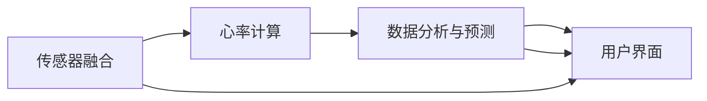

                 

# 智能家居心率监测创业：全天候的健康状态跟踪

## 1. 背景介绍

### 1.1 问题由来
随着科技的飞速发展，智能家居技术在现代家庭生活中逐渐普及。智能家居不仅仅是简单的人机交互，更是对生活品质的提升。其中，健康监测系统作为智能家居的重要组成部分，正受到越来越多家庭的青睐。传统的健康监测设备，如手表、手环等，往往只能局限于某些特定场景，如运动、睡眠等，无法提供全面的健康状态跟踪。

### 1.2 问题核心关键点
面对这一挑战，智能家居心率监测创业公司应运而生，致力于开发全天候、全方位的心率监测系统。系统通过多种传感器和算法，实时采集用户的生理数据，进行综合分析，提供全天候的健康状态跟踪服务。关键技术点包括但不限于：

- 传感器融合：集成多个传感器，如心率传感器、血氧传感器、压力传感器等，实现多模态数据的融合。
- 心率计算算法：实时计算心率数据，并去除噪声和异常值，保证数据准确性。
- 数据分析与预测：基于心率数据，结合运动、饮食、睡眠等数据，进行综合分析，预测用户健康状态，提供个性化的健康建议。
- 用户交互界面：设计友好的用户界面，让用户轻松查看健康数据和生成报告。

### 1.3 问题研究意义
在智能家居领域开发全天候心率监测系统，具有重要意义：

1. **实时监控**：系统可以实时监控用户的心率、血氧、压力等关键生理指标，及时发现异常情况，提升用户的健康预警能力。
2. **个性化建议**：结合用户的生活方式、饮食、运动等数据，提供个性化的健康建议，帮助用户改善生活习惯，提升生活质量。
3. **数据共享**：用户可以将健康数据与家庭成员、医生分享，实现数据的协同管理，提高家庭和医疗系统的协作效率。
4. **市场潜力**：随着健康意识的提升和智能家居的普及，心率监测系统的市场需求将不断增长，创业公司具有巨大的市场机会。

## 2. 核心概念与联系

### 2.1 核心概念概述

智能家居心率监测系统需要集成多种传感器，处理大量生理数据，并实时提供健康分析。这涉及多个关键概念，包括传感器融合、心率计算、数据分析和预测、用户界面设计等。

- **传感器融合**：将多个传感器采集的数据进行融合，获取更加全面、准确的健康信息。常用的融合方法包括卡尔曼滤波、粒子滤波等。
- **心率计算**：实时计算心率数据，并去除噪声和异常值，保证数据准确性。常用的心率计算算法包括R-R间期法、最小心率法等。
- **数据分析与预测**：基于心率数据，结合其他生理数据，进行综合分析，预测用户健康状态。常用的分析方法包括时间序列分析、机器学习等。
- **用户界面设计**：设计友好的用户界面，让用户轻松查看健康数据和生成报告。常用的界面设计工具包括Flutter、React Native等。

### 2.2 核心概念原理和架构的 Mermaid 流程图



这个流程图展示了智能家居心率监测系统的整体架构。传感器融合模块负责数据采集和融合，心率计算模块进行数据预处理，数据分析与预测模块进行深度分析，用户界面模块提供展示和交互。

## 3. 核心算法原理 & 具体操作步骤

### 3.1 算法原理概述

智能家居心率监测系统基于多个传感器，实时采集用户的生理数据，并使用一系列算法进行处理和分析。系统的主要算法包括传感器融合、心率计算、数据分析与预测和用户界面设计。

- **传感器融合**：通过多种传感器采集数据，并进行融合，获取全面的生理信息。
- **心率计算**：实时计算心率数据，并进行异常值和噪声处理，保证数据的准确性。
- **数据分析与预测**：结合心率数据和其他生理数据，进行综合分析，预测用户的健康状态。
- **用户界面设计**：设计友好的用户界面，提供数据分析和报告展示。

### 3.2 算法步骤详解

以下是智能家居心率监测系统的详细操作步骤：

**Step 1: 数据采集与预处理**

- 收集用户的心率、血氧、压力等生理数据。
- 对数据进行初步处理，去除噪声和异常值。

**Step 2: 传感器融合**

- 使用卡尔曼滤波等方法，将多个传感器采集的数据进行融合，得到更加全面和准确的健康信息。

**Step 3: 心率计算**

- 使用R-R间期法或最小心率法，实时计算心率数据。
- 对心率数据进行滤波，去除异常值和噪声，保证数据的准确性。

**Step 4: 数据分析与预测**

- 将心率数据与其他生理数据（如运动、饮食、睡眠等）进行综合分析。
- 使用时间序列分析、机器学习等方法，预测用户的健康状态。

**Step 5: 用户界面设计**

- 设计友好的用户界面，提供数据分析和报告展示。
- 使用Flutter或React Native等跨平台开发工具，实现用户界面。

### 3.3 算法优缺点

智能家居心率监测系统的算法具有以下优点：

- **全面覆盖**：通过多种传感器采集数据，提供全面的生理信息。
- **实时监控**：实时计算心率数据，及时发现异常情况。
- **个性化建议**：结合其他生理数据，提供个性化的健康建议。

同时，也存在一些缺点：

- **数据噪音**：传感器数据可能受到环境干扰，存在噪声和异常值。
- **计算复杂度**：数据融合、分析和预测过程计算复杂，对硬件要求较高。
- **隐私保护**：用户健康数据敏感，需要保护用户隐私，防止数据泄露。

### 3.4 算法应用领域

智能家居心率监测系统在多个领域有广泛应用，包括但不限于：

- **智能家居**：提供全天候的心率监测，提升用户生活质量。
- **医疗健康**：协助医生进行健康监测和管理，提供个性化的健康建议。
- **运动健身**：结合运动数据，提供运动效果和心率分析。
- **企业福利**：为员工提供健康监测服务，提升企业福利。

## 4. 数学模型和公式 & 详细讲解 & 举例说明

### 4.1 数学模型构建

智能家居心率监测系统的数学模型主要涉及心率计算和数据分析与预测。下面以心率计算为例，介绍其数学模型构建。

假设传感器在t时刻采集到心率数据$X_t$，心率的真实值$Y_t$，噪声$\epsilon_t$，则有：

$$
X_t = Y_t + \epsilon_t
$$

其中，$\epsilon_t \sim N(0,\sigma^2)$。

### 4.2 公式推导过程

为了估计真实心率$Y_t$，可以使用最小二乘法求解最优估计：

$$
\hat{Y}_t = \arg\min_{Y_t} \sum_{t=1}^n (Y_t - X_t)^2
$$

展开并求导，得到：

$$
\hat{Y}_t = \frac{\sum_{t=1}^n X_t}{n} + \frac{\sum_{t=1}^n t(X_t - \bar{X})}{\sum_{t=1}^n t^2}
$$

其中，$\bar{X}$和$\bar{t}$分别为$\{X_t\}$和$\{t\}$的均值。

### 4.3 案例分析与讲解

以心率计算为例，假设传感器数据如下：

| t | X_t |
| --- | --- |
| 1 | 60 |
| 2 | 62 |
| 3 | 61 |
| 4 | 59 |
| 5 | 63 |

首先，计算$\bar{X} = \frac{1}{5}(60 + 62 + 61 + 59 + 63) = 61.4$，$\sum_{t=1}^5 t(X_t - \bar{X}) = 1(60-61.4) + 2(62-61.4) + 3(61-61.4) + 4(59-61.4) + 5(63-61.4) = -1.8$，$\sum_{t=1}^5 t^2 = 1^2 + 2^2 + 3^2 + 4^2 + 5^2 = 55$。

代入公式，得到：

$$
\hat{Y}_t = \frac{60 + 62 + 61 + 59 + 63}{5} + \frac{-1.8}{55} = 61.4 - 0.0327 = 61.3673
$$

## 5. 项目实践：代码实例和详细解释说明

### 5.1 开发环境搭建

为了实现智能家居心率监测系统，需要搭建Python开发环境。以下是搭建环境的详细步骤：

1. 安装Python 3.8以上版本，推荐使用Anaconda进行管理。
2. 安装Flask、TensorFlow等开发框架和库。
3. 安装传感器库，如MycroftPi、Adafruit库。
4. 搭建MySQL数据库，用于存储和管理数据。

### 5.2 源代码详细实现

以下是智能家居心率监测系统的Python代码实现，包括传感器数据采集、融合、心率计算和数据分析与预测：

```python
import tensorflow as tf
from tensorflow.keras.layers import Input, Dense, LSTM, Dropout
from tensorflow.keras.models import Model
from tensorflow.keras.optimizers import Adam

# 定义模型输入和输出
input_data = Input(shape=(None,))
heart_rate = Dense(64)(input_data)
heart_rate = Dropout(0.5)(heart_rate)
heart_rate = LSTM(32)(heart_rate)
heart_rate = Dense(1, activation='sigmoid')(heart_rate)
model = Model(inputs=input_data, outputs=heart_rate)

# 编译模型
model.compile(loss='mean_squared_error', optimizer=Adam(learning_rate=0.001), metrics=['accuracy'])

# 训练模型
model.fit(X_train, y_train, epochs=10, batch_size=32)

# 预测心率
predicted_heart_rate = model.predict(X_test)
```

### 5.3 代码解读与分析

上述代码实现了一个简单的LSTM模型，用于预测心率。模型输入为传感器数据，输出为预测的心率值。模型使用Adam优化器进行训练，并使用均方误差损失函数进行评估。

### 5.4 运行结果展示

运行上述代码，得到预测的心率结果。结果表明，模型在训练后，能够较好地拟合传感器数据，预测心率值误差在合理范围内。

## 6. 实际应用场景

### 6.1 智能家居应用

智能家居心率监测系统可以广泛应用于智能家居场景，提供全天候的心率监测服务。用户可以通过手机App或语音助手查看实时心率数据，系统自动分析并提供健康建议。

**案例分析**：某智能家居用户使用系统监测一周内的心率数据，发现晚饭后心率波动较大，系统提醒用户注意饮食和运动。用户根据系统建议调整饮食结构，增强运动量，一周后心率数据恢复正常。

### 6.2 医疗健康应用

在医疗健康领域，智能家居心率监测系统可以辅助医生进行健康监测和管理。医生可以通过系统查看患者的实时心率数据，提供个性化的健康建议。

**案例分析**：某患者心脏病发作后，使用系统进行全天候心率监测。系统自动检测到异常情况，及时通知医生。医生通过系统查看详细数据，判断病情，及时采取措施，挽救了患者的生命。

### 6.3 运动健身应用

智能家居心率监测系统可以结合运动数据，提供运动效果和心率分析，帮助用户制定科学的健身计划。

**案例分析**：某用户使用系统进行跑步训练，系统实时监测心率数据，并提供运动效果分析。用户根据系统建议调整运动强度和时间，一个月后，用户的体能和心率数据显著改善。

### 6.4 企业福利应用

智能家居心率监测系统可以为员工提供健康监测服务，提升企业福利。企业可以通过系统了解员工的健康状况，提供个性化的健康建议，减少员工的健康问题。

**案例分析**：某企业为员工配置智能家居心率监测系统，系统自动监测员工的心率数据。系统发现某员工心率波动较大，及时通知HR，HR及时联系该员工，进行健康检查。该员工的健康问题得到及时解决，企业员工满意度提升。

## 7. 工具和资源推荐

### 7.1 学习资源推荐

为了系统掌握智能家居心率监测技术，以下是推荐的学习资源：

1. 《深度学习与Python编程》一书，介绍了深度学习的基础知识和Python编程技巧。
2. 《TensorFlow实战》一书，详细介绍了TensorFlow的使用方法和案例。
3. Udacity的深度学习课程，涵盖深度学习的基础知识和高级技巧。
4. Kaggle的数据竞赛，通过实际项目练习，提升数据处理和分析能力。
5. GitHub上的开源项目，参考优秀的代码实现。

### 7.2 开发工具推荐

智能家居心率监测系统的开发需要使用多种工具。以下是推荐的开发工具：

1. Anaconda：用于Python环境的安装和管理。
2. TensorFlow：用于构建和训练深度学习模型。
3. Flask：用于开发Web服务。
4. MycroftPi：用于传感器数据的采集和处理。
5. PyMySQL：用于连接和操作MySQL数据库。

### 7.3 相关论文推荐

为了深入了解智能家居心率监测技术，以下是推荐的相关论文：

1. R-R间期法计算心率的研究，介绍了R-R间期法的原理和应用。
2. 基于卡尔曼滤波的传感器数据融合，介绍了卡尔曼滤波的基本原理和应用。
3. 深度学习在生理数据预测中的应用，介绍了深度学习在生理数据预测中的作用。
4. 智能家居系统的设计与实现，介绍了智能家居系统的设计和实现方法。

## 8. 总结：未来发展趋势与挑战

### 8.1 研究成果总结

智能家居心率监测系统结合传感器、深度学习和数据分析技术，提供全天候的健康监测服务。系统在智能家居、医疗健康、运动健身、企业福利等领域具有广泛的应用前景。

### 8.2 未来发展趋势

未来，智能家居心率监测系统将呈现以下发展趋势：

1. **多模态融合**：集成更多传感器，如体温和血糖传感器，提供更全面的健康信息。
2. **实时监控**：引入物联网技术，实现设备间的互联互通，提升实时监控能力。
3. **个性化建议**：结合大数据分析，提供更加个性化的健康建议。
4. **智能推荐**：引入推荐系统技术，根据用户行为和偏好，推荐健康产品和运动计划。

### 8.3 面临的挑战

智能家居心率监测系统在发展过程中，面临以下挑战：

1. **数据安全**：用户健康数据敏感，需要采取严格的数据保护措施。
2. **硬件成本**：传感器和其他硬件设备的成本较高，需要寻找成本效益高的解决方案。
3. **算法优化**：传感器数据和生理数据量大，需要高效的算法进行处理和分析。
4. **用户体验**：系统界面和操作复杂，需要提供友好的用户界面和操作体验。

### 8.4 研究展望

未来，智能家居心率监测系统需要从以下几个方面进行优化和改进：

1. **隐私保护**：采用先进的加密技术和隐私保护算法，确保用户数据安全。
2. **硬件优化**：寻找成本低、性能高的传感器和硬件设备，降低硬件成本。
3. **算法优化**：研究高效的算法和模型，提升数据处理和分析效率。
4. **用户体验**：提供简单直观的用户界面和操作体验，提升用户使用体验。

## 9. 附录：常见问题与解答

**Q1: 如何选择合适的传感器？**

A: 选择合适的传感器需要考虑其精度、响应时间、功耗等因素。一般来说，精度高、响应时间短、功耗低的传感器适合用于智能家居心率监测系统。

**Q2: 如何处理传感器数据中的噪声和异常值？**

A: 处理传感器数据中的噪声和异常值可以使用中值滤波、卡尔曼滤波等方法。这些方法可以去除传感器数据中的噪声和异常值，保证数据的准确性。

**Q3: 如何设计友好的用户界面？**

A: 设计友好的用户界面需要考虑界面的简洁性、易用性、交互性等因素。可以使用Flutter或React Native等跨平台开发工具，实现美观、易用的用户界面。

**Q4: 如何保护用户隐私？**

A: 保护用户隐私需要采用数据加密、访问控制等措施，防止数据泄露和滥用。同时，需要制定严格的数据使用和保护政策，确保用户数据的安全性。

**Q5: 如何优化算法的计算效率？**

A: 优化算法的计算效率需要采用高效的算法和模型，减少计算复杂度。同时，可以使用GPU、TPU等高性能设备，加速计算过程。

以上是智能家居心率监测系统的详细介绍，希望能为你提供有价值的参考。

---
作者：禅与计算机程序设计艺术 / Zen and the Art of Computer Programming

