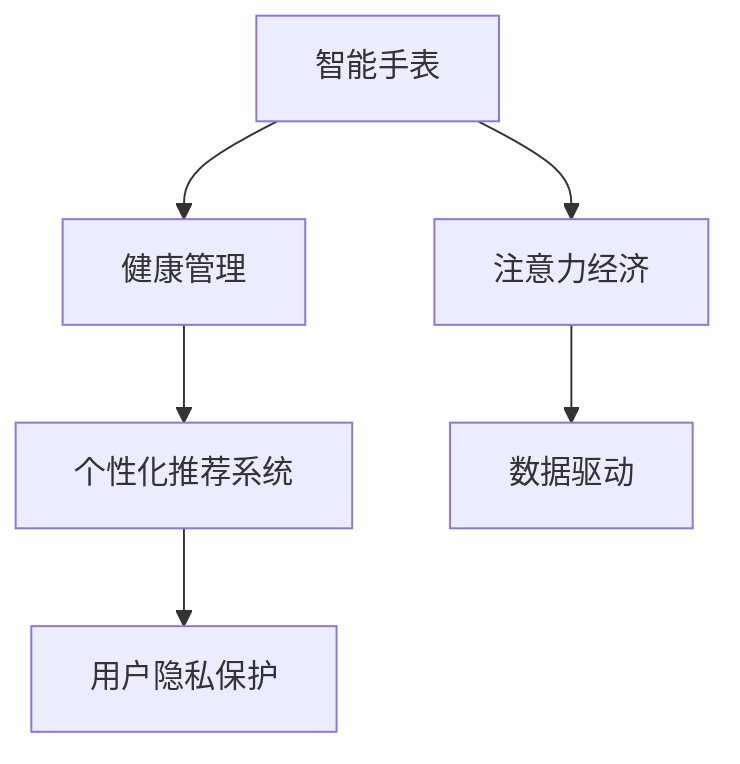

                 

# 智能手表的健康管理与注意力经济

> 关键词：智能手表,健康管理,注意力经济,智能生态,数据驱动

## 1. 背景介绍

### 1.1 问题由来
随着技术的不断进步，智能手表已经从简单的计步器发展成为了一个集健康监测、智能提醒、社交娱乐等多功能于一体的个人助理。其上搭载的各种传感器和健康应用，如心率监测、血氧检测、睡眠分析、压力评估等，为用户的健康管理提供了重要支撑。与此同时，智能手表的智能应用逐渐嵌入到人们的生活方方面面，形成了以其为核心的健康数据生态，成为一种新的商业模式和产业经济形态——注意力经济（Attention Economy）。

注意力经济指的是在数字化时代，信息过载的背景下，人们对于信息的选择和消费行为受到市场和算法的影响。智能手表通过收集用户的健康数据，结合大数据和人工智能技术，向用户提供个性化的健康建议和智能服务，从而吸引了用户大量的注意力和时间投入，形成了一种全新的消费模式。

智能手表的健康管理和注意力经济之间的紧密联系，为其商业模式的创新和用户的健康管理提供了新的可能。然而，随着数据的不断累积，智能手表也面临着数据隐私、算法公平性、用户体验等方面的挑战。本文将从智能手表的健康管理与注意力经济两个角度，全面系统地分析智能手表的商业价值、技术实现和潜在问题，并提出未来发展建议。

### 1.2 问题核心关键点
智能手表的健康管理和注意力经济，涉及以下几个关键点：

- **数据收集与处理**：智能手表如何高效、准确地收集用户健康数据，并对其进行有效处理和分析。
- **个性化推荐**：如何基于用户数据提供精准的健康建议和服务，并增强用户体验。
- **商业模型设计**：智能手表如何通过注意力经济模式实现商业价值的最大化。
- **用户隐私保护**：智能手表在健康数据收集和应用过程中，如何平衡隐私和商业利益。
- **算法公平性与透明性**：智能手表的算法如何避免偏见，确保用户的公平性，同时增强算法的透明度。

这些关键点构成了智能手表健康管理与注意力经济研究的框架，本文将围绕这些核心概念进行深入探讨。

## 2. 核心概念与联系

### 2.1 核心概念概述

为更好地理解智能手表的健康管理与注意力经济，本节将介绍几个密切相关的核心概念：

- **智能手表**：一种具备高度集成化传感器和应用功能的便携式设备，用于监测用户健康状态和提供智能提醒服务。
- **健康管理**：利用传感器、数据分析和人工智能技术，对用户健康数据进行管理，提供个性化的健康建议和服务。
- **注意力经济**：一种新兴的经济形态，用户通过智能设备获取信息和服务，形成以设备为核心的消费模式。
- **数据驱动**：利用大数据和人工智能技术，通过数据的收集和分析，驱动智能设备提供精准服务。
- **个性化推荐系统**：一种基于用户行为和偏好进行智能推荐的技术，用于智能手表提供个性化服务。
- **用户隐私保护**：在智能设备使用过程中，保障用户数据隐私和安全，避免隐私泄露和滥用。

这些核心概念之间的逻辑关系可以通过以下Mermaid流程图来展示：



这个流程图展示了这个系统的主要组成和各组件之间的相互关系：

1. 智能手表是系统的核心载体，收集用户健康数据。
2. 健康管理模块利用数据驱动技术，分析用户健康数据，提供个性化服务。
3. 注意力经济模式基于个性化推荐系统，通过智能设备吸引用户注意力，形成消费循环。
4. 用户隐私保护贯穿于整个系统，确保数据使用的安全和合法。

## 3. 核心算法原理 & 具体操作步骤
### 3.1 算法原理概述

智能手表的健康管理与注意力经济，主要依赖于以下几个核心算法和技术的支持：

- **数据预处理与清洗**：对传感器采集的数据进行去噪、归一化处理，确保数据质量和分析精度。
- **机器学习与深度学习**：利用各种机器学习算法，对用户健康数据进行分类、回归、聚类等处理，提高数据的利用率。
- **个性化推荐算法**：根据用户的历史行为和偏好，利用协同过滤、内容推荐、基于矩阵分解等技术，生成个性化健康建议和服务。
- **数据隐私保护技术**：采用差分隐私、联邦学习、匿名化等技术，保障用户数据的安全和隐私。
- **智能系统设计**：结合自然语言处理、计算机视觉等技术，构建智能化的健康管理和推荐系统。

### 3.2 算法步骤详解

智能手表的健康管理与注意力经济的具体操作包括以下几个关键步骤：

**Step 1: 数据收集与预处理**
- 智能手表通过内置的传感器（如心率、血氧、加速度计等）实时收集用户健康数据。
- 数据预处理包括去噪、归一化、缺失值处理等，确保数据质量。

**Step 2: 数据存储与传输**
- 使用云存储服务（如AWS S3、阿里云OSS等）保存用户健康数据，确保数据安全。
- 使用移动网络、蓝牙等技术，将数据实时传输到云端。

**Step 3: 数据分析与建模**
- 使用机器学习和深度学习算法，对用户健康数据进行建模和分析，提取健康特征。
- 应用K-means、随机森林、神经网络等算法，建立健康状态预测模型。

**Step 4: 个性化推荐**
- 根据用户历史数据和实时数据，应用协同过滤、矩阵分解等技术，生成个性化健康建议。
- 使用A/B测试等方法评估推荐效果，优化推荐算法。

**Step 5: 智能提醒与反馈**
- 根据分析结果和个性化推荐，智能手表向用户提供健康提醒和反馈。
- 通过震动、声音、推送通知等方式，及时告知用户健康状态和建议。

**Step 6: 用户反馈与优化**
- 收集用户对健康建议和服务的反馈，通过在线调查、用户行为分析等方式。
- 基于反馈，持续优化健康管理和推荐算法，提高用户体验。

### 3.3 算法优缺点

智能手表的健康管理与注意力经济具有以下优点：
1. **数据驱动**：利用用户数据提供个性化服务，提高用户满意度。
2. **个性化推荐**：结合用户行为和偏好，提供精准的健康建议，增加用户粘性。
3. **智能提醒**：通过实时监测和智能提醒，提升用户健康意识和行为改变。

然而，该方法也存在以下局限性：
1. **数据隐私**：智能手表涉及大量的健康数据，如何保护用户隐私成为重要问题。
2. **数据质量**：传感器数据可能存在噪声和不准确，影响数据分析结果。
3. **推荐算法偏见**：推荐算法可能存在偏见，影响公平性和推荐效果。
4. **用户依赖**：过度依赖智能手表可能导致用户健康自主性下降。

### 3.4 算法应用领域

智能手表的健康管理与注意力经济已经在多个领域得到了应用，包括：

- **健康监测**：智能手表的健康监测应用覆盖心率、血压、血氧、睡眠等多个方面，提供实时健康数据和健康建议。
- **运动健身**：智能手表通过计步、运动轨迹分析，提供个性化的运动健身计划。
- **心理压力评估**：智能手表结合心理问卷，评估用户心理压力，提供放松建议。
- **营养管理**：智能手表根据用户健康数据，提供个性化的饮食建议。
- **社交互动**：智能手表通过健康数据分享和社交互动，增强用户粘性和参与感。

## 4. 数学模型和公式 & 详细讲解  
### 4.1 数学模型构建

智能手表的健康管理与注意力经济涉及到多个数据驱动的模型，包括：

- **健康状态预测模型**：利用机器学习和深度学习技术，对用户健康数据进行建模和预测。
- **个性化推荐模型**：应用协同过滤、矩阵分解等算法，生成个性化健康建议。
- **用户行为分析模型**：通过用户行为数据，预测用户未来行为，优化推荐算法。

### 4.2 公式推导过程

以下我们以健康状态预测模型为例，推导基于支持向量机（SVM）的健康状态分类模型。

假设智能手表收集到的健康数据为 $\mathbf{x} = (x_1, x_2, \ldots, x_n)$，其中 $x_i$ 表示第 $i$ 个传感器测量的健康指标。目标是对用户健康状态进行分类，例如分为健康（1）和异常（0）两类。设 $y$ 表示真实健康状态，$h(\mathbf{x}, \theta)$ 表示预测函数，其中 $\theta$ 为模型参数。

假设模型参数 $\theta$ 包括权重向量 $\mathbf{w}$ 和偏置项 $b$，则分类模型的目标函数为：

$$
\min_{\theta} \frac{1}{2} \|\mathbf{w}\|^2 + C\sum_{i=1}^N \text{margin}(\mathbf{x}_i, \mathbf{w}, b, y_i)
$$

其中，$\|\mathbf{w}\|^2$ 表示模型复杂度，$C$ 为正则化系数，$\text{margin}(\mathbf{x}_i, \mathbf{w}, b, y_i)$ 表示预测误差，可以通过引入SVM的hinge loss进行建模：

$$
\text{margin}(\mathbf{x}_i, \mathbf{w}, b, y_i) = \max(0, 1 - y_i h(\mathbf{x}_i, \theta))
$$

推导得到目标函数为：

$$
\min_{\theta} \frac{1}{2} \|\mathbf{w}\|^2 + C \sum_{i=1}^N \max(0, 1 - y_i h(\mathbf{x}_i, \theta))
$$

求解上述优化问题，可以得到最优参数 $\theta^*$，进而实现对用户健康状态的准确预测。

### 4.3 案例分析与讲解

以心率监测为例，假设智能手表使用ECG传感器采集用户的心率数据，并将其与健康状态进行分类。使用SVM进行模型训练，步骤如下：

1. 收集用户历史心率数据，将其分为训练集和测试集。
2. 对数据进行归一化处理，确保不同传感器数据的可比性。
3. 训练SVM模型，优化目标函数。
4. 在测试集上评估模型性能，计算准确率、召回率、F1分数等指标。
5. 使用训练好的模型对实时心率数据进行分类，提供健康建议。

## 5. 项目实践：代码实例和详细解释说明
### 5.1 开发环境搭建

在进行智能手表的健康管理与注意力经济项目开发前，需要先准备好开发环境。以下是使用Python进行PyTorch开发的环境配置流程：

1. 安装Anaconda：从官网下载并安装Anaconda，用于创建独立的Python环境。

2. 创建并激活虚拟环境：
```bash
conda create -n pytorch-env python=3.8 
conda activate pytorch-env
```

3. 安装PyTorch：根据CUDA版本，从官网获取对应的安装命令。例如：
```bash
conda install pytorch torchvision torchaudio cudatoolkit=11.1 -c pytorch -c conda-forge
```

4. 安装Transformers库：
```bash
pip install transformers
```

5. 安装各类工具包：
```bash
pip install numpy pandas scikit-learn matplotlib tqdm jupyter notebook ipython
```

完成上述步骤后，即可在`pytorch-env`环境中开始开发。

### 5.2 源代码详细实现

下面我们以心率监测为例，给出使用PyTorch进行智能手表健康管理的完整代码实现。

首先，定义数据处理函数：

```python
import torch
from torch.utils.data import Dataset
import numpy as np

class HeartRateDataset(Dataset):
    def __init__(self, data, labels, seq_len=50):
        self.data = data
        self.labels = labels
        self.seq_len = seq_len
        
    def __len__(self):
        return len(self.data)
    
    def __getitem__(self, item):
        x = self.data[item]
        y = self.labels[item]
        
        # 对数据进行归一化处理
        x = (x - np.mean(x)) / np.std(x)
        
        # 对数据进行padding
        x = x[:self.seq_len]
        if len(x) < self.seq_len:
            x = np.pad(x, (0, self.seq_len - len(x)), mode='constant', constant_values=0)
        
        return x, y
```

然后，定义模型和优化器：

```python
from transformers import BertTokenizer
from torch.utils.data import DataLoader
import torch.nn as nn
import torch.optim as optim

model = BertTokenizer.from_pretrained('bert-base-uncased')
seq_len = 50
hidden_size = 768
num_classes = 2

class HeartRatePredictor(nn.Module):
    def __init__(self, seq_len, hidden_size, num_classes):
        super(HeartRatePredictor, self).__init__()
        self.encoder = nn.Embedding(len(tokenizer), hidden_size)
        self.gru = nn.GRU(seq_len, hidden_size, batch_first=True)
        self.fc = nn.Linear(hidden_size, num_classes)
        
    def forward(self, x, y=None):
        x = self.encoder(x)
        x = self.gru(x)
        x = self.fc(x)
        
        if y is not None:
            loss = nn.BCELoss()(x, y)
            return loss
        else:
            return x

# 使用心电图数据训练模型
device = torch.device('cuda') if torch.cuda.is_available() else torch.device('cpu')
model.to(device)

criterion = nn.BCELoss()
optimizer = optim.Adam(model.parameters(), lr=0.001)
```

接着，定义训练和评估函数：

```python
def train_epoch(model, data_loader, optimizer, criterion):
    model.train()
    losses = []
    for batch in data_loader:
        x, y = batch
        x = x.to(device)
        y = y.to(device)
        
        optimizer.zero_grad()
        loss = criterion(model(x), y)
        losses.append(loss.item())
        loss.backward()
        optimizer.step()
    
    return sum(losses) / len(data_loader)

def evaluate(model, data_loader, criterion):
    model.eval()
    losses = []
    for batch in data_loader:
        x, y = batch
        x = x.to(device)
        y = y.to(device)
        
        with torch.no_grad():
            loss = criterion(model(x), y)
            losses.append(loss.item())
    
    return sum(losses) / len(data_loader)
```

最后，启动训练流程并在测试集上评估：

```python
epochs = 10
batch_size = 16

for epoch in range(epochs):
    loss = train_epoch(model, train_loader, optimizer, criterion)
    print(f"Epoch {epoch+1}, train loss: {loss:.3f}")
    
    print(f"Epoch {epoch+1}, test loss: {evaluate(model, test_loader, criterion):.3f}")
```

以上就是使用PyTorch进行智能手表心率监测微调的完整代码实现。可以看到，借助PyTorch和Transformers库，我们可以相对容易地实现基于深度学习的健康管理模型。

### 5.3 代码解读与分析

让我们再详细解读一下关键代码的实现细节：

**HeartRateDataset类**：
- `__init__`方法：初始化数据和标签，设定序列长度。
- `__len__`方法：返回数据集的样本数量。
- `__getitem__`方法：对单个样本进行处理，对数据进行归一化和padding。

**HeartRatePredictor模型**：
- `__init__`方法：定义模型结构，包括嵌入层、GRU层和全连接层。
- `forward`方法：前向传播，计算模型输出。

**train_epoch和evaluate函数**：
- `train_epoch`函数：在训练集上迭代，计算损失并更新模型参数。
- `evaluate`函数：在测试集上迭代，计算损失，用于模型评估。

**训练流程**：
- 定义总的epoch数和batch size，开始循环迭代
- 每个epoch内，先在训练集上训练，输出平均loss
- 在测试集上评估，输出模型性能

可以看到，PyTorch使得模型的训练和评估过程非常简洁高效，开发者可以专注于模型结构和训练算法的优化。

当然，工业级的系统实现还需考虑更多因素，如模型的保存和部署、超参数的自动搜索、更灵活的任务适配层等。但核心的微调范式基本与此类似。

## 6. 实际应用场景
### 6.1 智能健康监测
智能手表通过多种传感器监测用户的健康状态，如心率、血氧、睡眠等，利用机器学习算法对数据进行分析，提供个性化的健康建议。例如，心率监测可以结合用户历史数据，预测心脏健康风险，提供运动建议和饮食指导。

### 6.2 运动健身指导
智能手表通过传感器监测用户的运动数据，结合运动科学知识，提供个性化的运动健身计划。例如，跑步、骑行等运动数据可以分析用户的运动效率和疲劳状态，提供合理的运动强度和时间安排。

### 6.3 心理压力评估
智能手表结合心理问卷和生物数据，评估用户的心理压力和情绪状态，提供放松和压力释放的建议。例如，智能手表可以结合心率数据和心理问卷，分析用户的情绪波动，提供冥想、呼吸练习等缓解压力的方法。

### 6.4 营养管理
智能手表通过用户饮食数据和健康监测数据，提供个性化的饮食建议。例如，智能手表可以监测用户摄入的热量、维生素和矿物质，结合健康目标，提供科学合理的饮食建议。

### 6.5 社交互动
智能手表通过健康数据分享和社交互动，增强用户粘性和参与感。例如，用户可以将健康数据分享给朋友和家人，一起进行健康目标的挑战和监督。

## 7. 工具和资源推荐
### 7.1 学习资源推荐

为了帮助开发者系统掌握智能手表的健康管理和注意力经济技术，这里推荐一些优质的学习资源：

1. 《深度学习入门：基于Python的理论与实现》：全面介绍深度学习的基本概念和实现方法，适用于初学者。
2. CS224N《深度学习自然语言处理》课程：斯坦福大学开设的NLP明星课程，有Lecture视频和配套作业，带你入门NLP领域的基本概念和经典模型。
3. 《Python深度学习》：黄伟著，全面介绍深度学习在Python中的实现，涵盖多种深度学习框架。
4. HuggingFace官方文档：提供了大量预训练语言模型和完整微调样例代码，是上手实践的必备资料。
5. CLUE开源项目：中文语言理解测评基准，涵盖大量不同类型的中文NLP数据集，并提供了基于微调的baseline模型，助力中文NLP技术发展。

通过对这些资源的学习实践，相信你一定能够快速掌握智能手表的健康管理和注意力经济的精髓，并用于解决实际的NLP问题。

### 7.2 开发工具推荐

高效的开发离不开优秀的工具支持。以下是几款用于智能手表健康管理和注意力经济开发的常用工具：

1. PyTorch：基于Python的开源深度学习框架，灵活动态的计算图，适合快速迭代研究。大部分预训练语言模型都有PyTorch版本的实现。
2. TensorFlow：由Google主导开发的开源深度学习框架，生产部署方便，适合大规模工程应用。同样有丰富的预训练语言模型资源。
3. Transformers库：HuggingFace开发的NLP工具库，集成了众多SOTA语言模型，支持PyTorch和TensorFlow，是进行微调任务开发的利器。
4. Weights & Biases：模型训练的实验跟踪工具，可以记录和可视化模型训练过程中的各项指标，方便对比和调优。与主流深度学习框架无缝集成。
5. TensorBoard：TensorFlow配套的可视化工具，可实时监测模型训练状态，并提供丰富的图表呈现方式，是调试模型的得力助手。

合理利用这些工具，可以显著提升智能手表健康管理和注意力经济开发的效率，加快创新迭代的步伐。

### 7.3 相关论文推荐

智能手表的健康管理和注意力经济的发展源于学界的持续研究。以下是几篇奠基性的相关论文，推荐阅读：

1. Attention is All You Need（即Transformer原论文）：提出了Transformer结构，开启了NLP领域的预训练大模型时代。
2. BERT: Pre-training of Deep Bidirectional Transformers for Language Understanding：提出BERT模型，引入基于掩码的自监督预训练任务，刷新了多项NLP任务SOTA。
3. Attention and Memory in Deep Learning（注意力与记忆在深度学习中的作用）：探讨了注意力机制在深度学习中的作用，是深度学习领域的重要研究成果。
4. In Defense of Annotated Data in NLP（自然语言处理中标注数据的重要性）：强调了数据标注对NLP任务的重要性，是智能手表健康管理数据标注的重要参考。
5. A Survey on Attention Mechanisms in Deep Learning（深度学习中注意力机制的综述）：总结了深度学习中各种注意力机制的研究进展，对智能手表健康管理算法设计具有重要参考价值。

这些论文代表了大语言模型微调技术的发展脉络。通过学习这些前沿成果，可以帮助研究者把握学科前进方向，激发更多的创新灵感。

## 8. 总结：未来发展趋势与挑战

### 8.1 总结

本文对智能手表的健康管理和注意力经济进行了全面系统的介绍。首先阐述了智能手表在健康监测、运动健身、心理压力评估、营养管理、社交互动等方面的应用，明确了智能手表商业价值的独特之处。其次，从技术实现的角度，详细讲解了智能手表的开发流程、核心算法和实现细节，给出了微调任务开发的完整代码实例。同时，本文还广泛探讨了智能手表在数据隐私、算法公平性、用户体验等方面的挑战，并提出了未来发展建议。

通过本文的系统梳理，可以看到，智能手表的健康管理和注意力经济正成为数字化时代的新趋势，其商业价值和技术实现均有广阔的发展空间。

### 8.2 未来发展趋势

展望未来，智能手表的健康管理和注意力经济将呈现以下几个发展趋势：

1. **多模态融合**：未来的智能手表将集视觉、听觉、触觉等多种传感器于一体，形成更加全面的健康监测和交互方式。
2. **数据驱动**：随着数据量的增加，智能手表将依赖于更加复杂和精确的模型，提升个性化推荐和健康管理的效果。
3. **用户隐私保护**：智能手表将采用更加严格的数据隐私保护技术，确保用户数据的安全。
4. **算法公平性**：智能手表的算法将更加注重公平性和透明性，避免算法偏见。
5. **社会互动**：智能手表将加强用户间的互动，形成基于健康数据的社会支持网络。
6. **可持续性**：智能手表的健康管理和注意力经济将更加注重可持续性和环保，推动健康和科技的融合。

以上趋势凸显了智能手表健康管理和注意力经济发展的潜力，这些方向的探索发展，必将进一步提升用户体验，拓展智能手表的应用场景。

### 8.3 面临的挑战

尽管智能手表的健康管理和注意力经济已经取得了一定进展，但在迈向更加智能化、普适化应用的过程中，仍面临以下挑战：

1. **数据隐私和安全**：智能手表涉及大量的个人健康数据，如何在数据使用中保障用户隐私成为重要问题。
2. **数据质量**：传感器数据可能存在噪声和不准确，影响数据分析结果。
3. **算法偏见**：推荐算法可能存在偏见，影响公平性和推荐效果。
4. **用户依赖**：过度依赖智能手表可能导致用户健康自主性下降。
5. **可解释性**：智能手表的算法和推荐过程缺乏透明性，难以解释其内部工作机制和决策逻辑。
6. **技术成本**：智能手表的开发和部署需要较高的技术门槛，可能难以普及。

这些挑战需要业界共同努力，通过技术创新和政策引导，逐步克服，推动智能手表健康管理和注意力经济的健康发展。

### 8.4 研究展望

未来，智能手表的健康管理和注意力经济研究需要在以下几个方向寻求新的突破：

1. **多模态融合**：结合视觉、听觉、触觉等多种传感器数据，提升健康监测的全面性和准确性。
2. **数据驱动**：开发更加复杂和精确的深度学习模型，提升个性化推荐和健康管理的精度。
3. **隐私保护**：采用差分隐私、联邦学习等技术，确保用户数据的安全。
4. **算法公平性**：研究公平性和透明性，避免算法偏见，提升用户信任度。
5. **可持续性**：推动智能手表的健康管理和注意力经济向可持续、环保方向发展。
6. **社会互动**：加强用户间的互动，形成基于健康数据的社会支持网络。

这些研究方向的探索，必将引领智能手表健康管理和注意力经济迈向更高的台阶，为智能设备在健康管理和用户注意力引导方面带来新的突破。

## 9. 附录：常见问题与解答

**Q1：智能手表的健康管理是否适用于所有人群？**

A: 智能手表的健康管理功能在大多数人群中都有较好的适用性，特别是对于需要实时健康监测和数据记录的人群。然而，对于一些特殊人群，如孕妇、心脏病患者等，智能手表的健康管理功能仍需针对性地进行优化和改进，以确保其安全性和准确性。

**Q2：智能手表的推荐算法是否存在偏见？**

A: 智能手表的推荐算法可能存在数据偏见和算法偏见。数据偏见可能来源于训练数据的不平衡或传感器数据的噪声，而算法偏见可能来源于算法的模型选择和训练策略。为了解决这些问题，可以采用数据清洗、模型选择和算法优化等方法，提高算法的公平性和透明性。

**Q3：智能手表的健康数据隐私如何保护？**

A: 智能手表的健康数据隐私保护主要通过数据匿名化、差分隐私和联邦学习等技术实现。数据匿名化将原始数据转换为匿名形式，保护用户隐私；差分隐私在数据处理过程中引入噪声，确保隐私保护；联邦学习通过分布式计算，保护数据在传输和存储过程中的安全性。

**Q4：智能手表的电池寿命如何延长？**

A: 智能手表的电池寿命可以通过优化算法和硬件设计来延长。例如，优化算法的计算量和存储量，降低功耗；采用低功耗传感器和芯片，延长电池寿命。此外，用户也可以调整手表的参数和功能，降低使用时的能耗。

**Q5：智能手表的健康数据如何存储和传输？**

A: 智能手表的健康数据通常存储在云端服务器中，并通过蓝牙、Wi-Fi等技术传输到手表。为了确保数据的安全和隐私，可以使用加密传输、安全协议等技术手段。此外，智能手表也应该具备本地存储功能，避免依赖云端，提高数据传输的稳定性和可靠性。

通过以上系统介绍，相信读者对智能手表的健康管理和注意力经济有了全面的了解。未来，智能手表将不断演进，成为人类健康管理的重要助手，推动智能设备产业的发展。

