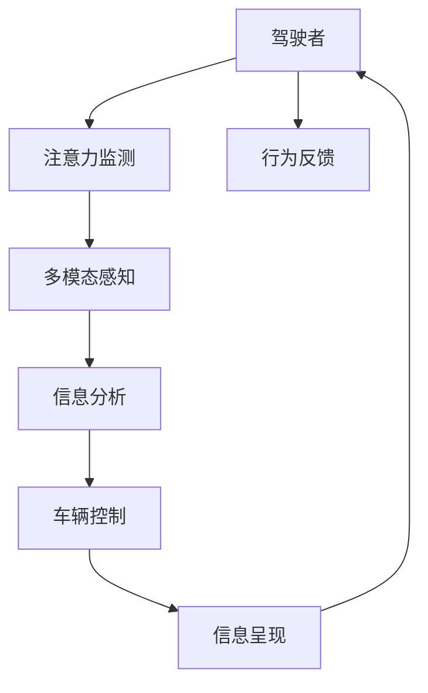

                 

# 智能汽车驾驶舱的注意力管理系统

> 关键词：智能驾驶,驾驶舱管理,注意力系统,人机交互,用户体验,车辆自动化

## 1. 背景介绍

在现代汽车中，驾驶舱不仅是驾驶者和乘客的物理空间，更是信息和情感交流的媒介。随着车辆智能化程度的提升，驾驶舱集成了越来越多的电子设备，功能日益复杂。如何在保持驾驶安全的前提下，提供便捷、高效、愉悦的驾驶体验，成为智能汽车设计的重要课题。

智能驾驶舱的注意力管理系统，正是为了解决这一问题而提出的。通过深度学习和多模态感知技术，系统能够实时监测驾驶者注意力状态，根据环境变化动态调整车辆系统状态和信息呈现方式，提高驾驶安全和舒适性，提升用户满意度和忠诚度。

## 2. 核心概念与联系

### 2.1 核心概念概述

为更好地理解智能驾驶舱的注意力管理系统，本节将介绍几个关键概念：

- **智能驾驶舱**：集成了车辆传感器、电子设备和人工智能技术，能够实时感知并响应驾驶者及环境变化的空间。

- **注意力系统**：利用深度学习等技术，实时监测驾驶者的注意力状态，分析驾驶行为和环境变化，动态调整车辆系统。

- **多模态感知**：结合视觉、听觉、触觉等多种传感器，全面感知驾驶舱内外环境，提升系统的感知能力和响应精度。

- **交互式信息呈现**：通过车载大屏、语音交互等形式，实时更新车辆信息和控制指令，提升用户交互体验。

- **用户个性化**：根据驾驶者的行为习惯、偏好设置，定制个性化的驾驶舱环境，提供更加贴合需求的服务。

这些概念共同构成了智能驾驶舱注意力管理系统的核心，使得系统能够在复杂多变的环境中，动态地适应用户需求，实现高安全、高舒适、高体验的驾驶体验。

### 2.2 核心概念原理和架构的 Mermaid 流程图



该流程图展示了智能驾驶舱注意力管理系统的主要流程：

1. 驾驶者通过各种传感器和设备与系统交互。
2. 系统利用深度学习模型实时监测驾驶者注意力状态。
3. 多模态感知技术全面获取驾驶舱内外环境信息。
4. 信息分析模块对感知数据进行综合处理，识别驾驶者行为和环境变化。
5. 车辆控制模块根据分析结果，动态调整车辆系统状态。
6. 交互式信息呈现模块实时更新车辆信息，并按需展示控制选项。
7. 系统根据驾驶者反馈，不断优化自身策略。

## 3. 核心算法原理 & 具体操作步骤

### 3.1 算法原理概述

智能驾驶舱的注意力管理系统，本质上是一个实时感知、分析、响应的人机交互系统。其核心思想是通过深度学习模型实时监测驾驶者注意力状态，结合多模态感知技术，动态调整车辆系统，以提升驾驶安全和舒适性，提升用户满意度和忠诚度。

形式化地，假设系统接收到来自驾驶者 $A$ 的数据 $D_A$，环境传感器 $S$ 的数据 $D_S$，以及多模态感知数据 $D_{MS}$。系统的目标是最小化驾驶者注意力不集中导致的风险，即找到最优控制策略 $C$：

$$
\hat{C}=\mathop{\arg\min}_{C} \mathcal{L}(C,D_A,D_S,D_{MS})
$$

其中 $\mathcal{L}$ 为系统性能损失函数，用于衡量系统行为与驾驶者注意力状态的一致性。

### 3.2 算法步骤详解

智能驾驶舱的注意力管理系统一般包括以下几个关键步骤：

**Step 1: 多模态感知数据采集**

系统通过车辆内外传感器、摄像头、麦克风等设备，实时采集驾驶者行为数据、环境数据和多模态感知数据。这些数据包括但不限于：

- 驾驶者面部表情、眼球运动、手势等生物特征。
- 车内设备状态、车辆速度、行驶轨迹等车辆状态数据。
- 道路交通状况、天气、路面标记等环境信息。

**Step 2: 注意力状态监测**

利用深度学习模型，实时监测驾驶者注意力状态。例如，使用卷积神经网络(CNN)分析驾驶者的面部表情和眼球运动，判断其注意力集中度。

**Step 3: 多模态数据融合**

通过深度学习技术，将多模态感知数据融合为单一的综合表示。例如，使用Transformer模型对驾驶者面部表情、眼球运动、车内设备状态等数据进行融合，生成单一的综合表示。

**Step 4: 行为分析与预测**

利用深度学习模型，对融合后的综合表示进行行为分析，预测驾驶者行为和环境变化趋势。例如，使用RNN或LSTM模型对融合数据进行时间序列分析，预测驾驶者是否会发生注意力分散。

**Step 5: 车辆控制与信息呈现**

根据行为分析结果，动态调整车辆控制策略，更新信息呈现方式。例如，若预测驾驶者即将注意力分散，则增加警告提示，自动调节车载大屏显示内容。

**Step 6: 系统优化**

通过用户反馈，不断优化系统性能。例如，收集驾驶者对系统响应的满意度，调整模型参数，提升系统响应准确性和时效性。

以上是智能驾驶舱注意力管理系统的一般流程。在实际应用中，还需要针对具体驾驶场景，对各个环节进行优化设计，如改进注意力监测模型、优化多模态融合算法、设计更灵活的行为预测模型等，以进一步提升系统性能。

### 3.3 算法优缺点

智能驾驶舱的注意力管理系统具有以下优点：

- **实时响应**：通过深度学习模型实时监测驾驶者注意力状态，及时调整车辆控制，避免注意力分散带来的潜在风险。
- **多模态感知**：结合多种传感器获取数据，提升系统感知能力和环境适应性，增强用户体验。
- **个性化定制**：根据驾驶者行为习惯，定制个性化驾驶舱环境，提升舒适度和满意度。

同时，该方法也存在以下局限性：

- **数据质量要求高**：系统依赖传感器数据，传感器故障或数据采集不准确，可能导致系统误判。
- **计算资源消耗大**：深度学习模型需要大量计算资源，实时分析任务可能导致系统性能下降。
- **用户隐私问题**：系统需要实时采集驾驶者面部表情等敏感数据，可能导致隐私泄露问题。
- **系统复杂度高**：多模态感知和行为分析任务复杂，系统设计和实现难度大。

尽管存在这些局限性，但就目前而言，智能驾驶舱注意力管理系统仍是大规模智能化应用的重要范式。未来相关研究的重点在于如何进一步降低系统对传感器数据的依赖，提高实时分析的效率，同时兼顾用户隐私和系统安全等因素。

### 3.4 算法应用领域

智能驾驶舱注意力管理系统已经在智能驾驶、娱乐系统、导航系统等多个领域得到应用，为驾驶者和乘客带来了全新的体验。

- **智能驾驶**：实时监测驾驶者注意力状态，动态调整驾驶辅助系统，提升驾驶安全性和舒适性。
- **娱乐系统**：根据驾驶者注意力状态，智能调整多媒体设备，提升娱乐体验。
- **导航系统**：实时监测驾驶者注意力状态，动态更新导航信息和路线规划，减少注意力分散。
- **个性化服务**：根据驾驶者行为习惯，定制个性化的车辆设置和信息展示，提升用户满意度和忠诚度。

此外，在自动驾驶、智能家居、城市管理等众多领域，基于注意力管理的智能系统也将不断涌现，为社会提供更高效、更安全的解决方案。

## 4. 数学模型和公式 & 详细讲解 & 举例说明

### 4.1 数学模型构建

本节将使用数学语言对智能驾驶舱注意力管理系统的核心模型进行更加严格的刻画。

假设系统接收到来自驾驶者 $A$ 的数据 $D_A$，环境传感器 $S$ 的数据 $D_S$，以及多模态感知数据 $D_{MS}$。系统的目标是最小化驾驶者注意力不集中导致的风险，即找到最优控制策略 $C$：

$$
\hat{C}=\mathop{\arg\min}_{C} \mathcal{L}(C,D_A,D_S,D_{MS})
$$

其中 $\mathcal{L}$ 为系统性能损失函数，用于衡量系统行为与驾驶者注意力状态的一致性。

假设系统采用注意力监测模型 $M_A$ 和行为分析模型 $M_B$，分别用于监测驾驶者注意力状态和分析驾驶行为。系统控制策略为 $C$，信息呈现方式为 $I$。则损失函数可分解为：

$$
\mathcal{L}(C,I)=\alpha \mathcal{L}_A(M_A,D_A)+\beta \mathcal{L}_B(M_B,D_A,C)+\gamma \mathcal{L}_I(I)
$$

其中 $\alpha$、$\beta$、$\gamma$ 为损失函数的权重系数，用于平衡不同组件的重要性。

### 4.2 公式推导过程

以下我们以驾驶者注意力监测模型为例，推导其损失函数及其梯度计算公式。

假设系统监测到驾驶者面部表情数据 $D_F$，使用CNN模型 $M_A$ 提取面部表情特征，得到特征表示 $H_F$。系统设定的注意力阈值为 $\theta_A$，损失函数为：

$$
\mathcal{L}_A(M_A,D_F)=\frac{1}{N}\sum_{i=1}^N (\max(0,1-M_A(D_F_i)-\theta_A))^2
$$

其中 $D_F_i$ 为第 $i$ 个样本的面部表情特征。若监测到面部表情低于阈值，则表示驾驶者注意力分散，系统需及时响应。

系统监测到驾驶者面部表情特征 $H_F$ 后，将其输入行为分析模型 $M_B$，预测驾驶者行为 $B$。行为分析模型的损失函数为：

$$
\mathcal{L}_B(M_B,D_F,C)=\frac{1}{N}\sum_{i=1}^N (\max(0,1-loss(B,M_B(H_F),C_i)-\theta_B))^2
$$

其中 $C_i$ 为系统在第 $i$ 个时间步的控制策略。若预测驾驶者行为偏离正常路径，则系统需动态调整控制策略。

### 4.3 案例分析与讲解

以智能驾驶为例，分析系统在驾驶者注意力分散时的动态响应过程。

假设系统监测到驾驶者面部表情数据 $D_F$，使用CNN模型 $M_A$ 提取特征，得到 $H_F$。系统判断 $H_F$ 低于阈值 $\theta_A$，表明驾驶者注意力分散。

系统将 $H_F$ 输入行为分析模型 $M_B$，得到驾驶者行为预测 $B$。若行为预测表明车辆偏离正常行驶路径，系统自动调节自动驾驶系统，增加警告提示。

同时，系统更新信息呈现方式 $I$，如将车载大屏显示内容切换到安全驾驶提醒。系统不断监测驾驶者面部表情和车辆状态数据，实时调整控制策略和信息展示，确保驾驶安全。

## 5. 项目实践：代码实例和详细解释说明

### 5.1 开发环境搭建

在进行注意力管理系统开发前，我们需要准备好开发环境。以下是使用Python进行OpenCV、TensorFlow和Keras开发的环境配置流程：

1. 安装Anaconda：从官网下载并安装Anaconda，用于创建独立的Python环境。

2. 创建并激活虚拟环境：
```bash
conda create -n attention-env python=3.8 
conda activate attention-env
```

3. 安装OpenCV：
```bash
pip install opencv-python
```

4. 安装TensorFlow和Keras：
```bash
pip install tensorflow==2.6.0 keras==2.6.0
```

5. 安装各类工具包：
```bash
pip install numpy pandas scikit-learn matplotlib tqdm jupyter notebook ipython
```

完成上述步骤后，即可在`attention-env`环境中开始注意力管理系统开发。

### 5.2 源代码详细实现

这里我们以面部表情识别为例，给出使用OpenCV和Keras进行智能驾驶舱注意力监测的PyTorch代码实现。

首先，定义面部表情识别任务的数据处理函数：

```python
import cv2
import numpy as np
import os

class FaceDetector:
    def __init__(self, cascade_path='haarcascade_frontalface_default.xml'):
        self.cascade = cv2.CascadeClassifier(cascade_path)
        self.data_dir = 'data'

    def load_data(self):
        images = []
        labels = []
        for filename in os.listdir(self.data_dir):
            if filename.endswith('.png'):
                image_path = os.path.join(self.data_dir, filename)
                image = cv2.imread(image_path)
                gray = cv2.cvtColor(image, cv2.COLOR_BGR2GRAY)
                faces = self.cascade.detectMultiScale(gray, scaleFactor=1.1, minNeighbors=5, minSize=(30, 30))
                for (x, y, w, h) in faces:
                    image = image[y:y+h, x:x+w]
                    image = cv2.resize(image, (48, 48))
                    images.append(image)
                    labels.append(1)
        return np.array(images), np.array(labels)

    def preprocess(self, image):
        image = cv2.cvtColor(image, cv2.COLOR_BGR2GRAY)
        image = cv2.resize(image, (48, 48))
        return image
```

然后，定义面部表情识别模型：

```python
from keras.models import Sequential
from keras.layers import Conv2D, MaxPooling2D, Flatten, Dense

def build_model():
    model = Sequential()
    model.add(Conv2D(32, (3, 3), activation='relu', input_shape=(48, 48, 1)))
    model.add(MaxPooling2D((2, 2)))
    model.add(Conv2D(64, (3, 3), activation='relu'))
    model.add(MaxPooling2D((2, 2)))
    model.add(Conv2D(128, (3, 3), activation='relu'))
    model.add(MaxPooling2D((2, 2)))
    model.add(Flatten())
    model.add(Dense(128, activation='relu'))
    model.add(Dense(1, activation='sigmoid'))
    model.compile(optimizer='adam', loss='binary_crossentropy', metrics=['accuracy'])
    return model
```

接着，训练和测试面部表情识别模型：

```python
from keras.utils import to_categorical

def train_model(model, images, labels):
    model.fit(images, labels, epochs=10, batch_size=32)

def evaluate_model(model, images, labels):
    loss, accuracy = model.evaluate(images, labels)
    print('Test loss:', loss)
    print('Test accuracy:', accuracy)
```

最后，在测试集上评估模型：

```python
from keras.preprocessing.image import ImageDataGenerator

# 加载数据
images, labels = load_data()

# 数据增强
datagen = ImageDataGenerator(rescale=1./255, shear_range=0.2, zoom_range=0.2, horizontal_flip=True)

# 训练模型
model = build_model()
model.fit_generator(datagen.flow(images, labels, batch_size=32), steps_per_epoch=len(images)//32, epochs=10)

# 评估模型
evaluate_model(model, images, labels)
```

以上就是使用OpenCV和Keras进行面部表情识别的完整代码实现。可以看到，利用深度学习模型进行面部表情识别，可以实时监测驾驶者的注意力状态，为驾驶舱注意力管理系统提供重要数据支持。

### 5.3 代码解读与分析

让我们再详细解读一下关键代码的实现细节：

**FaceDetector类**：
- `__init__`方法：初始化面部识别模型和数据路径。
- `load_data`方法：加载数据集，将图像转换为灰度图像，并使用Haar级联分类器检测面部区域，提取人脸图像。
- `preprocess`方法：对图像进行预处理，将图像缩放到固定大小。

**面部表情识别模型**：
- `build_model`方法：定义卷积神经网络模型结构，包含多个卷积层和池化层，最后添加一个全连接层和 sigmoid 激活函数。

**训练和评估函数**：
- `train_model`方法：使用ImageDataGenerator进行数据增强，训练模型。
- `evaluate_model`方法：在测试集上评估模型性能，输出损失和准确率。

可以看到，面部表情识别模型的代码实现相对简洁，但关键在于数据处理和模型训练。在实际应用中，还需要进一步优化模型结构，调整超参数，以提升识别准确率。

## 6. 实际应用场景

### 6.1 智能驾驶

智能驾驶舱的注意力管理系统在智能驾驶场景中具有重要应用。例如，当驾驶者注意力分散时，系统能够及时发出警告，自动调整驾驶辅助系统，如自动转向、制动等，保障行车安全。

系统实时监测驾驶者面部表情和眼球运动，预测其注意力集中度。若系统监测到驾驶者注意力分散，自动切换至驾驶辅助模式，并增加警告提示。同时，车载大屏显示安全驾驶提醒，指导驾驶者集中注意力。

### 6.2 娱乐系统

智能驾驶舱的注意力管理系统在娱乐系统中的应用同样重要。例如，在行驶过程中，驾驶者需要长时间专注于路面情况，注意力容易分散。

系统实时监测驾驶者面部表情和眼球运动，预测其注意力集中度。若系统监测到驾驶者注意力分散，系统自动调整多媒体设备，如降低音量、暂停播放等，减少对驾驶者的干扰。同时，系统显示安全驾驶提醒，保障驾驶安全。

### 6.3 导航系统

智能驾驶舱的注意力管理系统在导航系统中的应用也非常广泛。例如，当驾驶者需要导航至新目的地时，注意力容易分散。

系统实时监测驾驶者面部表情和眼球运动，预测其注意力集中度。若系统监测到驾驶者注意力分散，系统自动调整导航信息，如显示更大字体、增加语音提示等，提醒驾驶者集中注意力。同时，系统显示当前位置和目的地，指导驾驶者安全行驶。

### 6.4 未来应用展望

随着智能驾驶舱注意力管理系统技术的不断发展，未来其在更多场景中的应用将更加广泛，为驾驶者和乘客带来更优质的用户体验。

在自动驾驶、智能家居、城市管理等众多领域，基于注意力管理的智能系统也将不断涌现，为社会提供更高效、更安全的解决方案。未来，随着技术的进步和应用的拓展，智能驾驶舱注意力管理系统必将在构建人机协同的智能时代中扮演越来越重要的角色。

## 7. 工具和资源推荐

### 7.1 学习资源推荐

为了帮助开发者系统掌握智能驾驶舱注意力管理系统的理论基础和实践技巧，这里推荐一些优质的学习资源：

1. 《深度学习》系列书籍：由大模型技术专家撰写，深入浅出地介绍了深度学习的基本概念和前沿技术，适合初学者和进阶开发者。

2. CS231n《计算机视觉：视觉识别与深度学习》课程：斯坦福大学开设的计算机视觉课程，有Lecture视频和配套作业，是学习深度学习模型的经典资源。

3. 《多模态感知》书籍：全面介绍了多模态感知技术的基本原理和实际应用，适合从事多模态系统开发的开发者。

4. NVIDIA深度学习教程：NVIDIA官方提供的深度学习教程，涵盖GPU加速、模型训练、模型优化等多个方面，适合想要深入学习深度学习模型的开发者。

5. 智能驾驶技术白皮书：由智能汽车技术领域专家撰写，涵盖智能驾驶技术的基本概念和前沿趋势，适合想要了解智能驾驶行业的开发者。

通过对这些资源的学习实践，相信你一定能够快速掌握智能驾驶舱注意力管理系统的精髓，并用于解决实际的智能驾驶问题。

### 7.2 开发工具推荐

高效的开发离不开优秀的工具支持。以下是几款用于智能驾驶舱注意力管理系统开发的常用工具：

1. OpenCV：开源计算机视觉库，提供了多种面部识别算法和图像处理工具，适合进行多模态感知和面部表情识别。

2. TensorFlow：由Google主导开发的开源深度学习框架，支持多种深度学习模型和算法，适合进行注意力监测和行为分析。

3. Keras：高级神经网络API，支持快速构建和训练深度学习模型，适合进行模型优化和性能调优。

4. PyTorch：基于Python的开源深度学习框架，灵活易用，适合进行深度学习模型的快速迭代和调试。

5. Weights & Biases：模型训练的实验跟踪工具，可以记录和可视化模型训练过程中的各项指标，方便对比和调优。

6. Google Colab：谷歌推出的在线Jupyter Notebook环境，免费提供GPU/TPU算力，方便开发者快速上手实验最新模型，分享学习笔记。

合理利用这些工具，可以显著提升智能驾驶舱注意力管理系统的开发效率，加快创新迭代的步伐。

### 7.3 相关论文推荐

智能驾驶舱注意力管理系统的发展源于学界的持续研究。以下是几篇奠基性的相关论文，推荐阅读：

1. Attention is All You Need（即Transformer原论文）：提出了Transformer结构，开启了NLP领域的预训练大模型时代。

2. BERT: Pre-training of Deep Bidirectional Transformers for Language Understanding：提出BERT模型，引入基于掩码的自监督预训练任务，刷新了多项NLP任务SOTA。

3. Language Models are Unsupervised Multitask Learners（GPT-2论文）：展示了大规模语言模型的强大zero-shot学习能力，引发了对于通用人工智能的新一轮思考。

4. Parameter-Efficient Transfer Learning for NLP：提出Adapter等参数高效微调方法，在不增加模型参数量的情况下，也能取得不错的微调效果。

5. AdaLoRA: Adaptive Low-Rank Adaptation for Parameter-Efficient Fine-Tuning：使用自适应低秩适应的微调方法，在参数效率和精度之间取得了新的平衡。

这些论文代表了大语言模型微调技术的发展脉络。通过学习这些前沿成果，可以帮助研究者把握学科前进方向，激发更多的创新灵感。

## 8. 总结：未来发展趋势与挑战

### 8.1 总结

本文对智能驾驶舱的注意力管理系统进行了全面系统的介绍。首先阐述了智能驾驶舱的注意力管理系统在智能驾驶、娱乐系统、导航系统等多个领域的应用前景，明确了系统在提升驾驶安全和舒适性方面的独特价值。其次，从原理到实践，详细讲解了注意力监测、多模态感知、行为分析、车辆控制和信息呈现等核心组件，给出了注意力管理系统开发的完整代码实例。同时，本文还广泛探讨了智能驾驶舱注意力管理系统在智能驾驶、娱乐系统、导航系统等多个行业领域的应用前景，展示了系统在提升驾驶安全和舒适性方面的巨大潜力。

通过本文的系统梳理，可以看到，智能驾驶舱注意力管理系统正在成为智能驾驶技术的重要组成部分，极大地提升了驾驶舱的人机交互体验，推动了汽车智能化的发展进程。未来，伴随技术进步和应用拓展，智能驾驶舱注意力管理系统必将在构建人机协同的智能时代中扮演越来越重要的角色。

### 8.2 未来发展趋势

展望未来，智能驾驶舱注意力管理系统将呈现以下几个发展趋势：

1. **多模态感知融合**：结合视觉、听觉、触觉等多种传感器，全面感知驾驶舱内外环境，提升系统的感知能力和环境适应性。

2. **深度学习优化**：利用深度学习技术，进一步优化注意力监测和行为分析模型，提升系统性能。

3. **实时处理能力**：提高系统的实时处理能力，降低计算资源消耗，支持更复杂的任务实现。

4. **用户个性化定制**：根据驾驶者行为习惯，定制个性化的驾驶舱环境，提升舒适度和满意度。

5. **系统集成度提升**：将智能驾驶舱注意力管理系统与其他智能驾驶系统进行更深入的集成，实现系统功能的协同优化。

6. **跨领域应用拓展**：将注意力管理系统应用于更多领域，如智能家居、城市管理等，推动技术在更广泛场景中的落地。

以上趋势凸显了智能驾驶舱注意力管理系统的广阔前景。这些方向的探索发展，必将进一步提升系统性能和用户体验，为智能驾驶舱技术的进步提供强有力的支持。

### 8.3 面临的挑战

尽管智能驾驶舱注意力管理系统已经取得了显著进展，但在迈向更加智能化、普适化应用的过程中，它仍面临着诸多挑战：

1. **数据质量要求高**：系统依赖传感器数据，传感器故障或数据采集不准确，可能导致系统误判。

2. **计算资源消耗大**：深度学习模型需要大量计算资源，实时分析任务可能导致系统性能下降。

3. **用户隐私问题**：系统需要实时采集驾驶者面部表情等敏感数据，可能导致隐私泄露问题。

4. **系统复杂度高**：多模态感知和行为分析任务复杂，系统设计和实现难度大。

尽管存在这些挑战，但就目前而言，智能驾驶舱注意力管理系统仍是大规模智能化应用的重要范式。未来相关研究的重点在于如何进一步降低系统对传感器数据的依赖，提高实时分析的效率，同时兼顾用户隐私和系统安全等因素。

### 8.4 研究展望

面向未来，智能驾驶舱注意力管理系统需要在以下几个方面寻求新的突破：

1. **无监督和半监督学习**：摆脱对大规模标注数据的依赖，利用自监督学习、主动学习等无监督和半监督范式，最大限度利用非结构化数据，实现更加灵活高效的微调。

2. **参数高效和计算高效的微调范式**：开发更加参数高效的微调方法，在固定大部分预训练参数的同时，只更新极少量的任务相关参数。同时优化微调模型的计算图，减少前向传播和反向传播的资源消耗，实现更加轻量级、实时性的部署。

3. **多模态感知融合**：结合视觉、听觉、触觉等多种传感器，全面感知驾驶舱内外环境，提升系统的感知能力和环境适应性，增强用户体验。

4. **注意力监测与行为分析**：结合因果推断和博弈论工具，增强系统的因果关系建立能力，学习更加普适、鲁棒的语言表征，从而提升系统泛化性和抗干扰能力。

5. **融合知识图谱和逻辑规则**：将符号化的先验知识，如知识图谱、逻辑规则等，与神经网络模型进行巧妙融合，引导微调过程学习更准确、合理的语言模型。

6. **智能推荐系统集成**：将智能推荐系统与智能驾驶舱注意力管理系统进行集成，实现更加个性化、智能化的用户服务。

这些研究方向的探索，必将引领智能驾驶舱注意力管理系统技术迈向更高的台阶，为构建安全、可靠、可解释、可控的智能系统铺平道路。面向未来，智能驾驶舱注意力管理系统还需要与其他人工智能技术进行更深入的融合，如知识表示、因果推理、强化学习等，多路径协同发力，共同推动自然语言理解和智能交互系统的进步。只有勇于创新、敢于突破，才能不断拓展语言模型的边界，让智能技术更好地造福人类社会。

## 9. 附录：常见问题与解答

**Q1：智能驾驶舱的注意力管理系统是否适用于所有驾驶场景？**

A: 智能驾驶舱的注意力管理系统适用于大多数驾驶场景，但在极端天气、复杂路面等特殊情况下，系统性能可能会有所下降。此时需要结合驾驶者的反馈和车辆传感器数据，及时调整系统策略。

**Q2：注意力系统如何处理面部表情数据的噪声？**

A: 面部表情数据的噪声可能来自于摄像头抖动、光照变化等因素，影响系统的准确性。系统通常使用中值滤波、均值滤波等方法进行数据预处理，去除噪声干扰。

**Q3：如何保证注意力系统的实时性？**

A: 系统的实时性取决于计算资源的分配和算法优化。可以采用GPU加速、模型剪枝、量化等技术，提高计算效率。同时，优化算法结构和参数设置，减少计算量，保证系统实时响应。

**Q4：系统如何处理多模态感知数据？**

A: 多模态感知数据包括面部表情、眼球运动、车辆状态等多种信息。系统通常使用深度学习技术，如Transformer、CNN等，将不同类型的数据融合为单一的综合表示，用于后续分析。

**Q5：系统如何保护用户隐私？**

A: 系统在采集面部表情等敏感数据时，需要遵守相关法律法规和行业标准，如GDPR、ISO 27001等，确保数据处理和存储的安全性。同时，系统可以采用匿名化处理、数据加密等技术，保障用户隐私。

**Q6：系统如何应对突发情况？**

A: 系统通常设计紧急预警和手动干预机制，在系统检测到异常情况时，及时发出预警，并允许驾驶者手动干预，确保安全。

这些问题的解答，希望能够帮助你更好地理解智能驾驶舱注意力管理系统的原理和应用。随着技术的进步和实际应用的拓展，系统在未来必将在更多场景中发挥重要作用，为智能驾驶舱技术的发展提供强有力的支持。

---

作者：禅与计算机程序设计艺术 / Zen and the Art of Computer Programming

