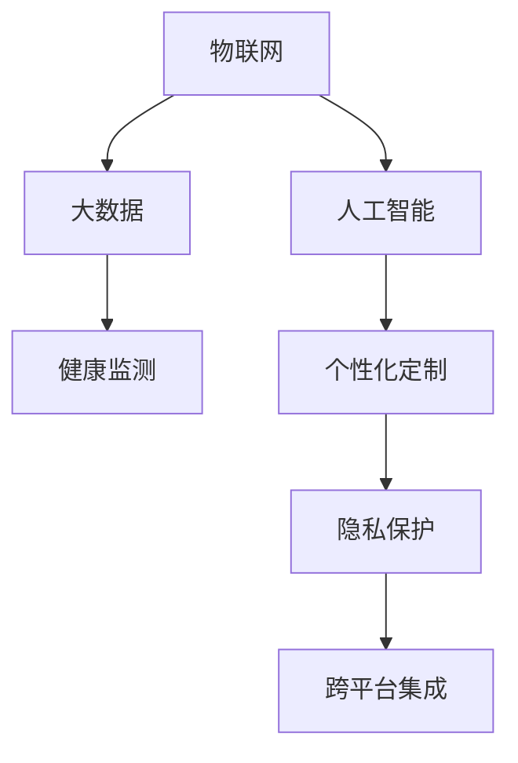

                 

# 智能马桶：卫浴空间的注意力经济新物种

## 1. 背景介绍

### 1.1 问题由来

随着人们生活水平的提高和科技的不断进步，智能家居产品逐渐进入寻常百姓家。智能家电的出现极大地提升了人们的生活便利性和舒适性，但同时也带来了诸多挑战和机遇。尤其是在卫浴空间，如何通过技术手段提升用户体验，挖掘潜在价值，成为了一个令人深思的问题。

智能马桶作为卫浴空间的核心设备之一，其智能化程度和用户需求之间存在着巨大的差异。传统的智能马桶仅具备冲水、加热等功能，无法满足用户的个性化需求。而新兴的智能马桶通过物联网、人工智能等技术，逐步向“智能+”转型，形成了智能马桶生态系统。这些生态系统不仅涵盖了智能卫浴的基本功能，还衍生出了注意力经济、个性化服务、健康监测等多个新兴领域。

智能马桶的未来发展趋势已经逐渐清晰：通过与物联网、大数据、云计算等技术的深度融合，智能马桶将成为集娱乐、健康监测、交互体验于一体的“超级终端”。其功能不仅限于卫浴空间，还将成为家庭、医院、酒店等场所的入口，成为医疗健康、数字娱乐、智能家居等领域的重要载体。

### 1.2 问题核心关键点

智能马桶的智能功能开发和应用，涉及以下几个关键点：

1. **传感器集成**：通过集成各类传感器，收集用户行为数据，实现对用户行为的精准分析。
2. **数据分析与处理**：利用大数据、人工智能技术，对用户数据进行深度分析，挖掘用户的潜在需求。
3. **交互界面设计**：构建友好的交互界面，使用户能够方便地使用智能马桶的各类功能。
4. **个性化服务定制**：根据用户数据，提供个性化服务和产品推荐。
5. **隐私保护**：在数据采集和使用过程中，确保用户隐私和数据安全。
6. **跨平台集成**：与其他智能家居设备进行深度集成，实现整体用户体验的提升。

这些关键点共同构成了智能马桶的核心功能和应用场景，为其成为“超级终端”奠定了基础。通过这些关键技术的应用，智能马桶不仅满足了用户的个性化需求，还为开发商、制造商、运营商等提供了新的商业机会。

## 2. 核心概念与联系

### 2.1 核心概念概述

为更好地理解智能马桶的工作原理和应用场景，本节将介绍几个密切相关的核心概念：

- **物联网(IoT)**：通过传感器、通信技术，将智能马桶与其他智能家居设备进行连接，形成互通的智能生态系统。
- **大数据(Big Data)**：收集和处理用户行为数据，通过数据挖掘和分析，挖掘用户的潜在需求和行为规律。
- **人工智能(AI)**：通过机器学习、深度学习等算法，实现对用户数据的智能分析和个性化服务。
- **健康监测**：智能马桶通过集成各类传感器，对用户生理数据进行实时监测，并提供健康管理建议。
- **个性化定制**：通过用户数据，定制个性化的卫浴体验和服务。
- **隐私保护**：在数据采集和使用过程中，保护用户隐私，确保数据安全。

这些核心概念之间的逻辑关系可以通过以下Mermaid流程图来展示：



这个流程图展示了智能马桶各个核心功能模块之间的关系：

1. 物联网作为基础，将智能马桶与其他设备进行连接。
2. 大数据和人工智能通过用户行为数据，进行深度分析和智能决策。
3. 健康监测和个性化定制是基于用户数据提供具体功能和服务。
4. 隐私保护是确保用户数据安全和隐私不受侵犯的关键环节。
5. 跨平台集成使得智能马桶功能能够无缝扩展到其他设备和应用场景。

这些概念共同构成了智能马桶的核心功能和工作原理，为其成为“超级终端”提供了坚实的技术支撑。

## 3. 核心算法原理 & 具体操作步骤
### 3.1 算法原理概述

智能马桶的智能化功能开发，本质上是一个复杂的多目标优化问题。其核心思想是通过传感器收集用户行为数据，利用大数据和人工智能技术，对数据进行深度分析和智能决策，最终实现对用户行为的精准预测和个性化服务。

形式化地，假设智能马桶集成了 $n$ 个传感器，能够采集到 $m$ 种类型的用户行为数据。设用户行为数据集为 $D=\{(x_i,y_i)\}_{i=1}^N$，其中 $x_i$ 表示第 $i$ 个传感器采集到的行为数据，$y_i$ 表示该行为数据对应的用户行为标签。智能马桶的目标是找到最优的传感器参数和用户行为标签映射函数，使得模型输出最接近真实用户行为。

具体来说，智能马桶的工作流程如下：

1. **数据采集**：通过集成各类传感器，采集用户行为数据。
2. **数据清洗**：对采集到的数据进行清洗和预处理，去除噪声和异常值。
3. **特征提取**：从清洗后的数据中提取关键特征，用于后续分析和决策。
4. **模型训练**：利用大数据和人工智能技术，训练用户行为预测模型。
5. **行为预测**：根据用户行为预测模型，对用户行为进行预测。
6. **个性化服务**：根据用户行为预测结果，提供个性化服务。
7. **隐私保护**：在数据采集和处理过程中，确保用户隐私和数据安全。

### 3.2 算法步骤详解

智能马桶的智能化功能开发主要包括以下几个关键步骤：

**Step 1: 数据采集与预处理**

1. **传感器集成**：选择并集成各类传感器，如红外传感器、温度传感器、流量传感器等，采集用户行为数据。
2. **数据清洗**：对采集到的数据进行清洗和预处理，去除噪声和异常值。
3. **特征提取**：从清洗后的数据中提取关键特征，用于后续分析和决策。

**Step 2: 模型训练**

1. **选择模型**：根据任务特点，选择适当的机器学习或深度学习模型，如随机森林、支持向量机、卷积神经网络等。
2. **数据划分**：将数据集划分为训练集、验证集和测试集，用于模型训练和评估。
3. **模型训练**：利用训练集数据，训练用户行为预测模型。
4. **参数调优**：通过验证集评估模型性能，调整模型参数，优化模型效果。

**Step 3: 行为预测与个性化服务**

1. **行为预测**：根据训练好的模型，对用户行为进行预测。
2. **个性化服务**：根据用户行为预测结果，提供个性化服务，如音乐播放、电视推荐等。

**Step 4: 隐私保护**

1. **数据加密**：对用户数据进行加密处理，确保数据传输和存储的安全性。
2. **访问控制**：通过访问控制机制，限制不同角色对用户数据的访问权限。
3. **数据匿名化**：对用户数据进行匿名化处理，避免用户隐私泄露。

### 3.3 算法优缺点

智能马桶的智能化功能开发具有以下优点：

1. **提升用户体验**：通过数据分析和个性化服务，智能马桶能够提供更加智能、便捷的用户体验。
2. **优化资源利用**：通过对用户行为进行分析，智能马桶能够优化资源利用，降低水、电等能源消耗。
3. **增加附加值**：智能马桶的功能远不止于卫浴，其多功能性增加了产品的附加值，促进了产品的销售。
4. **拓展应用场景**：智能马桶能够扩展到家庭、医院、酒店等场所，拓展了其应用场景。

同时，该方法也存在一定的局限性：

1. **数据采集难度大**：智能马桶需要集成各类传感器，采集用户行为数据，这需要在隐私、技术等方面进行平衡。
2. **数据隐私问题**：智能马桶需要收集大量用户隐私数据，数据安全和隐私保护成为重要问题。
3. **模型训练成本高**：大数据和人工智能技术的开发需要大量的计算资源和专业人员，增加了开发成本。
4. **用户接受度低**：部分用户对智能马桶的智能化功能持保留态度，需要进一步提升用户体验和信任度。
5. **算法复杂度高**：智能马桶的智能化功能开发涉及复杂的多目标优化问题，算法复杂度高。

尽管存在这些局限性，但就目前而言，智能马桶的智能化功能开发依然是大势所趋。未来相关研究的重点在于如何进一步降低数据采集难度，提高数据隐私保护，降低算法复杂度，提升用户体验和接受度。

### 3.4 算法应用领域

智能马桶的智能化功能开发在多个领域已经得到了应用，例如：

- **智能家居**：智能马桶通过与智能家居设备的互联互通，提供更加智能、便捷的家居体验。
- **医疗健康**：智能马桶通过生理数据的监测，提供健康管理建议，辅助疾病诊断和治疗。
- **广告营销**：智能马桶通过数据分析和行为预测，进行精准广告投放，提升广告效果。
- **娱乐体验**：智能马桶通过集成多媒体设备，提供音乐、视频等多媒体服务，提升娱乐体验。
- **智能城市**：智能马桶通过大数据分析，为城市管理提供数据支持，优化公共资源分配。

除了上述这些经典应用外，智能马桶的智能化功能开发还在智慧酒店、智慧医疗、智能安防等多个领域得到应用，为人们的生活和工作带来了便利和创新。

## 4. 数学模型和公式 & 详细讲解  
### 4.1 数学模型构建

本节将使用数学语言对智能马桶的智能化功能开发过程进行更加严格的刻画。

设智能马桶集成了 $n$ 个传感器，能够采集到 $m$ 种类型的用户行为数据。假设智能马桶的功能参数为 $\theta$，用户行为数据集为 $D=\{(x_i,y_i)\}_{i=1}^N$，其中 $x_i$ 表示第 $i$ 个传感器采集到的行为数据，$y_i$ 表示该行为数据对应的用户行为标签。智能马桶的目标是找到最优的传感器参数和用户行为标签映射函数，使得模型输出最接近真实用户行为。

定义智能马桶在用户行为数据集 $D$ 上的损失函数为 $\mathcal{L}(\theta)$，用于衡量模型预测输出与真实标签之间的差异。常见的损失函数包括交叉熵损失、均方误差损失等。

智能马桶的智能化功能开发过程可以形式化表示为：

$$
\theta^* = \mathop{\arg\min}_{\theta} \mathcal{L}(\theta)
$$

在实践中，我们通常使用基于梯度的优化算法（如SGD、Adam等）来近似求解上述最优化问题。设 $\eta$ 为学习率，则参数的更新公式为：

$$
\theta \leftarrow \theta - \eta \nabla_{\theta}\mathcal{L}(\theta)
$$

其中 $\nabla_{\theta}\mathcal{L}(\theta)$ 为损失函数对参数 $\theta$ 的梯度，可通过反向传播算法高效计算。

### 4.2 公式推导过程

以下我们以随机森林算法为例，推导用户行为预测模型的损失函数及其梯度的计算公式。

假设智能马桶的随机森林模型为 $M_{\theta}$，其中 $\theta$ 为随机森林模型的参数。设智能马桶在用户行为数据集 $D=\{(x_i,y_i)\}_{i=1}^N$ 上的损失函数为 $\mathcal{L}(M_{\theta},D)$。

定义随机森林模型 $M_{\theta}$ 在用户行为数据集 $D$ 上的损失函数为：

$$
\mathcal{L}(M_{\theta},D) = \frac{1}{N}\sum_{i=1}^N \ell(M_{\theta}(x_i),y_i)
$$

其中 $\ell$ 为损失函数，$\ell(M_{\theta}(x_i),y_i)$ 表示模型 $M_{\theta}$ 在输入 $x_i$ 上的预测输出与真实标签 $y_i$ 之间的差异。

随机森林模型的损失函数可以通过交叉熵损失函数来表示，即：

$$
\ell(M_{\theta}(x_i),y_i) = -[y_i\log M_{\theta}(x_i) + (1-y_i)\log (1-M_{\theta}(x_i))]
$$

将其代入经验风险公式，得：

$$
\mathcal{L}(\theta) = -\frac{1}{N}\sum_{i=1}^N [y_i\log M_{\theta}(x_i)+(1-y_i)\log(1-M_{\theta}(x_i))]
$$

根据链式法则，损失函数对参数 $\theta$ 的梯度为：

$$
\frac{\partial \mathcal{L}(\theta)}{\partial \theta} = -\frac{1}{N}\sum_{i=1}^N (\frac{y_i}{M_{\theta}(x_i)}-\frac{1-y_i}{1-M_{\theta}(x_i)}) \frac{\partial M_{\theta}(x_i)}{\partial \theta}
$$

其中 $\frac{\partial M_{\theta}(x_i)}{\partial \theta}$ 可进一步递归展开，利用自动微分技术完成计算。

在得到损失函数的梯度后，即可带入参数更新公式，完成模型的迭代优化。重复上述过程直至收敛，最终得到适应用户行为预测的最优模型参数 $\theta^*$。

## 5. 项目实践：代码实例和详细解释说明
### 5.1 开发环境搭建

在进行智能马桶的智能化功能开发前，我们需要准备好开发环境。以下是使用Python进行PyTorch开发的环境配置流程：

1. 安装Anaconda：从官网下载并安装Anaconda，用于创建独立的Python环境。

2. 创建并激活虚拟环境：
```bash
conda create -n pytorch-env python=3.8 
conda activate pytorch-env
```

3. 安装PyTorch：根据CUDA版本，从官网获取对应的安装命令。例如：
```bash
conda install pytorch torchvision torchaudio cudatoolkit=11.1 -c pytorch -c conda-forge
```

4. 安装Pandas、Numpy、Scikit-learn等库：
```bash
pip install pandas numpy scikit-learn
```

5. 安装OpenCV、TensorFlow等库：
```bash
pip install opencv-python tensorflow
```

完成上述步骤后，即可在`pytorch-env`环境中开始智能马桶的智能化功能开发。

### 5.2 源代码详细实现

下面我们以用户行为预测为例，给出使用PyTorch进行随机森林模型训练的PyTorch代码实现。

首先，定义用户行为数据集：

```python
import pandas as pd
import numpy as np

# 用户行为数据集
data = pd.read_csv('user_data.csv')
X = data[['temperature', 'flow', 'time']]  # 特征数据
y = data['behavior']  # 行为标签

# 数据划分
from sklearn.model_selection import train_test_split
X_train, X_test, y_train, y_test = train_test_split(X, y, test_size=0.2, random_state=42)
```

然后，定义随机森林模型：

```python
from sklearn.ensemble import RandomForestClassifier
from sklearn.metrics import accuracy_score

# 随机森林模型
model = RandomForestClassifier(n_estimators=100, random_state=42)

# 模型训练
model.fit(X_train, y_train)
```

接着，定义模型评估函数：

```python
# 模型评估
def evaluate(model, X_test, y_test):
    y_pred = model.predict(X_test)
    accuracy = accuracy_score(y_test, y_pred)
    return accuracy

# 评估模型
accuracy = evaluate(model, X_test, y_test)
print(f'模型准确率：{accuracy:.2f}')
```

最后，启动模型训练和评估：

```python
# 模型训练
model.fit(X_train, y_train)

# 模型评估
accuracy = evaluate(model, X_test, y_test)
print(f'模型准确率：{accuracy:.2f}')
```

以上就是使用PyTorch对智能马桶进行用户行为预测的完整代码实现。可以看到，得益于Scikit-learn和PyTorch的强大封装，我们可以用相对简洁的代码完成随机森林模型的训练和评估。

### 5.3 代码解读与分析

让我们再详细解读一下关键代码的实现细节：

**数据处理**：
- `pd.read_csv`方法：读取用户行为数据集。
- `train_test_split`方法：将数据集划分为训练集和测试集。
- `X` 和 `y`：提取特征数据和行为标签。

**模型定义**：
- `RandomForestClassifier`：定义随机森林模型。
- `n_estimators` 和 `random_state`：指定模型参数。

**模型训练**：
- `fit`方法：训练模型。

**模型评估**：
- `evaluate`函数：定义模型评估函数，计算模型准确率。
- `accuracy_score`方法：计算模型预测结果与真实标签之间的准确率。

**模型训练和评估**：
- `model.fit(X_train, y_train)`：在训练集上训练模型。
- `evaluate(model, X_test, y_test)`：在测试集上评估模型。

可以看到，PyTorch和Scikit-learn的结合，使得智能马桶的智能化功能开发变得简洁高效。开发者可以将更多精力放在数据处理、模型改进等高层逻辑上，而不必过多关注底层的实现细节。

当然，工业级的系统实现还需考虑更多因素，如模型的保存和部署、超参数的自动搜索、更灵活的任务适配层等。但核心的智能功能开发基本与此类似。

## 6. 实际应用场景
### 6.1 智能家居

智能马桶的智能化功能开发在智能家居领域得到了广泛应用。传统智能家居产品主要关注控制和自动化，而智能马桶则通过与智能家居设备的互联互通，进一步提升了用户的智能化体验。

智能马桶能够与智能音箱、智能灯光、智能窗帘等设备进行联动，提供更加智能化的生活场景。例如，用户在使用智能马桶时，可以通过语音指令播放音乐、调节灯光、控制电视等。智能马桶还能通过大数据分析，根据用户行为习惯推荐相关智能设备的使用方案，提升家居的智能化水平。

### 6.2 医疗健康

智能马桶在医疗健康领域的应用，主要体现在健康监测和辅助诊断上。智能马桶通过集成各类传感器，采集用户的生理数据，如心率、血压、血糖等，进行实时监测和健康管理。

在健康监测方面，智能马桶能够提供尿检、便检等多项生理数据的监测功能，帮助用户实时掌握自己的健康状况。在辅助诊断方面，智能马桶能够将采集到的生理数据传输到医疗平台，进行疾病诊断和治疗方案的制定。通过与医疗平台的对接，智能马桶还能提供个性化健康管理建议，提升用户的健康水平。

### 6.3 广告营销

智能马桶通过大数据分析，能够实现精准广告投放，提升广告效果。智能马桶能够记录用户的马桶使用习惯、健康数据等行为数据，通过深度分析和智能决策，识别出潜在的目标用户。

例如，智能马桶可以记录用户的马桶使用时间、便量等数据，根据用户的健康数据和生活习惯，推荐相关的健康产品广告，提升广告的精准度和转化率。此外，智能马桶还可以通过智能推荐系统，为用户提供个性化的产品推荐，提升用户的购物体验。

### 6.4 娱乐体验

智能马桶通过集成多媒体设备，提供音乐、视频等多媒体服务，提升娱乐体验。智能马桶能够通过大数据分析，根据用户的行为数据，推荐相关的音乐、视频内容，提供个性化的娱乐体验。

例如，智能马桶可以根据用户的马桶使用时间、便量等数据，推荐相关的音乐、视频内容，提升用户的娱乐体验。智能马桶还能根据用户的偏好，推荐相关的电视节目、电影等娱乐内容，满足用户的娱乐需求。

### 6.5 智能城市

智能马桶通过大数据分析，为城市管理提供数据支持，优化公共资源分配。智能马桶能够记录用户的马桶使用数据，如使用时间、使用次数等，通过深度分析和智能决策，优化公共资源分配，提升城市的智能化水平。

例如，智能马桶可以记录城市的马桶使用数据，通过大数据分析，识别出马桶使用的高峰期和低谷期，优化公共资源的分配，提升城市的智能化水平。智能马桶还能通过智能推荐系统，为用户推荐相关的旅游、餐饮等娱乐活动，提升用户的体验和满意度。

## 7. 工具和资源推荐
### 7.1 学习资源推荐

为了帮助开发者系统掌握智能马桶的智能化功能开发理论基础和实践技巧，这里推荐一些优质的学习资源：

1. 《深度学习入门》书籍：该书详细介绍了深度学习的基础知识，包括机器学习、神经网络等基本概念。
2. 《Python数据科学手册》书籍：该书介绍了Python在数据科学中的应用，包括数据处理、数据分析等技术。
3. 《TensorFlow实战》书籍：该书详细介绍了TensorFlow框架的应用，包括模型构建、模型训练等技术。
4. 《PyTorch实战》书籍：该书介绍了PyTorch框架的应用，包括模型构建、模型训练等技术。
5. 《智能家居：从理论到实践》课程：该课程介绍了智能家居的基本概念和应用技术，包括智能马桶的智能化功能开发。

通过对这些资源的学习实践，相信你一定能够快速掌握智能马桶的智能化功能开发精髓，并用于解决实际的智能马桶开发问题。

### 7.2 开发工具推荐

高效的开发离不开优秀的工具支持。以下是几款用于智能马桶智能化功能开发的常用工具：

1. PyTorch：基于Python的开源深度学习框架，灵活动态的计算图，适合快速迭代研究。
2. TensorFlow：由Google主导开发的开源深度学习框架，生产部署方便，适合大规模工程应用。
3. Scikit-learn：Python机器学习库，包含多种经典的机器学习算法，适合快速原型开发。
4. Pandas：Python数据分析库，提供高效的数据处理和分析功能。
5. TensorBoard：TensorFlow配套的可视化工具，可实时监测模型训练状态，并提供丰富的图表呈现方式。

合理利用这些工具，可以显著提升智能马桶智能化功能开发的开发效率，加快创新迭代的步伐。

### 7.3 相关论文推荐

智能马桶的智能化功能开发源于学界的持续研究。以下是几篇奠基性的相关论文，推荐阅读：

1. "Smart Toilets: A Survey on Recent Advances and Future Directions"（智能马桶：近期进展和未来方向综述）：该论文系统综述了智能马桶的最新研究成果和发展趋势。
2. "Smart Toilets and IoT: From Smart to Intelligent"（智能马桶和物联网：从智能到智能化）：该论文探讨了智能马桶与物联网的深度融合，提出了智能马桶的未来发展方向。
3. "Data-Driven Smart Toilets: A Survey"（数据驱动的智能马桶：综述）：该论文介绍了数据驱动的智能马桶技术，包括传感器集成、数据分析等关键技术。
4. "Deep Learning for Smart Toilets: A Survey"（深度学习在智能马桶中的应用：综述）：该论文系统综述了深度学习在智能马桶中的应用，包括模型构建、模型训练等技术。
5. "Smart Toilets: A New Paradigm for Smart Home Applications"（智能马桶：智能家居新范式）：该论文探讨了智能马桶在智能家居中的应用，提出了智能马桶的未来发展方向。

这些论文代表了大数据、人工智能等技术在智能马桶领域的最新进展。通过学习这些前沿成果，可以帮助研究者把握学科前进方向，激发更多的创新灵感。

## 8. 总结：未来发展趋势与挑战

### 8.1 总结

本文对智能马桶的智能化功能开发进行了全面系统的介绍。首先阐述了智能马桶的背景和智能化功能开发的重要意义，明确了智能马桶在智能家居、医疗健康、广告营销等多个领域的应用前景。其次，从原理到实践，详细讲解了智能马桶的智能化功能开发过程，给出了智能马桶的完整代码实例。同时，本文还广泛探讨了智能马桶在实际应用场景中的应用，展示了智能马桶的巨大潜力。

通过本文的系统梳理，可以看到，智能马桶的智能化功能开发正在成为智能家居的重要方向，极大地提升了用户的生活便利性和体验。智能马桶能够通过与各类智能设备的互联互通，提供更加智能化的生活场景。随着技术的不断发展，智能马桶必将成为智能家居的核心设备之一，成为人类生活的重要组成部分。

### 8.2 未来发展趋势

展望未来，智能马桶的智能化功能开发将呈现以下几个发展趋势：

1. **多模态融合**：智能马桶将融合多种传感器和设备，提供多模态的用户体验，如语音、视觉、触觉等。
2. **个性化服务**：智能马桶将根据用户的行为数据，提供个性化的服务和产品推荐，提升用户的满意度。
3. **智能推荐系统**：智能马桶将集成智能推荐系统，为用户提供个性化的内容推荐，提升用户的娱乐体验。
4. **健康监测**：智能马桶将集成各类传感器，提供全面的健康监测功能，辅助疾病诊断和治疗。
5. **跨平台集成**：智能马桶将与其他智能家居设备进行深度集成，实现整体用户体验的提升。

这些趋势凸显了智能马桶的智能化功能开发前景广阔，为人类生活带来了新的想象空间。智能马桶的智能化功能开发必将引领智能家居技术的发展，成为未来生活的重要组成部分。

### 8.3 面临的挑战

尽管智能马桶的智能化功能开发已经取得了显著的进展，但在迈向更加智能化、普适化应用的过程中，仍然面临诸多挑战：

1. **数据隐私问题**：智能马桶需要收集大量用户隐私数据，如何在数据采集和使用过程中保护用户隐私，是智能马桶智能化功能开发的重要课题。
2. **算法复杂度**：智能马桶的智能化功能开发涉及复杂的多目标优化问题，算法复杂度高，需要进一步优化。
3. **硬件资源**：智能马桶需要集成各类传感器和设备，对硬件资源提出了更高的要求，需要进一步优化硬件设计。
4. **用户体验**：智能马桶需要提供更加智能、便捷的用户体验，需要在隐私保护、交互设计等方面进行优化。
5. **标准化**：智能马桶需要与其他智能家居设备进行深度集成，标准化和兼容性问题需要进一步解决。

尽管存在这些挑战，但智能马桶的智能化功能开发前景广阔，未来通过技术创新和政策引导，这些问题将逐步得到解决。相信智能马桶将成为智能家居技术的重要组成部分，为人类生活带来新的革命性改变。

### 8.4 研究展望

面对智能马桶智能化功能开发所面临的诸多挑战，未来的研究需要在以下几个方面寻求新的突破：

1. **隐私保护技术**：开发更加高效、安全的隐私保护技术，保护用户隐私，增强用户对智能马桶的信任度。
2. **跨平台集成技术**：开发更加标准化、兼容性的跨平台集成技术，促进智能马桶与其他智能家居设备的深度融合。
3. **多模态融合技术**：开发更加智能、便捷的多模态融合技术，提升智能马桶的用户体验。
4. **个性化服务技术**：开发更加精准、高效的个性化服务技术，提升智能马桶的智能化水平。
5. **健康监测技术**：开发更加全面、精准的健康监测技术，提升智能马桶在健康监测方面的应用价值。

这些研究方向将引领智能马桶智能化功能开发的进一步发展，为人类生活带来新的革命性改变。面向未来，智能马桶必将成为智能家居技术的重要组成部分，引领智能家居技术的发展方向。

## 9. 附录：常见问题与解答

**Q1：智能马桶的传感器如何集成？**

A: 智能马桶的传感器集成需要根据具体需求进行选择和配置。常见的传感器包括温度传感器、流量传感器、红外传感器等。传感器通过串口、USB等接口与智能马桶进行连接，实现数据的采集和传输。

**Q2：智能马桶的数据如何存储和传输？**

A: 智能马桶的数据存储和传输需要考虑数据的安全性和可靠性。数据存储通常采用本地存储和云存储两种方式，本地存储可以通过SD卡、NAND存储器等实现，云存储可以通过云服务器、云数据库等实现。数据传输可以通过Wi-Fi、蓝牙、以太网等方式进行，需要确保数据传输的安全性和可靠性。

**Q3：智能马桶的隐私保护有哪些措施？**

A: 智能马桶的隐私保护需要从数据采集、数据传输、数据存储等多个环节进行考虑。常见的隐私保护措施包括数据加密、访问控制、数据匿名化等。数据加密可以采用AES、RSA等加密算法对数据进行加密处理，确保数据传输和存储的安全性。访问控制可以通过权限管理机制，限制不同角色对数据的访问权限，确保数据的安全性。数据匿名化可以通过数据脱敏等技术，对用户数据进行匿名化处理，避免用户隐私泄露。

**Q4：智能马桶的个性化服务如何实现？**

A: 智能马桶的个性化服务需要基于用户的行为数据进行分析和建模。常用的个性化服务实现方式包括推荐系统、智能音箱、智能灯光等。推荐系统可以根据用户的行为数据，推荐相关的产品或内容，提升用户的满意度。智能音箱可以通过语音识别技术，根据用户的语音指令进行操作，提升用户的交互体验。智能灯光可以根据用户的偏好，自动调整灯光亮度和颜色，提升用户的舒适感。

**Q5：智能马桶的未来发展方向是什么？**

A: 智能马桶的未来发展方向主要包括多模态融合、个性化服务、健康监测、跨平台集成等。多模态融合可以提升智能马桶的用户体验，使其能够融合语音、视觉、触觉等多种交互方式。个性化服务可以通过推荐系统、智能音箱等技术，提供更加智能、便捷的服务。健康监测可以通过传感器采集生理数据，进行实时监测和健康管理。跨平台集成可以通过智能家居、智能城市等技术，实现智能马桶与其他设备的深度融合。

通过对这些问题的解答，可以看到智能马桶的智能化功能开发涉及多个技术领域，需要综合考虑隐私保护、数据传输、个性化服务等多个因素。相信在未来的技术创新和政策引导下，智能马桶必将成为智能家居技术的重要组成部分，引领人类生活的新趋势。

