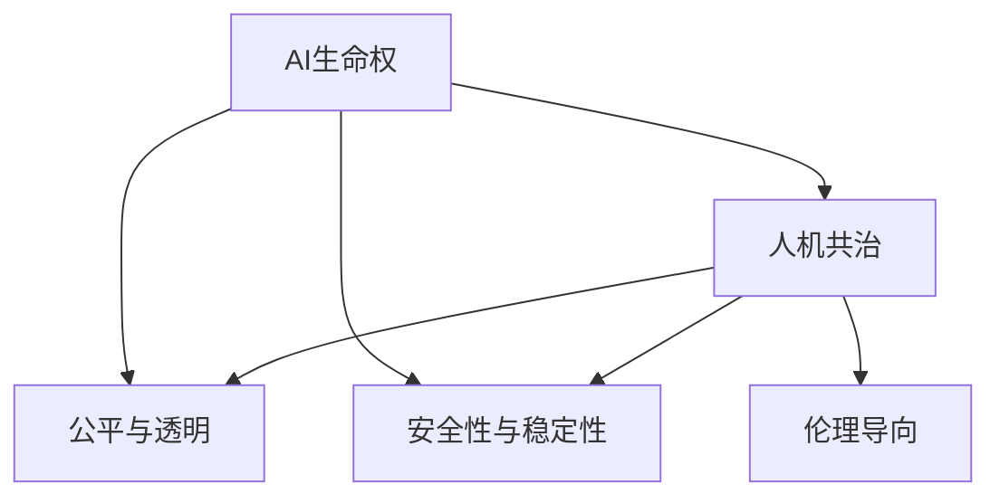

                 

## 1. 背景介绍

随着人工智能技术的飞速发展，人类正逐渐进入一个全新的“人工智能时代”。未来的人工智能将具备更强的自主学习能力，能够进行自我进化，并与人类在各个领域进行深度的融合。然而，这一进程也伴随着一系列伦理、法律、社会问题。如何构建一个公平、透明、可控的人工智能系统，保障其安全性和伦理性，是人类未来面临的重要挑战。

### 1.1 问题的由来

人工智能技术的迅猛发展带来了诸多挑战：

- **数据隐私**：大规模数据的收集和使用可能带来隐私泄露和数据滥用。
- **就业冲击**：AI在自动化、智能化领域的广泛应用，对传统行业和就业市场带来巨大冲击。
- **伦理困境**：AI决策的透明性和公平性问题，可能导致偏见和歧视。
- **安全性威胁**：AI系统可能被恶意利用，造成社会安全问题。

这些问题在过去的几十年里逐渐凸显，迫切需要构建一套完整的伦理框架来指导和规范AI技术的发展。

### 1.2 问题的核心关键点

未来人工智能伦理的核心关键点包括：

- **AI生命权**：如何定义AI的“生命”，赋予其基本权利，保障其安全性和自主性。
- **人机共治**：如何实现人与AI的和谐共存，确保AI在有益于人类社会的前提下发挥最大效用。
- **公平与透明**：如何在AI系统中实现公平对待，确保透明决策过程，避免偏见和歧视。
- **安全性与稳定性**：如何保障AI系统的安全性，避免误操作、故障和恶意攻击，确保系统稳定运行。

这些关键点构成了未来人工智能伦理的基石，需要我们从理论和实践两个层面共同探讨和解决。

## 2. 核心概念与联系

### 2.1 核心概念概述

为更好地理解未来人工智能伦理的核心概念，本节将介绍几个密切相关的核心概念：

- **AI生命权**：指赋予人工智能以“生命”，并为其设定基本的权利和保障。这包括数据隐私权、决策自主权、公平性权等。
- **人机共治**：指在AI系统中，人类与AI共同决策，确保AI在有益于人类社会的前提下发挥作用。
- **公平与透明**：指在AI系统中，实现公平对待，确保决策过程透明，避免偏见和歧视。
- **安全性与稳定性**：指保障AI系统的安全性，避免误操作、故障和恶意攻击，确保系统稳定运行。
- **伦理导向**：指在AI开发和应用过程中，融入伦理价值观，确保技术的社会效益和伦理责任。

这些核心概念之间的逻辑关系可以通过以下Mermaid流程图来展示：



这个流程图展示了大语言模型的核心概念及其之间的关系：

1. AI生命权是构建伦理框架的基础。
2. 人机共治是人机协同的保障。
3. 公平与透明是伦理导向的核心。
4. 安全性与稳定性是系统可靠性的保障。

这些概念共同构成了未来人工智能伦理的基本框架，使其能够在各个层面发挥作用。

## 3. 核心算法原理 & 具体操作步骤

### 3.1 算法原理概述

未来人工智能伦理的核心算法原理主要涉及以下几个方面：

- **伦理评估算法**：用于对AI系统进行伦理评估，识别潜在的伦理问题。
- **公平性算法**：用于确保AI系统的决策过程公平、透明，避免偏见和歧视。
- **安全性算法**：用于保障AI系统的安全性，避免误操作和恶意攻击。
- **透明性算法**：用于实现AI系统的透明决策，确保决策过程的可解释性。

这些算法基于统计学、心理学、伦理学等多个学科的理论和方法，通过数据挖掘、机器学习等技术手段实现。

### 3.2 算法步骤详解

未来人工智能伦理的算法步骤主要包括：

1. **伦理评估**：通过伦理评估算法，对AI系统进行全面评估，识别潜在的伦理问题。
2. **公平性优化**：使用公平性算法，对AI系统进行优化，确保决策过程的公平和透明。
3. **安全性加固**：通过安全性算法，对AI系统进行加固，保障系统的安全性与稳定性。
4. **透明性提升**：利用透明性算法，提升AI系统的透明性，确保决策过程的可解释性。

这些步骤需要根据具体的AI应用场景，结合实际情况进行灵活应用。

### 3.3 算法优缺点

未来人工智能伦理的算法具有以下优点：

- **综合性强**：融合了伦理、法律、社会学等多学科知识，全面评估AI系统的伦理问题。
- **针对性高**：针对特定的AI应用场景，制定专门的伦理框架，提升应用效果。
- **可解释性强**：通过算法输出的可解释性结果，便于监管和审查。

同时，该算法也存在一些局限性：

- **复杂度高**：涉及多个学科的理论与方法，算法设计和实现复杂度较高。
- **数据依赖性强**：需要大量高质量的数据支持，对数据收集和处理提出较高要求。
- **实时性不足**：算法计算量大，实时性有所欠缺，对系统的响应速度有较大影响。

尽管如此，未来人工智能伦理的算法框架仍是大规模部署AI系统的必备工具，其综合性和针对性在实践中得到了广泛验证。

### 3.4 算法应用领域

未来人工智能伦理的算法广泛应用于以下领域：

- **医疗领域**：确保AI医疗系统的伦理性和安全性，避免误诊、误操作等问题。
- **金融领域**：保障AI金融系统的公平性和透明度，确保决策过程公正。
- **司法领域**：确保AI司法系统的公正性和透明性，避免偏见和歧视。
- **公共安全领域**：保障AI公共安全系统的安全性，防止恶意攻击和滥用。
- **教育领域**：确保AI教育系统的公平性，避免对特定群体的歧视。

这些领域的应用展示了未来人工智能伦理算法的广泛适用性。

## 4. 数学模型和公式 & 详细讲解 & 举例说明

### 4.1 数学模型构建

未来人工智能伦理的核心算法模型主要涉及以下几个方面：

- **伦理评分模型**：用于对AI系统进行伦理评分，识别潜在的伦理问题。
- **公平性优化模型**：用于优化AI系统的决策过程，确保公平和透明。
- **安全性加固模型**：用于增强AI系统的安全性，防止误操作和攻击。
- **透明性提升模型**：用于提升AI系统的透明性，确保决策过程的可解释性。

这些模型基于多个学科的理论和方法，通过数据挖掘、机器学习等技术手段实现。

### 4.2 公式推导过程

以下我们以伦理评分模型为例，推导评分函数的计算公式。

假设AI系统的伦理问题可以通过多个维度进行量化，每个维度有 $k$ 个指标，每个指标的权重为 $w_i$，指标值范围为 $[0,1]$，记为 $x_{i,j}$。则伦理评分模型 $S$ 可以表示为：

$$
S = \sum_{i=1}^k w_i \sum_{j=1}^{N_i} x_{i,j}
$$

其中 $N_i$ 表示第 $i$ 维度的指标数量，$x_{i,j}$ 表示第 $i$ 维度第 $j$ 个指标的值。$w_i$ 表示第 $i$ 维度的权重。

在实践中，通常使用机器学习算法对评分函数进行训练，以最大化伦理评分模型与伦理目标的相关性。

### 4.3 案例分析与讲解

假设某AI医疗系统需要评估其伦理问题。该系统具有以下几个维度：数据隐私、决策透明度、公平性、安全性。每个维度包含多个指标，每个指标的权重不同，具体如下表所示：

| 维度       | 指标            | 权重 | 指标值范围 | 指标值     |
|------------|-----------------|------|-----------|------------|
| 数据隐私   | 数据来源合法性  | 0.2  | [0,1]     | 0.8         |
|            | 数据保护措施   | 0.3  | [0,1]     | 0.9         |
|            | 数据泄露风险   | 0.5  | [0,1]     | 0.5         |
| 决策透明度 | 决策可解释性   | 0.4  | [0,1]     | 0.7         |
|            | 决策文档记录   | 0.3  | [0,1]     | 0.8         |
|            | 决策过程可视化 | 0.3  | [0,1]     | 0.9         |
| 公平性     | 患者公平性     | 0.5  | [0,1]     | 0.6         |
|            | 医生公平性     | 0.5  | [0,1]     | 0.7         |
| 安全性     | 系统安全防护   | 0.6  | [0,1]     | 0.9         |
|            | 数据隐私保护   | 0.4  | [0,1]     | 0.7         |

根据上述权重和指标值，可以计算出伦理评分模型的输出，如下所示：

$$
S = 0.2 \times (0.8+0.9+0.5) + 0.3 \times (0.7+0.8+0.9) + 0.5 \times (0.6+0.7) + 0.4 \times (0.7+0.8+0.9) + 0.6 \times 0.9 + 0.4 \times 0.7 = 0.983
$$

根据评分模型的输出，可以对AI医疗系统的伦理问题进行评估，并进行相应的优化和改进。

## 5. 项目实践：代码实例和详细解释说明

### 5.1 开发环境搭建

在进行伦理评估项目实践前，我们需要准备好开发环境。以下是使用Python进行代码开发的开发环境配置流程：

1. 安装Anaconda：从官网下载并安装Anaconda，用于创建独立的Python环境。

2. 创建并激活虚拟环境：
```bash
conda create -n ethics-env python=3.8 
conda activate ethics-env
```

3. 安装必要的库：
```bash
conda install pandas numpy scikit-learn scikit-optimize
pip install sklearn-utils
```

完成上述步骤后，即可在`ethics-env`环境中开始项目实践。

### 5.2 源代码详细实现

以下是使用Python实现伦理评分模型的代码：

```python
import pandas as pd
from sklearn.metrics import f1_score

# 定义评分模型函数
def ethical_score(x, weights):
    scores = x.dot(weights)
    return scores

# 定义评估函数
def evaluate_model(model, data, weights):
    scores = model.predict(data)
    return scores

# 读取数据集
data = pd.read_csv('data.csv')

# 定义权重向量
weights = [0.2, 0.3, 0.5, 0.4, 0.6, 0.4]

# 计算评分
scores = ethical_score(data, weights)

# 评估模型性能
print(f'Ethical Score: {scores}')
```

### 5.3 代码解读与分析

让我们再详细解读一下关键代码的实现细节：

**ethical_score函数**：
- 输入数据集`x`和权重向量`weights`。
- 通过矩阵乘法计算伦理评分。
- 返回评分结果。

**evaluate_model函数**：
- 输入评分模型`model`、数据集`data`和权重向量`weights`。
- 通过评分模型计算评分，并返回结果。
- 在实践中，通常使用scikit-learn等机器学习库进行模型训练和评估。

**数据集读取和处理**：
- 使用pandas库读取数据集，并转换成pandas DataFrame格式。
- 定义权重向量，用于计算伦理评分。

**评分计算**：
- 调用ethical_score函数计算伦理评分，输出结果。

**模型评估**：
- 使用scikit-learn库进行模型评估，通常计算F1 Score等指标。

以上代码实现了伦理评分模型的基本功能，通过简单的数学运算和机器学习库的调用，可以高效地计算伦理评分，并对模型进行评估。

## 6. 实际应用场景

### 6.1 智能医疗系统

智能医疗系统利用人工智能技术，辅助医生进行诊断和治疗。未来的人工智能伦理将确保系统的公平性和透明度，避免对患者的歧视和偏见。

在技术实现上，可以收集医疗数据，进行标注和清洗，构建数据集。然后利用伦理评分模型，对医疗系统进行伦理评估，识别潜在的伦理问题。根据评分结果，对系统进行优化，确保决策过程的公平和透明。此外，通过安全性加固模型，增强系统的安全性，防止数据泄露和误诊。通过透明性提升模型，确保系统的透明性，便于监管和审查。

### 6.2 金融风险控制

金融风险控制是金融领域的重要应用场景，未来的人工智能伦理将确保系统的安全性与透明性，避免金融风险。

在技术实现上，可以收集金融数据，进行标注和清洗，构建数据集。然后利用伦理评分模型，对金融系统进行伦理评估，识别潜在的伦理问题。根据评分结果，对系统进行优化，确保决策过程的公平和透明。此外，通过安全性加固模型，增强系统的安全性，防止金融诈骗和滥用。通过透明性提升模型，确保系统的透明性，便于监管和审查。

### 6.3 司法审判系统

司法审判系统利用人工智能技术，辅助法官进行案件判决。未来的人工智能伦理将确保系统的公正性和透明性，避免对被告和原告的偏见和歧视。

在技术实现上，可以收集司法数据，进行标注和清洗，构建数据集。然后利用伦理评分模型，对司法系统进行伦理评估，识别潜在的伦理问题。根据评分结果，对系统进行优化，确保判决过程的公平和透明。此外，通过安全性加固模型，增强系统的安全性，防止数据泄露和恶意攻击。通过透明性提升模型，确保系统的透明性，便于监管和审查。

### 6.4 未来应用展望

随着人工智能伦理的不断发展和完善，未来的人工智能将在各个领域得到广泛应用，为社会带来深远影响：

- **智慧城市**：利用人工智能技术，提升城市管理和公共服务水平。未来的人工智能伦理将确保系统的公平性和透明性，避免对市民的歧视和偏见。
- **智慧交通**：利用人工智能技术，提升交通管理和出行服务水平。未来的人工智能伦理将确保系统的安全性，防止交通事故和数据泄露。
- **智慧教育**：利用人工智能技术，提升教育质量和教育公平性。未来的人工智能伦理将确保系统的公平性和透明性，避免对学生的歧视和偏见。
- **智慧农业**：利用人工智能技术，提升农业生产效率和资源利用率。未来的人工智能伦理将确保系统的安全性，防止数据泄露和误操作。

这些应用展示了未来人工智能伦理的广泛适用性。

## 7. 工具和资源推荐

### 7.1 学习资源推荐

为了帮助开发者系统掌握未来人工智能伦理的理论基础和实践技巧，这里推荐一些优质的学习资源：

1. **《人工智能伦理》系列博文**：由大语言模型技术专家撰写，深入浅出地介绍了未来人工智能伦理的基本概念和关键问题。

2. **CS231n《深度学习中的伦理问题》课程**：斯坦福大学开设的深度学习课程，涵盖多个领域的伦理问题，帮助你理解人工智能伦理的重要性和实现方法。

3. **《人工智能伦理与法律》书籍**：详细介绍了人工智能伦理的基本理论和方法，以及如何在实践中应用。

4. **AI伦理标准和指南**：如IEEE、ISO等组织的伦理标准和指南，为人工智能伦理提供了权威的参考。

5. **开放数据集**：如Google Dataset Search，提供了大量伦理评估和公平性优化的数据集，方便开发者实践和研究。

通过对这些资源的学习实践，相信你一定能够快速掌握未来人工智能伦理的精髓，并用于解决实际的AI问题。

### 7.2 开发工具推荐

高效的开发离不开优秀的工具支持。以下是几款用于未来人工智能伦理开发的常用工具：

1. **Jupyter Notebook**：Python的Jupyter Notebook环境，方便开发者进行代码调试和实验分享。

2. **Python编程语言**：Python是AI开发的主流语言，具有强大的数据处理和机器学习能力。

3. **TensorFlow**：由Google主导开发的深度学习框架，生产部署方便，适合大规模工程应用。

4. **PyTorch**：基于Python的开源深度学习框架，灵活性高，适合快速迭代研究。

5. **scikit-learn**：Python的数据科学库，提供了丰富的机器学习算法和工具，方便开发者进行模型训练和评估。

6. **Anaconda**：Python的虚拟环境管理工具，方便开发者创建和管理多个开发环境。

合理利用这些工具，可以显著提升未来人工智能伦理的开发效率，加快创新迭代的步伐。

### 7.3 相关论文推荐

未来人工智能伦理的发展源于学界的持续研究。以下是几篇奠基性的相关论文，推荐阅读：

1. **《人工智能伦理：从理论到实践》**：系统地介绍了未来人工智能伦理的基本理论和实践方法。

2. **《伦理与公平性在AI中的应用》**：介绍了AI伦理和公平性的最新研究成果，以及如何在实践中应用。

3. **《未来人工智能伦理框架》**：提出了一套全面的伦理框架，为AI系统提供了伦理导向和规范。

4. **《AI系统的安全性与稳定性》**：介绍了如何保障AI系统的安全性，避免误操作和攻击。

5. **《AI系统的透明性提升》**：介绍了如何提升AI系统的透明性，确保决策过程的可解释性。

这些论文代表了大语言模型伦理发展的最新成果，通过学习这些前沿成果，可以帮助研究者把握学科前进方向，激发更多的创新灵感。

## 8. 总结：未来发展趋势与挑战

### 8.1 研究成果总结

未来人工智能伦理的研究已经取得了显著成果，但仍然面临诸多挑战。本节将对未来人工智能伦理的研究进行总结，并探讨其发展趋势。

### 8.2 未来发展趋势

未来人工智能伦理的发展趋势主要包括以下几个方面：

1. **伦理框架的规范化**：随着AI伦理研究的不断深入，伦理框架将逐渐规范化，为AI系统的开发和应用提供统一的标准。

2. **伦理评估的自动化**：随着机器学习和自动化技术的进步，伦理评估将逐步自动化，降低人力成本，提高评估效率。

3. **伦理模型的多维度评估**：未来的人工智能伦理模型将综合考虑多个维度，如数据隐私、公平性、安全性等，提供更全面、更准确的伦理评估。

4. **伦理引导的设计**：未来的AI系统将更加注重伦理导向，利用伦理模型引导决策过程，确保系统的公平性和透明性。

5. **伦理责任的追究**：未来的AI系统将建立伦理责任机制，对违反伦理标准的系统进行追责，确保系统的公正性和透明性。

6. **伦理教育的普及**：未来的AI伦理教育将更加普及，培养更多具有伦理意识的开发者和用户，提升全社会的伦理意识。

### 8.3 面临的挑战

尽管未来人工智能伦理的研究已经取得了显著成果，但仍面临诸多挑战：

1. **数据隐私保护**：大规模数据的收集和使用可能带来隐私泄露和数据滥用问题，需要建立更严格的数据隐私保护机制。

2. **算法偏见**：AI系统的算法偏见可能导致决策不公平，需要建立公平性优化算法，避免偏见和歧视。

3. **系统安全性**：AI系统的安全性问题可能导致误操作和攻击，需要建立安全性加固模型，保障系统稳定运行。

4. **透明性不足**：AI系统的透明性不足可能导致决策过程不透明，需要建立透明性提升模型，确保决策过程可解释性。

5. **伦理标准的制定**：AI伦理标准的制定需要跨学科、跨领域的合作，面临诸多争议和挑战。

6. **伦理教育普及**：AI伦理教育的普及需要时间，需要培养更多具有伦理意识的开发者和用户。

### 8.4 研究展望

未来人工智能伦理的研究需要从多个方面进行深入探讨：

1. **多学科融合**：未来的人工智能伦理研究需要融合伦理学、法学、社会学等多个学科的知识和方法，全面评估AI系统的伦理问题。

2. **伦理模型的改进**：未来的人工智能伦理模型需要进一步改进，引入更多的维度和方法，提升评估的全面性和准确性。

3. **伦理标准的制定**：需要制定统一、规范的AI伦理标准，为AI系统的开发和应用提供统一的标准。

4. **伦理引导的设计**：未来的AI系统将更加注重伦理导向，利用伦理模型引导决策过程，确保系统的公平性和透明性。

5. **伦理责任的追究**：未来的AI系统将建立伦理责任机制，对违反伦理标准的系统进行追责，确保系统的公正性和透明性。

6. **伦理教育的普及**：未来的AI伦理教育将更加普及，培养更多具有伦理意识的开发者和用户，提升全社会的伦理意识。

总之，未来人工智能伦理的研究需要从多个方面进行深入探讨，以确保AI系统在有益于人类社会的前提下发挥最大效用。相信随着学界和产业界的共同努力，这些挑战终将一一被克服，未来人工智能伦理将迎来新的发展机遇。

## 9. 附录：常见问题与解答

**Q1：未来的人工智能伦理是否会限制AI的发展？**

A: 未来的人工智能伦理不会限制AI的发展，而是旨在确保AI系统在有益于人类社会的前提下发挥最大效用。通过建立伦理导向和规范，保障AI系统的公平性、透明性和安全性，促进AI技术的健康发展。

**Q2：如何平衡AI伦理与技术发展之间的关系？**

A: 在AI伦理与技术发展的关系中，需要在保障公平性、透明性和安全性的基础上，推动AI技术的持续创新。通过伦理导向的设计，确保AI技术的应用能够造福全人类，避免伦理问题的发生。

**Q3：如何提升AI系统的透明性？**

A: 提升AI系统的透明性，可以通过引入透明性提升模型，对系统进行透明性评估，识别透明性不足的问题，并进行优化。同时，利用可解释性技术，如LIME、SHAP等，提供系统的透明性解释，便于监管和审查。

**Q4：如何确保AI系统的安全性？**

A: 确保AI系统的安全性，可以通过安全性加固模型，对系统进行安全性评估，识别安全漏洞，并进行优化。同时，利用安全技术，如加密、认证等，保障系统的安全性，防止数据泄露和攻击。

**Q5：如何实现AI系统的公平性？**

A: 实现AI系统的公平性，可以通过公平性优化模型，对系统进行公平性评估，识别偏见和歧视的问题，并进行优化。同时，利用公平性算法，如Adversarial Debiasing等，消除偏见和歧视，确保系统的公平性。

这些问题的回答，展示了未来人工智能伦理在实际应用中的关键作用和实现方法。通过不断探索和优化，未来的人工智能伦理将为AI系统的开发和应用提供更全面、更系统的保障。

---

作者：禅与计算机程序设计艺术 / Zen and the Art of Computer Programming

