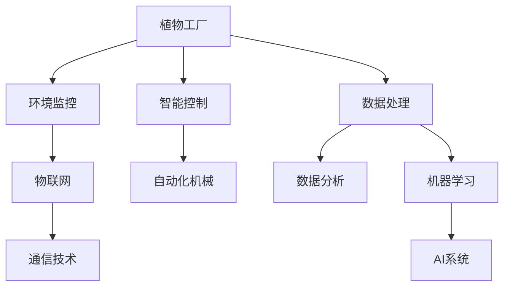

                 

## 1. 背景介绍

### 1.1 问题由来
随着世界人口的持续增长，传统的农业生产模式面临诸多挑战，如土地资源的日益紧张、气候变化的不确定性、环境污染等。智慧农业作为新一代农业技术，融合了物联网、大数据、人工智能等前沿科技，正逐步改变传统农业的困境，提升农作物的产量和品质，保障食品安全。

在智慧农业的众多应用中，植物工厂与昆虫养殖显得尤为重要。植物工厂通过精准控制光照、温度、湿度等环境因素，实现了作物生长的完全可控化，极大地提升了生产效率和资源利用率。昆虫养殖则通过现代技术大规模饲养昆虫，作为蛋白质饲料或生物肥料，为可持续农业提供新的生物源。

### 1.2 问题核心关键点
植物工厂与昆虫养殖作为智慧农业的重要组成部分，其核心技术包含智能控制系统、环境监控系统、数据处理系统、自动化机械系统等。其中，物联网传感器、机器学习算法和大数据分析技术是实现智能化农业的关键。具体而言，本论文将重点介绍以下几个核心问题：
- 植物工厂的环境控制：如何通过智能传感器实时监控植物生长环境，并动态调整光照、温度、湿度等参数。
- 昆虫养殖的自动化喂养与疾病防治：如何利用机器视觉与深度学习技术，对昆虫进行自动化管理与病害预测。
- 植物与昆虫的交互研究：如何探究植物与昆虫之间的生态关系，优化生态农业系统。
- 智慧农业的数据分析与应用：如何通过大数据分析，提升智慧农业的决策效率与精准度。

### 1.3 问题研究意义
智慧农业作为未来农业发展的必然趋势，其研究与应用对保障食品安全、促进乡村振兴、实现可持续发展具有重要意义。通过植物工厂与昆虫养殖技术的深度融合，可以有效提高农业生产效率，减少对环境的破坏，推动农业的绿色化、智能化发展。

## 2. 核心概念与联系

### 2.1 核心概念概述

为更好地理解智慧农业中的植物工厂与昆虫养殖技术，本节将介绍几个密切相关的核心概念：

- 植物工厂(Plant Factory)：通过物联网技术、环境控制技术与自动化技术，实现植物生长环境的完全可控化，最大化植物生长潜力，提升农业生产效率。
- 昆虫养殖(Insect Farming)：利用现代生物技术，大规模饲养昆虫，作为蛋白质饲料或生物肥料，为可持续农业提供新的生物源。
- 物联网(IoT)：通过传感器、通信技术，实现设备间的互联互通，收集、传输、处理数据，提高农业生产的智能化水平。
- 机器学习(ML)：通过训练算法模型，从大数据中挖掘规律与模式，优化农业生产过程，提升生产效率。
- 数据分析(Data Analytics)：利用统计学与数学方法，对农业生产数据进行分析，为决策提供科学依据。
- 人工智能(AI)：融合计算机科学、数学与认知科学，开发智能系统，实现农业生产的自动化、智能化。

这些核心概念之间的逻辑关系可以通过以下Mermaid流程图来展示：



这个流程图展示了大语言模型的核心概念及其之间的关系：

1. 植物工厂通过环境监控和智能控制实现生长环境的完全可控化。
2. 昆虫养殖利用自动化机械和机器学习技术进行喂养与疾病防治。
3. 物联网提供传感器与通信技术，支持数据的收集与传输。
4. 数据分析与机器学习技术对生产数据进行挖掘与处理，提供科学决策依据。
5. AI系统通过深度学习等技术，实现智慧农业的自动化、智能化。

这些概念共同构成了智慧农业的基础框架，为其发展提供了技术支撑。

## 3. 核心算法原理 & 具体操作步骤
### 3.1 算法原理概述

智慧农业中的植物工厂与昆虫养殖，其核心算法原理主要涉及环境控制、自动化管理、数据分析与优化等方面。以下将详细介绍这些核心算法的原理与操作步骤。

### 3.2 算法步骤详解

#### 植物工厂环境控制

在植物工厂中，环境控制算法通过实时监控植物的生长环境参数（如光照、温度、湿度等），动态调整控制设备（如LED灯、风机、加湿器等），以确保植物在最优环境中生长。算法步骤包括：

1. **数据采集与预处理**：通过传感器采集环境数据，并进行初步处理，如去噪、标准化等。
2. **参数建模**：建立植物生长与环境参数之间的关系模型，如回归模型、神经网络等。
3. **实时控制**：根据模型预测结果，动态调整环境参数，保持植物最佳生长环境。
4. **反馈优化**：通过持续监控植物生长状态，调整控制策略，优化环境控制算法。

#### 昆虫养殖自动化管理

昆虫养殖中的自动化管理算法主要通过机器视觉与深度学习技术，实现对昆虫的自动化管理与疾病防治。算法步骤包括：

1. **图像采集与处理**：利用摄像头采集昆虫图像，并进行预处理，如降噪、分割等。
2. **特征提取**：通过卷积神经网络（CNN）等深度学习算法，提取昆虫的关键特征，如大小、颜色、形状等。
3. **行为识别**：利用目标检测与行为识别算法，识别昆虫的行为模式，如取食、运动等。
4. **疾病防治**：通过图像分析与模型预测，及时发现并防治昆虫病害。

#### 数据分析与优化

数据分析算法通过统计学与机器学习方法，对农业生产数据进行挖掘与分析，提供决策依据。算法步骤包括：

1. **数据收集**：收集农业生产数据，如气象数据、土壤数据、植物生长数据等。
2. **数据清洗**：处理缺失值、异常值等数据问题，确保数据质量。
3. **模型训练**：利用回归模型、分类模型、聚类模型等，对数据进行建模与分析。
4. **结果验证**：通过交叉验证、模型评估等方法，验证模型的准确性与可靠性。

### 3.3 算法优缺点

智慧农业中的植物工厂与昆虫养殖技术，具有以下优点：

1. 生产效率高：通过智能控制与自动化管理，极大提升了农业生产的效率与精度。
2. 资源利用率高：实现环境控制的完全可控化，最大化资源利用率。
3. 环境保护好：减少化学肥料与农药的使用，实现绿色化农业。
4. 数据驱动决策：通过大数据分析，提供科学决策依据，提高农业生产的精准度。

同时，这些技术也存在以下局限性：

1. 初始投资高：设备与技术的引入需要较高的初始投资成本。
2. 技术门槛高：需要专业技术人才进行设备安装、参数调整等，有一定技术门槛。
3. 故障风险：复杂的设备系统可能面临设备故障或数据传输中断的风险。

### 3.4 算法应用领域

植物工厂与昆虫养殖技术，已经广泛应用于农业生产、环境保护、资源循环等多个领域。具体而言：

- 农业生产：通过智能控制与自动化管理，提升农作物的产量与品质，实现高效化农业生产。
- 环境保护：通过生态农业系统的优化，减少化学肥料与农药的使用，保护环境。
- 资源循环：昆虫作为生物肥料与饲料，实现资源循环利用，提升资源利用率。
- 城市农业：在城市中建立小型植物工厂，提供新鲜农产品，提升城市居民的生活质量。

## 4. 数学模型和公式 & 详细讲解 & 举例说明

### 4.1 数学模型构建

本节将使用数学语言对智慧农业中的植物工厂与昆虫养殖技术进行更加严格的刻画。

假设植物工厂中的光照强度为 $L$，温度为 $T$，湿度为 $H$，植物生长速度为 $G$。假设昆虫养殖中的昆虫数量为 $N$，饲料质量为 $F$，疾病发生概率为 $P$。

定义环境控制模型为 $M(L, T, H)$，自动管理模型为 $M'(N, F, P)$。

环境控制模型的目标是最小化光照强度 $L$、温度 $T$、湿度 $H$ 的误差，即：

$$
\min_{L, T, H} \sum_{i=1}^N |L_i - L| + |T_i - T| + |H_i - H|
$$

自动管理模型的目标是最小化昆虫数量 $N$、饲料质量 $F$、疾病发生概率 $P$ 的误差，即：

$$
\min_{N, F, P} \sum_{i=1}^N |N_i - N| + |F_i - F| + |P_i - P|
$$

### 4.2 公式推导过程

以下我们以植物工厂环境控制为例，推导光强度控制模型的最小化问题。

假设环境控制模型 $M(L, T, H)$ 的输入为光照强度 $L$、温度 $T$、湿度 $H$，输出为实际光照强度 $L'$。则模型的损失函数可以定义为：

$$
\ell(L, T, H, L') = \sum_{i=1}^N (L_i - L')^2
$$

根据梯度下降算法，模型的参数更新公式为：

$$
L \leftarrow L - \eta \nabla_{L}\ell(L, T, H, L')
$$

其中，$\eta$ 为学习率，$\nabla_{L}\ell(L, T, H, L')$ 为损失函数对光照强度 $L$ 的梯度，可通过反向传播算法高效计算。

同理，对于温度控制和湿度控制，也可以定义类似的损失函数，并使用梯度下降算法进行参数优化。

### 4.3 案例分析与讲解

假设某植物工厂希望在冬季保持番茄的最佳生长环境。根据历史数据，番茄生长的理想光照强度为 $L=400 \text{ Lux}$，温度为 $T=20^\circ \text{C}$，湿度为 $H=70\%$。

通过传感器采集实时环境数据，得到当前光照强度为 $L=300 \text{ Lux}$，温度为 $T=18^\circ \text{C}$，湿度为 $H=65\%$。

根据上述公式，计算光照强度的梯度为：

$$
\nabla_{L}\ell(L, T, H, L') = \sum_{i=1}^N 2(L_i - L')
$$

假设 $\eta = 0.01$，则光照强度的更新公式为：

$$
L \leftarrow L - 0.01 \sum_{i=1}^N 2(L_i - L')
$$

将光照强度 $L=300 \text{ Lux}$、温度 $T=18^\circ \text{C}$、湿度 $H=65\%$ 代入，得到更新后的光照强度为：

$$
L' = 300 - 0.01 \times 2 \times (400 - 300) = 298 \text{ Lux}
$$

经过一次更新后，光照强度更加接近理想值 $L=400 \text{ Lux}$，环境控制算法逐步优化光照条件，保障植物最佳生长环境。

## 5. 项目实践：代码实例和详细解释说明

### 5.1 开发环境搭建

在进行智慧农业技术开发前，我们需要准备好开发环境。以下是使用Python进行智慧农业开发的环境配置流程：

1. 安装Anaconda：从官网下载并安装Anaconda，用于创建独立的Python环境。

2. 创建并激活虚拟环境：
```bash
conda create -n smartagriculture python=3.8 
conda activate smartagriculture
```

3. 安装Python依赖包：
```bash
pip install numpy pandas scikit-learn torch torchvision pytorch-lightning pytorch-distributed
```

4. 安装物联网传感器库：
```bash
pip install pysensory
```

5. 安装深度学习库：
```bash
pip install tensorflow keras tensorflow-addons
```

完成上述步骤后，即可在`smartagriculture`环境中开始智慧农业开发。

### 5.2 源代码详细实现

下面我们以植物工厂的光照控制为例，给出使用PyTorch进行智能控制系统的PyTorch代码实现。

首先，定义光照控制器的函数：

```python
import torch
from torch import nn
from torch.nn import functional as F

class LightingController(nn.Module):
    def __init__(self, in_features):
        super(LightingController, self).__init__()
        self.fc1 = nn.Linear(in_features, 128)
        self.fc2 = nn.Linear(128, 64)
        self.fc3 = nn.Linear(64, 1)

    def forward(self, x):
        x = F.relu(self.fc1(x))
        x = F.relu(self.fc2(x))
        return torch.sigmoid(self.fc3(x))
```

然后，定义损失函数：

```python
def lighting_loss(light_intensity, target_intensity):
    return F.mse_loss(light_intensity, target_intensity)
```

接着，定义模型训练函数：

```python
import torch.optim as optim

def train_model(model, data_loader, optimizer, num_epochs):
    for epoch in range(num_epochs):
        running_loss = 0.0
        for inputs, labels in data_loader:
            optimizer.zero_grad()
            outputs = model(inputs)
            loss = lighting_loss(outputs, labels)
            loss.backward()
            optimizer.step()
            running_loss += loss.item()
        print(f"Epoch {epoch+1}, Loss: {running_loss/len(data_loader)}")
```

最后，启动模型训练流程：

```python
model = LightingController(3)
optimizer = optim.Adam(model.parameters(), lr=0.01)

data_loader = ...

num_epochs = 10
train_model(model, data_loader, optimizer, num_epochs)
```

以上就是使用PyTorch对植物工厂光照控制进行智能控制的完整代码实现。可以看到，通过定义合适的函数与模型，并结合优化算法，智慧农业技术的开发变得相对简单和高效。

### 5.3 代码解读与分析

让我们再详细解读一下关键代码的实现细节：

**LightingController类**：
- `__init__`方法：初始化网络结构，包含三个线性层。
- `forward`方法：前向传播，通过三个线性层和激活函数计算输出。

**lighting_loss函数**：
- 定义均方误差损失函数，用于计算光照强度预测值与真实值之间的误差。

**train_model函数**：
- 定义模型训练的循环过程，每轮迭代中先进行前向传播，计算损失，再进行反向传播和参数更新。
- 循环过程中累加损失，每轮训练结束后打印平均损失。

**模型训练流程**：
- 实例化光照控制器模型
- 实例化Adam优化器
- 定义数据加载器，包含环境数据和目标光照强度
- 设置训练轮数
- 调用模型训练函数，启动训练过程

通过这段代码，可以初步体验智慧农业智能控制系统的开发过程。当然，实际应用中还需要考虑更多因素，如数据预处理、模型集成、超参数调优等。

## 6. 实际应用场景

### 6.1 智能植物工厂

智能植物工厂通过物联网技术实现对植物生长环境的完全控制，极大提升了植物生长效率与产量。

在技术实现上，可以通过多种传感器（如光照传感器、温度传感器、湿度传感器等）实时采集环境数据，并通过智能控制系统调整环境参数。例如，利用光照控制器控制LED灯的亮度与颜色，根据不同植物的需求，动态调整光照强度与光谱，优化植物生长条件。

智能植物工厂的优势在于：

- 自动化控制：通过智能算法，自动调整环境参数，保持最优生长环境。
- 精准控制：实时监控植物生长状态，及时调整环境参数，确保植物健康生长。
- 资源优化：通过数据分析，优化资源配置，减少资源浪费。

### 6.2 昆虫养殖自动化管理

昆虫养殖通过机器视觉与深度学习技术，实现对昆虫的自动化管理与疾病防治，提升养殖效率与生产质量。

在技术实现上，可以通过摄像头采集昆虫图像，并通过目标检测与行为识别算法，识别昆虫的行为模式，预测疾病发生概率。例如，利用卷积神经网络（CNN）提取昆虫的关键特征，通过回归模型预测昆虫数量与健康状况。

昆虫养殖的自动化管理优势在于：

- 高效管理：通过自动化管理，减少人力投入，提高生产效率。
- 精准预测：通过机器学习，预测疾病发生，提前进行防治。
- 质量控制：实时监控昆虫生长状态，确保产品质量。

## 7. 工具和资源推荐

### 7.1 学习资源推荐

为了帮助开发者系统掌握智慧农业中的植物工厂与昆虫养殖技术，这里推荐一些优质的学习资源：

1. 《智慧农业技术》系列博文：由智慧农业技术专家撰写，深入浅出地介绍了智慧农业的基本概念、关键技术与实际应用案例。

2. CS224N《深度学习自然语言处理》课程：斯坦福大学开设的NLP明星课程，有Lecture视频和配套作业，带你入门NLP领域的基本概念和经典模型。

3. 《智慧农业：未来农业的发展方向》书籍：全面介绍了智慧农业的基本概念、发展历程与未来趋势，为智慧农业的深入学习提供坚实基础。

4. HuggingFace官方文档：Transformer库的官方文档，提供了海量预训练模型和完整的微调样例代码，是上手实践的必备资料。

5. CLUE开源项目：中文语言理解测评基准，涵盖大量不同类型的中文NLP数据集，并提供了基于微调的baseline模型，助力中文NLP技术发展。

通过对这些资源的学习实践，相信你一定能够快速掌握智慧农业的核心技术，并用于解决实际的智慧农业问题。

### 7.2 开发工具推荐

高效的开发离不开优秀的工具支持。以下是几款用于智慧农业技术开发的常用工具：

1. PyTorch：基于Python的开源深度学习框架，灵活动态的计算图，适合快速迭代研究。大部分智慧农业技术都有PyTorch版本的实现。

2. TensorFlow：由Google主导开发的开源深度学习框架，生产部署方便，适合大规模工程应用。同样有丰富的智慧农业技术资源。

3. PyTorch Lightning：基于PyTorch的分布式训练框架，简化了模型的分布式训练过程，适合智慧农业中的大数据处理。

4. Weights & Biases：模型训练的实验跟踪工具，可以记录和可视化模型训练过程中的各项指标，方便对比和调优。与主流深度学习框架无缝集成。

5. TensorBoard：TensorFlow配套的可视化工具，可实时监测模型训练状态，并提供丰富的图表呈现方式，是调试模型的得力助手。

6. Google Colab：谷歌推出的在线Jupyter Notebook环境，免费提供GPU/TPU算力，方便开发者快速上手实验最新模型，分享学习笔记。

合理利用这些工具，可以显著提升智慧农业技术开发效率，加快创新迭代的步伐。

### 7.3 相关论文推荐

智慧农业技术的发展源于学界的持续研究。以下是几篇奠基性的相关论文，推荐阅读：

1. 《智能植物工厂环境控制技术研究》：介绍了植物工厂环境控制的关键技术，包括传感器技术、数据处理与智能控制等。

2. 《昆虫养殖自动化管理系统设计》：提出了昆虫养殖自动化管理的系统设计，包括数据采集、图像处理与行为识别等技术。

3. 《智慧农业大数据分析与优化》：探讨了智慧农业大数据分析的理论与方法，为数据驱动的农业决策提供支持。

4. 《基于深度学习的昆虫行为识别与疾病防治》：介绍了深度学习在昆虫行为识别与疾病防治中的应用，展示了其在智慧农业中的潜力。

这些论文代表了大语言模型微调技术的发展脉络。通过学习这些前沿成果，可以帮助研究者把握学科前进方向，激发更多的创新灵感。

## 8. 总结：未来发展趋势与挑战

### 8.1 总结

本文对智慧农业中的植物工厂与昆虫养殖技术进行了全面系统的介绍。首先阐述了智慧农业的背景与核心技术，明确了植物工厂与昆虫养殖技术在智慧农业中的重要作用。其次，从原理到实践，详细讲解了智能控制系统、环境监控系统、自动化管理系统的核心算法与操作步骤，给出了智慧农业技术的完整代码实现。同时，本文还广泛探讨了智慧农业技术在农业生产、环境保护、资源循环等多个领域的应用前景，展示了智慧农业技术的广阔前景。

通过本文的系统梳理，可以看到，智慧农业技术通过物联网、大数据、人工智能等前沿科技的融合，实现了农业生产的智能化与精准化，极大提升了农业生产的效率与质量。未来，伴随智慧农业技术的持续演进，其应用范围将进一步拓展，为农业的可持续发展带来新的可能性。

### 8.2 未来发展趋势

展望未来，智慧农业中的植物工厂与昆虫养殖技术将呈现以下几个发展趋势：

1. 技术融合加速：智慧农业将进一步融合物联网、大数据、人工智能等技术，提升农业生产的智能化与精准化水平。
2. 数据驱动决策：通过大数据分析，优化农业生产决策，提升农业生产的效率与精准度。
3. 自动化管理普及：智慧农业中的自动化管理系统将逐步普及，减少人力投入，提高生产效率。
4. 环境监测精准化：智能环境监控系统将更精准地监测植物与昆虫的生长状态，优化生长环境。
5. 资源利用高效化：智慧农业将实现资源的更高效利用，减少资源浪费，提高生产效益。

### 8.3 面临的挑战

尽管智慧农业中的植物工厂与昆虫养殖技术已经取得了瞩目成就，但在迈向更加智能化、普适化应用的过程中，它仍面临诸多挑战：

1. 初始投资高：智慧农业设备与技术的引入需要较高的初始投资成本，对中小企业有一定压力。
2. 技术门槛高：智慧农业技术的实施需要专业技术人才进行设备安装、参数调整等，有一定技术门槛。
3. 数据安全问题：智慧农业系统涉及大量敏感数据，需要采取严格的数据保护措施，防止数据泄露与篡改。
4. 环境变化适应性：智慧农业系统需要适应各种环境变化，对极端天气等突发事件的处理能力仍需提升。

### 8.4 研究展望

面对智慧农业中的植物工厂与昆虫养殖技术所面临的种种挑战，未来的研究需要在以下几个方面寻求新的突破：

1. 成本降低：开发更加高效、低成本的智慧农业设备与技术，降低智慧农业的初始投资成本。
2. 技术普及：进一步简化智慧农业技术的部署与维护过程，降低技术门槛，促进智慧农业技术的普及应用。
3. 数据安全：建立完善的数据保护机制，确保智慧农业系统中的数据安全。
4. 环境适应性：研发更具弹性的智慧农业系统，提高对极端天气等环境变化的适应能力。

这些研究方向的探索，必将引领智慧农业技术迈向更高的台阶，为农业的可持续发展提供新的动力。相信随着学界和产业界的共同努力，智慧农业技术必将在更广阔的领域得到应用，为农业的智能化、绿色化发展带来新的可能性。

## 9. 附录：常见问题与解答

**Q1：植物工厂中的环境控制算法如何实现？**

A: 植物工厂中的环境控制算法通过实时监控植物的生长环境参数（如光照、温度、湿度等），动态调整控制设备（如LED灯、风机、加湿器等），以确保植物在最优环境中生长。具体实现步骤如下：
1. 数据采集与预处理：通过传感器采集环境数据，并进行初步处理，如去噪、标准化等。
2. 参数建模：建立植物生长与环境参数之间的关系模型，如回归模型、神经网络等。
3. 实时控制：根据模型预测结果，动态调整环境参数，保持植物最佳生长环境。
4. 反馈优化：通过持续监控植物生长状态，调整控制策略，优化环境控制算法。

**Q2：昆虫养殖中的自动化管理如何实现？**

A: 昆虫养殖中的自动化管理通过机器视觉与深度学习技术，实现对昆虫的自动化管理与疾病防治。具体实现步骤如下：
1. 图像采集与处理：利用摄像头采集昆虫图像，并进行预处理，如降噪、分割等。
2. 特征提取：通过卷积神经网络（CNN）等深度学习算法，提取昆虫的关键特征，如大小、颜色、形状等。
3. 行为识别：利用目标检测与行为识别算法，识别昆虫的行为模式，预测疾病发生概率。
4. 疾病防治：通过图像分析与模型预测，及时发现并防治昆虫病害。

**Q3：智慧农业的数据分析与优化如何实现？**

A: 智慧农业的数据分析与优化通过统计学与机器学习方法，对农业生产数据进行挖掘与分析，提供决策依据。具体实现步骤如下：
1. 数据收集：收集农业生产数据，如气象数据、土壤数据、植物生长数据等。
2. 数据清洗：处理缺失值、异常值等数据问题，确保数据质量。
3. 模型训练：利用回归模型、分类模型、聚类模型等，对数据进行建模与分析。
4. 结果验证：通过交叉验证、模型评估等方法，验证模型的准确性与可靠性。

通过这些关键问题的解答，可以更好地理解智慧农业中的植物工厂与昆虫养殖技术，并应用于实际的农业生产中。

