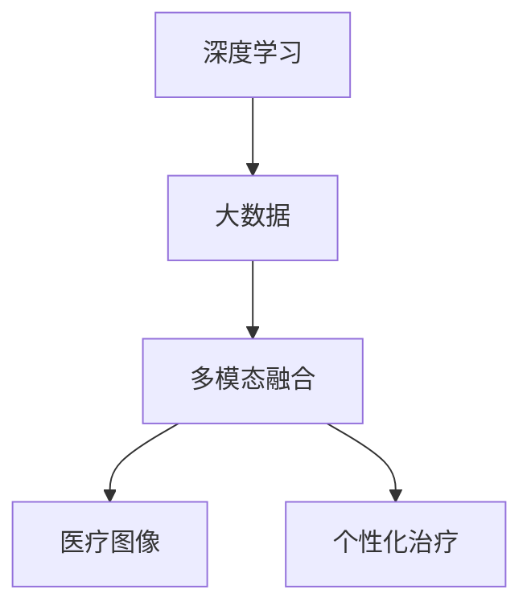

                 

# 未来的智慧医疗：2050年的精准医疗与智能辅助诊断

> 关键词：精准医疗, 智能辅助诊断, 深度学习, 大数据, 多模态融合, 医疗图像, 个性化治疗

## 1. 背景介绍

随着科技的迅猛发展和全球人口老龄化的加剧，未来的医疗健康领域将面临严峻挑战。面对日益增长的疾病负担和不断增长的医疗需求，如何通过技术创新来提升医疗服务质量、降低医疗成本、实现精准医疗，是全球医学界共同关注的重要议题。

### 1.1 现状分析
当前医疗健康领域存在许多痛点问题：
- 医疗资源不足。优质医疗资源集中在少数地区，农村和偏远地区的医疗服务质量和可及性相对较差。
- 诊断效率低下。传统医疗诊断主要依赖医生经验和手动操作，耗时长、误诊率高。
- 医疗成本高昂。医疗费用居高不下，给患者和家庭带来沉重的经济负担。
- 个性化治疗缺乏。个性化医疗服务需要大量数据支撑，目前数据收集和分析技术尚未成熟。

### 1.2 未来展望
未来的智慧医疗将基于深度学习、大数据、人工智能等多项先进技术，实现精准医疗和智能辅助诊断，助力医疗服务效率提升、医疗成本降低、个性化医疗服务普及。具体目标包括：
- 提升诊断效率和精度。通过深度学习模型自动分析医学影像和基因组数据，实现快速准确的疾病诊断。
- 降低医疗成本。利用智能算法优化医疗资源配置和药品使用，降低医疗支出。
- 实现个性化治疗。基于患者个体数据，构建个性化的治疗方案，实现“一人一策”。

## 2. 核心概念与联系

### 2.1 核心概念概述

为更好地理解未来的精准医疗与智能辅助诊断，本节将介绍几个关键概念：

- **深度学习**：一种基于神经网络的学习范式，通过多层次非线性映射，自动从数据中学习特征表示，进而进行分类、回归、生成等任务。
- **大数据**：指体量巨大、类型多样、实时生成的数据集，通过数据挖掘和分析，能够提供科学决策的依据。
- **多模态融合**：指将多种类型的数据（如医学影像、基因组数据、临床数据等）进行融合，获取更全面、准确的疾病信息。
- **医疗图像**：指医疗过程中获取的各类图像数据，如X光片、CT、MRI等，用于辅助诊断和治疗决策。
- **个性化治疗**：根据患者的个体特征和病史，量身定制的治疗方案，提高治疗效果。

这些概念之间的关系可以通过以下Mermaid流程图来展示：



该流程图展示了深度学习、大数据、多模态融合、医疗图像和个性化治疗之间的关系：深度学习从大数据中学习特征，多模态融合将不同类型的数据进行整合，医疗图像作为大数据的重要组成部分，个性化治疗则通过深度学习和多模态融合的结果来实现。

## 3. 核心算法原理 & 具体操作步骤
### 3.1 算法原理概述

未来精准医疗与智能辅助诊断的核心算法原理，主要基于深度学习、大数据分析和多模态融合技术。其核心思想是：通过深度学习模型自动从海量医疗数据中学习疾病的特征表示，结合大数据分析和多模态融合，获取全面的疾病信息，辅助医生进行精准诊断和治疗决策。

形式化地，假设医疗数据集为 $D=\{(x_i, y_i)\}_{i=1}^N$，其中 $x_i$ 为患者病例，包括病历记录、医学影像、基因组数据等，$y_i$ 为疾病标签。目标是通过深度学习模型，预测患者是否患有某种疾病，并给出诊断建议和治疗方案。

### 3.2 算法步骤详解

基于深度学习的精准医疗与智能辅助诊断一般包括以下几个关键步骤：

**Step 1: 数据准备与预处理**
- 收集患者病例数据，包括病历记录、医学影像、基因组数据等。
- 对数据进行清洗、标准化、去噪等预处理，去除异常值和噪声数据，确保数据质量。

**Step 2: 特征提取与表示学习**
- 利用深度学习模型（如卷积神经网络CNN、循环神经网络RNN、变换器Transformer等），自动从数据中学习特征表示。
- 将学习到的特征表示与临床数据、基因数据等进行融合，获取更全面、准确的疾病信息。

**Step 3: 模型训练与评估**
- 使用训练集数据，训练深度学习模型，优化模型参数，使得模型能够准确预测疾病。
- 在验证集上评估模型性能，根据评估结果调整模型参数，避免过拟合。

**Step 4: 诊断与治疗决策**
- 将患者新病例输入训练好的模型，获取预测结果。
- 结合医生的临床经验，综合多模态数据，制定个性化治疗方案。

### 3.3 算法优缺点

基于深度学习的精准医疗与智能辅助诊断方法具有以下优点：
1. 自动化处理：深度学习模型可以自动从数据中学习特征表示，减少人工干预，提升处理效率。
2. 高精度：通过多层次特征表示，深度学习模型能够有效避免过拟合，提高诊断准确率。
3. 泛化性强：深度学习模型经过大规模数据训练，具有较强的泛化能力，能够适应不同的疾病和患者。
4. 集成性强：深度学习模型能够与其他算法（如大数据分析、多模态融合）进行无缝集成，提升综合能力。

同时，该方法也存在一定的局限性：
1. 数据需求量大：深度学习模型需要大量标注数据进行训练，数据获取和标注成本较高。
2. 模型复杂度高：深度学习模型参数量巨大，训练和推理过程中需要高性能计算资源。
3. 可解释性不足：深度学习模型的决策过程难以解释，医生难以理解和接受。
4. 伦理风险：深度学习模型可能学习到患者隐私信息，带来数据安全和隐私保护问题。

尽管存在这些局限性，但基于深度学习的精准医疗与智能辅助诊断方法仍是大数据和人工智能在医疗健康领域的经典应用范式。未来相关研究的重点在于如何进一步降低数据需求，提高模型可解释性，同时兼顾数据安全和隐私保护等因素。

### 3.4 算法应用领域

基于深度学习的精准医疗与智能辅助诊断方法，在医疗健康领域已经得到了广泛的应用，覆盖了几乎所有常见任务，例如：

- **医学影像分析**：利用深度学习模型自动分析X光片、CT、MRI等医学影像，辅助医生进行疾病诊断。
- **基因组数据分析**：通过深度学习模型分析基因组数据，预测遗传病风险，辅助个性化治疗。
- **电子病历分析**：利用自然语言处理技术处理电子病历数据，提取病情信息，辅助诊断和治疗。
- **药物研发**：通过深度学习模型分析药物分子结构，预测药物效果，加速新药研发进程。
- **患者监护**：利用深度学习模型分析患者生理数据，实时监测健康状况，提高监护效率。
- **健康预测**：通过深度学习模型分析患者行为数据，预测疾病风险，实现健康预警。

除了上述这些经典任务外，深度学习技术还被创新性地应用到更多场景中，如智能问诊、康复治疗、远程医疗等，为医疗健康技术带来了新的突破。随着深度学习模型和算法方法的不断进步，相信在医疗健康领域，深度学习技术还将发挥更大的作用。

## 4. 数学模型和公式 & 详细讲解
### 4.1 数学模型构建

本节将使用数学语言对基于深度学习的精准医疗与智能辅助诊断过程进行更加严格的刻画。

记医疗数据集为 $D=\{(x_i, y_i)\}_{i=1}^N$，其中 $x_i$ 为患者病例，包括病历记录、医学影像、基因组数据等，$y_i$ 为疾病标签。定义深度学习模型的损失函数为：

$$
\mathcal{L}(\theta) = \frac{1}{N}\sum_{i=1}^N \ell(y_i, f_\theta(x_i))
$$

其中 $\theta$ 为模型参数，$f_\theta$ 为模型预测函数，$\ell$ 为损失函数，可以是交叉熵损失、均方误差损失等。

### 4.2 公式推导过程

以医学影像分类任务为例，假设使用卷积神经网络（CNN）模型进行诊断。CNN模型的损失函数可以表示为：

$$
\mathcal{L}(\theta) = \frac{1}{N}\sum_{i=1}^N \ell(y_i, f_\theta(x_i)) = \frac{1}{N}\sum_{i=1}^N -y_i \log f_\theta(x_i) - (1-y_i) \log (1-f_\theta(x_i))
$$

其中 $y_i$ 为疾病标签，$f_\theta(x_i)$ 为CNN模型对输入 $x_i$ 的预测结果，$\ell$ 为交叉熵损失函数。

在得到损失函数后，通过反向传播算法计算梯度，使用优化器（如Adam、SGD等）更新模型参数，最小化损失函数。具体步骤如下：

1. 将患者病例 $x_i$ 输入CNN模型，得到预测结果 $f_\theta(x_i)$。
2. 计算交叉熵损失 $\ell(y_i, f_\theta(x_i))$。
3. 计算梯度 $\nabla_\theta \mathcal{L}(\theta)$。
4. 使用优化器更新模型参数 $\theta$。
5. 重复上述步骤直至模型收敛。

### 4.3 案例分析与讲解

以医学影像分类为例，假设我们要训练一个CNN模型来分类乳腺癌的影像数据。数据集包含1000个影像样本，其中500个为正常影像，500个为癌变影像。

- **数据准备**：收集影像数据，并进行预处理，包括归一化、裁剪、旋转等操作。
- **模型构建**：设计卷积神经网络模型，包括卷积层、池化层、全连接层等，并使用softmax激活函数输出预测概率。
- **模型训练**：使用训练集数据进行模型训练，通过反向传播算法和优化器更新模型参数。
- **模型评估**：在验证集上评估模型性能，通过准确率、精确率、召回率等指标评估模型效果。
- **诊断应用**：将新患者的影像数据输入训练好的模型，获取预测结果，结合医生的诊断经验，进行疾病诊断。

## 5. 项目实践：代码实例和详细解释说明
### 5.1 开发环境搭建

在进行深度学习模型训练和推理前，我们需要准备好开发环境。以下是使用Python进行TensorFlow和Keras开发的环境配置流程：

1. 安装Anaconda：从官网下载并安装Anaconda，用于创建独立的Python环境。

2. 创建并激活虚拟环境：
```bash
conda create -n tf-env python=3.8 
conda activate tf-env
```

3. 安装TensorFlow和Keras：根据CUDA版本，从官网获取对应的安装命令。例如：
```bash
pip install tensorflow==2.4.0 keras==2.4.3 
```

4. 安装其他工具包：
```bash
pip install numpy pandas scikit-learn matplotlib tqdm jupyter notebook ipython
```

完成上述步骤后，即可在`tf-env`环境中开始深度学习模型的开发。

### 5.2 源代码详细实现

下面我们以医学影像分类为例，给出使用TensorFlow和Keras对CNN模型进行深度学习训练和推理的PyTorch代码实现。

首先，定义CNN模型：

```python
from tensorflow.keras.models import Sequential
from tensorflow.keras.layers import Conv2D, MaxPooling2D, Flatten, Dense, Dropout

model = Sequential()
model.add(Conv2D(32, (3, 3), activation='relu', input_shape=(32, 32, 3)))
model.add(MaxPooling2D((2, 2)))
model.add(Conv2D(64, (3, 3), activation='relu'))
model.add(MaxPooling2D((2, 2)))
model.add(Conv2D(128, (3, 3), activation='relu'))
model.add(MaxPooling2D((2, 2)))
model.add(Flatten())
model.add(Dense(128, activation='relu'))
model.add(Dropout(0.5))
model.add(Dense(1, activation='sigmoid'))

model.compile(optimizer='adam', loss='binary_crossentropy', metrics=['accuracy'])
```

然后，定义数据处理函数：

```python
from tensorflow.keras.preprocessing.image import ImageDataGenerator

train_datagen = ImageDataGenerator(rescale=1./255, shear_range=0.2, zoom_range=0.2, horizontal_flip=True)
test_datagen = ImageDataGenerator(rescale=1./255)

train_generator = train_datagen.flow_from_directory(
        'train',
        target_size=(32, 32),
        batch_size=32,
        class_mode='binary')

test_generator = test_datagen.flow_from_directory(
        'test',
        target_size=(32, 32),
        batch_size=32,
        class_mode='binary')
```

接着，定义训练和评估函数：

```python
import numpy as np

def train_epoch(model, generator, epochs):
    steps_per_epoch = train_generator.n // train_generator.batch_size
    for epoch in range(epochs):
        for i, (batch, label) in enumerate(train_generator):
            predictions = model.predict(batch)
            loss = model.loss(label, predictions)
            accuracy = np.mean((predictions > 0.5) == label)
            print(f'Epoch {epoch+1}/{epochs}, Batch {i+1}/{steps_per_epoch}, Loss: {loss:.4f}, Accuracy: {accuracy:.4f}')
        
        # 评估模型性能
        val_loss, val_accuracy = model.evaluate(test_generator)
        print(f'Epoch {epoch+1}/{epochs}, Val Loss: {val_loss:.4f}, Val Accuracy: {val_accuracy:.4f}')
    
    # 返回模型
    return model

# 训练模型
model = train_epoch(model, train_generator, epochs=10)
```

最后，启动训练流程并在测试集上评估：

```python
model.evaluate(test_generator)
```

以上就是使用TensorFlow和Keras对CNN模型进行医学影像分类任务深度学习训练和推理的完整代码实现。可以看到，得益于TensorFlow和Keras的强大封装，我们可以用相对简洁的代码完成CNN模型的训练和推理。

### 5.3 代码解读与分析

让我们再详细解读一下关键代码的实现细节：

**CNN模型定义**：
- 使用Sequential模型定义卷积神经网络，包括卷积层、池化层、全连接层等。
- 使用ReLU激活函数，并进行dropout正则化，避免过拟合。
- 输出层使用sigmoid激活函数，输出分类结果。

**数据生成器定义**：
- 使用ImageDataGenerator类对数据进行增强，包括随机旋转、缩放、翻转等操作。
- 使用flow_from_directory方法从目录中加载数据，并进行归一化处理。

**训练和评估函数**：
- 在每个epoch内，循环遍历数据生成器，获取批次数据并进行前向传播，计算损失和准确率。
- 在每个batch结束时，打印当前batch的损失和准确率。
- 在每个epoch结束后，评估模型在测试集上的性能，输出验证集的损失和准确率。

可以看到，TensorFlow和Keras使得深度学习模型的开发变得更加高效便捷，开发者可以将更多精力放在模型设计和优化上，而不必过多关注底层实现细节。

当然，工业级的系统实现还需考虑更多因素，如模型的保存和部署、超参数的自动搜索、更灵活的任务适配层等。但核心的深度学习模型训练流程基本与此类似。

## 6. 实际应用场景
### 6.1 智能问诊

智能问诊系统通过深度学习技术，实现自动分析和诊断患者症状，并给出相应的建议和治疗方案。

在技术实现上，可以收集大量病历数据，将患者症状和疾病标签构建成监督数据，训练深度学习模型。在患者输入症状后，模型能够自动识别症状，推荐可能的疾病和诊断方案。

### 6.2 医学影像分析

医学影像分析系统通过深度学习技术，自动分析医学影像数据，辅助医生进行疾病诊断和治疗方案制定。

在技术实现上，可以收集大量医学影像数据，包括X光片、CT、MRI等，并标注相应的疾病标签。使用深度学习模型，如卷积神经网络（CNN），训练模型自动分析影像数据，输出诊断结果。

### 6.3 个性化治疗

个性化治疗系统通过深度学习技术，根据患者的个体特征和病史，量身定制治疗方案，实现“一人一策”。

在技术实现上，可以收集患者的基因组数据、病历记录、生理数据等，并构建深度学习模型。根据患者的个体数据，模型能够自动生成个性化的治疗方案，提高治疗效果。

### 6.4 健康预警

健康预警系统通过深度学习技术，实时监测患者生理数据，预测疾病风险，实现健康预警。

在技术实现上，可以收集患者的生理数据，如心率、血压、血糖等，并构建深度学习模型。根据生理数据的变化趋势，模型能够预测患者是否可能发生某种疾病，提前进行干预和治疗。

### 6.5 药物研发

药物研发系统通过深度学习技术，分析药物分子结构，预测药物效果，加速新药研发进程。

在技术实现上，可以收集大量药物分子结构数据，并标注相应的药物效果标签。使用深度学习模型，如生成对抗网络（GAN），训练模型自动生成新的药物分子结构，并预测其效果。

### 6.6 远程医疗

远程医疗系统通过深度学习技术，实现患者与医生之间的远程沟通和诊断，提高医疗服务的可及性。

在技术实现上，可以构建深度学习模型，用于实时分析患者上传的医疗影像和生理数据，辅助医生进行诊断和治疗。同时，系统还可以通过语音识别、自然语言处理等技术，实现患者与医生的自然对话，提升沟通效率。

## 7. 工具和资源推荐
### 7.1 学习资源推荐

为了帮助开发者系统掌握深度学习在医疗健康领域的应用，这里推荐一些优质的学习资源：

1. 《深度学习》系列书籍：斯坦福大学的Andrew Ng教授所著，深入浅出地介绍了深度学习的基本原理和经典模型，是深度学习入门的必读书籍。

2. CS231n《卷积神经网络》课程：斯坦福大学开设的计算机视觉课程，详细讲解了卷积神经网络在图像分类、目标检测等任务中的应用。

3. 《深度学习在医疗健康领域的应用》课程：北京大学开设的深度学习课程，重点讲解深度学习在医学影像分析、个性化治疗等领域的应用。

4. HuggingFace官方文档：深度学习框架Transformers的官方文档，提供了海量预训练模型和完整的微调样例代码，是深度学习实践的必备资料。

5. Arxiv预印本：深度学习领域的最新研究成果，涵盖模型优化、算法改进等多个方向，提供前沿技术的参考。

通过对这些资源的学习实践，相信你一定能够快速掌握深度学习在医疗健康领域的应用，并用于解决实际的医疗问题。

### 7.2 开发工具推荐

高效的开发离不开优秀的工具支持。以下是几款用于深度学习模型开发和推理的常用工具：

1. TensorFlow：由Google主导开发的深度学习框架，生产部署方便，适合大规模工程应用。同样有丰富的深度学习模型资源。

2. PyTorch：基于Python的开源深度学习框架，灵活动态的计算图，适合快速迭代研究。大部分深度学习模型都有PyTorch版本的实现。

3. Keras：由Francois Chollet开发的高层深度学习API，易于上手，适合快速原型设计和实验。

4. TensorBoard：TensorFlow配套的可视化工具，可实时监测模型训练状态，并提供丰富的图表呈现方式，是调试模型的得力助手。

5. Weights & Biases：模型训练的实验跟踪工具，可以记录和可视化模型训练过程中的各项指标，方便对比和调优。

6. Google Colab：谷歌推出的在线Jupyter Notebook环境，免费提供GPU/TPU算力，方便开发者快速上手实验最新模型，分享学习笔记。

合理利用这些工具，可以显著提升深度学习模型的开发效率，加快创新迭代的步伐。

### 7.3 相关论文推荐

深度学习在医疗健康领域的应用源于学界的持续研究。以下是几篇奠基性的相关论文，推荐阅读：

1. AlexNet: ImageNet Classification with Deep Convolutional Neural Networks（卷积神经网络AlexNet）：提出卷积神经网络（CNN）结构，开启了深度学习在图像分类领域的先河。

2. R-CNN: Rich Feature Hierarchies for Accurate Object Detection and Segmentation（区域卷积神经网络R-CNN）：提出区域卷积神经网络（R-CNN），实现目标检测和分割任务。

3. AlphaGo: Mastering the Game of Go without Human Knowledge（AlphaGo算法）：提出深度强化学习算法，实现击败人类围棋世界冠军的目标。

4. DeepMind Health：谷歌DeepMind公司推出的医疗健康AI平台，涵盖深度学习在医学影像分析、个性化治疗等多个领域的创新应用。

5. GANs in Healthcare：生成对抗网络（GAN）在医疗健康领域的应用，涵盖医疗影像生成、药物研发等多个方向。

这些论文代表了大深度学习在医疗健康领域的经典应用范式。通过学习这些前沿成果，可以帮助研究者把握学科前进方向，激发更多的创新灵感。

## 8. 总结：未来发展趋势与挑战

### 8.1 总结

本文对基于深度学习的精准医疗与智能辅助诊断方法进行了全面系统的介绍。首先阐述了深度学习在医疗健康领域的应用背景和意义，明确了深度学习在提升诊断效率、降低医疗成本、实现个性化治疗等方面的独特价值。其次，从原理到实践，详细讲解了深度学习模型的构建、训练、评估等关键步骤，给出了深度学习模型开发的完整代码实例。同时，本文还广泛探讨了深度学习模型在智能问诊、医学影像分析、个性化治疗等多个医疗健康领域的应用前景，展示了深度学习技术的巨大潜力。

通过本文的系统梳理，可以看到，基于深度学习的精准医疗与智能辅助诊断方法正在成为医疗健康领域的重要技术范式，极大地提升了医疗服务的效率和质量，降低了医疗成本，实现了个性化治疗，为医疗健康技术的发展注入了新的动力。

### 8.2 未来发展趋势

展望未来，深度学习在医疗健康领域的应用将呈现以下几个发展趋势：

1. **模型规模持续增大**：随着算力成本的下降和数据规模的扩张，深度学习模型的参数量还将持续增长。超大规模深度学习模型蕴含的丰富知识，有望支撑更加复杂多变的医疗健康任务。

2. **可解释性增强**：深度学习模型的决策过程难以解释，成为其应用的一大瓶颈。未来需要更多的研究致力于提高模型的可解释性，增强医生对模型输出的信任。

3. **多模态融合**：深度学习模型能够与其他算法（如大数据分析、多模态融合）进行无缝集成，获取更全面、准确的疾病信息，提高诊断和治疗效果。

4. **个性化医疗普及**：深度学习模型能够根据患者的个体特征和病史，量身定制治疗方案，实现“一人一策”，提高治疗效果。

5. **远程医疗普及**：深度学习技术将进一步推动远程医疗的发展，提高医疗服务的可及性和效率。

6. **健康预警普及**：深度学习技术将广泛应用到健康预警领域，实时监测患者生理数据，预测疾病风险，实现健康预警。

7. **跨领域应用**：深度学习技术将在更多领域得到应用，如药物研发、智能问诊、康复治疗等，为医疗健康技术带来新的突破。

以上趋势凸显了深度学习在医疗健康领域的广阔前景。这些方向的探索发展，必将进一步提升医疗健康系统的性能和应用范围，为人类健康带来深远影响。

### 8.3 面临的挑战

尽管深度学习在医疗健康领域的应用已经取得了显著进展，但在迈向更加智能化、普适化应用的过程中，它仍面临着诸多挑战：

1. **数据需求量大**：深度学习模型需要大量标注数据进行训练，数据获取和标注成本较高。如何降低数据需求，提高数据利用效率，是未来的重要研究方向。

2. **模型复杂度高**：深度学习模型参数量巨大，训练和推理过程中需要高性能计算资源。如何简化模型结构，提高推理速度，优化资源占用，是未来的重要研究方向。

3. **可解释性不足**：深度学习模型的决策过程难以解释，医生难以理解和接受。如何提高模型的可解释性，增强医生对模型输出的信任，是未来的重要研究方向。

4. **伦理风险**：深度学习模型可能学习到患者隐私信息，带来数据安全和隐私保护问题。如何确保数据安全，保障患者隐私，是未来的重要研究方向。

5. **临床验证**：深度学习模型在实际应用中需要经过严格的临床验证，确保其安全性和有效性。如何在临床试验中评估模型性能，验证其应用价值，是未来的重要研究方向。

6. **技术普及**：深度学习技术需要广泛普及到医疗健康领域，需要与现有医疗体系进行无缝衔接。如何在技术普及过程中，提升医生和患者对深度学习技术的接受度，是未来的重要研究方向。

### 8.4 研究展望

面对深度学习在医疗健康领域面临的挑战，未来的研究需要在以下几个方面寻求新的突破：

1. **降低数据需求**：探索无监督和半监督深度学习模型，利用自监督学习、主动学习等方法，最大限度利用非结构化数据，减少标注成本。

2. **提高模型可解释性**：引入因果推断和对比学习思想，增强深度学习模型的可解释性，提高医生对模型输出的信任度。

3. **增强跨领域融合**：开发更加参数高效的深度学习模型，在固定大部分预训练参数的同时，只更新极少量的任务相关参数。同时优化深度学习模型的计算图，减少前向传播和反向传播的资源消耗。

4. **引入更多先验知识**：将符号化的先验知识，如知识图谱、逻辑规则等，与神经网络模型进行巧妙融合，引导深度学习模型学习更准确、合理的疾病信息。

5. **结合因果分析和博弈论工具**：将因果分析方法引入深度学习模型，识别出模型决策的关键特征，增强输出解释的因果性和逻辑性。借助博弈论工具刻画人机交互过程，主动探索并规避模型的脆弱点，提高系统稳定性。

6. **纳入伦理道德约束**：在模型训练目标中引入伦理导向的评估指标，过滤和惩罚有偏见、有害的输出倾向。同时加强人工干预和审核，建立模型行为的监管机制，确保输出符合人类价值观和伦理道德。

这些研究方向的探索，必将引领深度学习在医疗健康领域迈向更高的台阶，为构建安全、可靠、可解释、可控的智能系统铺平道路。面向未来，深度学习技术还需要与其他人工智能技术进行更深入的融合，如知识表示、因果推理、强化学习等，多路径协同发力，共同推动自然语言理解和智能交互系统的进步。只有勇于创新、敢于突破，才能不断拓展深度学习模型的边界，让智能技术更好地造福人类社会。

## 9. 附录：常见问题与解答

**Q1：深度学习模型如何应用于医疗健康领域？**

A: 深度学习模型可以应用于医疗健康领域的多个方面，包括医学影像分析、个性化治疗、健康预警等。具体而言：
1. 医学影像分析：通过深度学习模型自动分析医学影像数据，辅助医生进行疾病诊断和治疗方案制定。
2. 个性化治疗：根据患者的个体特征和病史，量身定制治疗方案，实现“一人一策”。
3. 健康预警：实时监测患者生理数据，预测疾病风险，实现健康预警。
4. 药物研发：分析药物分子结构，预测药物效果，加速新药研发进程。

**Q2：深度学习模型在医疗健康领域面临哪些挑战？**

A: 深度学习模型在医疗健康领域面临以下挑战：
1. 数据需求量大：深度学习模型需要大量标注数据进行训练，数据获取和标注成本较高。
2. 模型复杂度高：深度学习模型参数量巨大，训练和推理过程中需要高性能计算资源。
3. 可解释性不足：深度学习模型的决策过程难以解释，医生难以理解和接受。
4. 伦理风险：深度学习模型可能学习到患者隐私信息，带来数据安全和隐私保护问题。
5. 临床验证：深度学习模型在实际应用中需要经过严格的临床验证，确保其安全性和有效性。
6. 技术普及：深度学习技术需要广泛普及到医疗健康领域，需要与现有医疗体系进行无缝衔接。

**Q3：如何提高深度学习模型的可解释性？**

A: 提高深度学习模型的可解释性可以从以下几个方面进行：
1. 引入因果推断和对比学习思想，增强深度学习模型的可解释性，提高医生对模型输出的信任度。
2. 开发可解释的深度学习模型，如LIME、SHAP等，解释模型决策的具体过程和特征重要性。
3. 结合符号化的先验知识，如知识图谱、逻辑规则等，与神经网络模型进行巧妙融合，引导深度学习模型学习更准确、合理的疾病信息。
4. 引入自然语言处理技术，生成解释性文本，帮助医生理解模型输出。

**Q4：如何降低深度学习模型的数据需求？**

A: 降低深度学习模型的数据需求可以从以下几个方面进行：
1. 探索无监督和半监督深度学习模型，利用自监督学习、主动学习等方法，最大限度利用非结构化数据，减少标注成本。
2. 引入生成对抗网络（GAN）等生成模型，生成合成数据，扩充训练集。
3. 使用迁移学习技术，利用预训练模型知识，提高模型泛化能力，减少新任务的数据需求。

**Q5：深度学习模型在医疗健康领域有哪些应用案例？**

A: 深度学习模型在医疗健康领域有许多应用案例，包括：
1. 医学影像分析：如X光片、CT、MRI等医学影像的自动分析。
2. 个性化治疗：如根据患者基因组数据和病史，量身定制治疗方案。
3. 健康预警：如实时监测患者生理数据，预测疾病风险。
4. 药物研发：如分析药物分子结构，预测药物效果。
5. 智能问诊：如自动分析和诊断患者症状，推荐治疗方案。
6. 远程医疗：如实时分析患者上传的医疗影像和生理数据，辅助医生诊断和治疗。

这些应用案例展示了深度学习技术在医疗健康领域的重要价值。通过这些应用，深度学习技术正在逐步改变医疗健康领域的现状，带来新的变革和进步。

