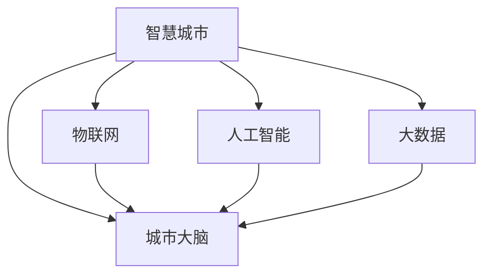

                 

# 未来的智慧城市：2050年的城市大脑与智慧城市运营

> 关键词：智慧城市，城市大脑，物联网(IoT)，人工智能(AI)，大数据，智能交通，环境保护，可持续发展

## 1. 背景介绍

随着人口的不断增长和城市化进程的加快，城市正面临着前所未有的挑战。交通拥堵、环境污染、公共安全等问题日益严峻，亟需智慧城市技术提供有效的解决方案。智慧城市通过集成物联网、大数据和人工智能等技术，实现城市管理和服务的智能化、高效化和可持续发展。

在2050年，智慧城市将达到全新的高度。以城市大脑为核心的智慧城市运营体系将全面普及，帮助城市实现精细化管理、精准治理和高效运营。城市大脑是一个集数据采集、存储、分析、决策和执行为一体的智能系统，通过整合各类城市数据，实时感知、分析和预测城市运行状态，提供决策支持。

## 2. 核心概念与联系

### 2.1 核心概念概述

为更好地理解智慧城市的技术架构和运营体系，本节将介绍几个密切相关的核心概念：

- **智慧城市(Smart City)**：一个利用信息通信技术（ICT）和大数据，对城市运营进行全面优化和管理的城市。智慧城市包括智能交通、智能环境、智能政务、智能能源等多个子系统。

- **城市大脑(Urban Brain)**：一个集成了城市运营数据、算法和计算资源，能够实时感知、分析、预测和决策的城市智能系统。城市大脑通过算法和大数据分析，优化城市各个层面的管理和服务。

- **物联网(IoT)**：将各种传感器、设备、车辆、建筑等物品通过互联网连接起来，实现数据的实时采集和传输。IoT是智慧城市数据采集的基础。

- **人工智能(AI)**：通过机器学习、深度学习等技术，使计算机具备模拟人类思维和感知能力，实现自主决策和执行。AI技术在智慧城市中用于数据分析、模式识别、智能控制等方面。

- **大数据(Big Data)**：从城市运营中获取的海量数据，通过存储、处理和分析，为城市决策提供依据。大数据是城市大脑的核心支撑。

这些核心概念之间的逻辑关系可以通过以下Mermaid流程图来展示：



这个流程图展示了几大核心概念及其之间的关系：

1. 智慧城市通过物联网、人工智能和大数据技术实现智能管理和优化。
2. 城市大脑作为智慧城市的大脑，集成各类数据和算法，实时分析和决策。
3. 物联网提供城市运营的实时数据，是智慧城市的基础。
4. 人工智能用于数据处理和模式识别，实现智能决策。
5. 大数据存储和处理城市数据，提供决策依据。

## 3. 核心算法原理 & 具体操作步骤
### 3.1 算法原理概述

智慧城市的核心算法原理可以概括为以下几个方面：

- **数据采集与预处理**：通过物联网设备采集城市运营数据，包括交通流量、环境监测、公共安全等。
- **数据存储与处理**：使用大数据技术对采集数据进行存储、清洗、标注和整合。
- **数据分析与建模**：运用机器学习、深度学习等AI技术，对数据进行建模和分析，识别模式和趋势。
- **决策与控制**：通过智能算法，生成城市管理和服务决策，并实现自动控制和执行。

### 3.2 算法步骤详解

智慧城市的算法流程通常包括以下几个关键步骤：

**Step 1: 数据采集与预处理**
- 部署各种IoT设备，如传感器、监控摄像头、车载终端等，实时采集城市数据。
- 对采集数据进行清洗、去噪和标注，确保数据的质量和一致性。

**Step 2: 数据存储与处理**
- 使用大数据技术，将清洗后的数据存储在云平台或本地存储中。
- 使用分布式计算和并行处理技术，对大数据进行快速处理和分析。

**Step 3: 数据分析与建模**
- 使用机器学习、深度学习等技术，对数据进行建模和分析，提取特征和模式。
- 通过训练和验证算法模型，优化模型参数，提升模型性能。

**Step 4: 决策与控制**
- 根据数据分析结果，生成城市管理和服务决策。
- 通过智能算法，实现自动控制和执行，如交通信号控制、垃圾分类回收、能源管理等。

**Step 5: 反馈与优化**
- 对执行结果进行反馈，评估决策效果。
- 不断优化算法模型，改进决策和控制策略，提升系统性能。

### 3.3 算法优缺点

智慧城市算法具有以下优点：

- 高效管理。通过实时数据采集和分析，智慧城市能够高效管理城市资源，提升城市运行效率。
- 精准决策。基于数据分析和模型预测，智慧城市能够精准决策，优化城市管理和服务。
- 自主控制。通过智能算法，智慧城市可以实现自主控制和执行，提升服务响应速度和质量。

同时，该算法也存在一些局限性：

- 数据质量依赖高。智慧城市对数据质量的要求很高，数据采集和预处理的成本较高。
- 算法复杂度高。智慧城市涉及多种技术融合，算法实现和优化复杂。
- 安全性和隐私问题。智慧城市涉及大量敏感数据，数据安全和隐私保护成为重要挑战。

尽管存在这些局限性，但智慧城市算法仍是目前城市管理和服务最先进的技术手段。未来相关研究的重点在于如何进一步提升数据采集和处理效率，优化算法模型，加强数据安全和隐私保护。

### 3.4 算法应用领域

智慧城市算法在多个领域得到了广泛应用，例如：

- **智能交通**：通过实时交通数据分析，优化交通信号控制，减少交通拥堵，提高出行效率。
- **智能环境**：实时监测环境质量数据，预测污染趋势，进行污染防治和预警。
- **智能政务**：通过数据分析，优化政府服务流程，提升政务服务效率和质量。
- **智能能源**：优化能源分配和利用，提高能源利用效率，实现绿色低碳发展。
- **智能安防**：实时监测公共安全数据，预防和应对突发事件，提升公共安全水平。
- **智能医疗**：通过数据分析，优化医疗资源配置，提升医疗服务质量，实现精准医疗。
- **智能教育**：通过数据分析，优化教育资源分配，提升教育公平和质量。

## 4. 数学模型和公式 & 详细讲解 & 举例说明
### 4.1 数学模型构建

智慧城市的数据分析与建模通常涉及多维数据和多目标优化。以下以智能交通系统为例，构建数学模型：

设交通网络有 $n$ 个节点和 $m$ 条边，节点之间的流量向量为 $x=(x_1, x_2, ..., x_n)$，边上的交通流量向量为 $y=(y_1, y_2, ..., y_m)$，交通需求向量为 $d=(d_1, d_2, ..., d_n)$，交通供给向量为 $s=(s_1, s_2, ..., s_n)$。交通网络流量平衡方程为：

$$
x - A y = d - s
$$

其中 $A$ 为交通网络的邻接矩阵。目标为最小化总运输成本 $C$：

$$
C = \sum_{i=1}^n \sum_{j=1}^m c_{ij} x_{ij}
$$

其中 $c_{ij}$ 为边 $(i, j)$ 的单位运输成本。

### 4.2 公式推导过程

上述数学模型可以转化为线性规划问题，通过求解最优解，得到交通网络中各边的最优流量分配。使用迭代算法如内点法或列生成法，求解线性规划问题。

### 4.3 案例分析与讲解

假设某城市的交通网络有 $n=100$ 个节点，$m=500$ 条边，交通需求向量 $d$ 和供给向量 $s$ 已知。使用线性规划模型求解最优流量分配，步骤如下：

1. 构建交通网络邻接矩阵 $A$，根据网络结构确定边上的单位运输成本 $c_{ij}$。
2. 将交通网络流量平衡方程和总运输成本目标函数转化为线性规划问题。
3. 使用内点法或列生成法求解线性规划问题，得到最优流量分配 $x$。
4. 根据最优流量分配，优化交通信号控制，提升交通效率。

## 5. 项目实践：代码实例和详细解释说明
### 5.1 开发环境搭建

在进行智慧城市算法实践前，我们需要准备好开发环境。以下是使用Python进行TensorFlow开发的环境配置流程：

1. 安装Anaconda：从官网下载并安装Anaconda，用于创建独立的Python环境。

2. 创建并激活虚拟环境：
```bash
conda create -n tf-env python=3.8 
conda activate tf-env
```

3. 安装TensorFlow：根据CUDA版本，从官网获取对应的安装命令。例如：
```bash
conda install tensorflow -c tensorflow -c conda-forge
```

4. 安装各类工具包：
```bash
pip install numpy pandas scikit-learn matplotlib tqdm jupyter notebook ipython
```

完成上述步骤后，即可在`tf-env`环境中开始智慧城市算法实践。

### 5.2 源代码详细实现

下面我们以智能交通系统为例，给出使用TensorFlow进行智慧城市算法的PyTorch代码实现。

首先，定义智能交通系统的网络结构：

```python
import tensorflow as tf
from tensorflow.keras import layers

class TrafficNetwork(tf.keras.Model):
    def __init__(self, num_nodes, num_edges):
        super().__init__()
        self.num_nodes = num_nodes
        self.num_edges = num_edges
        
        # 定义交通网络邻接矩阵
        self.adj_matrix = tf.Variable(tf.zeros((num_nodes, num_edges)))
        
        # 定义交通需求和供给
        self.demand = tf.Variable(tf.zeros(num_nodes))
        self.supply = tf.Variable(tf.zeros(num_nodes))
        
        # 定义边上的单位运输成本
        self.cost = tf.Variable(tf.zeros((num_edges, 1)))
        
        # 定义流量向量
        self.x = tf.Variable(tf.zeros((num_nodes, 1)))
        
        # 定义目标函数
        self.target = tf.zeros((num_nodes, 1))
        
        # 定义优化器
        self.optimizer = tf.keras.optimizers.Adam()
    
    def call(self, x):
        # 计算流量平衡方程
        x = tf.linalg.solve(self.adj_matrix, x - self.demand + self.supply)
        
        # 计算总运输成本
        cost = tf.reduce_sum(tf.matmul(self.x, self.cost))
        
        # 定义目标函数
        target = self.demand - self.supply
        
        # 返回优化目标和约束条件
        return cost, tf.reduce_sum(target)
    
    def train(self, epochs=100, batch_size=32):
        for epoch in range(epochs):
            # 随机采样数据
            x = tf.random.normal((batch_size, self.num_nodes))
            
            # 前向传播计算目标函数和约束条件
            cost, target = self(x)
            
            # 反向传播更新模型参数
            self.optimizer.minimize(cost, target)
            
            # 输出当前迭代的目标函数值
            print(f"Epoch {epoch+1}, cost: {cost:.3f}")
```

然后，启动智慧城市算法的训练流程：

```python
# 创建智能交通系统模型
model = TrafficNetwork(num_nodes=100, num_edges=500)

# 训练模型
model.train(epochs=100, batch_size=32)
```

以上就是使用TensorFlow对智能交通系统进行智慧城市算法实践的完整代码实现。可以看到，TensorFlow的强大图计算能力使得建模和训练过程变得更加便捷高效。

### 5.3 代码解读与分析

让我们再详细解读一下关键代码的实现细节：

**TrafficNetwork类**：
- `__init__`方法：初始化网络结构，包括邻接矩阵、需求、供给、成本和流量向量等。
- `call`方法：定义前向传播计算，包括流量平衡方程和总运输成本的计算。
- `train`方法：定义训练循环，每次迭代计算目标函数和约束条件，使用Adam优化器更新模型参数。

**训练流程**：
- 定义智能交通系统的节点数和边数，创建智能交通系统模型。
- 在训练循环中，随机采样数据进行前向传播计算。
- 根据计算结果，反向传播更新模型参数，最小化总运输成本。
- 输出每次迭代的成本值，评估模型训练效果。

可以看到，TensorFlow的自动微分和图计算能力使得建模和训练过程变得非常高效。开发者可以将更多精力放在算法设计和模型优化上，而不必过多关注底层的实现细节。

当然，工业级的系统实现还需考虑更多因素，如模型的保存和部署、超参数的自动搜索、更灵活的网络结构等。但核心的算法范式基本与此类似。

## 6. 实际应用场景
### 6.1 智能交通

智慧城市在智能交通中的应用最为广泛。通过智慧城市算法，可以实现交通流量的实时监测和预测，优化交通信号控制，提高道路通行效率，减少交通拥堵。

在技术实现上，可以部署传感器、监控摄像头和车载终端等IoT设备，实时采集交通流量和环境数据。智慧城市算法可以对采集数据进行清洗和标注，建立交通网络模型，通过机器学习算法优化流量分配，生成交通信号控制方案。实施后的交通系统可以实时调整信号灯，动态调整交通流量，提升交通效率。

### 6.2 智能环境

智慧城市通过实时监测环境数据，实现环境保护和污染防治。智慧城市算法可以对空气质量、水质、噪音等环境指标进行实时监控，预测环境污染趋势，生成环境治理方案。

在技术实现上，可以部署环境传感器和监控设备，实时采集环境数据。智慧城市算法可以对采集数据进行清洗和标注，建立环境监测模型，通过深度学习算法预测环境污染趋势，生成环境治理方案。实施后的环境系统可以实时预警环境风险，自动调整污染防治措施，提升环境保护效果。

### 6.3 智能政务

智慧城市通过优化政务流程，提升政府服务效率和质量。智慧城市算法可以对政务数据进行数据分析，生成政务决策方案，优化政府服务流程，提升政务服务效率。

在技术实现上，可以收集政务数据，包括人口、交通、医疗、教育等数据。智慧城市算法可以对政务数据进行清洗和标注，建立政务数据模型，通过机器学习算法生成政务决策方案，优化政府服务流程。实施后的政务系统可以实时生成政务决策，提升政务服务效率和质量。

### 6.4 智能能源

智慧城市通过优化能源分配和利用，实现绿色低碳发展。智慧城市算法可以对能源数据进行数据分析，生成能源优化方案，提升能源利用效率，实现绿色低碳发展。

在技术实现上，可以收集能源数据，包括电力、燃气、太阳能、风能等数据。智慧城市算法可以对能源数据进行清洗和标注，建立能源数据模型，通过深度学习算法生成能源优化方案，提升能源利用效率。实施后的能源系统可以实时优化能源分配，提升能源利用效率，实现绿色低碳发展。

## 7. 工具和资源推荐
### 7.1 学习资源推荐

为了帮助开发者系统掌握智慧城市的理论基础和实践技巧，这里推荐一些优质的学习资源：

1. 《智慧城市导论》书籍：全面介绍了智慧城市的定义、架构和应用，包括智能交通、智能环境、智能政务等多个子系统。

2. 《TensorFlow实战智慧城市》书籍：详细讲解了TensorFlow在智慧城市中的应用，包括数据采集、数据分析、模型训练等多个环节。

3. 智慧城市开源项目：如Open City Platform，提供智慧城市数据接口和API，助力智慧城市应用的开发和集成。

4. 在线课程：如Coursera的《智慧城市与物联网》课程，系统讲解智慧城市技术和管理知识。

5. 学术论文：阅读前沿的智慧城市学术论文，了解最新的智慧城市技术和应用成果。

通过对这些资源的学习实践，相信你一定能够快速掌握智慧城市技术的精髓，并用于解决实际的智慧城市问题。
###  7.2 开发工具推荐

高效的开发离不开优秀的工具支持。以下是几款用于智慧城市算法开发的常用工具：

1. TensorFlow：基于Python的开源深度学习框架，灵活的计算图和自动微分能力，适合大规模数据处理和模型训练。

2. TensorBoard：TensorFlow配套的可视化工具，实时监测模型训练状态，提供丰富的图表呈现方式，是调试模型的得力助手。

3. Keras：基于TensorFlow的高级API，简化模型构建和训练过程，支持多种深度学习模型和优化器。

4. HuggingFace Transformers库：提供各类预训练语言模型和API，方便模型训练和微调，适用于NLP任务。

5. Jupyter Notebook：交互式编程环境，支持Python、R、Java等多种语言，便于模型开发和调试。

合理利用这些工具，可以显著提升智慧城市算法开发的效率，加快创新迭代的步伐。

### 7.3 相关论文推荐

智慧城市算法的研究源于学界的持续研究。以下是几篇奠基性的相关论文，推荐阅读：

1. "Building Smart Cities with Data Mining, Statistics and Knowledge Discovery"（利用数据挖掘、统计和知识发现构建智慧城市）：研究了智慧城市数据挖掘和统计方法，建立了智慧城市决策支持系统。

2. "Smart City Data-Driven Modeling and Analysis"（智慧城市数据驱动建模和分析）：介绍了智慧城市数据建模和分析方法，包括数据清洗、特征提取、模型训练等环节。

3. "Adaptive Multi-Agent Systems for Smart Cities"（智慧城市自适应多智能体系统）：提出了基于多智能体系统的智慧城市架构，研究了智能体之间的协作机制和决策优化方法。

4. "Big Data and Smart Cities: Opportunities and Challenges"（大数据和智慧城市：机遇与挑战）：分析了大数据在智慧城市中的应用，探讨了数据隐私和安全等问题。

5. "Optimizing Urban Traffic with AI and Big Data"（利用AI和大数据优化城市交通）：介绍了AI和大数据在城市交通优化中的应用，包括交通流量预测、交通信号控制等。

这些论文代表了大智慧城市算法的理论发展脉络，通过学习这些前沿成果，可以帮助研究者把握学科前进方向，激发更多的创新灵感。

## 8. 总结：未来发展趋势与挑战
### 8.1 总结

本文对智慧城市及其核心算法进行了全面系统的介绍。首先阐述了智慧城市的技术架构和运营体系，明确了智慧城市在智能交通、智能环境、智能政务等方面的重要价值。其次，从原理到实践，详细讲解了智慧城市算法的数学模型和具体操作步骤，给出了智能交通系统的代码实现。同时，本文还广泛探讨了智慧城市算法在智能交通、智能环境、智能政务等诸多领域的应用前景，展示了智慧城市算法的巨大潜力。

通过本文的系统梳理，可以看到，智慧城市算法将在未来的城市管理和服务中发挥越来越重要的作用，成为推动城市智能化、高效化和可持续发展的重要引擎。未来，伴随智慧城市技术的不断演进，城市运营将更加精细化、智能化，为人类社会带来更多便利和福祉。

### 8.2 未来发展趋势

展望未来，智慧城市算法将呈现以下几个发展趋势：

1. 高度融合。智慧城市算法将与物联网、区块链、5G等新技术深度融合，实现更为全面、精准的城市管理和运营。

2. 普适化推广。智慧城市算法将逐渐普及到中小城市和乡镇，实现智慧城市建设的全覆盖。

3. 多模态融合。智慧城市算法将融合多种数据源和多种模型，实现多模态数据的协同建模和分析。

4. 自学习优化。智慧城市算法将具备自学习能力，实时优化模型参数，提升系统性能和鲁棒性。

5. 隐私保护。智慧城市算法将更加重视数据隐私和安全，采用差分隐私、联邦学习等技术，保护用户隐私。

6. 智慧城市平台。基于智慧城市算法的城市大脑平台将全面普及，提供一站式的智慧城市管理和运营服务。

以上趋势凸显了智慧城市算法的广阔前景。这些方向的探索发展，必将进一步提升智慧城市系统的性能和应用范围，为人类社会带来更多便利和福祉。

### 8.3 面临的挑战

尽管智慧城市算法已经取得了瞩目成就，但在迈向更加智能化、普适化应用的过程中，它仍面临着诸多挑战：

1. 数据获取和质量。智慧城市对数据的需求量很大，但数据采集成本高、质量参差不齐。如何有效获取高质量数据，是智慧城市算法的重要挑战。

2. 模型复杂度。智慧城市算法涉及多种技术融合，模型设计和优化复杂。如何降低模型复杂度，提升模型效率，是未来研究的重要方向。

3. 安全性和隐私。智慧城市算法涉及大量敏感数据，数据安全和隐私保护成为重要课题。如何加强数据安全和隐私保护，是智慧城市建设的重要保障。

4. 落地实施难度。智慧城市算法涉及多种技术融合，落地实施难度大。如何简化技术实现，提升系统易用性，是未来研究的重要课题。

5. 多方协同合作。智慧城市建设需要多方协同合作，包括政府、企业、居民等各方参与。如何协调各方利益，建立合作机制，是智慧城市建设的重要保障。

正视智慧城市算法面临的这些挑战，积极应对并寻求突破，将是大智慧城市算法走向成熟的必由之路。相信随着学界和产业界的共同努力，这些挑战终将一一被克服，大智慧城市算法必将在构建智能城市中发挥更大的作用。

### 8.4 研究展望

面向未来，智慧城市算法需要在以下几个方面寻求新的突破：

1. 引入更多先验知识。将符号化的先验知识，如知识图谱、逻辑规则等，与神经网络模型进行巧妙融合，引导智慧城市算法学习更准确、合理的城市运行模型。

2. 优化模型设计和实现。开发更加参数高效和计算高效的智慧城市算法，在固定大部分预训练参数的同时，只更新极少量的任务相关参数。同时优化模型的计算图，减少前向传播和反向传播的资源消耗，实现更加轻量级、实时性的部署。

3. 融合因果分析和博弈论工具。将因果分析方法引入智慧城市算法，识别出模型决策的关键特征，增强输出解释的因果性和逻辑性。借助博弈论工具刻画人机交互过程，主动探索并规避模型的脆弱点，提高系统稳定性。

4. 引入可解释性和伦理道德约束。在智慧城市算法中引入可解释性和伦理道德约束，确保模型决策的透明性和公正性。加强人工干预和审核，建立模型行为的监管机制，确保输出符合人类价值观和伦理道德。

这些研究方向的探索，必将引领智慧城市算法技术迈向更高的台阶，为构建安全、可靠、可解释、可控的智能城市提供有力支持。面向未来，智慧城市算法需要与其他人工智能技术进行更深入的融合，如知识表示、因果推理、强化学习等，多路径协同发力，共同推动智慧城市技术的进步。

## 9. 附录：常见问题与解答
**Q1：智慧城市建设需要哪些关键技术？**

A: 智慧城市建设需要以下几个关键技术：

1. 物联网(IoT)：实现城市数据的实时采集和传输。

2. 大数据(Big Data)：存储、清洗和分析城市运营数据。

3. 人工智能(AI)：进行数据分析和模型优化，实现智能决策和执行。

4. 云计算(Cloud Computing)：提供计算资源和存储资源，支持大规模数据处理。

5. 通信网络(Communication Networks)：提供高效的数据传输通道，支持实时数据采集和传输。

**Q2：如何提升智慧城市算法的鲁棒性？**

A: 提升智慧城市算法的鲁棒性，可以从以下几个方面进行优化：

1. 数据预处理：对采集数据进行清洗、去噪和标注，确保数据的质量和一致性。

2. 模型多样性：设计多个模型，采用集成学习方法，提升模型的鲁棒性。

3. 对抗训练：引入对抗样本，训练模型对异常数据和扰动具备鲁棒性。

4. 自适应优化：开发自适应优化算法，实时调整模型参数，提升模型的鲁棒性。

5. 模型验证：在模型训练和部署过程中，进行多次验证和测试，确保模型的稳定性和可靠性。

**Q3：智慧城市建设需要哪些多方协同合作？**

A: 智慧城市建设需要以下几个多方协同合作：

1. 政府：制定智慧城市政策，提供数据接口和标准。

2. 企业：提供技术支持和服务，推动智慧城市技术落地。

3. 居民：参与智慧城市建设和应用，提供反馈和建议。

4. 学术界：提供理论支持和创新突破，推动智慧城市技术发展。

5. 研究机构：提供应用场景和测试环境，验证智慧城市技术的可行性和有效性。

只有各方协同合作，共同推动智慧城市建设，才能实现智慧城市的可持续发展。

**Q4：智慧城市算法的应用场景有哪些？**

A: 智慧城市算法的应用场景非常广泛，包括但不限于以下几个方面：

1. 智能交通：实时监测交通流量，优化交通信号控制，减少交通拥堵。

2. 智能环境：实时监测环境质量数据，预测环境污染趋势，进行污染防治和预警。

3. 智能政务：优化政务服务流程，提升政务服务效率和质量。

4. 智能能源：优化能源分配和利用，实现绿色低碳发展。

5. 智能安防：实时监测公共安全数据，预防和应对突发事件，提升公共安全水平。

6. 智能医疗：通过数据分析，优化医疗资源配置，提升医疗服务质量，实现精准医疗。

7. 智能教育：通过数据分析，优化教育资源分配，提升教育公平和质量。

智慧城市算法将在各个方面推动城市智能化、高效化和可持续发展。

---

作者：禅与计算机程序设计艺术 / Zen and the Art of Computer Programming

