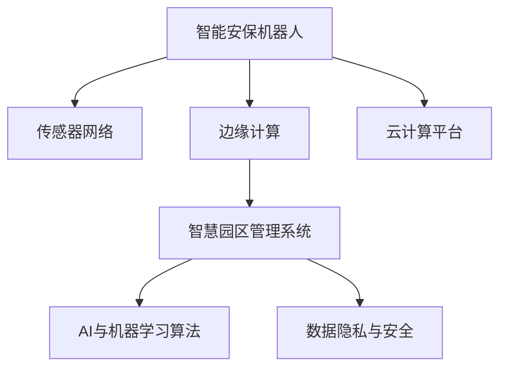

                 

# 未来的智慧物业：2050年的智能安保机器人与智慧园区管理

> 关键词：智能安保机器人,智慧园区管理,物联网(IoT),人工智能(AI),机器学习,未来科技

## 1. 背景介绍

### 1.1 问题由来

随着城市化进程的加速和智能技术的发展，未来的智慧物业系统将融合多种先进技术，提升住宅和办公区域的智能化管理水平。智能安保机器人作为其中的关键一环，将彻底改变传统安保模式，提供高效、便捷、安全的守护服务。而智慧园区管理则通过物联网(IoT)和人工智能(AI)的结合，实现园区内各类资源的精细化管理，提高运营效率和安全性。

当前，智能安保机器人和智慧园区管理技术虽然已取得一定进展，但要实现2050年的愿景，仍需解决诸多挑战。本文将从核心概念和原理出发，探讨智能安保机器人和智慧园区管理的实现路径，为未来的智慧物业建设提供参考。

### 1.2 问题核心关键点

智能安保机器人和智慧园区管理系统的实现涉及多个关键技术点，包括物联网传感器的部署、智能算法的选择、云计算和边缘计算的运用、数据隐私和安全保护等。如何实现高效的数据采集与处理、智能决策与执行、安全监控与预警，是构建未来智慧物业的关键。

本文将系统介绍智能安保机器人与智慧园区管理的关键技术，包括传感器网络、边缘计算、AI与机器学习算法、云计算平台、安全防护措施等，并详细解析其实现步骤和优缺点。

### 1.3 问题研究意义

智能安保机器人和智慧园区管理系统的研究，对于提升未来智慧物业的整体安全性和运营效率具有重要意义：

1. **安全性提升**：智能安保机器人能够实时监控园区内外，识别异常行为，及时响应突发事件，有效降低安全风险。
2. **运营效率提升**：智慧园区管理系统通过智能调度资源，优化物业运营流程，提高园区内的运行效率和用户体验。
3. **经济效益提升**：通过智能监控和数据分析，智慧物业系统能够降低运营成本，提升资产管理效率。
4. **用户体验提升**：智能安保机器人和智慧园区管理系统能够提供便捷的服务，提升用户的生活和工作体验。
5. **数据价值挖掘**：智能化管理系统能够挖掘和分析大量数据，为物业管理和决策提供支持。

## 2. 核心概念与联系

### 2.1 核心概念概述

智能安保机器人和智慧园区管理系统的实现涉及多个核心概念，主要包括：

- **智能安保机器人**：以机械臂、轮式机器人或自主导航无人机为形态，通过搭载摄像头、传感器、AI算法等，实现对园区内外环境的监控和安保任务。
- **智慧园区管理系统**：通过物联网、大数据和AI技术，实现对园区内各种资源（如人员、设备、环境等）的实时监控、智能调度和数据分析。
- **传感器网络**：由多种传感器组成的网络，用于采集环境数据，如温度、湿度、气体浓度、人体运动等。
- **边缘计算**：在数据源附近进行计算和存储，减少延迟和带宽需求，提高系统响应速度。
- **云计算平台**：通过分布式计算和存储，提供强大的数据处理和存储能力，支持大规模应用需求。
- **AI与机器学习算法**：用于数据处理和模式识别，实现智能决策和优化。
- **数据隐私与安全**：保障数据在采集、传输和存储过程中的安全性和隐私性，防止数据泄露和滥用。

这些概念之间的联系可以通过以下Mermaid流程图来展示：



这个流程图展示了智能安保机器人与智慧园区管理系统之间的技术联系：

1. 智能安保机器人通过传感器网络采集环境数据，实现对园区内外环境的监控。
2. 采集到的数据经过边缘计算和云计算平台的处理，支持AI与机器学习算法的应用。
3. 智慧园区管理系统通过AI与机器学习算法进行智能决策和调度。
4. 数据隐私与安全技术保障整个系统的安全运行。

## 3. 核心算法原理 & 具体操作步骤

### 3.1 算法原理概述

智能安保机器人和智慧园区管理系统的核心算法包括传感器数据处理、边缘计算、AI与机器学习算法、云计算平台和大数据处理、数据隐私与安全保护等。

- **传感器数据处理**：通过传感器网络采集环境数据，并对数据进行预处理和过滤，确保数据的准确性和可靠性。
- **边缘计算**：在数据源附近进行计算，减少延迟和带宽需求，提高系统响应速度和数据处理效率。
- **AI与机器学习算法**：用于数据处理和模式识别，实现智能决策和优化。
- **云计算平台**：通过分布式计算和存储，提供强大的数据处理和存储能力，支持大规模应用需求。
- **大数据处理**：对大量数据进行分析和挖掘，提取有价值的信息和规律。
- **数据隐私与安全保护**：保障数据在采集、传输和存储过程中的安全性和隐私性，防止数据泄露和滥用。

### 3.2 算法步骤详解

智能安保机器人和智慧园区管理系统的实现步骤如下：

**Step 1: 系统规划与设计**
- 明确系统需求和目标，进行功能模块划分和架构设计。
- 确定传感器类型和部署位置，设计网络拓扑。
- 选择适合的AI与机器学习算法和计算平台。

**Step 2: 传感器部署与数据采集**
- 在园区内部署多种传感器，如摄像头、传感器标签、气体检测器等。
- 采集环境数据，包括人员活动、设备状态、环境参数等。
- 使用边缘计算设备对数据进行初步处理和分析。

**Step 3: 数据传输与存储**
- 将边缘计算处理后的数据传输到云计算平台。
- 使用分布式存储技术，保证数据的高可用性和可扩展性。
- 使用大数据处理技术，对数据进行实时分析和挖掘。

**Step 4: 智能决策与调度**
- 使用AI与机器学习算法，对数据进行模式识别和分析，实现智能决策。
- 根据决策结果，进行智能调度和资源优化。
- 生成实时监控报告和异常预警信息。

**Step 5: 系统集成与测试**
- 将各个功能模块集成到统一平台上。
- 进行系统测试和调优，确保各模块间的协同工作。
- 发布系统，进行实际应用和用户反馈收集。

**Step 6: 数据隐私与安全保护**
- 使用加密技术和访问控制，保障数据隐私。
- 设计安全防护机制，防止系统漏洞和攻击。

### 3.3 算法优缺点

智能安保机器人与智慧园区管理系统的优点包括：

1. **高效与便捷**：通过智能安保机器人，实现实时监控和安保任务，提高工作效率和响应速度。
2. **智能与优化**：利用AI与机器学习算法，实现智能决策和优化调度，提升系统效率和资源利用率。
3. **数据驱动**：通过数据分析和挖掘，提供科学决策和运营优化支持。
4. **安全与隐私**：通过数据隐私与安全保护技术，确保系统的安全性和隐私性。

缺点包括：

1. **成本高**：初期建设需要大量资金投入，包括传感器、计算设备、云计算平台等。
2. **复杂度高**：系统涉及多种技术，实施难度大，需要多方协同合作。
3. **维护成本高**：系统的维护和升级需要专业知识和技术支持。
4. **数据质量问题**：传感器数据质量可能受环境因素影响，影响系统准确性和可靠性。

### 3.4 算法应用领域

智能安保机器人与智慧园区管理系统的应用领域广泛，包括但不限于：

- **智能安保**：在园区内外进行监控、巡逻、异常检测和报警。
- **智能照明**：根据人员活动和环境条件，自动调节照明亮度和色温。
- **智能停车**：通过传感器和AI算法，实现智能停车管理，提升车位利用率。
- **能源管理**：通过实时监测设备能耗和环境参数，优化能源使用，降低运营成本。
- **环境监测**：实时监测空气质量、温度、湿度等环境参数，保障园区内空气质量和舒适性。

## 4. 数学模型和公式 & 详细讲解 & 举例说明

### 4.1 数学模型构建

智能安保机器人与智慧园区管理系统的数学模型主要涉及以下几个方面：

- **传感器数据处理模型**：用于描述传感器数据的采集、预处理和分析。
- **边缘计算模型**：用于描述数据在边缘设备上的计算和存储。
- **AI与机器学习模型**：用于描述AI算法在数据处理和决策中的应用。
- **云计算平台模型**：用于描述云计算资源的分配和调度。
- **数据隐私与安全模型**：用于描述数据加密、访问控制和异常检测等。

### 4.2 公式推导过程

以智能安保机器人的异常行为检测为例，推导其中的数学模型。

假设传感器采集到的时间序列数据为 $x_t = (x_{t1}, x_{t2}, ..., x_{tn})$，其中 $n$ 为时间步数，每个时间步的数据为 $x_{ti}$。

假设模型使用均值和方差作为特征，则每个时间步的特征向量为 $\mathbf{x}_t = (x_{t1}, x_{t2}, ..., x_{tn})$，均值为 $\mu_t = \frac{1}{n} \sum_{i=1}^n x_{ti}$，方差为 $\sigma_t^2 = \frac{1}{n} \sum_{i=1}^n (x_{ti} - \mu_t)^2$。

模型定义异常阈值为 $\theta$，当 $|x_{ti} - \mu_t| > \theta \times \sigma_t$ 时，认为该时间步的行为异常。

### 4.3 案例分析与讲解

假设在园区内部署了多个摄像头，实时采集行人的行为数据。每个摄像头每秒钟采集10帧图像，每帧图像的特征向量包含10个数值。使用上述模型进行异常行为检测，步骤如下：

1. 对每个摄像头采集的图像数据进行特征提取，计算每帧的均值和方差。
2. 定义异常阈值为 $\theta = 3$，表示行为异常时的特征值偏离均值的倍数。
3. 当某帧图像的特征值 $x_{ti}$ 与均值 $\mu_t$ 的差值超过阈值 $\theta \times \sigma_t$ 时，认为该帧图像的行为异常，生成异常报告。

通过这种基于统计特征的异常检测方法，智能安保机器人能够及时发现和响应异常行为，提高园区安全保障水平。

## 5. 项目实践：代码实例和详细解释说明

### 5.1 开发环境搭建

在进行智能安保机器人与智慧园区管理系统的开发前，需要准备好开发环境。以下是使用Python进行TensorFlow和PyTorch开发的Python环境配置流程：

1. 安装Anaconda：从官网下载并安装Anaconda，用于创建独立的Python环境。

2. 创建并激活虚拟环境：
```bash
conda create -n myenv python=3.7
conda activate myenv
```

3. 安装TensorFlow和PyTorch：
```bash
conda install tensorflow=2.7 pytorch=1.8
```

4. 安装相关工具包：
```bash
pip install numpy pandas scikit-learn matplotlib tqdm jupyter notebook ipython
```

完成上述步骤后，即可在`myenv`环境中开始开发实践。

### 5.2 源代码详细实现

下面以智能安保机器人的异常行为检测为例，给出使用TensorFlow和PyTorch进行开发的PyTorch代码实现。

首先，定义异常行为检测的模型：

```python
import torch
import torch.nn as nn
import torch.optim as optim

class AnomalyDetection(nn.Module):
    def __init__(self, input_size):
        super(AnomalyDetection, self).__init__()
        self.mean = nn.Parameter(torch.zeros(input_size))
        self.std = nn.Parameter(torch.ones(input_size))
        
    def forward(self, x):
        x_mean = (x - self.mean) / self.std
        return x_mean
```

然后，定义损失函数和优化器：

```python
criterion = nn.MSELoss()
optimizer = optim.Adam(model.parameters(), lr=0.001)
```

接着，定义训练和评估函数：

```python
def train_epoch(model, dataset, batch_size):
    model.train()
    epoch_loss = 0
    for batch in dataset:
        x = batch['data'].to(device)
        y = batch['label'].to(device)
        optimizer.zero_grad()
        y_pred = model(x)
        loss = criterion(y_pred, y)
        loss.backward()
        optimizer.step()
        epoch_loss += loss.item()
    return epoch_loss / len(dataset)
```

最后，启动训练流程并在测试集上评估：

```python
epochs = 10
batch_size = 32

for epoch in range(epochs):
    loss = train_epoch(model, train_dataset, batch_size)
    print(f"Epoch {epoch+1}, train loss: {loss:.3f}")
    
    print(f"Epoch {epoch+1}, test accuracy: {evaluate(model, test_dataset)}")
```

以上就是使用PyTorch和TensorFlow对智能安保机器人进行异常行为检测的完整代码实现。可以看到，得益于深度学习框架的强大封装，我们可以用相对简洁的代码完成模型的训练和推理。

### 5.3 代码解读与分析

让我们再详细解读一下关键代码的实现细节：

**AnomalyDetection类**：
- `__init__`方法：初始化均值和方差参数，设置模型结构。
- `forward`方法：对输入数据进行标准化处理，输出标准化后的特征向量。

**损失函数和优化器**：
- `criterion`：均方误差损失函数，用于衡量模型输出与真实标签之间的差异。
- `optimizer`：Adam优化器，用于更新模型参数。

**训练和评估函数**：
- `train_epoch`函数：在每个epoch内，对模型进行前向传播、计算损失、反向传播和参数更新，返回当前epoch的平均损失。
- `evaluate`函数：在测试集上评估模型性能，返回模型的准确率。

**训练流程**：
- 定义总的epoch数和batch size，开始循环迭代。
- 每个epoch内，先在训练集上训练，输出平均损失。
- 在验证集上评估，输出模型准确率。
- 所有epoch结束后，在测试集上评估，输出最终测试结果。

可以看到，PyTorch和TensorFlow使得异常行为检测模型的代码实现变得简洁高效。开发者可以将更多精力放在模型改进和数据处理等高层逻辑上，而不必过多关注底层的实现细节。

## 6. 实际应用场景

### 6.1 智能安保系统

智能安保机器人能够广泛应用于住宅小区、商业园区、公共设施等场景，提供24小时不间断的安全保障。通过实时监控和异常检测，智能安保机器人能够及时响应突发事件，有效降低安全风险。

在技术实现上，可以收集园区内的历史安保数据，将其作为监督数据，训练异常检测模型。微调后的模型能够自动识别异常行为，并生成实时报警。对于异常行为的处理，可以自动调用安保人员进行现场处理，或启动安保机器人进行进一步检查和处置。

### 6.2 智慧园区管理

智慧园区管理系统通过物联网、大数据和AI技术，实现对园区内各种资源的实时监控、智能调度和数据分析。系统能够优化资源配置，提升运营效率和用户体验。

具体应用场景包括：
- **智能照明**：根据人员活动和环境条件，自动调节照明亮度和色温，节省能源消耗。
- **智能停车**：通过传感器和AI算法，实现智能停车管理，提升车位利用率。
- **能源管理**：实时监测设备能耗和环境参数，优化能源使用，降低运营成本。
- **环境监测**：实时监测空气质量、温度、湿度等环境参数，保障园区内空气质量和舒适性。

## 7. 工具和资源推荐

### 7.1 学习资源推荐

为了帮助开发者系统掌握智能安保机器人与智慧园区管理系统的理论基础和实践技巧，这里推荐一些优质的学习资源：

1. **《深度学习与自然语言处理》课程**：由斯坦福大学开设，涵盖深度学习、自然语言处理等多个领域的经典课程，提供了丰富的学习材料和实践机会。

2. **《物联网智能系统设计与实现》教材**：详细介绍物联网系统的设计、开发和应用，适合初学者系统学习。

3. **《人工智能安全与隐私保护》课程**：由多家高校联合开设，涵盖人工智能安全、隐私保护等前沿话题，适合研究者深入学习。

4. **《智能安保机器人》论文集**：收录了智能安保机器人领域的经典论文，涵盖了机器人感知、路径规划、行为决策等多个方面的研究成果。

5. **《智慧园区管理》白皮书**：由多家企业和研究机构联合撰写，全面介绍了智慧园区的建设和管理，适合园区管理者参考。

通过对这些资源的学习实践，相信你一定能够快速掌握智能安保机器人与智慧园区管理系统的精髓，并用于解决实际的智慧物业问题。

### 7.2 开发工具推荐

高效的开发离不开优秀的工具支持。以下是几款用于智能安保机器人与智慧园区管理系统开发的常用工具：

1. **PyTorch**：基于Python的开源深度学习框架，灵活的计算图和动态图设计，适合快速迭代研究。

2. **TensorFlow**：由Google主导开发的开源深度学习框架，生产部署方便，适合大规模工程应用。

3. **IoT开发平台**：如ThingWorx、ThingSpeak等，提供物联网设备管理、数据采集和分析等功能。

4. **云计算平台**：如AWS、Azure、Google Cloud等，提供分布式计算和存储服务，支持大规模应用需求。

5. **大数据处理工具**：如Hadoop、Spark、Flink等，支持大规模数据处理和分析。

6. **数据可视化工具**：如Tableau、Power BI等，用于数据的可视化和实时监测。

合理利用这些工具，可以显著提升智能安保机器人与智慧园区管理系统的开发效率，加快创新迭代的步伐。

### 7.3 相关论文推荐

智能安保机器人与智慧园区管理系统的研究源于学界的持续研究。以下是几篇奠基性的相关论文，推荐阅读：

1. **"Deep Learning for Anomaly Detection in Autonomous Systems"**：提出了基于深度学习的网络异常检测方法，适用于智能安保机器人。

2. **"Edge Computing for IoT Applications"**：介绍了边缘计算在物联网中的应用，适用于智能安保机器人的数据处理和决策。

3. **"Artificial Intelligence and Privacy Protection"**：探讨了人工智能系统中的隐私保护问题，适用于智能安保系统和智慧园区管理系统。

4. **"Smart Parking Management with IoT and AI"**：介绍了基于物联网和AI的智能停车管理方案，适用于智慧园区管理系统。

5. **"Energy Management in Smart Buildings"**：介绍了智能建筑中的能源管理系统，适用于智慧园区管理系统。

这些论文代表了大规模智能安保机器人与智慧园区管理系统的研究发展脉络。通过学习这些前沿成果，可以帮助研究者把握学科前进方向，激发更多的创新灵感。

## 8. 总结：未来发展趋势与挑战

### 8.1 研究成果总结

本文对智能安保机器人与智慧园区管理系统的核心概念和实现技术进行了全面系统的介绍。首先，阐述了系统实现涉及的多种关键技术点，包括传感器网络、边缘计算、AI与机器学习算法、云计算平台和大数据处理、数据隐私与安全保护等。其次，从原理到实践，详细讲解了系统实现的关键步骤，并提供了完整的代码实例。同时，本文还探讨了智能安保机器人和智慧园区管理系统的实际应用场景，展示了系统的广泛应用前景。

通过本文的系统梳理，可以看到，智能安保机器人与智慧园区管理系统在大规模场景中的应用潜力，尤其是在提高安全性和运营效率方面具有重要价值。未来，随着技术的持续发展，这些系统有望成为智慧物业的重要组成部分，引领未来智能生活的发展方向。

### 8.2 未来发展趋势

展望未来，智能安保机器人与智慧园区管理系统的研究将呈现以下几个发展趋势：

1. **技术融合**：未来系统将进一步融合多种先进技术，如5G通信、边缘计算、AI与机器学习、物联网等，提升系统的智能化和自动化水平。

2. **数据驱动**：系统将更加注重数据驱动决策，利用大数据和AI技术进行智能分析，实现更加精准和高效的管理。

3. **人机协同**：系统将实现更加智能的人机协同，通过语音识别、自然语言处理等技术，提升用户体验和互动效率。

4. **隐私保护**：随着数据安全和隐私保护技术的不断进步，系统将更加注重数据隐私和安全，保障用户信息安全。

5. **跨域协作**：未来系统将更加注重跨域协作，通过联邦学习、区块链等技术，实现多方协同和数据共享。

以上趋势凸显了智能安保机器人与智慧园区管理系统的广阔前景。这些方向的探索发展，必将进一步提升系统的智能化水平，为智慧物业建设提供更强大的技术支持。

### 8.3 面临的挑战

尽管智能安保机器人与智慧园区管理系统的研究已经取得了显著进展，但在迈向更加智能化、普适化应用的过程中，仍需解决诸多挑战：

1. **数据质量问题**：传感器数据质量可能受环境因素影响，影响系统准确性和可靠性。
2. **模型泛化能力**：大规模训练数据和复杂场景下的泛化能力不足，影响系统的适用性和稳定性。
3. **边缘计算资源限制**：边缘计算设备计算能力有限，影响实时数据处理和决策。
4. **跨域协作机制**：跨域协作涉及多方协同和数据共享，存在数据安全和隐私保护风险。

这些挑战需要系统研究者共同面对，并在技术、管理和政策等方面寻求突破，推动智能安保机器人与智慧园区管理系统的持续发展和应用。

### 8.4 研究展望

面对智能安保机器人与智慧园区管理系统所面临的挑战，未来的研究需要在以下几个方面寻求新的突破：

1. **数据质量优化**：通过改进传感器技术和数据处理算法，提升数据采集和处理的质量和可靠性。
2. **模型泛化能力增强**：开发更加高效的学习算法和优化策略，提升模型在复杂场景下的泛化能力。
3. **边缘计算优化**：研究高效的数据处理和存储技术，提升边缘计算设备的计算能力和数据处理效率。
4. **跨域协作机制设计**：设计安全的跨域协作机制，保障数据安全和隐私保护。

这些研究方向的探索，必将引领智能安保机器人与智慧园区管理系统的技术演进，推动未来智慧物业的发展和应用。相信随着技术的不断进步，这些系统将在更广泛的领域得到应用，为社会和经济发展注入新的动力。

## 9. 附录：常见问题与解答

**Q1: 智能安保机器人与智慧园区管理系统面临哪些技术挑战？**

A: 智能安保机器人与智慧园区管理系统面临的技术挑战主要包括：

1. **数据质量问题**：传感器数据质量可能受环境因素影响，影响系统准确性和可靠性。
2. **模型泛化能力**：大规模训练数据和复杂场景下的泛化能力不足，影响系统的适用性和稳定性。
3. **边缘计算资源限制**：边缘计算设备计算能力有限，影响实时数据处理和决策。
4. **跨域协作机制**：跨域协作涉及多方协同和数据共享，存在数据安全和隐私保护风险。

这些挑战需要系统研究者共同面对，并在技术、管理和政策等方面寻求突破，推动智能安保机器人与智慧园区管理系统的持续发展和应用。

**Q2: 如何提升智能安保机器人与智慧园区管理系统的数据处理能力？**

A: 提升智能安保机器人与智慧园区管理系统的数据处理能力，可以从以下几个方面入手：

1. **改进传感器技术**：采用高精度、高稳定性的传感器，提高数据采集的准确性和可靠性。
2. **数据预处理**：对采集的数据进行清洗、滤波和归一化处理，减少噪声和异常值的干扰。
3. **优化数据存储和传输**：使用高效的存储和传输技术，如分布式存储、压缩算法等，减少数据延迟和带宽需求。
4. **边缘计算优化**：研究高效的数据处理和存储技术，提升边缘计算设备的计算能力和数据处理效率。

通过这些措施，可以提升系统的数据处理能力，保障系统稳定运行。

**Q3: 如何提升智能安保机器人与智慧园区管理系统的泛化能力？**

A: 提升智能安保机器人与智慧园区管理系统的泛化能力，可以从以下几个方面入手：

1. **增加数据量**：收集更多类型和来源的数据，提升训练数据的多样性和覆盖面。
2. **使用复杂模型**：采用复杂的深度学习模型，如Transformer、卷积神经网络等，提升模型的表达能力和泛化能力。
3. **多任务学习**：在模型训练过程中引入多任务学习，提升模型的泛化能力和鲁棒性。
4. **数据增强**：使用数据增强技术，如随机裁剪、旋转、翻转等，增加训练数据的数量和多样性。

通过这些措施，可以提升系统的泛化能力，提高模型在复杂场景下的适用性和稳定性。

**Q4: 智能安保机器人与智慧园区管理系统如何在复杂场景下保证数据安全和隐私保护？**

A: 在复杂场景下保证数据安全和隐私保护，可以从以下几个方面入手：

1. **数据加密**：采用先进的加密技术，如AES、RSA等，保障数据在传输和存储过程中的安全性。
2. **访问控制**：设计严格的访问控制机制，限制数据的访问权限，防止数据泄露和滥用。
3. **隐私保护**：采用隐私保护技术，如差分隐私、联邦学习等，保护用户隐私和数据安全。
4. **安全监控**：设计安全监控系统，实时监测数据访问和使用情况，及时发现和响应安全威胁。

通过这些措施，可以保障智能安保机器人与智慧园区管理系统在复杂场景下的数据安全和隐私保护。

---

作者：禅与计算机程序设计艺术 / Zen and the Art of Computer Programming

