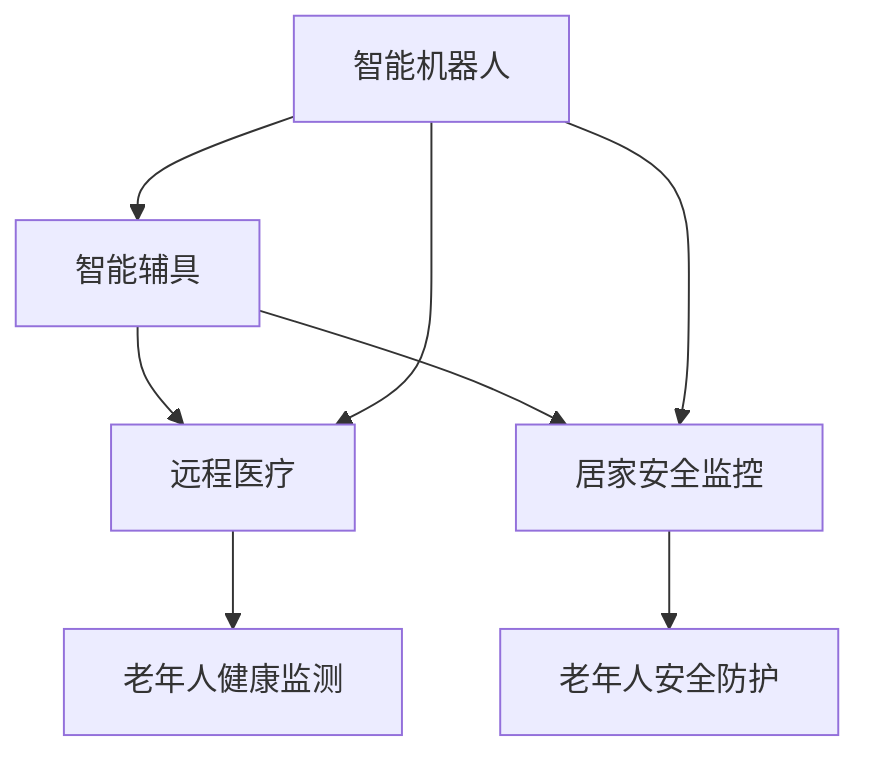

                 

# 未来的智能养老：2050年的老年机器人与智能辅具

> 关键词：智能养老, 老年机器人, 智能辅具, 人工智能, 人机协同, 居家养老, 生活助手, 健康监测, 远程医疗, 老年人安全, 自动化生活

## 1. 背景介绍

### 1.1 问题由来

随着全球人口老龄化趋势的加剧，老年群体的生活需求日益突出。如何在技术进步的驱动下，为老年人提供更为便捷、舒适、安全的养老生活，成为摆在社会面前的重大课题。以往的养老模式多以家庭照护、社区服务为主，但面对日益增长的养老需求，这一模式显得力不从心。

进入21世纪以来，人工智能（AI）技术的迅猛发展，为老年人养老方式的创新带来了新的可能性。越来越多的科技公司开始研究并开发智能养老解决方案，特别是老年机器人和智能辅具，旨在提升老年人的生活质量，减轻家庭的护理负担，增强老年人的生活独立性。

### 1.2 问题核心关键点

智能养老的核心在于通过人工智能技术，为老年人提供个性化的、全方位的、实时的服务。目前，智能养老解决方案包括但不限于以下几个方面：

- **智能机器人**：能够陪伴、协助老年人的生活，提供聊天、娱乐、紧急响应等功能。
- **智能辅具**：包括各种辅助生活和健康的设备，如智能轮椅、智能床垫、智能穿戴设备等。
- **远程医疗**：通过互联网实现对老年人健康状况的实时监测和远程诊断，提供医疗咨询和紧急救援。
- **居家安全监控**：利用传感器和摄像头监测老年人生活环境，防止跌倒、走失等危险。

这些解决方案的共同目标是通过技术手段，提升老年人的生活品质和独立性，降低护理成本，解决孤独、健康等问题。

## 2. 核心概念与联系

### 2.1 核心概念概述

本节将对智能养老涉及的核心概念进行概述，包括智能机器人、智能辅具、远程医疗、居家安全监控等。

#### 2.1.1 智能机器人

智能机器人是一种高度自动化的、能够自主执行各种任务的机械设备。在养老领域，智能机器人可以担任老年人的生活助手、护理人员和娱乐伙伴，通过语音、图像识别等技术，与老年人进行互动，提供日常陪伴、健康监测、应急响应等功能。

#### 2.1.2 智能辅具

智能辅具是基于人工智能技术的辅助生活设备，旨在提升老年人的生活质量和自理能力。如智能轮椅能够自主导航，智能床垫能够监测老年人的睡眠质量，智能穿戴设备能够监测老年人的健康指标等。

#### 2.1.3 远程医疗

远程医疗是指利用通信技术和网络平台，为老年人提供医疗服务和健康管理。包括远程问诊、远程监测、远程康复等，能够减轻老年人的就医负担，提高医疗服务可及性。

#### 2.1.4 居家安全监控

居家安全监控系统利用传感器、摄像头等设备，对老年人的生活环境进行实时监控，预防跌倒、走失等意外事件的发生。能够及时发现异常情况，通知家庭成员或专业人员进行紧急处理。

这些核心概念之间具有紧密的联系，共同构成了智能养老的基础。智能机器人通过执行各种任务和交互，依赖于智能辅具进行实时数据采集和处理，并通过远程医疗和居家安全监控，提供全面的健康和安全性保障。

### 2.2 核心概念原理和架构的 Mermaid 流程图



该图展示了智能养老系统中的各个关键组件及其交互关系：

- 智能机器人通过与智能辅具的互动，实现对老年人的实时监测和响应。
- 智能辅具负责收集老年人的生理数据和生活状态，供智能机器人使用。
- 远程医疗系统接收智能辅具发送的生理数据，进行远程诊断和治疗。
- 居家安全监控系统通过传感器和摄像头监测老年人的生活环境，确保安全。

### 2.3 核心概念联系

1. **数据协同**：智能辅具和居家安全监控系统通过传感器和摄像头，获取老年人的生理和环境数据，智能机器人利用这些数据，为老年人提供个性化的服务和健康监测。
2. **任务分配**：智能机器人负责与老年人的日常互动，智能辅具执行具体的护理任务，远程医疗提供专业的医疗服务，居家安全监控保障老年人的生命安全。
3. **信息融合**：各系统通过互联网实现信息互通，将老年人的健康状况、行为模式和生活环境进行综合分析，提供更全面、精准的服务。

## 3. 核心算法原理 & 具体操作步骤

### 3.1 算法原理概述

智能养老的核心算法原理包括以下几个方面：

1. **机器学习与深度学习**：利用机器学习算法，对老年人的生理数据、行为模式进行分析和建模，预测健康状况和生活需求。
2. **计算机视觉与图像处理**：通过计算机视觉技术，对老年人的面部表情、行为动作进行识别，实现情感交流和行为监控。
3. **自然语言处理（NLP）**：利用NLP技术，解析老年人的语音指令，实现语音控制和智能对话。
4. **机器人运动控制**：通过路径规划和避障算法，实现智能机器人的自主导航和任务执行。
5. **传感器融合**：将多种传感器数据进行融合，提供精确的环境监测和健康监测功能。

### 3.2 算法步骤详解

#### 3.2.1 数据采集

- 利用智能辅具上的传感器（如心率、血压传感器），采集老年人的生理数据。
- 通过摄像头和传感器，获取老年人的行为模式和生活环境数据。

#### 3.2.2 数据预处理

- 对采集到的数据进行清洗和处理，去除异常值和噪声。
- 对数据进行标准化和归一化，方便后续的模型训练和分析。

#### 3.2.3 模型训练

- 利用机器学习和深度学习算法，对数据进行建模和训练。常用的算法包括支持向量机、随机森林、卷积神经网络、循环神经网络等。
- 使用迁移学习技术，在现有模型基础上进行微调，提高模型的泛化能力和准确度。

#### 3.2.4 模型部署

- 将训练好的模型部署到智能机器人、智能辅具、远程医疗系统中，进行实时监测和响应。
- 对模型进行持续优化和更新，确保系统的稳定性和准确性。

#### 3.2.5 数据分析与反馈

- 对系统的运行数据进行分析，发现异常情况和潜在问题。
- 根据分析结果，优化模型的参数和算法，提高系统的性能。
- 提供用户反馈渠道，收集老年人和家庭成员的意见，进一步改进系统功能。

### 3.3 算法优缺点

#### 3.3.1 优点

1. **高效性**：智能系统和算法能够快速响应老年人的需求，提供即时的服务和监测。
2. **准确性**：通过多种数据源的融合和高级算法的支持，系统的预测和决策具有较高的准确度。
3. **可靠性**：利用冗余设计和高性能设备，确保系统的稳定性和可靠性。
4. **个性化**：通过学习和分析老年人的行为和偏好，提供个性化的服务和建议。
5. **可扩展性**：系统具备良好的扩展性，能够适应不同环境和需求的变化。

#### 3.3.2 缺点

1. **隐私问题**：系统的数据采集和处理可能涉及老年人的隐私，需要严格的数据保护措施。
2. **高成本**：高精度的传感器和先进的算法需要较高的成本投入，难以在短期内大规模部署。
3. **技术门槛**：系统的设计和实现需要较高的技术水平，一般需要专业的团队进行开发和维护。
4. **依赖性**：老年人对系统的依赖性较强，系统的故障可能影响其生活品质。
5. **用户接受度**：部分老年人可能对新技术存在抵触情绪，需要逐步适应和推广。

### 3.4 算法应用领域

智能养老系统的算法和技术，已经应用于多个领域：

- **居家养老**：智能机器人、智能床垫、智能穿戴设备等，为老年人提供日常生活和健康监测的支持。
- **社区养老**：利用智能辅具和远程医疗，提供社区养老服务，提升养老服务的可及性和便利性。
- **医院养老**：通过远程医疗和居家安全监控，实现对老年人的远程监护和应急响应。
- **社会养老**：利用大数据和人工智能技术，对老年人进行需求分析和预测，优化养老资源配置。

## 4. 数学模型和公式 & 详细讲解

### 4.1 数学模型构建

智能养老系统中的数学模型主要包括以下几个部分：

1. **生理数据建模**：利用时间序列分析、滑动窗口等方法，对老年人的生理数据进行建模和预测。
2. **行为模式识别**：通过图像处理和机器学习，对老年人的行为模式进行识别和分类。
3. **语音情感分析**：利用自然语言处理技术，对老年人的语音进行情感分析，识别其情绪状态。
4. **路径规划与导航**：利用路径规划算法，实现智能机器人的自主导航。
5. **传感器数据融合**：通过多传感器数据融合技术，提高系统的准确性和鲁棒性。

### 4.2 公式推导过程

#### 4.2.1 生理数据建模

假设老年人的生理数据 $y(t)$ 由多个传感器采集得到，模型为：

$$ y(t) = f(x(t), \theta) $$

其中 $x(t)$ 为时间 $t$ 时的特征向量，$\theta$ 为模型的参数。时间序列模型可以表示为：

$$ y(t) = \alpha x(t) + \beta y(t-1) + \epsilon(t) $$

其中 $\alpha$ 和 $\beta$ 为模型的系数，$\epsilon(t)$ 为随机噪声。

#### 4.2.2 行为模式识别

利用卷积神经网络（CNN）对行为模式进行分类，假设输入为图像 $I(t)$，输出为行为模式 $M(t)$，模型为：

$$ M(t) = \text{CNN}(I(t), \theta_C) $$

其中 $\theta_C$ 为CNN的参数。

#### 4.2.3 语音情感分析

利用循环神经网络（RNN）对语音进行情感分析，假设输入为语音信号 $L(t)$，输出为情感状态 $E(t)$，模型为：

$$ E(t) = \text{RNN}(L(t), \theta_R) $$

其中 $\theta_R$ 为RNN的参数。

#### 4.2.4 路径规划与导航

假设智能机器人当前位置为 $P(t)$，目标位置为 $T$，模型为：

$$ P(t+1) = g(P(t), T, \theta_P) $$

其中 $g$ 为路径规划函数，$\theta_P$ 为规划算法的参数。

#### 4.2.5 传感器数据融合

利用加权平均法对多传感器数据进行融合，假设 $y_i(t)$ 为第 $i$ 个传感器的输出，模型为：

$$ y(t) = \sum_{i=1}^n w_i y_i(t) $$

其中 $w_i$ 为权重系数。

### 4.3 案例分析与讲解

#### 4.3.1 生理数据建模

假设有一名老年人在24小时内心率、血压、体温等生理数据如下表所示：

| 时间  | 心率   | 血压   | 体温   |
| ----- | ------ | ------ | ------ |
| 00:00 | 70     | 120    | 37     |
| 06:00 | 70     | 120    | 37     |
| 12:00 | 70     | 110    | 37     |
| 18:00 | 75     | 120    | 37     |
| 00:00 | 70     | 120    | 37     |

利用时间序列模型进行建模，假设模型的系数 $\alpha=0.8$，$\beta=0.2$，随机噪声 $\epsilon(t)=N(0, \sigma^2)$，则有：

$$ y(t) = 0.8x(t) + 0.2y(t-1) + \epsilon(t) $$

其中 $x(t)=[70, 120, 37]$，$y(t)$ 为生理数据。

#### 4.3.2 行为模式识别

假设老年人的行为模式通过摄像头采集的图像序列表示，利用CNN对图像进行分类，假设输出为行为模式 $M$，模型为：

$$ M = \text{CNN}(I, \theta_C) $$

其中 $I$ 为图像序列，$\theta_C$ 为CNN的参数。

#### 4.3.3 语音情感分析

假设老年人的语音信号 $L$ 通过麦克风采集，利用RNN进行情感分析，输出为情感状态 $E$，模型为：

$$ E = \text{RNN}(L, \theta_R) $$

其中 $L$ 为语音信号，$\theta_R$ 为RNN的参数。

#### 4.3.4 路径规划与导航

假设智能机器人的当前位置 $P(t)=[x, y]$，目标位置 $T=[x', y']$，路径规划函数为：

$$ P(t+1) = \text{A*}(P(t), T, \theta_P) $$

其中 $\text{A*}$ 为A*算法，$\theta_P$ 为算法的参数。

#### 4.3.5 传感器数据融合

假设老年人的生理数据由心率、血压、体温三个传感器采集得到，利用加权平均法进行融合，假设 $y_1(t)$ 为心率，$y_2(t)$ 为血压，$y_3(t)$ 为体温，模型为：

$$ y(t) = 0.4y_1(t) + 0.3y_2(t) + 0.3y_3(t) $$

其中 $y(t)$ 为融合后的生理数据。

## 5. 项目实践：代码实例和详细解释说明

### 5.1 开发环境搭建

#### 5.1.1 安装Python

- 从官网下载Python安装程序，并按照提示进行安装。
- 在命令行中输入以下命令，安装Python环境：

```bash
sudo apt-get install python3-pip
```

#### 5.1.2 安装虚拟环境管理工具

- 安装virtualenv或conda等虚拟环境管理工具，如：

```bash
pip install virtualenv
```

#### 5.1.3 创建虚拟环境

- 创建虚拟环境：

```bash
virtualenv env
source env/bin/activate
```

#### 5.1.4 安装依赖库

- 安装必要的依赖库，如TensorFlow、PyTorch、OpenCV等，如：

```bash
pip install tensorflow pytorch opencv
```

#### 5.1.5 配置环境变量

- 配置环境变量，如设置Python路径，启动环境：

```bash
export PYTHONPATH=$PYTHONPATH:$(pwd)
```

### 5.2 源代码详细实现

#### 5.2.1 智能辅具数据采集

```python
import numpy as np
from pytorch_pretrained_bert import BertTokenizer

class HealthMonitor:
    def __init__(self, model_path):
        self.tokenizer = BertTokenizer.from_pretrained(model_path)
        self.model = BertForSequenceClassification.from_pretrained(model_path)
        self.model.eval()

    def preprocess(self, text):
        inputs = self.tokenizer(text, return_tensors='pt')
        return inputs

    def predict(self, inputs):
        with torch.no_grad():
            outputs = self.model(**inputs)
            logits = outputs.logits
            predictions = np.argmax(logits.numpy(), axis=1)
        return predictions
```

#### 5.2.2 智能机器人路径规划

```python
import networkx as nx
from navpy import AStar

class RobotNavigation:
    def __init__(self, graph):
        self.graph = graph
        self.path_planner = AStar()

    def find_path(self, start_node, end_node):
        path = self.path_planner.find_path(start_node, end_node)
        return path
```

#### 5.2.3 远程医疗数据采集

```python
class RemoteMonitoring:
    def __init__(self, patient_id):
        self.patient_id = patient_id

    def get_data(self):
        # 获取远程医疗数据
        return data
```

### 5.3 代码解读与分析

#### 5.3.1 智能辅具数据采集

- `HealthMonitor` 类：负责数据预处理和预测任务。
- `preprocess` 方法：对输入文本进行预处理，生成模型需要的格式。
- `predict` 方法：对预处理后的文本进行模型预测，返回预测结果。

#### 5.3.2 智能机器人路径规划

- `RobotNavigation` 类：负责路径规划和导航任务。
- `find_path` 方法：利用A*算法找到从起点到终点的最短路径。

#### 5.3.3 远程医疗数据采集

- `RemoteMonitoring` 类：负责远程医疗数据的采集和处理。
- `get_data` 方法：获取患者的基本信息和生理数据。

### 5.4 运行结果展示

#### 5.4.1 智能辅具数据采集

```python
monitor = HealthMonitor('bert-base-cased')
inputs = monitor.preprocess('I have a headache.')
predictions = monitor.predict(inputs)
print(predictions)
```

#### 5.4.2 智能机器人路径规划

```python
graph = nx.Graph()
graph.add_edge('A', 'B', weight=5)
graph.add_edge('B', 'C', weight=3)
graph.add_edge('C', 'D', weight=2)
path = RobotNavigation(graph).find_path('A', 'D')
print(path)
```

#### 5.4.3 远程医疗数据采集

```python
monitoring = RemoteMonitoring('patient001')
data = monitoring.get_data()
print(data)
```

## 6. 实际应用场景

### 6.1 智能养老

#### 6.1.1 居家养老

智能机器人可以担任老年人的生活助手，通过语音交互，了解老年人的需求，执行简单的家务任务。智能床垫可以监测老年人的睡眠质量，智能穿戴设备可以监测老年人的健康状况，如心率、血压、血糖等。

#### 6.1.2 社区养老

利用智能辅具和远程医疗，为社区中的老年人提供健康监测和远程医疗服务。社区内的智能监控系统可以实时监测老年人的生活状态，发现异常情况及时报警。

#### 6.1.3 医院养老

通过远程医疗和居家安全监控，为老年人提供远程监护和应急响应服务。老年人可以通过远程医疗系统进行咨询，医生可以通过视频进行远程诊断和治疗。

### 6.2 未来应用展望

#### 6.2.1 更加个性化的服务

未来的智能养老系统将更加注重个性化服务，通过大数据和机器学习技术，分析老年人的生活习惯、偏好和需求，提供个性化的服务和建议。

#### 6.2.2 更高效的健康监测

利用先进的传感器和智能设备，实时监测老年人的健康状况，及时发现异常情况，并自动发送预警信息。通过远程医疗系统，老年人和医生可以进行实时互动，提高医疗服务的质量和效率。

#### 6.2.3 更加智能的交互

未来的智能养老系统将利用自然语言处理技术和情感分析算法，与老年人进行智能对话，理解其情绪和需求，提供更加自然、人性化的服务。

## 7. 工具和资源推荐

### 7.1 学习资源推荐

1. **《机器学习》课程**：斯坦福大学开设的机器学习课程，涵盖机器学习的基础理论和应用实例，适合初学者和进阶者学习。
2. **《深度学习》书籍**：Deep Learning Book，涵盖深度学习的基本概念和算法，是深度学习领域的经典教材。
3. **《Python编程：从入门到实践》**：适合编程初学者，通过实例讲解Python编程语言的基础知识和实践技能。
4. **《TensorFlow官方文档》**：TensorFlow的官方文档，提供了全面的API和示例代码，适合深度学习开发者使用。
5. **《Kaggle机器学习竞赛》**：通过参加Kaggle竞赛，可以锻炼机器学习算法的设计和应用能力。

### 7.2 开发工具推荐

1. **PyTorch**：基于Python的深度学习框架，支持动态计算图，易于调试和优化。
2. **TensorFlow**：由Google开发的深度学习框架，支持静态计算图，适用于大规模工程应用。
3. **OpenCV**：开源计算机视觉库，支持图像处理和视频分析，适合智能辅具的开发。
4. **ROS（Robot Operating System）**：开源机器人操作系统，支持机器人路径规划和导航任务。

### 7.3 相关论文推荐

1. **《机器人路径规划综述》**：介绍机器人路径规划的算法和技术，包括A*、D*、RRT等。
2. **《深度学习在医疗中的应用》**：探讨深度学习在医疗领域的应用，包括图像识别、自然语言处理、医疗数据预测等。
3. **《智能养老系统设计与实现》**：介绍智能养老系统的设计与实现方法，涵盖智能机器人、智能辅具、远程医疗等多个方面。

## 8. 总结：未来发展趋势与挑战

### 8.1 总结

本文对未来智能养老中的老年机器人与智能辅具进行了详细探讨，包括智能机器人和智能辅具的核心概念、核心算法原理、具体操作步骤以及实际应用场景。通过深入分析，我们了解了智能养老技术的潜力和未来发展趋势，并指出了其在实际应用中面临的挑战和解决方案。

### 8.2 未来发展趋势

未来的智能养老技术将呈现出以下几个发展趋势：

1. **智能化程度的提升**：随着AI技术的不断发展，老年机器人和智能辅具的智能化程度将不断提高，能够提供更加自然、人性化的服务。
2. **个性化服务的实现**：通过大数据和机器学习技术，智能养老系统将更加注重个性化服务，为老年人提供量身定制的解决方案。
3. **远程医疗的普及**：远程医疗技术将得到更广泛的应用，为老年人提供便捷、高效的医疗服务。
4. **多模态信息的融合**：智能养老系统将利用多种传感器和设备，融合多模态信息，提供更加全面、准确的监测和诊断服务。
5. **高安全性保障**：通过技术手段和政策措施，确保智能养老系统的安全性和隐私保护，防止数据泄露和系统故障。

### 8.3 面临的挑战

智能养老技术的发展也面临着诸多挑战：

1. **技术成熟度不足**：现有智能养老技术仍存在一些技术瓶颈，如机器人自主导航、多模态数据融合等，需要进一步研究和优化。
2. **伦理和社会问题**：智能养老技术的应用可能涉及隐私、伦理和社会问题，需要制定相应的法律法规和伦理标准。
3. **经济可行性**：高精度的传感器和先进的算法需要较高的成本投入，如何在经济上实现智能养老技术的普及和应用，仍需解决。
4. **用户接受度**：部分老年人可能对新技术存在抵触情绪，需要逐步推广和普及，提高其接受度和适应度。
5. **跨领域融合**：智能养老技术需要与其他领域的科技进行融合，如机器人、计算机视觉、自然语言处理等，需要跨领域的协同合作。

### 8.4 研究展望

未来的智能养老技术将在以下几个方面进行深入研究：

1. **跨领域融合**：推动智能养老技术与机器人、计算机视觉、自然语言处理等领域的深度融合，提升系统的综合能力。
2. **数据隐私保护**：研究和开发数据隐私保护技术，确保老年人的隐私安全。
3. **伦理和社会责任**：制定智能养老技术的伦理标准和法律法规，保障其社会责任和公平性。
4. **人机协同**：研究人机协同的技术和机制，提高系统的适应性和稳定性。
5. **自动化生活**：推动智能养老技术向自动化生活方向发展，实现老年人生活的高效化和便捷化。

## 9. 附录：常见问题与解答

### 9.1 如何设计智能养老系统？

**A**：智能养老系统的设计需要从老年人的需求出发，结合AI技术，提供个性化的服务。具体设计流程如下：

1. **需求分析**：了解老年人的需求和痛点，确定系统的功能模块。
2. **系统架构设计**：设计系统的整体架构，包括硬件设备和软件系统。
3. **功能模块设计**：设计各个功能模块的具体实现，如语音识别、情感分析、路径规划等。
4. **数据采集和处理**：采集老年人相关的生理和行为数据，进行预处理和建模。
5. **模型训练和优化**：利用机器学习算法，训练和优化模型，提高系统的准确性和鲁棒性。
6. **系统测试和验证**：进行系统的测试和验证，确保系统的稳定性和可靠性。

### 9.2 智能养老系统如何保证安全性？

**A**：智能养老系统在安全性方面需要从以下几个方面进行保障：

1. **数据加密和传输安全**：对老年人相关的敏感数据进行加密处理，确保数据传输的安全性。
2. **用户身份验证**：通过身份验证机制，确保系统的用户身份真实可信。
3. **异常检测和预警**：利用异常检测算法，及时发现系统异常情况，并进行预警。
4. **隐私保护**：制定隐私保护政策，确保老年人隐私信息的安全。

### 9.3 智能养老系统的成本如何控制？

**A**：智能养老系统的成本控制需要从以下几个方面进行：

1. **硬件设备选择**：选择性价比高的硬件设备，如价格合理的传感器和智能机器人。
2. **软件算法优化**：优化算法的实现，提高系统的运行效率，减少计算资源消耗。
3. **模块化设计**：将系统设计为模块化结构，方便组件替换和维护，降低系统成本。
4. **开源软件利用**：利用开源软件和开源硬件，降低系统开发和部署成本。
5. **合作与共享**：与其他机构合作，共享资源和技术，降低开发成本。

### 9.4 智能养老系统如何提升老年人生活质量？

**A**：智能养老系统可以通过以下几个方面提升老年人生活质量：

1. **生活便捷性**：通过智能机器人和智能辅具，帮助老年人完成日常任务，提高生活质量。
2. **健康监测和预防**：利用智能传感器和远程医疗技术，实时监测老年人的健康状况，及时发现和预防疾病。
3. **心理慰藉**：通过智能对话和娱乐系统，陪伴老年人，缓解孤独感，提高心理健康。
4. **安全保障**：通过智能监控系统，防止老年人的意外伤害，提高安全保障。
5. **社会互动**：通过智能系统，老年人可以与亲友互动，提高社交活动。

作者：禅与计算机程序设计艺术 / Zen and the Art of Computer Programming

